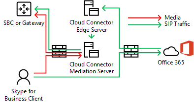

# 클라우드 커넥터 에디션에 미디어 바이패스 계획Plan for media bypass in Cloud Connector Edition
 
Cloud Connector Edition 버전 2.0 이상에서 미디어 바이패스를 구현 하기 위한 계획 고려 사항을 검토 하려면이 항목을 읽어 보십시오.Read this topic to review planning considerations for implementing media bypass with Cloud Connector Edition version 2.0 and later. 미디어 바이패스를 배포 하는 방법에 대 한 자세한 내용은 [Cloud Connector Edition에서 미디어 바이패스 배포](deploy-media-bypass-in-cloud-connector.md)를 참조 하세요.For information about deploying media bypass, see [Deploy media bypass in Cloud Connector Edition](deploy-media-bypass-in-cloud-connector.md).
  
미디어 바이패스는 클라이언트가 공중 전화망 (PSTN) 다음 홉 (게이트웨이 또는 세션 경계 컨트롤러)에 미디어를 직접 보낼 수 있도록 허용 하 고 미디어 경로에서 클라우드 커넥터 Edition 구성 요소를 제거 하는 데 사용 됩니다.Media bypass allows a client to send media directly to the Public Switched Telephone Network (PSTN) next hop—a gateway or Session Border Controller (SBC)—and eliminate the Cloud Connector Edition component from the media path.
  
미디어 바이패스는 대기 시간, 패킷 손실 가능성 및 잠재적 실패 지점의 수를 줄여 음성 품질을 향상 시킬 수 있습니다.Media bypass can improve voice quality by reducing latency, the possibility of packet loss, and the number of points of potential failure. 바이패스 된 통화에 대 한 미디어 처리를 제거 하면 클라우드 커넥터의 부하가 줄어들고,이를 통해 더 많은 동시 호출이 가능 하며 확장성이 향상 될 수 있습니다.Elimination of media processing for bypassed calls reduces the load on Cloud Connector, which enables a higher number of concurrent calls, and can improve scalability. 
  
 미디어 처리 작업에서 클라우드 커넥터를 해제 하면 인프라에 필요한 클라우드 커넥터 기기의 수가 줄어들 수 있으므로 가능한 경우 미디어 바이패스를 사용 하도록 설정 해야 합니다.Freeing Cloud Connector from media processing tasks may reduce the number of Cloud Connector appliances an infrastructure requires, so you should enable media bypass whenever possible.
  
## 미디어 바이패스가 미디어 및 신호 경로에 영향을 주는 방식How media bypass affects media and signaling pathways

신호 신호가 미디어 바이패스를 포함 하거나 사용 하지 않고 같은 경로를 사용 하는 경우 미디어 흐름은 서로 다릅니다.While signaling takes the same path with or without media bypass, the media flow will differ. 다음 다이어그램에서는 미디어 바이패스를 포함 하는 토폴로지와 없는 토폴로지의 미디어 및 신호 경로를 보여 줍니다.The following diagrams show media and signaling pathways in topologies with and without media bypass. 
  
예를 들어 미디어 바이패스를 사용 하지 않는 다음 토폴로지에서 (비즈니스용 Skype 클라이언트)는 외부 번호로 PSTN 전화를 걸어 SIP 신호가 Office 365로 이동 하 고, Office 365가 최종 사용자 음성 정책에 따라 신호 트래픽을 전달 합니다.For example, in the following topology—which does not employ media bypass—a Skype for Business client places a PSTN call to an external number, the SIP signaling goes to Office 365, and Office 365 then directs the signaling traffic according to the end-user voice policy. 클라우드 커넥터 사용자는 음성 정책이 클라우드 커넥터에 지 서버에 신호 트래픽을 전달 하 고, 그러면 클라우드 커넥터 중재 서버를 통해 신호 트래픽을 SBC (PSTN 세션 경계 컨트롤러) 또는 게이트웨이로 라우팅합니다.For Cloud Connector users, the voice policy directs signaling traffic to the Cloud Connector Edge Server, which then routes the signaling traffic to a PSTN Session Border Controller (SBC) or gateway via the Cloud Connector Mediation Server. 다음 다이어그램에 나와 있는 것 처럼 비즈니스용 Skype 클라이언트에서 클라우드 커넥터 중재 서버로 이동 하 고 SBC 또는 게이트웨이로 흐릅니다.Media flows from the Skype for Business client to the Cloud Connector Mediation Server, and then to the SBC or gateway, as shown in the following diagram:
  
**미디어 바이패스 없이 미디어 및 신호 경로****Media and signaling pathways without media bypass**

  
PSTN 으로부터의 인바운드 통화는 역방향 방향으로 동일한 신호 경로를 사용 합니다.An inbound call from the PSTN uses the same signaling path in the reverse direction. 내부 사용자의 경우에도 미디어는 궁극적으로 비즈니스용 Skype 클라이언트와 클라우드 커넥터 중재 서버와 SBC 또는 게이트웨이 간에 진행 됩니다.For internal users, media will still ultimately flow between the Skype for Business client and the Cloud Connector Mediation Server and then the SBC or gateway.
  
미디어 바이패스를 사용 하는 다음 토폴로지의 경우 신호 신호가 같은 경로를 취하고, 미디어는 다음 다이어그램에 나와 있는 것 처럼 비즈니스용 Skype 클라이언트와 SBC 또는 게이트웨이 간에 직접 흐릅니다.In the next topology—which does employ media bypass—signaling takes the same path, but media flows directly between the Skype for Business client and the SBC or gateway, as shown in the following diagram:
  
**미디어 바이패스를 사용한 미디어 및 신호 경로****Media and signaling pathways with media bypass**

  
## 다중 사이트 시나리오 및 미디어 바이패스Multi-site scenario and media bypass

미디어 바이패스는 단일 클라우드 커넥터 기기를 사용 하 여 여러 사이트에 전화 통신 서비스를 제공 하려는 경우에도 유용 합니다.Media bypass is also useful when you want to provide telephony services to multiple sites using a single Cloud Connector appliance. 클라우드 커넥터는 원본 또는 대상 번호를 기반으로 통화를 라우팅할 수 없기 때문에 대부분의 기업은 클라우드 커넥터 뒤에 SBC 또는 게이트웨이를 배포 하 여 라우팅을 결정 합니다.Because Cloud Connector cannot route calls based on source or destination numbers, most enterprises deploy an SBC or gateway behind Cloud Connector to make routing decisions. 이 시나리오의 미디어 바이패스는 다음 다이어그램에 나와 있는 것 처럼 클라이언트와 중앙 SBC 또는 게이트웨이 간의 홉을 제거 합니다.Media bypass in this scenario eliminates the hop between the client and the central SBC or gateway, as shown in the following diagram:
  
**다중 사이트 응용 프로그램****Multi-site application**

  
1. SIP 트래픽이 취리히 정규의 사용자에서 Office 365로 흐릅니다.The SIP traffic flows from the user in Zurich to Office 365.
    
2. 그런 다음이 트래픽은 사용자 음성 라우팅 정책에 지정 된 암스테르담의 클라우드 커넥터 기기로 라우팅합니다.The traffic then routes to the Cloud Connector appliance in Amsterdam as specified in the user voice routing policy.
    
3. 암스테르담의 클라우드 커넥터 기기가 암스테르담의 중앙 게이트웨이로 SIP 트래픽을 전송 합니다.The Cloud Connector appliance in Amsterdam sends the SIP traffic to the central gateway in Amsterdam.
    
4. 암스테르담의 중앙 게이트웨이는 적절 한 라우팅 의사 결정을 수행한 후에 취리히 정규에서 SBC 또는 게이트웨이로 트래픽을 전송 하는 반면, 미디어는 고객의 비즈니스용 Skype 클라이언트와 SBC 또는 gateway (암스테르담) 사이에 직접 흐릅니다.The central gateway in Amsterdam makes the appropriate routing decisions, and then sends the traffic to an SBC or gateway in Zurich, while media flows directly between the Skype for Business client and SBC or gateway in Amsterdam.
    
   이 방법을 사용 하면 클라우드 커넥터가 중앙 집중식으로 하나의 클라우드 커넥터 배포에 따라 더 많은 사용자를 처리할 수 있습니다.This approach allows serving more users per one Cloud Connector deployment where Cloud Connector is centralized. 클라우드 커넥터가 미디어 경로에서 제거 되었지만 중앙 집중식 다중 사이트 시나리오 미디어에서는 중앙 SBC 또는 게이트웨이를 통해 이동 하는 데 필요한 만큼 WAN을 두 번 트래버스할 수 있습니다.Even though Cloud Connector is eliminated from the media path, in a centralized multi-site scenario media may still traverse the WAN twice as required to flow through the centralized SBC or gateway.
  
클라이언트가 회사 네트워크 외부에 있는 경우 아웃 바운드 호출을 수행 하는 경우 미디어 트래픽은 다음 다이어그램과 같이 클라우드 커넥터의 Edge 및 중재 서버와 취리히 정규 사이의 WAN 링크를 통해 흐릅니다.If a client is outside the corporate network placing an outbound call, the media traffic flows via the Edge and Mediation servers of Cloud Connector and WAN link between Zurich and Amsterdam, as shown in the following diagram:
  

  
## 미디어 바이패스를 위해 지원 되는 클라이언트Supported clients for media bypass

첫 번째 버전의 미디어 바이패스를 사용 하는 경우 유일 하 게 지원 되는 클라이언트는 비즈니스용 Skype 2016 Windows 클라이언트 이며 Microsoft 365 앱 for enterprise 버전 16.0.7870.2020 이상입니다.With the first release of media bypass, the only supported client is the Skype for Business 2016 Windows Client that is part of Microsoft 365 Apps for enterprise, version 16.0.7870.2020 or greater. 고객은 모든 채널을 사용할 수 있습니다 (현재, 지연 또는 첫 번째 릴리스 연기 됨).Customers can use any channel: Current, Deferred, or First Release Deferred. 
  
> [!NOTE]
> 비즈니스용 Skype 클라이언트와 함께 클라이언트 VPN 솔루션을 사용 하는 경우에는 VPN 분할 터널링 구성 에서만 미디어 바이패스를 사용할 수 있습니다.If you are using a client VPN solution in combination with the Skype for Business client, then media bypass is supported only with a VPN split-tunnel configuration. 
  
릴리스 채널에 대 한 자세한 내용은 Overview for [Microsoft 365 Apps for enterprise 용 업데이트 채널 개요](https://support.office.com/article/Overview-of-update-channels-for-Office-365-ProPlus-9ccf0f13-28ff-4975-9bd2-7e4ea2fefef4?ui=en-US&amp;rs=en-US&amp;ad=US)를 참조 하세요.For more information about the release channels, see [Overview of update channels for Microsoft 365 Apps for enterprise](https://support.office.com/article/Overview-of-update-channels-for-Office-365-ProPlus-9ccf0f13-28ff-4975-9bd2-7e4ea2fefef4?ui=en-US&amp;rs=en-US&amp;ad=US).
  
현재 버전의 다른 채널에 있는 클라이언트에 대 한 [릴리스 정보는 Microsoft 365 앱 for enterprise 업데이트](https://docs.microsoft.com/officeupdates/release-notes-office365-proplus)를 참조 하세요.For the current release version of the clients in different channels, see [Release information for updates to Microsoft 365 Apps for enterprise](https://docs.microsoft.com/officeupdates/release-notes-office365-proplus). 
  
## 미디어 바이패스를 사용한 클라우드 커넥터 용량 고려 사항Cloud Connector capacity considerations with media bypass

미디어 바이패스를 사용 하지 않고 하드웨어에 따라, 클라우드 커넥터 기기는 중재 서버를 통해 미디어를 이동 해야 하는 동시 통화를 통해 50에서 500로 처리할 수 있습니다.Without media bypass—and depending on the hardware—a Cloud Connector appliance can handle from 50 to 500 simultaneous calls that require media to travel through a Mediation Server. 자세한 내용은 [비즈니스용 Skype 클라우드 Connector Edition 계획](https://technet.microsoft.com/library/mt605227.aspx)을 참조 하십시오.For more information, see [Plan for Skype for Business Cloud Connector Edition](https://technet.microsoft.com/library/mt605227.aspx). 
  
미디어 바이패스를 사용 하도록 설정 하면 지원 되는 버전의 내부 클라이언트에서 중재 서버를 사용 하지 않으므로 내부 클라이언트의 수가 현저 하 게 증가할 수 있습니다.With media bypass enabled, internal clients on the supported version do not use the Mediation Server, so the number of internal clients can increase significantly. 
  
위에서 설명한 것 처럼 외부 클라이언트나 지원 되지 않는 클라이언트는 미디어에 대 한 클라우드 커넥터에 지 및 중재 서버를 사용 합니다.As noted above, external clients or unsupported clients will use the Cloud Connector Edge and Mediation servers for media. 사이트에 포함 해야 하는 클라우드 커넥터 기기의 수를 계산할 때는 외부 사용자의 트래픽과 지원 되지 않는 클라이언트의 사용자를 고려해 야 합니다.When calculating how many Cloud Connector appliances should be placed in a site, you must consider traffic from external users and users on unsupported clients.
  
## 클라우드 커넥터가 항상 바이패스 모드를 지원 합니다.Cloud Connector supports Always Bypass mode

클라우드 커넥터는 항상 바이패스 모드를 지원 합니다.Cloud Connector supports Always Bypass mode only. 온-프레미스 환경에는 항상 사이트 및 지역 정보를 무시 하 고 사용 하는 두 가지 옵션이 있습니다.In on-premises environments, there are two options: Always Bypass and Use Site and Region Information.
  
항상 바이패스는 내부 클라이언트를 사용한 모든 PSTN 호출에 대해 미디어 바이패스가 원본 또는 대상 지점으로 시도 됨을 의미 합니다.Always Bypass means that media bypass will be attempted for all PSTN calls with internal clients as an origin or destination point. 해당 클라이언트가 내부 인지 외부 인지 확인 하기 위해 중재 서버 가상 컴퓨터의 웹 사이트를 사용 합니다.To determine if the client is internal or external, a web site on the mediation server virtual machine is used. 클라이언트가 사이트에 연결할 수 있으면 내부 및 미디어 바이패스를 사용 하는 것으로 간주 됩니다.If the client can reach the site, it is considered internal and media bypass is used. 클라이언트가 사이트에 연결할 수 없는 경우 (예: 클라이언트가 홈 네트워크에 있는 경우) 미디어 바이패스를 사용 하지 않습니다.If the client cannot reach the site (for example the client is on a home network), media bypass is not used. 
  
Always Bypass에서는 PSTN 사이트 내의 사용자와 PSTN 게이트웨이 간에 장애물이 없는 연결을 사용 해야 합니다.Always Bypass requires unobstructed connectivity between users and the PSTN gateways within a PSTN Site. 
  
자세한 내용은 [비즈니스용 Skype 클라우드 Connector Edition 계획](https://technet.microsoft.com/library/mt605227.aspx)을 참조 하십시오.For more information, see [Plan for Skype for Business Cloud Connector Edition](https://technet.microsoft.com/library/mt605227.aspx). 
  
예를 들어 아래 다이어그램에서 유럽 사용자는 기본적으로 서울에 있는 3 개의 세션 테두리 컨트롤러 (sbc)에 연결 되어 있어야 하지만, 미국 서 부 사용자는 시애틀에 있는 두 개의 지역에 잘 연결 되어 있어야 합니다.For example, in the diagram below, Europe users must be well connected to the three Session Border Controllers (SBCs) in Amsterdam while US West users must be well connected to the two SBCs in Seattle. 연결 됨은 해당 사용자가 지리적 또는 게이트웨이와 동일한 네트워크 사이트에 있거나 적절 한 대역폭이 있는 WAN 링크를 통해 존재 합니다.Well connected means that they are either located in the same network sites as the SBCs or gateways, or over WAN links that have proper bandwidth.
  

  
> [!NOTE]
> 취리히 정규의 사용자가 시애틀 사무실로 이동 하 고 내부 네트워크를 사용 하 여 유럽의 여행 중인 사용자와 게이트웨이 사이에 미디어 트래픽을 배달 하려는 경우 (인터넷을 통해 이동 하는 것과는 반대), 해당 유럽 지역 또는 게이트웨이가 해당 지역에 연결 되어 있는지 확인 해야 합니다.If a user from Zurich travels to the Seattle office, and you want to use the internal network to deliver media traffic between the traveling user and gateways in Europe (as opposed to going over the Internet), then you must make sure the Seattle office and the Amsterdam office where European SBCs or gateways are located qualify as well connected. 
  
## 미디어 바이패스에 사용 되는 코덱Codecs used in media bypass

미디어 바이패스를 사용 하도록 설정 된 상태에서 클라이언트와 SBC 또는 gateway 간의 미디어 트래픽은 g.711 코덱을 사용 합니다.With media bypass enabled, media traffic between a client and an SBC or gateway uses the G.711 codec. 
  
## 참고 항목See also

[클라우드 커넥터 Edition에 미디어 바이패스 배포Deploy media bypass in Cloud Connector Edition](deploy-media-bypass-in-cloud-connector.md)
