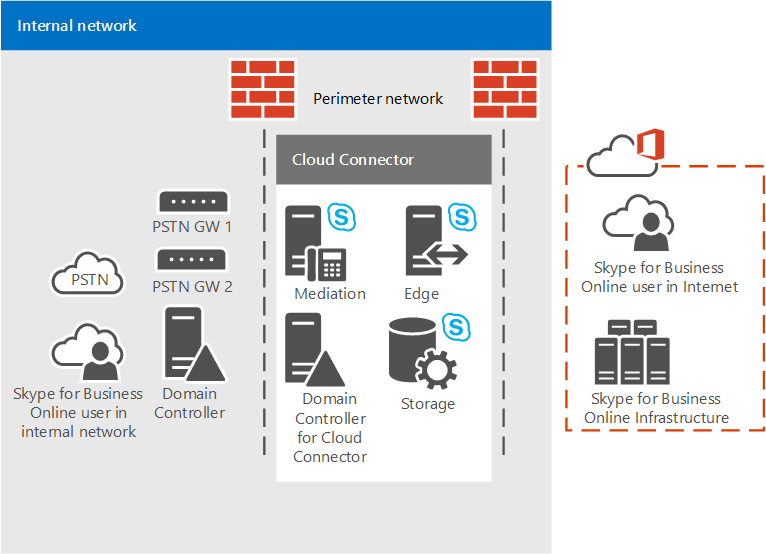
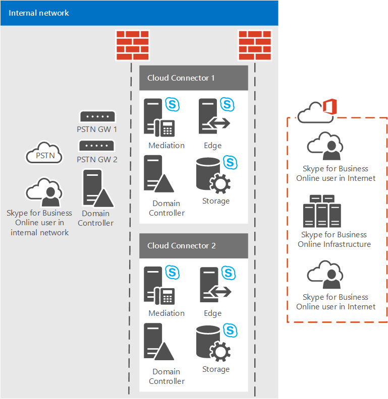

# <a name="plan-for-skype-for-business-cloud-connector-edition"></a>비즈니스용 Skype 클라우드 커넥터 버전 계획

> [!Important]
> Cloud Connector Edition은 2021년 7월 31일 비즈니스용 Skype Online과 함께 사용 중지됩니다. 조직이 Teams로 업그레이드한 후 직접 라우팅을 사용하여 프레미스 전화 통신 네트워크를 Teams에 연결하는 [방법을 배워야 합니다.](https://docs.microsoft.com/MicrosoftTeams/direct-routing-landing-page)

비즈니스용 Skype 클라우드 커넥터 버전(클라우드 PBX)을 통해 전화 시스템(클라우드 PBX)을 사용하여 온라인 PSTN 연결을 구현하는 패키지된 VM(가상 컴퓨터) 집합에 대한 정보를 찾아볼 수 있습니다.

기존 Lync Server 또는 비즈니스용 Skype 서버 배포가 아직 없는 경우 클라우드 커넥터 버전이 조직에 적합한 솔루션일 수 있습니다. 비즈니스에 적합한 전화 시스템 솔루션을 계속 조사하고 있는 경우 Microsoft 전화 통신 [솔루션을 참조하세요.](https://docs.microsoft.com/SkypeForBusiness/hybrid/msft-telephony-solutions)

이 문서에서는 Cloud Connector Edition 요구 사항 및 지원되는 토폴로지에 대해 설명하고 Cloud Connector Edition 배포를 계획하는 데 도움이 됩니다. 클라우드 커넥터 환경을 구성하기 전에 이 항목을 읽어야 합니다. Cloud Connector Edition을 배포 및 구성할 준비가 되면 비즈니스용 Skype 클라우드 커넥터 버전 구성 [및 관리를 참조하세요.](configure-skype-for-business-cloud-connector-edition.md)

클라우드 커넥터 버전 2.1을 사용할 수 있습니다. 아직 2.1로 업그레이드하지 않은 경우 새 버전의 클라우드 커넥터로 [업그레이드를 참조합니다.](upgrade-to-a-new-version-of-cloud-connector.md) 설치 파일은 에서 찾을 수 [https://aka.ms/CloudConnectorInstaller](https://aka.ms/CloudConnectorInstaller) 있습니다.

> [!NOTE]
> Microsoft는 새 버전이 릴리스된 후 60일 동안 이전 버전의 Cloud Connector Edition을 지원합니다. Microsoft는 업그레이드 시간을 허용하기 위해 2.1 릴리스 후 60일 동안 버전 2.0.1을 지원할 것입니다. 2.0.1 이전의 모든 버전은 더 이상 지원되지 않습니다.

Cloud Connector Edition은 전화 시스템과의 On-프레미스 PSTN 연결을 구현하는 패키지된 VM(가상 컴퓨터) 집합으로 구성된 하이브리드 제품입니다. 가상화된 환경에 최소한의 비즈니스용 Skype 서버 토폴로지 배포를 통해 클라우드에 있는 조직의 사용자는 Microsoft 클라우드에서 PBX 서비스를 받을 수 있지만 PSTN 연결은 기존 온라인 음성 인프라를 통해 제공됩니다.


클라우드 커넥터를 사용하면 전화 시스템 서비스를 기존 전화 통신 환경(예: PBX, 아날로그 장치 및 콜 센터)과 통합할 수 있기 때문에 기존 전화 통신 솔루션에서 전화 시스템으로의 단계적 마이그레이션을 구현할 수 있습니다.

예를 들어 회사에 전화 시스템에서 제공하지 않는 특정 기능이 있는 정교한 콜 센터가 있는 것으로 가정합니다. 기존 솔루션으로 콜 센터 사용자를 그대로 두고 다른 사용자를 전화 시스템으로 이동할 수 있습니다.

클라우드 커넥터는 온라인에 있는 사용자 간의 라우팅을 제공하고 전화 시스템과 함께 자체 PSTN 공급자를 사용하기로 선택할 수 있습니다.

Cloud Connector Edition 배포를 계획할 때 다음을 고려하십시오.

- 클라우드 커넥터를 사용하여 클라우드 음성 솔루션을 활용하려면 전화 시스템을 포함하는 Microsoft 365 또는 Office 365 조직에 등록해야 합니다. 아직 Microsoft 365 또는 Office 365 조직이 없는 경우 비즈니스용 [Microsoft 365에서](https://products.office.com/business/office)등록하는 방법을 배울 수 있습니다. 비즈니스용 Skype Online이 포함된 요금제에 등록해야 합니다.

- 비즈니스용 Skype Online 서비스에 클라우드 커넥터 어플라이언스를 등록하고 다양한 cmdlet을 실행하려면 Cloud Connector 2.0 이상에 비즈니스용 Skype 테넌트 관리자 권한이 있는 전용 Microsoft 365 또는 Office 365 계정이 필요합니다. 2.0 이전의 클라우드 커넥터 버전에는 테넌트 전역 관리자 권한이 있는 전용 Microsoft 365 또는 Office 365 계정이 필요합니다.

- 클라우드 커넥터에는 전체 비즈니스용 Skype 서버 배포가 필요하지 않습니다.

    현재 클라우드 커넥터는 Lync 또는 비즈니스용 Skype 온-프레미스 서버와 함께 사용할 수 없습니다. 기존 Lync 또는 비즈니스용 Skype 사용자를 Microsoft 365로 이동하고 사용자에게 온-프레미스 전화 통신을 계속 제공하려는 경우 기존 비즈니스용 Skype 서버 배포를 사용하여 온-프레미스 연결을 사용하는 전화 시스템을 사용하는 것이 좋습니다. 자세한 내용은 비즈니스용 Skype 서버에서 전화 [시스템(클라우드 PBX)](plan-your-phone-system-cloud-pbx-solution.md) 솔루션 계획 및 비즈니스용 Skype 서버의 PSTN 연결을 통해 전화 시스템 계획(Plan Phone System)을 [참조하세요.](plan-phone-system-with-on-premises-pstn-connectivity.md)

- 이전 비즈니스용 Skype 또는 Lync Server 배포가 있는 경우 해당 환경에서 모든 비즈니스용 Skype 또는 Lync Server 구성 요소를 제거한 경우 클라우드 커넥터 배포에 대한 스마마를 정리할 필요가 없습니다.

- 사용자가 온라인에 있습니다.

- 조직에서 DirSync(디렉터리 동기화)를 구성한 경우 하이브리드 음성으로 계획된 모든 사용자 계정을 온-프레미스 배포에서 먼저 만든 다음 클라우드와 동기화해야 합니다.

- 필요한 경우 현재 PSTN 통신 사업자에 보관할 수 있습니다.

- 클라우드 커넥터에서 호스트된 사용자에게 전화 접속 회의를 제공하려는 경우 PSTN 회의 라이선스를 구입하거나 Microsoft에서 오디오 회의 제안을 진행할 때 비용을 지불할 수 있습니다.

- 통화 에스컬링에 필요한 오디오 회의 라이선스(또는 제안 시 결제)도 필요합니다. 비즈니스용 Skype 사용자가 외부 PSTN 사용자로부터 전화를 받고 해당 통화에 참가자를 하나 더 추가(전화 회의로 에스컬링)하려는 경우 Microsoft 오디오 회의 서비스를 통해 에스컬레이터가 수행됩니다.

- 클라우드 커넥터 2.0 이상은 이제 미디어 우회를 지원합니다. 미디어 우회를 통해 클라이언트는 게이트웨이 또는 SBC(Session Border Controller)인 PSTN(Public Switched Telephone Network) 다음 홉으로 직접 미디어를 보내고 미디어 경로에서 Cloud Connector Edition 구성 요소를 제거할 수 있습니다. 자세한 내용은 [Cloud Connector Edition의 미디어 우회 계획을 참조하세요.](plan-for-media-bypass-in-cloud-connector-edition.md)

- Cloud Connector 2.1 이상에서는 OMS(Operations Management Suite)를 사용하여 클라우드 커넥터 모니터링을 지원할 수 있습니다. 자세한 내용은 [OMS(Operations Management Suite)를](monitor-cloud-connector-using-operations-management-suite-oms.md) 사용하여 클라우드 커넥터 모니터링을 참조하세요.

- 클라우드 커넥터는 Office 365 Enterprise E5를 사용할 수 있는 모든 국가에서 사용할 수 있습니다.

이 항목에는 다음 섹션이 포함되어 있습니다.

- [Cloud Connector Edition 구성 요소](plan-skype-for-business-cloud-connector-edition.md#BKMK_Components)

- [Cloud Connector Edition 토폴로지](plan-skype-for-business-cloud-connector-edition.md#BKMK_Topologies)

- [배포 요구 사항](plan-skype-for-business-cloud-connector-edition.md#BKMK_Requirements)

- [배포 전에 수집해야 하는 정보](plan-skype-for-business-cloud-connector-edition.md#BKMK_PlanDeployment)

- [다이얼 플랜 고려 사항](plan-skype-for-business-cloud-connector-edition.md#BKMK_DailPlan)

- [고가용성 고려 사항](plan-skype-for-business-cloud-connector-edition.md#BKMK_HA)

- [클라우드 커넥터 미디어 흐름](plan-skype-for-business-cloud-connector-edition.md#BKMK_MediaFlow)

- [모니터링 및 문제 해결](plan-skype-for-business-cloud-connector-edition.md#BKMK_Monitor)

- [자세한 내용](plan-skype-for-business-cloud-connector-edition.md#BKMK_MoreInfo)

## <a name="cloud-connector-edition-components"></a>Cloud Connector Edition 구성 요소
<a name="BKMK_Components"> </a>

Cloud Connector Edition을 사용하면 에지 구성 요소, 중재 구성 요소 및 CMS(중앙 관리 저장소) 역할로 구성된 최소한의 비즈니스용 Skype 서버 토폴로지가 포함된 패키지된 VM 집합을 배포합니다. 클라우드 커넥터의 내부 기능에 필요한 도메인 컨트롤러도 설치합니다. 이러한 서비스는 비즈니스용 Skype Online 서비스를 포함하는 Microsoft 365 또는 Office 365 조직과의 하이브리드를 위해 구성됩니다.


클라우드 커넥터 구성 요소는 다음과 같은 기능을 제공합니다.

- **에지** 구성 요소 - 다음 구성 요소를 포함하는 에지 구성 요소를 통해 통신하는 데 사용할 수 있는 에지 구성 요소입니다.

  - **액세스 에지** -온-프레미스 배포와 비즈니스용 Skype Online 간의 SIP 라우팅을 제공합니다.

  - **미디어 릴레이** - 중재 구성 요소와 기타 미디어 끝점 간의 미디어 라우팅을 제공합니다.

  - **미디어 릴레이 인증/ MRAS** - 미디어 릴레이에 액세스하기 위한 토큰을 생성합니다.

- **아웃바운드 라우팅** - 클라우드 커넥터 어플라이언스에 연결된 게이트웨이 또는 SBC 간의 음성 트래픽 부하 분산을 제공합니다. 통화는 클라우드 커넥터 어플라이언스에 연결된 모든 게이트웨이 또는 SBC 간에 고르게 분할됩니다.

    정책을 기반으로 게이트웨이에 대한 라우팅을 제공합니다. 대상(아웃바운드) PSTN 번호를 기반으로 하는 전역 정책만 지원됩니다.

- **CMS(중앙 관리 저장소) 역할** - CMS 파일 전송을 비롯한 토폴로지 구성 요소의 구성 저장소를 포함합니다.

- **CMS(중앙 관리 저장소) 복제본** - CMS 역할 서버에 있는 전역 CMS DB의 구성 정보를 동기화합니다.

- **도메인 컨트롤러** - 클라우드 커넥터 구성 요소를 배포하는 데 필요한 모든 전역 설정 및 그룹을 저장하는 클라우드 커넥터 Active Directory 도메인 서비스입니다. 각 Cloud Connector 어플라이언스에 대해 하나의 포리스트가 만들어집니다. 도메인 컨트롤러는 프로덕션 Active Directory와 연결되어 있지 않을 수 있습니다. Active Directory 서비스에는 다음이 포함됩니다.

  - Active Directory Domain Services

  - 내부 인증서를 발급하기 위한 Active Directory 인증서 서비스

- **중재 구성** 요소 - 비즈니스용 Skype와 PSTN 게이트웨이 간의 SIP 및 미디어 게이트웨이 매핑 프로토콜을 구현합니다. 전역 CMS 데이터베이스의 구성을 동기화하는 CMS 복제본을 포함합니다.

## <a name="cloud-connector-edition-topologies"></a>Cloud Connector Edition 토폴로지
<a name="BKMK_Topologies"> </a>

이 설명을 위해 PSTN 사이트를 참조합니다. PSTN 사이트는 동일한 위치에 배포되고 공통 PSTN 게이트웨이가 연결된 클라우드 커넥터 어플라이언스의 조합입니다. PSTN 사이트를 통해 다음을 할 수 있습니다.

- 사용자에게 가장 가까운 게이트웨이에 대한 연결을 제공합니다.

- 하나 이상의 PSTN 사이트에 여러 Cloud Connector 어플라이언스를 배포하여 확장성을 허용합니다.

- 단일 PSTN 사이트 내에 여러 클라우드 커넥터 어플라이언스를 배포하여 고가용성을 허용합니다.

이 항목에서는 PSTN 사이트를 소개합니다. PSTN 사이트 계획에 대한 자세한 내용은 [Cloud Connector Edition PSTN 사이트 계획(Plan for Cloud Connector Edition PSTN sites)을 참조하세요.](plan-for-cloud-connector-edition-pstn-sites.md)

다음과 같은 클라우드 커넥터 토폴로지가 배포될 수 있습니다.

- PSTN 사이트당 단일 Cloud Connector Edition 어플라이언스 이 토폴로지는 고가용성을 제공하지 못하기 때문에 평가 목적으로만 권장됩니다.

- 고가용성을 제공하기 위해 PSTN 사이트당 여러 클라우드 커넥터 버전 어플라이언스

- 여러 Cloud Connector Edition 어플라이언스가 있는 여러 PSTN 사이트로, 고가용성을 제공합니다. 최대 200개 사이트를 배포할 수 있습니다.

토폴로지 계획 시에는 다음을 고려하십시오.

- 클라우드 커넥터 2.0 이상을 사용할 경우 하나의 PSTN 사이트에 최대 16대의 클라우드 커넥터 어플라이언스를 사용할 수 있습니다. 이전 버전에서는 사이트당 최대 4대의 어플라이언스를 지원했습니다.

- 클라우드 커넥터를 사용하여 테스트된 하드웨어 구성에는 두 가지 유형이 있습니다.

  - 더 큰 버전은 많은 동시 통화를 처리할 수 있으며 모든 유형의 프로덕션 환경에서 지원됩니다.

  - 더 작은 버전은 저급 하드웨어에서 실행하기 위한 것이고 평가 목적으로 또는 통화량이 적은 사이트에 사용할 수 있습니다. 더 작은 버전의 클라우드 커넥터를 배포하는 경우 프로덕션급 하드웨어 요구 사항(예: 이중 전원 공급 장치)에 유의해야 합니다.

- 클라우드 커넥터 버전 2.0 이상이 있는 경우 최대 16대의 어플라이언스 구성(더 큰 하드웨어)을 배포하는 경우 PSTN 사이트에서 최대 8,000개 동시 통화를 처리할 수 있습니다. 더 작은 버전을 배포하는 경우 지원되는 제한은 800입니다.

    또한 고가용성을 위해 일부 어플라이언스를 전담해야 합니다. 고가용성을 위해 하나의 어플라이언스를 예약하는 것이 좋습니다.

  - 버전 2에서는 15+1 구성을 배포하는 경우 PSTN 사이트에서 최대 7,500개 동시 통화를 처리할 수 있습니다.

  - 이전 버전이 있으며 최대 3 + 1 구성(더 큰 하드웨어)을 배포하는 경우 PSTN 사이트에서 최대 1500개 동시 통화를 처리할 수 있습니다. 더 작은 버전을 배포하는 경우 지원되는 제한은 150개입니다.

-  PSTN 사이트당 더 많은 통화가 필요한 경우 동일한 위치에 추가 PSTN 사이트를 배포하여 확장할 수 있습니다.

> [!NOTE]
> 설명하지 않은 한 아래 다이어그램과 예제에서는 더 큰 버전의 클라우드 커넥터를 사용했다고 가정합니다.

### <a name="single-cloud-connector-appliance-within-a-single-pstn-site"></a>단일 PSTN 사이트 내의 단일 클라우드 커넥터 어플라이언스

다음 다이어그램은 단일 PSTN 사이트 내의 단일 Cloud Connector Edition 어플라이언스를 보여 주며, 클라우드 커넥터는 보안을 위해 경계 네트워크 내에 있는 하나의 실제 호스트 컴퓨터에 설치된 4개의 VM으로 구성됩니다.



### <a name="multiple-cloud-connector-appliances-within-a-single-pstn-site"></a>단일 PSTN 사이트 내의 여러 클라우드 커넥터 어플라이언스

 확장성 및 고가용성을 위해 다음 다이어그램과 같이 단일 PSTN 사이트에 여러 클라우드 커넥터 에디션을 사용할 수 있습니다. 다음 사항을 고려합니다.

- 통화는 한 풀의 클라우드 커넥터 간에 임의로 분산됩니다.

- 용량 계획을 위해 다음 계산에 따라 하나 이상의 클라우드 커넥터가 오프라인으로 전환되는 경우 부하를 처리할 수 있는 기능을 고려해야 합니다.

  - **N+1개 상자** 더 큰 버전의 클라우드 커넥터의 경우 N+1 상자는 가용성이 99.8%인 500 N 동시 통화를 \* 지원합니다.

    더 작은 버전의 클라우드 커넥터의 경우 N+1 상자는 가용성이 99.8%인 50 N 동시 통화를 \* 지원합니다.

  - **N+2개 상자** 더 큰 버전의 클라우드 커넥터의 경우 N+2 상자는 가용성이 99.9%인 500 N 동시 통화를 \* 지원합니다.

    더 작은 버전의 클라우드 커넥터의 경우 N+2 상자는 가용성이 99.9%인 50 N 동시 통화를 \* 지원합니다.



### <a name="multiple-pstn-sites-with-one-or-more-cloud-connectors-per-site"></a>사이트당 클라우드 커넥터가 하나 이상 있는 여러 PSTN 사이트

각 사이트에 클라우드 커넥터 버전이 하나 이상 포함된 여러 PSTN 사이트를 선택할 수도 있습니다. PSTN 사이트가 동시 통화 제한에 도달하면 부하를 처리할 다른 PSTN 사이트를 추가할 수 있습니다.

여러 PSTN 사이트를 통해 사용자에게 가장 가까운 게이트웨이에 대한 연결을 제공할 수도 있습니다. 예를 들어 시애틀과 암스테르담에 PSTN 게이트웨이가 있는 경우를 가정해 보겠습니다. 시애틀에 하나씩, 암스테르담에 있는 PSTN 사이트 두 개를 배포하고 가장 가까운 PSTN 사이트를 사용할 사용자를 할당할 수 있습니다. 시애틀의 사용자는 시애틀 PSTN 사이트 및 게이트웨이로 라우팅되는 반면 암스테르담의 사용자는 암스테르담 PSTN 사이트 및 게이트웨이로 라우팅됩니다.


## <a name="requirements-for-deployment"></a>배포 요구 사항
<a name="BKMK_Requirements"> </a>

Cloud Connector Edition을 배포하기 전에 환경에 대한 다음이 있는지 확인하십시오.

- **호스트 컴퓨터 -** 클라우드 커넥터 VM은 Hyper-V 역할을 사용하도록 설정된 Windows Server 2012 R2 Datacenter edition(영어)을 실행하는 전용 하드웨어에 배포해야 합니다.

    버전 2.0 이상에서는 비즈니스용 Skype Corpnet 스위치에 바인딩된 호스트 컴퓨터 네트워크 카드에 클라우드 커넥터 회사 네트워크 컴퓨터와 동일한 서브넷에 IP 주소가 구성되어 있어야 합니다.

- 2.1 이상 버전의 경우 호스트 어플라이언스에 .NET Framework 4.6.1 이상이 설치되어 있어야 합니다.

- **가상 컴퓨터 -** R2 Windows Server 2012(영어) 이미지(.iso)입니다. ISO는 비즈니스용 Skype 클라우드 커넥터 Edition을 실행할 가상 컴퓨터의 VHD로 변환됩니다.

- 배포의 각 Cloud Connector Edition에 대해 4개 VM의 설치를 지원하는 데 필요한 하드웨어입니다. 권장되는 구성은 다음과 같습니다.

  - 64비트 듀얼 프로세서, 코어 6개(실제 코어 12개), 2.50GHz 이상

  - 64GB ECC RAM

  - RAID 5 구성에서 구성된 600GB 이상 10K RPM 128M 캐시 SAS 6Gbps 디스크 4개

  - 1Gbps RJ45 높은 수준의 네트워크 어댑터 3개

- 최대 50개 동시 통화를 지원하는 더 작은 버전의 Cloud Connector Edition을 배포하려면 다음 하드웨어가 필요합니다.

  - Intel i7 4790 쿼드 코어 및 Intel 4600 그래픽(고급 그래픽 필요 없음)

  - 32GB DDR3-1600 NON ECC

  - 2: RAID 0의 1TB 7200RPM SATA III(6Gbps)

  - 2: 1Gbps 이더넷(RJ45)

- 호스트 컴퓨터의 인터넷 검색을 위해 프록시 서버가 필요한 경우 다음 구성을 변경해야 합니다.

  - 프록시를 무시하려면 프록시 서버와 "192.168.213"을 비롯한 우회 목록과 함께 설정된 WinHTTP 프록시 설정을 \* 지정합니다. 클라우드 커넥터 관리 서비스 및 비즈니스용 Skype Corpnet 서브넷에서 사용하는 네트워크가 CloudConnector.ini 있습니다. 그렇지 않으면 관리 연결이 실패하고 클라우드 커넥터의 배포 및 자동 복구를 방지합니다. 다음은 winhttp 구성 명령 예제입니다. netsh winhttp 집합 프록시 "10.10.10.175:8080" bypass-list=" \* .local;1. \* ; 172.20. \* ;192.168.218. \* ' \<local\> ".

  - 사용자당이 아닌 컴퓨터당 프록시 설정을 지정합니다. 그렇지 않으면 클라우드 커넥터 다운로드가 실패합니다. 다음과 같이 레지스트리 변경 또는 그룹 정책 설정을 사용하여 컴퓨터당 프록시 설정을 지정할 수 있습니다.

  - **레지스트리:** HKEY_LOCAL_MACHINE\SOFTWARE\Policies\Microsoft\Windows\CurrentVersion\Internet Settings] ProxySettingsPerUser dword:00000000

  - **그룹 정책:** 컴퓨터 \> 관리 템플릿 Windows 구성 \> \> Internet Explorer: 사용자당이 아닌 컴퓨터당 프록시 설정 만들기

- 적격 PBX/트렁크 또는 적격 SBC/게이트웨이(최소 2개의 게이트웨이 권장)

    클라우드 커넥터는 비즈니스용 Skype에 대해 인증된 동일한 SC(Session Border Controller)를 지원합니다. 자세한 내용은 비즈니스용 Skype에 대한 전화 [통신 인프라를 참조하세요.](https://docs.microsoft.com/SkypeForBusiness/certification/infra-gateways)

- 호스트 서버에 Hyper-V를 설치 및 구성할 수 있는 권한이 있는 로컬 서버 관리자 계정 계정에 Hyper-V가 설치 및 구성된 로컬 서버에 대한 관리자 권한이 있어야 합니다.

- 배포하는 동안 클라우드 커넥터 도메인에 토폴로지 만들기 및 게시 권한이 있는 도메인 관리자 계정을 만들어야 합니다.

- 설치 패키지에 포함된 CloudConnector.ini 파일에 정의된 외부 DNS 레코드:

  - 에지 구성 요소의 액세스 에지 서비스에 대한 외부 DNS 레코드 예를 들면 \<Domain Name\> ap. PSTN 사이트당 하나의 레코드가 필요합니다. 이 레코드는 해당 사이트의 모든 에지의 IP 주소를 포함해야 합니다.

- 필요한 모든 DNS 및 SRV 레코드가 만들어진 Microsoft 365 또는 Office 365 조직

    > [!IMPORTANT]
    > 테넌트와 Cloud Connector Edition을 통합하는 경우 조직의 SIP 도메인으로 기본 도메인 접미사인 .onmicrosoft.com 사용할 수 없습니다. > sip를 사용할 수 없습니다.\<Domain Name\> 이 DNS 레코드는 Microsoft 365 및 Office 365에서 사용 많기 때문에 클라우드 커넥터 Edge 액세스 프록시 인터페이스의 이름으로 사용됩니다.

- 공용 CA(인증 기관)에서 얻은 외부 에지용 인증서입니다.

- 필요한 포트를 통한 트래픽을 허용하는 방화벽 규칙이 완료되었습니다.

- 호스트 컴퓨터 및 VM에 대한 인터넷 연결입니다. 클라우드 커넥터가 인터넷에서 일부 소프트웨어를 다운로드합니다. 따라서 클라우드 커넥터 호스트 컴퓨터 및 VM이 인터넷에 연결하고 필요한 소프트웨어를 다운로드할 수 있도록 게이트웨이 및 DNS 서버 정보를 제공해야 합니다.

- 호스트 컴퓨터에 설치된 테넌트 원격 PowerShell 모듈

- 원격 PowerShell을 실행할 비즈니스용 Skype 관리자 자격 증명

    > [!IMPORTANT]
    > 관리자 계정에 다단계 인증을 사용할 수 있어야 합니다.

> [!NOTE]
> 클라우드 커넥터 배포는 Microsoft Hyper-V 가상화된 플랫폼에서만 지원됩니다. VMware 및 Amazon Web Services와 같은 다른 플랫폼은 지원되지 않습니다.

> [!NOTE]
> 클라우드 커넥터를 실행하기 위한 최소 하드웨어 지침은 모든 컴퓨터의 아키텍처에 파묻히는 무형의 성능 장애를 수용하기 위해 일부 버퍼와 함께 기본 하드웨어 용량(코어, MHz, 기가바이트 등)을 기반으로 합니다. Microsoft는 최소 지침을 충족하는 상업용 하드웨어에 대해 최악의 경우 부하 테스트를 실행했습니다. 미디어 품질 및 시스템 성능이 확인됩니다. Microsoft의 공식 클라우드 커넥터 어플라이언스 파트너는 자체적으로 성능을 테스트한 특정 클라우드 커넥터 하드웨어 구현을 갖추고 있으며 부하 및 품질 요구 사항을 충족하기 위해 하드웨어의 적합성을 준수합니다.

> [!NOTE]
> AudioCodes 및 Sonus가 생성한 디바이스는 코드를 수정하고 Windows Server Standard 서버 버전에서 실행됩니다. 이러한 장치는 지원됩니다.

## <a name="information-you-need-to-gather-before-deployment"></a>배포 전에 수집해야 하는 정보
<a name="BKMK_PlanDeployment"> </a>

배포를 시작하기 전에 배포 크기, 서비스되는 SIP 도메인 및 배포할 각 PSTN 사이트에 대한 구성 정보를 결정해야 합니다. 먼저 다음을 할 수 있습니다.

- 회사에서 사용 중이면 SIP URIS를 기반으로 이 배포에서 사용할 모든 SIP 도메인을 식별합니다.

- 배포해야 하는 PSTN 사이트 수를 결정해야 합니다.

- 각 Cloud Connector Edition에 대해 설치할 4개의 VM을 지원하는 데 필요한 하드웨어가 필요한지 확인

배포할 각 PSTN 사이트에 대해 다음을 해야 합니다.

- 각 Cloud Connector 어플라이언스에 있는 모든 구성 요소에 대한 이름을 [만드십시오(배포 매개 변수 결정](plan-skype-for-business-cloud-connector-edition.md#BKMK_SiteParams)참조).

- 포트 범위를 정의합니다(포트 [및 프로토콜 참조).](plan-skype-for-business-cloud-connector-edition.md#BKMB_Ports)

- 에지 구성 요소에 대한 외부 DNS 레코드를 [만드십시오(배포](plan-skype-for-business-cloud-connector-edition.md#BKMK_Requirements)요구 사항 참조).

- 에지 구성 요소에 대한 인증서 요구 사항을 [확인합니다(인증서 요구 사항 참조).](plan-skype-for-business-cloud-connector-edition.md#BKMK_Certs)

### <a name="ports-and-protocols"></a>포트 및 프로토콜
<a name="BKMB_Ports"> </a>

미디어 포트 범위를 정의할 때 다음에 유의해야 합니다.

- 클라이언트는 미디어 트래픽에 대해 항상 포트 범위 50000 ~50019를 사용하며, 이 범위는 비즈니스용 Skype Online에서 미리 정의되어 있으며 변경할 수 없습니다.

- 중재 구성 요소는 기본적으로 미디어 트래픽에 포트 범위 49 152~57 500을 사용하게 됩니다. 그러나 내부 방화벽을 통해 연결이 설정되어 보안상의 이유로 토폴로지에서 이 포트 범위를 제한할 수 있습니다. 통화당 최대 4개 포트가 필요합니다. 중재 구성 요소와 PSTN 게이트웨이 간의 포트 수를 제한하려면 게이트웨이에서 해당 포트 범위를 구성해야 합니다.

- 경계 네트워크에 클라우드 커넥터를 배포해야 합니다. 즉, 다음 두 개의 방화벽이 있습니다.

  - 첫 번째 방화벽은 인터넷과 경계 네트워크 간에 외부에 있습니다.

  - 두 번째 방화벽은 경계 네트워크와 내부 네트워크 사이에 있습니다.

    클라이언트는 인터넷 또는 내부 네트워크에 있을 수 있습니다.

  - 인터넷의 클라이언트는 에지 구성 요소를 통해 외부 방화벽을 통해 PSTN에 연결합니다.

  - 내부 네트워크의 클라이언트는 내부 방화벽을 통해 경계 네트워크의 중재 구성 요소에 연결하여 트래픽을 SBC 또는 PSTN 게이트웨이에 연결합니다.

    즉, 두 방화벽 모두에서 포트를 열 필요가 있습니다.

다음 표에서는 외부 및 내부 방화벽의 포트 및 포트 범위에 대해 설명하고 있습니다.

다음 표에는 내부 네트워크의 클라이언트와 중재 구성 요소 간의 통신을 사용하도록 설정하기 위한 포트 및 포트 범위가 표시됩니다.

**내부 방화벽**


|**원본 IP**|**대상 IP**|**원본 포트**|**대상 포트**|
|:-----|:-----|:-----|:-----|
|클라우드 커넥터 중재 구성 요소  <br/> |SBC/PSTN 게이트웨이  <br/> |모두  <br/> |TCP 5060\*\*  <br/> |
|SBC/PSTN 게이트웨이  <br/> |클라우드 커넥터 중재 구성 요소  <br/> |모두  <br/> |TCP 5068/TLS 5067  <br/> |
|클라우드 커넥터 중재 구성 요소  <br/> |SBC/PSTN 게이트웨이  <br/> |UDP 49 152 - 57 500  <br/> |모든\*\*\*  <br/> |
|SBC/PSTN 게이트웨이  <br/> |클라우드 커넥터 중재 구성 요소  <br/> |모든\*\*\*  <br/> |UDP 49 152 - 57 500  <br/> |
|클라우드 커넥터 중재 구성 요소  <br/> |내부 클라이언트  <br/> |TCP 49 152 - 57 500\*  <br/> |TCP 50,000-50,019  <br/> (선택 사항)  <br/> |
|클라우드 커넥터 중재 구성 요소  <br/> |내부 클라이언트  <br/> |UDP 49 152 - 57 500\*  <br/> |UDP 50,000-50,019  <br/> |
|내부 클라이언트  <br/> |클라우드 커넥터 중재 구성 요소  <br/> |TCP 50,000-50,019  <br/> |TCP 49 152 - 57 500\*  <br/> |
|내부 클라이언트  <br/> |클라우드 커넥터 중재 구성 요소  <br/> |UDP 50,000-50,019  <br/> |UDP 49 152 -57 500\*  <br/> |

\* 중재 구성 요소의 기본 포트 범위입니다. 최적의 통화 흐름을 위해서는 통화당 4개의 포트가 필요합니다.

\*\* 이 포트는 SBC/PSTN 게이트웨이에서 구성해야 합니다. 5060이 예시입니다. SBC/PSTN 게이트웨이에서 다른 포트를 구성할 수 있습니다.

\*\*\* SBC/게이트웨이 제조업체에서 허용하는 경우 SBC/게이트웨이의 포트 범위를 제한할 수도 있습니다.

보안을 위해 [Set-CsMediationServer](https://docs.microsoft.com/powershell/module/skype/set-csmediationserver?view=skype-ps) cmdlet을 사용하여 중재 구성 요소의 포트 범위를 제한할 수 있습니다.

예를 들어 다음 명령은 중재 구성 요소가 미디어 트래픽에 사용할 포트 수를 오디오(인/출력)에 대해 50 000-51 000으로 제한합니다. 중재 구성 요소는 이 구성을 통해 250개 동시 통화를 처리할 수 있습니다. SBC/PSTN 게이트웨이에서 이 범위를 제한할 수도 있습니다.

```powershell
Set-CSMediationServer -Identity MediationServer:mspool.contoso.com -AudioPortStart 50000 - AudioPortCount 1000
```

중재 구성 요소의 이름을 검색하고 기본 포트를 표시하기 위해 다음과 같이 [Get-CsService](https://docs.microsoft.com/powershell/module/skype/get-csservice?view=skype-ps) cmdlet을 사용할 수 있습니다.

```powershell
Get-CsService -MediationServer | Select-Object Identity, AudioPortStart, AudioPortCount
```

다음 표에는 클라우드 커넥터 Edge 구성 요소와 외부 방화벽 간의 통신을 사용하도록 설정하기 위한 포트 및 포트 범위가 표시됩니다. 이 표에는 최소 권장이 표시됩니다.

이 경우 인터넷에 대한 모든 미디어 트래픽은 다음과 같이 온라인 에지에서 흐르게 됩니다. 사용자 끝점- \> 온라인 에지- \> 클라우드 커넥터 에지입니다.

**외부 방화벽 - 최소 구성**


|**원본 IP**|**대상 IP**|**원본 포트**|**대상 포트**|
|:-----|:-----|:-----|:-----|
|모두  <br/> |클라우드 커넥터 에지 외부 인터페이스  <br/> |모두  <br/> |TCP(MTLS) 5061  <br/> |
|클라우드 커넥터 에지 외부 인터페이스  <br/> |모두  <br/> |모두  <br/> |TCP(MTLS) 5061  <br/> |
|클라우드 커넥터 에지 외부 인터페이스  <br/> |모두  <br/> |모두  <br/> |TCP 80  <br/> |
|클라우드 커넥터 에지 외부 인터페이스  <br/> |모두  <br/> |모두  <br/> |UDP 53  <br/> |
|클라우드 커넥터 에지 외부 인터페이스  <br/> |모두  <br/> |모두  <br/> |TCP 53  <br/> |
|클라우드 커넥터 에지 외부 인터페이스  <br/> |모두  <br/> |UDP 3478  <br/> |UDP 3478  <br/> |
|모두  <br/> |클라우드 커넥터 에지 외부 인터페이스  <br/> |TCP 50,000-59,999  <br/> |TCP 443  <br/> |
|모두  <br/> |클라우드 커넥터 에지 외부 인터페이스  <br/> |UDP 3478  <br/> |UDP 3478  <br/> |
|클라우드 커넥터 에지 외부 인터페이스  <br/> |모두  <br/> |TCP 50,000-59,999  <br/> |TCP 443  <br/> |

다음 표에는 클라우드 커넥터 에지 구성 요소와 외부 방화벽 간의 통신을 사용하도록 설정하기 위한 포트 및 포트 범위가 표시됩니다. 다음 표에는 권장 솔루션이 표시됩니다.

이 경우 인터넷의 끝점에 대한 모든 미디어 트래픽이 클라우드 커넥터 에지 구성 요소로 직접 흐를 수 있습니다. 미디어 경로는 사용자 끝점 - \> 클라우드 커넥터 에지가 됩니다.

> [!NOTE]
> 사용자 끝점이 대칭 NAT 뒤에 있는 경우 이 솔루션이 작동하지 않습니다.

**외부 방화벽 - 권장 구성**


|**원본 IP**|**대상 IP**|**원본 포트**|**대상 포트**|
|:-----|:-----|:-----|:-----|
|모두  <br/> |클라우드 커넥터 에지 외부 인터페이스  <br/> |모두  <br/> |TCP(MTLS) 5061  <br/> |
|클라우드 커넥터 에지 외부 인터페이스  <br/> |모두  <br/> |모두  <br/> |TCP(MTLS) 5061  <br/> |
|클라우드 커넥터 에지 외부 인터페이스  <br/> |모두  <br/> |모두  <br/> |TCP 80  <br/> |
|클라우드 커넥터 에지 외부 인터페이스  <br/> |모두  <br/> |모두  <br/> |UDP 53  <br/> |
|클라우드 커넥터 에지 외부 인터페이스  <br/> |모두  <br/> |모두  <br/> |TCP 53  <br/> |
|클라우드 커넥터 에지 외부 인터페이스  <br/> |모두  <br/> |TCP 50,000-59,999  <br/> |모두  <br/> |
|클라우드 커넥터 에지 외부 인터페이스  <br/> |모두  <br/> |UDP 3478; UDP 50,000-59,999  <br/> |모두  <br/> |
|모두  <br/> |클라우드 커넥터 에지 외부 인터페이스  <br/> |모두  <br/> |TCP 443; TCP 50,000-59,999  <br/> |
|모두  <br/> |클라우드 커넥터 에지 외부 인터페이스  <br/> |모두  <br/> |UDP 3478; UDP 50,000 - 59,999  <br/> |

### <a name="host-internet-connectivity-requirements"></a>호스트 인터넷 연결 요구 사항
<a name="BKMB_Ports"> </a>

호스트 컴퓨터는 클라우드 커넥터를 성공적으로 설치, 업데이트 및 관리하기 위해 외부 리소스에 액세스할 수 있어야 합니다. 다음 표에는 호스트 컴퓨터와 외부 리소스 사이에 필요한 대상 및 포트가 표시됩니다.

|Direction  <br/> |원본 IP  <br/> |대상 IP  <br/> |원본 포트  <br/> |대상 포트  <br/> |Protocol(프로토콜)  <br/> |용도  <br/> |
|:-----|:-----|:-----|:-----|:-----|:-----|:-----|
|아웃바운드  <br/> |클라우드 커넥터 호스트 IPS  <br/> |any  <br/> |any  <br/> |53  <br/> |TCP/UDP  <br/> |DNS  <br/> |
|아웃바운드  <br/> |클라우드 커넥터 호스트 IPS  <br/> |any  <br/> |any  <br/> |80, 443  <br/> |TCP  <br/> |인증서 해지 목록(CRL)  <br/> |
|아웃바운드  <br/> |클라우드 커넥터 호스트 IPS  <br/> |any  <br/> |any  <br/> |80, 443  <br/> |TCP  <br/> |클라우드 커넥터 업데이트  <br/> 비즈니스용 Skype Online  <br/> 관리자 PowerShell  <br/> Windows 업데이트  <br/> |

더 제한적인 규칙이 필요한 경우 다음 목록 URL을 참조합니다.

- [Office 365](https://support.office.com/article/Office-365-URLs-and-IP-address-ranges-8548a211-3fe7-47cb-abb1-355ea5aa88a2?ui=en-US&amp;rs=en-US&amp;ad=US) [URL](https://support.office.com/article/Office-365-URLs-and-IP-address-ranges-8548a211-3fe7-47cb-abb1-355ea5aa88a2) 및 IP 주소 범위의 인증서 해지 목록 URL

- Windows 업데이트: [소프트웨어 업데이트용 방화벽을 구성하는 방법](https://technet.microsoft.com/library/bb693717.aspx)

- 비즈니스용 Skype Online 관리 PowerShell: \* .online.lync.com

    이 대상에 대한 프록시 제외가 필요한 경우 WinHTTP 우회 목록에 추가해야 합니다.

- 클라우드 커넥터 업데이트: [다운로드 센터](https://aka.ms/CloudConnectorInstaller) [https://go.microsoft.com](https://go.microsoft.com) 및 [https://download.microsoft.com](https://download.microsoft.com)

### <a name="dns-name-resolution-for-the-edge-component"></a>에지 구성 요소의 DNS 이름 확인
<a name="BKMB_Ports"> </a>

Edge 구성 요소는 Microsoft 365 또는 Office 365 서비스의 외부 이름과 다른 클라우드 커넥터 구성 요소의 내부 이름을 확인해야 합니다.

각 에지 구성 요소는 외부 및 내부 연결 인터페이스가 있는 다중 홈 컴퓨터입니다. 클라우드 커넥터는 경계 네트워크 내의 도메인 컨트롤러 구성 요소에 DNS 서버를 배포합니다. 모든 이름 확인을 위해 경계 내의 DNS 서버를 에지 서버를 설정할 수 있지만, 이름 조회를 다른 공용 DNS 서버에 대한 이름 조회를 참조하는 외부 쿼리에 대해 DNS A 레코드가 하나 이상 포함된 DNS 영역이 포함된 DNS 영역이 클라우드 커넥터 DNS 서버가 외부 이름을 확인하도록 설정해야 합니다.

.ini 파일에서 SIP 도메인과 동일한 도메인 공간의 게이트웨이에 대한 FQDN 이름을 설정하면 경계 내의 DNS 서버에 이 SIP 도메인에 대한 권한이 있는 영역이 만들어집니다. 이름을 확인하기 위해 에지 서버가 이 DNS 서버를 _sipfederationtls.\<yourdomain\> 통화 흐름에 필요한 DNS 레코드입니다. 이 경우 인터넷 이름 검색을 해결하기 위해 에지 외부 인터페이스에 DNS 서버를 제공하는 것이 좋습니다. 각 에지 구성 요소는 HOST 파일을 사용하여 다른 클라우드 커넥터 구성 요소 이름을 IP 주소로 확인해야 합니다.

> [!NOTE]
> 보안상의 이유로 클라우드 커넥터 DNS 서버는 이름 확인을 위해 프로덕션 도메인의 내부 서버를 지정하지 않는 것이 좋습니다.

### <a name="determine-deployment-parameters"></a>배포 매개 변수 결정
<a name="BKMK_SiteParams"> </a>

먼저 다음과 같은 일반적인 배포 매개 변수를 정의해야 합니다.


|**항목**|**설명**|**참고**|
|:-----|:-----|:-----|
|SIP 도메인  <br/> |회사 사용자가 SIP URI를 사용 중입니다. 이 배포에서 제공할 모든 SIP 도메인을 제공합니다. SIP 도메인이 두 개 이상일 수 있습니다.  <br/> ||
|PSTN 사이트 수  <br/> |배포할 PSTN 사이트 수입니다.  <br/> ||

배포할 각 PSTN 사이트에 대해 배포를 시작하기 전에 다음 정보를 수집해야 합니다. 새 파일을 업데이트할 때 이 정보를 CloudConnector.ini 합니다.

게이트웨이 정보를 구성할 때 다음을 기억하세요.

- 게이트웨이가 하나뿐인 경우 두 번째 게이트웨이의 .ini 파일에서 섹션을 제거합니다. 게이트웨이가 두 개 이상인 경우 기존 형식에 따라 새 게이트웨이를 추가합니다.

- 게이트웨이의 IP 주소와 포트가 올바른지 확인합니다.

- PSTN 게이트웨이 수준 HA를 지원하기 위해 보조 게이트웨이를 유지하거나 게이트웨이를 추가합니다.

(선택 사항) 아웃바운드 통화 번호를 제한하기 위해 LocalRoute 값을 업데이트합니다.


|**사이트 매개 변수**|**설명**|**참고**|
|:-----|:-----|:-----|
|가상 컴퓨터 도메인 이름  <br/> |클라우드 커넥터의 내부 구성 요소에 대한 도메인 이름입니다. 이 도메인은 프로덕션 도메인과 달라야 합니다. 이름은 모든 Cloud Connector 어플라이언스에서 동일해야 합니다.  <br/> .ini 파일의 이름: "VirtualMachineDomain"  <br/> |.local 도메인을 사용하는 것이 좋습니다.  <br/> |
|클라우드 커넥터 도메인 컨트롤러 이름  <br/> |도메인 컨트롤러의 이름입니다.  <br/> .ini 파일의 이름: "ServerName"  <br/> |15자 이해야 합니다. Netbios 이름만 입력합니다.  <br/> |
|클라우드 커넥터 도메인 컨트롤러 IP/서브넷 마스크  <br/> |도메인 컨트롤러의 IP 주소입니다.  <br/> .ini 파일의 이름: "IP"  <br/> ||
|Microsoft 365 또는 Office 365 Online 서비스 FQDNs  <br/> |전 세계 Microsoft 365 또는 Office 365 인스턴스의 경우 대부분의 경우 기본값이 되어야 합니다.  <br/> .ini 파일의 이름: "OnlineSipFederationFqdn"  <br/> ||
|SiteName  <br/> |비즈니스용 Skype 사이트 이름 예를 들면 시애틀과 같습니다.  <br/> .ini 파일의 이름: "SiteName"  <br/> 릴리스 1.4.1 이상에서는 각 사이트에 대해 사이트 이름이 달라야 합니다. 이 이름은 Microsoft 365 또는 Office 365에 정의된 PSTN 사이트(있는 경우)과 일치해야 합니다. PSTN 사이트는 사이트에 첫 번째 어플라이언스를 등록할 때 자동으로 만들어집니다.  <br/> ||
|HardwareType  <br/> 릴리스 1.4.1 이상  <br/> |하드웨어 유형입니다. 기본값은 Normal입니다. 최소로 설정할 수 있습니다.  <br/> ||
|국가 코드  <br/> |전화 걸기를 위한 국가 코드입니다.  <br/> .ini 파일의 이름: "CountryCode"  <br/> ||
|구/군/시  <br/> |구(선택 사항)  <br/> .ini 파일의 이름: "구/시"  <br/> ||
|시/도  <br/> |상태(선택 사항)  <br/> .ini 파일의 이름: "State"  <br/> ||
|기본 VM IP 주소  <br/> |모든 클라우드 커넥터 가상 컴퓨터의 VHDX를 만드는 데 사용할 임시 기본 VM의 IP 주소입니다. 이 IP는 다음 단계에서 정의된 동일한 경계 회사 네트워크 서브넷에 있어야 하며 인터넷에 액세스해야 합니다. 회사 기본 게이트웨이와 인터넷으로 라우팅할 수 있는 DNS를 정의해야 합니다.  <br/> .ini 파일의 이름: "BaseVMIP"  <br/> ||
|WSUSServer  <br/> WSUSStatusServer  <br/> 릴리스 1.4.1 이상  <br/> |Microsoft 업데이트에서 업데이트를 호스트할 인트라넷 서버인 WSUS(Windows Server Update Services)의 주소입니다.  <br/> WSUS가 필요하지 않은 경우 비워 두어도 됩니다.  <br/> ||
|내부 네트워크용 서브넷 마스크  <br/> |클라우드 커넥터는 클라우드 커넥터 구성 요소 간의 내부 통신을 위해 IP 네트워크를 구성합니다. 또한 에지가 인터넷 연결을 허용하는 다른 서브넷에 연결되어 있어야 합니다.  <br/> .ini 파일의 이름: "VM 네트워크 풀의 매개 변수" 아래 "CorpnetIPPrefixLength"  <br/> ||
|외부 네트워크용 서브넷 마스크  <br/> |에지 구성 요소의 외부 네트워크용입니다.  <br/> .ini 파일의 이름: "VM 네트워크 풀의 매개 변수" 아래 "InternetIPPrefix"  <br/> ||
|내부 네트워크의 스위치 이름  <br/> |내부 클라우드 커넥터 네트워크에 사용할 스위치의 이름입니다.  <br/> 대부분의 경우 기본 제안 값을 사용할 수 있습니다.  <br/> .ini 파일의 이름: "VM 네트워크 풀의 매개 변수" 아래 "CorpnetSwitchName"  <br/> ||
|외부 네트워크의 스위치 이름  <br/> |외부 클라우드 커넥터 네트워크에 사용할 스위치의 이름입니다.  <br/> 대부분의 경우 기본 제안 값을 사용할 수 있습니다.  <br/> .ini 파일의 이름: "VM 네트워크 풀의 매개 변수" 아래 "InternetSwitchName"  <br/> ||
|내부 네트워크용 기본 게이트웨이  <br/> |이 게이트웨이는 인터넷에 대한 액세스를 제공해야 합니다(인터넷도 DNS 서버를 설정해야 합니다). 클라우드 커넥터 구성 요소의 내부 인터페이스에서 구성됩니다.  <br/> .ini 파일의 이름: "VM 네트워크 풀의 매개 변수" 아래 "CorpnetDefaultGateway"  <br/> ||
|에지 구성 요소의 외부 인터페이스에 대한 기본 게이트웨이  <br/> |에지 구성 요소의 외부 인터페이스에서 구성됩니다.  <br/> .ini 파일의 이름: "VM 네트워크 풀의 매개 변수" 아래 "InternetDefaultGateway"  <br/> ||
|내부 네트워크용 DNS 서버  <br/> |임시 VM의 내부 인터페이스에서 구성됩니다. 인터넷 이름에 대한 이름 확인을 제공해야 합니다. DNS 서버를 제공하지 않으면 인터넷 연결이 실패하고 배포가 완료되지 않습니다.  <br/> .ini 파일의 이름: "VM 네트워크 풀의 매개 변수" 아래 "CorpnetDNSIPAddress"  <br/> ||
|에지 구성 요소의 외부 인터페이스용 DNS 서버  <br/> |에지의 외부 인터페이스에서 구성됩니다.  <br/> .ini 파일의 이름: "VM 네트워크 풀의 매개 변수" 아래 "InternetDNSIPAddress"  <br/> ||
|관리 스위치 이름  <br/> |관리 스위치는 자동으로 만들어지며 배포 중에 클라우드 커넥터를 구성하는 데 사용되는 임시 스위치입니다. 배포 후에 자동으로 연결이 끊어집니다. 클라우드 커넥터에서 사용되는 다른 네트워크와 다른 서브넷이 되어야 합니다.  <br/> 대부분의 경우 기본 제안 값을 사용할 수 있습니다.  <br/> .ini 파일의 이름: "VM 네트워크 풀의 매개 변수" 아래 "ManagementSwitchName"  <br/> ||
|관리 서브넷 주소/서브넷 마스크  <br/> |관리 서브넷은 자동으로 만들어지며 배포 중에 클라우드 커넥터를 구성하는 데 사용되는 임시 서브넷입니다. 배포 후에 자동으로 제거됩니다. 클라우드 커넥터에서 사용되는 다른 네트워크와 다른 서브넷이 되어야 합니다.  <br/> .ini 파일의 이름: "VM 네트워크 풀의 매개 변수" 아래 "ManagementIPPrefix" 및 "ManagementIPPrefixLength"  <br/> ||
|CMS(중앙 관리 저장소) 컴퓨터  <br/> |CMS(중앙 관리 저장소)에 사용되는 단일 FQDN입니다. AD 도메인 이름은 FQDN을 생성하는 데 사용됩니다.  <br/> .ini 파일의 이름: "Primary Central Management Service의 매개 변수" 아래 "ServerName"  <br/> |15자 이해야 합니다. Netbios 이름만 입력합니다.  <br/> (CMS 풀 이름 = 서버 이름)  <br/> |
|CMS 컴퓨터 IP 주소  <br/> |CMS 서버의 IP 주소(경계 네트워크 내부)  <br/> INI 파일의 이름: "주 중앙 관리 서비스의 매개 변수" 아래 "IP"  <br/> ||
|파일 공유 이름  <br/> |비즈니스용 Skype 복제 데이터(예: CmsFileStore)에 대해 CMS 서버에서 만들 파일 공유 이름입니다.  <br/> 대부분의 경우 기본 제안 값을 사용할 수 있습니다.  <br/> .ini 파일의 이름: "Primary Central Management Service의 매개 변수" 아래 "CmsFileStore"  <br/> ||
|중재 구성 요소 풀 이름  <br/> |중재 구성 요소의 풀 이름입니다. Netbios 이름만 입력합니다. AD 도메인 이름은 FQDN을 생성하는 데 사용됩니다.  <br/> .ini 파일의 이름: "중재 서버 풀의 매개 변수" 아래 "PoolName"  <br/> |15자 이해야 합니다. Netbios 이름만 입력합니다.  <br/> |
|중재 구성 요소 이름  <br/> |중재 구성 요소 1의 구성 요소 이름입니다. Netbios 이름만 입력합니다. AD 도메인 이름은 FQDN을 생성하는 데 사용됩니다.  <br/> .ini 파일의 이름: "중재 서버 풀의 매개 변수" 아래 "ServerName"  <br/> |15자 이해야 합니다. Netbios 이름만 입력합니다.  <br/> |
|중재 구성 요소 컴퓨터 IP 주소  <br/> |중재 구성 요소의 내부 Corpnet IP(경계 네트워크 내부)  <br/> .ini 파일의 이름: "중재 서버 풀의 매개 변수" 아래 "IP"  <br/> ||
|에지 풀 내부 이름  <br/> |에지 구성 요소의 풀 이름입니다. Netbios 이름만 입력합니다. AD 도메인 이름은 FQDN을 생성하는 데 사용됩니다.  <br/> .ini 파일의 이름: "에지 서버 풀의 매개 변수" 아래 "InternalPoolName"  <br/> |15자 이해야 합니다. Netbios 이름만 입력합니다.  <br/> |
|에지 서버 내부 이름  <br/> |에지 구성 요소의 구성 요소 이름입니다. Netbios 이름만 입력합니다. AD 도메인 이름은 FQDN을 생성하는 데 사용됩니다.  <br/> .ini 파일의 이름: "에지 서버 풀의 매개 변수" 아래 "InternalServerName"  <br/> |15자 이해야 합니다. Netbios 이름만 입력합니다.  <br/> |
|에지 서버 내부 IP  <br/> |클라우드 커넥터의 다른 구성 요소와 통신하기 위한 에지 구성 요소의 내부 경계 네트워크 IP입니다.  <br/> .ini 파일의 이름: "에지 서버 풀의 매개 변수" 아래 "InternalServerIPs"  <br/> ||
|액세스 풀 외부 이름  <br/> |액세스 에지의 이름 예를 들어 AP와 같습니다. 이 이름은 SSL 인증서에 제공된 이름과 일치해야 합니다. Netbios 이름만 입력합니다. SIP 도메인 이름은 FQDN을 생성하는 데 사용됩니다. 하나의 외부 풀 이름이 풀의 모든 에지 구성 요소에 사용됩니다. PSTN 사이트당 하나의 에지 액세스 풀이 필요합니다.  <br/> .ini 파일의 이름: "에지 서버 풀의 매개 변수" 아래 "ExternalSIPPoolName"  <br/> |15자 이해야 합니다. Netbios 이름만 입력합니다.  <br/> "sip"는 예약되어 있으므로 이름으로 사용할 수 없습니다.  <br/> 생성된 FQDN 이름은 SSL 인증서에 제공된 이름과 일치해야 합니다.  <br/> |
|액세스 에지의 외부 IP  <br/> |에지 구성 요소의 외부 IP - NAT를 사용할 수 없는 경우 공용 IP 또는 변환된 IP(매핑된 경우 두 주소를 모두 지정하세요.)  <br/> .ini 파일의 이름: "에지 서버 풀의 매개 변수" 아래 "ExternalSIPIP"  <br/> ||
|미디어 릴레이 이름  <br/> |오디오 비디오 미디어 릴레이 에지의 이름 예를 들면 MR와 같습니다. 하나의 외부 풀 이름이 풀의 모든 에지 구성 요소에 사용됩니다. PSTN 사이트당 하나의 에지 미디어 릴레이 풀이 필요합니다.  <br/> .ini 파일의 이름: "에지 서버 풀의 매개 변수" 아래 "ExternalMRFQDNPoolName"  <br/> |15자 이해야 합니다. Netbios 이름만 입력합니다.  <br/> |
|미디어 릴레이 에지의 외부 IP  <br/> |현재 IP는 하나만 지원됩니다. 따라서 이 IP는 공용 IP 또는 매핑된 IP와 동일합니다(매핑된 경우 두 주소를 모두 지정하세요). 액세스 에지의 에지 구성 요소 외부 IP와 동일한 주소일 수 있습니다. Edge가 NAT 뒤에 있는 경우 다음 매개 변수의 값도 지정해야 합니다.  <br/> .ini 파일의 이름: "에지 서버 풀의 매개 변수" 아래 "ExternalMRIPs"  <br/> ||
|미디어 릴레이 에지의 외부 IP(에지가 NAT 뒤에 있는 경우)  <br/> |에지가 NAT 뒤에 있는 경우 NAT 장치의 공용 주소도 지정해야 합니다.  <br/> .ini 파일의 이름: "에지 서버 풀의 매개 변수" 아래 "ExternalMRPublicIPs"  <br/> ||
|음성 게이트웨이 1 만들기 및 모델  <br/> |SBC/음성 게이트웨이의 만들기 및 모델을 지정합니다. 의 테스트된 장치 목록에서 장치 또는 SIP 트렁크를 연결할 수 [https://technet.Microsoft.com/UCOIP](https://technet.Microsoft.com/UCOIP) 있습니다.  <br/> ||
|음성 게이트웨이 2 만들기 및 모델(게이트웨이가 2개 이상인 경우 이 행 복사)  <br/> |음성 게이트웨이의 만들기 및 모델을 지정합니다. 의 테스트된 장치 목록에서 디바이스를 연결할 수 [https://technet.Microsoft.com/UCOIP](https://technet.Microsoft.com/UCOIP) 있습니다.  <br/> ||
|음성 게이트웨이 1 이름  <br/> |AD 도메인을 사용하여 컴퓨터 FQDN을 생성하는 데 사용됩니다. 중재 구성 요소와 음성 게이트웨이 간에 TLS를 사용하는 경우 필수입니다. FQDN을 사용하지 않을 계획인 경우(예: TLS가 필요하지 않은 경우 또는 음성 게이트웨이가 FQDN을 사용한 연결을 지원하지 않는 경우)(IP만 해당)를 지정하십시오.  <br/> ||
|음성 게이트웨이 2 이름(게이트웨이가 2개 이상인 경우 이 행 복사)  <br/> |AD 도메인을 사용하여 컴퓨터 FQDN을 생성하는 데 사용됩니다. 중재 구성 요소와 음성 게이트웨이 간에 TLS를 사용하는 경우 필수입니다. FQDN을 사용하지 않을 계획인 경우(예: TLS가 필요하지 않은 경우 또는 음성 게이트웨이가 FQDN을 사용한 연결을 지원하지 않는 경우)(IP만 해당)를 지정하십시오.  <br/> ||
|음성 게이트웨이 1 IP 주소  <br/> |음성 게이트웨이의 IP 주소입니다.  <br/> ||
|음성 게이트웨이 2 IP 주소(게이트웨이가 2개 이상인 경우 이 행 복사)  <br/> |음성 게이트웨이의 IP 주소입니다.  <br/> ||
|음성 게이트웨이 1 포트 #(게이트웨이가 2개 이상인 경우 이 행 복사)  <br/> |음성 게이트웨이 SIP 트렁크가 수신하는 포트(예: 5060)  <br/> ||
|음성 게이트웨이 2 포트 #  <br/> |음성 게이트웨이 SIP 트렁크가 수신하는 포트(예: 5060)  <br/> ||
|SIP 트래픽용 음성 게이트웨이 1 프로토콜  <br/> |TCP 또는 TLS.  <br/> ||
|SIP 트래픽용 음성 게이트웨이 2 프로토콜(게이트웨이가 2개 이상인 경우 이 행 복사)  <br/> |TCP 또는 TLS.  <br/> ||
|에지 구성 요소와의 트래픽에 대한 외부 미디어 포트 범위  <br/> |외부 에지 인터페이스와 미디어 트래픽에 대한 TCP/UDP 포트 범위입니다. 항상 50 000에서 시작해야 합니다. 자세한 내용은 "포트 및 프로토콜"을 참조하십시오.  <br/> |50000 - 59 999  <br/> |
|내부 방화벽을 통해 중재 구성 요소와 통신하는 미디어 포트 범위  <br/> |중재 구성 요소가 클라이언트 및 게이트웨이와 통신하는 데 사용할 UDP 포트 범위(통화당 포트 4개 권장)  <br/> ||
|내부 방화벽을 통해 비즈니스용 Skype 클라이언트와 통신하기 위한 미디어 포트 범위  <br/> |계획 목적으로는 변경할 수 없습니다. 내부 네트워크 내의 비즈니스용 Skype 클라이언트와 중재 구성 요소 간에 통신하려면 내부 방화벽에서 포트를 열 필요가 있습니다.  <br/> |50 000- 50 019  <br/> |
|공용 인증서 암호  <br/> |스크립트에서 제공해야 합니다.  <br/> ||
|안전 모드 관리자 암호  <br/> 버전 1.4.2만  <br/> |내부 CC 도메인의 안전 모드 관리자 암호입니다.  <br/> ||
|클라우드 커넥터 도메인 관리자 암호  <br/> 버전 1.4.2만  <br/> |클라우드 커넥터 도메인 관리자의 암호(프로덕션 도메인과 다름) 사용자 이름은 관리자입니다. 사용자 이름은 변경할 수 없습니다.  <br/> ||
|가상 컴퓨터 관리자 암호  <br/> 버전 1.4.2만  <br/> |배포 중에 관리 네트워크를 구성하는 데 사용됩니다.  <br/> 사용자 이름은 관리자입니다. 사용자 이름은 변경할 수 없습니다.  <br/> ||
|CABackupFile  <br/> 버전 2.0 이상  <br/> |클라우드 커넥터 사이트에 여러 어플라이언스를 배포할 때 Active Directory 서버에서 파일로 인증 기관 서비스를 저장하는 데 사용됩니다. CA 백업 파일을 새로 추가된 어플라이언스로 가져오기 위해 한 클라우드 커넥터 사이트 내의 모든 어플라이언스에 대해 동일한 암호를 사용하세요.  <br/> ||
|CCEService  <br/> 버전 2.0 이상  <br/> |클라우드 커넥터 관리 서비스에 사용됩니다. 클라우드 커넥터 사이트 디렉터리에 액세스해야 합니다. 하나의 클라우드 커넥터 사이트 내의 모든 어플라이언스에 대해 동일한 암호를 사용하세요.  <br/> ||
|Microsoft 365 또는 Office 365 테넌트 관리자  <br/> | 이 계정은 클라우드 커넥터에서 클라우드 커넥터에 대한 테넌트 설정을 업데이트하고 관리하는 데 사용됩니다. <br/>  버전 2.0 이상: 비즈니스용 Skype 관리자 권한이 있는 전용 Microsoft 365 또는 Office 365 계정에 대한 자격 증명입니다. <br/>  2.0 이전 버전: 전역 테넌트 관리자 권한이 있는 전용 Microsoft 365 또는 Office 365 계정에 대한 자격 증명입니다. <br/> ||
|REFER 지원 사용  <br/> |이렇게 하면 IP/PBX에 대한 트렁크 구성에서 SIP REFER 지원을 사용할지 여부를 정의합니다. 기본값은 True입니다. IP/PBX 게이트웨이가 REFER 지원을 지원하는 경우 True로 두어 주세요. 그렇지 않은 경우 이 값을 False로 변경해야 합니다. 게이트웨이에서 REFER를 지원하는지 확실하지 않은 경우 [Qualified IP-PBXs 참조합니다.](https://docs.microsoft.com/SkypeForBusiness/certification/infra-gateways)   <br/> ||
|EnableFastFailoverTimer  <br/> 버전 2.0 이상  <br/> |기본값 "True"를 지정하면 게이트웨이에서 10초 이내에 아웃바운드 통화에 응답하지 않는 경우 다음 사용 가능한 게이트웨이로 라우팅됩니다. 추가 트렁크가 없는 경우 통화가 자동으로 삭제됩니다.  <br/> 그러나 네트워크 및 게이트웨이 응답 속도가 느린 조직 또는 통화 설정 프로세스가 10초 이상 소요될 경우 불필요하게 통화가 삭제될 수 있습니다.  <br/> UAE 또는 아프가니스탄과 같은 일부 국가로 전화를 걸 때 통화 설정 프로세스는 10초 이상 걸릴 수 있습니다. 비슷한 문제가 발생하는 경우 값을 False로 변경해야 합니다. 연결된 SBC 또는 게이트웨이에서 해당 설정을 변경하는 것을 잊지 마세요.  <br/> 값은 True 또는 False일 수 있습니다. 기본값은 True입니다.  <br/> ||
|ForwardCallHistory  <br/> 버전 2.0 이상  <br/> | 이 매개 변수는 동시 벨 울림, 통화 전달 및 통화 전송 시나리오에서 초기 호출을 보고하는 데 사용되는 SIP 헤더를 설정하는 데 사용됩니다. 매개 변수를 True로 설정하면 두 SIP 헤더가 설정됩니다. <br/>  History-Info <br/>  Referred-By <br/>  History-Info 헤더는 SIP 요청을 다시 대상으로 지정하는 데 사용되어 "요청 기록 정보를 캡처하는 표준 메커니즘을 제공하여 네트워크 및 최종 사용자에 대해 다양한 서비스를 사용할 수 있도록[합니다."(RFC 4244 - 섹션 1.1).](http://www.ietf.org/rfc/rfc4244.txt) 클라우드 커넥터 트렁크 인터페이스의 경우 시뮬레이션 및 통화 전달 시나리오에서 사용됩니다.  <br/>  값은 True 또는 False일 수 있습니다. 기본값은 False입니다. <br/> ||
|PAI 전달  <br/> 버전 2.0 이상  <br/> |PAI는 SIP 서버가 인증된 사용자의 ID를 인증할 수 있도록 하는 SIP에 대한 전용 확장입니다. SIP 트렁크 공급자의 경우 PAI를 대금 청구 목적으로 사용할 수 있습니다. History-Info 헤더와 Referred-By 헤더가 없는 경우. 구성에서 P-Asserted-Identity 전달을 사용하도록 설정하면 중재 서버는 클라우드 커넥터에서 SIP Tel URI를 사용하여 PAI 헤더를 &amp; SIP 트렁크로 전달합니다. 중재 서버는 SIP 트렁크에서만 수신된 tel URI의 E.164 번호가 있는 PAI 헤더를 클라우드 커넥터로 &amp; 전달합니다. 또한 중재 서버는 수신된 모든 개인 정보 헤더를 어느 방향으로도 전달합니다. 중재 서버에서 보낸 SIP 요청에 PAI 헤더와 함께 "Privacy: id" 형식의 개인 정보 헤더가 포함되어 있는 경우, 요청된 ID는 네트워크 신뢰 도메인 외부에서 비공개로 유지해야 합니다.  <br/> 값은 True 또는 False일 수 있습니다. 기본값은 False입니다.  <br/> ||

### <a name="certificate-requirements"></a>인증서 요구 사항
<a name="BKMK_Certs"> </a>

각 에지 구성 요소에는 공용 인증 기관의 인증서가 필요합니다. 인증서에는 에지 구성 요소 간에 복사할 수 있는 내보낼 수 있는 개인 키가 있어야 합니다. 인증서 요구 사항을 충족하려면 다음 옵션 간에 결정하고 인증서의 주체 이름(SN) 및 SAN(주체 대체 이름)을 제공해야 합니다.

 **단일 SIP 도메인이 있는 경우:**

- **옵션 1.** 주체 이름에는 에지 구성 요소에 할당한 풀 이름이 포함되어야 합니다. 이 이름은 비즈니스용 Skype 에지 sip.sipdomain.com 예약되어 있기 때문에 주체 이름을 변경할 수 없습니다. SAN에는 다음 sip.sipdomain.com 및 액세스 에지 풀 이름이 포함되어야 합니다.

  ```console
  SN = accessedgepoolnameforsite1.sipdomain.com, SAN = sip.sipdomain.com,
  acessedgepoolnameforsite1.sipdomain.com
  ```

- **옵션 2.** 배포하는 모든 에지 풀 서버에서 단일 와일드카드 인증서를 사용하 고자 하는 경우 인증서의 에지 풀 이름 sipdomain.com .sipdomain.com 와일드카드 SAN 항목을 사용할 수 \* 있습니다. 주체 이름은 배포한 모든 에지 풀의 액세스 에지 풀 이름일 수 있습니다.

  ```console
  SN = accessedgepoolnameforsite1.sipdomain.com, SAN = sip.sipdomain.com, SAN = *.sipdomain.com
  ```

> [!NOTE]
> sip에 대한 외부 DNS 항목을 만들면 안 \<sipdomain\> 됩니다. com은 Microsoft 365 또는 Office 365 배포에 속하기 때문에

> [!NOTE]
> 조직에 배포된 모든 에지 풀에 대해 단일 인증서를 사용하려는 경우 옵션 2에 정의된 와일드카드 인증서를 사용할 수 없는 경우 인증서의 SAN 이름에 배포된 모든 에지 풀의 FQDN을 포함해야 합니다.

 **SIP 도메인이 여러 개 있는 경우:**

모든 SIP 도메인에 sip.sipdomain.com 에지 풀 이름과 도메인당 액세스 에지 풀의 이름을 추가해야 합니다(실제 풀 하나일 수 있지만 이름은 다를 수 있습니다). 다음은 다중 sip 도메인 시나리오에서 SN 및 SAN 항목의 예입니다.

- **옵션 1.** 주체 이름에는 에지 구성 요소에 대해 할당한 풀 이름이 포함되어야 합니다. 이 이름은 비즈니스용 Skype 에지 sip.sipdomain.com 예약되어 있기 때문에 주체 이름을 변경할 수 없습니다. SAN에는 다음 sip.sipdomain.com 및 액세스 에지 풀 이름이 포함되어야 합니다.

  ```console
  SN = accessedgepoolnameforsite1.sipdomain1.com, SAN = sip.sipdomain1.com, sip.sipdomain2.com,
  acessedgepoolnameforsite1.sipdomain1.com
  ```

- <strong>옵션 2.</strong> 배포하는 모든 에지 풀 서버에서 단일 와일드카드 인증서를 사용하 고자 하는 경우 인증서의 에지 풀 이름 sipdomain.com .sipdomain.com 와일드카드 SAN 항목을 사용할 수 \* 있습니다. 주체 이름은 배포한 모든 에지 풀의 액세스 에지 풀 이름일 수 있습니다.

  ```console
  SN = accessedgepoolnameforsite1.sipdomain.com, SAN = sip.sipdomain1.com, sip.sipdomain2.com,
  SAN = *.sipdomain1.com
  ```

> [!NOTE]
> sip에 대한 외부 DNS 항목을 만들면 안 \<sipdomain\> 됩니다. com은 Microsoft 365 또는 Office 365 배포에 속하기 때문에

배포를 위해 다음 표를 사용할 수 있습니다.

|**옵션**|**설명**|**참고**|
|:-----|:-----|:-----|
|배포에 사용할 옵션은 무엇입니까?  <br/> |옵션 1 또는 2  <br/> ||
|SN  <br/> |인증서에 대한 SN 제공  <br/> ||
|SAN  <br/> |인증서에 대한 SAN 제공  <br/> ||

게이트웨이와 중재 서버 간에 TLS를 사용하는 경우 게이트웨이에 할당된 인증서에 대해 루트 인증서 또는 전체 인증서 체인을 얻어야 합니다.

## <a name="dial-plan-considerations"></a>다이얼 플랜 고려 사항
<a name="BKMK_DailPlan"> </a>

클라우드 커넥터를 사용하려면 온라인 다이얼 플랜을 사용해야 합니다. 온라인 다이얼 플랜을 구성하는 방법에 대한 자세한 내용은 다이얼 [플랜이란?](/microsoftteams/what-are-dial-plans) 
  
## <a name="high-availability-considerations"></a>고가용성 고려 사항
<a name="BKMK_HA"> </a>

고가용성을 위해 Cloud Connector Edition을 배포할 때 서로 백업 역할을 하는 두 개 이상의 어플라이언스를 배포합니다. 각 어플라이언스는 에지, 중재, CMS(중앙 관리 저장소) 및 도메인 컨트롤러의 네 가지 구성 요소로 구성됩니다.

일반적으로 어플라이언스 내의 한 구성 요소가 다운될 경우 Cloud Connector Edition에서 통화를 계속 처리할 수 있지만 다음을 고려해야 합니다.

- **중재, CMS 및 도메인 컨트롤러 구성 요소 고려 사항**

    한 어플라이언스의 CMS 또는 도메인 컨트롤러 구성 요소가 다운된다고 가정합니다. 어플라이언스에서 인바운드 및 아웃바운드 통화를 처리할 수 있지만 도메인 컨트롤러 또는 CMS 구성 요소에 연결되지 않을 때 중재 구성 요소를 다시 시작하면 중재가 작동하지 않습니다. 도메인 컨트롤러가 다운될 때 CMS 구성 요소를 다시 시작하는 경우도 마찬가지입니다.

    **권장 사항:** 구성 요소를 다시 시작하기 전에 어플라이언스에서 다른 구성 요소의 가용성을 확인하십시오.

- **에지 구성 요소 고려 사항**

    한 어플라이언스의 Edge 구성 요소를 사용할 수 없는 경우 인바운드 및 아웃바운드 통화에 대한 동작은 다음과 같이 다릅니다.

  - **아웃바운드 통화**- 인터넷의 사용자로부터 PSTN 네트워크로의 통화입니다.

    클라우드의 통화 배포 메커니즘은 하나의 에지 구성 요소가 다운된 것을 식별하고 모든 통화를 다른 어플라이언스로 라우팅합니다. 따라서 아웃바운드 통화가 성공합니다.

  - **인바운드 통화**- PSTN 네트워크에서 로컬 네트워크 또는 인터넷에 있는 사용자로의 통화입니다.

     통화를 받은 어플라이언스의 Edge 구성 요소가 작동하지 않는 경우 중재 구성 요소가 통화를 다른 어플라이언스의 Edge 구성 요소로 리디렉션할 수 있기 때문에 이 어플라이언스에 대한 인바운드 호출이 성공하지 않습니다.

    **권장 사항:** 모니터링 시스템을 구축합니다. 에지 구성 요소의 오작동을 식별한 후 에지 구성 요소를 사용할 수 없는 어플라이언스의 모든 구성 요소를 종료합니다.

## <a name="cloud-connector-media-flow"></a>클라우드 커넥터 미디어 흐름
<a name="BKMK_MediaFlow"> </a>

다음 다이어그램에서는 Cloud Connector Edition을 통한 아웃바운드 및 인바운드 통화 흐름을 간략하게 설명합니다. 이 정보는 연결이 설정된 방법을 이해하는 데 유용한 정보입니다.

첫 번째 다이어그램에서 내부 사용자는 다음과 같이 아웃바운드 통화를 합니다.

1. 온라인에 있는 사용자가 내부 네트워크에 있는 Dave는 외부 PSTN 사용자에게 전화를 걸 수 있습니다.

2. 비즈니스용 Skype Online으로의 SIP 트래픽 경로입니다.

3. 비즈니스용 Skype Online은 번호의 역방향 번호 검색을 수행합니다. 역방향 번호는 비즈니스용 Skype 조직의 모든 사용자에 속하지 못하기 때문에 실패합니다.

4. 통화가 에지 구성 요소로 라우팅됩니다(먼저 온라인 에지를 통한 SIP 및 미디어 흐름; 미디어가 내부 방화벽을 통해 중재 구성 요소로 이동됩니다.

5. 경로가 있는 경우 Edge 구성 요소는 트래픽을 경계 네트워크의 중재 구성 요소로 릴레이합니다.

6. 중재 구성 요소는 트래픽을 PSTN 게이트웨이로 전송합니다.


다음 다이어그램에서 내부 사용자는 다음과 같이 인바운드 통화를 수신합니다.

1. PSTN 게이트웨이는 온라인에 있지만 현재 내부 네트워크에 있는 사용자 Dave에 대한 통화를 수신합니다.

2. SIP 트래픽은 중재 구성 요소로 라우팅됩니다.

3. 중재 구성 요소는 SIP 트래픽을 에지 구성 요소로 보낸 다음 비즈니스용 Skype Online으로 전송합니다.

4. 비즈니스용 Skype Online은 번호의 역방향 번호 검색을 수행하고 이 번호가 사용자 Dave인 것을 검색합니다.

5. SIP 신호는 모든 Dave의 현재 상태 지점으로 전달됩니다.

6. 게이트웨이와 중재 구성 요소 간에 그리고 중재 구성 요소와 끝점 간에 미디어 트래픽이 설정됩니다.


## <a name="monitoring-and-troubleshooting"></a>모니터링 및 문제 해결
<a name="BKMK_Monitor"> </a>

모니터링 및 문제 해결 메커니즘은 모든 Cloud Connector 어플라이언스와 함께 자동으로 설치됩니다. 메커니즘은 다음 이벤트를 검색합니다.

- 클라우드 커넥터 어플라이언스의 하나 이상의 가상 컴퓨터는 내부 또는 인터넷 가상 스위치에 연결되지 않습니다.

- 클라우드 커넥터 어플라이언스의 하나 이상의 가상 머신이 저장되거나 중지된 상태입니다.

- 실행되고 있지 않은 서비스입니다.

  다음 이벤트 중 하나를 감지하면 전체 Cloud Connector 어플라이언스가 드레이팅되어 오프라인으로 표시되어 오작동 어플라이언스에 대한 호출을 설정하지 못합니다. 클라우드 커넥터 자동 복구 기능은 이후에 서비스를 복원하고 어플라이언스를 온라인으로 표시합니다. 어떤 이유로 인해 자동 복구가 실패하는 경우 클라우드 커넥터 배포 [문제 해결을 참조합니다.](troubleshoot-your-cloud-connector-deployment.md)

  - 중앙 관리 저장소 가상 컴퓨터:

     - 비즈니스용 Skype 마스터 복제기 에이전트

     - 비즈니스용 Skype 복제본 복제 데이터베이스 에이전트

  - 중재 서버 가상 컴퓨터:

     - 비즈니스용 Skype 복제본 복제 데이터베이스 에이전트

     - 비즈니스용 Skype 서버 중재

  - 에지 서버 가상 컴퓨터

     - 비즈니스용 Skype 복제본 복제 데이터베이스 에이전트

     -  비즈니스용 Skype 서버 액세스 에지

     - 비즈니스용 Skype 서버 오디오/비디오 에지

     - 비즈니스용 Skype 서버 오디오/비디오 인증

     - 비즈니스용 Skype 서버 웹 회의 에지

- 에지의 "CS RTCSRV"에 대한 Windows 방화벽의 인바운드 규칙, 중재 서버의 "CS RTCMEDSRV"를 사용할 수 없습니다.

Cloud Connector 2.1 이상에서는 OMS(Operations Management Suite)를 사용하여 클라우드 커넥터 모니터링을 지원할 수 있습니다. 자세한 내용은 [OMS(Operations Management Suite)를](monitor-cloud-connector-using-operations-management-suite-oms.md) 사용하여 클라우드 커넥터 모니터링을 참조하세요.

## <a name="for-more-information"></a>자세한 내용
<a name="BKMK_MoreInfo"> </a>

자세한 내용은 다음 항목을 참조하세요.

- [Microsoft 전화 통신 솔루션](https://docs.microsoft.com/SkypeForBusiness/hybrid/msft-telephony-solutions)

- [비즈니스용 Skype 클라우드 커넥터 버전 구성 및 관리](configure-skype-for-business-cloud-connector-edition.md)

- [클라우드 커넥터 버전에서 미디어 바이패스 계획](plan-for-media-bypass-in-cloud-connector-edition.md)

- [클라우드 커넥터 버전에서 미디어 우회 배포](deploy-media-bypass-in-cloud-connector.md)


