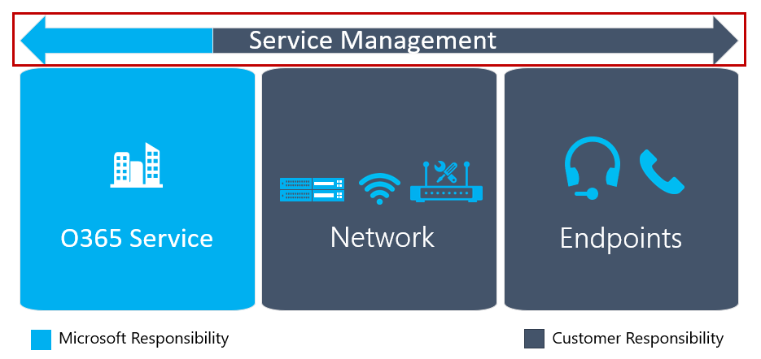

# 내 서비스 관리 계획Plan my service management

이 문서에서는 고품질 Microsoft Teams 배포를 제공 및 유지 관리하는 데 필요한 요구 사항에 대한 개요를 제공합니다.This article gives an overview of the requirements that are necessary to deliver and maintain a high-quality Microsoft Teams deployment. 첫 번째 파일럿 또는 프로덕션 배포 전에 Envision 단계에서 서비스 관리 및 품질을 계획하여 성공적인 배포를 보장할 수 있습니다.You can help ensure a successful deployment by planning for service management and quality during the Envision phase, before your first pilot or production deployment.

## Teams에 대한 서비스 관리Service management for Teams

서비스 관리는 Microsoft Teams 서비스가 배포되고 사용자에 대해 사용하도록 설정된 후의 매일 작업을 다루는 광범위한 항목입니다.Service management is a broad topic that covers day-to-day operations of the Microsoft Teams service after it has been deployed and enabled for users. Teams 서비스는 Microsoft 365 또는 Office 365 및 배포된 인프라 구성 요소(예: 네트워킹)를 포함합니다.The Teams service encompasses Microsoft 365 or Office 365 and the infrastructure components that are deployed on-premises (for example, networking).

서비스 관리의 개념은 대부분의 조직에 대한 새로운 개념이 아 않을 가능성이 습니다.The notion of service management is most likely not a new concept for most organizations. 기존 서비스와 연결된 프로세스 및 작업을 이미 구현한 것일 수 있습니다.You probably have already implemented processes and tasks that are associated with existing services. 즉, 향후 Microsoft Teams를 지원하기 위해 현재 서비스 관리를 계획할 때 현재의 서비스를 보강할 수 있습니다.That said, you can probably augment what you have in place when you plan for service management today to support Microsoft Teams in the future.

서비스 관리에는 Microsoft Teams 관리와 관련된 모든 활동 및 프로세스가 포함됩니다.Service management encompasses all the activities and processes involved in managing Microsoft Teams end to end. Microsoft 365 또는 Office 365 서비스 자체가 구성하는 인프라 구성 요소인 서비스 관리의 일부 구성 요소는 Microsoft의 책임입니다. 반면 고객은 Teams, 네트워크 및 엔드포인트의 다양한 측면을 관리할 책임이 있습니다.Some components of service management—the infrastructure components that the Microsoft 365 or Office 365 service itself comprises—are Microsoft’s responsibility, whereas the customer is accountable to its users to manage the various aspects of Teams, the network, and endpoints they provide.
Teams 서비스 관리에 대한 고객 책임 및 사용자 환경의 품질을 획기화하는 주요 구성 요소와의 관계에 대한 자세한 내용은 서비스 관리 및 품질에 대한 계획을 [참조하세요.](https://docs.microsoft.com/MicrosoftTeams/prepare-network)For a complete discussion of the customer responsibility for Teams service management and how it relates to the key components that underpin the quality of the user experience, see [Plan for service management and quality](https://docs.microsoft.com/MicrosoftTeams/prepare-network).

<!--ENDOFSECTION-->

## 운영 가이드 소개Introduction to the Operations Guide 

**서비스** **관리와**  관련해 답변해야 하는 세 가지 중요한 질문은 무엇, 누가, 어떻게 묻는가?**What**, **Who**, and **How** are three important questions that need to be answered when it comes to service management.

작업 [가이드를](https://docs.microsoft.com/MicrosoftTeams/1-drive-value-operate-my-service) 사용하여 이러한 세 가지 질문을 모두 해결할 수 있습니다.You can use the [Operations Guide](https://docs.microsoft.com/MicrosoftTeams/1-drive-value-operate-my-service) to help you address all three of these questions. 이 가이드에서는 매일, 매주, 월별 및 필요한 기준으로 수행할 활동 목록을 제공합니다.The guide provides a list of activities to be performed on a daily, weekly, monthly, and as-needed basis. 이러한 활동 및 작업은 고품질 Teams 배포를 유지 관리하는 데 중요합니다.These activities and tasks are critical for maintaining a high-quality Teams deployment. 서비스 관리에서 특정 작업을 수행할 책임이 있는 사용자 결정은 성공적인 배포를 보장하기 위해 Envision 단계 초기에 해야 하는 계획의 중요한 측면입니다.Determining who will be responsible for performing specific activities in service management is a critical aspect of your planning that you need to do early in the Envision phase to ensure a successful deployment. 작업 및 활동을 알아내면 작업을 이해하고 그 다음에 할당한 그룹 또는 개인이 필요합니다.After you’ve figured out the tasks and activities, they need to be understood and followed by the groups or individuals that you assign to them. 작업 가이드에서는 각 작업을 수행하는 방법 및/또는 외부 콘텐츠에 대한 참조에 대한 지식과 지침을 제공합니다.The Operations Guide provides knowledge and guidance for how to perform each of the tasks, and/or references to outside content.

## 운영 역할 매핑 계획Plan for operational role mapping

첫 번째 파일럿 사용자를 사용하도록 설정하면 작업 단계가 시작하기 때문에 초기에 서비스 관리를 계획하는 것이 중요한 시점입니다.Planning for service management early is a critical milestone, because the operations phase begins when the first pilot users are enabled. 프로젝트 팀은 필요한 작업 및 활동을 검토하고 동의하고, 각 운영 작업을 담당하는 팀을 식별한 다음, 각 팀에서 약정 및 서명을 해야 합니다.The project team must review and agree on the tasks and activities required, identify the team that’s responsible for each operational task, and then get a commitment and sign-off from each respective team.

서명이 완료되면 책임 팀은 이러한 역할 및 책임의 운영을 시작해야 합니다.After sign-off is complete, the responsible team must then start operationalizing these roles and responsibilities. 여기에는 교육 및 준비, 직원 직원 모델 업데이트 또는 외부 파트너가 제공할 준비가 됐을 수 있습니다.This might include training and readiness, updating the staffing model, or ensuring that external partners are ready to deliver.

운영 역할을 Envision 단계의 초기 단계에 매핑하면 모든 팀이 파일럿 중에 운영 작업을 시작하고 작업을 시작하고 배포가 시작된 후 모든 작업이 준비될 수 있습니다.Mapping operational roles early in the Envision phase enables all teams to start their operational tasks during the pilot and ramp up operations and make sure that everything is ready after the deployment starts.

작업 가이드는 대부분의 시나리오에서 유효해야 하는 일반적인 역할에 매핑된 일반적인 작업의 목록을 제공합니다.The Operations Guide provides a list of common tasks mapped to typical roles that should be valid in most scenarios. 조직에서 작동하려면 이러한 책임을 사용자 지정해야 합니다.You need to customize these responsibilities to work for your organization.

>[!TIP]
>다음은 이 프로젝트를 지원하기 위해 수행한 운영 역할 매핑 연습의 결과를 문서화하는 템플릿의 예입니다.The following is an example of a template to document the result of operational roles mapping exercise that you performed to support this project.

|운영 역할Operational Role |설명Description |팀Team |연락처 세부 정보Contact Details |
|---------|---------|---------|---------|
|서비스 소유자Service Owner|서비스 소유자, 사업부에 대한 인터페이스, 전략Service owner, interface to business divisions, strategy|TBATBA|TBATBA|
|오디오 회의 작업Audio Conferencing Operations|일일 작업, 사용자 및 장치 계정 이동/추가/변경, 모니터링Daily operations, user and device account move/add/change, monitoring|TBATBA| TBATBA| 
|테넌트 관리자Tenant Admin|테넌트 전체 설정 변경, 새 기능 사용Change tenant-wide settings, enable new features|TBATBA|TBATBA|
|지원 센터Help Desk|지원을 받을 사용자를 위한 인터페이스Interface for users to get support|TBATBA|TBATBA|
|네트워크 작업Network Operations|LAN, WAN, Wi-Fi 및 인터넷 액세스 실행Run LAN, WAN, Wi-Fi, and internet access|TBATBA|TBATBA|
|클라이언트 & 엔드포인트 팀Client & Endpoints Team|데스크톱 배포 관리Manage desktop deployments|TBATBA|TBATBA|
|ID 작업Identity Operations|ID 인프라 관리(Active Directory, Active Directory Federation Services, Azure AD)Manage identity infrastructure (Active Directory, Active Directory Federation Services, Azure AD)|TBATBA|TBATBA|
|채택/변경 관리Adoption/Change Management|솔루션에 대한 인식, 교육 및 채택 관리Manage awareness, training, and adoption for the solution|TBATBA|TBATBA|
|Exchange 작업Exchange Operations|Exchange 환경 관리Manage the Exchange environment|TBATBA|TBATBA|
|전화 통신 작업Telephony Operations|SBC 및 전화 번호 관리Manage the SBC's and the phone numbers|TBATBA|TBATBA|

<!--ENDOFSECTION-->

## 품질 챔피언 역할The Quality Champion role

그룹 또는 개인은 모든 조직의 품질에 대해 책임이 있습니다.A group or individual needs to be accountable for quality in all organizations.
서비스 관리에서 가장 중요한 역할입니다.This is the most important role in service management. 품질 챔피언은 사용자 경험에 열성적인 개인 또는 그룹에 할당된 고객 역할입니다.The quality champion is a customer role that's assigned to a person or group who is passionate about their users' experience. 이 역할에는 환경의 추세를 식별하는 기술과 다른 팀과 함께 재구성 작업을 수행하기 위한 스폰서쉽이 필요합니다.This role requires the skills to identify trends in the environment and the sponsorship to work with other teams to drive remediation.
품질 챔피언에 가장 적합한 후보는 일반적으로 고객 서비스 소유자입니다. 이 소유자는 조직의 크기 및 복잡성에 따라 사용자 환경에 대해 열렬한 사용자 또는 그룹일 수 있습니다.The best candidate for the quality champion is typically the customer service owner, who—depending on the organization’s size and complexity—could be any person or group who is passionate about user experience.

품질 챔피언은 CQD(통화 품질 대시보드) 및 품질 경험 검토 가이드와 같은 기존 도구 및 문서화 프로세스를 활용하여 사용자 환경을 모니터링하고, 품질 추세를 식별하고, 필요한 경우 수정을 구동합니다.The quality champion leverages existing tools and documented processes, such as the Call Quality Dashboard (CQD) and the Quality Experience Review Guide, to monitor user experience, identify quality trends, and drive remediation where needed. 품질 챔피언은 각 팀과 함께 수정 작업을 진행하고 진행 상황을 운영 위원회에 보고하고 문제를 공개합니다.The quality champion works with the respective teams to drive remediation actions, reporting to a steering committee on their progress and open issues.

역할과 연결된 작업 및 작업은 작업 가이드에 설명되어 있습니다.The tasks and activities associated with the role are documented in the Operations Guide. 이 역할은 Envision 단계의 초기에 할당해야 합니다.This role should be assigned early in the Envision phase. 품질 챔피언의 역할을 운영하기 위한 핵심 단계는 역할에 필요한 지식을 얻고 작업을 수행하기 위한 필수 요구를 확보하는 것입니다.A key step in operationalizing the role of Quality Champion is gaining the knowledge required for the role and ensuring the prerequisites are in place to deliver on the tasks. 이 역할에 대한 주요 작업은 일반 품질 환경 검토를 실행하는 것입니다.A key task for this role is running a regular Quality Experience Review.

<!--ENDOFSECTION-->

## 품질 환경 검토 가이드 소개Introduction to the Quality Experience Review Guide

품질 환경 검토 가이드에는 아래 그림과 같이 사용자 환경 개선에 가장 큰 영향을 미치는 주요 영역에서 수정 지침을 평가하고 제공하는 작업 집합이 있습니다.The Quality Experience Review Guide has a set of activities that assess and provide remediation guidance in key areas that have the greatest impact for improving user experience, as shown in the figure below.

이 문서에 설명된 영역을 지속적으로 평가하고 수정하여 사용자 경험에 부정적인 영향을 줄 수 있습니다.By continually assessing and remediating the areas described in this document, you can reduce their potential to negatively affect user experience. 배포에서 발생하는 대부분의 사용자 환경 문제는 다음 범주로 그룹화할 수 있습니다.Most user-experience problems encountered in a deployment can be grouped into the following categories:

-   불완전한 방화벽 또는 프록시 구성Incomplete firewall or proxy configuration

-   불량 Wi-Fi 검사Poor Wi-Fi coverage

-   대역폭 부족Insufficient bandwidth

-   VPNVPN

-   사용할 수 없는 오디오 장치 또는 기본 제공 오디오 장치 사용Use of unoptimized or built-in audio devices

-   문제가 있는 서브넷 또는 네트워크 디바이스Problematic subnets or network devices

품질 환경 검토 가이드에 제공된 지침은 CQD(통화 품질 대시보드) Online을 기본 도구로 사용하여 설명된 각 영역을 보고하고 조사하는 데 중점을 두며, 채택과 영향을 최대화하기 위해 오디오에 중점을 두세요.The guidance provided in the Quality Experience Review Guide focuses on using Call Quality Dashboard (CQD) Online as the primary tool to report and investigate each area described, with a focus on audio to maximize adoption and impact. 또한 오디오 환경을 개선하기 위해 네트워크를 최적화하면 비디오 및 데스크톱 공유의 개선으로 직접 변환됩니다.Any optimizations made to the network to improve the audio experience will also directly translate to improvements in video and desktop sharing.

품질 챔피언을 조기 추천하는 것이 좋습니다.We highly recommend that you nominate the quality champion early on. 지명된 후 품질 환경 검토 가이드의 콘텐츠를 [익히기 시작해야 합니다.](https://aka.ms/qerguide)After being nominated, they should start to familiarize themselves with the content in the [Quality Experience Review Guide](https://aka.ms/qerguide).

<table>
<tr><td>  의사 결정 지점Decision points</td><td><ul><li>조직의 클라우드 음성 작업에 대한 책임이 있는 사용자 결정Decide who is accountable for cloud voice operations in your organization.</li></ol></td></tr>
<tr><td> 다음 단계Next steps</td><td><ul><li>서비스 관리 계획 전체 가이드를 다운로드합니다.Download the Planning for Service Management full guide.</li><li>품질 환경 검토 가이드를 다운로드합니다.Download the Quality Experience Review guide.</li><li>전체 작업 가이드를 검토합니다.Review the Operations Guide in full.</li><li>모든 운영 팀 구성원이 작업 요구 사항을 검토하고 익숙하게 할 수 있는 모든 가이드를 제공합니다.Provide all guides to every operations team members to review and be familiar with operations requirements.</li></ol></td></tr>
</table>

<!--ENDOFSECTION-->
