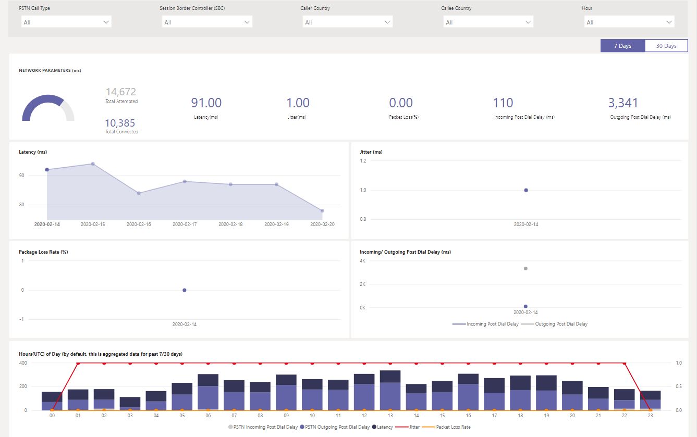

# CQD PSTN 다이렉트 라우팅 보고서 사용Using the CQD PSTN Direct Routing Report

2 월 2020 새 [cqd에 대 한 다운로드 가능한 POWER BI 쿼리 서식 파일](https://github.com/MicrosoftDocs/OfficeDocs-SkypeForBusiness/blob/live/Teams/downloads/CQD-Power-BI-query-templates.zip?raw=true)에 CQD PSTN 다이렉트 라우팅 보고서가 추가 되었습니다.New in March 2020, we've added a CQD PSTN Direct Routing Report to our downloadable [Power BI query templates for CQD](https://github.com/MicrosoftDocs/OfficeDocs-SkypeForBusiness/blob/live/Teams/downloads/CQD-Power-BI-query-templates.zip?raw=true). 

CQD PSTN 다이렉트 라우팅 보고서는 사용자가 SBC, 전화 통신 서비스, 네트워크 매개 변수 및 네트워크 효율성 수준에 대 한 정보를 모니터 하는 데 도움이 되는 사용 패턴 및 품질에 대해 이해 하 고 있습니다. services.The CQD PSTN Direct Routing Report helps customers to understand the usage patterns and quality of their PSTN services monitor information about your SBC, the telephony service, the network parameters, and Network Effectiveness Ratio details and usage of the service. 이 정보는 통화 제거 사유를 포함 하 여 문제를 식별 하는 데 도움이 될 수 있습니다.This information can help you identify issues, including the reason for dropped calls. 예를 들어 볼륨을 언제까지 언제 얼마나 표시 되는지 알 수 있으며, 그 이유 때문에 발생 하는 통화 수는 얼마 입니까?For example, you will be able to know when volume drops, how many calls get affected by what reason.

CQD PSTN 다이렉트 라우팅 보고서에는 다음과 같은 네 가지 섹션이 있습니다.The CQD PSTN Direct Routing Report has four sections:

  - [PSTN 개요PSTN Overview](#pstn-overview)

  - [서비스 세부 정보Service Details](#service-details)

  - [네트워크 효율성 비율Network Effectiveness Ratio](#network-effectiveness-ratio)

  - [네트워크 매개 변수Network Parameters](#network-parameters)

## PSTN 개요PSTN Overview

CQD PSTN 다이렉트 라우팅 보고서는 지난 180 일간 서비스의 전체 상태와 관련 된 다음과 같은 정보를 제공 합니다.The CQD PSTN Direct Routing Report provides the following information related to overall health of the service for the past 180 days.

예를 들어 내부 국가를 미국으로 사용 하 여 SBC abc.bca.adatum.biz를 통과 하는 모든 인바운드 통화에 대 한 전반적인 사용 및 상태에 대해 관심이 있는 경우 다음을 수행 합니다.For example, if you are interested in the overall usage and health about all inbound calls going through SBC abc.bca.adatum.biz with US as the internal country:

| **전화 걸기****Call Out** | **설명****Description**                                                                                                                                                 |
| ------------ | --------------------------------------------------------------------------------------------------------------------------------------------------------------- |
| 11            | 위쪽에 있는 필터를 사용 하 여 드릴 다운 하 고 통화 유형으로 In (abc.bca.contoso.com as 세션 Boarder 컨트롤러)을 선택 하 고 미국 내부 국가를 선택할 수 있습니다.You can use the filters at the top to drill down and select ByotIn as call type, abc.bca.contoso.com as Session Boarder Controller, and US as internal country. |
| 22            | 지난 180 일간의 사용량 추세입니다.Usage trend for the past 180 days. 서비스 세부 정보 페이지에 대 한 사용 세부 정보 보고서를 찾을 수 있습니다.You can find usage detail report on Service Detail page.                                                                     |
| 33            | 지난 180 일간 전화 걸기 지연, 대기 시간, 지터, 패킷 손실 추세를 게시 합니다.Post Dial Delay, Latency, Jitter, and Packet Loss trend for the past 180 days. 네트워크 매개 변수 페이지에 대 한 상세 보고서를 찾을 수 있습니다.You can find detail report on Network Parameters page.                           |
| 4(tcp/ipv4)4            | 지난 180 일간 동시 통화 및 일일 활성 사용자 추이.Concurrent Call and Daily Active User trend for the past 180 days. 이 차트는 서비스의 최대 볼륨을 이해 하는 데 도움이 될 수 있습니다.This chart can help you understand the max volume of the service.                            |
| 5mb5            | 지난 180 일간 서비스 품질에 영향을 주는 최고 통화 종료 이유.Top Call End Reason affected service quality for the past 180 days. NER (네트워크 유효 비율) 페이지에서 서비스 상태 세부 정보를 찾을 수 있습니다.You can find service health detail on Network Effective Ratio(NER) page.                    |

## 서비스 세부 정보Service Details

이 페이지는 일일 서비스 사용 추세와 사용자 피드백 분석을 지역별로 제공 합니다.This page provides service usage trends per day and user feedback breakdown by geographic.

  - **총 시도 통화 –** 해당 시간 범위 내에서 성공 및 실패 통화를 비롯 한 총 시도 통화**Total Attempt Calls –** Total attempt calls in that time range, including both success and failed calls

  - **총 연결 된 통화-** 해당 시간 범위의 총 연결 된 통화**Total Connected Calls -** Total connected calls in that time range

  - **총 통화 시간 –** 해당 시간 범위의 총 분 사용량**Total Minutes –** Total minute usage in that time range

  - **DAU (일일 활성 사용자)-** 해당 일에 하나 이상의 연결 된 통화를 만든 일일 활성 사용자 수**Daily Active Users(DAU) –** Count of daily active user who made at least one connected call in that day

  - **동시 통화-** 1 분 내에 동시 활성 통화 최대**Concurrent Calls –** Max of simultaneous active calls in a minute

  - **사용자 의견-** "내 통화 요금" 점수가 사용자에 게 제공 됩니다.**User Feedback –** "Rate My Call" score comes from the user. 3-5는 좋은 통화로 간주 됩니다.3-5 is considered as a good call. 1-2는 불량 통화로 간주 됩니다.1-2 is considered as a bad call.

예를 들면 다음과 같습니다.For example:

1.  02/14/2020에서 평균 통화 시간이 0으로 떨어지면 먼저 통화 볼륨이 정상적으로 표시 되는지 확인 하 고 총 연결 통화와 총 시도 통화 사이에 큰 차이가 없는지 확인할 수 있습니다.If you see average call duration drops to 0 at 02/14/2020, you can first check if the call volume looks normal and see if there is a big discrepancy between total connect calls and total attempt calls. 그런 다음 네트워크 효율성 비율 페이지로 이동 하 여 통화 실패 원인에 투자 하세요.Then go to Network Effectiveness Ratio page to invest on call failure reasons.

2.  사용자 의견 지도에 빨간색 점이 더 표시 되는 경우 네트워크 효율성 비율 페이지 및 네트워크 매개 변수를 사용 하 여 문제가 있는지 확인 하 고 MS 서비스 데스크에서 티켓을 발생 시킬 수 있습니다.If you see increasing red spots on the user feedback map, you could go to Network Effectiveness Ratio page and Network Parameter to see if there are any anomalies and you could raise a ticket using MS Service Desk.

## 네트워크 효율성 비율Network Effectiveness Ratio

이 메트릭은 전체 상태 대시보드에 표시 되는 것과 동일 합니다.This is the same metric that appears on the Overall Health dashboard. 매시간 네트워크 효율성 비율 및 통화 종료 이유 도표에 대 한 통화 지침 (인바운드/아웃 바운드)에 대 한 정보를 사용 하 여 매시간 NER 번호를 확인할 수 있습니다.You can check hourly NER number with affected calls detail for both call directions (inbound/outbound) on the Hourly network effectiveness ratio and call ending reason chart below.

  - **NER** -능력 (%) 수신자에 게 전달 되는 통화 수를 측정 하 여 전화를 전달 하는 네트워크의 경우**NER** - The ability (%) of a network to deliver calls by measuring the number of calls sent versus the number of calls delivered to a recipient.

  - **SIP 응답 코드**-3 자리 정수 응답 코드에는 통화 상태가 표시 됩니다.**SIP response code**- A three-digit integer response code shows the call status.

  - **Microsoft 응답 코드**-microsoft component에서 전송 된 응답 코드입니다.**Microsoft response code**-A response code sent out from Microsoft component.

  - **설명** – SIP 응답 코드 및 Microsoft 응답 코드에 해당 하는 이유 단계**Description** – The reason phase that corresponding to the SIP response code and Microsoft response code.

  - **영향을 받는 통화 수** – 선택한 시간 범위 동안 영향을 받은 총 통화 수입니다.**Number of calls affected** – The total number of calls got affected during the selected time range.

> 
> 
예를 들면 다음과 같습니다.For example:

일일 NER에 02/05/2020의 dip가 있는 경우 해당 날짜를 클릭 하면 다른 차트가 해당 특정 날짜로 확대/축소 됩니다.If Daily NER has a dip on 02/05/2020, you can click on the date and other charts will zoom to that specific date.

NER는 시간 기준 추세에 따라 21:00에서 dip가 발생 하는 것을 확인할 수 있습니다.From the NER Good Percentage Hourly Trend, you can find the dip happens around 21:00. 그런 다음 다시 클릭 하 여 21 시간으로 확대/축소 하 고 해당 시간에 실패 한 통화 수와 통화 종료 이유를 확인 합니다.Then click again to zoom to hour 21 and check Effected Call Details to see how many calls failed in that hour and what are the call end reasons. SBC 문제에 대 한 자체 문제 해결을 시작 하거나 문제가 SBC와 관련이 없는 경우 서비스 데스크에 보고할 수 있습니다.You can start with self-trouble shooting on any SBC problems or report to Service Desk if the problem is not related to SBC.

## 네트워크 매개 변수Network Parameters

모든 네트워크 매개 변수는 직접 라우팅 인터페이스에서 세션 경계 컨트롤러로 측정 됩니다.All network parameters are measured from the Direct Routing interface to the Session Border Controller. 권장 값에 대 한 자세한 내용은 [Microsoft 팀 용 조직의 네트워크 준비](prepare-network.md)를 참조 하 고 고객 Edge에서 microsoft edge 추천 값을 확인 하세요.For information about the recommended values, see [Prepare your organization's network for Microsoft Teams](prepare-network.md), and look at the Customer Edge to Microsoft Edge recommended values.

  - **지터** – RTCP (RTP 컨트롤 프로토콜)를 사용 하 여 두 끝점 간에 계산 된 네트워크 전파 지연 시간 변동의 밀리초 단위입니다.**Jitter** – Is the millisecond measure of variation in network propagation delay time computed between two endpoints using RTCP (The RTP Control Protocol).

  - **패킷 손실** – 도착 하지 못한 패킷의 척도입니다. 두 끝점 간에 계산 됩니다.**Packet Loss** – Is a measure of packet that failed to arrive; it is computed between two endpoints.

  - **지연** (라운드트립 시간이 라고도 함)은 신호가 전송 되는 데 걸리는 시간과 해당 신호를 수신 하는 데 걸리는 시간을 합한 값입니다.**Latency** - (Also known as round trip time) is the length of time it takes for a signal to be sent plus the length of time it takes for the acknowledgment of that signal to be received. 이 시간 지연은 신호의 두 점 사이의 전파 시간으로 구성 됩니다.This time delay consists of the propagation times between the two points of a signal.

> 

예를 들면 다음과 같습니다.For example:

특정 날짜에 대 한 4 개의 차트 (대기 시간, 지터, 패키지 손실 속도, 전화 걸기 지연)에 스파이크가 표시 되는 경우 (예: 02/14/2020의 지연 시간)에는 날짜 지점을 클릭 합니다.If you see a spike on any of the four charts (Latency, Jitter, Package Loss Rate, Post Dial Delay) for a specific date, for example, Latency on 02/14/2020, click on the date point. 아래쪽에 있는 시간별 추세 도표를 새로 고치면 시간별 번호가 표시 됩니다.And the hourly trend chart at the bottom will refresh to show the hourly number. MS 서비스 데스크를 사용 하 여 SBCs를 확인 하거나 티켓을 올릴 수 있습니다.You can check the SBCs or raise a ticket with MS Service Desk.

## 관련 항목Related topics

[Power BI를 사용 하 여 Microsoft 팀에 대 한 CQD 데이터 분석Use Power BI to analyze CQD data for Microsoft Teams](CQD-PSTN-report.md)