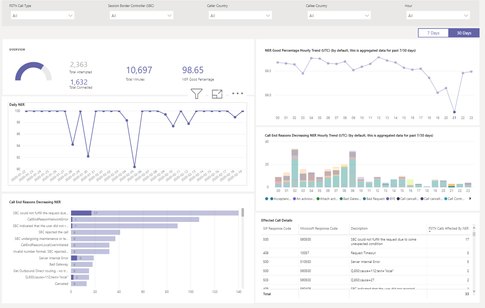

# CQD PSTN 다이렉트 라우팅 보고서 사용

2 월 2020 새 [cqd에 대 한 다운로드 가능한 POWER BI 쿼리 서식 파일](https://github.com/MicrosoftDocs/OfficeDocs-SkypeForBusiness/blob/live/Teams/downloads/CQD-Power-BI-query-templates.zip?raw=true)에 CQD PSTN 다이렉트 라우팅 보고서가 추가 되었습니다. 

CQD PSTN 다이렉트 라우팅 보고서는 사용자가 SBC, 전화 통신 서비스, 네트워크 매개 변수 및 네트워크 효율성 수준에 대 한 정보를 모니터 하는 데 도움이 되는 사용 패턴 및 품질에 대해 이해 하 고 있습니다. services. 이 정보는 통화 제거 사유를 포함 하 여 문제를 식별 하는 데 도움이 될 수 있습니다. 예를 들어 볼륨을 언제까지 언제 얼마나 표시 되는지 알 수 있으며, 그 이유 때문에 발생 하는 통화 수는 얼마 입니까?

CQD PSTN 다이렉트 라우팅 보고서에는 다음과 같은 네 가지 섹션이 있습니다.

  - [PSTN 개요](#pstn-overview)

  - [서비스 세부 정보](#service-details)

  - [네트워크 효율성 비율](#network-effectiveness-ratio)

  - [네트워크 매개 변수](#network-parameters)

## PSTN 개요

CQD PSTN 다이렉트 라우팅 보고서는 지난 180 일간 서비스의 전체 상태와 관련 된 다음과 같은 정보를 제공 합니다.

예를 들어 내부 국가를 미국으로 사용 하 여 SBC abc.bca.adatum.biz를 통과 하는 모든 인바운드 통화에 대 한 전반적인 사용 및 상태에 대해 관심이 있는 경우 다음을 수행 합니다.

| **전화 걸기** | **설명**                                                                                                                                                 |
| ------------ | --------------------------------------------------------------------------------------------------------------------------------------------------------------- |
| 1            | 위쪽에 있는 필터를 사용 하 여 드릴 다운 하 고 통화 유형으로 In (abc.bca.contoso.com as 세션 Boarder 컨트롤러)을 선택 하 고 미국 내부 국가를 선택할 수 있습니다. |
| 2            | 지난 180 일간의 사용량 추세입니다. 서비스 세부 정보 페이지에 대 한 사용 세부 정보 보고서를 찾을 수 있습니다.                                                                     |
| 3            | 지난 180 일간 전화 걸기 지연, 대기 시간, 지터, 패킷 손실 추세를 게시 합니다. 네트워크 매개 변수 페이지에 대 한 상세 보고서를 찾을 수 있습니다.                           |
| 4(tcp/ipv4)            | 지난 180 일간 동시 통화 및 일일 활성 사용자 추이. 이 차트는 서비스의 최대 볼륨을 이해 하는 데 도움이 될 수 있습니다.                            |
| 5mb            | 지난 180 일간 서비스 품질에 영향을 주는 최고 통화 종료 이유. NER (네트워크 유효 비율) 페이지에서 서비스 상태 세부 정보를 찾을 수 있습니다.                    |

## 서비스 세부 정보

이 페이지는 일일 서비스 사용 추세와 사용자 피드백 분석을 지역별로 제공 합니다.

  - **총 시도 통화 –** 해당 시간 범위 내에서 성공 및 실패 통화를 비롯 한 총 시도 통화

  - **총 연결 된 통화-** 해당 시간 범위의 총 연결 된 통화

  - **총 통화 시간 –** 해당 시간 범위의 총 분 사용량

  - **DAU (일일 활성 사용자)-** 해당 일에 하나 이상의 연결 된 통화를 만든 일일 활성 사용자 수

  - **동시 통화-** 1 분 내에 동시 활성 통화 최대

  - **사용자 의견-** "내 통화 요금" 점수가 사용자에 게 제공 됩니다. 3-5는 좋은 통화로 간주 됩니다. 1-2는 불량 통화로 간주 됩니다.

예를 들면 다음과 같습니다.

1.  02/14/2020에서 평균 통화 시간이 0으로 떨어지면 먼저 통화 볼륨이 정상적으로 표시 되는지 확인 하 고 총 연결 통화와 총 시도 통화 사이에 큰 차이가 없는지 확인할 수 있습니다. 그런 다음 네트워크 효율성 비율 페이지로 이동 하 여 통화 실패 원인에 투자 하세요.

2.  사용자 의견 지도에 빨간색 점이 더 표시 되는 경우 네트워크 효율성 비율 페이지 및 네트워크 매개 변수를 사용 하 여 문제가 있는지 확인 하 고 MS 서비스 데스크에서 티켓을 발생 시킬 수 있습니다.

## 네트워크 효율성 비율

이 메트릭은 전체 상태 대시보드에 표시 되는 것과 동일 합니다. 매시간 네트워크 효율성 비율 및 통화 종료 이유 도표에 대 한 통화 지침 (인바운드/아웃 바운드)에 대 한 정보를 사용 하 여 매시간 NER 번호를 확인할 수 있습니다.

  - **NER** -능력 (%) 수신자에 게 전달 되는 통화 수를 측정 하 여 전화를 전달 하는 네트워크의 경우

  - **SIP 응답 코드**-3 자리 정수 응답 코드에는 통화 상태가 표시 됩니다.

  - **Microsoft 응답 코드**-microsoft component에서 전송 된 응답 코드입니다.

  - **설명** – SIP 응답 코드 및 Microsoft 응답 코드에 해당 하는 이유 단계

  - **영향을 받는 통화 수** – 선택한 시간 범위 동안 영향을 받은 총 통화 수입니다.

> 
> 
예를 들면 다음과 같습니다.

일일 NER에 02/05/2020의 dip가 있는 경우 해당 날짜를 클릭 하면 다른 차트가 해당 특정 날짜로 확대/축소 됩니다.

NER는 시간 기준 추세에 따라 21:00에서 dip가 발생 하는 것을 확인할 수 있습니다. 그런 다음 다시 클릭 하 여 21 시간으로 확대/축소 하 고 해당 시간에 실패 한 통화 수와 통화 종료 이유를 확인 합니다. SBC 문제에 대 한 자체 문제 해결을 시작 하거나 문제가 SBC와 관련이 없는 경우 서비스 데스크에 보고할 수 있습니다.

## 네트워크 매개 변수

모든 네트워크 매개 변수는 직접 라우팅 인터페이스에서 세션 경계 컨트롤러로 측정 됩니다. 권장 값에 대 한 자세한 내용은 [Microsoft 팀 용 조직의 네트워크 준비](prepare-network.md)를 참조 하 고 고객 Edge에서 microsoft edge 추천 값을 확인 하세요.

  - **지터** – RTCP (RTP 컨트롤 프로토콜)를 사용 하 여 두 끝점 간에 계산 된 네트워크 전파 지연 시간 변동의 밀리초 단위입니다.

  - **패킷 손실** – 도착 하지 못한 패킷의 척도입니다. 두 끝점 간에 계산 됩니다.

  - **지연** (라운드트립 시간이 라고도 함)은 신호가 전송 되는 데 걸리는 시간과 해당 신호를 수신 하는 데 걸리는 시간을 합한 값입니다. 이 시간 지연은 신호의 두 점 사이의 전파 시간으로 구성 됩니다.

> 

예를 들면 다음과 같습니다.

특정 날짜에 대 한 4 개의 차트 (대기 시간, 지터, 패키지 손실 속도, 전화 걸기 지연)에 스파이크가 표시 되는 경우 (예: 02/14/2020의 지연 시간)에는 날짜 지점을 클릭 합니다. 아래쪽에 있는 시간별 추세 도표를 새로 고치면 시간별 번호가 표시 됩니다. MS 서비스 데스크를 사용 하 여 SBCs를 확인 하거나 티켓을 올릴 수 있습니다.

## 관련 항목

[Power BI를 사용 하 여 Microsoft 팀에 대 한 CQD 데이터 분석](CQD-PSTN-report.md)