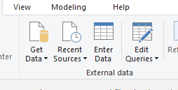

# CQD 쿼리 서식 파일을 사용 하도록 Power BI 커넥터 설치

CQD (.PBIX 파일) 용 Power BI 쿼리 템플릿을 사용 하려면 먼저 [다운로드](https://github.com/MicrosoftDocs/OfficeDocs-SkypeForBusiness/blob/live/Teams/downloads/CQD-Power-BI-query-templates.zip?raw=true)에 포함 된 *MicrosoftCallQuality* 파일을 사용 하 여 Microsoft Cqd 용 power bi Connector를 설치 해야 합니다. 

[POWER BI를 사용 하 여 팀에 대 한 CQD 데이터를 분석](CQD-Power-BI-query-templates.md) 하 여 이러한 템플릿에 대해 알아보세요.

Power BI 보고서에 액세스 하는 데 올바른 [Cqd 액세스 역할이](https://docs.microsoft.com/microsoftteams/turning-on-and-using-call-quality-dashboard#assign-roles-for-accessing-cqd) 있는지 확인 합니다. 

## 설치용

사용자 지정 커넥터를 설치 하 고 커넥터 사용을 가능 하 게 하는 보안을 조정 하는 프로세스는 [POWER BI 설명서](https://docs.microsoft.com/power-bi/desktop-connector-extensibility)에 자세히 설명 되어 있습니다. 편의상 다음의 간단한 설명을 참조 하세요.

1.  컴퓨터에 * \[\\Power BI 데스크톱\\\]사용자 지정 커넥터* 폴더가 이미 있는지 확인 합니다. 그렇지 않은 경우이 폴더를 만듭니다. 1

2.  커넥터 파일 ( * \*mez* 또는 * \*pqx* 파일)을 다운로드 하 여 *사용자 지정 커넥터* 디렉터리에 배치 합니다.

3.  **커넥터 파일이 * \*mez* 파일인 경우** 에는 [사용자 지정 커넥터 설정 문서](https://docs.microsoft.com/power-bi/desktop-connector-extensibility#data-extension-security)에 설명 된 대로 보안 설정을 조정 해야 합니다.

Microsoft 팀 용 Power BI 커넥터의 새 버전이 릴리스되면 *사용자 지정 커넥터* 디렉터리의 이전 커넥터 파일을 새 파일로 바꿉니다.

## Setup.exe

보고서를 작성 하 고 쿼리를 실행 하기 위해서는 먼저 CQD 데이터 원본에 연결 해야 합니다. 연결 하려면 아래 단계를 따르세요.

1.  Power BI Desktop의 홈 탭에서 *데이터 가져오기를*클릭 합니다.

    

2.  *데이터 가져오기* 창이이 시점에 표시 됩니다. *온라인 서비스로*이동한 다음 *Microsoft 통화 음질 (베타)* 을 선택 하 고 *연결*을 누릅니다.

    

3.  다음에 로그인 하 라는 메시지가 표시 됩니다. CQD에 사용 하는 것과 동일한 자격 증명을 사용 합니다. 2

4.  다음 메시지가 표시 되 면 두 *데이터 연결 모드*간의 옵션이 제공 됩니다. *DirectQuery* 를 선택 하 고 *확인을*누릅니다.

5.  마지막으로 CQD에 대 한 전체 데이터 모델을 보여 주는 마지막 메시지가 표시 됩니다. 이 시점에서는 CQD에 대 한 데이터 모델만 표시 되는 데이터는 없습니다. *로드* 를 선택 하 여 설치 프로세스를 완료 합니다.

6.  이 시점에서 Power BI는 창 오른쪽에 데이터 모델을 로드 합니다. 이 경우 페이지는 공백으로 유지 되며 기본적으로 쿼리가 로드 되지 않습니다. 쿼리를 작성 하 고 데이터를 반환 하기 위해서는 아래 **쿼리 작성** 을 진행 합니다.

이 설치 과정 중 완전히 명확 하지 않은 단계가 있으면 [여기](https://docs.microsoft.com/power-bi/desktop-quickstart-connect-to-data)에서 프로세스에 대 한 자세한 설명을 볼 수 있습니다.

## 쿼리 빌드

설치가 완료 되 면 *필드* 창에 여러 개의 크기의 차원과 측정값 로드가 표시 되어야 합니다. 여기에서 실제 쿼리를 작성 하는 것은 간단 하며 쿼리에 대해 원하는 차원과 측정값을 선택한 다음 페이지에 끌어서 놓습니다. 다음은 간단한 예제를 사용 하는 자세한 설명입니다.

1.  *시각화* 창에서 사용할 시각화를 선택 합니다. 해당 시각화의 빈 버전이 페이지에 나타납니다. 이 예제의 목적에 따라 *테이블* 시각화를 사용 하 게 됩니다.

    

2.  쿼리에 사용할 차원 및 측정값 (이름에 따라 집계 기호로 표시 됨)을 결정 한 다음 수동으로 선택 하 여 블랙 시각화로 끕니다. 또는 시각화 옵션 아래의 *값* 필드로 끌어옵니다.

    

    > [!IMPORTANT] 
    > 통화 품질 대시보드에는 쿼리를 실행 하기 위한 측정값이 필요 합니다. 쿼리에 측정값을 추가 하는 데 실패 하면 해당 쿼리가 실패 합니다.

3.  그런 다음 필터링 할 차원을 선택 하 고 *필터* 창에서 *이 시각적 필드의 필터로* 끌어 놓습니다. CQD Power BI 커넥터는 현재 *기본 필터링* (가능한 차원 값 목록에서 값 선택), *고급 필터링* (고급 cqd와 유사 하 게 필터링 할 값 및 피연산자 지정) 및 *상대 날짜 필터링* ( *종료 시간* 및 *시작 시간* 에만 사용할 수 있음)을 지원 합니다. *Top N* 에 따라 필터링은 CQD에서 지원 되지 않습니다.

    

4.  마지막으로 *시각화* 창에서 *서식* 탭을 선택 하 여 쿼리의 스타일 및 서식을 지정 합니다.

    > [!NOTE]
    > CQD 쿼리에는 실행을 위해 적어도 하나의 측정값이 필요 합니다. 쿼리가 로드 되지 않는 경우 쿼리에 측정값이 포함 되어 있는지 두 번 확인 합니다.

## 드릴스루 보고서 만들기

[POWER BI에서 드릴스루가](https://docs.microsoft.com/power-bi/desktop-drillthrough) 다른 보고서의 값을 컨텍스트로 사용 하 여 빠르게 필터링 할 수 있는 중요 한 보고서를 만들 수 있습니다. CQD 커넥터를 사용 하 여 첫 번째 쿼리를 만드는 방법을 알고 나면 드릴스루를 만드는 작업은 더욱 간단 합니다.

1.  중요 보고서에 대 한 다른 페이지를 만든 다음 해당 페이지에 쿼리를 추가 합니다.

2.  드릴스루 필터로 사용할 차원을 선택 하 고 *시각화* 창 아래의 *드릴스루* 필드로 끕니다.

    

3.  **그거에요\!** 해당 차원을 사용 하는 다른 페이지의 다른 쿼리가 이제 해당 페이지에 드릴스루 하 여 드릴스루 차원의 값을 필터로 자동으로 적용할 수 있습니다.

    

Advanced CQD와 달리 Power BI는 비순차 드릴스루를 지원 합니다. 쿼리에 필요한 차원이 포함 되어 있으면 다른 페이지에 대 한 드릴스루가 될 수 있습니다.

### 모범 사례

통화 음질 커넥터 쿼리는 드릴스루 기능을 염두에 맞춰 설계 해야 합니다. 모든 데이터를 한 번에 로드 하는 대신 필터를 사용 하 여 아래로 분할 하 고 더 넓은 수준의 카디널리티 쿼리로 시작 하 고 높은 카디널리티 쿼리로 드릴 다운할 수 있습니다. 예를 들어 가장 많은 품질 문제를 초래 하는 서브넷을 진단할 때 문제가 있는 지역 및 국가를 먼저 식별 한 다음 해당 지역 또는 국가의 서브넷으로 드릴 다운 하는 것이 좋습니다. 통화 품질 커넥터 서식 파일은 예제 역할을 하기 위해 이러한 방식으로 디자인 되었습니다.

## 따릅니다

Power BI를 사용 하는 데도 불구 하 고 CQD 데이터 모델 또는 일반적인 DirectQuery 커넥터에 대 한 제한의 결과로 CQD 커넥터는 모든 Power BI 기능을 지원 하지는 않습니다. 아래 목록에는 커넥터의 몇 가지 중요 한 제한 사항이 나와 있지만,이 목록은 포괄적으로 고려 되어서는 안 됩니다.

1.  **계산 된 열-** 일반적으로 DirectQuery 커넥터는 Power BI에서 계산 된 열을 제한적으로 지원 합니다. 일부 계산 된 열이 연결선에서 작동 하는 경우에는이를 예외로 간주 해야 합니다. 일반적으로 계산 된 열은 작동 하지 않습니다.

2.  **집계-** CQD 데이터 모델은 큐브 모델을 기반으로 하며, 집계는 이미 측정값 형식으로 지원 됨을 의미 합니다. 수동으로 여러 차원에 집계를 추가 하거나 측정값의 집계 유형을 변경 해도 커넥터는 작동 하지 않으며 일반적으로 오류가 발생 합니다.

3.  **사용자 지정 시각적 개체-** CQD 커넥터는 사용자 지정 시각적 개체의 범위와 함께 작동 하지만, 모든 사용자 지정 시각적 개체와의 호환성을 보장할 수 없습니다. 많은 사용자 지정 시각적 개체는 계산 된 열 사용 또는 가져온 데이터 (DirectQuery 커넥터에서 지원 되지 않음)에 의존 합니다.

4.  **캐시 된 데이터 참조-** Power BI는 현재 DirectQuery 커넥터에서 캐시 된 데이터를 어떤 방식으로든 참조할 수 없습니다. 쿼리 결과를 참조 하려고 하면 새 쿼리가 생성 됩니다. 

5.  **상대 데이터 필터링-** 은 (는) CQD 커넥터에서 지원 되지만 *시작 시간* 및 *종료 시간* 차원만 가능 합니다. *날짜 차원은 상대적* 날짜 필터링에 대 한 명백한 선택 일 수 있지만, *날짜* 는 날짜 시간 개체로 저장 되지 않으므로 Power BI에서 상대 날짜 필터링을 지원 하지 않습니다.

연결선은 미리 보기에 있지만 커넥터의 최종 릴리스에서는 변경 될 가능성이 적습니다. 이러한 문제는 대부분 Power BI의 DirectQuery 커넥터 디자인에 대 한 제한 사항 이거나 CQD 데이터 모델 디자인의 기본입니다.

## 문제 해결

### 날짜 열을 날짜 slicer로 사용 하려고 합니다. 이 열의 데이터 형식을 날짜로 변환 하는 즉시 다음과 같은 오류가 발생 합니다.

> **이 시각적 개체에 대 한 데이터를 로드할 수 없습니다**. OLE DB 또는 ODBC 오류: [Expression. 오류] 식을 데이터 원본으로 접을 수 없습니다. 더 간단한 식을 사용해 보세요. 

Power BI 커넥터에서는 날짜 슬라이서가 지원 되지 않습니다. 날짜 범위를 지정 하려면 보고서에 두 개의 필터를 적용 하 고 그 보다 작거나 큰 값을 지정 합니다.

또는 보려는 날짜가 최근 인 경우에는 상대 날짜 필터를 적용 하 여 지난 N 일/주/월의 데이터만 표시 합니다.

## 오류 코드

CQD Power BI 커넥터는 생성할 수 있는 쿼리 종류의 측면에서 브라우저 앱 보다 덜 제한 되므로 쿼리를 작성 하는 동안 종종 오류가 발생할 수 있습니다. 이벤트에 "CQDError 유형의 오류 메시지가 표시 되는 경우 RunQuery – 쿼리 실행 오류 ", 쿼리와 관련 된 문제를 해결 하기 위해 제공 된 ErrorType 번호를 사용 하 여 아래 목록을 참조 하세요. 다음은 CQD Power BI 커넥터에서 발생할 수 있는 가장 일반적인 오류 유형 코드입니다.

  - **ErrorType 1-쿼리 구조 오류:** 쿼리 구조 오류는 일반적으로 커넥터가 올바른 형식의 쿼리를 빌드하지 못했기 때문에 발생 합니다. 이는 위의 제한 사항에 명시 된 지원 되지 않는 기능을 사용 하는 경우 가장 자주 발생 합니다. 해당 쿼리에 대해 계산 된 열 또는 사용자 지정 시각적 개체를 사용 하 고 있지 않은 경우를 선택 합니다.

  - **ErrorType 2-쿼리 작성 오류:** 쿼리 빌드 오류는 작성 하려는 쿼리를 제대로 구문 분석할 수 없는 CQD 커넥터 때문에 발생 합니다. 이는 위의 제한 사항에 명시 된 지원 되지 않는 기능을 사용 하는 경우 가장 자주 발생 합니다. 해당 쿼리에 대해 계산 된 열 또는 사용자 지정 시각적 개체를 사용 하 고 있지 않은 경우를 선택 합니다.

  - **ErrorType 5-실행 시간 제한:** 쿼리가 최대 가능 런타임에 도달 하 여 시간이 초과 되었습니다. 범위를 제한 하기 위해 쿼리에 필터를 더 추가 해 보세요. 데이터 범위를 축소 하면 일반적으로이 작업을 수행 하는 데 가장 효과적으로 활용할 수 있습니다.

  - **ErrorType 7-측정값 없음 오류:** 함수를 작동 시키려면 CQD 쿼리에 측정값이 필요 합니다. 쿼리에 측정값이 포함 되어 있는지 두 번 확인 합니다. CQD 커넥터의 측정값은 이름 앞에 집계 (sum) 기호가 표시 됩니다.

이 범위 외에 추가 오류가 발생 하는 경우이 문제를 해결 하 고 적절 하 게 문서를 업데이트할 수 있도록 CQD 팀에 게 알리십시오.

## 간

**1** 특정 프로세스 및 앱 (예: OneDrive)으로 인해 문서 루트 폴더가 변경 될 수 있습니다. *POWER BI Desktop\\사용자 지정 커넥터* 디렉터리가 현재 루트 폴더 문서 폴더 내에 배치 되어 있는지 확인 합니다.

**2** CQD에 사용 하는 로그인 자격 증명은 Power BI Desktop app 자체에 로그인 하는 데 사용 하는 자격 증명과 같을 필요는 *없습니다* .

## 자주하는 질문

### Power BI 커넥터를 "베타" 상태에서 업데이트 해야 하는 경우

Beta 태그에는 불구 하 고 Power BI 용 통화 음질 커넥터는 해당 커넥터의 릴리스 버전이 며, Power BI 팀이이를 반영 하도록 서명 된 공식적 보안입니다. 해당 베타 태그를 제거 하는 인증 프로세스는 광범위 한 기능 이므로 Power BI 팀에서 커넥터에 대 한 직접 지원을 제공 해야 합니다. 시간 제약으로 인해 현재 Power BI 팀은 지원 및 광범위 한 인증을 제공할 수는 없지만 Microsoft 통화 품질 커넥터의 보안, 인증, 일반 기능을 증명할 준비가 되어 있습니다.

### 브라우저의 고급 CQD 보다 커넥터가 느리게 보이는 이유는 무엇 인가요? 성능을 향상 시키기 위해 수행할 수 있는 작업

다양 한 서식 파일에 대 한 쿼리 성능은 브라우저와 커넥터에서 실제로 동일 합니다. 차이점은 실행 되는 동시 쿼리 수에 있습니다. CQD의 브라우저 내장 버전에는 잘 개발 되 고 정보 집적형 시각화 옵션이 있으므로, 대부분의 보고서는 한 번에 2-3 쿼리를 로드 하는 것으로 제한 되었습니다. 반면 커넥터 템플릿은 종종 20 + 동시 쿼리를 표시 합니다. 이전에 사용한 것 처럼 반응 하는 보고서를 작성 하려면 탭 당 2-3 개 이하의 쿼리를 사용 하 여 보고서를 만들어 보세요.

### 쿼리를 실행할 때 1만 행의 한도를 정기적으로 실행 한다는 것을 발견 했습니다. 연결선을 1만 개 이상의 행으로 반환 하려면 어떻게 하나요?

1만 행 제한은 실제로 API end에 지정 되며, 성능을 크게 개선 하 고 메모리 부족 상태로 인해 쿼리 실행 오류의 위험을 줄일 수 있도록 설계 되었습니다.

결과 행 개수를 늘리는 대신 커넥터 모범 사례에 따라 보고서를 재구성 하는 것이 좋습니다. 여기에 포함 된 서식 파일은 이러한 모범 사례를 보여 주기 위해 디자인 되었습니다. 가능 하면 먼저 보다 폭넓은 하위 카디널리티 차원 (예: 월, 연도, 날짜, 지역, 국가 등)을 사용 하 여 Kpi를 살펴봅니다. 여기서 더 높은 카디널리티 치수로 드릴 다운할 수 있습니다. 헬프데스크 및 위치 향상 보고서는 모두이 드릴 다운 워크플로의 좋은 예를 제공 합니다.

## 관련 항목

[Power BI를 사용 하 여 팀에 대 한 CQD 데이터 분석](CQD-Power-BI-query-templates.md)
