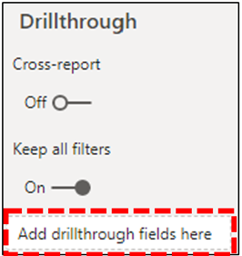

# 전화 품질 대시보드 쿼리 템플릿을 Power BI Microsoft 통화 품질 커넥터 설치

CQD(통화 품질 대시보드)에 Power BI 쿼리 템플릿(PBI Microsoft Teams X 파일)을 사용하려면 먼저 다운로드 에 포함된 *MicrosoftCallQuality.pqx* 파일을 사용하여 Power BI 전화 품질 커넥터를 설치해야 [합니다.](https://github.com/MicrosoftDocs/OfficeDocs-SkypeForBusiness/blob/live/Teams/downloads/CQD-Power-BI-query-templates.zip?raw=true)

다음 Power BI 템플릿에 대해 알아보기 위해 Teams [CQD](CQD-Power-BI-query-templates.md) 데이터를 분석합니다.

보고서에 액세스할 수 있는 [올바른 CQD](./turning-on-and-using-call-quality-dashboard.md#assign-admin-roles-for-access-to-cqd) 액세스 역할이 Power BI 합니다.

> [!NOTE]
> Microsoft 통화 품질 커넥터는 Microsoft 통화 품질 커넥터에서 DirectQuery만 Power BI. 가져오기 모드는 지원되지 않습니다. 

## 설치

커넥터를 사용할 수 있도록 사용자 지정 커넥터를 설치하고 보안을 조정하는 프로세스는 자세한 Power BI [설명되어 있습니다.](/power-bi/desktop-connector-extensibility) 단순성을 위해 간단한 설명은 다음과 같습니다.

1. 컴퓨터에 사용자 지정 커넥터 폴더에 *\[ \] \\ 문서가 Power BI Desktop \\ 확인합니다.* 그렇지 않은 경우 이 폴더를 만드면 됩니다. 1

2. *\* 커넥터 파일(.mez* 또는 *\* .pqx* 파일)을 다운로드하고 사용자 지정 커넥터 디렉터리에 *를 니다.*

3. **커넥터 파일이 *\* .mez* 파일인** 경우 사용자 지정 커넥터 설정 설명서에 설명된 바와 같이 보안 설정을 [조정해야 합니다.](/power-bi/desktop-connector-extensibility#data-extension-security)

새 버전의 Microsoft 통화 품질 커넥터가 릴리스된 경우 사용자 지정 *커넥터* 디렉터리의 이전 커넥터 파일을 새 파일로 바 대체합니다.

## 설정

보고서를 빌드하고 쿼리를 실행하려면 먼저 CQD 데이터 원본에 연결해야 합니다. 연결하기 위해 아래 단계를 따릅니다.

1. 의 홈 탭에서 Power BI Desktop 을 *클릭합니다.*

    

2. 이 *시점에 데이터* 저장 창이 나타납니다. Online *Services로 이동한* 다음 Microsoft 통화 품질(베타)을 선택하고 를 커넥트.  

    

3. 다음에 로그인하라는 메시지가 표시됩니다. 통화 품질 대시보드에 사용하는 동일한 자격 증명을 사용하세요. 2

4. 다음 프롬프트는 두 데이터 연결 모드 사이의 *옵션을 제공합니다.* *DirectQuery를 선택하고* 확인을 *쳤습니다.*

5. 마지막으로 통화 품질 대시보드에 대한 전체 데이터 모델을 보여주는 최종 프롬프트가 표시됩니다. 이 시점에는 데이터가 표시되지 않습니다. CQD의 데이터 모델만 표시됩니다. *부하를* 선택하여 설정 프로세스를 완료합니다.

6. 이 시점에서 Power BI 모델이 창의 오른쪽에 로드됩니다. 그렇지 않으면 페이지가 비어 있으며 쿼리는 기본적으로 로드되지 않습니다. 쿼리를 **빌드하고** 데이터를 반환하기 위해 아래 쿼리 빌드로 진행합니다.

이 설정 프로세스 중에 단계가 명확하지 않은 경우 프로세스에 대한 자세한 설명은 [빠른 시작:](/power-bi/desktop-quickstart-connect-to-data)커넥트 의 데이터에 Power BI Desktop.

## 쿼리 구축

설정이 완료되면 필드 창에 수백 개의 차원 및 측정값 로드의 이름이 *표시됩니다.* 여기에서 실제 쿼리를 생성하는 것은 간단합니다. 쿼리에 대해 원하는 차원 및 측정값을 선택한 다음 페이지로 끌어 놓습니다. 간단한 예제와 함께 자세한 설명은 다음과 같습니다.

1. 시각화 창에서 사용할 *시각화를* 선택합니다. 해당 시각화의 빈 버전이 페이지에 표시해야 합니다. 이 예제에서는 테이블 시각화를 *사용하게* 됩니다.

    

2. 쿼리에 사용할 크기 및 측정값(이름에 따라 집계 기호로 표시)을 결정한 다음 수동으로 선택하고 검은색 시각화로 끌어다 놓습니다. 또는 시각화 옵션 아래에 있는 *값* 필드로 끌어다 놓습니다.

    

    > [!IMPORTANT]
    > 품질 대시보드를 호출하려면 쿼리를 실행하기 위한 측정값이 필요합니다. 쿼리에 측정값을 추가하지 못하면 해당 쿼리가 실패합니다.

3. 다음으로 필터링할 차원을 선택하고 필터 창의 이 시각적 필드의 *필터로* *끌어다* 놓습니다. Microsoft Call Quality 커넥터는  현재 기본 필터링(가능한 차원 값 목록에서 값 선택), 고급 필터링(통화 품질 대시보드와 유사하게 필터링할  값 및 피연산자  지정), 상대 날짜 필터링(종료 시간 및 시작 시간 차원에만 사용 가능)을 *지원합니다.*  Top N에 따라 *필터링은* 품질 대시보드 호출에서 지원되지 않습니다.

    

4. 마지막으로 시각화 *창* 내의 서식  탭을 선택하여 쿼리의 스타일을 지정하고 서식을 지정합니다.

    > [!NOTE]
    > 품질 대시보드 쿼리를 호출하려면 하나 이상의 측정값이 필요합니다. 쿼리가 로드되지 않는 경우 쿼리에 측정값이 포함되어 있는지 다시 검사합니다.

## Drillthrougs 보고서 만들기

[드릴스루를](/power-bi/desktop-drillthrough) 사용하면 Power BI 값을 컨텍스트로 사용하여 빠르게 필터링할 수 있는 포커스가 있는 보고서를 만들 수 있습니다. Microsoft Call Quality 커넥터를 사용하여 첫 번째 쿼리를 만드는 방법을 알고 나면 드릴스루를 만드는 것이 더 간단합니다.

1. 집중된 보고서에 대한 다른 페이지를 만든 다음 해당 페이지에 쿼리를 추가합니다.

2. 드릴스루 필터로 사용할 차원을 선택하고 시각화 창의 *Drillthrough* 필드로 *끌어다* 놓습니다.

    

3. **그거에요\!** 이제 해당 차원을 사용하는 다른 페이지의 다른 쿼리는 해당 페이지로 드릴스루할 수 있습니다. 드릴스루 차원 값을 필터로 자동으로 적용합니다.

    

호출 품질 대시보드와 달리 Power BI 드릴스루를 지원합니다. 쿼리에 필요한 차원이 포함된 경우 다른 페이지로 드릴스루할 수 있습니다.

### 모범 사례

Microsoft Call Quality 커넥터 쿼리는 drillthrough 기능을 염두에 두어 설계해야 합니다. 모든 데이터를 한 번 로드한 다음 필터로 아래로 희미하게 하려고 하는 대신, 더 광범위하고 낮은 카디널리티 쿼리로 시작하고 높은 카디널리티 쿼리로 드릴다운합니다. 예를 들어 품질 문제에 가장 기여하는 서브넷을 진단하려고 할 때 먼저 문제에 기여하는 해당 지역 및 국가를 식별한 다음 해당 지역 또는 국가의 서브넷으로 드릴다운하는 것이 유용합니다. 호출 품질 커넥터 템플릿은 예제 역할을 하도록 이러한 방식으로 디자인되었습니다.

## 제한 사항

전화 Power BI 사용에도 불구하고 모든 Power BI 기능은 Microsoft 통화 품질 커넥터에서 지원되는 것은 아닙니다. 품질 대시보드의 데이터 모델 또는 일반적으로 DirectQuery 커넥터에 대한 제한의 결과입니다. 아래 목록은 커넥터의 더 주목할 만한 제한 사항 중 일부를 설명하지만 이 목록은 전체적으로 간주되지 않습니다.

1. **계산된 열 –** 일반적으로 DirectQuery 커넥터는 일반적으로 계산된 열에 대한 지원이 제한되어 Power BI. 계산된 일부 열은 커넥터와 함께 작동할 수 있습니다. 이러한 열은 예외입니다. 일반적으로 계산된 열은 작동하지 않습니다.

2. **집계 –** 호출 품질 대시보드 데이터 모델은 큐브 모델에 기본 제공되어 집계가 측정값 형태로 이미 지원됩니다. 다른 차원에 집계를 수동으로 추가하거나 측정값의 집계 유형을 변경하려고 하면 커넥터에서 작동하지 않습니다. 일반적으로 오류가 발생합니다.

3. **사용자 지정 시각적 개체 –** Microsoft Call Quality 커넥터는 다양한 사용자 지정 시각적 개체와 함께 작동하지만 모든 사용자 지정 시각적 개체와의 호환성을 보장할 수 없습니다. 많은 사용자 지정 시각적 개체는 계산된 열 또는 가져온 데이터를 사용하는 데 의존하고, 이 시각적 개체는 DirectQuery 커넥터에서 지원되지 않습니다.

4. **캐시된** 데이터 참조 - Power BI 현재는 DirectQuery 커넥터에서 캐시된 데이터를 참조하는 방법을 지원하지 않습니다. 쿼리 결과를 참조하려고 하면 새 쿼리가 표시됩니다.

5. **상대 데이터 필터링 –** Microsoft 통화 품질 커넥터에서 지원되지만 시작  시간 및 종료 시간 *차원에서만* 지원됩니다. 날짜 *차원은* 상대 날짜 필터링을 위한 명백한 선택일 수 있습니다. *날짜는* 날짜 시간 개체로 저장되지 않습니다. 따라서 날짜에서 상대 날짜 필터링을 지원하지 Power BI.

6. **측정 전용 쿼리 -** 현재 Microsoft 통화 품질 커넥터에서는 지원되지 않습니다. 세 개 이상의 측정값과 차원이 없는 시각화를 만들 때 열 데이터가 변환됩니다. 이를 방지하기 위해 항상 시각화에 하나 이상의 차원(예: 월 연도)을 포함합니다. Microsoft Call Quality 커넥터의 예정된 릴리스에서 해결될 예정인 Power BI.

7. **정부 커뮤니티 클라우드(GCC) 지원 –** 사용자 환경의 GCC Microsoft Call Quality 커넥터는 사용자만 사용할 때 Power BI Desktop 합니다. Microsoft Call Quality 커넥터는 현재 고객에 대한 Power BI 서비스와 GCC 없습니다.

이러한 문제는 대부분 CQD 데이터 모델의 디자인에 Power BI DirectQuery 커넥터 디자인에 대한 제한 사항입니다.

## 문제 해결

### 날짜 열을 날짜 슬라이서로 사용하려고 합니다. 이 열의 데이터 형식을 Date로 변환하면 이 오류가 발생합니다.

> **이 시각적 개체에** 대한 데이터를 로드할 수 없습니다. OLE DB 또는 ODBC 오류: [식.오류] 식을 데이터 원본에 접을 수 없습니다. 더 간단한 식으로 사용해 주세요.

날짜 슬라이서는 Microsoft 통화 품질 커넥터에서 지원되지 않습니다. 날짜 범위를 지정하기 위해 날짜보다 작고 큰 필터를 지정하여 보고서에 두 개의 필터를 적용합니다.

또는 볼 날짜가 최근인 경우 상대 날짜 필터를 적용하여 마지막 N일/주/월에 대한 데이터만 표시합니다.

## 오류 코드

Microsoft Call Quality 커넥터는 Power BI 쿼리 종류 측면에서 브라우저 앱보다 제한이 적기 때문에 쿼리를 구축하는 동안 종종 여러 오류가 발생할 수 있습니다. "CQDError" 형식의 오류 메시지가 수신되는 경우. RunQuery – 쿼리 실행 오류"는 쿼리로 가능한 문제를 해결하기 위해 제공된 ErrorType 번호로 아래 목록을 참조합니다. 다음은 CQD 커넥터에서 발생할 수 있는 가장 일반적인 오류 형식 코드 Power BI 있습니다.

- **ErrorType 1 - 쿼리 구조 오류:** 쿼리 구조 오류는 일반적으로 커넥터가 올바르게 서식이 지정된 쿼리를 빌드하지 못하여 발생합니다. 이 문제는 위의 제한 사항에서 지정한 대로 지원되지 않는 기능을 사용하는 경우 가장 자주 발생합니다. 해당 쿼리에 대해 계산된 열 또는 사용자 지정 시각적 개체가 사용되지 않는지 다시 한 번 검사합니다.

  - **ErrorType 2 - 쿼리 작성 오류:** 쿼리 빌드 오류는 빌드하려는 쿼리를 올바르게 구문 분석할 수 없는 Microsoft 호출 품질 커넥터로 인해 발생합니다. 이 문제는 위의 제한 사항에서 지정한 대로 지원되지 않는 기능을 사용하는 경우 가장 자주 발생합니다. 해당 쿼리에 대해 계산된 열 또는 사용자 지정 시각적 개체가 사용되지 않는지 다시 한 번 검사합니다.

  - **ErrorType 5 - 실행 시간 제한:** 쿼리가 타이밍 아웃 전에 가능한 최대 런타임에 도달했습니다. 쿼리에 필터를 더 추가하여 범위를 제한합니다. 데이터 범위를 좁히는 것이 이를 달성하는 가장 효과적인 방법일 수 있습니다.

  - **ErrorType 7 - 측정 오류 없음:** 품질 대시보드 쿼리를 호출하려면 작동하려면 측정값이 필요합니다. 쿼리에 측정값이 포함되어 있는지 다시 한 번 검사합니다. Microsoft 통화 품질 커넥터의 측정값은 이름 앞에 집계(합계) 기호로 표시됩니다.

이 범위를 벗어난 추가 오류가 발생하는 경우 문제를 해결하고 설명서를 적절하게 업데이트할 수 있도록 전화 품질 대시보드 팀에 알려 주세요.

## 각주

**1** 특정 프로세스 및 앱(예: OneDrive) 문서 루트 폴더가 변경될 수 있습니다. 사용자 지정 *\\* Power BI Desktop 디렉터리가 현재 루트 폴더 문서 폴더 안에 배치되어 있는지 확인합니다.

**2** 통화 품질 대시보드에 사용하는  로그인 자격 증명은 앱 자체에 로그인하는 데 사용하는 Power BI Desktop 필요가 없습니다.

## 자주 묻는 질문

### "베타" Power BI 커넥터가 언제 업데이트될까요?

베타 태그에도 불구하고 Microsoft 호출 품질(베타) 커넥터는 Power BI 첫 번째 '릴리스' 버전이며, 이를 반영하기 위해 공식적으로 Power BI 보안이 서명되었습니다. 커넥터의 초기 릴리스 당시 Power BI 지원 및 광범위한 인증을 제공할 수 없지만 Microsoft Call Quality 커넥터의 보안, 진정성 및 일반 기능을 증명할 준비가 된 것입니다. 향후 Microsoft Call Quality 커넥터에 투자하여 가까운 Power BI 계획입니다.

### 브라우저의 품질 대시보드 호출에 비해 커넥터가 느리게 보이는 이유는 무엇입니까? 성능을 향상하기 위해 무엇을 할 수 있나요?

다양한 템플릿에 대한 쿼리 성능은 실제로 브라우저와 커넥터 모두에서 동일합니다.  다른 독립 실행형 앱과 마찬가지로 Power BI 성능에 인증 및 렌더링 시간이 추가됩니다. 또한 실행되는 동시 쿼리 수에 차이가 있습니다. 브라우저 내 버전의 통화 품질 대시보드에는 덜 잘 개발되고 정보 밀도가 높은 시각화 옵션이 있기 때문에 대부분의 보고서는 한에 2-3개 쿼리를 로드하는 것으로 제한되었습니다. 반면 커넥터 템플릿은 종종 20개 이상의 동시 쿼리를 표시합니다. 이전 보고서와 같은 응답성이 높은 보고서를 빌드하려는 경우 탭당 쿼리가 2~3개가 넘지 않습니다.

자세한 내용은 다음 문서를 참조하세요.

- [최적화 가이드 Power BI](/power-bi/guidance/power-bi-optimization)
- [DirectQuery 모델 지침](/power-bi/guidance/directquery-model-guidance)

### 쿼리를 실행할 때 10,000개 행 제한에 정기적으로 실행됩니다. 10,000개 이상의 행을 반환하는 커넥터를 어떻게 얻을 수 있나요?

10,000행 제한은 실제로 API 엔드에 지정되어 있으며 성능을 크게 개선하고 메모리 부족으로 인한 쿼리 실행 오류의 위험을 줄이기 위해 디자인되었습니다.

결과 행 수를 늘리는 대신 커넥터 모범 사례에 따라 보고서를 다시 구조화하는 것이 가장 좋습니다. 포함된 템플릿은 이러한 모범 사례를 보여 주기 위해 디자인됩니다. 가능한 경우 월, 연도, 날짜, 지역, 국가 등 더 광범위하고 낮은 카디널리티 차원을 사용하여 KPIS를 확인하여 시작하세요. 거기에서 점점 더 높은 카디널리티 차원으로 드릴다운할 수 있습니다. 헬프데스크 및 Location-Enhanced 보고서는 모두 이 드릴다운 워크플로의 좋은 예제를 제공합니다.

## 관련 항목

[Power BI CQD 데이터를 분석하는 데 Teams](CQD-Power-BI-query-templates.md)
