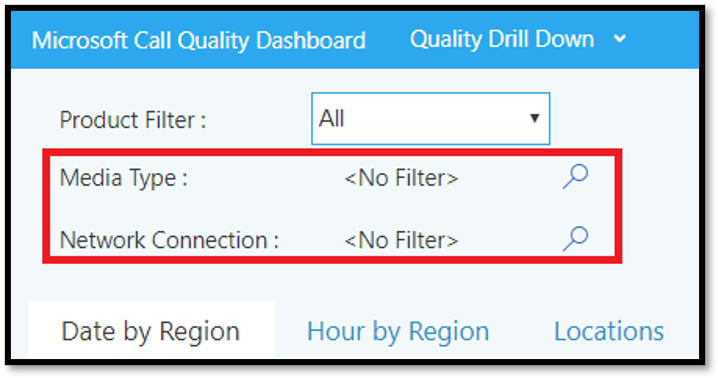

# <a name="data-and-reports-in-call-quality-dashboard-cqd"></a>CQD(통화 품질 대시보드)의 데이터 및 보고서

CQD(Microsoft Call Quality 대시보드)는 거의 실시간(NRT) 데이터 피드를 사용 합니다. 통화 레코드는 통화가 종료된 후 30분 이내에 CQD에서 사용할 수 있습니다. NRT 파이프라인의 호출 레코드는 데이터 집합에서 제거되기 몇 개월 동안만 사용할 수 있습니다. 


## <a name="many-ways-to-access-cqd-data"></a>CQD 데이터에 액세스하는 여러 가지 방법

여러 다른 방법으로 CQD 데이터에 액세스할 수 있습니다. 요구 사항을 가장 잘 충족하는 것을 선택하세요.

|&nbsp;|&nbsp;|
|---------|---------|
|Teams 관리 [센터() https://admin.teams.microsoft.com) ](https://admin.teams.microsoft.com)    | CQD 데이터는 읽기  쉬운 Teams 가장 일반적인 데이터를 보여 주며 관리 센터의 사용자 페이지에 포함됩니다. 사용자 에서 찾은 CQD 데이터를 사용자 지정할 수 **없습니다.**  |
|CQD 포털 [( https://cqd.teams.microsoft.com) ](https://cqd.teams.microsoft.com)     | 드릴스루 필터링을 통해 대부분의 요구 사항을 충족하는 강력한 요약 및 세부 보고서. CQD 포털에서 보고서를 사용자 지정할 수 있습니다. <br><br>[CQD 포털에서](#import-the-cqd-report-templates) 데이터를 분석하는 데 도움이 되는 두 개의 CQD 보고서 템플릿을 얻습니다.       |
|Power BI     | 직접 쿼리를 사용하여 사용자 지정 가능한 템플릿을 사용하여 Power BI CQD 데이터를 Power BI [있습니다.](CQD-Power-BI-query-templates.md) [CQD에 Power BI 쿼리 템플릿을 다운로드합니다.](https://github.com/MicrosoftDocs/OfficeDocs-SkypeForBusiness/blob/live/Teams/downloads/CQD-Power-BI-query-templates.zip?raw=true)<br><br>REST API를 사용하여 데이터를 통해 [CQD](/skypeforbusiness/management-tools/call-quality-dashboard/data-api) 데이터에 액세스할 Power BI. 오프라인으로 작업할 수 있도록 CQD 데이터를 다운로드하려는 경우 이 방법을 사용합니다. 이 메서드를 사용하면 성능이 향상됩니다. 특히 온라인에 있는 경우 Power BI 큰 데이터 집합에 유용합니다.       |
|그래프 API     | 를 사용하여 통화 품질 [데이터에 직접 Graph 합니다.](/graph/api/resources/callrecords-api-overview?view=graph-rest-beta) 가장 복잡한 방법이지만 통화 품질 데이터를 분석하는 데 가장 많은 제어 및 유연성을 제공합니다. 예를 들어 조직의 다른 데이터와 조인해야 하는 경우 데이터 모델을 만들고 통화 품질 데이터를 통합하는 데 Graph API를 사용할 수 있습니다.        |

## <a name="import-the-cqd-report-templates"></a>CQD 보고서 템플릿 가져오기

CQD를 사용하여 빠르게 속도를 향상할 수 있도록 큐레이터된 두 개의 [CQD](https://aka.ms/qertemplates) 보고서 템플릿(모든 네트워크 및 관리 네트워크)을 다운로드합니다. 건물 데이터 파일로 작업하도록 최적화된 모든 네트워크 템플릿은 다음 섹션에서 설명한 바와 같이 건물 정보를 CQD로 수집하고 업로드하는 동안 사용할 수 있습니다.

**템플릿을 가져오기(). CQDX)를 CQD로**

1. CQD에서 **페이지** 맨 위에 있는 메뉴에서 세부 보고서를 선택합니다.

2. 왼쪽 패널에서 가져오기 **를 선택합니다.** 첫 번째 CQDX 템플릿으로 찾아 **열기 를 선택합니다.**

3. 템플릿이 업로드된 후 팝업 창에 "보고서 가져오기 성공"이 표시됩니다. 

4. 두 번째 CQD 템플릿에 대해 2단계와 3단계를 반복합니다.

   > [!NOTE]
   > 각 사용자는 CQD 템플릿을 CQD 인스턴스로 가져와야 합니다. 


## <a name="euii-data"></a>EUII 데이터

규정 준수 이유로 최종 사용자 식별 정보(EUII) 데이터(개인 식별 정보 또는 PII라고도 하는)는 28일 동안만 유지됩니다. NRT 데이터가 28일 마크를 교차하면 EUII를 포함하는 필드가 지워지기 때문에 EUII가 없는 NRT 데이터가 생성됩니다. EUII 데이터가 포함된 필드는:

- 전체 IP 주소
- MAC(미디어 액세스 제어) 주소
- 기본 서비스 집합 식별자(BSSID)
- SIP(세션 시작 프로토콜) URI(비즈니스용 Skype만 해당)
- 사용자 주체 이름(UPN)
- 컴퓨터 엔드포인트 이름
- 사용자 Verbatim 피드백
- 개체 ID(엔드포인트 사용자의 Active Directory 개체 ID)

### <a name="admin-roles-with-and-without-euii-access"></a>EUII 액세스 권한이 없는 관리자 역할

이러한 [RBAC](/azure/role-based-access-control/overview) 역할 **DO에는** EUII 액세스 권한이 있습니다.
- 전역 관리자
- Teams 서비스 관리자
- Teams 통신 관리자
- Teams 커뮤니케이션 지원 엔지니어
- 전역 읽기
- 비즈니스용 Skype 관리자

이러한 RBAC  역할에는 EUII 액세스 권한이 없습니다.
- 보고서 읽기
- Teams 통신 지원 전문가


## <a name="date-controls"></a>날짜 컨트롤

CQD는 다음과 같은 롤링 추세 지원합니다.

- 5일
- 7일
- 30일
- 60일
- 90일

URL 날짜 매개 변수는 Day 필드를 허용합니다. 롤링 데이 보고서는 YYYY-MM-DD 형식으로 지정된 날짜를 추세의 마지막 날로 사용합니다. URL 날짜 매개 변수 "00"은 "today"를 나타냅니다.

|URL| 롤링 데이의 종료 추세|
|:---|:---|
|<span><cqdv3>https:// /spd/#/Dashboard/ <reportid> /2019-02/</span>   |2019년 2월 현재의 날|
|<span><cqdv3>https:// /spd/#/Dashboard/ <reportid> /2019-02-15/</span>|2019년 2월 15일|
|<span><cqdv3>https:// /spd/#/Dashboard/ <reportid> /00/</span>        |현재 일|
|||

기본적으로 월의 현재 날은 롤링 데이의 마지막 날로 추세.


## <a name="data-available-in-cqd-reports"></a>CQD 보고서에서 사용할 수 있는 데이터

기본 요약 및 자세한 CQD 보고서는 구성에 대한 통화 품질을 관리하는 데 필요한 모든 것일 수 있습니다. 필요한 경우 사용자 지정 보고서를 [만들 수 있습니다.](#create-custom-detailed-reports) 

데이터를 사용하여 CQD Power BI 분석하려는 경우 Power BI 를 사용하여 [CQD](CQD-Power-BI-query-templates.md)데이터를 분석할 Teams.

|기능|요약 보고서|자세한 보고서|
|:--- |:--- |:--- |
|애플리케이션 공유 메트릭 | 아니요 | 예 |
|고객 빌딩 정보 지원 | 예 | 예 |
|고객 엔드포인트 정보 지원 | 오직 <span> cqd.teams.microsoft.com<span/> | 오직 <span> cqd.teams.microsoft.com<span/> |
|드릴다운 분석 지원   | 아니요   | 예   |
|미디어 안정성 메트릭   | 아니요   | 예   |
|사용 안 함 보고서   | 예   | 예   |
|개요 보고서   | 예   | 예   |
|사용자당 보고서 집합   | 아니요   | 예   |
|보고서 집합 사용자 지정(보고서 추가, 삭제, 수정)   | 아니요   | 예   |
|비디오 기반 화면 공유 메트릭   | 아니요   | 예   |
|비디오 메트릭   | 아니요   | 예   |
|사용 가능한 데이터 양   | 지난 12개월   | 지난 12개월   |
|Microsoft Teams 데이터   | 예   | 예   |
| | | |


 
### <a name="select-product-data-to-see-in-reports"></a>보고서에서 볼 제품 데이터 선택

요약 및 Location-Enhanced 보고서에서 제품 필터 드롭다운을 사용하여 모든 제품 데이터, Microsoft Teams 데이터 또는 비즈니스용 Skype 온라인 데이터만 표시할 수 있습니다. 

> [!div class="mx-imgBorder"]
> 
  
자세한 보고서에서 **Is Teams** 차원을 사용하여 Microsoft Teams 또는 비즈니스용 Skype Online 데이터로 데이터를 필터링할 수 있습니다.

## <a name="summary-reports"></a>요약 보고서

CQD에 처음 로그인할 때 CQD 대시보드에 표시됩니다. 품질이 좋지 않은 서브넷 식별을 지원하기 위해 매일, 월별 및 표 보고서를 사용하여 품질 추세를 한눈에 살펴볼 수 있습니다. 

| 탭 | 설명 |
|---------|---------|
|전체 통화 품질     | 다른 3개 탭의 집계입니다.       |
|Server—Client     |서버와 클라이언트 엔드포인트 간의 스트림에 대한 세부 정보입니다.        |
|Client—Client     |두 클라이언트 엔드포인트 간의 스트림에 대한 세부 정보입니다.        |
|음성 품질 SLA     |비즈니스용 Skype 음성 품질 [SLA에](https://go.microsoft.com/fwlink/p/?linkid=846252)포함된 호출에 대한 정보        |

### <a name="overall-call-quality-tab"></a>전체 통화 품질 탭

이 탭의 데이터를 사용하여 스트림 수 및 가난한 백분율을 기준으로 통화 품질 상태 및 추세를 평가합니다. 오른쪽 위 모서리의 범례에는 이러한 메트릭을 나타내는 색 및 시각적 요소가 표시됩니다.

> [!div class="mx-imgBorder"]
> 
  
스트림은 좋음, 불량 및 분류되지 않은 세 그룹으로 분류됩니다. 또한 불량으로 분류된 스트림의 비율을 총  분류된 스트림 수에 대한 비율을 주는 계산된 가난한 % 값도 있습니다.  *빈약한 % = 불량 스트림/ (불량 스트림+ 양호한 스트림) * 100이기* 때문에 불량 %는 여러 개의 비분류된 스트림의 존재에 영향을 받지  *않습니다.* 스트림을 가난하거나 양호로 분류하는 것을 보기 위해 통화 품질 대시보드의 [스트림 분류를 참조하세요.](stream-classification-in-call-quality-dashboard.md)
  
왼쪽의 배율을 사용하여 스트림 수 값을 측정합니다.

> [!div class="mx-imgBorder"]
> 
  
오른쪽의 배율을 사용하여 가난한 % 값을 측정합니다.

> [!div class="mx-imgBorder"]
> 
  
마우스를 막대 위에 마우스로 이동하여 실제 숫자 값을 얻을 수 있습니다.
  
> [!NOTE]
> 다음 예제는 매우 작은 샘플 데이터 집합의 예제로, 실제 배포에 대한 값은 현실적이지 않습니다.

> [!div class="mx-imgBorder"]
> 
  
전체 스트림 볼륨은 계산된 불량 백분율의 관련성 여부를 결정하는 데 도움이 됩니다. 전체 스트림의 볼륨이 작을수록 보고된 불량 백분율 값이 덜 안정적입니다.
  
### <a name="server-client-tab-and-client-client-tabs"></a>Server-Client 탭 및 Client-Client 탭

이 두 탭은 엔드포인트 대 엔드포인트 시나리오에서 이루어진 스트림에 대한 세부 정보를 제공합니다. Server-Client 탭에는 미디어 스트림이 흐르는 4개의 시나리오를 나타내는 4개의 축소할 수 있는 섹션이 있습니다.
  
- Wired Inside
- 외부에 유선
- WiFi Inside
- WiFi 외부

마찬가지로, Client-Client 탭에는 5개의 축소할 수 있는 섹션이 있습니다.

- Wired Inside — Wired Inside
- 유선 내부 - 외부에 유선
- 유선 외부 - 외부 유선
- Wired Inside — WiFi Inside
- Wired Inside — WiFi Outside

#### <a name="inside-versus-outside"></a>내부 및 외부

CQD는 스트림이 있는  경우  건물 정보를 사용하여 스트림을 내부 또는 외부로 분류합니다. 각 스트림의 엔드포인트는 서브넷 주소와 연결됩니다. 서브넷이 업로드된 건물 정보에서 InsideCorp로 표시된 서브넷 목록에 있는 경우 내부로 *간주됩니다.* 건물 정보가 아직 업로드되지 않은 경우 내부 테스트에서는 항상 스트림을 외부로 *분류합니다.* 

테스트에 대한 내부 Server-Client 클라이언트 엔드포인트만 고려합니다. 서버는 항상 사용자의 관점에서 외부에 있기 때문에 테스트에서 고려되지 않습니다.
  
#### <a name="wired-versus-wifi"></a>WiFi와 유선 연결

이름이 표시한 것 처럼 분류 조건은 클라이언트 연결의 유형을 기반으로 합니다. 서버는 항상 유선으로 연결됩니다. 이 서버는 계산에 포함되지 않습니다. 주어진 스트림에서 두 엔드포인트 중 하나가 WiFi 네트워크에 연결된 경우 CQD는 WiFi로 분류합니다.

> [!NOTE]
> 스트림이 제공되면 두 엔드포인트 중 하나가 WiFi 네트워크에 연결되어 있는 경우 CQD에서 WiFi로 분류됩니다.
  
  
## <a name="tenant-data-information"></a>테넌트 데이터 정보

CQD 요약 보고서 대시보드에는  테넌트 데이터 업로드 페이지가 포함되어 있습니다. 오른쪽 위 모서리의 설정 메뉴에서 **테넌트 데이터** 업로드를 선택하여 액세스합니다. 이 페이지는 관리자가 다음과 같은 자신의 정보를 업로드하는 데 사용됩니다.

- IP 주소 및 지리적 정보의 지도입니다.
- 각 무선 AP 및 해당 MAC 주소의 지도입니다.
- 엔드포인트 메이드/모델/유형 등에 대한 엔드포인트 맵
  
CQD가 보고서에 이 정보를 포함할 수 있도록 테넌트, 건물 및 위치 데이터를 업로드하는 것이 좋습니다. 이 데이터를 아직 업로드하지 않은 경우 테넌트 업로드 및 데이터 구축 [을 읽습니다.](CQD-upload-tenant-building-data.md) 


## <a name="detailed-reports"></a>자세한 보고서

| 이름 | 설명 |
|---------|---------|
|Location-Enhanced 보고서     |위치 정보를 기반으로 품질 추세를 보여줍니다. 이 보고서는 테넌트 데이터를 업로드한 [경우만 표시됩니다.](CQD-upload-tenant-building-data.md)        |
|안정성 보고서     |오디오, 비디오, VBSS(비디오 기반 화면 공유) 및 앱 공유 보고서를 포함합니다.        |
|환경 품질 보고서     |회의실을 비롯한 모든 클라이언트 및 디바이스에 대한 오디오 품질 및 안정성 이러한 보고서는 다운로드 가능한 [CQD](https://aka.ms/QERtemplates)템플릿의 "슬림 다운" 버전으로, 오디오 품질 및 안정성을 분석하기 위한 주요 영역에 중점을 두고 있습니다.         |
|품질 드릴다운 보고서     | 드릴다운: 지역, 위치, 서브넷, 시간 및 사용자별로 날짜를 정합니다.        |
|오류 드릴다운 보고서     | 드릴다운: 지역, 위치, 서브넷, 시간 및 사용자별로 날짜를 정합니다.        |
|내 통화 보고서 평가     |지역, 위치 또는 사용자별로 사용자 통화 등급을 분석합니다. 구두 피드백을 포함합니다.         |
|도움말 데스크 보고서     |Help Desk 보고서는 개별 사용자, 사용자 그룹 또는 모든 사용자에 대한 통화 및 모임 데이터를 살펴 니다. 이러한 보고서는 건물 및 EUII 데이터를 통합하여 네트워크 위치, 회의 세부 정보, 디바이스 또는 펌웨어를 기반으로 가능한 시스템 문제를 식별하는 데 도움이 됩니다.         |
|클라이언트 버전 보고서     |클라이언트 버전 요약: 각 클라이언트 앱 버전에 대한 세션 및 사용자 수 보기<br><br>사용자별로 클라이언트 버전: 각 클라이언트 앱 버전에 대한 사용자 이름 보기 <br><br>제품 및 클라이언트 유형에 대한 미리 구축된 필터를 사용하면 버전을 특정 클라이언트에 집중하는 데 도움이 됩니다.         |
|엔드포인트 보고서     |컴퓨터 엔드포인트(컴퓨터 만들기 및 모델)에 따라 호출 품질을 보여줍니다. 이러한 보고서에는 업로드한 경우 데이터 작성이 포함됩니다.         |


## <a name="create-custom-detailed-reports"></a>사용자 지정 세부 보고서 만들기

기본 CQD 보고서가 요구 사항을 충족하지 않는 경우 다음 지침을 사용하여 사용자 지정 보고서를 만들 수 있습니다. 또는(2020년 1월) [CQD ](cqd-power-bi-query-templates.md)보고서에 Power BI 사용하세요.

로그인에 표시되는 화면 맨 위에 있는 보고서의 풀다운 목록에서 요약 보고서 화면에서 세부 보고서 선택 및 새 \(  \) 를 **선택합니다.**  **보고서에서** 편집을 클릭하여 쿼리 편집기를 볼 수 있습니다. 각 보고서는 큐브에 대한 쿼리에 의해 백업됩니다. 보고서는 쿼리에서 반환된 데이터의 시각화입니다. 쿼리 편집기를 사용하면 이러한 쿼리 및 보고서의 표시 옵션을 편집할 수 있습니다.

> [!IMPORTANT]
> 네트워크 범위는 슈퍼넷을 나타내는 데 사용할 수 있습니다(단일 라우팅 연결 연결과 여러 서브넷의 조합). 모든 새 건물 업로드는 겹치는 범위에 대해 검사됩니다. 이전에 건물 파일을 업로드한 경우 현재 파일을 다운로드하고 다시 업로드하여 중복을 식별하고 문제를 해결한 후 다시 업로드해야 합니다. 이전에 업로드된 파일의 겹치는 경우 보고서의 건물에 서브넷이 잘못 매핑될 수 있습니다. 특정 VPN 구현은 서브넷 정보를 정확하게 보고하지 않습니다. 서브넷에 대한 하나의 항목 대신 건물 파일에 VPN 서브넷을 추가할 때 별도의 32비트 네트워크로 VPN 서브넷의 각 주소에 대해 별도의 항목이 추가되는 것이 좋습니다. 각 행에는 동일한 건물 메타데이터가 있습니다. 예를 들어 172.16.18.0/24에 대한 행 하나 대신 256개 행을 포함해야 합니다. 각 주소의 행은 172.16.18.255/32 사이입니다.
>
> VPN 열은 선택 사항이며 기본값은 0입니다.  VPN 열 값이 1로 설정되어 있는 경우 해당 행으로 나타내는 서브넷이 서브넷 내의 모든 IP 주소와 일치하게 완전히 확장됩니다.  이러한 서브넷을 완전히 확장하면 데이터 작성과 관련된 쿼리에 대한 쿼리 타임에 부정적인 영향을 미치기 때문에 VPN 서브넷에만 이 기능을 꼭 사용하세요.

자세한 값을 표시하기 위해 보고서의 막대형 차트 및 추세선을 나타냅니다. 포커스가 있는 보고서에는 작업 메뉴가 표시됩니다. **편집,** **복제,** **삭제,** **다운로드** 및 보고서 **트리 내보내기.**


## <a name="query-filters"></a>쿼리 필터

쿼리 필터는 CQD의 쿼리 편집기를 사용하여 구현됩니다. 이러한 필터는 CQD에서 반환하는 레코드 수를 줄이는 데 사용 하여 보고서의 전체 크기 및 쿼리 시간을 최소화합니다. 관리되지 않는 네트워크를 필터링하는 데 특히 유용합니다. 다음 표에 나열된 필터는 정규식(RegEx)을 사용합니다.


| Filter         | 설명          | CQD 쿼리 필터 예제      |
|----------------|----------------------|-------------------------------|
| 빈 값 없음   | 일부 필터에는 빈 값을 필터링하는 옵션이 없습니다. 빈 값을 수동으로 필터링하려면 빈 식을 사용하여 요구에 따라 필터를 같음 또는 같지 않은 것으로 설정합니다.      | 두 번째 건물 이름 \<\> \^ \\ s\*\$                       |
| 일반적인 서브넷 제외 | 관리되지 않는 네트워크와 구분하기 위해 유효한 건물 파일이 없는 경우 홈 네트워크가 보고서에 포함됩니다. 이러한 홈 서브넷은 IT 제어의 범위를 벗어날 수 있으며 보고서에서 신속하게 제외할 수 있습니다. 이 가이드에 정의된 일반적인 서브넷은 10.0.0.0, 192.168.1.0 및 192.168.0.0입니다. | 두 번째 서브넷 \<\> 10.0.0 \| 192.168.0.0 \| 192.168.1.0 |
| 내부 보기만  | 관리(내부) 또는 관리되지 않는(외부)에 대한 보고서를 필터링하는 데 사용됩니다. 관리되는 CQD 템플릿은 이미 이러한 필터로 미리 구성됩니다.       | 두 번째 내부 Corp = 내부        |

## <a name="report-filters"></a>보고서 필터

CQD 보고서 필터를 사용하여 조사의 포커스를 좁힐 수 있습니다. 쿼리 편집기 또는 보고서에서 직접 렌더링된 보고서에 필터를 추가하여 보고서 필터를 사용합니다. 다음 보고서 필터는 [CQD](https://aka.ms/QERtemplates)템플릿 전체에 사용됩니다.


| Filter     | 설명                            | CQD 보고서 필터 예제         |
|------------|----------------------------------------|-----------------------------------|
| 월      | 첫 번째 연도, 월로 시작합니다. | 2017-10                           |
| 알파벳 | 영문자에 대한 필터입니다. | [a-z]                             |
| 숫자    | 숫자 문자에 대한 필터입니다.    | [0-9]                             |
| 백분율 | 백분율에 대한 필터입니다.              | ([3-9] \\ .) \| ([3-9]) \| ([1-9][0-9]) |


### <a name="drill-down-filters"></a>드릴다운 필터

CQD 보고서에는 통화 품질 조사의 포커스를 좁히는 강력한 도구인 몇 가지 드릴다운 필터가 있습니다. 드릴다운 필드를 선택하면 보고서가 자동으로 적절한 탭을 열고 선택한 값에 대한 필터를 선택합니다. 해당 탭에 자체 드릴다운 필드가 있으며 하나의 필드가 선택된 경우 두 필터 집합이 모두 적용되어 결과 데이터 집합이 점진적으로 좁아지고 있습니다.


#### <a name="adding-and-editing-drill-down-fields"></a>드릴다운 필드 추가 및 편집

보고서를 편집할 때 쿼리 편집기를 사용하여 사용자 자신의 드릴다운 필드를 지정할 수 있습니다.

를 클릭하여 **시작하세요.** 편집하려는 보고서의 경우 편집을 **선택합니다.**


쿼리 편집기 왼쪽의 목록에서 차원을 선택합니다. 그런 다음 탐색 레이블 아래의 드롭다운을 **클릭하고** 해당 차원을 드릴링할 탭 및 확장기 그룹을 선택합니다. 참고: 현재 드릴다운 기능은 다른 탭으로 이동하여만 작동합니다. 특정 확장기에 드릴링에 대한 지원은 나중에 추가됩니다. 마지막으로 닫기를 **클릭하여** 변경 내용을 차원에 저장한 다음 저장을 클릭하여 쿼리 편집기를 저장하고 닫습니다. 


### <a name="multi-select-filters"></a>다중 선택 필터

드릴다운 기능 외에도 CQD는 여러 값(OR 필터)이 있는 필터 지정도 지원합니다.

여러 필터 값을 선택하려면 먼저 보고서에 새 필터를 추가합니다. 필터 레이블 옆을 클릭하고 사용할 차원의 이름을 입력하고 **+** 추가를 **클릭합니다.** 


그런 다음 **검색(새** 필터 옆에 있는 돋보기 아이콘)을 클릭합니다. 텍스트 필드와 모두 선택 및 반전을  비롯한 다양한 **옵션이 표시됩니다.** 값을 입력하고 해당 필드 **옆에** 있는 검색을 클릭하여 검색합니다. 또는 텍스트 필드를 비워두고 **검색을** 클릭하여 처음 100개 옵션까지 볼 수 있습니다.

```powershell
/filter/[AllStreams].[Second Tenant Id]\|[YOUR TENANT ID HERE]
```

예제:  


### <a name="dashboard-level-filters"></a>대시보드 수준 필터
특정 CQD 보고서에는 대시보드 수준 필터가 추가되어 일반적인 매개 변수를 통해 쉽게 필터링할 수 있습니다. 이러한 필터는 일반 보고서 탭 외부 및 제품 필터 바로 아래에 나타나며 대시보드의 모든 필터에 적용됩니다.


```powershell
/filter/[AllStreams].[Is Teams]|[TRUE | FALSE]
```

### <a name="url-filters"></a>URL 필터

CQD는 URL에 필터 추가를 지원합니다. 이렇게 하면 CQD 쿼리를 쉽게 공유하거나 책갈피를 만들 수 있습니다. URL에서 추세 월, 테넌트 ID 또는 언어와 같은 매개 변수를 정의할 수 있습니다. URL에 제품 또는 대시보드 수준 필터를 추가할 수도 있습니다.
CQD 보고서에서 페더링된 데이터를 제외하면 페더링된 엔드포인트가 보고서에 영향을 줄 수 있는 관리되는 건물 또는 네트워크를 수정하는 경우 유용합니다.

필터를 추가하고 URL 끝에 다음을 추가합니다.

```console
/filter/[AllStreams].[Second Tenant Id]\|[YOUR TENANT ID HERE]
```

예제:  

`https://cqd.teams.microsoft.com/cqd/#/1234567/2018-08/filter/[AllStreams].[Second Tenant Id]|[TENANTID]`

URL에 대시보드 수준 필터를 추가하려면 해당 필터가 제품 또는 대시보드 수준 필터로 CQD에 있어야 합니다. 추세 월 이후 및 URL 매개 변수 앞에 다음 필터를 URL에 추가합니다.

`filter/DATA_MODEL_NAME|VALUE`

예를 들어 Microsoft Teams의 제품 필터 값을 적용하기 위해 다음을 추가합니다.

`filter/[AllStreams].[Is%20Teams]|[True]`

전체 URL은 다음과 같습니다.

`https://cqd.teams.microsoft.com/spd/#/Dashboard/2624085/2018-9/filter/[AllStreams].[Is%20Teams]|[True]`

다중 선택 값으로 URL 필터를 적용하려면 파이프(|) 문자로 | 합니다. 예를 들면 다음과 같습니다.

`filter/[AllStreams].[Media%20Type]|[Video]|[Audio]|[VBSS]`

잘못된 이름 또는 값을 지정하면 URL 필터가 적용되지 않습니다.


URL 필터를 사용하여 특정 차원에 대한 모든 보고서를 필터링할 수 있습니다. 가장 일반적인 URL 필터는 페더리된 참가자 원격 분석에서 제외하기 위해 보고서를 필터링하거나 Teams 또는 Skype for Business Online에만 집중하는 데 사용됩니다. CQD 보고서에서 페더링된 데이터를 제외하면 페더링된 엔드포인트가 보고서에 영향을 줄 수 있는 관리되는 건물 또는 네트워크를 수정하는 경우 유용합니다.

| Filter         | 설명          | CQD 쿼리 필터 예제      |
|----------------|----------------------|-------------------------------|
| 빈 값 없음   | 일부 필터에는 빈 값을 필터링하는 옵션이 없습니다. 빈 값을 수동으로 필터링하려면 빈 식을 사용하여 요구에 따라 필터를 같음 또는 같지 않은 것으로 설정합니다.      | 두 번째 건물 이름 \<\> \^ \\ s\*\$                       |
| 일반적인 서브넷 제외 | 관리되지 않는 네트워크와 구분하기 위해 유효한 건물 파일이 없는 경우 홈 네트워크가 보고서에 포함됩니다. 이러한 홈 서브넷은 IT 제어의 범위를 벗어날 수 있으며 보고서에서 신속하게 제외할 수 있습니다. 이 문서에 정의된 일반적인 서브넷은 10.0.0.0, 192.168.1.0 및 192.168.0.0입니다. | 두 번째 서브넷 \<\> 10.0.0 \| 192.168.0.0 \| 192.168.1.0 |
| 내부 보기만  | 관리(내부) 또는 관리되지 않는(외부)에 대한 보고서를 필터링하는 데 사용됩니다. 관리되는 CQD 템플릿은 이미 이러한 필터로 미리 구성됩니다.       | 두 번째 내부 Corp = 내부        |


#### <a name="how-to-find-your-tenant-id"></a>테넌트 ID를 찾는 방법

CQD의 테넌트 ID는 Azure의 디렉터리 ID에 해당합니다. 디렉터리 ID를 모르는 경우 Azure Portal에서 찾을 수 있습니다.

1.  Microsoft Azure Portal에 로그인: <https://portal.azure.com>

2.  **Azure Active Directory를 선택합니다.**

3.  **관리에서** 속성을 **선택합니다.** 테넌트 ID는 **디렉터리 ID 상자에** 있습니다.

PowerShell을 사용하여 테넌트 ID를 찾을 수도 있습니다. 

```powershell
Login-AzureRmAccount
```

## <a name="comparing-teams-and-skype-for-business-cqd-data"></a>Teams 및 Skype for Business CQD 데이터 비교

데이터를 검토할 때 Teams와 비즈니스용 Skype 간의 데이터 차이가 표시될 수 있습니다. 몇 가지 이유:
- 성능 및 안정성을 보장하기 위한 메커니즘의 차이점:
  - Teams에는 자동 다시 연결 및 빠른 로밍이 있습니다. 비즈니스용 Skype는 사용할 수 없습니다.
  - 팀에는 동적 대역폭 관리가 있습니다. 비즈니스용 Skype는 사용할 수 없습니다.
- Teams와 비즈니스용 Skype 간의 [IP](Office-365-URLs-IP-address-ranges.md) 주소 범위의 차이점입니다. Teams IP 범위가 더 새로 추가된 경우 방화벽에서 연결 문제가 발생할 수 있습니다.


## <a name="related-topics"></a>관련 주제

[Teams에 대한 통화 품질 개선 및 모니터링](monitor-call-quality-qos.md)

[CQD란?](CQD-what-is-call-quality-dashboard.md)

[CQD(통화 품질 대시보드) 설정](turning-on-and-using-call-quality-dashboard.md)

[테넌트 및 건물 데이터 업로드](CQD-upload-tenant-building-data.md)

[CQD를 사용하여 통화 및 모임 품질 관리](quality-of-experience-review-guide.md)

[CQD에서 사용할 수 있는 차원 및 측정값](dimensions-and-measures-available-in-call-quality-dashboard.md)

[CQD의 스트림 분류](stream-classification-in-call-quality-dashboard.md)

[Power BI를 사용하여 CQD 데이터 분석](CQD-Power-BI-query-templates.md)
