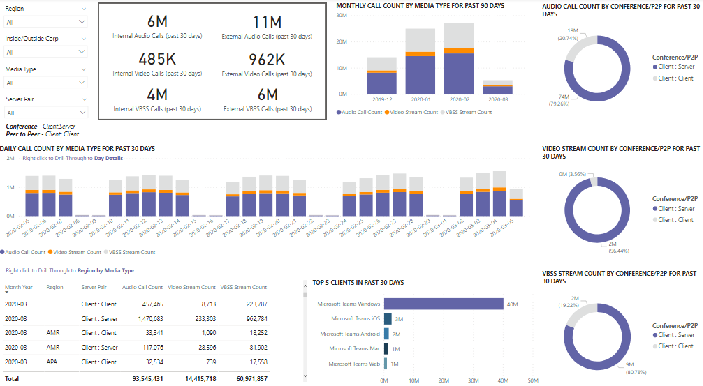

# CQD 데이터를 사용하여 Power BI에서 Microsoft Teams 사용률 보기

2020년 3월에 새로 추가된 [CQD용 다운로드](https://github.com/MicrosoftDocs/OfficeDocs-SkypeForBusiness/blob/live/Teams/downloads/CQD-Power-BI-query-templates.zip?raw=true)가능한 Power BI 쿼리 템플릿에 Teams 사용률 보고서를 추가했습니다. 

이 새 Teams 사용률 보고서를 통해 사용자가 CQD(Teams Call Quality 대시보드) 데이터에 액세스하여 Microsoft Teams를 사용하는 방법(및 양)을 볼 수 있습니다. 이러한 보고서는 관리자와 비즈니스 리더가 이 데이터에 대해 빠르게 이동할 수 있는 중앙 집중식 위치입니다.

Teams 사용률 Power BI 보고서는 통화 **** 수 요약 및 오디오 분 요약의 두 가지 기본 **[보고서로 구성됩니다.](#audio-minutes-summary-report)** 사용자가 아래 설명에 설명된 드릴다운  보고서를 활용할 때 일일 사용량, [지역](#regional-audio-details)오디오 세부 [정보,](#conference-details) 회의 세부 정보 및 사용자 목록 보고서가 재생됩니다.

> [!NOTE]
> 지역 및 네트워크 필터링 기능을 제공하려면 구축 및 서브넷 데이터를 채워야 합니다.

## 통화 수 요약 보고서

기본 페이지(통화 수 요약)는 섹션 제목에 설명된 지난 30일 및 90일 동안 오디오, 비디오 및 화면 공유 세션 수를 즉시 제공합니다. 처음에 표시되는 데이터는 조직 전체에 대한 것이고 페이지의 왼쪽에 있는 슬라이서 드롭다운 옵션을 사용하여 필터링할 수 있습니다.

1. 슬라이서 드롭다운의 오른쪽에서 미디어 유형별로 호출 수가 지난 30일 동안 내부/외부 보기로 세분화됩니다. 위의 스크린샷을 통해 외부 조직 위치에서 더 많은 호출이 발생하고 있는 것으로 볼 수 있습니다. 이는 현재 글로벌 환경을 고려하는 것이 좋습니다.
  

1. 미디어 유형 수 상자 오른쪽에 지난 90일 동안 미디어 유형별 월별 통화 수가 있습니다. 각 열 및 미디어 유형을 마우스로 마우스로 아서 이전 월 또는 현재 월의 수를 표시하여 사용량 추세 정보를 제공합니다.
  
 

1. 중간 그래프는 90일 그래프와 같은 기능을 하지만 지난 30일 동안 매일 사용 현황 보기를 제공하며 사용자가 마우스 오른쪽 단추로 클릭하고 특정 일에 대한 세부 정보를 드릴다운할 수 있습니다.
  

페이지의 왼쪽 아래 섹션에는 지난 1년 동안 각 미디어 유형에 대한 총 값을 제공하는 표가 있습니다. 
        

표 오른쪽에 있는 막대형 차트에는 지난 30일 동안 가장 많이 사용하는 클라이언트(호출/스트림)가 표시됩니다.
   

이 페이지의 마지막 차트 집합은 각 미디어 유형을 개별적으로 보여 주며, 회의 및 P2P 사용량을 보여 줍니다. 아래 차트는 P2P에 비해 회의 사용량이 훨씬 더 높게 나타났습니다.
  

## 오디오 분 요약 보고서

오디오 분 사용 보고서에서 총 분 사용량은 몇 가지 다른 보기를 통해 제공됩니다. 

텍스트 상자를 쉽게 사용할 수 있도록 슬라이서 옆에 30일 사용 요약이 표시됩니다. 맨 위 숫자는 30일 합계를 보여 주며, 내부 및 외부 분석은 아래와 같습니다.

오른쪽 상단 막대 그래프는 회의 오디오 사용량에 대한 연도 보기를 제공합니다. 한 달 동안 마우스를 오버하여 회의 오디오 분을 보여 니다.

P2P 및 컨퍼런스 오디오의 차이를 표시하기 위해 왼쪽 아래 차트는 지난 1년 동안 모든 오디오를 사용하며 두 형식 간에 나타났습니다.

오디오 분 페이지의 마지막 차트에는 전역 맵 오버레이에서 오디오 분 사용량이 표시됩니다. 이 차트는 테넌트에 구축 및 서브넷 데이터가 업로드되는 경우만 작동됩니다. 맵의 파이 차트 오버레이를 드릴링하여 나중에 지역 오디오 사용량을 제공합니다.

## 드릴스루 기능

이전에 언급했듯이 사용자는 일일 및 지역별 사용 보고서를 드릴링할 수 있습니다.

### 일일 사용량

관리자는 일일 사용량 보고서를 통해 하루 동안 사용량이 가장 많은 기간을 식별할 수 있습니다. 사용량 외에도 해당 일에 대한 전반적인 사용자 정서와 피드백을 캡처할 수 있습니다.

일별 사용 보고서는 내부 및 외부 연결을 차별화하는 추가 기능을 통해 선택한 날의 오디오, 비디오 및 화면 공유 수를 표시합니다. 회의 및 피어 투 피어 분석은 모달리티 합계 상자의 바로 오른쪽에 있습니다. 보고서의 오른쪽 상단에는 관련 ID와 참가자가 있는 회의 목록이 있습니다. 회의 목록은 회의 세부 정보 보고서에 대한 추가 드릴다운도 제공합니다. 그래픽 바꾸기

중앙 영역의 막대 그래프를 사용하면 사용자가 하루 동안 최대 사용량 기간을 식별할 수 있습니다. 사용자는 한 시간 동안 사용자 목록 보고서를 표시하는 그래프에 나타내는 시간으로 드릴다운할 수 있습니다.

막대 그래프 오른쪽에 사용자 피드백이 시각적 형식으로 표시됩니다. 사용자 감정은 주관적일 수 있는 반면 잠재적인 문제를 식별하는 데 사용할 수 있는 인사이트를 제공합니다.

아래쪽 표는 일에 대한 메트릭 범위를 제공합니다. 오류율과 함께 백분율이 좋지 않은 경우 관리자에게 잠재적인 개선 영역을 제공할 수 있습니다. 아래와 같이 각 시간을 개별적으로 선택할 수도 있습니다.

이 데이터는 사용량이 가장 많은 시간 동안 문제가 있는 지역을 식별하는 데 사용할 수 있습니다.

해당 시간의 열을 클릭하여 해당 시간의 메트릭을 표시합니다.

  
  1.  차트 아래의 표에는 해당 시간의 메트릭이 표시됩니다. 열 헤더로 정렬할 수 있습니다. 그러나 문제가 있는 영역을 찾는 데 관심이 있습니다.  
    
    
  2.  이 기간 동안 IND 지역이 회의에서 비디오 성능이 좋지 않은 것을 볼 수 있습니다. 그 후 CQD QER Microsoft 보고서를 사용하여 지역 및 시간 프레임이 식별되면 문제가 있는 위치를 좁힐 수 있습니다.

### 회의 세부 정보

컨퍼런스 세부 정보 보고서는 참석자 목록에서 세션 중에 사용되는 미디어 유형에 대한 모임에 대한 추가 정보를 제공합니다.

일일 사용 페이지의 회의 ID 차트에서 회의 참가자 표시줄을 마우스 오른쪽 단추로 클릭하여 회의 세부 정보를 드릴다운합니다.

  

아래 표에서 잠재적인 문제 해결 노력을 지원하기 위해 회의 참가자뿐만 아니라 패킷 손실 및 지터까지 모든 관련 정보를 볼 수 있습니다.

### 지역 오디오 세부 정보

지역 오디오 세부 정보 드릴다운은 특히 선택한 지역에 대한 오디오 분 사용량을 보여 줍니다. CQD에 대한 액세스 권한이 있는 사용자는 선택한 지역 내에서 P2P 및 컨퍼런스 오디오 모두에 대한 사용 추세를 볼 수 있습니다.

1.  호출 개수 요약 페이지에서 표를 통해 특정 지역으로 드릴스루합니다.
  

2.  필요한 지역 추가 정보가 필요한 행을 선택합니다.
  

3.  데이터 추세는 내부 네트워크에서 사용되는 상당한 수의 분을 보여 주며 회의는 P2P 사용을 훨씬 능가합니다.
  

지역 오디오 추세를 사용하여 사용자가 전 세계의 외부 영향에 어떻게 영향을 미치는지 보여 줄 수 있습니다. 특히 현재 EMEA 및 APAC 지역에 대한 외부 사용량이 원격으로 작업해야 하는 사용자와 함께 증가하는 것을 볼 수 있습니다.

### 사용자 목록

사용자 목록 드릴다운에서는 보고서를 보는 사용자가 선택한 특정 시간의 사용자 특정 정보를 예상할 수 있습니다. 사용자 목록 보고서는 일일 사용량 보고서의 시간별 추세 그래프의 드릴다운을 통해 액세스할 수 있습니다. 아래와 같이 필요한 시간 추가 정보를 마우스 오른쪽 단추로 클릭하고 드릴스루 및 사용자 목록을 선택합니다.

사용자 목록 보고서는 페이지의 위쪽 가운데에 있는 도넛형 차트를 통해 내부/외부 연결을 보여줍니다. 아래 이미지에서 회사 네트워크 외부에서 많은 양의 참여가 있는 것으로 볼 수 있습니다.

그래프의 오른쪽 위에는 해당 시간 내에 각 사용자가 호출한 수가 표시됩니다.

아래쪽 표에서는 해당 시간 동안 각 사용자가 참여한 세션에 대한 자세한 정보를 제공합니다. 실패 유형 열은 호출이 삭제되는 원인을 결정하는 데 유용합니다. 캡처 및 렌더링 디바이스 열은 호출이 품질이 좋지 않은 것으로 보고된 이유를 식별하는 데 유용합니다.

## 관련 항목

[통화 품질 대시보드에서 사용할 수 있는 차원 및 측정값](dimensions-and-measures-available-in-call-quality-dashboard.md)

[통화 품질 대시보드의 분류 간소화](stream-classification-in-call-quality-dashboard.md)

[비즈니스용 Skype 통화 분석 설정](set-up-call-analytics.md)

[통화 분석을 사용하여 통화 품질 저하 문제 해결](use-call-analytics-to-troubleshoot-poor-call-quality.md)

[통화 분석 및 통화 품질 대시보드](./monitor-call-quality-qos.md)

[Teams 문제 해결](/MicrosoftTeams/troubleshoot/teams)
