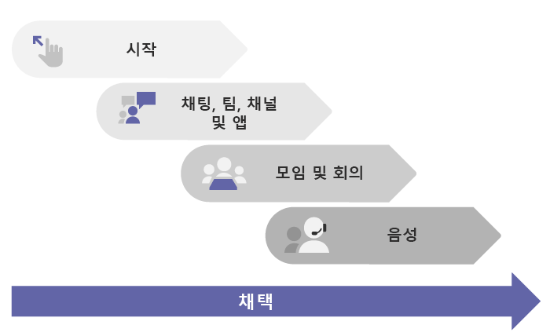

# Microsoft Teams를 배포하는 방법How to roll out Microsoft Teams

## 여기에서 시작Start here
중소기업이든 다국적 기업이든, [시작하기](get-started-with-teams-quick-start.md)에서 Teams 배포를 시작해 보세요.Whether you're a small business or a multi-national, the place to start for rolling out Teams is [Get started](get-started-with-teams-quick-start.md). 중소기업이거나, **원격 작업자**를 지원하기 위한 첫 번째 Office 365 워크로드로서 Teams를 빠르게 배포하는 경우 등 중소 규모 Teams 배포 과정에서 사용자에게 필요한 모든 내용을 안내해 줄 수 있습니다.It walks you through a small-scale Teams rollout, which may be all you need if you're a small business, or if you're rolling out Teams quickly as your first Office 365 workload to support **remote workers**. 대규모 조직인 경우 [시작하기](get-started-with-teams-quick-start.md)를 사용하여 초기 구성 그룹을 사용하여 Teams를 시범 운영하여 Teams에 대해 알아보고 조직 전체 배포 계획을 시작할 수 있습니다.If you're a larger organization, use [Get started](get-started-with-teams-quick-start.md) to pilot Teams with a small group of early adopters so you can learn about Teams and start planning your org-wide deployment. 

## Teams에 대한 권장 경로Recommended path to Teams

조직이 준비되면 Teams를 작업량별로 단계적으로 배포하는 것을 권장합니다.We recommend rolling out Teams in stages, workload by workload, as your organization is ready. **한 단계를 마치고 다음 단계로 넘어갈 때까지 기다릴 필요가 없습니다.****You don't have to wait until you've completed one step before you move to the next.** 어떤 조직은 모든 Teams 기능을 한 번에 배포하고, 또 어떤 조직은 단계적 배포 방식을 선호할 수 있습니다.Some orgs may want to roll out all Teams features at once, while others may prefer a phased approach. Teams 작업량은 다음 순서대로 배포하는 것을 권장합니다.Here are the Teams workloads, in the order we recommend rolling them out:

- [시작하기Get started](get-started-with-teams-quick-start.md)
- [채팅, 팀, 채널 및 앱Chat, teams, channels, & apps](deploy-chat-teams-channels-microsoft-teams-landing-page.md)
- [모임 및 회의Meetings & conferencing](deploy-meetings-microsoft-teams-landing-page.md)
- [클라우드 음성Cloud voice](cloud-voice-landing-page.md)

[채택 허브](adopt-microsoft-teams-landing-page.md): Teams 배포 전체에서 이러한 리소스를 활용하여 팀 채택을 촉진하세요.[Adoption hub](adopt-microsoft-teams-landing-page.md): Throughout your Teams rollout, be sure to take advantage of these resources to help drive Teams adoption.

## 비즈니스용 Skype, 온-프레미스 또는 하이브리드 배포에서 시작하는 경우If you're starting from Skype for Business, on-premises, or hybrid deployments

비즈니스용 Skype(온라인 또는 온-프레미스)에서 Teams를 배포하거나 하이브리드 구성이 필요한 경우 Teams를 배포하기 위해 위의 [권장 경로](#recommended-path-to-teams)를 따르기에 앞서 먼저 몇 가지 추가 계획을 수행해야 합니다.If you're coming to Teams from Skype for Business (online or on premises), or if you need a hybrid configuration, you still want to follow the [recommended path](#recommended-path-to-teams) above for rolling out Teams, but first you need to do some extra planning. 먼저 아래 표에서 조직의 프로필에 적용되는 지침을 검토합니다.Start by reviewing the guidance in the table below that applies to your organization's profile.

|  |조직의 프로필Your organization's profile|지침Guidance  |
|---------|---------|---------|
||현재 비즈니스용 Skype Online을 사용하고 있으며 Teams로 이동할 준비가 되었습니다.I'm currently using Skype for Business Online, and I'm ready to move to Teams. |[Teams로 업그레이드](upgrade-start-here.md)로 이동합니다.Go to [Upgrade to Teams](upgrade-start-here.md).        |
||조직에서 비즈니스용 Skype 서버를 실행하고 있으며 Teams를 배포하려고 합니다.My organization is running Skype for Business Server, and I want to roll out Teams. |대규모 Teams 배포의 경우 먼저 온-프레미스 환경과 Microsoft 365 사이에 하이브리드 연결을 구성해야 합니다.For a full-scale Teams rollout, first you need to configure hybrid connectivity between your on-premises environment and Microsoft 365. 먼저 [비즈니스용 Skype 서버 및 Office 365 간 하이브리드 연결 플랜](https://docs.microsoft.com/skypeforbusiness/hybrid/plan-hybrid-connectivity)을 읽어보세요.Start by reading [Plan hybrid connectivity between Skype for Business Server and Office 365](https://docs.microsoft.com/skypeforbusiness/hybrid/plan-hybrid-connectivity).   또한 [Teams로 업그레이드](upgrade-start-here.md)를 검토해야 합니다.You should also review [Upgrade to Teams](upgrade-start-here.md).   |
||비즈니스용 Skype 서버는 없지만 온-프레미스 PSTN 솔루션이 있습니다.I don't have Skype for Business Server, but I do have an on-premises PSTN solution. 팀을 배포하려고 하지만 온-프레미스 PSTN 솔루션을 유지하고 싶습니다.I want to roll out Teams, but I want to keep my on-premises PSTN solution. |위의 [권장 경로](#recommended-path-to-teams)에 따라 팀을 배포하세요.Roll out Teams following  the [recommended path](#recommended-path-to-teams) above.  그런 다음 [직접 라우팅 계획](direct-routing-plan.md)을 읽고 전화 시스템 직접 라우팅을 사용하여 온-프레미스 PSTN 솔루션을 Teams와 연결하는 방법에 대해 알아보세요.Then read [Plan Direct Routing](direct-routing-plan.md) to learn about using Phone System Direct Routing to hook up your on-premises PSTN solution with Teams.|
|

