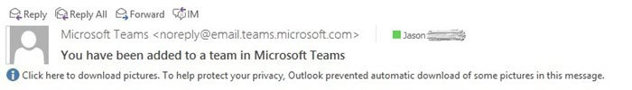
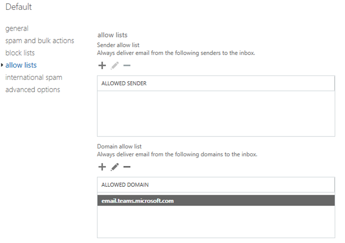

Exchange Online에서 Microsoft 팀 SMTP 도메인을 허용 된 보낸 사람 도메인으로 추가Add the Microsoft Teams SMTP domain as an allowed sender domain in Exchange Online 
=============================================================================

관리 콘솔에서 또는 Outlook을 사용 하 여 Office 365 그룹을 만들지 여부에 관계 없이 Exchange Online은 그룹에 추가 되는 팀 구성원의 알림을 보내는 데 사용 됩니다.Whether you create an Office 365 Group in the admin console or by using Outlook, Exchange Online is used to send notifications of a team member being added to a Group. 이러한 메시지는 사용자의 기본 도메인 SMTP FQDN을 나타내므로 테 넌 트에서 생성 됩니다.These messages are generated from your tenant as they represent your default domain SMTP FQDN.

팀에서 Microsoft Exchange Online을 사용 하는 것은 물론, 추가 된 구성원에 게 알림을 보내는 경우입니다.Teams uses Microsoft Exchange Online as well to send notifications to team members when they’ve been added. SMTP 메시지의 도메인 FQDN에 대 한 차이점은 상업용/비즈니스 테 넌 트에 대 한 @email "teams.microsoft.com"이 고, 정부 테 넌 트의 경우 "@GCC-email.teams.com"이 고 스팸 필터링을 통해이를 찾아낼 수 있습니다.The difference being the domain FQDN of the SMTP message is “@email.teams.microsoft.com” for Commercial/Business tenants and "@GCC-email.teams.com" for Government tenants and could be caught by spam filtering.

최상의 결과와 원활한 작업을 위해서는 Exchange Online 스팸 구성에서 Microsoft 팀 SMTP 도메인을 "허용 된 보낸 사람 도메인" 목록에 추가 하는 것이 좋습니다.For best result and seamless operation, consider adding the Microsoft Teams SMTP domain to your “allowed sender domains” list in your Exchange Online spam configuration:

