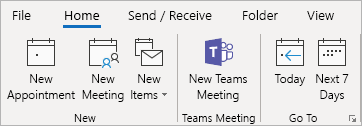
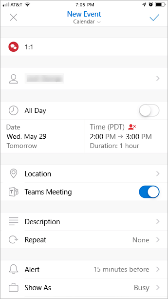

Outlook에서 Teams 모임 추가 기능 사용Use the Teams Meeting add-in in Outlook
=======================================

Teams 모임 추가 기능을 사용하면 사용자가 Outlook에서 Teams 모임을 예약할 수 있습니다.The Teams Meeting add-in lets users schedule a Teams meeting from Outlook. 추가 기능은 Windows, Mac, 웹 및 모바일의 Outlook에서 사용할 수 있습니다.The add-in is available for Outlook on Windows, Mac, web, and mobile.

## Windows용 Outlook의 Teams 모임 추가 기능Teams Meeting add-in in Outlook for Windows

팀 모임 추가 기능은 Windows PC에 Microsoft 팀과 Office 2013, Office 2016 또는 Office 2019이 설치 되어 있는 사용자를 위해 자동으로 설치 됩니다.The Teams Meeting add-in is automatically installed for users who have Microsoft Teams and either Office 2013, Office 2016, or Office 2019 installed on their Windows PC. 사용자는 Outlook 일정 리본에서 Teams 모임 추가 기능을 볼 수 있습니다.Users will see the Teams Meeting add-in on the Outlook Calendar ribbon.

> [!NOTE]
> - 팀 추가 기능에 연결 되는 **직접적인 URL이 없습니다** .There is **no direct URL** that links to the Teams add-in.
> - 조직에서 팀과 비즈니스용 Skype를 모두 실행 하는 경우에는 추가로 고려해 야 할 사항이 있습니다.There are additional considerations if your organization runs both Teams and Skype for Business. 일부 경우에는 Outlook에서 팀 추가 기능을 사용할 수 없습니다.Under some circumstances, the Teams add-in is not available in Outlook. 자세한 내용은 비즈니스용 [Skype에서 팀으로 업그레이드를](https://docs.microsoft.com/microsoftteams/upgrade-to-teams-on-prem-overview#meetings) 참조 하세요.See [Upgrade from Skype for Business to Teams](https://docs.microsoft.com/microsoftteams/upgrade-to-teams-on-prem-overview#meetings) for details.
> - 컴퓨터에 Teams 모임 추가 기능을 설치하려면 적어도 Regsvr32.exe 파일을 실행할 수 있는 사용자 권한이 필요합니다.User permissions to execute the Regsvr32.exe file is a minimum requirement for the Teams Meeting add-in to be installed on the computer.
> - 사용자가 Teams 모임 추가 기능을 볼 수 없는 경우 특정 순서에 따라 Outlook 및 Teams를 닫고 먼저 Teams 클라이언트를 다시 시작한 다음 Teams에 로그인하고 Outlook 클라이언트를 다시 시작하도록 안내를 받습니다.If users do not see the Teams Meeting add-in, instruct them to close Outlook and Teams, then restart the Teams client first, then sign in to Teams, and then restart the Outlook client, in that specific order.
> - Microsoft Store에서 Office Outlook 설치를 사용하는 경우 Teams 모임 추가 기능은 지원되지 않습니다.If you are using an Office Outlook installation from the Microsoft Store, the Teams Meeting add-in isn't supported. 이 추가 기능이 필요한 사용자는 [Windows 10 S 모드의 Office](https://support.office.com/article/faq-office-on-windows-10-in-s-mode-717193b5-ff9f-4388-84c0-277ddf07fe3f) 문서에 설명된 것처럼 Office의 간편 실행 버전을 설치하는 것이 좋습니다.Users who require this add-in are advised to install Click-to-Run version of Office, as outlined in [Office on Windows 10 in S mode](https://support.office.com/article/faq-office-on-windows-10-in-s-mode-717193b5-ff9f-4388-84c0-277ddf07fe3f) article.

## Mac용 Outlook의 Teams 모임 추가 기능Teams Meeting add-in in Outlook for Mac

Outlook for mac의 팀 모임 단추는 16.24.414.0에서 프로덕션 빌드를 실행 중이 고 Microsoft 365 또는 Office 365 클라이언트 구독으로 활성화 되어 있는 경우 Mac 용 Outlook 리본에 표시 됩니다.The Teams Meeting button in Outlook for Mac will appear in the Outlook for Mac ribbon if Outlook is running production build 16.24.414.0 and later and is activated with a Microsoft 365 or Office 365 client subscription.

사용자가 **보내기**를 클릭한 후 모임 좌표(Teams 참가 링크 및 전화 접속 번호)가 모임 초대에 추가됩니다.The meeting coordinates (the Teams join link and dial-in numbers) will be added to the meeting invite after the user clicks **Send**.  

## Outlook Web App의 Teams 모임 추가 기능Teams Meeting add-in in Outlook Web App

사용자가 웹용 새 Outlook의 초기 버전을 사용하는 경우 Outlook Web App의 Teams 모임 단추가 새 이벤트 만들기의 일부로 표시됩니다.The Teams Meetings button in Outlook Web App will appear as part of new event creation if the user is on an early version of the new Outlook on the web. 사용자가 웹용 새 Outlook의 초기 버전을 체험하는 방법은 [Outlook 블로그](https://techcommunity.microsoft.com/t5/Outlook-Blog/Designed-to-be-fast-The-Outlook-on-the-web-user-experience-gets/ba-p/234909?utm_source=t.co&utm_medium=referral)를 참조하세요.See the [Outlook Blog](https://techcommunity.microsoft.com/t5/Outlook-Blog/Designed-to-be-fast-The-Outlook-on-the-web-user-experience-gets/ba-p/234909?utm_source=t.co&utm_medium=referral) to learn about how users can try the early version of the new Outlook on the web.

사용자가 **보내기**를 클릭한 후 모임 좌표(Teams 참가 링크 및 전화 접속 번호)가 모임 초대에 추가됩니다.The meeting coordinates (the Teams join link and dial-in numbers) will be added to the meeting invite after the user clicks **Send**.  

## Outlook 모바일(iOS 및 Android)의 Teams 모임 추가 기능Teams Meeting add-in in Outlook mobile (iOS and Android)

Teams 모임 단추가 최신 Outlook iOS 및 Android 앱 빌드에 표시됩니다.The Teams Meeting button shows up in latest builds of the Outlook iOS and Android app.

사용자가 **보내기**를 클릭한 후 모임 좌표(Teams 참가 링크 및 전화 접속 번호)가 모임 초대에 추가됩니다.The meeting coordinates (the Teams join link and dial-in numbers) will be added to the meeting invite after the user clicks **Send**.  

## Outlook 용 팀 모임 추가 기능 및 찾기 시간Teams Meeting add-in and FindTime for Outlook

FindTime은 사용자가 회사 간의 모임 시간에 합의에 도달할 수 있도록 돕는 Outlook 용 추가 기능입니다.FindTime is an add-in for Outlook that helps users reach consensus on a meeting time across companies. 회의 초대 대상자가 선호하는 시간을 제공하면 시간 찾기가 사용자 대신 모임 초대장을 전송합니다.Once the meeting invitees have provided their preferred times, FindTime sends out the meeting invite on the user's behalf. 시간 찾기에서 **온라인 모임** 옵션을 선택한 경우 시간 찾기가 비즈니스용 Skype 또는 Microsoft Teams 모임을 예약합니다.If the **Online meeting** option is selected in FindTime, FindTime will schedule a Skype for Business or Microsoft Teams meeting. (시간 찾기는 조직에서 기본 온라인 모임 채널로 설정한 값을 사용합니다.)(FindTime will use whichever has been set by your organization as the default online meeting channel.)

> [!NOTE]  
> [시간 찾기 대시보드](https://findtime.microsoft.com/UserDashboard)에 비즈니스용 Skype 설정을 저장한 경우에는 시간 찾기에서 Microsoft Teams 대신 이 기능을 사용합니다.If you saved a Skype for Business setting in your [Findtime dashboard](https://findtime.microsoft.com/UserDashboard), FindTime will use that instead of Microsoft Teams. Microsoft Teams를 사용하려면 대시보드에서 비즈니스용 Skype 설정을 삭제합니다.If you want to use Microsoft Teams, delete the Skype for Business setting in your dashboard.

자세한 내용은 [FindTime을 사용 하 여 모임 예약](https://support.office.com/article/scheduling-meetings-with-findtime-4dc806ed-fde3-4ea7-8c5e-b5d1fddab4a6)을 참조 하세요.For more information, see [Schedule meetings with FindTime](https://support.office.com/article/scheduling-meetings-with-findtime-4dc806ed-fde3-4ea7-8c5e-b5d1fddab4a6).

## 인증 요구 사항Authentication requirements

Teams 모임 추가 기능을 사용하려면 사용자가 최신 인증을 통해 Teams에 로그인해야 합니다.The Teams Meeting add-in requires users to sign in to Teams using Modern Authentication. 사용자가이 메서드를 사용 하 여 로그인 하지 않는 경우에도 팀 클라이언트를 사용할 수는 있지만 Outlook 추가 기능을 사용 하 여 팀 온라인 모임을 예약할 수 없습니다.If users do not use this method to sign in, they'll still be able to use the Teams client, but will be unable to schedule Teams online meetings using the Outlook add-in. 다음 중 한 가지를 수행하여 이 문제를 해결할 수 있습니다.You can fix this by doing one of the following:

- 조직에 최신 인증이 구성되지 않은 경우 최신 인증을 구성해야 합니다.If Modern Authentication is not configured for your organization, you should configure Modern Authentication.
- 최신 인증이 구성되어 있지만 대화 상자에서 취소한 경우 사용자가 다단계 인증을 사용하여 다시 로그인하도록 지시해야 합니다.If Modern Authentication is configured, but they canceled out on the dialog box, you should instruct users to sign in again using multi-factor authentication.

인증을 구성하는 방법에 대한 자세한 내용은 [Microsoft Teams의 ID 모델 및 인증](identify-models-authentication.md)을 참조하세요.To learn more about how to configure authentication, see [Identity models and authentication in Microsoft Teams](identify-models-authentication.md).

## 비공개 모임 사용Enable private meetings

추가 기능을 배포하려면 Microsoft Teams 관리 센터에서 **비공개 모임 예약 허용**을 사용하도록 설정해야 합니다.**Allow scheduling for private meetings** must be enabled in the Microsoft Teams admin center for the add-in to get deployed. 관리 센터에서 **모임** > **모임 정책**으로 이동하여 **일반** 섹션에서 **비공개 모임 예약 허용**을 켜기로 전환합니다.)In the admin center, go to **Meetings** > **Meeting Policies**, and in the **General** section, toggle **Allow scheduling private meetings** to On.)

Teams 클라이언트는 사용자가 필요로 하는 버전이 32비트인지 64비트인지에 따라 올바른 추가 기능을 설치합니다.The Teams client installs the correct add-in by determining if users need the 32-bit or 64-bit version.

> [!NOTE]
> 사용자가 Teams를 설치하거나 업데이트한 후 최신 추가 기능을 다운로드하려면 Outlook을 재설정해야 할 수 있습니다.Users might need to restart Outlook after an installation or upgrade of Teams to get the latest add-in.

## Teams 업그레이드 정책 및 Outlook용 Teams 모임 추가 기능Teams upgrade policy and the Teams Meeting add-in for Outlook

고객은 [비즈니스용 Skype에서 Teams까지 업그레이드 여정을 선택](upgrade-and-coexistence-of-skypeforbusiness-and-teams.md)할 수 있습니다.Customers can [choose their upgrade journey from Skype for Business to Teams](upgrade-and-coexistence-of-skypeforbusiness-and-teams.md). 테넌트 관리자는 Teams 동시 모드를 사용하여 사용자에게 이 여정을 정의할 수 있습니다.Tenant admins can use the Teams co-existence mode to define this journey for their users. 테넌트 관리자에는 사용자가 비즈니스용 Skype와 함께 Teams를 사용하도록 허용하는 옵션이 있습니다(아일랜드 모드).Tenant admins have the option to enable users to use Teams alongside Skype for Business (Islands mode). 

아일랜드 모드인 사용자가 Outlook에서 모임을 예약하면 사용자는 일반적으로 비즈니스용 Skype를 예약할지 Teams 모임을 예약할지 선택할 수 있을 것으로 예상합니다.When users who are in Island mode schedule a meeting in Outlook, they typically expect to be able to choose whether to schedule a Skype for Business or a Teams meeting. 웹용 Outlook, Outlook Windows, Outlook Mac에서 사용자는 기본적으로 군도 모드에 있을 때 비즈니스용 Skype 및 팀 추가 기능을 모두 볼 수 있습니다.In Outlook on the web, Outlook Windows, and Outlook Mac, users see both Skype for Business and Teams add-ins when in Islands mode by default. 팀 모임 정책 설정을 구성 하 여 아일랜드 모드의 사용자가 팀 회의 추가 기능을 사용할 수 있는지, 팀 회의 및 비즈니스용 Skype 모임 추가 기능을 둘 다 사용할지를 제어할 수 있습니다.You can configure a Teams meeting policy setting to control whether users in Islands mode can only use the Teams Meeting add-in or both the Teams Meeting and Skype for Business Meeting add-ins.

최초 릴리스의 일부 제한 사항으로 인해 Outlook 모바일은 비즈니스용 Skype **또는** Teams 모임 만들기만 지원할 수 있습니다.Due to certain limitations in the initial release, Outlook mobile can only support creating Skype for Business **or** Teams meetings. 자세한 내용은 다음 표를 참조하십시오.See the following table for details.

| Teams 관리 센터의 동시 모드Coexistence mode in the Teams admin center | Outlook 모바일의 기본 모임 공급자Default meetings provider in Outlook mobile |
| --------------------------------------|---------------------------------------------|
| 아일랜드Islands | 비즈니스용 SkypeSkype for Business |
| 비즈니스용 Skype 전용Skype for Business only | 비즈니스용 SkypeSkype for Business |
| Teams 공동 작업이 포함된 비즈니스용 SkypeSkype for Business with Teams collaboration | 비즈니스용 SkypeSkype for Business |
| Teams 공동 작업 및 모임이 포함된 비즈니스용 SkypeSkype for Business with Teams collaboration and meetings | TeamsTeams |
| Teams 전용Teams only | TeamsTeams |

### 아일랜드 모드의 사용자가 팀 모임 추가 기능을 사용할 수 있는지 아니면 팀 모임 및 비즈니스용 Skype 모임 추가 기능을 둘 다 사용할지를 설정 합니다.Set whether users in Islands mode can only use the Teams Meeting add-in or both the Teams Meeting and Skype for Business Meeting add-ins

관리자는 팀 모임 정책 설정을 구성 하 여 사용자에 게 *아일랜드 모드의*Outlook 모임 추가 기능을 사용 하는 것을 제어할 수 있습니다.As an admin, you can configure a Teams meeting policy setting to control which Outlook meeting add-in is used for *users who are in Islands mode*. 사용자가 팀 모임 추가 기능을 사용할 수 있는지, 팀 모임이 나 비즈니스용 Skype 모임 추가 기능을 모두 사용 하 여 Outlook에서 모임을 예약할 수도 있습니다.You can specify whether users can only use the Teams Meeting add-in or both the Teams Meeting and Skype for Business Meeting add-ins to schedule meetings in Outlook.

이 정책은 아일랜드 모드에 있는 사용자 에게만 적용할 수 있으며 팀 모임 정책에서 **AllowOutlookAddIn** 매개 변수를 **True** 로 설정 합니다.You can only apply this policy to users who are in Islands mode and have the **AllowOutlookAddIn** parameter set to **True** in their Teams meeting policy. 이 정책을 설정 하는 방법에 대 한 단계는 [아일랜드 모드에서 사용자에 대 한 모임 제공자 설정을](meeting-policies-in-teams.md#meeting-policy-settings---meeting-provider-for-islands-mode)참조 하세요.For steps on how to set this policy, see [set the meeting provider for users in Islands mode](meeting-policies-in-teams.md#meeting-policy-settings---meeting-provider-for-islands-mode).

## 기타 고려 사항Other considerations

Teams 모임 추가 기능은 아직 기능적으로 빌드하는 중이므로 다음 사항을 고려해야 합니다.The Teams Meeting add-in is still building functionality, so be aware of the following:

- 추가 기능은 채널의 모임이 아니라 특정 참가자와 예약된 모임에 사용할 수 있습니다.The add-in is for scheduled meetings with specific participants, not for meetings in a channel. 채널 모임은 Teams 내에서 예약해야 합니다.Channel meetings must be scheduled from within Teams.
- 인증 프록시가 사용자 PC 및 팀 서비스의 네트워크 경로에 있는 경우 추가 기능이 작동 하지 않습니다.The add-in will not work if an Authentication Proxy is in the network path of the user's PC and Teams Services.
- 사용자가 Outlook 내에서 라이브 이벤트를 예약할 수 없습니다.Users can't schedule live events from within Outlook. Teams로 이동하여 라이브 이벤트를 예약합니다.Go to Teams to schedule live events. 자세한 내용은 [Microsoft Teams 라이브 이벤트란?](teams-live-events/what-are-teams-live-events.md)을 참조하세요.For more information, see [What are Microsoft Teams live events?](teams-live-events/what-are-teams-live-events.md).

[Microsoft Teams의 모임 및 통화](https://support.office.com/article/Meetings-and-calls-d92432d5-dd0f-4d17-8f69-06096b6b48a8)에 대해 자세히 알아보세요.Learn more about [meetings and calling in Microsoft Teams](https://support.office.com/article/Meetings-and-calls-d92432d5-dd0f-4d17-8f69-06096b6b48a8).

## 문제 해결Troubleshooting

팀 모임 추가 기능의 문제를 해결 하려면 다음 단계를 사용 합니다.Use the following steps to troubleshoot issues with the Teams Meeting add-in.

### Windows 용 Outlook의 팀 모임 추가 기능이 표시 되지 않음Teams Meeting add-in in Outlook for Windows does not show

Outlook용 Teams 모임 추가 기능을 설치할 수 없는 경우 다음 문제 해결 단계를 시도해보세요.If you cannot get the Teams Meeting add-in for Outlook to install, try these troubleshooting steps.

[Microsoft 지원 복구 도우미](https://aka.ms/SaRA_Home) 를 [다운로드](https://aka.ms/SaRA-TeamsAddInScenario) 하 여 실행 하 여 자동화 된 문제 해결 단계 및 수정을 수행 합니다.[Download](https://aka.ms/SaRA-TeamsAddInScenario) and run the [Microsoft Support Recovery Assistant](https://aka.ms/SaRA_Home) to perform automated troubleshooting steps and fixes.

또는 다음 단계를 수동으로 수행 합니다.Alternatively, perform the following steps manually:

- Windows 7 사용자는 팀 모임 추가 기능을 사용 하기 위해 [windows에서 유니버설 C 런타임에 대 한 업데이트](https://support.microsoft.com/help/2999226/update-for-universal-c-runtime-in-windows) 를 설치 해야 합니다.Windows 7 users must install the [Update for Universal C Runtime in Windows](https://support.microsoft.com/help/2999226/update-for-universal-c-runtime-in-windows) for the Teams Meeting add-in to work.
- 팀에서 모임을 예약할 수 있도록 사용자에 게 팀 업그레이드 정책이 있는지 확인 합니다.Check that the user has a Teams Upgrade policy which enables scheduling meetings in Teams. 자세한 내용은 비즈니스용 [Skype에서 팀으로 업그레이드를](https://docs.microsoft.com/microsoftteams/upgrade-to-teams-on-prem-overview#meetings) 참조 하세요.See [Upgrade from Skype for Business to Teams](https://docs.microsoft.com/microsoftteams/upgrade-to-teams-on-prem-overview#meetings) for more details.
- 사용자에 게 Outlook 추가 기능을 허용 하는 팀 모임 정책이 있는지 확인 합니다.Check that the user has a Teams Meeting policy that permits the Outlook Add-in. 자세한 내용은 [팀에서 모임 정책 관리](https://docs.microsoft.com/microsoftteams/meeting-policies-in-teams#allow-the-outlook-add-in) 를 참조 하세요.See [Manage meeting policies in Teams](https://docs.microsoft.com/microsoftteams/meeting-policies-in-teams#allow-the-outlook-add-in) for more details.
- 사용자에 게 팀 데스크톱 클라이언트가 설치 되어 있는지 확인 합니다.Ensure the user has the Teams desktop client installed. 모임 추가 기능은 팀 웹 클라이언트만을 사용 하는 경우에는 설치 되지 않습니다.The meeting add-in will not be installed when only using the Teams web client.
- 사용자에 게 Outlook 2013 이상이 설치 되어 있는지 확인 합니다.Ensure the user has Outlook 2013 or later installed.
- 사용자에 게 regsvr32.exe 실행할 수 있는 권한이 있는지 확인 합니다.Make sure the user has permission to execute regsvr32.exe.
- Outlook 데스크톱 클라이언트에 대해 사용 가능한 모든 업데이트가 적용 되었는지 확인 합니다.Ensure that all available updates for Outlook desktop client have been applied.
- 다음 단계를 따릅니다:Follow these steps:
  - Teams 데스크톱 클라이언트를 다시 시작합니다.Restart the Teams desktop client.
  - 로그아웃한 후 Teams 데스크톱 클라이언트에 다시 로그인합니다.Sign out and then sign back in to the Teams desktop client.
  - Outlook 데스크톱 클라이언트를 다시 시작합니다.Restart the Outlook desktop client. (Outlook이 관리자 모드에서 실행 되 고 있지 않은지 확인 합니다.)(Make sure Outlook isn't running in admin mode.)

여전히 추가 기능이 표시 되지 않는 경우 Outlook에서 사용 하지 않도록 설정 되어 있는지 확인 합니다.If you still don't see the add-in, make sure that it isn't disabled in Outlook.

- Outlook에서 **파일** 을 선택한 다음 **옵션**을 선택 합니다.In Outlook, choose **File** and then **Options**.
- **Outlook 옵션** 대화 상자의 **추가 기능** 탭을 선택 합니다.Select the **Add-ins** tab of **Outlook Options** dialog box.
- **Microsoft Office 용 Microsoft 팀 모임 추가 기능이** **활성 응용 프로그램 추가 기능** 목록에 나열 되는지 확인Confirm that **Microsoft Teams Meeting Add-in for Microsoft Office** is listed in the **Active Application Add-ins** list
- 팀 모임 추가 기능이 **비활성 응용 프로그램 추가 기능** 목록에 나열 된 경우 **관리** 에서 **COM 추가 기능** 을 선택 하 고 **이동을 선택 합니다** .If the Teams Meeting Add-in is listed in the **Disabled Application Add-ins** list, select **COM Add-ins** in **Manage** and then select **Go…**
- Microsoft **Office 용 Microsoft 팀 모임 추가 기능**옆에 있는 확인란을 설정 합니다.Set the checkbox next to **Microsoft Teams Meeting Add-in for Microsoft Office**.
- 모든 대화 상자에서 **확인을** 선택 하 고 Outlook을 다시 시작 합니다.Choose **OK** on all dialog boxes and restart Outlook.

추가 기능을 관리 하는 방법에 대 한 일반적인 지침은 [Office 프로그램의 추가 기능 보기, 관리 및 설치](https://support.office.com/article/View-manage-and-install-add-ins-in-Office-programs-16278816-1948-4028-91E5-76DCA5380F8D)를 참조 하세요.For general guidance about how to manage add-ins, see [View, manage, and install add-ins in Office programs](https://support.office.com/article/View-manage-and-install-add-ins-in-Office-programs-16278816-1948-4028-91E5-76DCA5380F8D).

추가 기능이 여전히 표시 되지 않는 경우 다음 단계를 사용 하 여 레지스트리 설정을 확인 합니다.If the add-in still does not show, use the following steps to verify the registry settings.

> [!NOTE]
> 레지스트리를 잘못 편집 하면 시스템에 심각한 손상을 줄 수 있습니다.Incorrectly editing the registry may severely damage your system. 레지스트리를 변경 하기 전에 컴퓨터에 있는 중요 한 데이터를 백업 해야 합니다.Before making changes to the registry, you should back up any valued data on the computer.
- 시작 RegEdit.exeLaunch RegEdit.exe
- HKEY_CURRENT_USER \Software\Microsoft\Office\Outlook\Addins 이동Navigate to HKEY_CURRENT_USER\Software\Microsoft\Office\Outlook\Addins
- TeamsAddin을 확인 합니다. FastConnect가 있습니다.Verify TeamsAddin.FastConnect exists.
- TeamsAddin 내에서 FastConnect, LoadBehavior이 있는지 확인 하 고 3으로 설정 합니다.Within TeamsAddin.FastConnect, verify LoadBehavior exists and is set to 3.
  - LoadBehavior에 3 이외의 값이 있으면 3으로 변경 하 고 Outlook을 다시 시작 합니다.If LoadBehavior has a value other than 3, change it to 3 and restart Outlook.

### 대리인 일정이 작동 하지 않음Delegate scheduling does not work

관리자가 [EWS(Exchange 웹 서버)에 대한 액세스 권한을 제어](https://docs.microsoft.com/exchange/client-developer/exchange-web-services/how-to-control-access-to-ews-in-exchange)하기 위해 Microsoft Exchange를 구성한 경우에는 대리인이 상사를 대신하여 Teams 모임을 예약할 수 없습니다.If your administrator has configured Microsoft Exchange to [control access to Exchange Web Server (EWS)](https://docs.microsoft.com/exchange/client-developer/exchange-web-services/how-to-control-access-to-ews-in-exchange), a delegate won't be able to schedule a Teams meeting on behalf of the boss. 이 구성에 대한 해결 방법은 개발 중이며 향후에 출시될 예정입니다.The solution for this configuration is under development and will be released in the future. 이 문제를 해결 하기 위해 관리자는 EWS 허용 목록에 "*SchedulingService*" 문자열을 추가할 수 있습니다.As a workaround, your administrator can add the following string to the EWS Allow List: "*SchedulingService*". 

## 관련 항목Related topics

[Teams 문제 해결Teams Troubleshooting](https://docs.microsoft.com/MicrosoftTeams/troubleshoot/teams)