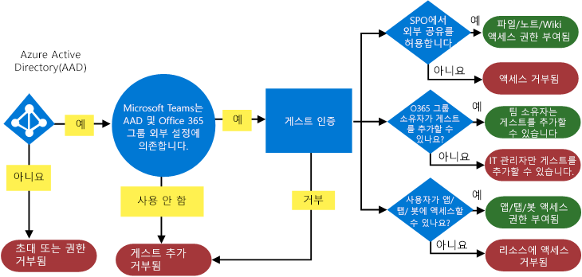
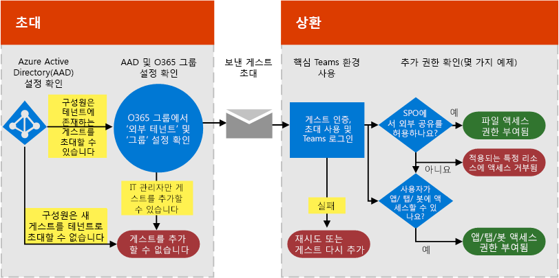
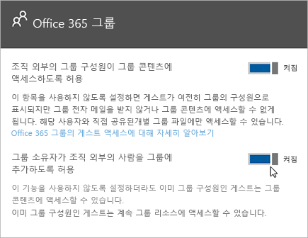

Microsoft Teams에서 게스트 액세스 권한 부여Authorize guest access in Microsoft Teams
===========================================

조직의 요구 사항을 충족시키기 위해, 네 가지 수준의 권한 부여를 통해 Microsoft Teams 게스트 액세스 기능을 관리할 수 있습니다.To satisfy your organization’s requirements, you can manage Microsoft Teams guest access features and capabilities through four different levels of authorization. 모든 인증 수준은 Microsoft 365 혹은 Office 365 조직에 적용됩니다.All the authorization levels apply to your Microsoft 365 or Office 365 organization. 각 권한 수준은 아래와 같이 게스트 경험을 제어합니다.Each authorization level controls the guest experience as shown below:

- **Azure Active Directory**: Microsoft Teams의 게스트 액세스는 Azure AD B2B (Business-to-Business) 플랫폼에 의존합니다.**Azure Active Directory**: Guest access in Microsoft Teams relies on the Azure AD business-to-business (B2B) platform. 이 권한 수준은 디렉터리, 테넌트 및 응용 프로그램 수준에서의 게스트 경험을 제어합니다.This authorization level controls the guest experience at the directory, tenant, and application level.
- **Microsoft Teams**: Microsoft Teams의 게스트 경험만 제어합니다.**Microsoft Teams**: Controls the guest experience in Microsoft Teams only.
- **Microsoft 365 그룹**: Microsoft 365 그룹 및 Microsoft Teams에서 게스트 환경을 제어합니다.**Microsoft 365 Groups**: Controls the guest experience in Microsoft 365 Groups and Microsoft Teams.
- **SharePoint Online 및 비즈니스용 OneDrive**: SharePoint Online, 비즈니스용 OneDrive, Microsoft 365 그룹 및 Microsoft Teams에서 게스트 환경을 제어 합니다.**SharePoint Online and OneDrive for Business**: Controls the guest experience in SharePoint Online, OneDrive for Business, Microsoft 365 Groups, and Microsoft Teams.

이러한 서로 다른 권한 수준은 조직에 게스트 액세스를 설정하는 방법에 유연성을 제공합니다.These different authorization levels provide you with flexibility in how you set up guest access for your organization. 예를 들어 Microsoft Teams에서 게스트 사용자를 허용하지 않고 조직 전체에서 게스트 사용자를 허용하려면 Microsoft Teams에서 게스트 액세스를 해제하기만 하면 됩니다.For example, if you don’t want to allow guest users in your Microsoft Teams but want to allow it overall in your organization, just turn off guest access in Microsoft Teams. 또 다른 예: Azure AD, Teams, 그룹 수준에서 게스트 액세스를 사용하도록 설정할 수 있지만, 선택한 팀에서 데이터 분류와 같은 하나 이상의 조건과 일치하는 게스트 사용자를 추가하는 기능을 사용하지 않도록 설정합니다.Another example: You could enable guest access at the Azure AD, Teams, and Groups levels, but then disable the addition of guest users on selected teams that match one or more criteria such as data classification equals confidential. SharePoint Online 및 비즈니스용 OneDrive에는 Microsoft 365 그룹에 의존하지 않는 자체 게스트 액세스 설정이 있습니다.SharePoint Online and OneDrive for Business have their own guest access settings that don't rely on Microsoft 365 Groups.

> [!NOTE]
> 게스트는 [Microsoft 365 및 Office 365 서비스 설명](https://go.microsoft.com/fwlink/p/?linkid=282347) 및 [Azure AD B2B 공동 작업의 제한 사항](https://go.microsoft.com/fwlink/p/?linkid=853019)에서 설명하는 서비스 제한의 적용을 받습니다.Guests are subject to the service limits described in [Microsoft 365 and Office 365 service descriptions](https://go.microsoft.com/fwlink/p/?linkid=282347) and [Limitations of Azure AD B2B collaboration](https://go.microsoft.com/fwlink/p/?linkid=853019). 

다음 다이어그램은 게스트 액세스 권한종속성이 Azure Active Directory, Microsoft Teams 및 Microsoft 365 혹은 Office 365 사이에 부여되고 통합되는 방법을 보여줍니다.The following diagram shows how guest access authorization dependency is granted and integrated between Azure Active Directory, Microsoft Teams, and Microsoft 365 or Office 365.

다음 다이어그램은 일반적인 게스트 액세스 초대 및 상환 흐름을 통해 사용자 경험이 권한 모델을 사용하는 방법을 개략적으로 보여줍니다.The next diagram shows, at a high level, how the user experience works with the permission model through a typical guest access invitation and redemption flow.

여기에서 앱, 봇 및 커넥터는 사용자 계정에 고유한 권한 및 / 또는 동의가 필요할 수 있습니다.It’s important to note here that apps, bots, and connectors might require their own set of permissions and/or consent specific to the user account. 이들은 별도로 부여해야 할 수도 있습니다.These might need to be granted separately. 마찬가지로 SharePoint는 특정 사용자, 사용자 그룹 또는 사이트 수준에 대해 추가 외부 공유 경계를 부과할 수 있습니다.Similarly, SharePoint might impose extra external sharing boundaries for a specific user, groups of users, or even at the site level.

앞의 두 다이어그램은 [Visio](https://github.com/MicrosoftDocs/OfficeDocs-SkypeForBusiness/blob/live/Teams/media/teams_dependencies.vsdx?raw=true)에서도 사용할 수 있습니다.The previous two diagrams are also available in [Visio](https://github.com/MicrosoftDocs/OfficeDocs-SkypeForBusiness/blob/live/Teams/media/teams_dependencies.vsdx?raw=true).

## Azure Active Directory에서 게스트 액세스 제어Control guest access in Azure Active Directory

Azure AD를 사용하여 외부 협력자를 게스트로 초대할지와 초대 방식을 결정할 수 있습니다.Use Azure AD to determine whether external collaborators can be invited into your tenant as guests, and in what ways. Azure B2B 게스트 액세스에 대한 자세한 내용은 [Azure Active Directory B2B의 게스트 사용자 액세스란](https://docs.microsoft.com/azure/active-directory/b2b/what-is-b2b)을 참조하세요.For more information about Azure B2B guest access, see [What is guest user access in Azure Active Directory B2B](https://docs.microsoft.com/azure/active-directory/b2b/what-is-b2b). Azure AD 역할에 대한 자세한 내용은 [Azure Active Directory 테넌트에서 파트너 조직의 사용자에게 권한 부여](https://docs.microsoft.com/azure/active-directory/b2b/add-guest-to-role)를 참조하세요.For information about Azure AD roles, see [Grant permissions to users from partner organizations in your Azure Active Directory tenant](https://docs.microsoft.com/azure/active-directory/b2b/add-guest-to-role).

초대 설정은 테넌트 수준에서 적용되고 디렉터리, 테넌트 및 응용 프로그램 수준에서 게스트 환경을 제어합니다.The settings for invitations apply at the tenant level and control the guest experience at the directory, tenant, and application level. Azure Portal에서 이러한 설정을 구성하려면 **Azure Active Directory** > **사용자** > **사용자 설정**으로 이동하고, **외부 사용자**에서 **외부 공동 작업 설정 관리**를 선택합니다.To configure these settings in the Azure portal, go to **Azure Active Directory** > **Users** > **User settings**, and under **External users**, select **Manage external collaboration settings**.

Azure AD에는 외부 사용자를 구성하기위한 다음 설정이 포함되어 있습니다.Azure AD includes the following settings to configure external users:

- **게스트 사용자 액세스 제한**: 이 정책은 디렉터리에서 게스트의 사용 권한을 결정합니다.**Guest user access restrictions**: This policy determines permissions for guests in your directory. 세 개의 정책 옵션이 제공됩니다.There are three policy options.

    - **게스트 사용자는 구성원과 동일한 액세스 권한을 가짐(가장 포괄적)** 설정은 게스트가 디렉토리의 일반 사용자와 동일한 디렉토리 데이터 액세스 권한을 가짐을 의미합니다.The **Guest users have the same access as members (most inclusive)** setting means guests have the same access to directory data as regular users in your directory.
    - **게스트 사용자는 디렉터리 개체 설정의 속성 및 구성원에 대한 액세스 권한이 제한되어 있음** 설정은 게스트가 Microsoft Graph를 사용하여 사용자, 그룹 또는 기타 디렉터리 리소스를 열거하는 것과 같은 특정 디렉터리 작업에 대한 권한이 없음을 의미합니다.The **Guest users have limited access to properties and membership of directory objects** settings means that guests don't have permissions for certain directory tasks, such as enumerating users, groups, or other directory resources using Microsoft Graph.
    - **게스트 사용자 액세스는 자신의 디렉터리 개체의 속성 및 구성원으로 제한됨(가장 제한적)** 설정은 게스트가 자신의 디렉터리 개체에만 액세스 할 수 있음을 의미합니다.The **Guest user access is restricted to properties and memberships of their own directory objects (most restrictive)** setting means guests can only access their own directory objects.
    
  자세한 내용은 [Azure Active Directory의 기본 사용자 권한](https://go.microsoft.com/fwlink/?linkid=2135493)을 참조하세요.To learn more, see [What are the default user permissions in Azure Active Directory?](https://go.microsoft.com/fwlink/?linkid=2135493)
- **게스트 초대자 역할의 관리자 및 사용자 초대 가능**: **예**는 게스트 초대자 역할의 관리자 및 사용자가 게스트를 테넌트로 초대할 수 있음을 의미합니다.**Admins and users in the guest inviter role can invite**: **Yes** means that admins and users in the guest inviter role will be able to invite guests to the tenant. **아니요**는 관리자와 사용자가 테넌트에 게스트를 초대할 수 없음을 의미합니다.**No** means admins and users can't invite guests to the tenant.
- **회원 초대 가능**: 디렉토리의 관리자가 아닌 회원이 손님을 초대할 수 있게 하려면 이 정책을 **예**(권장)로 설정하십시오.**Members can invite**: To allow non-admin members of your directory to invite guests, set this policy to **Yes** (recommended). 관리자만 게스트를 추가할 수 있게 하려는 경우 이 정책을 **아니오**로 설정할 수 있습니다.If you prefer that only admins be able to add guests, you can set this policy to **No**. **아니오**로 설정할 경우 관리자가 아닌 Teams 소유자의 게스트 환경이 제한됨에 유의하십시오. 이 소유자들은 AAD에 이미 추가된 Teams에만 게스트를 추가할 수 있습니다.Keep in mind that setting **No** will limit the guest experience for non-admin teams owners; they'll only be able to add guests in Teams that have already been added in AAD by the admin.
- **게스트 초대 가능**: **예**는 디렉터리의 게스트를 초대하여 SharePoint 사이트 또는 Azure 리소스와 같은 Azure AD로 보안된 리소스에 대해 공동 작업을 수행할 수 있음을 의미합니다.**Guests can invite**: **Yes** means that guests in your directory can invite other guests to collaborate on resources secured by your Azure AD, such as SharePoint sites or Azure resources. **아니요**는 게스트가 다른 게스트를 초대하여 조직과 공동 작업을 할 수는 없습니다.**No** means that guests can't invite other guests to collaborate with your organization.
    > [!IMPORTANT]
    > 현재 Teams는 게스트 초대자 역할을 지원하지 않으므로 **참석자를 초대 할 수 있음**으로 **설정**하더라도 손님은 Teams에서 다른 참석자를 초대할 수 없습니다.Currently, Teams doesn't support the guest inviter role, so even if you set **Guests can invite** to **Yes**, guests can't invite other guests in Teams.
 
게스트를 초대할 수 있는 사용자를 제어하는 방법에 대한 자세한 내용은 [Azure Active Directory B2B 공동 작업에 대한 초대 위임](https://docs.microsoft.com/azure/active-directory/b2b/delegate-invitations)을 참조합니다.For more information about controlling who can invite guests, see [Delegate invitations for Azure Active Directory B2B collaboration](https://docs.microsoft.com/azure/active-directory/b2b/delegate-invitations).

> [!NOTE]
> 또한 테넌트에 게스트로 초대되는 도메인을 관리할 수 있습니다.You can also manage which domains can be invited into your tenant as guests. [Microsoft 365 그룹에 대한 게스트 액세스 허용/차단](https://docs.microsoft.com/exchange/recipients-in-exchange-online/manage-group-access-to-office-365-groups)을 참조하세요.See [Allow/Block guest access to Microsoft 365 Groups](https://docs.microsoft.com/exchange/recipients-in-exchange-online/manage-group-access-to-office-365-groups).

Teams에 게스트를 추가할 때 계정이 디렉터리에 자동으로 추가되므로 사용자 게스트 계정을 Azure AD B2B에 수동으로 추가할 필요가 없습니다.Adding the user guest account manually to Azure AD B2B is not required, as the account will be added to the directory automatically when you add the guest to Teams.

### 게스트 액세스에 대한 라이선스Licensing for guest access
게스트 액세스 라이선스는 Azure AD 라이선스의 일부입니다.Guest access licensing is part of Azure AD licensing. 게스트 액세스는 모든 Microsoft 365 Business Standard, Office 365 Enterprise 구독에 포함되어 있습니다.Guest access is included with all Microsoft 365 Business Standard and Office 365 Enterprise subscriptions. 라이선스에 대한 자세한 내용은 [Azure Active Directory B2B 공동 작업 라이선스 지침](https://docs.microsoft.com/azure/active-directory/b2b/licensing-guidance)을 참조하세요.For more information about licensing, see [Azure Active Directory B2B collaboration licensing guidance](https://docs.microsoft.com/azure/active-directory/b2b/licensing-guidance).

> [!NOTE]
> Exchange Online Plan 2와 같이 독립실행형 Office 365 구독 계획만 가진 조직의 사용자는 Teams에서 동일한 조직에 속한 것으로 간주하기 때문에 조직에 게스트로 초대될 수 없습니다.Users in your organization who have standalone Office 365 subscription plans only, such as Exchange Online Plan 2, cannot be invited as guests to your organization because Teams considers these users to belong to the same organization. 사용자가 Teams를 사용하려면 Microsoft 365 Business Standard, Office 365 Enterprise 또는 Office 365 Education 구독에 할당되어야 합니다.For these users to use Teams, they must be assigned an Microsoft 365 Business Standard, Office 365 Enterprise, or Office 365 Education subscription. 

## Teams에서 게스트 액세스 제어Control guest access in Teams

Teams에서 게스트 액세스 기능은 기본적으로 꺼져있습니다.Guest access is turned off by default in Teams. 게스트 액세스를 켜려면 [Microsoft Teams에서 게스트 액세스 설정 또는 해제](set-up-guests.md)를 참조하세요.To turn on guest access, see [Turn on or off guest access to Microsoft Teams](set-up-guests.md). 

## Microsoft 365 그룹에서 게스트 관리Control guest access in Microsoft 365 Groups

Microsoft 365 그룹에서 조직의 모든 Microsoft 365 그룹 및 Microsoft Teams 팀에 대한 게스트 사용자 및 게스트 액세스 추가를 제어할 수 있습니다.From Microsoft 365 Groups, you can control adding guest users and guest access to all Microsoft 365 Groups and Microsoft Teams teams in your organization.

1. [https://portal.office.com/adminportal/home](https://portal.office.com/adminportal/home)에서 전역 관리자 계정으로 로그인 합니다.Sign in with your global admin account at [https://portal.office.com/adminportal/home](https://portal.office.com/adminportal/home).

2. 왼쪽에서**설정**을 선택한 다음 **서비스 &amp; 추가 기능**을 선택합니다.On the left, choose **Settings** and then select **Services &amp; add-ins**.

3. **Microsoft 365 그룹** 선택Select **Microsoft 365 Groups**.

     
  
4. Microsoft 365 그룹 페이지에서 조직 외부의 팀 및 그룹 소유자가 Microsoft 365 그룹에 액세스 할 수 있도록 허용할지에 따라 전환을 **설정** 또는 **해제**로 설정합니다.On the Microsoft 365 Groups page, set the toggle to **On** or **Off**, depending on whether you want to let team and group owners outside your organization access Microsoft 365 Groups. **그룹 소유자가 조직 외부의 사람들을 그룹에 추가하도록 허용** 옆의 토글을 **켬**으로 설정하거나 탭합니다.Click or tap the toggle to **On** next to **Let group owners add people outside the organization to groups**. 이 토글을 **켬**으로 설정하면 그룹 및 팀 소유자가 조직 외부의 사용자를 Microsoft 365 그룹 및 Microsoft Teams에 추가할 수 있도록 할지 여부를 제어하는 다른 옵션이 표시됩니다.If you turn this toggle to **On**, you'll see another option to control whether you want to let group and team owners add people outside your organization to Microsoft 365 Groups and Microsoft Teams. 그룹 및 팀 소유자에게 게스트 사용자를 추가할 수 있도록 허용하려면 이 토글을 **켬**으로 설정합니다.Set this toggle to **On** if you want to let group and team owners add guest users. 
 
   

이러한 설정은 테넌트 수준에서 적용되며 Microsoft 365 그룹 및 Teams에서 게스트 환경을 제어합니다.These settings apply at the tenant level and control the guest experience in Microsoft 365 Groups and Teams.

게스트 액세스 작동 방식, 게스트 액세스 관리 방법, 자주 묻는 질문에 대한 답변 등 그룹의 게스트 액세스에 대한 자세한 내용은 [Microsoft 365 그룹의 게스트 액세스 관리](https://docs.microsoft.com/microsoft-365/admin/create-groups/manage-guest-access-in-groups?view=o365-worldwide#manage-groups-guest-access) 및 [Microsoft 365 그룹의 게스트 액세스](https://support.office.com/article/Guest-access-in-Office-365-Groups-bfc7a840-868f-4fd6-a390-f347bf51aff6)를 참조합니다.See [Manage guest access in Microsoft 365 groups](https://docs.microsoft.com/microsoft-365/admin/create-groups/manage-guest-access-in-groups?view=o365-worldwide#manage-groups-guest-access) and [Guest access in Microsoft 365 Groups](https://support.office.com/article/Guest-access-in-Office-365-Groups-bfc7a840-868f-4fd6-a390-f347bf51aff6) for more information about guest access in groups, including how guest access works, how to manage guest access, and answers to frequently asked questions.

## SharePoint Online 및 비즈니스용 OneDrive에 대한 게스트 액세스 제어Control guest access to SharePoint Online and OneDrive for Business

Teams는 SharePoint Online 및 비즈니스용 OneDrive를 사용하여 채널 및 채팅 대화를 위한 파일과 문서를 저장합니다.Teams relies on SharePoint Online and OneDrive for Business to store files and documents for channels and chat conversations.  

완전한 Teams 게스트 액세스 환경을 위해서는 Microsoft 365 및 Office 365 관리자가 다음 설정을 구성해야 합니다.For the full Teams guest access experience, Microsoft 365 and Office 365 admins need to configure the following settings:

- SharePoint Online에서 **기존 게스트**, **신규 및 기존 게스트** 또는 모두를 선택합니다.In SharePoint Online: Select **Existing guests**, **New and existing guests**, or **Anyone**.

    자세한 내용은 [외부 공유 설정 또는 해제](https://docs.microsoft.com/sharepoint/turn-external-sharing-on-or-off)를 참조하세요.For more information, see [Turn external sharing on or off](https://docs.microsoft.com/sharepoint/turn-external-sharing-on-or-off).

- Microsoft 365 그룹에서 **그룹 소유자가 조직 외부의 사람을 그룹에 추가하도록 허용** 설정In Microsoft 365 Groups: Turn on **Let group owners add people outside the organization to groups**

    자세한 내용은 위의 [Microsoft 365 그룹에서 게스트 액세스 제어](#control-guest-access-in-microsoft-365-groups)를 참조하세요.For more information, see [Control guest access in Microsoft 365 Groups](#control-guest-access-in-microsoft-365-groups), above.
  
이러한 설정은 테넌트 수준에서 적용되며 SharePoint Online, 비즈니스용 OneDrive, Microsoft 365 그룹 및 Teams에서 게스트 환경을 제어합니다.These settings apply at the tenant level and control the guest experience in SharePoint Online, OneDrive for Business, Microsoft 365 Groups, and Teams.

Teams에 연결된 팀 사이트의 SharePoint Online 외부 사용자 설정을 관리할 수 있습니다.You can manage SharePoint Online external user settings for the team sites connected to Teams. 자세한 내용은 [SharePoint 팀 사이트 설정 관리](https://support.office.com/article/Manage-your-SharePoint-team-site-settings-8376034d-d0c7-446e-9178-6ab51c58df42)를 참조하세요.To learn more, see  [Manage your SharePoint team site settings](https://support.office.com/article/Manage-your-SharePoint-team-site-settings-8376034d-d0c7-446e-9178-6ab51c58df42).

## 외부 액세스 (페더레이션) 및 게스트 액세스External access (federation) vs. guest access

[!INCLUDE [guest-vs-external-access](includes/guest-vs-external-access.md)]

## 관련 항목Related topics

- [Microsoft 365 게스트 공유 설정 참조Microsoft 365 guest sharing settings reference](https://docs.microsoft.com/Office365/Enterprise/microsoft-365-guest-settings)
