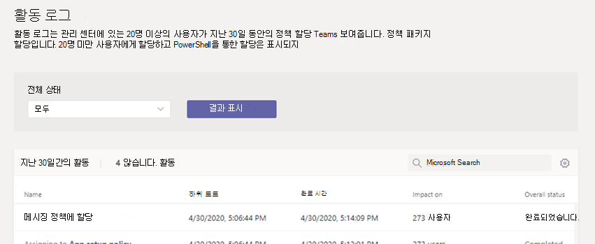

# 활동 로그에서 정책 할당 보기

Microsoft Teams 관리 센터의 사용자에게 정책을 할당할 때 활동 로그에서 해당 정책 할당의 상태를 볼 수 있습니다. 활동 로그는 지난 30일 동안 Microsoft Teams 관리 센터를 통해 20명 이상의 사용자를 일괄 처리하도록 정책 할당을 표시합니다. 활동 로그에는 정책 패키지 할당, Microsoft Teams 관리 센터를 통해 20명 미만의 사용자 일괄 처리에 대한 정책 할당 또는 PowerShell을 통한 정책 할당이 표시되지 않습니다.

## 활동 로그에서 정책 할당 활동 보기

활동 로그에서 정책 할당을 보려면 다음을 수행합니다.

1. Microsoft Teams 관리 센터의 왼쪽 탐색 영역에서 **홈** 으로 이동한 다음 **활동 로그** 아래에서 **세부 정보 보기를** 선택합니다.
2. 모든 정책 할당을 보거나 상태별로 목록을 필터링하여 **시작되지 않음**, **진행 중** 또는 **완료된** 할당만 표시할 수 있습니다. 각 할당에 대한 다음 정보가 표시됩니다.
    - **이름**: 정책 할당의 이름입니다. 링크를 클릭하여 자세한 내용을 봅니다. 여기에는 정책이 할당된 사용자 수와 완료된 할당 수, 진행 중 및 시작되지 않은 할당 수가 포함됩니다. 일괄 처리의 사용자 목록과 각 사용자의 상태 및 결과도 표시됩니다. 예제는 다음과 같습니다.

        

    - **제출됨**: 정책 할당이 제출된 날짜 및 시간입니다.
    - **완료 시간**: 정책 할당이 완료된 날짜 및 시간입니다.
    - **영향**: 일괄 처리의 사용자 수입니다.
    - **전체 상태**: 정책 할당의 상태입니다.

> [!NOTE]
> **사용자** 페이지에서 활동 로그로 가져올 수도 있습니다. **적용** 을 클릭하여 대량 정책 할당을 제출하면 페이지 맨 위에 배너가 표시됩니다. 배너에서 **활동 로그** 링크를 클릭합니다.

## 관련 항목

- [사용자에게 정책 할당](policy-assignment-overview.md)
