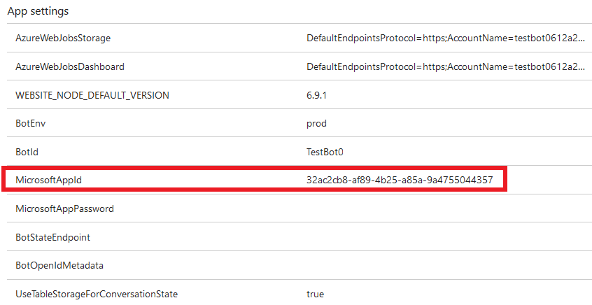
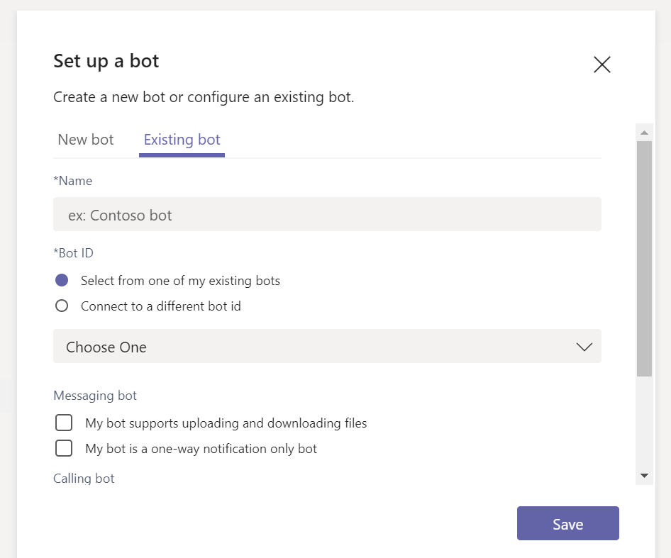

Microsoft 팀의 개인 채팅, 그룹 채팅 및 채널을 위한 인공 지능 추가Add bots for personal chats, group chats, and channels in Microsoft Teams
==========================================================
> [!IMPORTANT]
> [!INCLUDE [new-teams-sfb-admin-center-notice](includes/new-teams-sfb-admin-center-notice.md)]

Bot 쿼리에 응답 하거나 세부 정보에 대 한 업데이트 및 알림을 제공 하는 자동화 된 프로그램으로, 사용자가 흥미를 알고 있거나 확인을 받을 수 있습니다.Bots are automated programs that respond to queries or give updates and notifications about details users find interesting or want to stay informed about. 인공 지능을 사용 하면 사용자가 Microsoft 팀의 채팅 대화를 통해 작업 관리, 일정 수립, 폴링 등의 클라우드 서비스와 상호 작용할 수 있습니다.Bots allow users to interact with cloud services like task management, scheduling, and polling, through chat conversations in Microsoft Teams. 팀에 대 한 인공 지능이 [Microsoft Bot 프레임 워크](https://go.microsoft.com/fwlink/?linkid=854370)에 빌드됩니다.Bots for Teams are built on the [Microsoft Bot Framework](https://go.microsoft.com/fwlink/?linkid=854370). 이 프레임 워크를 사용 하 여 개발 되는 인공 지능을 팀에 맞게 쉽게 설정할 수 있습니다.The bots that are developed using this framework can be enabled easily for Teams. 자세한 내용은 [조직의 Microsoft 팀 설정 관리](enable-features-office-365.md)를 참조 하세요.For more information, see [Manage Microsoft Teams settings for your organization](enable-features-office-365.md).

현재 팀은 개인 채팅, 그룹 채팅 및 팀원의 채널에서 인공 지능을 지원 합니다.Currently, Teams supports bots in personal chats, group chats, and channels within a team. 관리자는 Office 365 테 넌 트 내에서 인공 지능 사용을 허용 하거나 금지할 것인지 여부를 제어할 수 있습니다.Administrators can control whether the use of bots is allowed or prohibited within the Office 365 tenant.

커뮤니티에서 개발한 인공 지능을 팀 내에서 활용할 수 있습니다.Bots developed by the community can be leveraged within Teams. 봇의 기능과 사용자 지정 앱 (테스트용 로드 라고도 함)을 업로드 하는 기능은 사용자 지정 인공 지능 기능을 사용할 테 넌 트 수준에서 사용 하도록 설정 되어 있어야 합니다.The bot's functionality and the ability to upload custom apps (also known as sideloading) must be enabled on the tenant level for custom bots to be functional. 봇은 개인 채팅, 그룹 채팅 및 채널에 사용할 수 있습니다.Bots can be used in personal chats, group chats, and channels. 채널의 경우 팀 소유자나 회원이 인공 지능을 추가할 수 있습니다.For channels, team owners or members can add bots.

자세한 내용은 [앱 및 서비스](https://support.office.com/article/Apps-and-services-cc1fba57-9900-4634-8306-2360a40c665b)를 참조 하세요.For more information, see [Apps and services](https://support.office.com/article/Apps-and-services-cc1fba57-9900-4634-8306-2360a40c665b).

> [!IMPORTANT]
> 테스트 목적 외에는 GUID를 사용 하 여 bot을 추가 하는 것이 좋습니다.Adding a bot by GUID, for anything other than testing purposes, is not recommended. 이렇게 하면 봇의 기능이 크게 제한 됩니다.Doing so severely limits the functionality of a bot. 실제 사용 하는 인공 지능을 앱의 일부로 팀에 추가 해야 합니다.Bots in production use should be added to Teams as part of an app. Microsoft 팀에 [인공 지능 만들기](https://docs.microsoft.com/microsoftteams/platform/concepts/bots/bots-create) 및 [테스트 및 디버그](https://docs.microsoft.com/microsoftteams/platform/concepts/bots/bots-test) 를 참조 하세요.See [Create a bot](https://docs.microsoft.com/microsoftteams/platform/concepts/bots/bots-create) and [Test and debug your Microsoft Teams bot](https://docs.microsoft.com/microsoftteams/platform/concepts/bots/bots-test)

Microsoft 팀에 대 한 사용자 지정 인공 지능 만들기Create custom bots for Microsoft Teams
--------------------------------------

Microsoft Bot 프레임 워크를 사용 하 여 LOB 응용 프로그램에 통합 되는 인공 지능을 쉽게 만들 수 있습니다.You can easily create a bot that integrates in to your LOB applications, using the Microsoft Bot Framework. [Microsoft 팀을 위한 봇 만들기 및 테스트](https://go.microsoft.com/fwlink/?linkid=854371) 지침을 참조 하 여 자신만의 인공 지능을 개발 하 고 게시할 수 있는 방법을 알아보세요.See the [Creating and Testing a bot for Microsoft Teams](https://go.microsoft.com/fwlink/?linkid=854371) guidance to learn how you can develop and publish your own bots.

봇을 만들고 봇 프레임 워크를 사용 하 여 등록 하는 경우에는이를 게시할 수 있습니다.When you create a bot and register it with the Bot Framework, you can choose to publish it. 이를 게시 하지 않으면 봇이 비공개로 유지 됩니다.If you don't publish it, the bot remains private. 사용자가 봇을 사용 하기 전에 로그인 해야 할 수도 있습니다.You can also require your users to log in before using the bot. 로그인을 요구 하면 bot의 응용 프로그램 ID가 알려져 있더라도 조직의 직원만 봇에 액세스할 수 있도록 합니다.Requiring login makes sure only employees of your organization can access the bot, even if the bot's application ID becomes known. 인공 지능을 사용 하 여 Active Directory에 대해 사용자를 인증 하는 방법에 대 한 코드 예제는 GitHub의 [*Authbot*](https://go.microsoft.com/fwlink/?linkid=854372) 을 참조 하세요.See [*AuthBot*](https://go.microsoft.com/fwlink/?linkid=854372) on GitHub for a code example of how to authenticate users against your Active Directory using bots.

Bot은 팀에 배포 하기 전에 [Bot 프레임 워크 에뮬레이터](https://go.microsoft.com/fwlink/?linkid=854373) 를 사용 하 여 테스트할 수 있습니다.Bots can be tested using the [Bot Framework Emulator](https://go.microsoft.com/fwlink/?linkid=854373) before they are deployed into your Teams.

개인 채팅을 위한 봇 업로드Upload your bot for personal chat
---------------------------------------

1. 봇을 만든 후에는 개발한 봇에 대 한 **응용 프로그램 설정** 으로 이동한 다음 **앱 설정**에서 **MicrosoftAppId** 설정의 값을 복사 합니다. After you create your bot, go to the **Application Settings** for the bot you developed, and then under **App settings**, copy the value of the **MicrosoftAppId** setting.

2.  팀의 **채팅** 창에서 **채팅 추가 아이콘**을 선택 합니다.In Teams, on the **Chat** pane, select the **Add chat icon**. 에서 \*\*\*\* 봇의 **Microsoft 앱 ID**를 붙여 넣습니다.In **To**, paste your bot's **Microsoft app ID**. 

3. 앱 ID가 **인공 지능 이름** 으로 확인 되 면 해당 봇으로 채팅 대화를 시작할 수 있습니다.The app ID will resolve to your **bot name,** and then you can start a chat conversation with that bot.

그룹 채팅 또는 채널을 위한 봇 업로드Upload your bot for group chats or channels
-----------------------------------

동료와 인공 지능을 공유 하려는 경우, 그룹 채팅 또는 다른 팀의 채널에 추가 하는 방법은 다음과 같습니다.If you want to share your bot with your colleagues, here's how to add it to group chats or channels of different teams:

1. [봇에 대 한 앱 패키지를 만든](https://docs.microsoft.com/microsoftteams/platform/concepts/apps/apps-upload)후 팀을 열고 봇을 업로드할 팀을 찾습니다.After you [create an app package for your bot](https://docs.microsoft.com/microsoftteams/platform/concepts/apps/apps-upload), open Teams and browse to the team in which you'll be uploading the bot.
2. **[앱 스튜디오](https://docs.microsoft.com/microsoftteams/platform/get-started/get-started-app-studio)**, 앱을 팀에 추가 합니다.Add **[App Studio](https://docs.microsoft.com/microsoftteams/platform/get-started/get-started-app-studio)**, app to Teams.
3. 앱 Studio에서 **매니페스트 편집기** 탭을 선택 합니다. In App Studio, select the **Manifest Editor** Tab. 
4. 봇을 추가 하려면 기능에서 bot을 선택 하 고 기존 인공 지능 추가를 선택 합니다.To add your bot, in capabilities, select the bot and choose to add an existing bot. 그런 다음 기존 인공 지능을 선택 하거나 기존 봇의 Id를 입력 합니다.Then, choose an existing bot or enter the Id of an existing bot.

5. 앱 패키지의 위치로 이동 하 여 선택한 다음 **열기**를 클릭 합니다.Browse to the location of your app package, select it, and then click **Open**.
6. 봇의 이름을 선택 합니다.Select your bot's name. (범위 섹션의 **그룹 채팅** 또는 **팀** 확인란을 선택 하는 것을 잊지 마세요).(Don't forget to select the **Group chat** or **Team** check box under the scope section).
7. **테스트 및 배포**를 선택 합니다.Select **Test and distribute**.
8. 봇을 연결 하려는 그룹 채팅 또는 팀을 선택 합니다.Select the group chat or team where you want to connect your bot to.

    팀의 그룹 채팅 또는 팀에서 귀하의 봇을 사용할 수 있습니다.Your bot will be available in your group chat or team in Teams.
