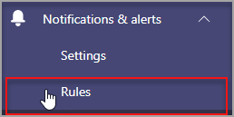

# Microsoft Teams 상태 모니터링

관리 센터의 디바이스 상태 모니터링은 Microsoft Teams 디바이스의 상태 모니터링을 통해 다양한 디바이스의 Teams 있습니다. 조직의 모니터링된 디바이스가 오프라인 상태가면 디바이스의 오프라인 상태를 모니터링하고 실시간으로 경고를 수신합니다.  

시작하기 전에 테넌트에 팀/채널 만들기 권한이 필요합니다. [자세히 알아보기 를 자세히 알아보자.](/microsoft-365/solutions/manage-creation-of-groups?view=o365-worldwide)

## 디바이스 상태 규칙 구성

1. 관리 센터의 왼쪽 탐색에서 Microsoft Teams 알림 & 규칙 **을**  >  **선택합니다.**

   

2. 규칙 **페이지에서** 디바이스 **상태 규칙 을 선택합니다.**

3. 디바이스를 선택하여 경고를 사용하도록 설정하기 위한 상태 규칙을 구성합니다.

    

## 규칙 구성 해석

|필드 |설명  |
|--------|-------------|
|**규칙 형식**   |디바이스 상태 규칙을 사용하면 효과적으로 관리할 수 있습니다. Teams 장치 관리 유형으로 분류됩니다. 향후에는 다른 관련 기능을 모니터링할 수 있도록 디바이스 관리 유형의 더 많은 규칙을 사용할 수 있습니다(예: 부적정한 디바이스 및 디바이스의 로그인 상태 포함).|
|**조건**   |오프라인으로 전환하는 경우 디바이스의 상태는 모니터링할 수 있습니다. [관리 센터의](../devices/device-management.md) 디바이스 관리에 Teams 자세히 알아보고 |
|**범위**   |규칙 평가 빈도를 언급하여 디바이스 상태 상태를 모니터링할 빈도를 지정할 수 있습니다. 기본적으로 팀 디바이스는 오프라인 상태인 경우 거의 실시간으로 모니터링됩니다. |
|**디바이스 사용자**   |로그인한 사용자를 기반으로 선택하여 사전 오프라인 동상 모니터링이 필요한 디바이스를 지정할 수 있습니다. 자세한 내용은 [구성에 대한](#select-devices-for-configuration) 디바이스 선택을 참조합니다. |
|**작업**  >  **채널 경고**   |작업 섹션에서 경고를 받을 팀 채널을 지정할 수 있습니다. 현재, Admin **Alerts** 및 Notifications라는 기본 팀과 **MonitoringAlerts라는** 채널이 만들어지며 알림이 배달됩니다.     테넌트의 전역 관리자 및 Teams 관리자가 이 기본 팀에 자동으로 추가됩니다.|
|**작업**  >  **웹후크**   |외부 웹후크(선택 사항)를 사용하여 알림을 받을 수도 있습니다. JSON 알림 페이로드가 전송되는 웹후크 섹션에서 외부 공용 웹후크 URL을 지정합니다.      웹후크를 통해 알림 페이로드를 조직의 다른 시스템과 통합하여 사용자 지정 워크플로를 만들 수 있습니다.   

**웹후크에 대한 JSON 페이로드 스캐마:**   
<pre lang="json">{      "type": "object",     "properties": {        "AlertTitle": { "type": "string "} ,       "DeviceLoggedInUserId": { "type": "string" } ,       "DeviceId": { "type": "string" } ,        "MetricValues": {              "type": "object",             "properties": {                   "DeviceHealthStatus": { "type": "string"}              }         } ,        "RuleName": { "type": "string"} ,        "RuleDescription": { "type": "string"} ,        "RuleFrequency": { "type": "string"} ,        "RuleType": { "type": "string"} ,        "TenantId": { "type": "string"} ,         "RuleCondition": { "type": "string"} ,         "AlertRaisedAt": { "type": "string"}      }  } </pre>   

  **샘플 JSON 페이로드:**    <pre lang="JSON">    {        "AlertTitle":"*sample_device_name* of *User_Name* has become offline",       "DeviceLoggedInUserId": *User_GUID* ,       "DeviceId": *Device_GUID* ,        "MetricValues": {           DeviceHealthStatus": "offline"              },                  "RuleName": "Device state rule" ,        "RuleDescription": ":"Alerts when device health status is detected as offline" ,        "RuleFrequency": "Real-time" ,        "RuleType": "Device Management" ,        "TenantId": *Tenant_GUID* ,         "RuleCondition": "DeviceHealthStatus = Offline" ,         "AlertRaisedAt": "2020-02-28T12:49:06Z"      }  </pre>   

## 구성에 대한 디바이스 선택

1. 해당 디바이스에 Teams 사용자를 선택하여 모니터링할 디바이스를 선택할 수 있습니다. 디바이스 **사용자** 섹션에서 **추가를** 선택합니다.

2. 디바이스 상태 상태를 모니터링하려는 하나 이상의 사용자를 선택합니다.

   

   선택한 사용자 목록이 **디바이스 사용자 섹션에** 표시됩니다. 사용자를 추가하거나 제거하여 이 목록을 수정할 수 있습니다.

선택한 사용자 목록에서 사용하는 모든 로그인 디바이스는 오프라인 상태 상태를 모니터링합니다.

## 클라이언트의 Teams 알림

알림은 관리자 경고 및 알림 팀의 자동 생성된 **MonitoringAlerts** 채널에서 **배달됩니다.** 디바이스가 오프라인으로 전환된 후 15분 이내에 경고가 표시됩니다. 

디바이스 오프라인 알림에는 다음 정보가 포함할 수 있습니다.

- 오프라인인 디바이스 이름입니다.
- 오프라인 디바이스의 사용자입니다.
- 디바이스가 오프라인 상태인 시간입니다. (현재 시간은 UTC로 표시됩니다.)
- 경고를 제기한 규칙 유형입니다.
- 경고가 발생하는 이유입니다.
