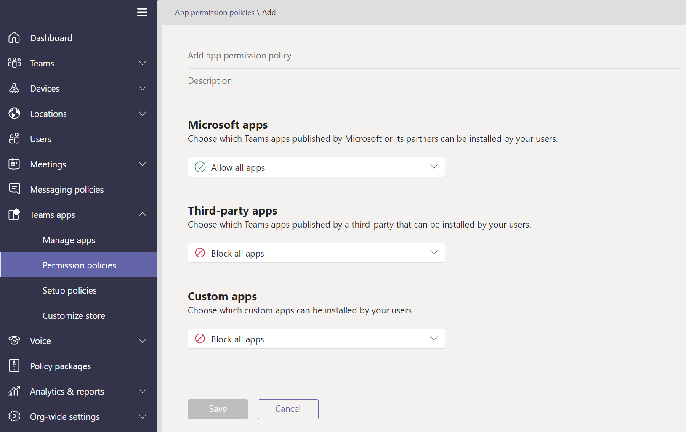

# Microsoft Teams에서 앱 정책 관리Manage app policies in Microsoft Teams

앱 정책은 Microsoft Teams의 애플리케이션을 제어하는 데 사용됩니다.App policies are used to control applications in Microsoft Teams.

## 앱 사용 권한 정책App permission policies

**앱 권한 정책은** 사용자가 사용할 수 있는 앱을 제어하는 데 사용됩니다.**App permission policies** are used to control what apps are available to your users. 관리자는 Teams 앱 스토어에서 사용자가 설치하는 특정 앱을 허용하거나 차단할 수 있습니다.As an admin, you can allow or block specific apps that your users install from the Teams app store. [앱 권한 정책은](teams-app-permission-policies.md) Microsoft Teams 관리 센터를 통해 관리됩니다.[App permission policies](teams-app-permission-policies.md) are managed through the Microsoft Teams admin center.

## 앱 설정 정책App setup policies

**앱 설정 정책을** 사용하면 사용자를 대신하여 애플리케이션을 고정하고 설치하고 조직의 이러한 설정을 제어할 수 있습니다.**App setup policies** enable you to pin and install applications on behalf of your users and control these settings for your organization. [앱 설정 정책은](teams-app-setup-policies.md) Teams 관리 센터에서 관리됩니다.[App setup policies](teams-app-setup-policies.md) are managed in the Teams admin center.

## 사용자 지정 앱 정책Custom app policies

사용자 지정 앱 정책을 사용하여 Teams에 사용자 지정 앱을 업로드할 수 있는 사용자 **지정 앱을 제어할 수 있습니다.**You can control who can upload custom apps to Teams with **custom app policies**. [사용자 지정 앱 설정 및 정책은](teams-custom-app-policies-and-settings.md) Microsoft Teams 관리 센터를 통해 관리됩니다.[Custom app settings and policies](teams-custom-app-policies-and-settings.md) are managed through the Microsoft Teams admin center.

## 관련 항목Related topics

* [Teams에서 사용자 지정 앱 정책 및 설정 관리Manage custom app policies and settings in Teams](teams-custom-app-policies-and-settings.md)
* [Teams에서 앱 설정 정책 관리Manage app setup policies in Teams](teams-app-setup-policies.md)
* [Teams에서 앱 사용 권한 정책 관리Manage app permission policies in Teams](teams-app-permission-policies.md)
* [정책으로 Teams 관리Manage Teams with policies](manage-teams-with-policies.md)
