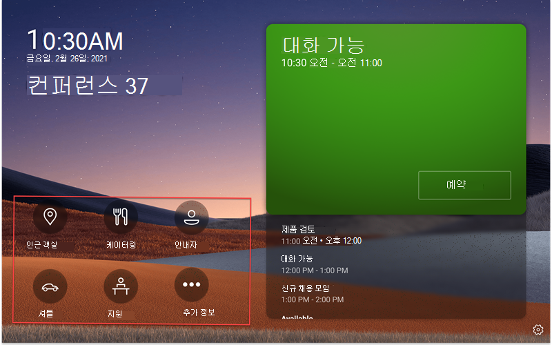
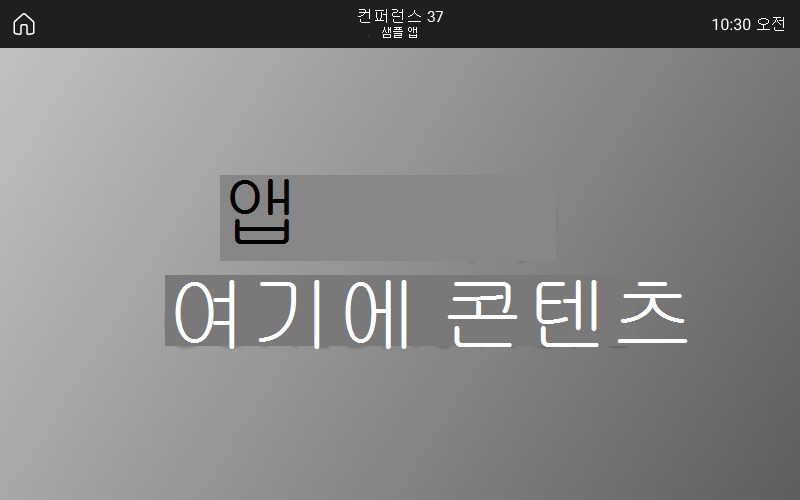

# Microsoft Teams 패널에서 LOB(앱/Line of Business) 앱 지원 Teams 지원

Teams 패널은 [LOB(Teams 앱/Line of Business)](/microsoftteams/platform/overview)앱에 대한 지원을 추가하고 있습니다. 이렇게 하면 기업이 조직의 요구를 충족하기 위해 패널에 추가 환경을 추가할 수 있습니다. 이 릴리스는 정적 웹 콘텐츠를 지원합니다.

> [!IMPORTANT]
> 이 기능은 패널 디바이스를 업데이트한 Teams 후에만 사용할 수 있습니다. 앱 Teams 버전 1449/1.0.97.2021070601 또는 최신 앱 버전이 Teams 있습니다.

## Teams 패널에서 앱 Teams 환경 제공

 

*Teams 패널 홈 화면에는 앱 탐색 옵션이 포함되어 있습니다. 스크린샷에 빨간색으로 간략하게 설명되어 있습니다. 이러한 아이콘은 예제 아이콘으로 사용할 수 없습니다.*

*최종 사용자가 앱 아이콘 중 하나를 탭하면 이전 스크린샷에 Teams 앱 화면이 표시됩니다. 스크린샷의 회색 사각형은 앱이 화면 패널에 표시되는 Teams 있습니다. 앱 표시줄은 고정되어 있으며 Teams 앱의 일부입니다.*

## 관리 센터에서 Teams 패널 앱 설정 및 Teams 관리 

Microsoft Teams 앱에는 주요 정보, 일반적인 도구 및 신뢰할 수 있는 프로세스가 모여서 학습하고 작업할 수 있습니다. Teams 앱은 [통합된 기능을 통해 작동합니다.](/microsoftteams/platform/concepts/capabilities-overview) 이제 IT 관리자로서 조직의 패널 디바이스에 포함할 앱을 Teams 관리 센터를 통해 권한을 [Teams 있습니다.](https://admin.teams.microsoft.com/)

이제 패널에서 Teams 앱을 Teams 사용자의 요구에 따라 사용자 환경을 사용자 지정할 수 있습니다. 사용자가 앱 보기에 액세스하고 사용할 수 있는 웹앱을 결정하고 우선 순위를 지정할 수 있습니다. 봇 및 메시징 기능과 같은 일부 옵션은 현재 지원되지 않습니다. 앱 [및](/microsoftteams/platform/overview) Teams 에서 디바이스를 관리하는 방법에 대해 [Microsoft Teams.](/microsoftteams/devices/device-management)

## 관리 센터의 Teams 패널에서 앱 Teams 관리

**참고**: 전역 관리자 또는 Teams 관리 센터에 액세스하려면 Teams [있어야 합니다.](https://admin.teams.microsoft.com/)

최종 사용자는 패널에 앱을 보지만 설치할 Teams 없습니다. 관리자는 관리자 센터를 통해 조직의 모든 Teams 앱을 보고 관리할 Teams 있습니다. 앱 관리 페이지를  통해 Microsoft Teams 관리 센터에서 앱을 관리하는 방법에 대해 **자세히 알아보십시오.** 관리 **센터** 내의 앱 관리 Teams 사용자 지정 앱을 업로드할 [수도 있습니다.](/microsoftteams/manage-apps#publish-a-custom-app-to-your-organizations-app-store)

앱을 설정한 후 앱  권한 정책  및 앱 설정 정책을 사용하여 조직의 특정 룸 계정에 대한 앱 환경을 구성할 수 있습니다.

## 앱 설정 정책으로 Teams 패널에 앱 고정

Teams 다양한 앱을 표시할 수 있는 기능을 제공하기 때문에 관리자는 조직에 가장 중요한 앱을 결정하고 빠른 액세스를 위해 Teams 패널  홈 화면에만 고정할 수 있습니다. 고정된 앱 또는 고정되지 않은 앱이 5개 이상 있는 경우 추가 화면 아래에 **표시됩니다.** Microsoft는 특정 패널에 대해 사용자 지정 앱 Teams 것이 좋습니다.

 

패널에 Teams 고정된 앱을 관리하려면 조직의 Teams 관리 센터에 로그인하고 Teams 앱 설정  정책 선택 또는 새 정책 고정된 앱 \>  \>  \> **만들기로 이동합니다.**

 

*이 이미지에 포함된 앱은 예제에 불과하며 사용할 수 없습니다.*

Microsoft는 사용자 지정  앱의 업로드  해제하고 사용자 Teams 패널에서 최상의 앱 환경을 Teams 것이 좋습니다.

앱 고정에 대한 자세한 내용은 앱 설정 [정책 관리를 참조하세요.](/microsoftteams/teams-app-setup-policies)

## 패널에서 앱 표시 Teams 관리 

*이 이미지에 포함된 앱은 예제에 불과하며 사용할 수 없습니다.*

앱이 패널에 표시되는 순서를 관리하려면 Teams 관리 센터에 로그인하고 Teams 앱 설정 정책으로  \>  \>  \>  **이동/Teams** 정책 고정 앱 선택 으로 이동합니다.

## 룸 리소스 계정에 설정 정책 할당

설정 정책을 만들면 관리자는 이 정책을 해당 패널에 로그인할 룸 리소스 계정에 Teams 합니다. 자세한 내용은 사용자 및 그룹에 [정책 할당을 참조하세요.](/microsoftteams/assign-policies-users-and-groups)

## FAQ

### 새 또는 업데이트된 앱 Teams 패널에 얼마나 오래 걸릴까요?

관리 센터에서 새 정책을 편집하거나 Teams 변경 내용이 적용되는 데 최대 24시간이 걸릴 수 있습니다. 관리자는 패널에서 로그인/로그인을 시도하고, 설정 아이콘을  탭한 다음 홈 화면으로  돌아가 정책을 새로 고칠 수 있습니다.

### "추가" 화면에서 앱의 순서는 어떻게 하나요?

추가 **앱** 페이지에서 고정된 앱이 먼저 표시됩니다. 그런 다음, 설치된 다른 모든 앱이 사전순으로 표시됩니다.

### 봇 앱이 패널에 Teams 이유는 무엇입니까?

현재 정적 탭 웹 콘텐츠만 지원됩니다.

### 일정 및 작업과 같은 네이티브 Teams 패널에 나타나지 않는 Teams 이유는 무엇입니까?

일정 Teams 작업과 같은 네이티브 Teams 패널에 표시되지 않습니다.

### Teams 관리 센터의 설정 정책 섹션에서 설치된 앱과 고정된 앱의 차이점은 무엇입니까?

Teams 패널의 경우 고정된 앱을 사용하는 것이 좋습니다. 따라서 관리자는 원하는 앱을 선택하고 순서를 다시 구성할 수 있습니다.

**참고:** 일부 앱은 앱 고정을 지원하지 않습니다. 앱 고정 기능을 사용하도록 설정하려면 앱 개발자에게 문의하세요.

### 앱 설정 정책 섹션에 설치된 앱 또는 고정된 앱에 Teams 다른 앱이 "기타" 화면에 나타나는 이유는 무엇입니까?

이전에 다른 앱 정책을 통해 앱을 설치했거나 Teams 데스크톱/웹 클라이언트의 데스크톱/웹 클라이언트에 Teams Teams 패널에 로그인하고 앱을 마우스 오른쪽 단추로 클릭한 다음 제거를 선택하여 수동으로 앱을 제거해야 할 수 **있습니다.**

### "고정된 앱 추가" 창에서 앱을 찾을 수 없는 이유는 무엇입니까?

앱 설정 정책을 통해 모든 앱을 Teams 수 있습니다. 일부 앱은 이 기능을 지원하지 않을 수 있습니다. 고정할 수 있는 앱을 찾으면 고정된 앱 추가 창에서 앱을 **검색합니다.** 자세한 내용은 앱 설치 정책 작업의 [FAQ를 참조하세요.](/microsoftteams/teams-app-setup-policies#why-cant-i-find-an-app-in-the-add-pinned-apps-pane)

### "사용자 고정 허용"을 해제한 후 설정 정책 패널에 "사용자 고정 허용" 팝업이 표시되는 이유

*이 이미지에 포함된 앱은 예제에 불과하며 사용할 수 없습니다.* 

이 동작은 공유 공간의 디바이스에 대해 예상되는 동작으로 의도하지 않은 앱 고정을 방지하는 데 도움이 됩니다.
