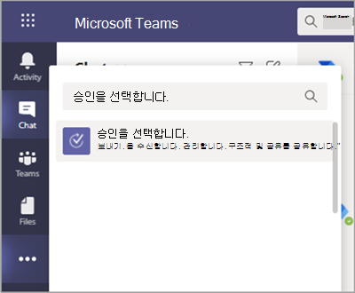

# Teams 승인 앱 가용성

승인 앱은 모든 Microsoft Teams 사용자를 위한 개인 앱으로 사용할 수 있습니다.
승인 앱은 감사, 규정 준수, 책임 및 워크플로를 Teams의 정형 및 비정형 승인에 모두 적용할 수 있는 간단한 방법을 제공합니다.

 

승인 앱을 고정하여 메뉴 모음에 저장할 수 있습니다.

 

승인 앱에서 생성된 첫 번째 승인이은 기본 CDS(일반 데이터 서비스) 환경에서 승인 솔루션의 프로비저닝을 트리거합니다. 승인 앱에서 생성된 승인은 기본 CDS 환경에 저장됩니다.

이 자료에서는 승인 앱 요구 사항 및 역할에 대해 설명합니다.

> [!NOTE]
> 이 기능은 아직(정부 커뮤니티 클라우드), GCC(GCCH) 및 국방부(DOD) 정부 커뮤니티 클라우드 사용자에게 릴리스되지 않았습니다.

## 필요한 권한 및 라이선스

승인 앱을 사용하려면 다음 항목에 대한 권한이 있어야 합니다.

- Microsoft CDS 데이터베이스를 만들 수 있는 사용 권한입니다.

- [flow.microsoft.com](https://flow.microsoft.com/)의 계정

- 대상 환경의 관리자 역할

- [Power Automatic](/power-automate/get-started-approvals), Office 365 또는 Dynamics 365에 대한 라이선스

- 사용자가 새 승인 템플릿을 설정하려면 Microsoft Forms에 대한 라이선스가 필요합니다.

## CDS가 포함된 저장소

일반 데이터 모델(CDM)은 CDS의 비즈니스 및 분석 응용 프로그램에서 사용되는 공유 데이터 언어입니다. Microsoft 및 파트너가 게시한 표준화된 확장 가능한 데이터 스키마 세트로 구성되어 응용 프로그램 및 비즈니스 프로세스에서 데이터와 데이터 의미의 일관성을 유지합니다. [Microsoft Power Platform의 일반 데이터 모델](/power-automate/get-started-approvals)에 대해 자세히 알아보세요.

[승인 워크플로](/power-automate/modern-approvals)에 대해 자세히 알아보세요.

템플릿에서 만든 승인은 여전히 타이틀, 세부 정보, 템플릿 ID 등의 데이터를 CDS에 저장합니다. 승인 요청에 제출된 응답은 양식에 저장됩니다.  [Microsoft Forms용 데이터 저장소에 대해 자세히 알아보자.](https://support.microsoft.com/office/data-storage-for-microsoft-forms-97a34e2e-98e1-4dc2-b6b4-7a8444cb1dc3#:~:text=Where%20data%20is%20stored%20for%20Microsoft%20Forms.%20Microsoft,European-based%20tenants%20is%20stored%20on%20servers%20in%20Europe)

>[!Note]
>Microsoft Forms 사이트에서 양식 서식 파일을 삭제하면 승인 템플릿이 중단되고 사용자가 요청을 시작할 수 없습니다. Microsoft Forms에서 삭제된 승인 템플릿을 열려고 할 때 "CDB TableNotFound"에 오류가 발생합니다.

승인 템플릿은 Microsoft 내에서만 내부적으로 Storage 규격 스토리지 플랫폼인 SDS(기판 데이터 Storage)에 저장됩니다. 조직 범위 템플릿은 SDS의 "테넌트 데이터베이스"에 저장되고 팀 범위 템플릿은 SDS의 "그룹 데이터베이스"에 저장됩니다. 즉, 구성 범위 템플릿은 테넌트의 동일한 수명을 공유하고 팀 범위 템플릿은 팀의 동일한 수명을 공유합니다. 따라서 팀을 영구적으로 삭제하면 관련 템플릿이 삭제됩니다.

## 승인 Teams 앱 사용 권한

승인 Teams 앱을 통해 다음 기능에 액세스할 수 있습니다.

- 메시지에 제공하는 메시지 및 데이터를 수신합니다.

- 메시지 및 알림을 보냅니다.

- Teams이 제공한 헤더 없이 개인 앱 및 대화 상자를 렌더링합니다.

- 이름, 전자 메일 주소, 회사 이름 및 기본 설정 언어와 같은 프로필 정보에 액세스합니다.

- Teams 구성원이 채널에 제공하는 메시지 및 데이터를 수신합니다.

- 채널에서 메시지 및 알림을 보냅니다.

- 다음과 같은 Teams 정보에 액세스합니다.
  - 팀 이름
  - 채널 목록
  - 명단(팀 구성원의 이름 및 전자 메일 주소)

- 팀의 정보를 사용하여 팀에 연락하세요.

승인 템플릿 사용 권한

- 모든 팀 소유자는 소유한 팀에 대한 승인 템플릿을 만들 수 있습니다.

- 관리자가 처음으로 전체 조직에 대한 템플릿을 만들면 전역 및 팀의 서비스 관리자를 Teams 테넌트의 모든 관리자에 대한 새 팀을 자동으로 만듭니다. 이러한 관리자는 팀의 소유자로 추가될 것이기 때문에 조직 템플릿을 공동 관리할 수 있습니다. 팀을 만든 후 조직에 새로운 관리자는 팀 소유자로 수동으로 추가해야 조직 전체 템플릿을 관리할 수 있는 권한이 동일합니다.

> [!Note]
> 관리자가 팀을 삭제하는 경우 모든 관련 데이터를 복원하기 위해 AAD(Azure Active Directory) 포털 내에서 복원할 Azure Active Directory 있습니다. 한 달이 지난 후 또는 관리자가 이 팀을 리사이즈 bin 내에서 삭제하면 관련된 모든 데이터가 손실됩니다.

## 승인 앱 사용 해제

기본적으로 승인 앱은 사용할 수 있습니다. Teams 관리 센터에서 앱을 비활성화할 수 있습니다.

  1. Teams 관리 센터에 로그인합니다.

  2. **Teams 앱** 을 확장하고 **앱 관리** 를 선택합니다.

  3. 승인 앱을 검색합니다.

     

  4. 승인을 선택합니다.

  5. 조직에 대한 앱을 비활성화하려면 토글을 선택합니다.

     

## 보존 정책

승인 앱에서 생성된 승인은 현재 백업을 지원하지 않는 기본 CDS 환경에 저장됩니다. [환경을 백업 및 복원하는 방법에 대해 자세히 알아보세요. PowerPlatform \|Microsoft Docs](/power-platform/admin/backup-restore-environments).

양식에 저장된 데이터는 팀 소유자가 Microsoft Forms 웹앱의  삭제된 폼 탭에서 정리할 때까지 삭제되지 않습니다.

## 데이터 제한 사항

각 팀은 최대 400개 이상의 승인 템플릿을 포함할 수 있으며, 각 템플릿은 Microsoft Forms의 현재 기능에 따라 최대 50,000개 요청을 수집할 수 있습니다.

## 감사

승인 앱은 Microsoft 365 보안 및 규정 준수 센터 내에서 감사 이벤트를 기록합니다. 감사 로그를 볼 수 있습니다.

1. Microsoft 365 규정 준수 사이트로 이동합니다.

2. **감사** 섹션을 선택합니다.

3. **Microsoft Teams 승인 작업** 에서 활동을 검색합니다.

다음 활동을 검색할 수 있습니다.

- 새 승인 요청 만들기

- 승인 요청 세부 정보 보기

- 승인된 승인 요청

- 승인 요청 거부

- 승인 요청 취소

- 공유 승인 요청

- 승인 요청에 첨부된 파일

- 재할당된 승인 요청

- 승인 요청에 전자 서명 추가

- 확인된 전자 서명 요청 세부 정보

- 검토된 전자 서명 요청

- 취소된 전자 서명 요청

- 새 템플릿 만들기

- 기존 템플릿 편집

- 템플릿 사용/사용 안 하도록 설정

- 보기 템플릿

Flow 내에서 더 많은 감사 승인에 액세스하려면 기본 승인 엔터티 승인, 승인 요청 및 승인 응답에 대한 기본 환경에서 감사를 사용하도록 설정하고 구성합니다. 생성, 업데이트 및 삭제 작업은 승인 레코드에 대해 감사할 수 있는 이벤트입니다. [보안 및 규정 준수를 위한 감사 데이터 및 사용자 활동 - Power Platform \|Microsoft Docs](/power-platform/admin/audit-data-user-activity)에 대해 자세히 알아보세요.

감사는 [Microsoft 365 보안 및 규정 준수 센터](https://support.office.com/article/go-to-the-office-365-security-compliance-center-7e696a40-b86b-4a20-afcc-559218b7b1b8?ui=en-US&rs=en-US&ad=US)에서 추가로 사용자 지정할 수 있습니다.

1. 미리 구성된 보고서를 사용하려면 Microsoft 365 보안 및 규정 준수에 로그인합니다.

2. **검색 및 조사** 를 선택하세요.

3. 감사 로그를 검색하고 **Dynamics 365 활동** 탭을 선택하세요.

[Microsoft Dataverse 및 모델 기반 앱 활동 로깅-Power Platform](/power-platform/admin/enable-use-comprehensive-auditing)에 대해 자세히 알아보세요.

## 보안

Teams 승인 앱에서 사용자는 새 승인을 만들고 보내고 받은 승인을 볼 수 있습니다. 사용자는 요청의 응답자 또는 뷰어가 아니면 다른 사용자가 만든 승인에 액세스할 수 없습니다.

> [!Note]
> 사용자가 승인이 만들어진 채팅 또는 채널의 일부인 경우 요청의 뷰어 역할이 제공됩니다. 승인이 생성되었을 때 해당 역할이 부여되지 않은 경우 요청에 대한 조치를 취할 수 없습니다.

## 승인 전자 서명 통합

승인 앱에서 만든 전자 서명 승인은 선택한 공급자의 클라우드 환경에 저장됩니다. 전자 서명 계약 주변의 저장소에 대한 자세한 내용은 선택한 공급자의 저장소 설명서를 참조하세요.

승인 앱 전자 서명 기능을 사용하려면 다음 항목이 필요합니다.

- 사용 하도록 선택한 특정 전자 서명 공급자에 대한 라이선스입니다. 조직에 대한 라이선스를 얻기 위해 공급자의 사이트로 이동해야 합니다.

승인 전자 서명 기능의 경우 타사 서명 파트너가 기본적으로 Teams 앱에 표시됩니다. 관리 센터의 앱 설정에 액세스하여 특정 전자 서명 공급자를 Teams 수 있습니다.

1. 관리 Teams 관리에서 승인 앱을 선택하고 **설정.** 

2. 각 전자 서명 공급자는 기본적으로 on 위치에 있는 토글 옆에 토글이 있습니다(오른쪽). 토글을 왼쪽으로 밀어 특정 전자 서명 공급자를 사용하지 않도록 설정합니다. 관리자 Teams 공급자를 사용하지 않도록 설정하면 최종 사용자는 승인을 만들 때 공급자를 볼 수 없습니다. 또한 최종 사용자는 해당 공급자를 통해 만든 전자 서명 요청을 볼 수 없습니다.

승인 앱에서 만든 전자 서명 승인은 선택한 공급자의 클라우드에 저장됩니다. 따라서 전자 서명에 대한 데이터를 내보내기 위해 공급자의 사이트로 이동해야 합니다. 이러한 계약의 내보내기 및 보존에 대한 공급자의 설명서를 참조하세요.
