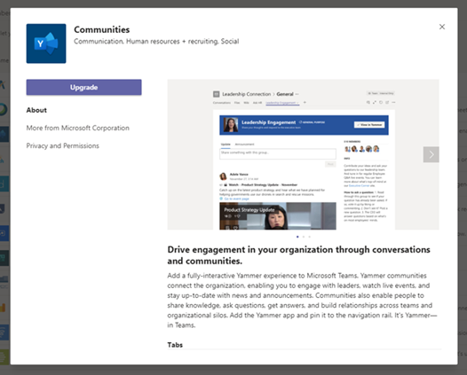

# Microsoft Teams 앱 업데이트

대부분의 경우 앱 개발자가 앱 업데이트를 게시하면 사용자에 대해 새 버전이 자동으로 표시됩니다. 그러나 사용자 동의를 완료해야 하는 [Microsoft Teams 매니페스트](/microsoftteams/platform/resources/schema/manifest-schema)에 대한 몇 가지 업데이트가 있습니다.

* 봇이 추가되거나 제거됨
* 기존 봇의 "botId" 속성이 변경됨
* 기존 봇의 "isNotificationOnly" 속성이 변경됨
* 봇의 SupportsCalling, SupportsVideo 및 SupportsFiles 기능이 추가되었습니다.
* 메시징 확장이 추가되었습니다.
* 새 커넥터가 추가되었습니다.
* "권한 부여" 내의 사용 권한이 추가되거나 변경되었습니다.

> [!NOTE]
> 업데이트 프로세스는 Microsoft 앱, 사용자 지정 앱 및 타사 앱에 대한 모든 앱 업데이트에 적용됩니다.

## 관련 항목

[앱 관리](manage-apps.md)
