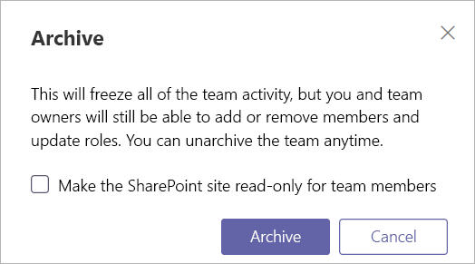

Microsoft 팀에서 팀 보관 또는 삭제
===========================================

시간이 지남에 따라 Microsoft 팀에서 만든 팀이 사용 되지 않거나 프로젝트의 마지막에 팀을 보관 하거나 삭제할 수 있습니다. Microsoft 팀 관리자 인 경우이 문서에 나와 있는 단계를 따라 더 이상 필요 하지 않은 팀을 보관 하거나 삭제할 수 있습니다. 팀을 보관 하면 해당 팀의 모든 작업이 중단 되지만 구성원을 추가 또는 제거 하 고 역할을 업데이트할 수 있으며, 계속 해 서 모든 팀 활동을 채널, 파일 및 채팅에서 볼 수 있습니다. 팀을 삭제 하면 관련 채널, 파일, 채팅의 팀 활동도 삭제 됩니다. 

> [!IMPORTANT]
> 보관 된 팀을 다시 활성화할 수 있지만, 삭제 된 팀의 삭제 취소할 수 없습니다. 팀을 먼저 보관 하 고 더 이상 팀이 필요 하지 않을 때까지 삭제를 연기 하세요.

## 팀 보관

팀을 보관 하려면 다음 단계를 따르세요.

1. Microsoft 팀 관리 센터에서 **팀**을 선택 합니다.
2. 팀 이름을 클릭 하 여 팀을 선택 합니다.
3. **보관**을 선택 합니다. 다음 메시지가 표시 됩니다.

    

4. 팀의 SharePoint 사이트를 읽기 전용으로 설정 하려면 확인란을 선택 합니다.
5. **보관** 을 선택 하 여 팀을 보관 합니다. 팀의 상태가 **보관**됨으로 변경 됩니다.

## 보관 된 팀을 활성 상태로 만들기

보관 된 팀이 다시 활성화 되도록 하려면 다음 단계를 따르세요.

1. Microsoft 팀 관리 센터에서 **팀**을 선택 합니다.
2. 팀 이름을 클릭 하 여 팀을 선택 합니다.
3. **보관**해제를 선택 합니다. 팀의 상태가 **활성**으로 변경 됩니다.

## 팀 삭제

나중에 팀이 필요 하지 않은 경우에는 보관 하는 대신 삭제할 수 있습니다. 팀을 삭제 하려면 다음 단계를 따르세요.

1.  Microsoft 팀 관리 센터에서 **팀**을 선택 합니다.
2.  팀 이름을 클릭 하 여 팀을 선택 합니다.
3.  **삭제**를 선택 합니다. 확인 메시지가 표시 됩니다.
4.  **삭제** 를 선택 하 여 팀을 영구적으로 삭제 합니다.

