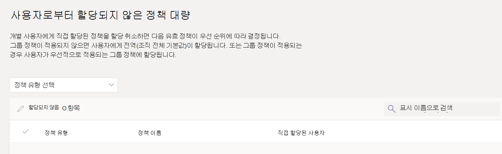

# <a name="assign-policies-to-users-and-groups"></a>사용자 및 그룹에 정책 할당

이 문서에서는 Microsoft Teams의 사용자 및 그룹에 정책을 할당하는 다양한 방법을 검토합니다. 읽기 전에 [Teams에서 정책 할당을](policy-assignment-overview.md) 읽었는지 확인합니다. 시작.

## <a name="assign-a-policy-to-individual-users"></a>개별 사용자에게 정책 할당

개별 사용자 또는 소수의 사용자에게 한 번에 정책을 할당하려면 다음 단계를 수행합니다.

### <a name="use-the-microsoft-teams-admin-center"></a>Microsoft Teams 관리 센터 사용

사용자에게 정책을 할당하려면 다음을 수행합니다.

1. [Microsoft Teams 관리 센터의](https://admin.teams.microsoft.com) 왼쪽 탐색 영역에서 **사용자 관리 사용자** > 로 이동합니다.
2. 사용자 이름 왼쪽을 클릭하여 사용자를 선택한 다음 **설정 편집** 을 선택합니다.
3. 할당할 정책을 선택한 다음 **적용** 을 선택합니다.


> [!NOTE]
> 사용자로부터 특수 정책을 할당 취소하려면 각 정책을 **전역(조직 전체 기본값)으로** 설정할 수 있습니다. 정책에 직접 할당된 모든 사용자에 대해 정책 할당을 대량으로 제거할 수도 있습니다. 자세한 내용은 [정책 할당 취소를 대량으로](#unassign-policies-in-bulk) 읽어보세요.

다음을 수행하여 사용자에게 정책을 할당할 수도 있습니다.

1. Microsoft Teams 관리 센터의 왼쪽 탐색 영역에서 정책 페이지로 이동합니다.
2. 정책 이름의 왼쪽을 클릭하여 할당할 정책을 선택합니다.
3. **사용자 관리** 를 선택합니다.
4. **사용자 관리** 창에서 표시 이름 또는 사용자 이름으로 사용자를 검색하고 이름을 선택한 다음, **추가** 를 선택하세요. 추가할 각 사용자에 대해 이 단계를 반복합니다.
5. 사용자 추가가 완료되면 **적용** 을 선택합니다.


### <a name="use-powershell"></a>PowerShell 사용

각 정책 유형에는 관리하기 위한 고유한 cmdlet 집합이 있습니다. `Grant-` 지정된 정책 유형에 대한 cmdlet을 사용하여 정책을 할당합니다. 예를 들어 cmdlet을 `Grant-CsTeamsMeetingPolicy` 사용하여 Teams 모임 정책을 사용자에게 할당합니다. 이러한 cmdlet은 Teams PowerShell 모듈에 포함되며 [비즈니스용 Skype cmdlet 참조](/powershell/skype)에 설명되어 있습니다.

 [Teams PowerShell 공개 릴리스](https://www.powershellgallery.com/packages/MicrosoftTeams/)(아직 설치하지 않은 경우)를 다운로드하여 설치한 다음, 다음을 실행하여 연결합니다.

> [!NOTE]
> 비즈니스용 Skype Online Connector는 현재 최신 Teams PowerShell 모듈의 일부입니다.
>
> 최신 [Teams PowerShell 공개 릴리스](https://www.powershellgallery.com/packages/MicrosoftTeams/)를 사용하는 경우 비즈니스용 Skype Online Connector를 설치할 필요가 없습니다.

```powershell
  # When using Teams PowerShell Module

   Import-Module MicrosoftTeams
   $credential = Get-Credential
   Connect-MicrosoftTeams -Credential $credential
```

이 예제에서는 Reda라는 사용자에게 학생 모임 정책이라는 Teams 모임 정책을 할당합니다.

```powershell
Grant-CsTeamsMeetingPolicy -Identity reda@contoso.com -PolicyName "Student Meeting Policy"
```

자세한 내용은 [PowerShell을 통해 정책 관리를](teams-powershell-managing-teams.md#manage-policies-via-powershell) 참조하세요.

## <a name="assign-a-policy-to-a-group"></a>그룹에 정책 할당

그룹에 대한 정책 할당을 사용하면 보안 그룹, 조직 구성 단위 또는 메일 그룹과 같은 사용자 그룹에 정책을 할당할 수 있습니다. 정책 할당은 선행 규칙에 따라 그룹의 구성원에게 전파됩니다. 그룹에서 구성원이 추가되거나 제거되면 상속된 정책 할당이 그에 따라 업데이트됩니다.

그룹에 대한 정책 할당은 최대 50,000명의 사용자 그룹에 권장되지만 더 큰 그룹에서도 작동합니다.

정책을 할당하면 그룹에 즉시 할당됩니다. 그러나 그룹 구성원에 대한 정책 할당 전파는 백그라운드 작업으로 수행되며 그룹의 크기에 따라 다소 시간이 걸릴 수 있습니다. 그룹에서 정책을 할당 취소하거나 그룹에서 구성원을 추가하거나 제거할 때도 마찬가지입니다.

그룹 정책 할당은 그룹의 직접 구성원인 사용자에게만 전파됩니다. 할당은 중첩된 그룹의 멤버로 전파되지 않습니다.

### <a name="what-you-need-to-know-about-policy-assignment-to-groups"></a>그룹에 대한 정책 할당에 대해 알아야 할 사항

시작하기 전에 우선 순위 규칙 및 그룹 할당 순위를 이해하는 것이 중요합니다.

#### <a name="precedence-rules"></a>우선 순위 규칙

지정된 정책 유형의 경우 사용자의 유효 정책은 다음에 따라 결정됩니다.

- 사용자에게 직접 할당된 정책은 그룹에 할당된 것과 동일한 유형의 다른 정책보다 우선합니다. 즉, 사용자에게 지정된 형식의 정책이 직접 할당된 경우 해당 사용자는 그룹에서 동일한 형식의 정책을 상속하지 않습니다. 즉, 사용자에게 직접 할당된 지정된 형식의 정책이 있는 경우 그룹에서 동일한 형식의 정책을 상속하기 전에 해당 정책을 사용자로부터 제거해야 합니다.
- 사용자에게 직접 할당된 정책이 없고 둘 이상의 그룹의 구성원이고 각 그룹에 할당된 동일한 유형의 정책이 있는 경우 사용자는 순위가 가장 높은 그룹 할당의 정책을 상속합니다.
- 사용자가 정책이 할당된 그룹의 구성원이 아닌 경우 해당 정책 유형에 대한 전역(조직 전체 기본값) 정책이 사용자에게 적용됩니다.

사용자의 유효 정책은 다음 규칙에 따라 업데이트됩니다.

- 사용자가 정책이 할당된 그룹에 추가되거나 제거되는 경우
- 정책은 그룹에서 할당되지 않습니다.
- 사용자에게 직접 할당된 정책이 제거됩니다.

#### <a name="group-assignment-ranking"></a>그룹 할당 순위

> [!NOTE]
> 지정된 정책 유형은 해당 형식의 정책 인스턴스에서 최대 64개의 그룹에 할당할 수 있습니다.

그룹에 정책을 할당할 때 그룹 할당에 대한 순위를 지정합니다. 이 순위는 사용자가 둘 이상의 그룹의 구성원이고 각 그룹에 동일한 유형의 정책이 할당된 경우 사용자가 유효 정책으로 상속해야 하는 정책을 결정하는 데 사용됩니다.

그룹 할당 순위는 동일한 유형의 다른 그룹 할당을 기준으로 합니다. 예를 들어 두 그룹에 호출 정책을 할당하는 경우 한 할당의 순위를 1로, 다른 하나는 2로 설정하고, 1은 가장 높은 순위로 설정합니다. 그룹 할당 순위는 상속과 관련하여 다른 그룹 멤버 자격보다 더 중요하거나 관련성이 더 큰 그룹 멤버 자격을 나타냅니다.

예를 들어 Store Employees와 Store Manager의 두 그룹이 있다고 가정해 보겠습니다. 두 그룹 모두 Teams 통화 정책, 스토어 직원 통화 정책 및 매장 관리자 통화 정책이 각각 할당됩니다. 두 그룹에 모두 있는 매장 관리자의 경우 관리자로서의 역할은 직원으로서의 역할보다 관련성이 높으므로 스토어 관리자 그룹에 할당된 통화 정책은 더 높은 순위를 가져야 합니다.

|그룹 |Teams 통화 정책 이름  |줄|
|---------|---------|---|
|매장 관리자   |스토어 관리자 통화 정책         |1|
|직원 저장    |직원 통화 정책 저장      |2|

순위를 지정하지 않으면 정책 할당에 가장 낮은 순위가 지정됩니다.

### <a name="in-the-teams-admin-center"></a>Teams 관리 센터에서

> [!NOTE]
> 현재 Microsoft Teams 관리 센터를 사용하는 그룹에 대한 정책 할당은 Teams 통화 정책, Teams 통화 대기 정책, Teams 정책, Teams 라이브 이벤트 정책, Teams 모임 정책 및 Teams 메시징 정책에만 사용할 수 있습니다. 다른 정책 형식의 경우 PowerShell을 사용합니다.

1. Microsoft Teams 관리 센터의 왼쪽 탐색 영역에서 정책 유형 페이지로 이동합니다. 예를 들어 모임 **모임 정책****으로** >  이동합니다.
2. **그룹 정책 할당** 탭을 선택합니다.
3. **그룹 추가** 를 선택한 다음 그룹에 **정책 할당** 창에서 다음을 수행합니다.
    1. 정책을 할당할 그룹을 검색하고 추가합니다.
    2. 그룹 할당에 대한 순위를 설정합니다.
    3. 할당할 정책을 선택합니다.
    4. **적용** 을 선택합니다.


그룹 정책 할당을 제거하려면 정책 페이지의 **그룹 정책 할당** 탭에서 그룹 할당을 선택한 다음 **제거** 를 선택합니다.

그룹 할당의 순위를 변경하려면 먼저 그룹 정책 할당을 제거해야 합니다. 그런 다음, 위의 단계에 따라 그룹에 정책을 할당합니다.

### <a name="use-the-powershell-option"></a>PowerShell 옵션 사용

> [!NOTE]
> 현재 PowerShell을 사용하는 그룹에 대한 정책 할당은 모든 Teams 정책 유형에 사용할 수 없습니다. 지원되는 정책 유형 목록은 [New-CsGroupPolicyAssignment](/powershell/module/teams/new-csgrouppolicyassignment) 를 참조하세요.

#### <a name="install-and-connect-to-the-microsoft-teams-powershell-module"></a>Microsoft Teams PowerShell 모듈 설치 및 연결

단계별 지침은 [Teams PowerShell 설치](teams-powershell-install.md)를 참조하세요.

#### <a name="assign-a-policy-to-a-group-of-users"></a>사용자 그룹에 정책 할당

[New-CsGroupPolicyAssignment](/powershell/module/teams/new-csgrouppolicyassignment) cmdlet을 사용하여 그룹에 정책을 할당합니다. 개체 ID, SIP 주소 또는 전자 메일 주소를 사용하여 그룹을 지정할 수 있습니다.

이 예제에서는 배정 순위가 1인 그룹에 소매 관리자 모임 정책이라는 Teams 모임 정책을 할당합니다.

```powershell
New-CsGroupPolicyAssignment -GroupId d8ebfa45-0f28-4d2d-9bcc-b158a49e2d17 -PolicyType TeamsMeetingPolicy -PolicyName "Retail Managers Meeting Policy" -Rank 1
```

#### <a name="get-policy-assignments-for-a-group"></a>그룹에 대한 정책 할당 가져오기

[Get-CsGroupPolicyAssignment](/powershell/module/teams/get-csgrouppolicyassignment) cmdlet을 사용하여 그룹에 할당된 모든 정책을 가져옵니다. SIP 주소 또는 전자 메일 주소를 사용하여 정책을 할당한 경우에도 그룹은 항상 그룹 ID로 나열됩니다.

이 예제에서는 특정 그룹에 할당된 모든 정책을 검색합니다.

```powershell
Get-CsGroupPolicyAssignment -GroupId e050ce51-54bc-45b7-b3e6-c00343d31274
```

이 예제에서는 Teams 모임 정책이 할당된 모든 그룹을 반환합니다.

```powershell
Get-CsGroupPolicyAssignment -PolicyType TeamsMeetingPolicy
```

#### <a name="remove-a-policy-from-a-group"></a>그룹에서 정책 제거

[Remove-CsGroupPolicyAssignment](/powershell/module/teams/remove-csgrouppolicyassignment) cmdlet을 사용하여 그룹에서 정책을 제거합니다. 그룹에서 정책을 제거하면 해당 그룹에 할당된 동일한 유형의 다른 정책의 우선 순위와 순위가 낮은 정책의 우선 순위가 업데이트됩니다. 예를 들어 순위가 2인 정책을 제거하면 순위가 3과 4인 정책이 새 순위를 반영하도록 업데이트됩니다. 다음 두 표에서는 이 예제를 보여 줍니다.

다음은 Teams 모임 정책에 대한 정책 할당 및 우선 순위 목록입니다.

|그룹 이름  |정책 이름  |줄|
|---------|---------|---------|
|영업    |판매 정책       | 1        |
|서부 지역     |서부 지역 정책         |2         |
|나눗셈    |나누기 정책         |3         |
|자회사   |자회사 정책        |4         |

서부 지역 그룹에서 서부 지역 정책을 제거하면 정책 할당 및 우선 순위가 다음과 같이 업데이트됩니다.

|그룹 이름  |정책 이름  |줄|
|---------|---------|---------|
|영업    |판매 정책       | 1        |
|나눗셈    |나누기 정책         |2         |
|자회사   |자회사 정책        |3        |

이 예제에서는 그룹에서 Teams 모임 정책을 제거합니다.

```powershell
Remove-CsGroupPolicyAssignment -PolicyType TeamsMeetingPolicy -GroupId f985e013-0826-40bb-8c94-e5f367076044
```

#### <a name="change-a-policy-assignment-for-a-group"></a>그룹에 대한 정책 할당 변경

> [!NOTE]
> [Set-CsGroupPolicyAssignment](/powershell/module/teams/set-csgrouppolicyassignment) cmdlet은 곧 사용할 수 있습니다. 그 동안 그룹 정책 할당을 변경하려면 그룹에서 현재 정책 할당을 제거한 다음 새 정책 할당을 추가할 수 있습니다.

그룹에 정책을 할당한 후 [Set-CsGroupPolicyAssignment](/powershell/module/teams/set-csgrouppolicyassignment) cmdlet을 사용하여 다음과 같이 해당 그룹의 정책 할당을 변경할 수 있습니다.

- 순위 변경
- 지정된 정책 유형의 정책 변경
- 지정된 정책 유형 및 순위의 정책 변경

이 예제에서는 그룹의 Teams 통화 공원 정책을 SupportCallPark라는 정책으로 변경하고 할당 순위를 3으로 변경합니다.

```powershell
Set-CsGroupPolicyAssignment -GroupId 566b8d39-5c5c-4aaa-bc07-4f36278a1b38 -PolicyType TeamsMeetingPolicy -PolicyName SupportCallPark -Rank 3
```

#### <a name="change-the-effective-policy-for-a-user"></a>사용자에 대한 유효 정책 변경

다음은 정책이 직접 할당된 사용자에 대한 유효 정책을 변경하는 방법의 예입니다.

먼저 [Get-CsUserPolicyAssignment](/powershell/module/teams/get-csuserpolicyassignment) cmdlet을 매개 변수와 `PolicySource` 함께 사용하여 사용자와 연결된 Teams 모임 브로드캐스트 정책에 대한 세부 정보를 가져옵니다.

```powershell
Get-CsUserPolicyAssignment -Identity daniel@contoso.com -PolicyType TeamsMeetingBroadcastPolicy | select -ExpandProperty PolicySource
```

출력은 사용자에게 **Employee Events** 라는 Teams 모임 브로드캐스트 정책이 직접 할당되었음을 보여 줍니다. 이 정책은 사용자가 속한 그룹에 할당된 **공급업체 라이브 이벤트** 라는 정책보다 우선합니다.

```console
AssignmentType PolicyName         Reference
-------------- ----------         ---------
Direct         Employee Events
Group          Vendor Live Events 566b8d39-5c5c-4aaa-bc07-4f36278a1b38
```

이제 사용자로부터 직원 이벤트 정책을 제거합니다. 즉, 사용자에게 직접 할당된 Teams 모임 브로드캐스트 정책이 더 이상 없으며 사용자가 속한 그룹에 할당된 공급업체 라이브 이벤트 정책을 상속합니다.

이 작업을 수행하려면 비즈니스용 Skype PowerShell 모듈에서 다음 cmdlet을 사용합니다.

```powershell
Grant-CsTeamsMeetingBroadcastPolicy -Identity daniel@contoso.com -PolicyName $null
```

Teams PowerShell 모듈에서 다음 cmdlet을 사용하여 일괄 처리 정책 할당을 통해 대규모로 이 작업을 수행합니다. 여기서 $users 지정한 사용자 목록입니다.

```powershell
New-CsBatchPolicyAssignmentOperation -OperationName "Assigning null at bulk" -PolicyType TeamsMeetingBroadcastPolicy -PolicyName $null -Identity $users  
```

## <a name="assign-a-policy-to-a-batch-of-users"></a>사용자 일괄 처리에 정책 할당

### <a name="use-the-admin-center"></a>관리 센터 사용

사용자에게 정책을 대량으로 할당하려면 다음을 수행합니다.

1. Microsoft Teams 관리 센터의 왼쪽 탐색 영역에서 **사용자를** 선택합니다.
2. 정책을 할당할 사용자를 검색하거나 보기를 필터링하여 원하는 사용자를 표시합니다.
3. **&#x2713;**(확인 표시) 열에서 사용자를 선택합니다. 모든 사용자를 선택하려면 테이블 맨 위에 있는 &#x2713;(확인 표시)를 선택합니다.
4. **설정 편집** 을 선택하고 원하는 대로 변경한 다음 **적용** 을 선택합니다.

정책 할당의 상태를 보려면 적용 **을 선택하여 정책** 할당을 제출한 후 **사용자** 페이지 맨 위에 표시되는 배너에서 **활동 로그를** 선택합니다. 또는 Microsoft Teams 관리 센터의 왼쪽 탐색에서 **대시보드** 로 이동한 다음 **활동 로그** 아래에서 **세부 정보 보기를** 선택합니다. 활동 로그는 지난 30일 동안 Microsoft Teams 관리 센터를 통해 20명 이상의 사용자를 일괄 처리하도록 정책 할당을 표시합니다. 자세한 내용은 [활동 로그에서 정책 할당 보기를 참조하세요](activity-log.md).

### <a name="use-powershell-method"></a>PowerShell 메서드 사용

> [!NOTE]
> 현재 PowerShell을 사용한 일괄 처리 정책 할당은 모든 Teams 정책 유형에 사용할 수 없습니다. 지원되는 정책 유형 목록은 [New-CsBatchPolicyAssignmentOperation](/powershell/module/teams/new-csbatchpolicyassignmentoperation) 을 참조하세요.

일괄 처리 정책 할당을 사용하면 스크립트를 사용하지 않고 한 번에 많은 사용자 집합에 정책을 할당할 수 있습니다. [New-CsBatchPolicyAssignmentOperation](/powershell/module/teams/new-csbatchpolicyassignmentoperation) cmdlet을 사용하여 사용자 배치 및 할당하려는 정책을 제출합니다. 할당은 백그라운드 작업으로 처리되고 각 배치에 작업 ID가 생성됩니다. 그런 다음 [Get-CsBatchPolicyAssignmentOperation](/powershell/module/teams/get-csbatchpolicyassignmentoperation) cmdlet을 사용하여 일괄 처리에서 할당의 진행률 및 상태를 추적할 수 있습니다.

개체 ID 또는 SIP(세션 시작 프로토콜) 주소로 사용자를 지정합니다. 사용자의 SIP 주소는 UPN(사용자 계정 이름) 또는 전자 메일 주소와 동일한 값을 갖는 경우가 많지만 필수는 아닙니다. UPN 또는 전자 메일을 사용하여 사용자를 지정했지만 SIP 주소와 다른 값을 갖는 경우 사용자에 대한 정책 할당이 실패합니다. 일괄 처리에 중복된 사용자가 포함된 경우 처리 전에 일괄 처리에서 중복 항목이 제거되고, 일괄 처리에 남아 있는 고유 사용자에 대해서만 상태가 제공됩니다.

배치에는 최대 5천 명의 사용자가 포함될 수 있습니다. 최상의 결과를 얻으려면 한 번에 몇 개 이상의 일괄 처리를 제출하지 마세요. 더 많은 일괄 처리를 제출하기 전에 일괄 처리가 완료되도록 허용합니다.

#### <a name="install-and-connect-to-the-teams-powershell-module"></a>Teams PowerShell 모듈 설치 및 연결

다음을 실행하여 [Microsoft Teams PowerShell 모듈](https://www.powershellgallery.com/packages/MicrosoftTeams)을 설치합니다. 버전 1.0.5 이상을 설치해야 합니다.

```powershell
Install-Module -Name MicrosoftTeams
```

다음을 실행하여 Teams에 연결하고 세션을 시작합니다.

```powershell
Connect-MicrosoftTeams
```

메시지가 표시되면 관리자 자격 증명을 사용하여 로그인합니다.

#### <a name="install-and-connect-to-the-azure-ad-powershell-for-graph-module-optional"></a>Azure AD PowerShell for Graph 모듈 설치 및 연결(선택 사항)

Azure AD [PowerShell for Graph 모듈을 다운로드하여 설치](/powershell/azure/active-directory/install-adv2)하고(아직 설치하지 않은 경우) 조직의 사용자 목록을 검색할 수 있도록 Azure AD 연결할 수도 있습니다.

다음을 실행하여 Azure AD 연결합니다.

```powershell
Connect-AzureAD
```

메시지가 표시되면 Teams에 연결하는 데 사용한 것과 동일한 관리자 자격 증명을 사용하여 로그인합니다.

#### <a name="assign-a-setup-policy-to-a-batch-of-users"></a>사용자 일괄 처리에 설정 정책 할당

이 예제에서는 [New-CsBatchPolicyAssignmentOperation](/powershell/module/teams/new-csbatchpolicyassignmentoperation) cmdlet을 사용하여 hr App Setup Policy라는 앱 설정 정책을 users_ids.text 파일에 나열된 사용자 배치에 할당합니다.

```powershell
$user_ids = Get-Content .\users_ids.txt
New-CsBatchPolicyAssignmentOperation -PolicyType TeamsAppSetupPolicy -PolicyName "HR App Setup Policy" -Identity $user_ids -OperationName "Example 1 batch"
```

이 예제에서는 Azure AD 연결하여 사용자 컬렉션을 검색한 다음, SIP 주소를 사용하여 지정된 사용자 배치에 New Hire Messaging Policy라는 메시징 정책을 할당합니다.

```powershell
Connect-AzureAD
$users = Get-AzureADUser
New-CsBatchPolicyAssignmentOperation -PolicyType TeamsMessagingPolicy -PolicyName "New Hire Messaging Policy" -Identity $users.SipProxyAddress -OperationName "Example 2 batch"
```

#### <a name="get-the-status-of-a-batch-assignment"></a>일괄 처리 할당의 상태 가져오기

다음을 실행하여 일괄 처리 할당의 상태를 가져옵니다. 여기서 OperationId는 지정된 일괄 처리에 대해 cmdlet에서 반환하는 `New-CsBatchPolicyAssignmentOperation` 작업 ID입니다.

```powershell
$Get-CsBatchPolicyAssignmentOperation -OperationId f985e013-0826-40bb-8c94-e5f367076044 | fl
```

출력에 오류가 발생한 것으로 표시되면 다음을 실행하여 속성에 있는 오류에 `UserState` 대한 자세한 정보를 가져옵니다.

```powershell
Get-CsBatchPolicyAssignmentOperation -OperationId f985e013-0826-40bb-8c94-e5f367076044 | Select -ExpandProperty UserState
```

자세한 내용은 [Get-CsBatchPolicyAssignmentOperation](/powershell/module/teams/get-csbatchpolicyassignmentoperation)을 참조하세요.

## <a name="unassign-policies-in-bulk"></a>정책 대량 할당 취소

정책을 대량으로 할당 해제하면 직접 할당을 통해 개별 사용자에게 할당된 정책 할당이 제거됩니다. 이 기능은 다음 시나리오에서 유용합니다.

1. **전역(조직 전체 기본값) 또는 그룹 정책 할당이 적용되는 경우:** [우선 순위 규칙](policy-assignment-overview.md#which-policy-takes-precedence)으로 인해 전역(조직 전체 기본값) 또는 그룹 정책 할당은 직접 정책 할당이 있는 용도에 적용되지 않습니다. 관리자는 직접 할당을 제거하기 위해 정책을 대량으로 할당 해제하여 전역(조직 전체 기본값) 또는 그룹 정책 할당을 적용할 수 있습니다.
1. **Teams 교육 마법사에서 정책 할당을 정리합니다** . Teams 교육 정책 마법사는 학생에 대한 전역 정책 기본값을 적용하고 그룹 정책 할당을 사용하여 직원 그룹에 대한 사용자 지정 정책 집합을 할당합니다. 관리자는 전역(조직 전체 기본값) 및 그룹 할당을 적용하기 위해 학생 및 교직원 개별 정책을 정리해야 합니다.
1. **잘못된 정책 할당을 제거합니다.** 직접 할당을 통해 잘못된 정책을 할당받은 많은 개별 사용자 그룹이 있는 경우 할당 해제 정책을 대량으로 사용하여 이러한 할당을 제거할 수 있습니다.

 [Microsoft Teams 관리 센터에서](https://admin.teams.microsoft.com) 정책을 대량으로 할당 취소할 수 있습니다.

1. **사용자****관리 사용자** > 로 이동합니다.
2. 페이지의 오른쪽 위 모서리에 있는 **작업** 드롭다운 메뉴에서 **정책 할당 해제를 대량으로** 선택합니다.

    

    > [!NOTE]
    > 정책을 선택하고 **사용자 관리를** 선택하여 개별 정책 페이지에서 정책을 할당 취소할 수도 있습니다.

3. 정책 유형을 선택합니다.

    

4. 재할당하려는 정책을 선택하고 **데이터 로드** 를 선택하여 현재 해당 정책에 할당된 사용자 수를 가져옵니다.

    > [!IMPORTANT]
    > 정책을 선택하면 해당 정책에서 개별적으로 할당된 **모든** 사용자를 제거하게 됩니다.

5. **정책 할당 취소** 를 선택합니다.

정책을 할당 취소한 후 [활동 로그](https://admin.teams.microsoft.com/activity-log)에서 작업 세부 정보를 검토할 수 있습니다.

## <a name="related-topics"></a>관련 항목

- [정책을 사용하여 Teams 관리](manage-teams-with-policies.md)
- [Teams PowerShell 개요](teams-powershell-overview.md)
- [Teams에서 정책 할당 - 시작](policy-assignment-overview.md)
