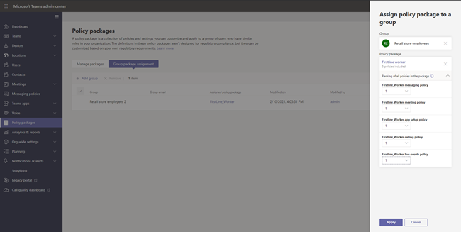

# <a name="assign-policies-to-your-users-in-microsoft-teams"></a>Microsoft Teams에서 사용자에게 정책 할당

관리자는 정책을 사용하여 조직의 사용자가 사용할 수 있는 Teams 기능을 제어합니다. 예를 들어 몇 가지 이름을 지정하는 호출 정책, 모임 정책 및 메시징 정책이 있습니다.

조직에는 고유한 요구 사항을 가지는 다양한 유형의 사용자가 있습니다. 만들고 할당하는 사용자 지정 정책을 사용하면 이러한 요구에 따라 다양한 사용자 집합에 정책 설정을 조정할 수 있습니다.

조직의 정책을 쉽게 관리하기 위해 Teams는 사용자에게 정책을 할당하는 여러 가지 방법을 제공합니다. 일괄 처리 할당을 통해 개별적으로 또는 규모에 따라 사용자에게 직접 정책을 할당하거나 사용자가 구성원인 그룹에 할당합니다. 정책 패키지를 사용하여 유사한 역할이 있는 조직의 사용자에게 미리 설정한 정책 컬렉션을 할당할 수도 있습니다. 선택하는 옵션은 관리하는 정책의 수와 정책을 할당하는 사용자 수에 따라 달라 습니다. 전역(조직 전체 기본값) 정책은 조직의 가장 많은 사용자 수에 적용됩니다. 특수한 정책이 필요한 사용자에게만 정책을 할당해야 합니다.

이 문서에서는 사용자에게 정책을 할당할 수 있는 다양한 방법과 이를 사용할 때 권장되는 시나리오에 대해 설명합니다.

## <a name="which-policy-takes-precedence"></a>우선 순위는 어떤 정책인가요?

사용자에게는 각 정책 유형에 대해 하나의 효과적인 정책이 있습니다. 사용자가 정책을 직접 할당하고 동일한 유형의 정책을 할당한 하나 이상의 그룹의 구성원일 수도 있습니다. 이러한 종류의 시나리오에서 어떤 정책이 우선인가요? 사용자의 유효 정책은 다음과 같이 우선 순위 규칙에 따라 결정됩니다.

사용자가 정책(개별적으로 또는 일괄 처리 할당을 통해)을 직접 할당하는 경우 해당 정책이 우선합니다. 다음 시각적 예제에서 사용자의 효과적인 정책은 사용자에게 직접 할당되는 Lincoln Square 모임 정책입니다.


사용자가 지정된 유형의 정책을 직접 할당하지 않은 경우 사용자가 구성원인 그룹에 할당된 정책이 우선합니다. 사용자가 여러 그룹의 구성원인 경우 해당 정책 유형에 대해 그룹 할당 순위가 가장 높은 정책이 우선합니다. [](#group-assignment-ranking)

이 시각적 예제에서 사용자의 효과적인 정책은 Exec Teams 및 HD 정책으로, 이 정책은 사용자가 구성원으로 있는 다른 그룹에 비해 가장 높은 할당 순위를 가지며 동일한 정책 유형의 정책도 할당됩니다.  


사용자가 정책을 직접 할당하지 않은 경우 또는 정책이 할당된 그룹의 구성원이 아닌 경우 사용자는 해당 정책 유형에 대한 전역(Org-wide default) 정책을 얻습니다. 다음은 시각적 예제입니다.


자세한 내용은 우선 순위 [규칙을 참조합니다.](#precedence-rules)

## <a name="ways-to-assign-policies"></a>정책을 할당하는 방법

사용자에게 정책을 할당할 수 있는 방법과 각 시나리오에 대해 권장되는 시나리오에 대한 개요는 다음과 같습니다. 자세한 내용은 링크를 선택합니다.

개별 사용자 또는 그룹에 정책을 할당하기 전에 먼저 조직에서 가장 많은 사용자 수에 적용할 수 있도록 전역(조직 전체 [기본값)](#set-the-global-policies) 정책을 설정해야 합니다.  전역 정책을 설정하면 특수한 정책이 필요한 사용자에게만 정책을 할당해야 합니다.

|방법  |경우...  | 사용 중...
|---------|---------|----|
|[개별 사용자에게 정책 할당](#assign-a-policy-to-individual-users)    | Teams를 새로 시작하거나 소수의 사용자에게 정책 하나 또는 몇 개만 할당하면 됩니다. |Teams PowerShell 모듈의 Microsoft Teams 관리 센터 또는 PowerShell cmdlet
|[그룹에 정책 할당](#assign-a-policy-to-a-group) |사용자의 그룹 구성원 자격에 따라 정책을 할당합니다. 예를 들어 보안 그룹 또는 메일 그룹의 모든 사용자에게 정책을 할당합니다.| Teams PowerShell 모듈의 Microsoft Teams 관리 센터 또는 PowerShell cmdlet|
|[사용자 일괄 처리에 정책 할당](#assign-a-policy-to-a-batch-of-users)   | 대규모 사용자 집합에 정책을 할당합니다. 예를 들어 조직에서 수백 또는 수천 명의 사용자에게 정책을 할당합니다. |Teams PowerShell 모듈의 Microsoft Teams 관리 센터 또는 PowerShell cmdlet|
| [사용자에게 정책 패키지 할당](#assign-a-policy-package-to-users)  |동일한 역할 또는 유사한 역할이 있는 조직의 특정 사용자 집합에 여러 정책을 할당합니다. 예를 들어 학교의 교사에게 교육(교사) 정책 패키지를 할당하여 채팅, 통화 및 모임에 대한 모든 액세스 권한을 부여합니다. 중등 학생에게 교육(중등 학생) 정책 패키지를 할당하여 개인 통화와 같은 특정 기능을 제한합니다.  |Teams PowerShell 모듈의 Microsoft Teams 관리 센터 또는 PowerShell cmdlet|
| [그룹에 정책 패키지](#assign-a-policy-package-to-a-group) 할당(비공개 미리 보기에서)   |동일한 역할 또는 유사한 역할이 있는 조직의 사용자 그룹에 여러 정책을 할당합니다. 예를 들어 보안 그룹 또는 메일 그룹의 모든 사용자에게 정책 패키지를 할당합니다. |Teams PowerShell 모듈의 Microsoft Teams 관리 센터(곧) 또는 PowerShell cmdlet|
| [사용자 일괄 처리에 정책 패키지 할당](#assign-a-policy-package-to-a-batch-of-users)|동일한 역할 또는 유사한 역할이 있는 조직의 사용자 일괄 처리에 여러 정책을 할당합니다. 예를 들어 일괄 처리 과제를 사용하여 학교의 모든 교사에게 교육(교사) 정책 패키지를 할당하여 채팅, 통화 및 모임에 대한 모든 액세스 권한을 부여합니다. 사설 통화와 같은 특정 기능을 제한하기 위해 중등 학생 일괄 처리에 교육(중등 학생) 정책 패키지를 할당합니다.|Teams PowerShell 모듈의 PowerShell cmdlet|

## <a name="set-the-global-policies"></a>전역 정책 설정

다음 단계를 수행하여 각 정책 유형에 대해 전역(Org-wide default) 정책을 설정합니다.

### <a name="using-the-microsoft-teams-admin-center"></a>Microsoft Teams 관리 센터 사용

1. Microsoft Teams 관리 센터의 왼쪽 탐색에서 업데이트할 정책 유형에 대한 정책 페이지로 이동합니다. 예를 들어 **Teams**  >  **Teams 정책,** **모임** 모임  >  정책, 메시징 **정책** 또는 **음성** 통화 정책이  >  **있습니다.**
2. **전역(Org-wide 기본값)** 정책을 선택하여 현재 설정을 확인합니다.
3. 필요한 경우 정책을 업데이트한 다음 적용을 **선택합니다.**

### <a name="using-powershell"></a>PowerShell 사용

PowerShell을 사용하여 전역 정책을 설정하기 위해 전역 식별자를 사용 합니다.  먼저 현재 전역 정책을 검토하여 변경할 설정을 파악합니다.

```powershell
Get-CsTeamsMessagingPolicy -Identity Global
 
Identity                      : Global
Description                   :
AllowUrlPreviews              : True
AllowOwnerDeleteMessage       : False
AllowUserEditMessage          : True
AllowUserDeleteMessage        : True
AllowUserChat                 : True
AllowRemoveUser               : True
AllowGiphy                    : True
GiphyRatingType               : Moderate
AllowMemes                    : True
AllowImmersiveReader          : True
AllowStickers                 : True
AllowUserTranslation          : False
ReadReceiptsEnabledType       : UserPreference
AllowPriorityMessages         : True
ChannelsInChatListEnabledType : DisabledUserOverride
AudioMessageEnabledType       : ChatsAndChannels
Expand (20 lines) Collapse 
```

다음으로, 필요한 경우 전역 정책을 업데이트합니다.  변경할 설정의 값만 지정하면 됩니다.

```powershell
Set-CsTeamsMessagingPolicy -Identity Global -AllowUserEditMessage $false
```

## <a name="assign-a-policy-to-individual-users"></a>개별 사용자에게 정책 할당

다음 단계에 따라 개별 사용자 또는 소수의 사용자에게 정책을 할당합니다.

### <a name="use-the-microsoft-teams-admin-center"></a>Microsoft Teams 관리 센터 사용

사용자에게 정책을 할당하는 경우:

1. Microsoft Teams 관리 센터의 왼쪽 탐색에서 **사용자로** 이동한 다음 사용자를 선택합니다.
2. 사용자 이름의 왼쪽을 클릭하여 사용자를 선택한 다음 설정 편집 **을 선택합니다.**
3. 할당할 정책을 선택한 다음 적용을 **선택합니다.**

또는 다음을 할 수도 있습니다.

1. Microsoft Teams 관리 센터의 왼쪽 탐색에서 정책 페이지로 이동합니다.
2. 정책 이름의 왼쪽을 클릭하여 할당할 정책을 선택합니다.
3. **사용자 관리** 를 선택합니다.
4. **사용자 관리** 창에서 표시 이름 또는 사용자 이름으로 사용자를 검색하고 이름을 선택한 다음, **추가** 를 선택하세요. 추가할 각 사용자에 대해 이 단계를 반복합니다.
5. 사용자 추가가 완료되면 적용 을 **선택합니다.**

### <a name="use-powershell"></a>PowerShell 사용

각 정책 유형에는 관리하기 위한 자체 cmdlet 집합이 있습니다. 특정 정책 유형에 ```Grant-``` 대한 cmdlet을 사용하여 정책을 할당합니다. 예를 들어 cmdlet을 사용하여 사용자에게 Teams 모임 정책을 ```Grant-CsTeamsMeetingPolicy``` 할당합니다. 이러한 cmdlet은 Teams PowerShell 모듈에 포함되어 있으며 [비즈니스용 Skype cmdlet](https://docs.microsoft.com/powershell/skype/intro?view=skype-ps)참조에 설명되어 있습니다.

 [Teams PowerShell](https://www.powershellgallery.com/packages/MicrosoftTeams/) 공개 릴리스(아직 없는 경우)를 다운로드하여 설치한 다음 다음을 실행하여 연결합니다.

> [!NOTE]
> 비즈니스용 Skype Online 커넥터는 현재 최신 Teams PowerShell 모듈의 일부입니다.
>
> 최신 [Teams PowerShell](https://www.powershellgallery.com/packages/MicrosoftTeams/)공개 릴리스를 사용하는 경우 비즈니스용 Skype Online 커넥터를 설치할 필요가 없습니다.

```powershell
  # When using Teams PowerShell Module

   Import-Module MicrosoftTeams
   $credential = Get-Credential
   Connect-MicrosoftTeams -Credential $credential
```

이 예제에서는 학생 모임 정책이라는 Teams 모임 정책을 Reda라는 사용자에게 할당합니다.

```powershell
Grant-CsTeamsMeetingPolicy -Identity reda@contoso.com -PolicyName "Student Meeting Policy"
```

자세한 내용은 [PowerShell을 통해 정책 관리 를 읽어보아야 합니다.](teams-powershell-managing-teams.md#manage-policies-via-powershell)

## <a name="assign-a-policy-to-a-group"></a>그룹에 정책 할당

그룹에 정책 할당을 사용하면 보안 그룹 또는 메일 그룹과 같은 사용자 그룹에 정책을 할당할 수 있습니다. 정책 할당은 선행 규칙에 따라 그룹의 구성원에게 전파됩니다. 그룹에서 구성원이 추가되거나 제거되면 상속된 정책 할당이 그에 따라 업데이트됩니다.

그룹에 대한 정책 할당은 최대 50,000명까지의 그룹에 권장되지만 더 큰 그룹에서도 사용할 수 있습니다.

정책을 할당하면 그룹에 즉시 할당됩니다. 그러나 그룹의 구성원에게 정책 할당의 전파는 백그라운드 작업으로 수행됩니다. 그룹 크기에 따라 다소 시간이 걸릴 수 있습니다. 그룹에서 정책이 부가되지 않은 경우나 구성원이 그룹에 추가되거나 그룹에서 제거될 때도 마찬가지입니다.

그룹 정책 할당은 그룹의 직접 구성원인 사용자에게만 전파됩니다. 할당은 중첩된 그룹의 구성원에게 전파되지 않습니다.

### <a name="what-you-need-to-know-about-policy-assignment-to-groups"></a>그룹에 정책 할당에 대해 알아야 할 정보

시작하기 전에 우선 순위 규칙 및 그룹 할당 순위를 이해하는 것이 중요합니다.

#### <a name="precedence-rules"></a>우선 순위 규칙

주어진 정책 형식의 경우 사용자의 유효 정책은 다음에 따라 결정됩니다.

- 사용자에게 직접 할당되는 정책은 그룹에 할당된 동일한 유형의 다른 정책보다 우선합니다. 즉, 사용자가 지정된 형식의 정책을 직접 할당하는 경우 해당 사용자는 그룹에서 동일한 형식의 정책을 상속하지 않습니다. 즉, 사용자에게 직접 할당된 지정된 형식의 정책이 있는 경우 그룹에서 동일한 형식의 정책을 상속하려면 먼저 사용자로부터 해당 정책을 제거해야 합니다.
- 사용자에게 직접 할당된 정책이 없고 두 개 이상의 그룹의 구성원이고 각 그룹에 할당된 동일한 유형의 정책이 있는 경우 사용자는 가장 높은 순위를 가지는 그룹 할당의 정책을 상속합니다.
- 사용자가 정책이 할당된 그룹의 구성원이 아닌 경우 해당 정책 유형에 대한 전역(Org-wide default) 정책이 사용자에게 적용됩니다.

사용자의 유효 정책은 다음 규칙에 따라 업데이트됩니다.

- 사용자가 정책에 할당된 그룹에 추가되거나 제거될 때
- 그룹에서 정책이 부가되지 않습니다.
- 사용자에게 직접 할당된 정책이 제거됩니다.

#### <a name="group-assignment-ranking"></a>그룹 할당 순위

그룹에 정책을 할당할 때 그룹 할당에 대한 순위를 지정합니다. 이 정책은 사용자가 두 개 이상의 그룹의 구성원이고 각 그룹에 동일한 유형의 정책이 할당된 경우 사용자가 효과적인 정책으로 상속해야 하는 정책을 결정하는 데 사용됩니다.

그룹 할당 순위는 동일한 유형의 다른 그룹 할당과 상대적입니다. 예를 들어 두 그룹에 호출 정책을 할당하는 경우 한 할당의 순위를 1로, 다른 할당은 2로, 1은 가장 높은 순위로 설정합니다. 그룹 할당 순위는 상속과 관련하여 다른 그룹 멤버 자격보다 더 중요하거나 관련성이 높은 그룹 멤버 자격을 나타냅니다.

예를 들어 직원 저장소 및 스토어 관리자의 두 그룹이 있습니다. 두 그룹에는 각각 Teams 호출 정책, 스토어 직원 호출 정책 및 저장소 관리자 호출 정책이 할당됩니다. 두 그룹에 있는 저장소 관리자의 경우 관리자 역할은 직원 역할보다 관련성이 높기 때문에 Store Managers 그룹에 할당된 호출 정책은 순위가 높아야 합니다.

|그룹 |정책 이름을 호출하는 팀  |순위|
|---------|---------|---|
|Store Managers   |스토어 관리자 호출 정책         |1|
|직원 저장    |직원 호출 정책 저장      |2|

순위를 지정하지 않으면 정책 할당에 가장 낮은 순위가 지정됩니다.

### <a name="in-the-teams-admin-center"></a>Teams 관리 센터에서

> [!NOTE]
> 현재 Microsoft Teams 관리 센터를 사용하는 그룹에 대한 정책 할당은 Teams 호출 정책, Teams 호출 공원 정책, Teams 정책, Teams 라이브 이벤트 정책, Teams 모임 정책 및 Teams 메시징 정책에만 사용할 수 있습니다. 다른 정책 형식의 경우 PowerShell을 사용 합니다.

1. Microsoft Teams 관리 센터의 왼쪽 탐색에서 정책 유형 페이지로 이동합니다. 예를 들어 모임 모임 정책  >  **으로 이동합니다.**
2. 그룹 정책 **할당 탭을** 선택합니다.
3. 그룹 **추가를 선택한** 다음  그룹화 정책 할당 창에서 다음을 선택합니다.
    1. 정책을 할당할 그룹을 검색하고 추가합니다.
    2. 그룹 할당의 순위를 설정합니다.
    3. 할당할 정책을 선택합니다.
    4. 적용 **을 선택합니다.**

그룹 정책 할당을 제거하려면  정책 페이지의 그룹 정책 할당 탭에서 그룹 할당을 선택한 다음 **제거를 선택합니다.**

그룹 할당의 순위를 변경하려면 먼저 그룹 정책 할당을 제거해야 합니다. 그런 다음 위의 단계를 수행하여 그룹에 정책을 할당합니다.

### <a name="use-the-powershell-option"></a>PowerShell 옵션 사용

> [!NOTE]
> 현재 PowerShell을 사용하는 그룹에 대한 정책 할당은 모든 Teams 정책 유형에서 사용할 수 없습니다. 지원되는 정책 유형 목록에 대한 [New-CsGroupPolicyAssignment를](https://docs.microsoft.com/powershell/module/teams/new-csgrouppolicyassignment) 참조하세요.

#### <a name="install-and-connect-to-the-microsoft-teams-powershell-module"></a>Microsoft Teams PowerShell 모듈 설치 및 연결

단계별 지침은 [Teams PowerShell 설치를 참조하세요.](teams-powershell-install.md)

#### <a name="assign-a-policy-to-a-group-of-users"></a>사용자 그룹에 정책 할당

[New-CsGroupPolicyAssignment](https://docs.microsoft.com/powershell/module/teams/new-csgrouppolicyassignment) cmdlet을 사용하여 그룹에 정책을 할당합니다. 개체 ID, SIP 주소 또는 전자 메일 주소를 사용하여 그룹을 지정할 수 있습니다.

이 예제에서는 할당 순위가 1인 그룹에 Retail Managers 모임 정책이라는 Teams 모임 정책을 할당합니다.

```powershell
New-CsGroupPolicyAssignment -GroupId d8ebfa45-0f28-4d2d-9bcc-b158a49e2d17 -PolicyType TeamsMeetingPolicy -PolicyName "Retail Managers Meeting Policy" -Rank 1
```

#### <a name="get-policy-assignments-for-a-group"></a>그룹에 대한 정책 할당을 얻습니다.

[Get-CsGroupPolicyAssignment](https://docs.microsoft.com/powershell/module/teams/get-csgrouppolicyassignment) cmdlet을 사용하여 그룹에 할당된 모든 정책을 얻습니다. 그룹은 정책을 할당하는 데 SIP 주소 또는 전자 메일 주소를 사용하는 경우에도 항상 그룹 ID로 나열됩니다.

이 예제에서는 특정 그룹에 할당된 모든 정책을 검색합니다.

```powershell
Get-CsGroupPolicyAssignment -GroupId e050ce51-54bc-45b7-b3e6-c00343d31274
```

이 예제에서는 Teams 모임 정책이 할당된 모든 그룹을 반환합니다.

```powershell
Get-CsGroupPolicyAssignment -PolicyType TeamsMeetingPolicy
```

#### <a name="remove-a-policy-from-a-group"></a>그룹에서 정책 제거

[Remove-CsGroupPolicyAssignment](https://docs.microsoft.com/powershell/module/teams/remove-csgrouppolicyassignment) cmdlet을 사용하여 그룹에서 정책을 제거합니다. 그룹에서 정책을 제거하면 해당 그룹에 할당된 동일한 유형의 다른 정책의 우선 순위가 업데이트됩니다. 예를 들어 순위가 2인 정책을 제거하면 순위가 3과 4인 정책이 업데이트되어 새 순위가 반영됩니다. 다음 두 표에는 이 예제가 표시됩니다.

다음은 Teams 모임 정책에 대한 정책 할당 및 우선 순위 목록입니다.

|그룹 이름  |정책 이름  |순위|
|---------|---------|---------|
|영업    |판매 정책       | 1        |
|서부 지역     |서부 지역 정책         |2         |
|디비전    |분할 정책         |3         |
|자회사   |자회사 정책        |4         |

서부 지역 그룹에서 서부 지역 정책을 제거하는 경우 정책 할당 및 우선 순위는 다음과 같이 업데이트됩니다.

|그룹 이름  |정책 이름  |순위|
|---------|---------|---------|
|영업    |판매 정책       | 1        |
|디비전    |분할 정책         |2         |
|자회사   |자회사 정책        |3        |

이 예제에서는 그룹에서 Teams 모임 정책을 제거합니다.

```powershell
Remove-CsGroupPolicyAssignment -PolicyType TeamsMeetingPolicy -GroupId f985e013-0826-40bb-8c94-e5f367076044
```

#### <a name="change-a-policy-assignment-for-a-group"></a>그룹에 대한 정책 할당 변경

> [!NOTE]
> [Set-CsGroupPolicyAssignment](https://docs.microsoft.com/powershell/module/teams/set-csgrouppolicyassignment) cmdlet을 곧 사용할 수 있습니다. 그 동안 그룹 정책 할당을 변경하려면 그룹에서 현재 정책 할당을 제거한 다음 새 정책 할당을 추가할 수 있습니다.

그룹에 정책을 할당한 후 [Set-CsGroupPolicyAssignment](https://docs.microsoft.com/powershell/module/teams/set-csgrouppolicyassignment) cmdlet을 사용하여 해당 그룹의 정책 할당을 다음과 같이 변경할 수 있습니다.

- 순위 변경
- 주어진 정책 형식의 정책 변경
- 주어진 정책 유형 및 순위의 정책 변경

이 예제에서는 그룹의 Teams 호출 공원 정책을 SupportCallPark라는 정책으로 변경하고 할당 순위를 3으로 변경합니다.

```powershell
Set-CsGroupPolicyAssignment -GroupId 566b8d39-5c5c-4aaa-bc07-4f36278a1b38 -PolicyType TeamsMeetingPolicy -PolicyName SupportCallPark -Rank 3
```

#### <a name="change-the-effective-policy-for-a-user"></a>사용자에 대한 유효 정책 변경

정책에 직접 할당된 사용자에 대한 효과적인 정책을 변경하는 방법에 대한 예제는 다음과 같습니다.

먼저 [Get-CsUserPolicyAssignment](https://docs.microsoft.com/powershell/module/teams/get-csuserpolicyassignment) cmdlet과 매개 변수를 함께 사용하여 사용자와 연결된 Teams 모임 브로드캐스트 정책에 대한 세부 정보를 ```PolicySource``` 얻습니다.

```powershell
Get-CsUserPolicyAssignment -Identity daniel@contoso.com -PolicyType TeamsMeetingBroadcastPolicy | select -ExpandProperty PolicySource
```

출력은 사용자가 사용자가 속한 그룹에 할당된 공급업체 라이브 이벤트라는 정책보다 우선하는 Employee Events라는 Teams 모임 브로드캐스트 정책을 직접 할당했다는 것입니다.

```console
AssignmentType PolicyName         Reference
-------------- ----------         ---------
Direct         Employee Events
Group          Vendor Live Events 566b8d39-5c5c-4aaa-bc07-4f36278a1b38
```

이제 사용자에서 Employee Events 정책을 제거합니다. 즉, 사용자에게 더 이상 Teams 모임 브로드캐스트 정책이 직접 할당되지 않고 사용자가 속한 그룹에 할당된 공급업체 라이브 이벤트 정책을 상속합니다.

이 작업을 위해 비즈니스용 Skype PowerShell 모듈에서 다음 cmdlet을 사용합니다.

```powershell
Grant-CsTeamsMeetingBroadcastPolicy -Identity daniel@contoso.com -PolicyName $null
```

Teams PowerShell 모듈에서 다음 cmdlet을 사용하여 일괄 처리 정책 할당이 $users 사용자 목록인 대규모로 이 작업을 수행하세요.

```powershell
New-CsBatchPolicyAssignmentOperation -OperationName "Assigning null at bulk" -PolicyType TeamsMeetingBroadcastPolicy -PolicyName $null -Identity $users  
```

## <a name="assign-a-policy-to-a-batch-of-users"></a>사용자 일괄 처리에 정책 할당

### <a name="use-the-admin-center"></a>관리 센터 사용

사용자에게 정책을 대량으로 할당하는 경우:

1. Microsoft Teams 관리 센터의 왼쪽 탐색에서 사용자를 **선택합니다.**
2. 정책을 할당할 사용자를 검색하거나 보기를 필터링하여 원하는 사용자를 표시합니다.
3. **&#x2713;**(확인 표시) 열에서 사용자를 선택합니다. 모든 사용자를 선택하려면 표 맨 위에서 &#x2713;(확인 표시)를 클릭합니다.
4. 설정 **편집을 선택하고** 원하는 내용을 변경한 다음 적용을 **선택합니다.**

정책 할당의 상태를 확인하려면 적용을 선택한 후 사용자 페이지  맨 위에  나타나는 배너에서 활동 **로그를 선택합니다.** 또는 Microsoft Teams 관리 센터의 왼쪽 탐색에서 대시보드로 이동한 다음 활동 로그에서 **세부** 정보 **보기를 선택합니다.** 활동 로그는 지난 30일 동안 Microsoft Teams 관리 센터를 통해 20명 이상의 사용자 일괄 처리에 대한 정책 할당을 보여줍니다. 자세한 내용은 활동 로그에서 정책 할당 [보기를 참조합니다.](activity-log.md)

### <a name="use-powershell-method"></a>PowerShell 메서드 사용

> [!NOTE]
> 현재 PowerShell을 사용하는 일괄 처리 정책 할당은 모든 Teams 정책 유형에서 사용할 수 없습니다. 지원되는 정책 유형 목록은 [New-CsBatchPolicyAssignmentOperation을](https://docs.microsoft.com/powershell/module/teams/new-csbatchpolicyassignmentoperation) 참조하세요.

일괄 처리 정책 할당을 사용하면 스크립트를 사용하지 않고도 동시에 대규모 사용자 집합에 정책을 할당할 수 있습니다. [New-CsBatchPolicyAssignmentOperation](https://docs.microsoft.com/powershell/module/teams/new-csbatchpolicyassignmentoperation) cmdlet을 사용하여 사용자 일괄 처리 및 할당하려는 정책을 제출합니다. 할당은 백그라운드 작업으로 처리되고 각 배치에 작업 ID가 생성됩니다. 그런 다음 [Get-CsBatchPolicyAssignmentOperation](https://docs.microsoft.com/powershell/module/teams/get-csbatchpolicyassignmentoperation) cmdlet을 사용하여 일괄 처리에서 과제의 진행률 및 상태를 추적할 수 있습니다.

개체 ID 또는 SIP(세션 시작 프로토콜) 주소로 사용자를 지정합니다. 사용자의 SIP 주소는 종종 UPN(사용자 주체 이름) 또는 전자 메일 주소와 동일한 값을 지만 필수는 아닙니다. 사용자가 UPN 또는 전자 메일을 사용하여 지정되지만 해당 SIP 주소와 다른 값이 있는 경우 사용자에게 정책 할당이 실패합니다. 일괄 처리에 중복 사용자가 포함된 경우 처리 전에 일괄 처리에서 중복된 사용자가 제거되고 일괄 처리에 남아 있는 고유 사용자에게만 상태가 제공됩니다.

배치에는 최대 5천 명의 사용자가 포함될 수 있습니다. 최상의 결과를 얻기 위해 한 번에 몇 개 이상의 일괄 처리를 제출하지 않습니다. 더 많은 일괄 처리를 제출하기 전에 일괄 처리가 완료될 수 있도록 허용합니다.

#### <a name="install-and-connect-to-the-teams-powershell-module"></a>Teams PowerShell 모듈 설치 및 연결

다음을 실행하여 [Microsoft Teams PowerShell 모듈을 설치합니다.](https://www.powershellgallery.com/packages/MicrosoftTeams) 버전 1.0.5 이상을 설치해야 합니다.

```powershell
Install-Module -Name MicrosoftTeams
```

다음을 실행하여 Teams에 연결하고 세션을 시작합니다.

```powershell
Connect-MicrosoftTeams
```

메시지가 표시될 때 관리자 자격 증명을 사용하여 로그인합니다.

#### <a name="install-and-connect-to-the-azure-ad-powershell-for-graph-module-optional"></a>Azure AD PowerShell for Graph 모듈 설치 및 연결(선택 사항)

또한 Azure [AD PowerShell for Graph](https://docs.microsoft.com/powershell/azure/active-directory/install-adv2) 모듈(아직 없는 경우)을 다운로드하여 설치하고 조직의 사용자 목록을 검색할 수 있도록 Azure AD에 연결할 수도 있습니다.

다음을 실행하여 Azure AD에 연결합니다.

```powershell
Connect-AzureAD
```

메시지가 표시될 때 Teams에 연결하는 데 사용한 동일한 관리자 자격 증명을 사용하여 로그인합니다.

#### <a name="assign-a-setup-policy-to-a-batch-of-users"></a>사용자 일괄 처리에 설정 정책 할당

이 예제에서는 [New-CsBatchPolicyAssignmentOperation](https://docs.microsoft.com/powershell/module/teams/new-csbatchpolicyassignmentoperation) cmdlet을 사용하여 Users_ids.text 파일에 나열된 사용자 일괄 처리에 HR 앱 설정 정책이라는 앱 설치 정책을 할당합니다.

```powershell
$user_ids = Get-Content .\users_ids.txt
New-CsBatchPolicyAssignmentOperation -PolicyType TeamsAppSetupPolicy -PolicyName "HR App Setup Policy" -Identity $users_ids -OperationName "Example 1 batch"
```

이 예제에서는 Azure AD에 연결하여 사용자 컬렉션을 검색한 다음, SIP 주소를 사용하여 지정된 사용자 일괄 처리에 새 고용 메시징 정책이라는 메시징 정책을 할당합니다.

```powershell
Connect-AzureAD
$users = Get-AzureADUser
New-CsBatchPolicyAssignmentOperation -PolicyType TeamsMessagingPolicy -PolicyName "New Hire Messaging Policy" -Identity $users.SipProxyAddress -OperationName "Example 2 batch"
```

#### <a name="get-the-status-of-a-batch-assignment"></a>일괄 처리 할당의 상태 확인

다음을 실행하여 일괄 처리 할당의 상태를 얻습니다. 여기서 OperationId는 주어진 일괄 처리에 대해 cmdlet에서 반환되는 작업 ```New-CsBatchPolicyAssignmentOperation``` ID입니다.

```powershell
$Get-CsBatchPolicyAssignmentOperation -OperationId f985e013-0826-40bb-8c94-e5f367076044 | fl
```

출력에서 오류가 발생한 것으로 표시되는 경우 다음을 실행하여 속성에 있는 오류에 대한 자세한 정보를 ```UserState``` 얻습니다.

```powershell
Get-CsBatchPolicyAssignmentOperation -OperationId f985e013-0826-40bb-8c94-e5f367076044 | Select -ExpandProperty UserState
```

자세한 내용은 [Get-CsBatchPolicyAssignmentOperation 을 참조합니다.](https://docs.microsoft.com/powershell/module/teams/get-csbatchpolicyassignmentoperation)

## <a name="assign-a-policy-package-to-users"></a>사용자에게 정책 패키지 할당

Teams의 정책 패키지는 조직의 역할이 동일하거나 유사한 사용자에게 할당할 수 있는 미리 정의된 정책 및 정책 설정의 컬렉션입니다. 각 정책 패키지는 사용자 역할을 중심으로 설계하며 해당 역할에 대한 일반적인 활동을 지원하는 미리 정의된 정책 및 정책 설정을 포함합니다. 정책 패키지의 몇 가지 예로는 교육(교사) 패키지 및 Healthcare(임상 작업자) 패키지가 있습니다. 자세한 내용은 Teams에서 정책 [패키지 관리를 참조합니다.](manage-policy-packages.md)

### <a name="assign-a-policy-package-to-one-user"></a>한 사용자에게 정책 패키지 할당

1. Microsoft Teams 관리 센터의 왼쪽 탐색에서 **사용자로** 이동한 다음 사용자를 선택합니다.
2. 사용자의 페이지에서 정책 **을** 선택한 다음 정책 패키지 옆에 **있는** **편집을 선택합니다.**
3. 정책 **패키지** 할당 창에서 할당할 패키지를 선택한 다음 저장을 **선택합니다.**

### <a name="assign-a-policy-package-to-multiple-users"></a>여러 사용자에게 정책 패키지 할당

1. Microsoft Teams 관리 센터의 왼쪽 탐색에서 정책 패키지로 이동한 다음, 패키지 이름의 왼쪽을 클릭하여 할당할 정책 패키지를 선택합니다.
2. **사용자 관리** 를 선택합니다.
3. **사용자 관리** 창에서 표시 이름 또는 사용자 이름으로 사용자를 검색하고 이름을 선택한 다음, **추가** 를 선택하세요. 추가할 각 사용자에 대해 이 단계를 반복합니다.
4. 사용자 추가가 완료되면 저장 을 **선택합니다.**

## <a name="assign-a-policy-package-to-a-group"></a>그룹에 정책 패키지 할당

그룹에 정책 패키지 할당을 사용하면 보안 그룹이나 배포 목록과 같은 사용자 그룹에 여러 정책을 할당할 수 있습니다. 정책 할당은 선행 규칙에 따라 그룹의 구성원에게 전파됩니다. 그룹에서 구성원이 추가되거나 제거되면 상속된 정책 할당이 그에 따라 업데이트됩니다.

최대 50,000명까지의 그룹에 대해 그룹에 정책 패키지 할당을 할당하는 것이 좋습니다. 하지만 더 큰 그룹에서도 사용할 수 있습니다.

정책 패키지를 할당하면 그룹에 즉시 할당됩니다. 그러나 그룹의 구성원에게 정책 할당의 전파는 백그라운드 작업으로 수행됩니다. 그룹 크기에 따라 다소 시간이 걸릴 수 있습니다. 그룹에서 정책이 부가되지 않은 경우나 구성원이 그룹에 추가되거나 그룹에서 제거될 때도 마찬가지입니다.

> [!IMPORTANT]
> 시작하기 전에 우선 순위 규칙 및 [](#precedence-rules) 그룹 할당 순위를 [이해하는 것이 중요합니다.](#group-assignment-ranking) 이 문서의 앞부분에 있는 그룹에 정책 할당에 대해 알아야 할 개념을 [읽고](#what-you-need-to-know-about-policy-assignment-to-groups) 이해해야 합니다.

### <a name="assign-a-policy-package-to-a-group-of-users-in-the-admin-center"></a>관리 센터의 사용자 그룹에 정책 패키지 할당

1. Teams 관리 센터에 로그인합니다.
2. 왼쪽 탐색에서 정책 패키지 페이지로 이동합니다.
3. 그룹 정책 할당 탭을 선택합니다.
4. 그룹 **추가를 선택한** 다음 정책 패키지 할당에서 그룹 창을 그룹화합니다.

    a. 정책 패키지를 할당할 그룹을 검색하고 추가합니다.

    b. 정책 패키지를 선택합니다.

    c. 각 정책 유형에 대한 순위를 설정합니다.

    d. 적용 **을 선택합니다.**

    

5. 특정 정책 유형에 대한 순위를 관리하기 위해 특정 정책 페이지로 이동합니다.
6. 정책 패키지를 그룹에 다시 할당하려면 먼저 그룹 정책 할당을 제거합니다. 그런 다음 위의 단계를 수행하여 그룹에 정책 패키지를 할당합니다.

### <a name="work-with-powershell"></a>PowerShell 작업

#### <a name="get-the-teams-powershell-module"></a>Teams PowerShell 모듈 사용

단계별 지침은 [Teams PowerShell 설치를 참조하세요.](teams-powershell-install.md)

#### <a name="assign-a-policy-package-to-a-group-of-users"></a>사용자 그룹에 정책 패키지 할당

[Grant-CsGroupPolicyPackageAssignment](https://docs.microsoft.com/powershell/module/teams/grant-csgrouppolicypackageassignment) cmdlet을 사용하여 그룹에 정책 패키지를 할당합니다. 개체 ID, SIP 주소 또는 전자 메일 주소를 사용하여 그룹을 지정할 수 있습니다. 정책 패키지를 할당할 때 [](#group-assignment-ranking) 정책 패키지의 각 정책 유형에 대한 그룹 할당 순위를 지정합니다.

이 예제에서는 TeamsAppSetupPolicy 및 TeamsMeetingBroadcastPolicy에 대한 할당 순위가 1이고 TeamsMeetingPolicy에 대한 2 순위가 있는 그룹에 Education_Teacher 정책 패키지를 할당합니다.

```powershell
Grant-CsGroupPolicyPackageAssignment -GroupId "dae90bb4-120f-4a3e-a15d-30f142e79f69" -PackageName "Education_Teacher" -PolicyRankings "TeamsAppSetupPolicy, 1", "TeamsMeetingBroadcastPolicy, 1", "TeamsMeetingPolicy, 2"
```

## <a name="assign-a-policy-package-to-a-batch-of-users"></a>사용자 일괄 처리에 정책 패키지 할당

일괄 처리 정책 패키지 할당을 사용하면 스크립트를 사용하지 않고도 동시에 대규모 사용자 집합에 정책 패키지를 할당할 수 있습니다. [New-CsBatchPolicyAssignmentOperation](https://docs.microsoft.com/powershell/module/teams/new-csbatchpolicyassignmentoperation) cmdlet을 사용하여 사용자 일괄 처리 및 할당하려는 정책 패키지를 제출합니다. 할당은 백그라운드 작업으로 처리되고 각 배치에 작업 ID가 생성됩니다. 그런 다음 [Get-CsBatchPolicyAssignmentOperation](https://docs.microsoft.com/powershell/module/teams/get-csbatchpolicyassignmentoperation) cmdlet을 사용하여 일괄 처리에서 과제의 진행률 및 상태를 추적할 수 있습니다.

개체 ID 또는 SIP(세션 시작 프로토콜) 주소로 사용자를 지정합니다. 사용자의 SIP 주소는 종종 UPN(사용자 주체 이름) 또는 전자 메일 주소와 동일한 값을 지만 필수는 아닙니다. 사용자가 UPN 또는 전자 메일을 사용하여 지정되지만 해당 SIP 주소와 다른 값이 있는 경우 사용자에게 정책 할당이 실패합니다. 일괄 처리에 중복 사용자가 포함된 경우 처리 전에 일괄 처리에서 중복된 사용자가 제거되고 일괄 처리에 남아 있는 고유 사용자에게만 상태가 제공됩니다.

일괄 처리에는 최대 5,000명이 포함되어 있습니다. 최상의 결과를 얻기 위해 한 번에 몇 개 이상의 일괄 처리를 제출하지 않습니다. 더 많은 일괄 처리를 제출하기 전에 일괄 처리가 완료될 수 있도록 허용합니다.

### <a name="use-the-teams-powershell-module"></a>Teams PowerShell 모듈 사용

다음을 실행하여 [Microsoft Teams PowerShell](https://www.powershellgallery.com/packages/MicrosoftTeams) 모듈을 설치합니다(아직 없는 경우). 버전 1.0.5 이상을 설치해야 합니다.

```powershell
Install-Module -Name MicrosoftTeams
```

다음을 실행하여 Teams에 연결하고 세션을 시작합니다.

```powershell
Connect-MicrosoftTeams
```

메시지가 표시될 때 관리자 자격 증명을 사용하여 로그인합니다.

### <a name="assign-policy-packages-to-a-batch-of-users"></a>사용자 일괄 처리에 정책 패키지 할당

이 예제에서는 [New-CsBatchPolicyAssignmentOperation](https://docs.microsoft.com/powershell/module/teams/new-csbatchpolicyassignmentoperation) cmdlet을 사용하여 사용자 일괄 처리에 Education_PrimaryStudent 정책 패키지를 할당합니다.

```powershell
New-CsBatchPolicyPackageAssignmentOperation -Identity 1bc0b35f-095a-4a37-a24c-c4b6049816ab,user1@econtoso.com,user2@contoso.com -PackageName Education_PrimaryStudent
```

### <a name="see-the-status-of-a-batch-assignment"></a>일괄 처리 할당의 상태 보기

다음을 실행하여 일괄 처리 할당의 상태를 얻습니다. 여기서 OperationId는 주어진 일괄 처리에 대해 cmdlet에서 반환되는 작업 ```New-CsBatchPolicyAssignmentOperation``` ID입니다.

```powershell
$Get-CsBatchPolicyAssignmentOperation -OperationId f985e013-0826-40bb-8c94-e5f367076044 | fl
```

출력에서 오류가 발생한 것으로 표시되는 경우 다음을 실행하여 속성에 있는 오류에 대한 자세한 정보를 ```UserState``` 얻습니다.

```powershell
Get-CsBatchPolicyAssignmentOperation -OperationId f985e013-0826-40bb-8c94-e5f367076044 | Select -ExpandProperty UserState
```

자세한 내용은 [Get-CsBatchPolicyAssignmentOperation 을 참조합니다.](https://docs.microsoft.com/powershell/module/teams/get-csbatchpolicyassignmentoperation)

## <a name="related-topics"></a>관련 항목

[Teams PowerShell 개요](teams-powershell-overview.md)
