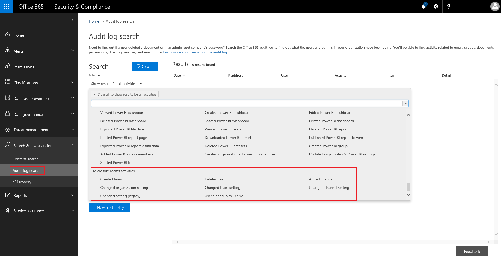

Microsoft 팀에서 이벤트 감사 로그 검색Search the audit log for events in Microsoft Teams
==================================================
> [!IMPORTANT]
> [!INCLUDE [new-teams-sfb-admin-center-notice](includes/new-teams-sfb-admin-center-notice.md)]

감사 로그는 Office 365 서비스에서 특정 작업을 조사 하는 데 도움이 될 수 있습니다.The audit log can help you investigate specific activities across Office 365 services. 팀의 경우 감사 되는 작업은 다음과 같습니다.For Teams, here are some of the activities that are audited:

-   팀 만들기Team creation

-   팀 삭제Team deletion

-   채널 추가 됨Added channel

-   설정 변경 됨Changed setting

Office 365에서 감사 되는 활동의 전체 목록을 보려면 [office 365 보안 & 준수 센터에서 감사 로그 검색](https://support.office.com/article/0d4d0f35-390b-4518-800e-0c7ec95e946c)을 읽어보십시오.To see the complete list of activities that are audited in Office 365, read [Search the audit log in the Office 365 Security & Compliance Center](https://support.office.com/article/0d4d0f35-390b-4518-800e-0c7ec95e946c).

## 팀에서 감사 설정Turn on auditing in Teams

감사 데이터를 보려면 먼저 **보안 & 준수 센터**()https://protection.office.com)에서 감사를 설정 해야 합니다.Before you can look at audit data, you have to first turn on auditing in the **Security & Compliance Center**(https://protection.office.com). 감사를 설정 하려면 [Office 365 감사 로그 검색 설정 또는 해제](https://support.office.com/article/Turn-Office-365-audit-log-search-on-or-off-e893b19a-660c-41f2-9074-d3631c95a014)를 참조 하세요.For help turning on auditing, read [Turn Office 365 audit log search on or off](https://support.office.com/article/Turn-Office-365-audit-log-search-on-or-off-e893b19a-660c-41f2-9074-d3631c95a014).

> [!IMPORTANT]
> 감사 데이터는 감사를 설정한 지점 에서만 사용할 수 있습니다.Audit data is only available from the point at which you turned on Auditing.

## 감사 로그에서 팀 데이터 검색Retrieve Teams data from the audit log

1.  감사 로그를 검색 하려면 [보안 & 준수 센터로](https://go.microsoft.com/fwlink/?linkid=855775)이동 합니다.To retrieve audit logs, go to the [Security & Compliance Center](https://go.microsoft.com/fwlink/?linkid=855775). **검색 & 조사**에서 **감사 로그 검색**을 선택 합니다. Under **Search & Investigation**, select **Audit log search**.

2.  **검색** 을 사용 하 여 감사 하려는 활동, 날짜 및 사용자를 기준으로 필터링 합니다.Use **Search** to filter by the activities, dates, and users you want to audit.

3.  추가 분석을 위해 결과를 Excel로 내보냅니다.Export your results to Excel for further analysis.

> [!IMPORTANT]
> 감사 데이터는 감사가 설정 된 경우 감사 로그에만 표시 됩니다.Audit data is only visible in the Audit Log if auditing is turned on.

## 비디오: TechTip: 팀에서 감사 로그 검색 사용Video: TechTip: Using Audit Log Search in Teams

Office 365 보안 & 준수 센터에서 팀에 대 한 감사 로그 검색을 수행 하는 방법을 보여 주는 팀을 위한 프로그램 관리자 인 a Ansuman에 참가 합니다.Join Ansuman Acharya, a program manager for Teams, as he demonstrates conducting an Audit Log search for Teams in the Office 365 Security & Compliance Center. 

> [!VIDEO https://www.youtube.com/embed/UBxaRySAxyE]

