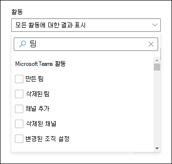

# Microsoft 팀에서 이벤트 감사 로그 검색Search the audit log for events in Microsoft Teams

> [!IMPORTANT]
> [!INCLUDE [new-teams-sfb-admin-center-notice](includes/new-teams-sfb-admin-center-notice.md)]

감사 로그는 Microsoft 365 서비스에서 특정 작업을 조사 하는 데 도움이 될 수 있습니다.The audit log can help you investigate specific activities across Microsoft 365 services. Microsoft 팀의 경우 감사 되는 작업은 다음과 같습니다.For Microsoft Teams, here are some of the activities that are audited:

- 팀 만들기Team creation
- 팀 삭제Team deletion
- 채널 추가 됨Added channel
- 설정 변경 됨Changed setting

감사 되는 팀 활동의 전체 목록은 [팀 활동](#teams-activities)을 참조 하세요.For a complete list of Teams activities that are audited, see [Teams activities](#teams-activities).

> [!NOTE]
> 개인 채널의 감사 이벤트도 팀 및 표준 채널의 경우에도 기록 됩니다.Audit events from private channels are also logged as they are for teams and standard channels.

## 팀에서 감사 설정Turn on auditing in Teams

감사 데이터를 보려면 먼저 [보안 & 준수 센터](https://protection.office.com)에서 감사를 설정 해야 합니다.Before you can look at audit data, you have to first turn on auditing in the [Security & Compliance Center](https://protection.office.com). 감사 설정에 대 한 도움말은 [감사 로그 검색 설정 또는 해제](https://support.office.com/article/Turn-Office-365-audit-log-search-on-or-off-e893b19a-660c-41f2-9074-d3631c95a014)를 참조 하세요.For help turning on auditing, read [Turn audit log search on or off](https://support.office.com/article/Turn-Office-365-audit-log-search-on-or-off-e893b19a-660c-41f2-9074-d3631c95a014).

> [!IMPORTANT]
> 감사 데이터는 감사를 설정한 지점 에서만 사용할 수 있습니다.Audit data is only available from the point at which you turned on auditing.

## 감사 로그에서 팀 데이터 검색Retrieve Teams data from the audit log

1. 감사 로그를 검색 하려면 [보안 & 준수 센터로](https://go.microsoft.com/fwlink/?linkid=855775)이동 합니다.To retrieve audit logs, go to the [Security & Compliance Center](https://go.microsoft.com/fwlink/?linkid=855775). **검색**에서 **감사 로그 검색**을 선택 합니다.Under **Search**, select **Audit log search**.
2. **검색** 을 사용 하 여 감사 하려는 활동, 날짜 및 사용자를 기준으로 필터링 합니다.Use **Search** to filter by the activities, dates, and users you want to audit.
3. 추가 분석을 위해 결과를 Excel로 내보냅니다.Export your results to Excel for further analysis.

> [!IMPORTANT]
> 감사 데이터는 감사가 설정 된 경우 감사 로그에만 표시 됩니다.Audit data is only visible in the audit log if auditing is turned on.

감사 로그에서 감사 레코드가 유지 되 고 검색 가능한 시간은 Microsoft 365 또는 Office 365 구독에 따라 다르며, 특히 사용자에 게 할당 된 라이선스 유형입니다.The length of time that an audit record is retained and searchable in the audit log depends on your Microsoft 365 or Office 365 subscription, and specifically the type of license that's assigned to users. 자세히 알아보려면 [보안 & 준수 센터 서비스 설명을](https://docs.microsoft.com/office365/servicedescriptions/office-365-platform-service-description/office-365-securitycompliance-center)참조 하세요.To learn more, see the [Security & Compliance Center service description](https://docs.microsoft.com/office365/servicedescriptions/office-365-platform-service-description/office-365-securitycompliance-center).

## 감사 로그를 검색 하기 위한 팁Tips for searching the audit log

감사 로그에서 [팀 활동](#teams-activities) 을 검색 하는 방법에 대 한 팁은 다음과 같습니다.Here are tips for searching for [Teams activities](#teams-activities) in the audit log.

- 활동 이름을 클릭 하 여 검색할 특정 활동을 선택할 수 있습니다.You can select specific activities to search for by clicking the activity name. 또는 그룹 이름을 클릭 하 여 그룹의 모든 활동 (예: **파일 및 폴더 활동**)을 검색할 수 있습니다.Or you can search for all activities in a group (such as **File and folder activities**) by clicking the group name. 활동을 선택한 경우이를 클릭 하 여 선택 항목을 취소할 수 있습니다.If an activity is selected, you can click it to cancel the selection. 검색 상자를 사용 하 여 입력 한 키워드가 포함 된 활동을 표시할 수도 있습니다.You can also use the search box to display the activities that contain the keyword that you type. 
    
- Cmdlet을 사용 하 여 실행 되는 활동에 대 한 이벤트를 표시 하려면 **활동** 목록의 **모든 활동에 대 한 결과 표시** 를 선택 합니다.To display events for activities run using cmdlets, select **Show results for all activities** in the **Activities** list. 이러한 활동에 대 한 작업의 이름을 알고 있는 경우 모든 활동을 검색 한 다음 **활동** 열의 상자에 작업 이름을 입력 하 여 결과를 필터링 합니다.If you know the name of the operation for these activities, search for all activities, and then filter the results by typing the name of the operation in the box in the **Activity** column. 자세히 알아보려면 [3 단계: 검색 결과 필터링](https://docs.microsoft.com/microsoft-365/compliance/search-the-audit-log-in-security-and-compliance?view=o365-worldwide#step-3-filter-the-search-results)을 참조 하세요.To learn more, see [Step 3: Filter the search results](https://docs.microsoft.com/microsoft-365/compliance/search-the-audit-log-in-security-and-compliance?view=o365-worldwide#step-3-filter-the-search-results).
- 현재 검색 조건을 지우려면 **지우기를**클릭 합니다.To clear the current search criteria, click **Clear**. 날짜 범위는 최근 7 일의 기본값으로 반환 됩니다.The date range returns to the default of the last seven days. 모두 지우기를 클릭 하 여 **모든 활동에 대 한 결과를 표시 하** 여 선택한 모든 활동을 취소할 수도 있습니다.You can also click **Clear all to show results for all activities** to cancel all selected activities.
- 5000 결과가 발견 되 면 검색 조건을 충족 하는 이벤트를 5000 개 이상 갖는 것으로 간주할 수 있습니다.If 5,000 results are found, you can probably assume that there are more than 5,000 events that met the search criteria. 검색 조건을 구체화 하 고 검색을 다시 실행 하 여 더 적은 결과를 반환 하거나, 결과 **내보내기를** > **모든 결과 다운로드**를 선택 하 여 모든 검색 결과를 내보낼 수 있습니다.You can refine the search criteria and rerun the search to return fewer results, or you can export all the search results by selecting **Export results** > **Download all results**.

오디오 로그 검색 사용에 대 한 [이 비디오](https://www.youtube.com/embed/UBxaRySAxyE) 를 확인 하세요.Check out [this video](https://www.youtube.com/embed/UBxaRySAxyE) for using audio log search. 팀에 대 한 감사 로그 검색을 수행 하는 방법을 보여 주는 방법으로, 팀원을 위한 프로그램 관리자 인 a Ansuman에 참가 합니다.Join Ansuman Acharya, a program manager for Teams, as he demonstrates how to do an audit log search for Teams.

## Cloud App Security를 사용 하 여 활동 정책 설정Use Cloud App Security to set activity policies

[Microsoft Cloud App Security](https://docs.microsoft.com/cloud-app-security/what-is-cloud-app-security) 통합을 사용 하 여 앱 공급자의 api를 사용 하 여 다양 한 자동화 프로세스를 적용 하도록 [작업 정책을](https://docs.microsoft.com/cloud-app-security/user-activity-policies) 설정할 수 있습니다.Using [Microsoft Cloud App Security](https://docs.microsoft.com/cloud-app-security/what-is-cloud-app-security) integration, you can set [activity policies](https://docs.microsoft.com/cloud-app-security/user-activity-policies) to enforce a wide range of automated processes using the app provider's APIs. 이러한 정책을 사용 하 여 다양 한 사용자가 수행한 특정 작업을 모니터링 하거나 특정 유형의 활동 중 하나에 대해 예기치 않은 높은 요금을 추적할 수 있습니다.These policies enable you to monitor specific activities carried out by various users, or follow unexpectedly high rates of one certain type of activity.

활동 검색 정책을 설정한 후에는 알림 생성이 시작 됩니다.After you set an activity detection policy, it starts to generate alerts. 알림은 정책을 만든 후 발생 하는 활동 에서만 생성 됩니다.Alerts are only generated on activities that occur after you create the policy. 다음은 Cloud App Security에서 활동 정책을 사용 하 여 팀 활동을 모니터링 하는 방법에 대 한 몇 가지 예제 시나리오입니다.Here's some example scenarios for how you can use activity policies in Cloud App Security to monitor Teams activities.

### 외부 사용자 시나리오External user scenario

비즈니스 측면에서 눈을 지속적으로 유지할 수 있는 한 가지 시나리오는 외부 사용자를 팀 환경에 추가 하는 것입니다.One scenario you might want to keep an eye on, from a business perspective, is the addition of external users to your Teams environment. 외부 사용자가 사용 하도록 설정 되어 있는 경우, 현재 상태를 모니터링 하는 것이 좋습니다.If external users are enabled, monitoring their presence is a good idea.  [클라우드 앱 보안](https://docs.microsoft.com/cloud-app-security/what-is-cloud-app-security) 을 사용 하 여 잠재적인 위협을 식별할 수 있습니다.You can use [Cloud App Security](https://docs.microsoft.com/cloud-app-security/what-is-cloud-app-security) to identify potential threats.

외부 사용자를 추가 하는 것을 모니터링 하는이 정책의 스크린샷은 비즈니스 요구에 따라 심각도를 설정 하 고, (이 경우에는) 단일 활동으로 설정 하 고, 구체적이 지 않은 사용자의 추가만 모니터링 하는 매개 변수를 설정 하 고이 작업을 팀으로 제한 하는 데 사용 됩니다.The screenshot of this policy to monitor adding external users allows you to name the policy, set the severity according to your business needs, set it as (in this case) a single activity, and then establish the parameters that will specifically monitor only the addition of non-internal users, and limit this activity to Teams.

이 정책의 결과는 활동 로그에서 볼 수 있습니다.The results from this policy can be viewed in the activity log:

여기서 설정한 정책과 일치 하는 항목을 검토 하 고 필요에 따라 조정을 수행 하거나 결과를 내보내 다른 곳에서 사용할 수 있습니다.Here you can review matches to the policy you've set, and make any adjustments as needed, or export the results to use elsewhere.

### 대량 삭제 시나리오Mass delete scenario

앞에서 설명한 대로 삭제 시나리오를 모니터링할 수 있습니다.As mentioned earlier, you can monitor deletion scenarios. 팀 사이트의 대량 삭제를 모니터링 하는 정책을 만들 수 있습니다.It's possible to create a policy that would monitor mass deletion of Teams sites. 이 예제에서 경고 기반 정책은 30 분 내에 팀의 대량 삭제를 검색 하도록 설정 됩니다.In this example, an alert-based policy is set up to detect mass deletion of teams in a span of 30 minutes. 

화면에 표시 되는 것 처럼이 정책에 대해 다양 한 매개 변수를 설정 하 여 심각도, 단일 또는 반복 작업을 비롯 한 팀 삭제를 모니터링할 수 있으며,이를 팀 및 사이트 삭제로 제한 하는 매개 변수As the screenshot shows, you can set many different parameters for this policy to monitor Teams deletions, including severity, single or repeated action, and parameters limiting this to Teams and site deletion. 이 작업은 서식 파일과 관계 없이 수행할 수 있으며 조직의 요구 사항에 따라이 정책을 기반으로 만든 서식 파일이 있을 수 있습니다.This can be done independently of a template, or you may have a template created to base this policy off, depending on your organizational needs.

비즈니스에 사용할 정책을 설정한 후에는 이벤트가 트리거될 때 활동 로그에서 결과를 검토 하면 됩니다.Once you've established a policy that will work for your business, you can then review the results in the activity log as events are triggered:

설정한 정책에 맞게 필터링 하 여 해당 정책의 결과를 볼 수 있습니다.You can filter down to the policy you've set to see the results of that policy. 활동 로그에서 발생 하는 결과가 만족 스 럽 지 않은 경우 (결과가 많은 경우 또는 아무것도 표시 되지 않는 경우)에는 필요한 사항에 맞게 쿼리를 세부적으로 조정 하는 데 도움이 될 수 있습니다.If the results you're getting in the activity log are not satisfactory (maybe you're seeing a lot of results, or nothing at all), this may help you to fine-tune the query to make it more relevant to what you need it to do.

### 알림 및 관리 시나리오Alert and governance scenario

활동 정책이 트리거될 때 관리자 및 다른 사용자에 게 알림을 설정 하 고 전자 메일을 보낼 수 있습니다.You can set alerts and send emails to admins and other users when an activity policy is triggered. 사용자 일시 중단 또는 사용자가 자동으로 다시 로그인 하도록 하는 등의 자동 지배 관리 작업을 설정할 수 있습니다.You can set automated governance actions such as suspending a user or making a user to sign in again in a automated way. 이 예제에서는 활동 정책이 트리거될 때 사용자 계정을 일시 중단 하 고 사용자가 30 분 내에 두 명 이상의 팀을 삭제 하는 방법을 보여 줍니다.This example shows how a user account can be suspended when an activity policy is triggered and determines a user deleted two or more teams in 30 minutes.

## Cloud App Security를 사용 하 여 변칙 검색 정책 설정Use Cloud App Security to set anomaly detection policies

클라우드 앱 보안의 [변칙 검색 정책은](https://docs.microsoft.com/cloud-app-security/anomaly-detection-policy) 클라우드 환경에서 고급 위협 감지를 즉시 실행할 수 있도록 최신 사용자 및 엔터티 동작 분석 (UEBA) 및 ML (시스템 학습)을 제공 합니다.[Anomaly detection policies](https://docs.microsoft.com/cloud-app-security/anomaly-detection-policy) in Cloud App Security provide out-of-the-box user and entity behavioral analytics (UEBA) and machine learning (ML) so that you can immediately run advanced threat detection across your cloud environment. 새로운 변칙 검색 정책은 사용자와 네트워크에 연결 된 컴퓨터 및 장치에 대 한 다양 한 동작을 대상으로 하 여 즉각적인 감지를 제공 함으로써 즉각적인 결과를 제공 합니다.Because they're automatically enabled, the new anomaly detection policies provide immediate results by providing immediate detections, targeting numerous behavioral anomalies across your users and the machines and devices connected to your network. 또한 새로운 정책은 클라우드 앱 보안 검색 엔진의 추가 데이터를 제공 하 여 조사 프로세스의 속도를 개선 하 고 진행 중인 위협을 포함할 수 있도록 지원 합니다.Additionally, the new policies expose more data from the Cloud App Security detection engine, to help you speed up the investigation process and contain ongoing threats.

팀 이벤트를 변칙 검색 정책에 통합 하는 작업을 진행 하 고 있습니다.We're working to integrate Teams events into anomaly detection policies. 지금은 다른 Office 제품에 대 한 변칙 검색 정책을 설정 하 고 해당 정책과 일치 하는 사용자에 게 작업 항목을 받을 수 있습니다.For now you can set up anomaly detection policies for other Office products and take action items on users who match those policies. 

## 팀 활동Teams activities

Microsoft 365 감사 로그에서 팀의 사용자 및 관리자 활동에 대해 기록 되는 모든 이벤트 목록은 다음과 같습니다.Here's a list of all events that are logged for user and admin activities in Teams in the Microsoft 365 audit log. 이 표에는 **작업** 열에 표시 되는 이름 및 검색 결과를 내보낼 때 감사 레코드의 자세한 정보에 표시 되는 해당 작업의 이름 및 CSV 파일에서 제공 되는 해당 작업이 포함 되어 있습니다.The table includes the friendly name that's displayed in the **Activities** column and the name of the corresponding operation that appears in the detailed information of an audit record and in the CSV file when you export the search results.

|친근 한 이름Friendly name  |작업Operation|설명Description |
|---------|---------|---------|
|팀에 인공 지능 추가Added bot to team   |BotAddedToTeamBotAddedToTeam        |사용자가 팀에 인공 지능을 추가 합니다.A user adds a bot to a team.        |
|채널 추가 됨Added channel   |ChannelAdded 됨ChannelAdded         |사용자가 팀에 채널을 추가 합니다.A user adds a channel to a team.         |
|연결선 추가 됨Added connector  |대 인 부가 추가 됨ConnectorAdded          |사용자가 채널에 커넥터를 추가 합니다.A user adds a connector to a channel.        |
|구성원 추가 됨Added members    |MemberAdded 됨MemberAdded         |팀 소유자는 팀, 채널 또는 그룹 채팅에 구성원을 추가 합니다.A team owner adds members to a team, channel, or group chat.         |
|탭 추가 됨Added tab    |TabAdded 됨TabAdded         |사용자가 채널에 탭을 추가 합니다.A user adds a tab to a channel.        |
|채널 설정 변경 됨Changed channel setting    |ChannelSettingChanged 됨ChannelSettingChanged         |ChannelSettingChanged 작업은 팀 멤버가 다음 활동을 수행할 때 기록 됩니다.The ChannelSettingChanged operation is logged when the following activities are performed by a team member. 이러한 각 활동에 대해 변경 된 설정 (괄호 안에 표시 됨)에 대 한 설명이 감사 로그 검색 결과의 **항목** 열에 표시 됩니다.For each of these activities, a description of the setting that was changed (shown in parentheses is displayed in the **Item** column in the audit log search results. <ul><li>팀 채널의 이름을 변경 합니다 (**채널 이름**).Changes name of a team channel (**Channel name**)</li><li>팀 채널의 설명을 변경 합니다 (**채널 설명**).Changes description of a team channel (**Channel description**)</li> </ul>      |
|조직 설정 변경Changed organization setting   |팀 변경TeamsTenantSettingChanged         |팀의 Microsoft 365 관리 센터에서 전역 관리자가 다음 작업을 수행 하면 Teamsten\ \ 변경 작업이 기록 됩니다.The TeamsTenantSettingChanged operation is logged when the following activities are performed by a global admin in the Microsoft 365 admin center. 이러한 활동은 조직 전체 팀 설정에 영향을 줍니다.These activities affect org-wide Teams settings. 자세히 알아보려면 [조직의 팀 설정 관리](enable-features-office-365.md)를 참조 하세요.To learn more, see [Manage Teams settings for your organization](enable-features-office-365.md).  이러한 각 활동에 대해 감사 로그 검색 결과의 **항목** 열에 변경 된 설정 (괄호 안에 표시)에 대 한 설명이 표시 됩니다.For each of these activities, a description of the setting that was changed (shown in parentheses) is displayed in the **Item** column in the the audit log search results.<ul><li>조직의 팀 (**Microsoft 팀**)을 사용 하거나 사용 하지 않도록 설정 합니다.Enables or disables Teams for the organization (**Microsoft Teams**).</li><li>조직의 비즈니스용 Skype와 Microsoft 팀 간 상호 운용성을 사용 하거나 사용 하지 않도록 설정 합니다 (비즈니스용**skype 상호 운용성**).Enables or disables interoperability between Microsoft Teams and Skype for Business for the organization (**Skype for Business interoperability**).</li><li>Microsoft 팀 클라이언트 (**조직도 보기**)에서 조직도 보기를 사용 하거나 사용 하지 않도록 설정 합니다.Enables or disables the organizational chart view in Microsoft Teams clients (**Org chart view**).</li><li>팀 구성원이 비공개 모임 (**비공개 모임 예약**)을 예약할 수 있는 기능을 설정 하거나 해제 합니다.Enables or disables the ability for team members to schedule private meetings (**Private meeting scheduling**).</li><li>팀 구성원이 채널 모임을 예약할 수 있도록 허용 하거나 허용 하지 않습니다 (**채널 모임 예약**).Enables or disables the ability for team members to schedule channel meetings (**Channel meeting scheduling**).</li><li>팀 모임에서 영상 통화를 사용 하거나 사용 하지 않도록 설정 합니다 (**Skype 모임을 위한 비디오**).Enables or disables video calling in Teams meetings (**Video for Skype meetings**).</li><li>조직의 Microsoft 팀 스크린샷입니다에서 화면 공유를 사용 하거나 사용 하지 않도록 설정 합니다 (**Skype 모임에 대 한 화면 공유**).Enables or disables screen sharing in Microsoft Teams meetups for the organization (**Screen sharing for Skype meetings**).</li><li>애니메이션 이미지 (Giphy)를 팀 대화에 추가 하는 기능을 사용 하거나 사용 하지 않도록 설정 합니다 (**애니메이션 이미지**).Enables or disables that ability to add animated images (called Giphys) to Teams conversations (**Animated images**).</li><li>조직의 콘텐츠 등급 설정을 변경 합니다 (**콘텐츠 등급**).Changes the content rating setting for the organization (**Content rating**). 콘텐츠 등급은 대화에 표시할 수 있는 애니메이션 이미지의 형식을 제한 합니다.The content rating restricts the type of animated image that can be displayed in conversations.</li><li>팀 구성원에 게 사용자 지정 가능한 이미지를 추가할 수 있도록 허용 하거나 사용 하지 않도록 설정 (**인터넷에서 이미지**를 사용자 지정할 수 있는 대화) 합니다.Enables or disables the ability for team members to add customizable images (called custom memes) from the internet to team conversations (**Customizable images from the Internet**).</li><li>팀 구성원이 편집 가능한 이미지 (스티커)를 팀 대화에 추가할 수 있도록 허용 하거나 허용 하지 않습니다 (**편집 가능한 이미지**).Enables or disables the ability for team members to add editable images (called stickers) to team conversations (**Editable images**).</li><li>팀 멤버가 Microsoft 팀 채팅 및 채널에서 인공 지능을 사용할 수 있도록 허용 하거나 사용 하지 않도록 설정 합니다 (**조직 전체 인공 지능)**.Enables or disables that ability for team members to use bots in Microsoft Teams chats and channels (**Org-wide bots)**.</li><li>Microsoft 팀을 위한 특정 봇을 사용 하도록 설정 합니다.Enables specific bots for Microsoft Teams. 여기에는 인공 지능 (**개별 bot**)을 사용 하는 경우에만 사용할 수 있는 팀 도움말 인 t 봇이 포함 되지 않습니다.This doesn't include the T-Bot, which is Teams help bot that's available when bots are enabled for the organization (**Individual bots**).</li><li>팀 구성원이 확장 또는 탭 (**확장 또는 탭**)을 추가할 수 있는 기능을 설정 하거나 해제 합니다.Enables or disables the ability for team members to add extensions or tabs (**Extensions or tabs**).</li><li>Microsoft 팀 (**인공 지능 로드**)에 대 한 독점 인공 지능 로드를 사용 하거나 사용 하지 않도록 설정 합니다.Enables or disables the side-loading of proprietary bots for Microsoft Teams (**Side loading of Bots**).</li><li>사용자가 Microsoft 팀 채널에 전자 메일 메시지를 보낼 수 있도록 허용 하거나 허용 하지 않습니다 (**채널 전자 메일**).Enables or disables the ability for users to send email messages to a Microsoft Teams channel (**Channel email**).</li></ul>|
|팀 구성원의 역할 변경 됨Changed role of members in team    |MemberRoleChangedMemberRoleChanged         |팀 소유자는 팀 구성원의 역할을 변경 합니다.A team owner changes the role of members in a team. 다음 값은 사용자에 게 할당 된 역할 유형을 나타냅니다.The following values indicate the role type assigned to the user.   **1** -소유자 역할을 나타냅니다.**1** - Indicates the Owner role. **2** -구성원 역할을 나타냅니다.**2** -  Indicates the Member role. **3** -게스트 역할을 나타냅니다.**3** -  Indicates the Guest role.  구성원 속성에는 조직의 이름과 구성원의 전자 메일 주소도 포함 됩니다.The Members property also includes the name of your organization and the member's email address.        |
|팀 설정 변경 됨Changed team setting    |TeamSettingChangedTeamSettingChanged        |팀 소유자가 다음 작업을 수행 하는 경우 TeamSettingChanged 작업이 기록 됩니다.The TeamSettingChanged operation is logged when the following activities are performed by a team owner. 이러한 각 활동에 대해 감사 로그 검색 결과의 **항목** 열에 변경 된 설정 (괄호 안에 표시)에 대 한 설명이 표시 됩니다.For each of these activities, a description of the setting that was changed (shown in parentheses) is displayed in the **Item** column in the audit log search results.<ul><li>팀에 대 한 액세스 형식을 변경 합니다.Changes the access type for a team. 팀은 개인 또는 공용 (**팀 액세스 형식**)으로 설정할 수 있습니다.Teams can be set as private or public (**Team access type**). 팀이 비공개 경우 (기본 설정) 사용자는 초대를 통해서만 팀에 액세스할 수 있습니다.When a team is private (the default setting), users can access the team only by invitation. 공용 인 팀은 누구나 검색할 수 있습니다.When a team is public, it's discoverable by anyone.</li><li>팀의 정보 분류를 변경 합니다 (**팀 분류**).Changes the information classification of a team (**Team classification**). 예를 들어 팀 데이터는 높은 비즈니스 영향, 중간 비즈니스 영향 또는 낮은 비즈니스 영향으로 분류할 수 있습니다.For example, team data can be classified as high business impact, medium business impact, or low business impact.</li><li>팀 이름 (**팀 이름**)을 변경 합니다.Changes the name of a team (**Team name**).</li><li>팀 설명 (**팀 설명**)을 변경 합니다.Changes the team description (**Team description**).</li><li>팀 설정에 대 한 변경 내용Changes made to team settings. 이러한 설정에 액세스 하려면 팀 소유자가 팀을 마우스 오른쪽 단추로 클릭 하 고 **팀 관리**를 선택한 다음 **설정** 탭을 클릭 하면 됩니다. 이러한 활동의 경우, 변경 된 설정의 이름은 감사 로그 검색 결과의 **항목** 열에 표시 됩니다.To access these settings,  a team owner can right-click a team, select **Manage team**, and then click the **Settings** tab. For these activities, the name of the setting that was changed is displayed in the **Item** column in the audit log search results.</li></ul>         |
|팀 생성Created team    |TeamCreatedTeamCreated         |사용자가 팀을 만듭니다.A user creates a team.         |
|채널 삭제 됨Deleted channel     |ChannelDeletedChannelDeleted         |사용자가 팀에서 채널을 삭제 합니다.A user deletes a channel from a team.         |
|삭제 된 팀Deleted team  |팀 삭제TeamDeleted            |팀 소유자가 팀을 삭제 합니다.A team owner deletes a team.      |
|팀에서 인공 지능 제거Removed bot from team   |BotRemovedFromTeamBotRemovedFromTeam         |사용자가 팀에서 인공 지능을 제거 합니다.A user removes a bot from a team.       |
|연결선 제거 됨Removed connector     |제거 됨ConnectorRemoved         |사용자가 채널에서 커넥터를 제거 합니다.A user removes a connector from a channel.         |
|구성원 제거 됨Removed members    |MemberRemoved 됨MemberRemoved        |팀 소유자는 팀, 채널 또는 그룹 채팅에서 구성원을 제거 합니다.A team owner removes members from a team, channel, or group chat.         |
|제거 됨 탭Removed tab    |TabRemoved 됨TabRemoved         |사용자가 채널에서 탭을 제거 합니다.A user removes a tab from a channel.         |
|커넥터 업데이트 됨Updated connector    |대의 업데이트ConnectorUpdated         |사용자가 채널에서 커넥터를 수정 했습니다.A user modified a connector in a channel.         |
|업데이트 된 탭Updated tab   |TabUpdated 됨TabUpdated         |사용자가 채널에서 탭을 수정 했습니다.A user modified a tab in a channel.         |
|팀에 로그인 한 사용자User signed in to Teams     |TeamsSessionStarted 됨TeamsSessionStarted         |사용자가 Microsoft 팀 클라이언트에 로그인 합니다.A user signs in to a Microsoft Teams client. 이 이벤트는 토큰 새로 고침 활동을 캡처하지 않습니다.This event doesn't capture token refresh activities.         |

## Office 365 관리 활동 APIOffice 365 Management Activity API

Office 365 관리 활동 API를 사용 하 여 팀 이벤트에 대 한 정보를 검색할 수 있습니다.You can use the Office 365 Management Activity API to retrieve information about Teams events. 팀의 관리 활동 API 스키마에 대해 자세히 알아보려면 [팀 스키마](https://docs.microsoft.com/office/office-365-management-api/troubleshooting-the-office-365-management-activity-api)를 참조 하세요.To learn more about the  Management Activity API schema for Teams, see [Teams schema](https://docs.microsoft.com/office/office-365-management-api/troubleshooting-the-office-365-management-activity-api).

## 관련 주제Related topics

- [Microsoft 365 준수 센터에서 감사 로그 검색Search the audit log in the Microsoft 365 compliance center](https://support.office.com/article/0d4d0f35-390b-4518-800e-0c7ec95e946c)