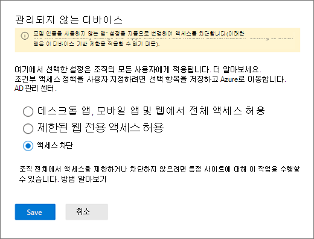

# 특정 사용자를 위해 SharePoint에 대 한 액세스 차단

Microsoft 365의 SharePoint에 대 한 CA (조건부 액세스) 정책은 팀에도 적용 됩니다. 그러나 일부 조직에서는 SharePoint 파일에 대 한 액세스를 차단 하 여 (업로드, 다운로드, 보기, 편집, 만들기) 아직 직원이 관리 되지 않는 장치에서 팀 데스크톱, 모바일, 웹 클라이언트를 사용할 수 있도록 합니다. CA 정책 규칙에 따라 Sharepoint를 차단 하면 팀도 차단 될 수 있습니다. 이 문서에서는이 제한을 해결 하 고 직원이 SharePoint에 저장 된 파일에 대 한 액세스를 완전히 차단 하면서 팀을 계속 사용할 수 있도록 하는 방법에 대해 설명 합니다.

> [!Note]
> 관리 되지 않는 장치에서 액세스를 차단 하거나 제한 하는 것은 Azure AD 조건부 액세스 정책에 따라 달라 집니다. [AZURE AD 라이선스](https://azure.microsoft.com/pricing/details/active-directory/)에 대해 알아보세요. Azure AD의 조건부 액세스에 대 한 개요는 [Azure Active Directory에서 조건부 액세스](https://docs.microsoft.com/azure/active-directory/conditional-access/overview)를 참조 하세요. 추천 SharePoint Online 액세스 정책에 대 한 자세한 내용은 [sharepoint 사이트 및 파일 보호에 대 한 정책 권장 사항을](https://docs.microsoft.com/microsoft-365/enterprise/sharepoint-file-access-policies)참조 하세요. 관리 되지 않는 장치에 대 한 액세스를 제한 하는 경우 관리 디바이스의 사용자가 [지원 되는 OS 및 브라우저 조합](https://docs.microsoft.com/azure/active-directory/conditional-access/technical-reference#client-apps-condition)중 하나를 사용 해야 하며 그렇지 않은 경우에도 액세스가 제한 됩니다.

다음에 대 한 액세스를 차단 하거나 제한할 수 있습니다.

- 조직의 사용자 또는 일부 사용자 또는 보안 그룹

- 조직의 모든 사이트 또는 일부 사이트만

액세스가 차단 되 면 사용자에 게 오류 메시지가 표시 됩니다. 액세스를 차단 하면 보안을 제공 하 고 보안 데이터를 보호할 수 있습니다. 액세스가 차단 되 면 사용자에 게 오류 메시지가 표시 됩니다.

1. SharePoint [관리 센터](https://admin.microsoft.com/sharepoint?page=accessControl&modern=true)를 엽니다.

2. **정책**  >  **액세스 정책을**확장 합니다.

3. **관리 되지 않는 장치** 섹션에서 **액세스 차단** 을 선택 하 고 **저장**을 선택 합니다.

   

4. [Azure Active Directory](https://portal.azure.com/#blade/Microsoft_AAD_IAM/ConditionalAccessBlade/Policies) 포털을 열고 **조건부 액세스 정책**으로 이동 합니다.

    이 예제와 유사한 새 정책이 SharePoint에서 생성 된 것을 확인할 수 있습니다.

    

5. 정책을 업데이트 하 여 특정 사용자 또는 그룹만 대상으로 지정 합니다.

    

  > [!Note]
> 이 정책을 설정 하면 SharePoint 관리자 포털에 대 한 액세스를 잘라낼 수 있습니다. 제외 정책을 구성 하 고 전역 및 SharePoint 관리자를 선택 하는 것이 좋습니다.

6. SharePoint만 대상 클라우드 앱으로 선택 되어 있는지 확인

    

7. 데스크톱 클라이언트도 포함 하도록 **조건을** 업데이트 합니다.

    

8. **액세스 허용** 이 설정 되어 있는지 확인

    

9. **앱 적용 제한 사용** 이 설정 되어 있는지 확인 합니다.

10. 정책을 사용 하도록 설정 하 고 **저장**을 선택 합니다.

    

정책을 테스트 하려면 팀 데스크톱 앱 또는 비즈니스용 OneDrive 동기화 클라이언트에서 로그 아웃 한 다음 다시 로그인 하 여 정책 작동을 확인 해야 합니다. 액세스가 차단 된 경우에는 항목이 존재 하지 않을 수 있다는 메시지가 팀에 표시 됩니다.

 

Sharepoint에서는 액세스 거부 메시지가 표시 됩니다.

## 관련 항목

[SharePoint의 관리 되지 않는 장치에 대 한 액세스 제어](https://docs.microsoft.com/sharepoint/control-access-from-unmanaged-devices)
