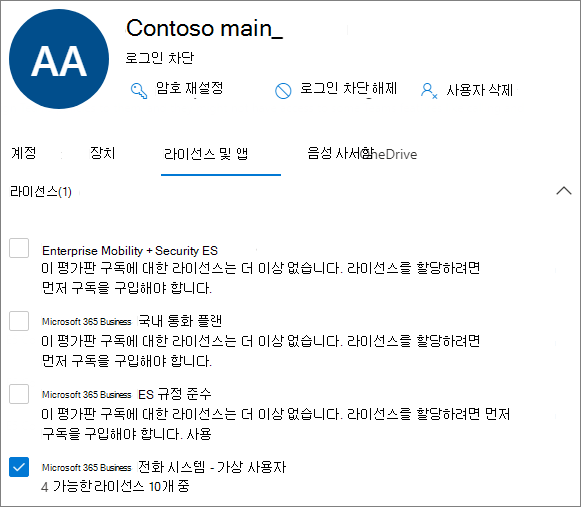
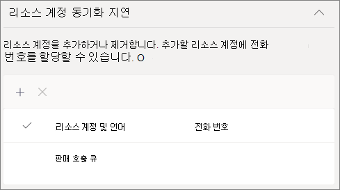
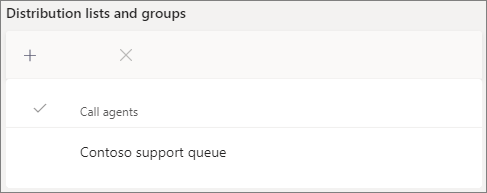
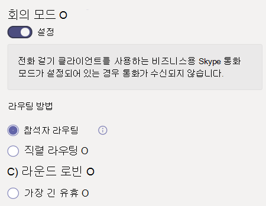
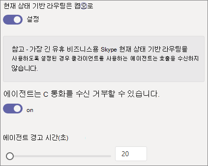
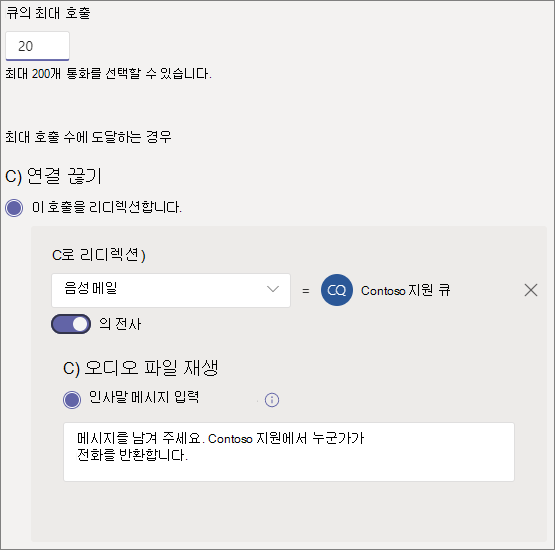
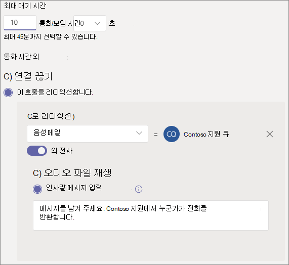

# 통화 큐 만들기 - Small Business 자습서Create a call queue - small business tutorial

통화 큐는 특정 문제 또는 질문에 도움을 줄 수 있는 조직의 사용자에게 발신자 라우팅 방법을 제공합니다.Call queues provide a method of routing callers to people in your organization who can help with with a particular issue or question. 호출은 큐에 있는 사람(에이전트라고도 하는)에게 한 번씩 *배포됩니다.*Calls are distributed one at a time to the people in the queue (who are known as *agents*). 

호출 큐는 다음을 제공합니다.Call queues provide:

- 인사말 메시지입니다.A greeting message.

- 음악 대기 중인 동안 대기합니다.Music while people are waiting on hold in a queue.

- 호출 라우팅(FIFO(First *In, First Out)* 순서로 에이전트에 라우팅합니다.Call routing - in *First In, First Out* (FIFO) order - to agents.

- 큐 오버플로 및 시간 제한에 대한 처리 옵션입니다.Handling options for queue overflow and timeout.

#### 시작하기 전에Before you begin

아직 없는 경우 일부 전화 시스템 [-](../teams-add-on-licensing/virtual-user.md) 가상 사용자 라이선스를 얻습니다.Get some [Phone System - Virtual User licenses](../teams-add-on-licensing/virtual-user.md) if you don't already have them. 설정할 각 통화 큐 및 자동 전화 회의에 대해 하나를 얻습니다.Get one for each call queue and auto attendant that you plan to set up. 이러한 라이선스는 무료이기 때문에 향후 설정을 변경하기로 결정한 경우 몇 가지 추가 사항을 추가하는 것이 좋습니다.These licenses are free, so we suggest getting a few extra in case you decide to make changes to your setup in the future.

통화 큐의 에이전트가 고객 전화를 반환하기 위해 전화를 걸 수 있는 경우 통화 에이전트의 발신자 ID를 기본 전화 번호 또는 적절한 자동 전화 번호로 설정하는 것을 고려합니다.Since agents in a call queue may dial out to return a customer call, consider setting the caller ID for your call agents to your main phone number or the number of an appropriate auto attendant. 자세한 [내용은 Microsoft Teams에서 발신자 ID](../caller-id-policies.md) 정책 관리를 참조하세요.See [Manage caller ID policies in Microsoft Teams](../caller-id-policies.md) for more information.

#### 다음 단계에 따라 호출 큐를 설정하세요.Follow these steps to set up your call queue

# [ 1단계 팀 만들기Step 1 Create a team](#tab/create-team)

통화 큐를 만들 때 개별 사용자를 큐에 추가하거나 기존 보안 그룹, Microsoft 365 그룹 또는 Microsoft Teams 팀을 사용할 수 있습니다.When creating a call queue, you can add individual users to the queue, or you can use an existing security group, Microsoft 365 group, or Microsoft Teams team. 팀을 사용하는 것이 좋습니다.We recommend using a team. 이렇게 하면 큐의 구성원이 서로 채팅하고, 아이디어를 공유하고, 문서 또는 기타 리소스를 만들어 고객이 도움을 줄 수 있습니다.This allows members of the queue to chat with each other, share ideas, and create documents or other resources to help them help your customers. 또한 팀에서는 발신자에 대해 몇 시간 후 또는 큐가 최대 용량에 도달하면 메시지를 남길 수 있는 음성 사서함을 제공합니다.A team also provides a voice mailbox for callers to leave a message after hours or if the queue reaches its maximum capacity.

팀을 만들자To create a team

1. 먼저 앱의 왼쪽에 있는 **Teams를** 클릭한 다음 참가를 클릭하거나 팀 목록의 맨 아래에 팀을 만들어야 합니다. First, click **Teams** on the left side of the app, then click **Join or create a team** at the bottom of your teams list.

2. 그런 다음 **팀 만들기(첫** 번째 카드, 왼쪽 위 모서리)를 클릭합니다.Then click **Create team** (first card, top left corner).

3. 처음부터 **팀 빌드를 선택 합니다.**Choose **Build a team from scratch**.

4. 다음으로, 공개 또는 비공개 팀을 원하는지 여부를 선택 합니다.Next, choose whether you want a public or private team. 팀에  합류하여 사람들이 의도치 않은 큐에 참여하지 않도록 통화 큐에 Private을 설정하는 것이 좋습니다.We recommend **Private** for your call queue to avoid people unintentionally becoming part of the queue by joining the team.

5. 팀 이름을 지정하고 선택적 설명을 추가합니다.Name your team and add an optional description.

6. 완료되면 만들기를 **클릭합니다.**When you're done, click **Create**.

8. 통화 큐에 원하는 사람 이름을 입력한 다음 추가를 **클릭합니다.**Type the names of the people that you want to have in your call queue, and then click **Add**.

9. 닫기 **클릭**Click **Close**. 팀에 추가한 사람은 팀 구성원이 됐고 팀이 팀 목록에 표시될 것 같은 전자 메일을 받게 됩니다.People you add to a team will receive an email letting them know they are now a member of your team and the team will show up in their teams list.

> [!div class="nextstepaction"]
> [2단계 - 리소스 계정 >Step 2 - Resource accounts >](https://review.docs.microsoft.com/microsoftteams/business-voice/create-a-phone-system-call-queue-smb?branch=mikeplum-smb-voice&tabs=resource-account#steps)

# [2단계   리소스 계정Step 2 Resource accounts](#tab/resource-account)

만드는 각 호출 큐에는 리소스 계정이 필요합니다.Each call queue that you create requires a resource account. 계정이 개인 대신 자동 전화 걸기 또는 통화 큐와 연결되어 있는 것을 제외하고는 사용자 계정과 비슷합니다.This is similar to a user account, except the account is associated with an auto attendant or call queue instead of a person. 이 단계에서는 계정을 *만들고, Microsoft 365* 전화 시스템 - 가상 사용자 라이선스를 할당한 다음, 이를 사용하여 호출 큐 만들기를 시작할 것입니다.In this step, we'll create the account, assign it a *Microsoft 365 Phone System - Virtual User* license, and then use it to start creating the call queue.

### 리소스 계정 만들기Create a resource account

Teams 관리 센터에서 리소스 계정을 만들 수 있습니다.You can create a resource account in the Teams admin center.

1. Teams 관리 센터에서 **전체 설정을** 확장한 다음 리소스 **계정을 클릭합니다.**In the Teams admin center, expand **Org-wide settings**, and then click **Resource accounts**.

2. 추가를 **클릭합니다.**Click **Add**.

3. 리소스 계정 추가 **창에서** 표시 **이름,** 사용자 이름을  입력하고 리소스 계정 유형에 대한 호출 **큐를 선택하세요.**In the **Add resource account** pane, fill out **Display name**, **Username**, and choose **Call queue** for the **Resource account type**.

    

4. **저장** 을 클릭합니다.Click **Save**.

새 계정이 계정 목록에 표시됩니다.The new account will appear in the list of accounts.

### 라이선스 할당Assign a license

리소스 계정에 *Microsoft 365 Phone System - 가상 사용자* 라이선스를 할당해야 합니다.You must assign a *Microsoft 365 Phone System - Virtual User* license to the resource account.

1. Microsoft 365 관리 센터에서 라이선스를 할당하려는 리소스 계정을 클릭합니다.In the Microsoft 365 admin center, click the resource account to which you want to assign a license.

2. 라이선스 **및** 앱 탭의 **라이선스** **아래에서 Microsoft 365 Phone System - Virtual User를 선택합니다.**On the **Licenses and Apps** tab, under **Licenses**, select **Microsoft 365 Phone System - Virtual User**.

3. 변경 **내용 저장을 클릭합니다.**Click **Save changes**.

    

### 통화 큐 만들기Create a call queue

다음으로 새 호출 큐를 만들고 리소스 계정을 할당합니다.Next, we'll start creating a new call queue and assign the resource account.

1. Teams 관리 센터에서 **음성을** 확장하고 통화 큐를 클릭한 다음 추가를 **클릭합니다.**In the Teams admin center, expand **Voice**, click **Call queues**, and then click **Add**.

1. 호출 큐의 이름을 입력합니다.Type a name for the call queue. 에이전트는 큐에서 들어오는 호출을 받으면 이 이름을 볼 수 있습니다.Agents will see this name when they receive an incoming call from the queue.

2. 계정 **추가를** 클릭하고 이 호출 큐에 사용할 리소스 계정을 검색한 다음 추가를 클릭한 다음 추가를 **클릭합니다.**Click **Add accounts**, search for the resource account that you want to use with this call queue, click **Add**, and then click **Add**.

3. 언어를 선택 합니다.Choose a language. 이 언어는 시스템 생성 음성 프롬프트 및 음성메일 전사(사용하도록 설정한 경우)에 사용됩니다.This language will be used for system-generated voice prompts and voicemail transcription (if you enable them).

    

4. 발신자들에게 큐에 도착할 때 인사말을 재생할지 지정합니다.Specify if you want to play a greeting to callers when they arrive in the queue. 재생하려는 인사말이 포함된 MP3, WAV 또는 WMA 파일을 업로드해야 합니다.You must upload an MP3, WAV, or WMA file containing the greeting that you want to play.

5. Teams는 큐에 대기 중인 발신자에 기본 음악을 제공 합니다.Teams provides default music to callers while they are on hold in a queue. 특정 오디오 파일을 재생하려면 오디오 파일 재생을 **선택하고** MP3, WAV 또는 WMA 파일을 업로드합니다.If you want to play a specific audio file, choose **Play an audio file** and upload an MP3, WAV, or WMA file.

> [!NOTE]
> 업로드된 기록은 5MB를 넘지 않습니다.The uploaded recording can be no larger than 5 MB.
> Teams 통화 큐에 제공되는 기본 음악은 조직에서 지불하는 로열티가 없습니다.The default music supplied in Teams call queues is free of any royalties payable by your organization. 

> [!div class="nextstepaction"]
> [3단계 - 에이전트 호출 >Step 3 - Call agents >](https://review.docs.microsoft.com/microsoftteams/business-voice/create-a-phone-system-call-queue-smb?branch=mikeplum-smb-voice&tabs=call-agents#steps)

# [3단계   에이전트 호출Step 3 Call agents](#tab/call-agents)

호출 큐에 에이전트를 추가하기 위해 앞에서 만든 팀을 추가합니다.To add agents to the call queue, we'll add the team that we created earlier.

1. 그룹 **추가를 클릭합니다.**Click **Add groups**.
2. 만든 팀의 이름을 입력합니다.Type the name of the team that you created.
3. **추가를** 클릭한 다음 추가를 **클릭합니다.**Click **Add**, and then click **Add**.

    

그룹 또는 팀을 통해 최대 20개 에이전트를 개별적으로 최대 200개까지 추가할 수 있습니다.You can add up to 20 agents individually and up to 200 agents via groups or teams.

> [!NOTE]
> 새 사용자가 팀에 추가된 경우 첫 번째 호출이 도착하는 데 최대 8시간이 걸릴 수 있습니다.When new users are added to the team, it can take up to eight hours for their first call to arrive.

> [!div class="nextstepaction"]
> [4단계 - 리소스 계정 >Step 4 - Resource accounts >](https://review.docs.microsoft.com/microsoftteams/business-voice/create-a-phone-system-call-queue-smb?branch=mikeplum-smb-voice&tabs=call-routing#steps)

# [4단계   통화 라우팅Step 4 Call routing](#tab/call-routing)

사용하려는 호출 라우팅 방법을 선택 합니다.Choose the call routing method that you want to use.

1. 회의 **모드를 자동으로** **설정**Set **Conference mode** to **Auto**.

2. 사용하려는 **라우팅** 방법을 선택 합니다.Choose the **Routing method** you want to use. 그러면 에이전트가 큐에서 호출을 받는 순서가 결정됩니다.This determines the order in which agents receive calls from the queue. 직렬 **라우팅 또는** **라운드 로빈을 권장합니다.**We recommend **Serial routing** or  **Round robin**. 다음 옵션에서 선택합니다.Choose from these options:

    - **참석자 라우팅은** 큐에 있는 모든 에이전트를 동시에 링합니다.**Attendant routing** rings all agents in the queue at the same time. 호출을 픽업하는 첫 번째 호출 에이전트가 호출을 얻습니다.The first call agent to pick up the call gets the call.

    - **직렬 라우팅은** 모든 호출 에이전트를 하나씩 링합니다.**Serial routing** rings all call agents one by one. 에이전트가 통화를 기각하거나 선택하지 않는 경우 호출은 다음 에이전트에 벨을 울리며, 에이전트가 선택되거나 시간 외 시간 외로 호출될 때까지 모든 에이전트를 시도합니다.If an agent dismisses or does not pick up a call, the call will ring the next agent and will try all agents until it is picked up or times out.

    - **라운드 로빈은** 들어오는 호출의 라우팅을 균형 조정하여 각 호출 에이전트가 큐에서 동일한 호출 수를 얻습니다.**Round robin** balances the routing of incoming calls so that each call agent gets the same number of calls from the queue. 인바운드 판매 환경에서는 모든 호출 에이전트가 동일한 기회를 보장하는 것이 바람직할 수 있습니다.This may be desirable in an inbound sales environment to assure equal opportunity among all the call agents.

    - **가장 긴 유휴** 시간은 각 호출을 유휴 시간이 가장 긴 에이전트로 라우팅합니다.**Longest idle** routes each call to the agent who has been idle the longest time. (10분 넘게 현재 상태가 부재 중 상태인 에이전트는 포함되지 않습니다.)(Agents whose presence state has been Away for more than 10 minutes are not included.)

    

3. 현재 **상태 기반 라우팅을 켜야** 합니다.Turn **Presence-based routing** on. 이렇게 하여 현재 상태를 사용할 수 있는 에이전트에 대한 호출을 **라우팅합니다.**This routes calls to agents whose presence status is **Available**.

4. 에이전트가 통화를 옵트아웃할 수 있도록 허용할지 선택하십시오.Choose if you want to allow agents to opt out of calls.

5. 에이전트 경고 **시간을** 설정하여 큐가 다음 에이전트로 호출을 리디렉션하기 전에 에이전트의 전화가 울릴 기간을 지정합니다.Set an **Agent alert time** to specify how long an agent's phone will ring before the queue redirects the call to the next agent.

    

> [!div class="nextstepaction"]
> [5단계 - 오버플로 호출 >Step 5 - Call overflow >](https://review.docs.microsoft.com/microsoftteams/business-voice/create-a-phone-system-call-queue-smb?branch=mikeplum-smb-voice&tabs=call-overflow#steps)

# [5단계   오버플로 호출Step 5 Call overflow](#tab/call-overflow)

큐의 최대값을 초과하는 호출을 처리하는 방법을 선택 합니다.Choose how you want to handle calls that exceed the maximum in the queue.

1. 큐에서 **최대 호출을 설정합니다.**Set the **Maximum calls in the queue**.

2. 최대 호출 수에 도달할 때 할 작업을 선택 합니다.Choose what you want to do when the maximum number of calls is reached. 통화 연결을 끊거나 리디렉션할 수 있습니다.You can disconnect the call or redirect it. 다음 대상 중 하나에 호출을 리디렉션하는 것이 좋습니다.We recommend that you redirect the call to one of the following destinations:
    - **조직의 사람** - 음성 통화를 받을 수 있는 조직의 사람**Person in the organization** - a person in your organization who is able to receive voice calls
    - **음성 앱** - 자동 전화 걸기 또는 다른 통화 큐.**Voice app** - an auto attendant or another call queue. (이 대상을 선택할 때 자동 전화 연결 또는 통화 큐와 연결된 리소스 계정을 선택하세요.)(Choose the resource account associated with the auto attendant or call queue when choosing this destination.)
    - **외부 전화 번호** - 모든 전화 번호입니다.**External phone number** - any phone number. +[국가 코드][지역 번호][전화 번호] 형식 사용Use this format: +[country code][area code][phone number]
    - **음성 메일** - 만든 팀의 음성 사서함을 사용할 수 있습니다.**Voicemail** - you can use the voice mailbox of the team that you created.

    

> [!div class="nextstepaction"]
> [6단계 - 호출 시간 제한 >Step 6 - Call timeout >](https://review.docs.microsoft.com/microsoftteams/business-voice/create-a-phone-system-call-queue-smb?branch=mikeplum-smb-voice&tabs=call-timeout#steps)

# [ 6단계 호출 시간 제한Step 6 Call timeout](#tab/call-timeout)

호출이 큐에서 너무 오랫동안 대기 중인 경우 발생하려는 작업을 선택 합니다.Choose what you want to happen when calls have been waiting in the queue for too long.

1. 통화 시간 **제한 설정: 최대 대기 시간.**Set the **Call Timeout: maximum wait time**.

2. 통화가 시간보다 까다로우면 어떤 작업을 할지 선택해야 합니다. 통화 연결을 끊거나 리디렉션할 수 있습니다.Choose what you want to do when a call times out. You can disconnect the call or redirect it. 다음 대상 중 하나에 호출을 리디렉션하는 것이 좋습니다.We recommend that you redirect the call to one of the following destinations:
    - **조직의 사람** - 음성 통화를 받을 수 있는 조직의 사람**Person in the organization** - a person in your organization who is able to receive voice calls
    - **음성 앱** - 자동 전화 걸기 또는 다른 통화 큐.**Voice app** - an auto attendant or another call queue. (이 대상을 선택할 때 자동 전화 연결 또는 통화 큐와 연결된 리소스 계정을 선택하세요.)(Choose the resource account associated with the auto attendant or call queue when choosing this destination.)
    - **외부 전화 번호** - 모든 전화 번호입니다.**External phone number** - any phone number. +[국가 코드][지역 번호][전화 번호] 형식 사용Use this format: +[country code][area code][phone number]
    - **음성 메일** - 만든 팀의 음성 사서함을 사용할 수 있습니다.**Voicemail** - you can use the voice mailbox of the team that you created.

    

3. **저장** 을 클릭합니다.Click **Save**.

그러면 호출 큐 설정이 완료됩니다.This completes the setup of your call queue. 다음으로 자동 [attendant를 설정할 수 있습니다.](create-a-phone-system-auto-attendant-smb.md)Next, you may want to [set up an auto attendant](create-a-phone-system-auto-attendant-smb.md).

---

