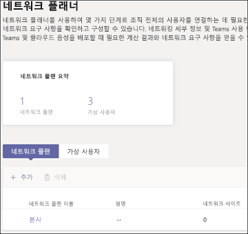
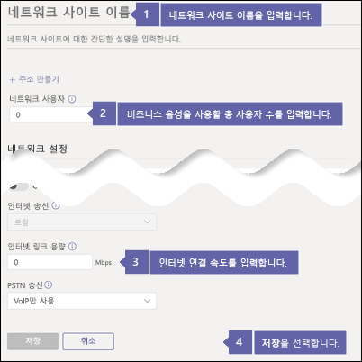
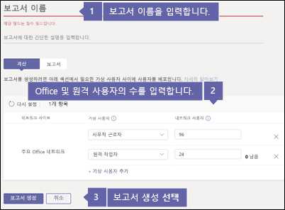
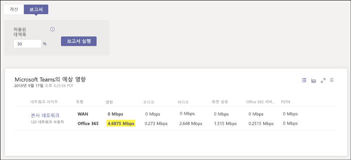

# Business Voice에 대한 인터넷 연결 확인Check your Internet connection for Business Voice

Business Voice는 Microsoft 365에서 클라우드에 있습니다.Business Voice is located in the cloud with Microsoft 365. Microsoft Teams 및 Business Voice를 사용하는 모든 장치는 인터넷 연결을 필요로 합니다.Every device that uses Microsoft Teams and Business Voice needs a connection to the Internet.

최적의 Business Voice 환경을 위해 어느 특정 시간에 조직에서 사용할 수 있는 최대 전화 통화의 수를 지원할 수 있도록 광대역 인터넷 연결이 필요합니다.To get the best Business Voice experience, you need a broadband Internet connection that can support the maximum number of phone calls that your organization might make at any one time. 또한 사용자의 네트워크의 컴퓨터가 Microsoft 365 서버에 연결할 수 있는지 확인해야 합니다.You also need to make sure that the computers on your network can reach Microsoft 365 servers.

이 단계를 따르려면 다음의 구독 중 하나를 포함하는 테넌트가 있어야 합니다.To follow these steps, you need to have a tenant with one of the following subscriptions:

* Office 365 Business EssentialsOffice 365 Business Essentials
* Office 365 Business PremiumOffice 365 Business Premium
* Office 365 E1Office 365 E1
* Office 365 E3Office 365 E3
* Office 365 F1Office 365 F1
* Microsoft 365 A1Microsoft 365 A1
* Microsoft 365 A3Microsoft 365 A3
* Microsoft 365 E3Microsoft 365 E3
* Microsoft 365 BusinessMicrosoft 365 Business

이들 단계를 따르기 위해 Business Voice 라이선스가 필요하지는 않습니다.You don't need a Business Voice license to follow these steps.

## 인터넷 연결 속도를 확인합니다Check your Internet connection speed

이 문서는 사용자의 인터넷 연결이 전화를 걸고 화상 회의를 호스팅해야 하는 사용자의 수를 수용하기에 충분히 빠른지를 확인하는 데 도움을 줍니다.This article helps determine whether your Internet connection is fast enough for the number of people who need to make phone calls and host video conferences. 사용자는 조직에 대한 정보를 제공하고 Teams 및 Business Voice로 인해 사용될 인터넷 연결의 용량을 보여주는 보고서를 받을 수 있습니다.You'll provide information about your organization and get back a report that shows how much of your Internet connection will be used by Teams and Business Voice.

### 인터넷 연결 및 사용자에 대한 정보 수집Gather information about your Internet connection and users

시작하기 전에 다음의 정보가 필요합니다.Before you start, you need the following information:

* 인터넷 연결 속도.The speed of your Internet connection
* 사무실에서 Business Voice를 주로 사용하는 사용자의 수How many people will use Business Voice mainly from your office
* 홈 사무실과 같이 주로 원격 위치에서 Business Voice를 사용하는 사용자의 수How many people will use Business Voice mainly from a remote location, such as a home office

### 네트워크 플래너에 사용자 정보를 입력합니다.Enter your information into the network planner

다음 단계를 따릅니다:Follow these steps:

1. 브라우저에서 https://admin.teams.microsoft.com로 이동합니다.In a browser, go to https://admin.teams.microsoft.com. 전역 관리자 권한이 있는 계정을 사용하여 로그인합니다.Sign in by using an account that has Global Administrator permissions. Office 365에 등록하기 위해 사용한 계정에는 이러한 사용 권한이 있습니다.The account that you used to sign up for Office 365 has these permissions.
2. **계획**을 열고 **네트워크 플래너**를 선택합니다.Open **Planning** and select **Network planner**.
3. **네트워크 플랜**에서 **추가**를 선택합니다.Under **Network plans**, select **Add**. 플랜에 이름을 입력하고 **적용**을 선택합니다.Enter a name for your plan, and then select **Apply**. 네트워크 플랜은 다음과 같이 보여야 합니다.Your network plan should look like this:

    
1. 네트워크 플랜의 이름을 선택합니다.Select the name of your network plan. (이전 그림에서 **기본 office**입니다.)(It's **Main office** in the preceding picture.)
2. 다음 페이지에서 **네트워크 사이트**탭의 **네트워크 사이트 추가**를 선택합니다.On the next page, select **Add a network site** on the **Network sites** tab.
3. 다음의 스크린샷에 표시된 항목만 입력하고 **저장**을 선택합니다.Fill in only the fields that are indicated in the following screenshot, and then select **Save**. 화면의 나머지 항목은 빈 칸으로 두고, **ExpressRoute**나 **WAN에 연결됨** 옵션은 선택하지 않습니다.Leave the other fields on this screen blank, and don't select the **ExpressRoute** or **Connected to WAN** options.

    
1. **보고서** 탭에서 **보고서 시작**을 선택합니다.On the **Report** tab, select **Start a report**.
1. 다음 정보를 입력하고 **보고서 생성**을 선택하면 Teams에서 필요한 대역폭을 보여주는 보고서가 생성됩니다.Enter the following information, and then select **Generate report** to create a report that shows the bandwidth requirements for Teams. 다음 항목에서 보고서를 보는 방법을 설명합니다.We show you how to read the report in the next section.

    

### 최소 인터넷 연결 속도를 확인합니다Find your minimum Internet connection speed

**보고서 작성**을 선택 시 Office 365에서 다음과 같이 표시되는 보고서를 만듭니다.When you select **Generate report**, Office 365 creates a report that looks like this:

강조 표시된 숫자는 Teams와 Business Voice가 사용할 인터넷 연결의 용량을 보여줍니다.The highlighted number shows how much of your Internet connection Teams and Business Voice will use. 이 숫자가 총 인터넷 연결 속도의 30%를 넘지 않는 것이 좋습니다.We recommend that this number is no more than 30 percent of your total Internet connection speed. 예를 들어 인터넷 연결 속도가 60Mbps인 경우 Teams 및 Business Voice는 18Mbps 이상을 사용하지 않아야 합니다.For example, if your Internet connection is 60 Mbps, Teams and Business Voice should use no more than 18 Mbps.

다음 수식을 사용하여 최소 인터넷 연결 속도를 확인합니다. *\<강조 표시된 숫자>/0.3*.Use this equation to determine your minimum Internet connection speed: *\<highlighted number> / 0.3*. 이전 이미지에서 강조 표시된 번호를 사용하면 계산은 *4.6875/0.3 = 15.6*이 됩니다.With the number that's highlighted in the preceding image, the calculation is *4.6875 / 0.3 = 15.6*. 이 경우 인터넷 연결 속도는 적어도 15.6Mbps이어야 합니다.In this case, the Internet connection speed should be at least 15.6 Mbps.

Teams 및 Business Voice에서 전체 인터넷 연결 속도의 30% 이상을 사용하는 경우 강조 표시된 숫자가 빨간색으로 표시됩니다.If Teams and Business Voice will use more than 30 percent of your total Internet connection speed, the highlighted number will appear red. 이 경우 인터넷 연결을 업그레이드해야 할 수 있습니다.In that case, you may need to upgrade your Internet connection.

## 사용자의 네트워크의 컴퓨터 및 장치가 Microsoft 365에 연결될 수 있는지 확인합니다.Make sure the computers and devices on your network can reach Microsoft 365

Business Voice를 사용하는 컴퓨터 및 장치는 특정 네트워크 포트를 사용하여 Microsoft 365 서버와 통신해야 합니다.Computers and devices that use Business Voice must use specific network ports to communicate with Microsoft 365 servers. 이러한 포트는 기본적으로 네트워크 또는 인터넷을 통해 모든 장치가 서로 통신할 수 있는 문입니다.These ports are essentially doors through which devices talk to each other over a network or the Internet. 사용자의 방화벽은 네트워크의 장치가 다음의 *아웃바운드* 네트워크 포트를 사용하여 Microsoft 365에 연결될 수 있도록 허용해야 합니다.Your firewall needs to allow devices on your network to reach Microsoft 365 through the following *outbound* network ports:

* **TCP 포트** 80 및 443**TCP ports** 80 and 443
* **UDP 포트** 3478, 3479, 3480 및 3481**UDP ports** 3478, 3479, 3480, and 3481

사용자의 방화벽이 이러한 네트워크 포트에서의 통신을 허용하는지를 확인하는 가장 쉬운 방법은 Teams에서 테스트 통화를 해보는 것입니다.The easiest way to check whether your firewall allows communication on these network ports is to make a test call in Teams:

1. 사용자의 네트워크의 컴퓨터에서 https://aka.ms/getteams로 이동하여 Teams를 설치합니다.Go to https://aka.ms/getteams on a computer on your network and install Teams. 컴퓨터에 스피커와 마이크가 있는지 확인합니다.Make sure that the computer has speakers and a microphone.
2. Teams를 열고 Microsoft 365 계정을 사용하여 로그인합니다.Open Teams and sign in by using a Microsoft 365 account.
3. Teams에서 프로필 사진을 선택하고 **설정** > **장치**로 이동합니다.In Teams, select your profile picture, and then go to **Settings** > **Devices**.
4. **오디오 장치**에서 **테스트 통화**를 선택합니다.Under **Audio devices**, select **Make a test call**.
5. 단계를 따라 메시지를 남기고 사용자에게 다시 재생되도록 합니다.Follow the steps to leave a message and have it played back to you.

   * 통화가 연결되고 메시지가 들린다면 방화벽이 제대로 설정된 것입니다.If the call connects and you hear your message, your firewall is set up correctly.
   * 통화가 연결되지만 안내 음성이나 메시지가 들리지 않으면 스피커 및 마이크가 컴퓨터에서 제대로 설정되었는지 확인하고 다시 시도합니다.If the call connects, but you can't hear the instructions or your message, make sure that your speakers and microphone are set up correctly, and then try again.
   * 통화가 연결되지 않거나 연결되지만 메시지가 들리지 않으면 필요한 네트워크 포트에 액세스를 허용하도록 방화벽을 업데이트해야 할 수도 있습니다.If the call doesn't connect or it connects but you can't hear your message, you might need to update your firewall to allow access to the required network ports. 방화벽 설명서를 확인하거나 IT 전문가에게 도움을 요청하세요.Check your firewall's documentation, or contact an IT specialist for help.

 사용자가 IT 전문가이고 Business Voice를 지원하기 위해 더욱 크거나 복잡한 네트워크를 준비하는 방법에 대한 자세한 정보를 필요로 하는 경우 [사용자 환경 평가](../3-envision-evaluate-my-environment.md)를 참조하세요.If you're an IT professional and want more information about how to prepare larger or more complex networks to support Business Voice, see [Evaluate my environment](../3-envision-evaluate-my-environment.md). 이 문서는 대역폭, 프록시 및 방화벽 요구 사항에 정보를 제공하고 또한 [네트워크 평가 도구](../3-envision-evaluate-my-environment.md#test-the-network)를 사용하여 네트워크를 테스트하는 방법도 제공합니다.This article provides information about bandwidth, proxy and firewall requirements, and how to use the [Network Assessment Tool](../3-envision-evaluate-my-environment.md#test-the-network) to test your network.

