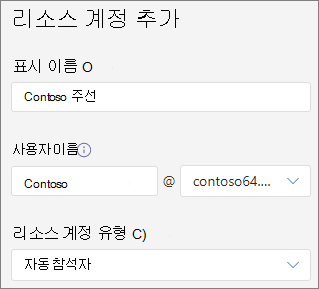

# 4단계: 비즈니스 음성 리소스 계정 설정Step 4: Set up a Business Voice resource account

Microsoft Teams 각 자동 참석자 또는 호출 큐에 대한 리소스 계정이 필요합니다.In Microsoft Teams, a resource account is required for each auto attendant or call queue. 리소스 계정에 서비스 전화 번호가 할당될 수도 있습니다.Resource accounts may also be assigned service telephone numbers. 자동 참석자 및 통화 큐에 전화 번호를 할당하여 외부의 Teams 전화 큐에 도달할 수 있도록 하는 방식입니다.This is how you assign phone numbers to auto attendants and call queues allowing callers from outside Teams to reach the auto attendant or call queue.

## 가상 사용자 라이선스 획득Obtain virtual user licenses

리소스 계정에는 자동 참석자 및 호출 큐를 사용하려면 라이선스가 필요합니다.Resource accounts require a license in order to work with auto attendants and call queues. 가상 사용자 라이선스 - Microsoft 365 전화 시스템 *사용할 수* 있습니다.You can use a free *Microsoft 365 Phone System - Virtual User* license.

1. Microsoft 365 관리 센터에 로그인합니다.Sign in to the Microsoft 365 admin center.
2. 청구 **구매**  >  **서비스**  >  **추가 기능으로 이동하여** 모든 추가 기능 제품  >  **보기**Go to **Billing** > **Purchase services** > **Add-ons** > **See all Add-ons products**
3. 끝까지 스크롤하여 가상 Microsoft 365 전화 시스템 **라이선스를 찾습니다.**Scroll to the end to find the **Microsoft 365 Phone System – Virtual User** license. 세부 **정보를 선택한** 다음 **을 구입합니다.**Select **Details**, then **Buy**.
4. 라이선스 구매 페이지에서 원하는 가상 사용자 라이선스 수를 선택합니다.On the license purchase page, select the number of virtual user licenses you want. 설정할 각 자동 참석자 및 통화 큐에 대해 하나의 가상 라이선스가 필요합니다.You need one virtual license for each auto attendant and call queue you plan to set up. 더 많은 라이선스를 바로 구매하지 않고도 향후 더 많은 자동 참석자 및 통화 큐를 쉽게 설정할 수 있도록 5개 이상의 라이선스를 선택하는 것이 좋습니다.We recommend selecting at least five licenses so you can easily set up more auto attendants and call queues in the future without having to purchase more licenses right away.
5. 라이선스가 없는 모든 사용자에게 자동으로 할당 **선택을 선택하지 않습니다.**Uncheck **Automatically assign to all of your users with no licenses**.
6. 지금 **체크 아웃을 선택합니다.**Select **Check out now**.
7. 주문을 확인하고 다음 **,** 다음을 선택한 다음 **순서를 를 선택합니다.**Confirm your order, select **Next**, and then **Place order**.

> [!NOTE]
> 비용이 0이라도  라이선스를 구입해야 합니다.Keep in mind you must still  **Buy** the license even though it has a cost of zero.

## 리소스 계정 만들기Create a resource account

가상 사용자 Microsoft 365 전화 시스템 *받은* 후 리소스 계정을 만들 수 있습니다.After you've received your *Microsoft 365 Phone System - Virtual User* license, you can create your resource account.

1. Teams 관리 센터에서 **Org-wide** 설정을 확장한 다음 리소스 계정을 **클릭합니다.**In the Teams admin center, expand **Org-wide settings**, and then click **Resource accounts**.
2. **추가** 를 선택합니다.Select **Add**.
3. 리소스 계정 **추가 창에서** 표시 **이름** 및 사용자 이름 을 **입력합니다.**In the **Add resource account** pane, fill out **Display name**, and then **Username**. 리소스 계정의 목적을 설명하기 위해 "기본 줄 자동 참석자"처럼 설명이 있는 표시 이름을 선택하세요.Choose a descriptive display name such as "Main line auto attendant" to describe the purpose of the resource account.
4. 리소스 **계정 유형에서** **자동 참석 을 선택합니다.**In **Resource account type**, select **Auto attendant**.
5. **저장** 을 선택합니다.Select **Save**.

## 라이선스 할당Assign a license

리소스 계정을 만든 후 가상 사용자 *Microsoft 365 전화 시스템* 라이선스 또는 전화 시스템 *할당해야* 합니다.After you've created your resource account, you need to assign a *Microsoft 365 Phone System - Virtual User* license or *Phone System* license.

1. 관리 Microsoft 365 사용자 활성 **사용자로**  >  **이동하세요.**In the Microsoft 365 admin center, go to **Users** > **Active users**.
2. 리소스 계정을 선택합니다.Select your resource account.
1. 라이선스 **및** 앱 탭의 라이선스에서 가상 **Microsoft 365 전화 시스템 선택합니다.**On the **Licenses and Apps** tab, under **Licenses**, select **Microsoft 365 Phone System - Virtual User**.
1. 변경 **내용 저장을** 선택한 다음 **닫기 를 선택합니다.**Select **Save changes** and then **Close**.

## 서비스 번호 할당Assign a service number

1. Teams 관리 센터에서 **Org-wide 설정으로** 이동한 다음 **리소스 계정으로 이동합니다.**In the Teams admin center, go to **Org-wide settings** and then **Resource accounts**. 
1. 방금 만든 리소스 계정을 선택한 다음 **할당/할당을 클릭합니다.**Select the resource account you just created, and then click **Assign/unassign**.
1. 숫자 **전화 드롭다운에서** Online 을 **선택하세요.**In the **Phone number type** dropdown, choose **Online**.
1. 할당된 전화 번호 **상자에서** 사용할 번호를 검색하고 추가를 **클릭합니다.**In the **Assigned phone number** box, search for the number you want to use and click **Add**. 국가 코드(예: **+1** 250 555 0012)를 포함해야 합니다.Be sure to include the country code (for example, **+1** 250 555 0012)
1. **저장** 을 클릭합니다.Click **Save**.
    > [!NOTE]
    > 번호를 추가할 자동 참석자가 이미 선택되어 있기 때문에 **할당에서** 자동 참석자를 선택할 필요가 없습니다.You don't need to select an auto attendant under **Assign to** because the auto attendant you want to add the number to is already selected.

> [!div class="nextstepaction"]
> [다음 단계: 사용자에게 전화 번호 할당Next step: Assign phone numbers to your users](set-up-assign-numbers.md)
