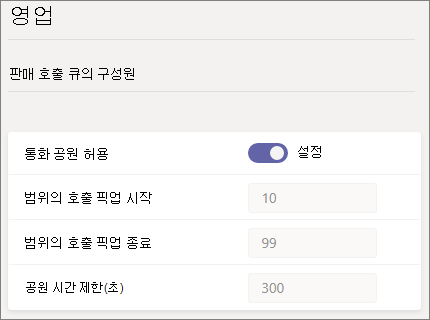

# 통화 공원 및 Microsoft Teams에서 검색

통화 공원 및 검색은 사용자가 통화를 보류할 수 있도록 하는 기능입니다. 호출이 검색된 경우 서비스는 호출 검색을 위한 고유한 코드를 생성합니다. 그러면 통화를 저장한 사용자 또는 다른 사용자가 해당 코드를 지원되는 앱 또는 디바이스와 함께 사용하여 호출을 검색할 수 있습니다. (자세한 내용은 [Teams에서](https://support.office.com/article/park-a-call-in-teams-8538c063-d676-4e9a-8045-fc3b7299bb2f) 통화 공원을 참조합니다.)

콜 파크를 사용하는 일반적인 시나리오는 다음과 같습니다.

- 리셉션 직원은 공장에서 일하는 사람에게 전화를 걸고 있습니다. 그런 다음 수신 직원은 공용 주소 시스템을 통해 호출 및 코드 번호를 발표합니다. 호출할 사용자는 공장에서 Teams 전화를 선택하고 코드를 입력하여 호출을 검색할 수 있습니다.
- 디바이스 배터리가 전원이 부족하기 때문에 사용자가 모바일 디바이스에 전화를 걸 수 있습니다. 그런 다음 사용자가 코드를 입력하여 Teams 데스크 전화에서 호출을 검색할 수 있습니다.
- 지원 담당자는 고객 통화를 저장하고 전문가가 전화를 검색하고 고객을 도울 수 있도록 Teams 채널에 공지를 전송합니다. 전문가가 Teams 클라이언트에서 코드를 입력하여 호출을 검색합니다.

호출을 저장하고 검색하려면 사용자가 Enterprise Voice 사용자 되어야 합니다. 호출 공원 정책에 포함되어야 합니다.

> [!NOTE]
> 통화 공원 및 검색은 [Teams 전용](teams-and-skypeforbusiness-coexistence-and-interoperability.md) 배포 모드에서만 사용할 수 있으며 비즈니스용 Skype IP 휴대폰에서 지원되지 않습니다.

## 호출 공원 구성 및 검색

호출 공원을 구성하고 검색하려면 Teams 관리자가 되어야 합니다. 기본적으로 사용하지 않도록 설정되어 있습니다. 호출 공원 정책을 사용하여 사용자에 대해 사용하도록 설정하고 사용자 그룹을 만들 수 있습니다. 사용자 집합에 동일한 정책을 적용하면 호출을 저장하고 검색할 수 있습니다.

통화 공원 정책을 사용하도록 설정하려면

1. Microsoft Teams 관리 센터의 왼쪽 탐색에서 음성 통화 공원 **정책으로**  >  **이동하세요.**
2. 정책 관리 **탭에서** 추가를 **클릭합니다.**
3. 정책에 이름을 지정한 다음  호출 공원 허용을 **On으로 전환합니다.**

    

4. 저장을 **선택합니다.**

목록에서 정책을 선택하고 편집을 클릭하여 정책을 편집할 **수 있습니다.**

정책이 작동하려면 사용자에게 할당해야 합니다. 사용자에게  정책을 개별적으로 할당하거나 그룹에 할당할 수 있습니다.

그룹에 통화 파트 정책을 할당하기 위해

1. 통화 공원 정책 **페이지에서** 그룹 정책 할당 **탭에서** 그룹 추가 **를 클릭합니다.**
2. 사용할 그룹을 검색한 다음 추가를 **클릭합니다.**
3. 다른 그룹 할당과 비교하여 순위를 선택합니다.
4. 정책 **선택에서** 이 그룹을 할당할 정책을 선택합니다.

    

5. 적용 **을 선택합니다.**

## 관련 항목

[Teams에서 전화 걸기](https://support.office.com/article/park-a-call-in-teams-8538c063-d676-4e9a-8045-fc3b7299bb2f)

[Teams에서 사용자에게 정책 할당](assign-policies.md)

[New-CsTeamsCallParkPolicy](/powershell/module/skype/new-csteamscallparkpolicy?view=skype-ps)

[Set-CsTeamsCallParkPolicy](/powershell/module/skype/set-csteamscallparkpolicy?view=skype-ps)

[Grant-CsTeamsCallParkPolicy](/powershell/module/skype/grant-csteamscallparkpolicy?view=skype-ps)