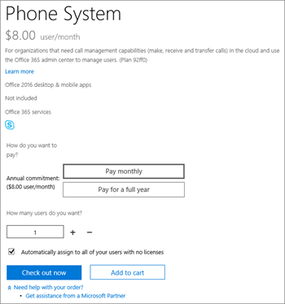

# Microsoft 365용 통화 플랜

다른 비즈니스용 Skype 및 Microsoft Teams 사용자에 대한 통화는 무료이지만 사용자가 일반 전화를 걸 수 있도록 하고 음성 통화를 할 서비스 공급자가 아직 없는 경우 통화 플랜을 구입해야 합니다. 자세한 내용은 [전화 시스템 및 통화 플랜](calling-plan-landing-page.md)을 참조하세요.
  
통화 플랜 옵션은 다음과 같습니다.
  
- **국내 통화 플랜**: 사용이 허가된 사용자는 Microsoft 365에 할당된 국가/지역에 있는 번호로 전화를 걸 수 있습니다. 무제한 수신 시간(분)이 포함됩니다. 발신 시간은 구매한 라이선스에 따라 포함됩니다.

- **국제 통화 플랜**: 사용이 허가된 사용자는 사용자의 위치에 따라 Microsoft 365 라이선스가 할당된 국가/지역 및 [196개 국가/지역의](country-and-region-availability-for-audio-conferencing-and-calling-plans/users-can-make-outbound-calls-to-these-countries-and-regions.md) 국제 번호로 전화할 수 있습니다. 무제한 수신 시간(분)이 포함됩니다. 발신 시간은 구매한 라이선스에 따라 포함됩니다.

- **종량제 통화 플랜**: 사용이 허가된 사용자는 사용자의 위치에 따라 Microsoft 365 라이선스가 할당된 국가/지역에 있는 번호와  [196개 국가/지역의](country-and-region-availability-for-audio-conferencing-and-calling-plans/users-can-make-outbound-calls-to-these-countries-and-regions.md) 국제 번호로 전화를 걸 수 있습니다. 무제한 수신 시간(분)이 포함됩니다. 보내는 시간(분)은 포함되지 않습니다. 모든 발신 통화는 통신 크레딧 또는 사후 지불 청구와 함께 사용되는 의사록에 따라 청구됩니다.

동일한 통화 플랜이 있는 동일한 국가/지역의 모든 사용자(Microsoft 365 관리 센터 라이선스 영역에 정의된 사용자 국가 위치)는 분 풀을 공유합니다. 예를 들어 120분 국내 통화 플랜이 할당된 동일한 국가/지역에 100명의 사용자가 있는 경우 12,000분의 풀을 공유합니다. 이 분을 초과하는 모든 호출은 분당 요금이 청구됩니다.

[국가 및 지역 가용성](country-and-region-availability-for-audio-conferencing-and-calling-plans/country-and-region-availability-for-audio-conferencing-and-calling-plans.md)을 방문하여 각 국가/지역의 각 조직에서 사용할 수 있는 월별 시간(분)을 확인하세요.
  
> [!IMPORTANT]
> 국가/지역은 Microsoft 365 관리 센터 **조직 프로필** 아래에 나열된 청구 주소가 **아닌** **Microsoft 365 관리 센터** > **사용** 자의 라이선스 위치를 기반으로 **합니다.**

> [!NOTE]
> 풀링 기능은 동일한 통화 플랜에서만 사용할 수 있습니다.

  
사용 제한 및 사용 약관에 대한 자세한 내용은 [오디오 회의 무료 전화 접속 기간을](complimentary-dial-out-period.md) 참조하세요.
  
## 통화 플랜을 구입하는 방법

1. 먼저 **전화 시스템 추가 기능 라이선스** 를 구매해야 합니다. 이렇게 하려면 [Microsoft 365 관리 센터 로그인하고 지금 **청구**](https://go.microsoft.com/fwlink/p/?linkid=868433) > **구매 서비스** >  추가 기능 구독 **구매****를** >  선택합니다.

    
  
    > [!NOTE]
    > 플랜에 따라 전화 시스템 라이선스를 구입하기 전에 추가 기능을 더 구입해야 할 수 있습니다. 자세한 내용은 [Microsoft Teams 추가 기능 라이선스를](./teams-add-on-licensing/microsoft-teams-add-on-licensing.md) 참조하세요.
  
2. 전화 시스템 라이선스를 구입한 후에는 [Microsoft 365 관리 센터 로그인하고 **청구**](https://go.microsoft.com/fwlink/p/?linkid=868433)**구매 서비스** > **추가 기능 구독** 을  >  선택한 다음 **지금 구매** 를 선택하여 통화 플랜을 구입할 수 있습니다. 통화 플랜이 표시됩니다.

조직의 요구 사항에 따라 다른 통화 플랜을 구입하여 다른 사용자에게 할당할 수 있습니다. 필요한 통화 플랜을 선택한 후 체크 아웃을 진행합니다. Microsoft 365 관리 센터 각 사용자에게 계획을 할당합니다. 방법을 알아보려면 [Microsoft Teams 추가 기능 라이선스 할당을 참조하세요](./teams-add-on-licensing/microsoft-teams-add-on-licensing.md).
  
## 하이브리드 사용자를 위해 온-프레미스 PSTN 연결을 제공하는 서비스 공급자가 있나요?

그렇다면 통화 플랜을 구입할 필요가 없습니다. Office 365 Enterprise E5에는 **전화 시스템** 추가 기능이 포함되어 있으므로 체크 아웃을 진행할 수 있습니다.
  
그런 다음, Microsoft 365 관리 센터 사용자에게 Enterprise E5 또는 **Phone System** 추가 기능 라이선스를 할당합니다. 방법을 알아보려면 [Microsoft Teams 추가 기능 라이선스 할당을 참조하세요](./teams-add-on-licensing/microsoft-teams-add-on-licensing.md).
  
## 가격 책정 정보

- [통화 플랜 및 전화 시스템에 대한 가격 책정](https://www.microsoft.com/microsoft-365/microsoft-teams/voice-calling)
- [오디오 회의 가격](https://www.microsoft.com/microsoft-365/microsoft-teams/online-meetings)

## 자세한 내용은

통화 플랜을 설정하는 방법을 설명하는 더 많은 문서는 다음과 같습니다.
  
- [통화 플랜 설정](set-up-calling-plans.md)
- [Microsoft Teams 추가 기능 라이선스](./teams-add-on-licensing/microsoft-teams-add-on-licensing.md)
- [Microsoft 365 또는 Office 365 전화 시스템을 사용하여 얻을 수 있는 항목은 다음과 같습니다.](./here-s-what-you-get-with-phone-system.md)

## 관련 기사

- [비즈니스용 Skype 온라인 설정](/SkypeForBusiness/set-up-skype-for-business-online/set-up-skype-for-business-online)
- [클라우드 음성 메일 설정 - 관리자 도움말](set-up-phone-system-voicemail.md)
- [통화 플랜 설정](set-up-calling-plans.md)
- [자금 추가 및 커뮤니케이션 크레딧 관리](add-funds-and-manage-communications-credits.md)
