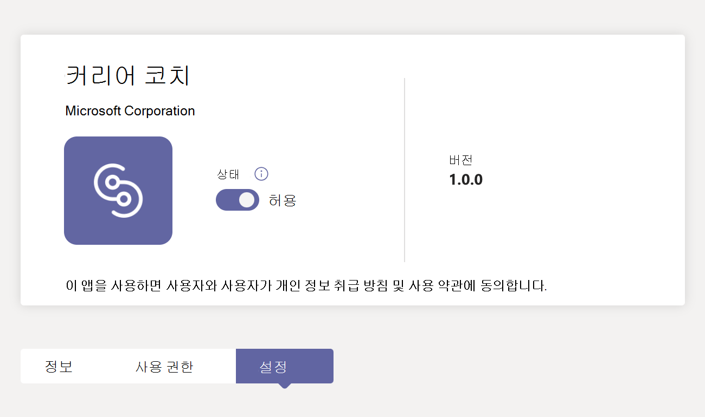
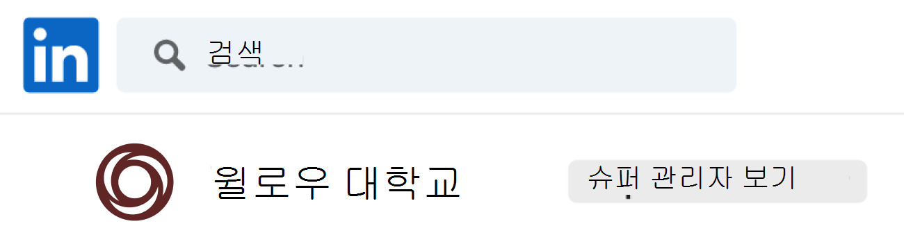
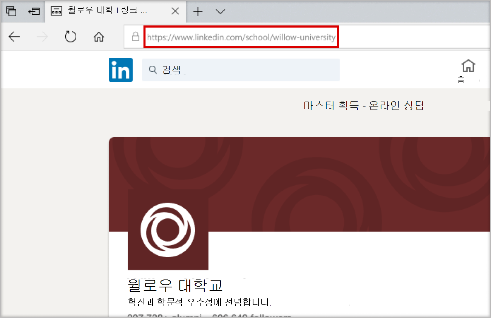
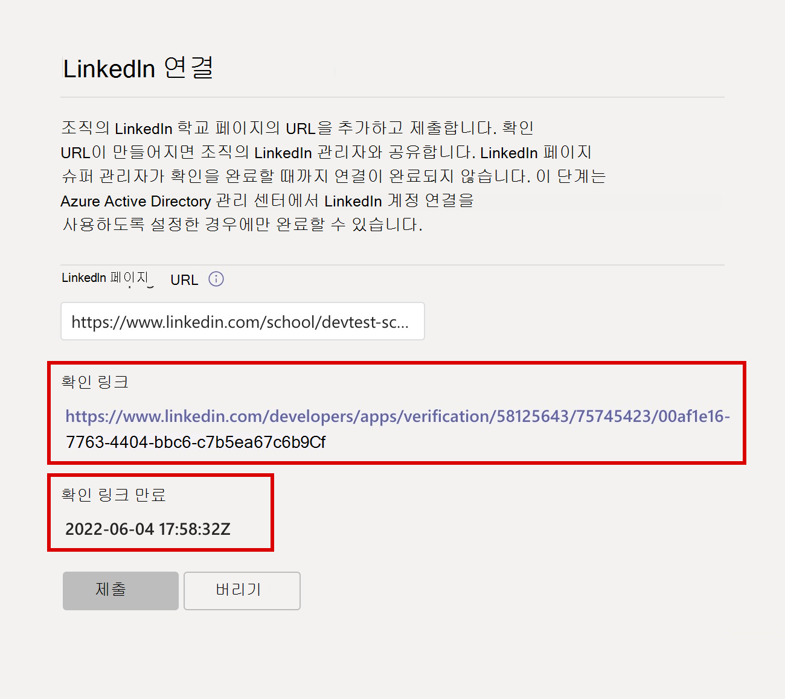
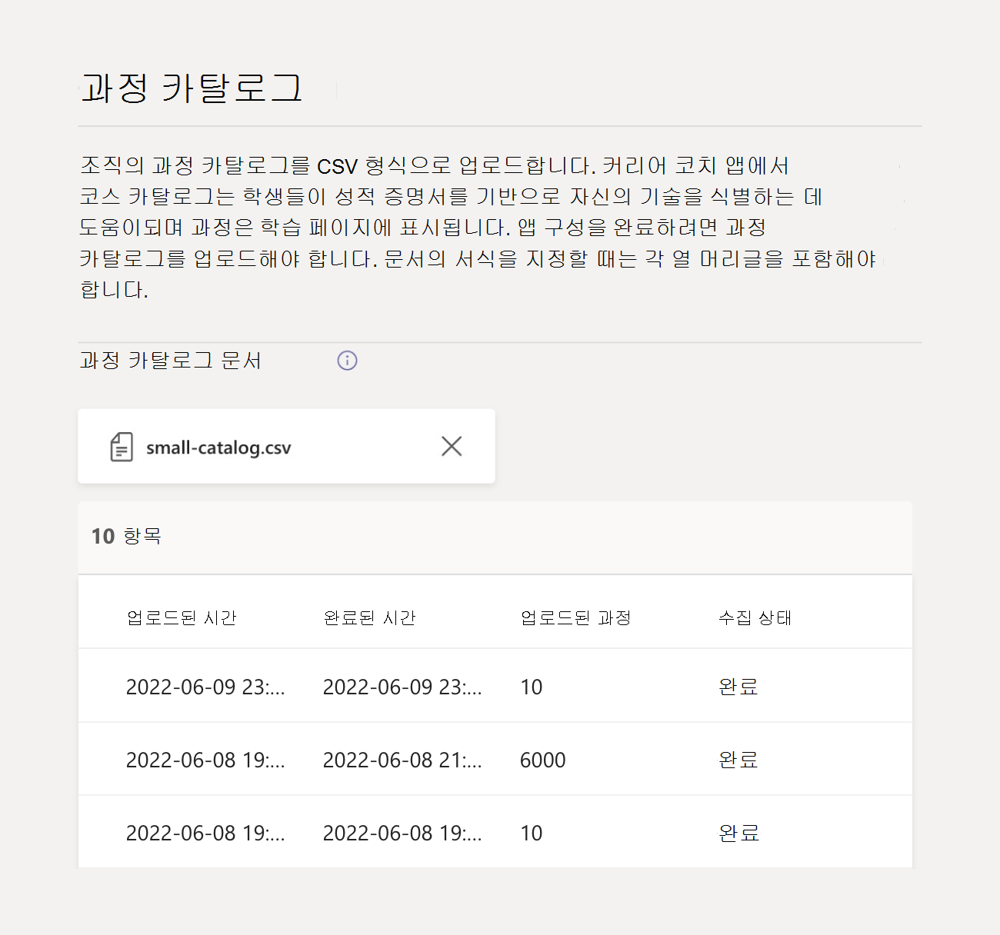

# Microsoft Teams용 커리어 코치 설정 및 구성

이 문서는 고등 교육 IT 관리자가 Microsoft Teams용 커리어 코치를 설정하는 방법을 알아보기 위한 것입니다.

커리어 코치를 설정, 구성 및 해제하는 기본 단계는 다음과 같습니다.

1. [1단계: 커리어 코치를 위해 테넌트 준비](#step-1-prepare-your-microsoft-365-tenant-for-career-coach)
1. [2단계: 커리어 코치 라이선스 구매](#step-2-purchase-career-coach-licenses).
1. [3단계: 커리어 코치 설정에 액세스](#step-3-access-the-career-coach-app-settings)합니다.
1. [4단계: 커리어 코치 설정을 구성합니다](#step-4-configure-career-coach-settings).
1. [5단계: 기관에서 커리어 코치를 사용할 수 있도록 합니다](#step-5-make-career-coach-available-to-your-institution).

## 역할 및 권한 식별

커리어 코치를 설정하려면 여러 유형의 관리자 역할이 필요합니다. 이러한 역할 및 권한은 한 개인에게 할당되거나 교육 기관의 IT 전문가와의 협업이 필요할 수 있습니다. 아래 검사 목록을 사용하여 참조된 작업을 완료하는 데 필요한 개인을 식별합니다.

Microsoft 365 관리 센터 > [사용자 > 활성 사용자를](https://go.microsoft.com/fwlink/p/?linkid=834822) 방문하여 계정의 할당된 역할을 확인할 수 > 사용자 이름을 선택하여 역할을 확인할 수 있습니다.

[Microsoft 365 관리 센터 관리자 역할에](/microsoft-365/admin/add-users/about-admin-roles) 대해 자세히 알아봅니다.

### [Microsoft 365 관리 센터 작업](https://go.microsoft.com/fwlink/p/?linkid=2024339)

역할: [전역 관리자](/azure/active-directory/roles/permissions-reference#global-administrator)

커리어 코치 작업:

- [라이선스를 구입합니다](#step-2-purchase-career-coach-licenses).
- [라이선스를 할당합니다](#assign-career-coach-licenses-to-users).

### [Azure Active Directory 관리 센터 작업](https://go.microsoft.com/fwlink/p/?linkid=2067268)

역할: [전역 관리자](/azure/active-directory/roles/permissions-reference#global-administrator)

커리어 코치 작업:

- [LinkedIn 계정 연결을 켭니다](#turn-on-linkedin-account-connections).

### [Teams 관리 센터 작업](https://admin.teams.microsoft.com/dashboard)

역할: [Teams 관리자](/azure/active-directory/roles/permissions-reference#teams-administrator)

커리어 코치 작업:

- [커리어 코치를 설치된 앱으로 추가](#add-career-coach-as-an-installed-app)합니다.
- [Career Coach 앱 설정을 구성합니다](#step-4-configure-career-coach-settings).
- [정책을 설정합니다](#identify-roles-and-permissions).
- [앱을 고정합니다](#identify-roles-and-permissions).

### LinkedIn 개발자 포털 작업

역할: [LinkedIn School 페이지 슈퍼 관리](https://www.linkedin.com/help/linkedin/answer/a541981)

커리어 코치 작업:

- [LinkedIn School 페이지를 확인합니다](#verify-the-linkedin-school-page).

## 커리어 코치 준비

커리어 코치를 설정하고 구성하기 전에 다음 준비 단계를 수행합니다.

1. [1단계: 커리어 코치를 위해 테넌트 준비](#step-1-prepare-your-microsoft-365-tenant-for-career-coach)
1. [2단계: 커리어 코치 라이선스 구매](#step-2-purchase-career-coach-licenses).

### 1단계: 커리어 코치를 위한 Microsoft 365 테넌트 준비

#### LinkedIn 계정 연결 켜기

커리어 코치에서 LinkedIn 계정 연결을 사용하는 방법에는 두 가지가 있습니다.

- 학생, 교직원 및 직원이 Microsoft 365 계정을 LinkedIn 계정에 연결하고 [커리어 코치로부터 LinkedIn 초대를 보낼](https://support.microsoft.com/topic/career-coach-quick-start-guide-for-students-c419db47-9290-4961-9684-c3f86a9b3708#bkmk_connect_your_linkedin_account) 수 있도록 합니다.
- LinkedIn의 공개 동문 데이터를 사용하여 [네트워크 빌드](https://support.microsoft.com/topic/career-coach-quick-start-guide-for-students-c419db47-9290-4961-9684-c3f86a9b3708#bkmk_build_your_network) 및 [경력 살펴보기](https://support.microsoft.com/topic/career-coach-quick-start-guide-for-students-c419db47-9290-4961-9684-c3f86a9b3708#bkmk_discover_your_career_path) 기능을 켜려면

LinkedIn 계정 연결을 설정하려면 다음을 수행합니다.

1. Azure AD 조직의 [전역 관리자 계정](#identify-roles-and-permissions)으로 Azure AD [관리 센터에](https://go.microsoft.com/fwlink/p/?linkid=2067268) 로그인합니다.

2. **사용자를** 선택합니다.

3. **사용자** 페이지에서 **사용자 설정을** 선택합니다.

4. 커리어 코치가 제대로 구성되려면 **LinkedIn 계정 연결을** **예** 또는 **선택한 그룹으로** 설정해야 합니다.

   - **예(Yes**)를 선택하여 교육 기관의 모든 사용자에 대한 서비스를 켭니다.
   - **선택한 그룹을** 선택하여 교육 기관에서 선택한 사용자 그룹에 대해서만 서비스를 켭니다.

자세한 내용은 [Azure Active Directory의 LinkedIn 계정 연결을 참조하세요](/azure/active-directory/enterprise-users/linkedin-integration).

> [!NOTE]
> 사용자의 동의 없이는 데이터가 공유되지 않습니다.

#### Teams에서 Microsoft 앱 허용

커리어 코치는 Microsoft 애플리케이션이므로 Teams 앱 권한 정책 내에서 허용해야 합니다.

1. **[Teams 관리 센터에 로그인합니다](https://go.microsoft.com/fwlink/p/?linkid=2066851)**.

2. 왼쪽 탐색 영역에서 **Teams 앱** > **[사용 권한 정책을](https://admin.teams.microsoft.com/policies/manage-apps)** 선택합니다.

3. 원하는 정책을 선택합니다.
    1. 사용할 정책이 확실하지 않은 경우 [Microsoft Teams 정책 관리 설명서를](policy-packages-edu.md) 참조하거나 [교육 정책 마법사](easy-policy-setup-edu.md) 를 사용하여 Microsoft Teams에 대한 정책을 구성합니다.

[사용 권한 정책 구성](teams-app-permission-policies.md)에 대해 자세히 알아봅니다.

#### 커리어 코치를 설치된 앱으로 추가

이 단계에서는 교육 기관에 대해 커리어 코치가 제대로 구성되고 학생들이 커리어 코치를 찾을 수 있습니다.

1.  [Teams 관리 센터에 로그인합니다](https://go.microsoft.com/fwlink/p/?linkid=2066851).

2.  **Teams 앱** > **설정 정책을** 선택하고 원하는 정책을 선택합니다.
    1. 사용할 정책이 확실하지 않은 경우 [Microsoft Teams 정책 관리 설명서를](policy-packages-edu.md) 참조하거나 [교육 정책 마법사](easy-policy-setup-edu.md) 를 사용하여 Microsoft Teams에 대한 정책을 구성합니다.

3. **설치된 앱** 에서 앱  **추가를** 선택합니다.

4. **설치된 앱 추가** 창에서 Teams를 시작할 때 자동으로 설치할 앱을 검색합니다. 앱 권한 정책을 통해 앱을 필터링할 수도 있습니다.

5. 앱 목록을 선택한 경우 **추가** 를 선택합니다.

6.  **확인 저장** > 을 선택합니다.

변경 내용을 적용하려면 정책을 편집하거나 할당하는 데 몇 시간이 걸릴 수 있습니다. 변경이 완료될 때까지 Microsoft Teams에서 커리어 코치를 사용할 수 없습니다.

### 2단계: 커리어 코치 라이선스 구매

#### 라이선스 유형

커리어 코치는 애플리케이션에 액세스하기 위한 라이선스가 필요합니다.

사용 가능한 두 가지 라이선스 유형이 있습니다.

- **학생 라이선스** 는 학생용으로 설계되었습니다.
- **교직원 라이선스** 는 커리어 코치를 통해 학생을 지원하는 데 관련된 교직원, 교직원 및 IT 전문가를 위해 설계되었습니다.
  - 구성을 완료하는 IT 관리자에게 커리어 코치 **교직원 라이선스** 를 할당해야 합니다.

#### 라이선스 구매

커리어 코치는 EES(교육 솔루션 등록), CSP(클라우드 서비스 공급자) 및 Microsoft 365 관리 센터(웹 다이렉트)를 통해 자격을 갖춘 고등 교육 기관에 대해 전 세계적으로(중국 및 러시아 제외) 추가 기능 라이선스로 사용할 수 있습니다.

Microsoft Teams 앱인 테넌트는 추가 기능 Career Coach 라이선스를 구매하려면 Microsoft 365 A3/A5 또는 Office 365 A1/A3/A5가 있어야 합니다. 학생 및 교직원 사용자를 위해 별도의 라이선스가 제공됩니다.

#### 무료 평가판 등록

25명의 학생과 25명의 교직원 라이선스에 대해 표준 90일 무료 평가판을 사용할 수 있습니다. 적격 테넌트당 하나의 평가판을 사용할 수 있습니다. 평가판 라이선스는 커리어 코치 라이선스를 구매할 자격이 있는 테넌트가 Microsoft 365 관리 센터 활성화할 수 있습니다.

평가판 활성화를 위해 [Microsoft 365 관리 센터 > 청구 > 구매 서비스에 로그인하여 커리어 코치를 검색](https://go.microsoft.com/fwlink/p/?linkid=868433)하여 [학생 라이선스 평가판](https://signup.microsoft.com/signup?OfferId=b3a40ff2-3d0d-481e-a0ed-f4de1069f201) 및 [교직원 라이선스 평가판을](https://signup.microsoft.com/signup?OfferId=6f6e7db5-b9ab-4baa-86be-f13d0ae6a2c8) 찾을 > 있습니다.

## 커리어 코치 설정 및 구성

기관에 대한 커리어 코치 설정을 설정하고 구성하려면 다음 단계를 수행합니다.

1. [3단계: 커리어 코치 앱 설정에 액세스](#step-3-access-the-career-coach-app-settings)합니다.
1. [4단계: 커리어 코치 설정을 구성합니다](#step-4-configure-career-coach-settings).

### 3단계: 커리어 코치 앱 설정 액세스

Career Coach 설정을 구성하고 사용자에게 허용하려면 페이지에 액세스하려면 전역 관리자 또는 Teams 서비스 관리자여야 합니다.

1.  [Teams 관리 센터에 로그인합니다](https://go.microsoft.com/fwlink/p/?linkid=2066851).
2. 왼쪽 탐색 영역에서 **Teams 앱** **관리 앱을** > 선택합니다.
3.  **커리어 코치** 를 검색하거나 찾아봅니다.
4.  **커리어 코치** 를 선택한 다음 **설정을** 선택합니다.

### 4단계: 커리어 코치 설정 구성

학생, 교직원 및 교직원을 위한 커리어 코치를 설정하려면 다음 설정이 필요합니다.

- [브랜드 및 기본 설정](#brand-and-preferences)
- [LinkedIn 연결](#linkedin-connection)
- [과정 카탈로그](#course-catalog)
- [연구 분야](#fields-of-study)

선택적 [사용자 지정](#customization-options) 설정을 지정할 수도 있습니다.

#### 브랜드 및 기본 설정

교육 기관의 브랜드에 맞게 커리어 코치를 사용자 지정합니다. 사용자는 저작권 및 상표권을 포함하여 다른 사람의 권리를 존중할 책임이 있습니다.

> [!IMPORTANT]
> 필수 섹션입니다. **브랜드와 선호도가** 제출되지 않으면 커리어 코치를 켤 수 없습니다.

1. **[Teams 관리 센터에 로그인합니다](https://go.microsoft.com/fwlink/p/?linkid=2066851)**.

2. **Teams 앱** > **관리 앱** > **커리어 코치** > **설정** > **편집 브랜드 및 기본 설정을** 선택합니다.

3. **브랜딩** 에서 **조직 이름을 추가합니다**.

4. **조직 아이콘** 을 업로드합니다. 이 아이콘은 커리어 코치 전체에서 교육 기관에 고유한 콘텐츠, 앱 전체의 과정 카탈로그 리소스 및 대시보드의 실제 환경 섹션을 식별하는 데 사용됩니다.

    아이콘의 형식은 다음과 같이 가장 적합합니다.

    - 투명한 PNG
    - 가로 세로 비율 1:1
    - 최대 크기 64px x 64px

5. **학습 콘텐츠 미리 보기 이미지를** 업로드합니다. 썸네일은 교육 기관에서 제공하는 과정에 대해 특정 이미지가 지정되지 않은 경우 앱 전체의 과정 카탈로그 학습 리소스에 사용됩니다.

    썸네일은 다음과 같이 가장 잘 서식이 지정됩니다.

    - A PNG
    - 가로 세로 비율 16:9
    - 최대 크기 360px x 200px

6. 선택적 단계입니다. **조직 개인 정보 정책 URL** 을 추가합니다. 추가되면 학생들이 커리어 코치에서 검토할 수 있도록 기관의 개인 정보 보호 정책을 사용할 수 있습니다.

7. **제출** 을 선택합니다.

8. 설정이 성공적으로 제출되었는지 확인하려면 [Career Coach 구성 상태를](#configuration-status) 확인하여 **완료** 합니다.

#### LinkedIn 연결

LinkedIn 연결 설정은 커리어 코치를 기관의 LinkedIn School Page의 공개 동문 데이터와 연결합니다.

이 단계는 [Azure Active Directory에서 LinkedIn 계정 연결을 사용하도록 설정한](#turn-on-linkedin-account-connections) 경우에만 완료할 수 있습니다. LinkedIn 연결 설정은 [네트워크 빌드](https://support.microsoft.com/topic/career-coach-quick-start-guide-for-students-c419db47-9290-4961-9684-c3f86a9b3708#bkmk_build_your_network) 및 [경력 탐색](https://support.microsoft.com/topic/career-coach-quick-start-guide-for-students-c419db47-9290-4961-9684-c3f86a9b3708#bkmk_discover_your_career_path) 기능을 설정합니다.

> [!IMPORTANT]
> 필수 섹션입니다. LinkedIn School Page 연결을 확인하지 않으면 커리어 코치를 켤 수 없습니다.

##### LinkedIn School 페이지 URL 추가

LinkedIn School 페이지 URL을 추가하는 프로세스는 Teams 관리자가 처리합니다. URL을 확인하는 후속 단계는 교육 기관의 LinkedIn School Page Super 관리자가 완료합니다.

1. **[Teams 관리 센터에 로그인합니다](https://go.microsoft.com/fwlink/p/?linkid=2066851)**.

2. **Teams 앱** > **관리 앱** > **커리어 코치** > **설정** > **LinkedIn 연결을** 선택합니다.

3. **LinkedIn에 연결을** 선택합니다.

4. LinkedIn을 검색하고 학교 필터를 선택하여 기관의 LinkedIn **School** 페이지를 찾습니다. 또는 기관의 마케팅 담당자와 연결하여 사용할 올바른 LinkedIn School 페이지를 확인합니다. 자세한 내용은 [LinkedIn 페이지를 식별하는 방법을 참조하세요](https://www.linkedin.com/help/linkedin/answer/40133/differences-between-a-linkedin-page-for-a-school-and-company?lang=en).

    

5. **LinkedIn School 페이지 URL** 을 추가합니다. URL은 *회사* 페이지가 아닌 *학교 페이지* 여야 하며 일반적으로 형식이 지정됩니다`https://www.linkedin.com/school/willow-university/`.

   

6. **제출** 을 선택합니다.

7. **LinkedIn School 페이지 URL** 이 성공적으로 제출되면 설정 페이지가 업데이트되어  **확인 링크 및 확인 링크**  **만료** 가 표시됩니다. 확인 링크는 30일 후에 만료됩니다.

8. **확인 링크를** 복사하고 교육 기관의 LinkedIn School Page Super 관리자와 공유합니다.

9. LinkedIn School Page Super 관리자는 고유한 확인 링크를 사용하여 [LinkedIn School 페이지를 확인하고](#verify-the-linkedin-school-page) 경력 코치와 연결합니다.

10. 확인 및 설정이 성공적으로 제출되었는지 확인하려면 [커리어 코치 구성 상태가](#configuration-status) 완료로 표시되어 있는지 확인 **합니다**.

##### LinkedIn School 페이지 확인

LinkedIn School Page 확인은 교육 기관의 [LinkedIn School Page Super 관리자](https://www.linkedin.com/help/linkedin/answer/a541981)가 완료해야 합니다.

LinkedIn에 로그인하고 교육 기관의 LinkedIn School Page를 방문하여 LinkedIn 계정의 관리자 역할을 확인할 수 있습니다. 계정에 슈퍼 관리자 역할이 할당된 경우 LinkedIn 페이지의 교육 기관 이름 옆에 **슈퍼 관리자 보기** 가 나열됩니다. **슈퍼 관리자 보기** 태그가 표시되지 않으면 학교 페이지의 슈퍼 관리자가 아닙니다.

1. Teams 관리자가 **LinkedIn School 페이지 URL** 을 제출하면 페이지에 **확인 링크** 및 **확인 링크 만료** 가 표시됩니다. 확인 링크는 30일 후에 만료됩니다.

     

2. 확인 링크를 복사하고 LinkedIn School 페이지 슈퍼 관리자와 공유합니다.

3. LinkedIn 페이지 슈퍼 관리자가 인증 링크를 열어 커리어 코치를 학교 페이지와 연결합니다. 자세한 내용은 [LinkedIn 페이지 확인에 대한 추가 설명서를](https://www.linkedin.com/help/linkedin/answer/102672) 참조하세요.

4. 확인이 완료되면 Teams 관리자는 [커리어 코치 구성 상태가](#configuration-status) **완료** 로 표시되어 있는지 확인하여 설정이 성공적으로 제출되었는지 확인할 수 있습니다.

   

#### 과정 카탈로그

과정 카탈로그는 교육 기관에서 제공하는 과정과 수업을 기록합니다.

커리어 코치는 과정 카탈로그 데이터를 사용하여 성적 증명서에서 학생의 기술을 식별하고 수강 과정을 제안합니다.

> [!IMPORTANT]
> 필수 섹션입니다. 커리어 코치는 코스 카탈로그 없이는 켜질 수 없습니다.

이러한 과정은 다음 두 가지 영역에서 커리어 코치 내에서 사용됩니다.

- 과정은 [학습 리소스](https://support.microsoft.com/topic/career-coach-quick-start-guide-for-students-c419db47-9290-4961-9684-c3f86a9b3708#bkmk_grow_real_world_skills)의 일부로 반환됩니다.  

- 과정 제목 및 설명과 같은 과정 및 과정 메타데이터는 학생들이 [대본을 업로드](https://support.microsoft.com/topic/career-coach-quick-start-guide-for-students-c419db47-9290-4961-9684-c3f86a9b3708#bkmk_Set_up_your_profile)할 때 자신의 기술을 식별하는 데 사용됩니다.

과정 카탈로그를 만들려면 교육 기관에서 학습하는 모든 과정 목록을 정리하고 과정 [카탈로그 문서 형식 및 스키마](#course-catalog-document-format-and-schema)를 사용하여 CSV 파일로 업로드합니다.

적절한 서식을 보장하기 위해 [샘플 과정 카탈로그](https://aka.ms/career-coach/docs/it-admins/sample-catalog) 문서로 시작합니다.필수 및 권장 필드에 대한 자세한 내용은 [과정 카탈로그 문서 형식 및 스키마](#course-catalog-document-format-and-schema) 섹션을 참조할 수도 있습니다.

##### 과정 카탈로그 추가

1. **[Teams 관리 센터에 로그인합니다](https://go.microsoft.com/fwlink/p/?linkid=2066851)**.

2. **Teams 앱** > **관리 앱** > **검색 경력 코치** > **설정** > **과정 카탈로그** 를 선택합니다.

3. 과정 **카탈로그 업로드** > 필요한 열(courseId, title 및 sourceLink)을 사용하여 CSV 형식으로 과정 업로드를 선택합니다.
    1. 각 행에는 필요한 각 열에 대한 데이터가 포함되어야 합니다.
    1. *권장 필드를 포함하면 더 나은 검색 결과 및 기술 식별을 반환하여 학생의 환경이 향상됩니다.*

4. 업로드된 과정 카탈로그 섹션의 미리 보기가 참조용으로 표시됩니다.

5. 준비가 되면 **제출** 을 선택합니다.

6. [업로드된 문서의 상태는](#course-catalog-status) 설정 페이지에 표시됩니다.

7. 설정이 성공적으로 제출되었는지 확인하려면 [커리어 코치 구성 상태가](#configuration-status) 완료로 표시되어 있는지 확인 **합니다**.

새 파일을 업로드하려면 (X)를 선택하여 문서 미리 보기를 닫아 마지막 파일을 지웁니다. 이 작업을 수행하면 **업로드** 단추가 다시 표시될 수 있습니다.

##### 과정 카탈로그 문서 형식 및 스키마

문서는 최대 크기가 18MB인 CSV 형식이어야 합니다. 대용량 파일은 성공적인 처리를 위해 최대 15,000개의 행을 포함하는 여러 개의 작은 파일로 분할되어야 합니다.

문서에는 필요한 과정 메타데이터( **강좌 제목, 강좌**  **ID** 및  **과정 URL**)가 포함되어야 합니다.

적절한 서식을 보장하기 위해 [샘플 과정 카탈로그]( https://aka.ms/career-coach/docs/it-admins/sample-catalog) 문서로 시작합니다. *권장 필드를 포함하면 더 나은 검색 결과 및 기술 식별을 반환하여 학생의 환경이 향상됩니다.*

다음 표에서는 과정 카탈로그에 포함할 항목을 보여줍니다.

| 이름             | 상태      | 유형   | 설명                                                                    |
|------------------|-------------|--------|--------------------------------------------------------------------------------|
| courseId         | 필수    | 문자열 | courseId는 학생 성적 증명서에서 생성된 내용에 매핑됩니다.             |
| 제목            | 필수    | 문자열 | 코스 제목입니다.                                                              |
| sourceLink       | 필수    | URL    | 강좌 및 강의 계획서에 대해 자세히 알아보려면 웹 사이트 링크를 코스 페이지로 연결합니다.   |
| 설명      | 권장 | 문자열 | 학습 목표를 설명하는 과정에 대한 소개 텍스트입니다.       |
| language         | 권장 | 문자열 | 코스의 언어입니다. 표준 언어 코드를 사용합니다.                           |
| 형식           | 권장 | 문자열 | 교육 모드(온라인, 비디오, 직접).                                   |
| thumbnailLink    | 권장 | URL    | 강좌 이미지에 대한 축소판 그림 링크입니다.                                            |
| thumbnailAltText | 권장 | 문자열 | 이미지에 대한 접근성 대체 텍스트                                           |
| educationLevel   | 권장 | 문자열 | 연구 수준, 예. 학부/대학원.                                       |
| 항목           | 권장 | 문자열 | 코스에서 가르치는 기술과 관련된 주제 또는 태그입니다.          |

##### 과정 카탈로그 상태

교과목 카탈로그 상태는 문서가 업로드되면 과정 카탈로그 설정 페이지에 표시되어 문서 업로드 및 처리 상태에 대한 세부 정보를 제공합니다.

처리하는 동안 커리어 코치는 문서를 분석하여 중복된 항목에 대해 분석하고, 타이틀 및 설명에서 기술을 추출하여 카탈로그를 정규화 및 보강하고, 학습 페이지 및 기술 식별을 위해 학생 성적 증명서 업로드 중에 사용할 수 있는 문서를 저장합니다.

| 열           | 값     | 설명                                                                                        |
| ---------------- | --------- | -------------------------------------------------------------------------------------------------- |
| 업로드된 시간    | 타임 스탬프 | IT 관리자가 문서를 업로드한 날짜 및 시간입니다.                                                     |
| 완료된 시간   | 타임 스탬프 | 문서가 완전히 처리된 날짜 및 시간입니다.                                               |
| 업로드된 과정 | 정수   | 문서에 있는 과정 수입니다.                                                           |
| 수집 상태 | 보류 중   | 처리를 위해 큐에 있는 문서입니다.                                                                  |
| 수집 상태 | 실행   | 문서가 현재 처리되고 있습니다. 이 프로세스는 문서의 크기에 따라 최대 6시간이 걸릴 수 있습니다. |
| 수집 상태 | 성공   | 수집 프로세스가 완료되었으며, 모든 필수 설정이 구성되면 커리어 코치에서 코스를 사용할 수 있습니다. |
| 수집 상태 | 실패    | 문서 형식을 확인하고 다시 업로드합니다.                                                           |
| 중복       | 정수   | 문서에 있는 중복 과정 수입니다.                                                 |

과정 카탈로그 상태의 열이 비어 있으면 문서가 현재 처리되고 있으며 이러한 값을 사용할 수 없습니다. 이 프로세스는 카탈로그 크기에 따라 최대 6시간이 걸릴 수 있습니다. 문서가 처리되면 값이 채워집니다. 페이지를 새로 고쳐 업데이트를 확인할 수 있습니다.

#### 연구 분야

연구 분야는 주요 관심 분야, 학문 전공 및 학위 프로그램과 동의어입니다. 이러한 연구 분야는 학생들이 커리어 코치를 사용하기 시작하고 개인 설정된 프로필을 설정하기 시작할 때 참조됩니다.

필드 목록을 통해 학생들은 관심 있는 학문 분야를 검색하고 커리어 코치의 프로필에 계획된 학업 포커스를 추가할 수 있습니다.

> [!IMPORTANT]
> 필수 섹션입니다. 커리어 코치는 연구 분야 목록 없이는 켜질 수 없습니다.
>
> 공학, 영어, 비즈니스 등 학생이 사용할 수 있는 모든 학습 필드 추가

##### 연구 필드 추가

1. **[Teams 관리 센터에 로그인합니다](https://go.microsoft.com/fwlink/p/?linkid=2066851)**.

2. **Teams 앱** > **관리 앱** > **검색 경력 코치** > **설정** >  **분야를** 선택합니다.

3. **업로드** 를 선택하여 연구 파일 필드를 CSV 형식으로 업로드합니다. 연구 문서 필드의 미리 보기가 표시됩니다.

4. **제출** 을 선택합니다.

5. 설정이 성공적으로 제출되었는지 확인하려면 [커리어 코치 구성 상태가](#configuration-status) 완료로 표시되어 있는지 확인 **합니다**.

##### 스터디 문서 형식 및 스키마 필드

문서는 최대 크기가 18MB인 CSV 형식이어야 합니다. 문서에는 필수 메타데이터인 **연구 이름 필드가** 포함되어야 합니다.

다음 표에서는 연구 필드에 포함할 항목을 보여줍니다.

| 이름          | 상태   | 유형   | 설명                    |
|---------------|----------|--------|--------------------------------|
| fieldsOfStudy | 필수 | 문자열 | 연구 분야의 이름 |

#### 사용자 지정 옵션

사용자 지정 설정은 교육 기관이 학생들에게 제공하는 대시보드에 실제 경험을 얻을 수 있는 기회를 추가할 수 있도록 지원합니다.

포함할 권장 링크는 학생들이 직업 위원회, 이벤트, 경력 서비스 사무실, 경력 관련 이벤트 및 학생 클럽과 같은 실제 경험을 얻는 데 도움이 됩니다.

1. **[Teams 관리 센터에 로그인합니다](https://go.microsoft.com/fwlink/p/?linkid=2066851)**.

2. **Teams 앱** > **관리 앱** > **검색 경력 코치** > **설정을** 선택합니다.

3. 환경  > **사용자 지정****+ 추가** 선택

4. 각 **제목**, **URL** 및 **정보 팁 설명을** > **적용** 을 선택합니다.

5. 추가된 정보의 미리 보기가 표시됩니다.

6. **제출** 을 선택합니다.

### 커리어 코치 설정 상태

Teams 관리 센터의 커리어 코치 설정 페이지에서는 커리어 코치를 구성하기 위한 불완전, 보류 중, 완료 및 실패한 단계에 대한 상태 요약을 제공합니다.

상태 메시지는 커리어 코치가 제대로 구성되어 있고 테넌트에 릴리스할 준비가 되었는지 여부를 확인하는 데 도움이 될 수 있습니다.

#### 구성 상태

앱 설정 페이지의 구성 상태 섹션에는 다음 범례를 사용하여 실시간 상태가 표시됩니다.

| 범주                    | 상태                                        | 설명                                                 |
| --------------------------- | --------------------------------------------- | ----------------------------------------------------------- |
| 서비스 프로비전 상태 | 커리어 코치가 테넌트 초기화 중입니다.     | 서비스 프로비전은 커리어 코치 설정 페이지에 액세스할 때 자동으로 발생합니다. 구성 변경 내용은 초기 설정이 완료될 때까지 허용되지 않습니다. 서비스 프로비저닝의 예상 시간은 최대 15분입니다. |
| 서비스 프로비전 상태 | 커리어 코치를 구성할 준비가 완료되었습니다.       | IT 관리자가 설정을 제출할 수 있도록 커리어 코치 설정 페이지가 준비되었습니다. |
| 브랜드 및 기본 설정       | 시작되지 않음                                   | 설정을 제출해야 합니다. |
| 브랜드 및 기본 설정       | 누락: 학습 아이콘                        | 누락된 학습 콘텐츠 미리 보기 이미지를 업로드합니다. |
| 브랜드 및 기본 설정       | 누락: 로고                                 | 누락된 기관 아이콘을 업로드합니다. |
| 브랜드 및 기본 설정       | 누락: 기관 이름                     | 누락된 기관 이름을 업로드합니다. |
| 브랜드 및 기본 설정       | 완료                                      | 추가 작업이 필요하지 않습니다. 설정이 완료되었습니다. |
| 과정 카탈로그 업로드       | 시작되지 않음                                   | 과정 카탈로그 CSV를 제출해야 합니다. |
| 과정 카탈로그 업로드       | 누락: 성공적인 과정 카탈로그 업로드   | 과정 카탈로그 처리에 대한 자세한 내용은 과정 카탈로그 상태를 확인합니다. |
| 과정 카탈로그 업로드       | 완료                                      | 추가 작업이 필요하지 않습니다. 설정이 완료되었습니다. |
| LinkedIn 학교 연결  | 시작되지 않음                                   | LinkedIn School 페이지 URL을 제출해야 합니다. |
| LinkedIn 학교 연결  | 누락: 승인된 LinkedIn School 페이지 URL | LinkedIn School 페이지 슈퍼 관리자 확인 승인을 기다리고 있습니다. |
| LinkedIn 학교 연결  | 완료                                      | 추가 작업이 필요하지 않습니다. 설정이 완료되었습니다. |
| 스터디 업로드 필드      | 시작되지 않음                                   | 연구 분야 CSV를 제출해야 합니다. |
| 스터디 업로드 필드      | 누락: 관심 영역                    | 연구 업로드 필드가 성공했는지 확인합니다. |
| 스터디 업로드 필드      | 완료                                      | 추가 작업이 필요하지 않습니다. 설정이 완료되었습니다. |

모든 필수 단계가 완료로 표시되면 커리어 코치가 테넌트에 성공적으로 릴리스될 수 있습니다.

## 5단계: 기관에서 커리어 코치를 사용할 수 있도록 만들기

이 시점에서 커리어 코치는 해당 기관에 맞게 구성되었습니다.

다음으로, 다음 단계에 따라 Microsoft Teams의 기관에서 커리어 코치를 사용할 수 있는지 확인합니다.

### 사용자에게 Career Coach 라이선스 할당

단계별 지침은 [사용자에게 라이선스 할당을 참조하세요](/microsoft-365/admin/manage/assign-licenses-to-users).

### 정책 설정 및 앱 고정

커리어 코치를 고정하면 Microsoft Teams 창의 왼쪽 레일에 추가되어 학생들이 더 쉽게 접근하고 볼 수 있습니다. 사용자의 하위 집합에 대해 커리어 코치를 고정하려는 경우 해당 그룹이 포함된 [설치 정책을](teams-app-setup-policies.md) 구현해야 합니다.

1. **[Teams 관리 센터에 로그인합니다](https://go.microsoft.com/fwlink/p/?linkid=2066851)**.

2. **Teams 앱** > **설정 정책을** 선택하고 원하는 정책을 선택합니다.

    사용할 정책이 확실하지 않은 경우 [Microsoft Teams 정책 관리 설명서를](policy-packages-edu.md) 참조하거나 [교육 정책 마법사](easy-policy-setup-edu.md) 를 사용하여 Microsoft Teams에 대한 정책을 구성합니다.

3. **고정된 앱** 에서 **앱 추가** 를 선택합니다.

4. **이 앱 사용 권한 정책에 따라 검색** 에서 원하는 정책을 선택합니다.

5. **이름으로 검색** 에서 **커리어 코치** 를 검색한 다음  **추가를** >  선택하여 창을 닫습니다.

6. 앱이 표시되도록 순서를 선택하고 **확인을** 선택합니다.

학생들은 Microsoft Teams에서 커리어 코치가 고정되었다는 알림을 받게 됩니다.
