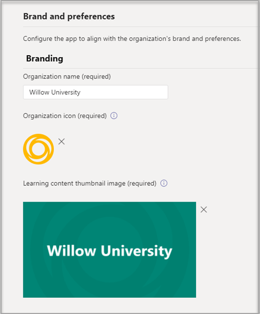
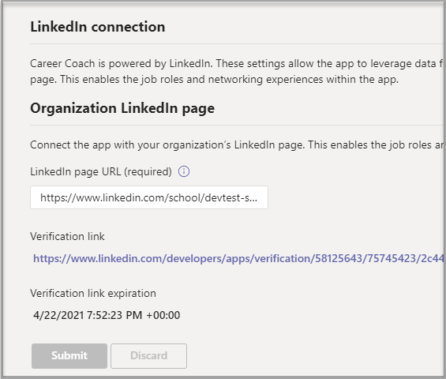

# 경력 코치를 구매, 구성 및 Microsoft Teams

커리어 코치는 Microsoft Teams 진로를 탐색할 수 있도록 고등 교육 학생들이 개인 설정된 지침을 제공하는 LinkedIn에서 제공하는 교육용 앱입니다. Career Coach는 학생들이 자신의 진로를 검색하고, 실제 기술을 성장하고, 네트워크를 한 자리에 구축할 수 있도록 교육 기관에 통합된 커리어 솔루션을 제공합니다.

커리어 [코치에 대해 자세히 알아보자.](https://aka.ms/career-coach)

> [!NOTE]
> 이 가이드의 모범 사례 및 유용한 팁을 사용하여 학생, 교직원 및 교직원을 위한 커리어 코치의 기능을 사용할 수 있습니다. 빠른 계획 [가이드 문서를 참조하세요.](https://support.microsoft.com/office/c5d0b934-bfcf-4fe7-8a85-ba7bbb1b6ad4)

## 요구 사항 검토

교육 기관에 경력 코치를 사용하도록 설정하려면 앱을 설치하고 실행하는 데 필요한 기능을 검토합니다.

**기술 요구 사항**

  - Office 365 있는 Azure Active Directory

  - Microsoft Teams

  - Azure Active Directory

**라이선스**

  - 교직원 

  - 학생

> [!NOTE]
> 커리어 코치 교직원 라이선스는 구성을 완료하는 IT 관리자에게 할당되어야 합니다.

**교육 기관의 데이터 및 파일**

  - 과정 카탈로그 데이터

  - 제공되는 연구 분야

  - 교육 기관의 LinkedIn 페이지

  - LinkedIn Learning 캠퍼스 구독(기본 설정)

## 경력 코치 라이선스 구입

경력 코치는 EES(교육용 등록 솔루션), CSP(클라우드 서비스 공급자) 및 Microsoft 365 관리 센터(웹 직접)를 통해 자격을 갖춘 고등 교육 기관에 대해 전 세계(중국 및 러시아 제외)에서 사용할 수 있습니다. 앱의 Microsoft Teams A3/A5 또는 Microsoft 365/A3/A5 Office 365 A1 있어야 합니다.

### 사용자에게 앱 라이선스 할당

단계별 지침은 사용자에게 라이선스 [할당을 참조하세요.](/microsoft-365/admin/manage/assign-licenses-to-users)

### LinkedIn 계정 연결 설정

경력 **코치는 교육** 기관의 사용자가 커리어 코치 내에서 촉진되는 linkedIn 계정에 Microsoft 365 계정을 연결할 수 있도록 요구합니다.

1. [Azure AD](https://aad.portal.azure.com/) 조직의 전역 관리자 계정으로 Azure AD 관리 센터에 로그인합니다.

2. 사용자를 **선택합니다.**

3. 사용자 **페이지에서** 사용자 **설정을 선택합니다.**

4. **LinkedIn 계정 연결에서** 사용자가 자신의 계정을 연결하여 일부 Microsoft 앱 내에서 LinkedIn 연결에 액세스할 수 있습니다. 사용자가 자신의 계정을 연결하는 데 동의할 때까지는 데이터가 공유됩니다.

   - **예를** 선택하여 교육 기관의 모든 사용자에 대해 서비스를 사용하도록 설정

   - 선택한 **그룹을** 선택하여 교육 기관에서 선택한 사용자 그룹에만 서비스를 사용하도록 설정

   - **아니요를** 선택하여 교육 기관의 모든 사용자의 동의를 철회합니다.

LinkedIn 계정 연결을 통합하는 [방법을 Azure Active Directory](/azure/active-directory/enterprise-users/linkedin-integration)

## 관리 센터에서 경력 Teams 구성

관리 센터의 관리자 설정을 Microsoft Teams 교육 기관에 대한 경력 코치를 구성하고 사용자에 대해 사용하도록 설정할 수 있습니다.

## 경력 코치 앱 설정에 액세스

앱 [관리](/microsoftteams/manage-apps) 페이지를 사용하여 Teams 앱 카탈로그에서 앱을 볼 수 있습니다.

1. 관리 **센터에 Teams 로그인합니다.**

2. 왼쪽 탐색에서 앱 **관리 Teams**  >  **선택합니다.**  

    > [!NOTE]
    > 페이지에 액세스하려면 전역 관리자 또는 Teams 관리자 되어야 합니다.

3. 커리어 코치를 **검색하거나 검색합니다.**  

4. 경력 **코치** 를 선택한 다음, **설정.**  

    

### 경력 코치 앱 설정 구성

커리어 코치는 5가지 구성 범주가 있습니다.

- [브랜드 및 기본 설정](#brand-and-preferences)

- [LinkedIn 구성](#linkedin-configuration)

- [과정 카탈로그](#course-catalog)

- [연구 분야](#fields-of-study)

- [사용자 지정](#customization)

> [!NOTE]
> 학생, 교직원 및 교직원을 위해 앱을  효과적으로 사용하도록 설정하려면 브랜드 및 기본 설정, LinkedIn 구성, 과정 카탈로그 및 학습 필드가 필요합니다.

#### 브랜드 및 기본 설정

브랜드 및 기본 설정 설정 페이지에서 교육 기관의 이름, 로고 및 기본 언어를 설정합니다.

##### 교육 기관 아이콘

교육 기관 아이콘은 커리어 코치 전체에서 교육 기관 고유의 콘텐츠를 식별하고, 앱 전체에 걸쳐 카탈로그 리소스, 대시보드의 실제 환경 섹션에서 식별하는 데 사용됩니다. 아이콘은 다음으로 서식이 가장 잘 지정됩니다.

 - 투명한 PNG
 - 1:1의 화면 비율
 - 최대 크기는 64 px x 64 px입니다.

##### 교육 기관 축소판 그림

교육 기관 아이콘은 특정 이미지를 코스에 사용할 수 없는 경우 앱 전체의 코스 카탈로그 리소스에 사용됩니다. 아이콘은 다음으로 서식이 가장 잘 지정됩니다.

- A PNG
- 16:9의 화면 비율
- 최대 크기는 360 px x 200 px입니다.

#### LinkedIn 구성

LinkedIn 구성은 LinkedIn의 공개 동문 데이터와 경력 코치를 연결합니다.

> [!NOTE]
> LinkedIn 페이지 연결이 확인되지 않으면 커리어 코치를 사용할 수 없습니다.

##### LinkedIn 페이지 추가 및 확인

교육 기관의 LinkedIn 페이지를 선택합니다. LinkedIn에서 검색하거나 경력 서비스 직원과 연결하여 사용할 올바른 페이지를 확인하여 LinkedIn 페이지를 찾을 수 있습니다.  
  
1. 관리 **센터에 Teams 로그인합니다.**

1. 앱 **Teams**  >    >  **커리어 코치** LinkedIn 연결 관리  >  **를 선택합니다.**

2. 교육 기관의 LinkedIn 페이지 URL을 입력합니다.  

3. 적용 **을 선택합니다.**

4. 확인 URL을 복사하여 교육 기관의 LinkedIn 페이지 관리자 LinkedIn 페이지 관리자 설명서와 [공유합니다.](https://www.linkedin.com/help/linkedin/answer/4783/linkedin-page-admins-overview?lang=en) 확인 링크는 30일 후에 만료됩니다.  

     

#### 과정 카탈로그

코스 카탈로그는 교육 기관에서 학생들에게 제공하는 과정 및 수업을 나타내고 있습니다. 이러한 과정은 다음 두 영역에서 앱 내에서 사용됩니다.

- 교육 과정은 학습 리소스의 일부로 반환됩니다.  

- 설명과 같은 코스 및 코스 메타 데이터는 학생들이 성적 증명서를 업로드할 때 자신의 기술을 식별하는 데 사용됩니다.  

과정 카탈로그를 만들하려면 교육 기관에서 학습한 모든 과정 목록을 함께 작성하고 CSV 파일로 업로드합니다. 앱은 코스 카탈로그에서 학생의 기술을 자신의 성적표에서 식별하고 수강할 강좌를 제안합니다. 

> [!NOTE]
> 학생 [정보](location-of-data-in-teams.md) 보호에 대한 Teams  및 보안 및 규정 준수를 참조하세요. 

##### 코스 카탈로그 문서 서식 및 스위마

문서는 최대 크기가 18MB인 CSV 형식으로 작성해야 합니다. 문서에는 필수 필드 코스 **제목,** 코스 **ID** 및 **과정 URL이 포함되어 있어야 합니다.** 권장 필드를 포함하면 더 나은 검색 결과 및 기술 식별을 반환하여 학생들의 환경을 개선할 수 있습니다.

> [!NOTE]
> 시작을 [위해 샘플]( https://aka.ms/career-coach/docs/it-admins/sample-catalog) 과정 카탈로그 문서로 시작합니다.

다음 표에서는 코스 카탈로그에 포함할 항목을 보여 주었다.

| 이름             | 상태      | 유형   | 설명                                                                    |
|------------------|-------------|--------|--------------------------------------------------------------------------------|
| courseId         | 필수    | string | 일반적으로 코스 ID(일반적으로 성적 스크립트에서 생성된 것)에 매핑됩니다. |
| 타이틀            | 필수    | string | 일반적으로 코스 제목입니다.                                                      |
| sourceLink       | 필수    | URL    | 코스 페이지에 대한 웹 사이트 링크입니다.                                               |
| 설명      | 권장 | string | 과정에 대한 소개 텍스트입니다.                                              |
| 언어         | 권장 | string | 과정의 언어입니다. 표준 언어 코드를 사용 합니다.                           |
| 형식           | 권장 | string | 교육 모드(예: 온라인, 비디오, 대면)                              |
| 축소판 그림링크    | 권장 | URL    | 과정 이미지에 대한 축소판 그림 링크입니다.                                            |
| 축소판 그림AltText | 권장 | string | 이미지에 대한 접근성 alt 텍스트                                           |
| educationLevel   | 권장 | string | 학습 수준, 예. 학부/졸업생.                                       |
| 토픽           | 권장 | string | 강의가 가르치는 기술과 관련된 토픽 또는 태그입니다.          |

##### 과정 카탈로그 추가

1. 관리 **센터에 Teams 로그인합니다.**

1. 앱 **Teams** &gt; **커리어 코치** 설정 &gt;  &gt;  &gt; **카탈로그를 선택합니다.**  

2. 업로드 CSV 형식으로 교육 과정을 수강합니다.

4. 적용 **을 선택합니다.**

   

#### 연구 분야

연구 분야는 주요 관심 분야, 학업 전공 및 학위와 동의어입니다. 이러한 타이틀은 앱을 사용하여 개인 설정된 프로필을 설정하기 시작할 때 학생들이 참조합니다.

공학, 영어, 비즈니스 등 학생들에게 사용할 수 있는 모든 학습 필드를 추가합니다. 필드 목록을 통해 학생들이 관심 있는 학습 영역을 검색하고 자신의 프로필에 포커스 영역을 추가할 수 있습니다.

> [!NOTE]
> 스터디 [문서의 샘플 필드로 시작합니다.](https://aka.ms/career-coach/docs/it-admins/sample-fieldsofstudy)
##### 연구 필드 추가

1. 관리 **센터에 Teams 로그인합니다.**
1. 앱 **Teams** 커리어 코치 설정 &gt;  &gt;  &gt;  &gt; **앱을 선택합니다.**  

2. 업로드 형식의 학습 필드입니다.

3. 적용 **을 선택합니다.**

#### 사용자 지정

커리어 코치는 교육 기관에 고유하도록 사용자 지정될 수 있습니다. 사용자 지정은 대시보드에 환경 추가를 지원합니다. 학생이 실제 경험을 쌓는 데 도움이 되는 작업 보드, 이벤트, 경력 서비스 사무실, 경력 관련 이벤트, 학생 클럽 및 기타 리소스에 대한 링크를 추가하는 것이 좋습니다.

##### 사용자 지정 환경 추가

1. 관리 **센터에 Teams 로그인합니다.**

1. 앱 **Teams** &gt; **관리 커리어** 코치 설정 사용자 지정 &gt;   >   &gt; **을 선택합니다.**

2. 각 URL, 제목 및 간략한 설명을 추가합니다.  
  
3. 적용 **을 선택합니다.**

## 조직에서 경력 코치를 사용할 수 있도록 설정

이제 커리어 코치가 조직에 맞게 구성됩니다. 다음 단계에 따라 경력 코치를 조직에서 사용할 수 Microsoft Teams.

### 앱 사용

구성을 완료한 후 학생 및 라이선스가 부여된 사용자를 위해 앱을 사용하도록 설정하여 커리어 코치에 액세스할 수 있습니다.  
  
> [!NOTE]
> 전역 또는 관리자 Teams 권한이 있어야 합니다.

1. 관리 **센터에 Teams 로그인합니다.**

1. 앱 **Teams** &gt; **커리어 코치 관리 를** &gt; **선택합니다.**

2. 상태 토글을 허용 **으로 이동합니다.**  

  > [!NOTE]
  > 허용되는 것은 교육 기관의 사용자가 앱을 사용할 수 있습니다. 차단된 것은 학생이 앱을 사용할 수 없습니다.

### 경력 코치를 설치된 앱으로 추가

> [!NOTE]
> 이 단계에서는 1) 커리어 코치가 조직에 맞게 올바르게 구성되었는지 2) 학생들이 커리어 코치를 찾을 수 있도록 합니다.

1. 관리 **센터에 Teams 로그인합니다.**

2. 앱 **Teams 정책** 설정 &gt; **정책을** &gt; *선택합니다.* 

3. 설치된 앱 아래에서 앱 추가를 선택합니다.

4. 설치된 앱 추가 창에서 사용자가 앱을 시작할 때 자동으로 설치하려는 앱을 Teams. 앱 사용 권한 정책에 따라 앱을 필터링할 수 있습니다. 앱 목록을 선택한 경우 추가를 선택합니다.

### 앱 고정

경력 코치를 고정하면 학생들이 앱을 더 쉽게 접근하고 볼 수 있습니다.

1. 관리 **센터에 Teams 로그인합니다.**

2. 앱 **Teams 정책** 설정 &gt; **정책을** &gt; *선택합니다.* 

3. 고정된 **앱 아래에서** 앱 **추가를 선택하세요.**

4. 경력 코치를 **검색한** 다음 **추가를 선택합니다.**

5. 앱이 나타날 순서를 선택하고 저장을 **선택합니다.**

> [!NOTE]
> 학생은 커리어 코치가 고정된 Microsoft Teams 알림을 하게 될 것입니다.

자세한 [내용은 Microsoft에서](/microsoftteams/teams-app-setup-policies) 앱 설정 정책 관리에 대한 참조입니다.

## 리소스

다음 리소스는 커리어 코치 앱을 계획하는 데 도움이 됩니다.

- [Microsoft Teams에 오신 것을 환영합니다.](Teams-overview.md)

- [Teams를 배포하는 방법](get-started-with-teams-resources-for-org-wide-rollout.md?tabs=SmallBusiness)

- [Microsoft Teams의 Teams 및 채널 개요](teams-channels-overview.md)

- [관리 센터에서 앱 Microsoft Teams 관리](manage-apps.md)

- [보안, 개인 정보 보호 및 규정 준수를 Microsoft Teams](security-compliance-overview.md)

- [온라인 가상 방향 키트](https://www.microsoft.com/education/remote-learning/virtual-orientation) 

- [채널의 제한 및 Teams 사양](limits-specifications-teams.md)

- [Microsoft Teams의 데이터 위치](location-of-data-in-teams.md)

- [관리자 교육을 시작하기 Microsoft Teams](ITAdmin-readiness.md)

- [Teams 문제 해결](/microsoftteams/troubleshoot/teams-welcome)

- [Microsoft Teams에서 앱 사용 권한 정책 관리](teams-app-permission-policies.md)
