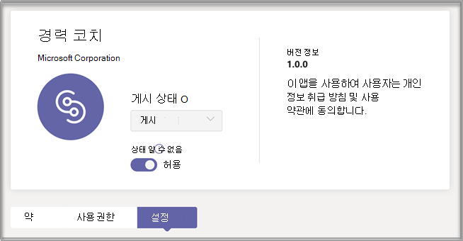
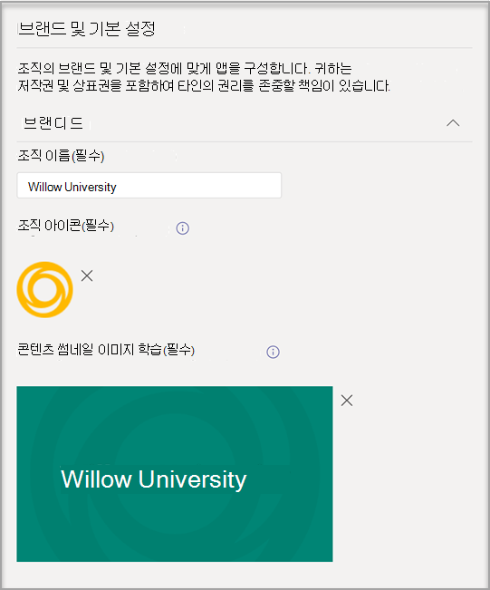
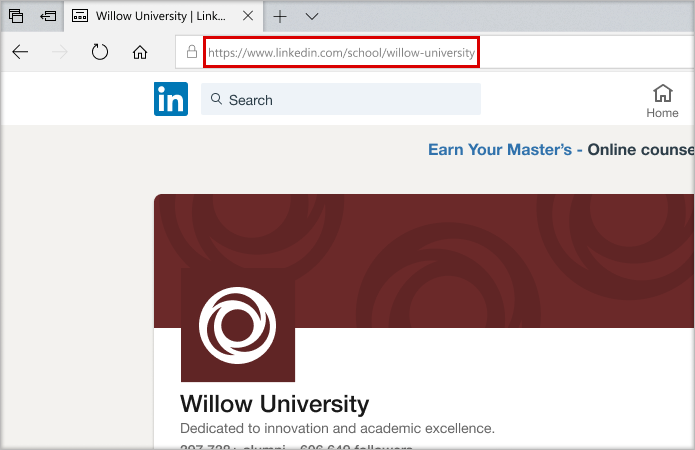
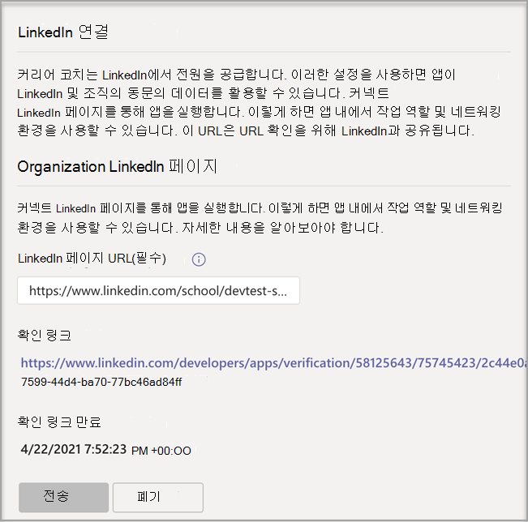

# 구매, 구성 및 커리어 코치 사용 Microsoft Teams

커리어 코치 고등 교육 교육용 Microsoft Teams 탐색할 수 있는 개인 설정된 지침을 제공하는 LinkedIn에서 제공하는 다양한 앱입니다. 커리어 코치 교육 기관은 학생들이 자신의 진로를 검색하고, 실제 기술을 성장하고, 네트워크를 한 장소에서 구축할 수 있는 통합된 경력 솔루션을 제공합니다.

## 지원되는 언어

커리어 코치 언어는 다음 언어로 지역화됩니다.

- 중국어(중국 본토 간체)
- 중국어(중국어, 대만)
- 영어(미국)
- 영어(영국)
- 프랑스어(캐나다)
- 프랑스어(프랑스)
- 독일어(독일어)
- 일본어(일본)
- 포르투갈어(브라질)
- 스페인어(스페인)
- 스페인어(멕시코)

에 [대해 커리어 코치.](https://aka.ms/career-coach)

> [!TIP]
> 이 가이드의 모범 사례 및 유용한 팁을 사용하여 학생, 교직원 및 커리어 코치 기능을 사용할 수 있습니다. 빠른 계획 [가이드 문서를 참조하세요.](https://support.microsoft.com/office/c5d0b934-bfcf-4fe7-8a85-ba7bbb1b6ad4)

## 요구 사항 검토

교육 기관에 커리어 코치 활성화하려면 앱을 설치하고 실행하는 데 필요한 기능을 검토합니다.

**기술 요구 사항**

- Office 365 테넌트에 Azure Active Directory.

- Microsoft Teams.

- LinkedIn 계정 연결은 Azure Active Directory.

**라이선스**

- 교직원

- 학생

> [!IMPORTANT]
> 커리어 코치 구성을 완료하는 IT 관리자에게 교직원 라이선스를 할당해야 합니다.

**교육 기관의 데이터 및 파일**

- 교육 기관의 로고 및 그래픽 자산이 필요한 형식입니다.

- 코스 카탈로그 데이터입니다.

- 제공된 연구 필드 목록입니다.

- 교육 기관의 [LinkedIn 페이지 입니다.](https://www.linkedin.com/help/linkedin/answer/40133/differences-between-a-linkedin-page-for-a-school-and-company?lang=en)

- 교육 기관의 개인 정보 취급 방침 URL입니다.

- 교육 기관은 경력 서비스 및 학생 작업 게시(선택 사항)과 같은 경력 관련 리소스에 연결됩니다.

- LinkedIn Learning 캠퍼스 구독(기본 설정)입니다.

## 라이선스 커리어 코치 구입

커리어 코치 EES(등록용 EES), CSP(클라우드 서비스 공급자) 및 웹 직접(웹 직접)을 통해 자격을 갖춘 고등 교육 기관에 대한 추가 Microsoft 365 관리 센터 사용할 수 있습니다. 추가 Microsoft Teams 라이선스를 구입하려면 Microsoft 365 A3/A5 또는 Office 365 A1/A3/A5가 커리어 코치 있어야 합니다.

### 사용자에게 앱 라이선스 할당

단계별 지침은 사용자에게 라이선스 [할당을 참조하세요.](/microsoft-365/admin/manage/assign-licenses-to-users)

### LinkedIn 계정 연결 설정

커리어 코치 교육  기관의 사용자가 해당 Microsoft 365 내에서 용이하게 하는 LinkedIn 계정에 연결할 수 커리어 코치.

1. [Azure AD](https://aad.portal.azure.com/) 조직의 전역 관리자 계정으로 Azure AD 관리 센터에 로그인합니다.

2. 사용자를 **선택합니다.**

3. 사용자 **페이지에서** 사용자 **설정을 선택합니다.**

4. **LinkedIn 계정 연결을** 올바르게  구성하려면  예 또는 선택된 그룹으로 커리어 코치 설정해야 합니다.

   

   > [!NOTE]
   > 사용자가 자신의 계정을 연결하는 데 동의할 때까지는 데이터가 공유됩니다.

   - 예를 **선택하여** 교육 기관의 모든 사용자에 대해 서비스를 사용하도록 설정합니다.

   - 선택한 **그룹을** 선택하여 교육 기관에서 선택한 사용자 그룹에만 서비스를 사용하도록 설정합니다.

자세한 내용은 에서 [LinkedIn 계정 연결을 Azure Active Directory.](/azure/active-directory/enterprise-users/linkedin-integration)

## 앱 커리어 코치 액세스

교육 Microsoft Teams 관리 센터를 사용하여 교육 기관에 대한 커리어 코치 구성하고 사용자에 대해 사용하도록 설정합니다.

> [!IMPORTANT]
> 페이지에 액세스하려면 전역 관리자 또는 Teams 관리자 되어야 합니다.

1. 관리 **[센터에 Teams 로그인합니다.](https://admin.teams.microsoft.com)**

2. 왼쪽 탐색에서 앱 **관리 Teams**  >  **[선택합니다.](https://admin.teams.microsoft.com/policies/manage-apps)**  

3. 를 검색하거나 **커리어 코치.**  

4. 을 **커리어 코치** 을 선택한 다음 을 **설정.**  

    

## 앱 커리어 코치 구성

커리어 코치 5가지 구성 범주가 있습니다.

- [브랜드 및 기본 설정](#brand-and-preferences) - 필수

- [LinkedIn 연결](#linkedin-connection) - 필수

- [과정 카탈로그](#course-catalog) - 필수

- [연구 분야](#fields-of-study) - 필수

- [사용자 지정](#customization)

> [!IMPORTANT]
> 학생, 교직원 및 교직원을 위해 앱을  효과적으로 사용하도록 설정하려면 브랜드 및 기본 설정, LinkedIn 구성, 과정 카탈로그 및 학습 필드가 필요합니다.

### 브랜드 및 기본 설정

교육 커리어 코치 브랜드에 맞게 사용자 지정합니다. 귀하는 저작권 및 상표권을 포함하여 타인의 권리를 존중할 책임이 있습니다.

> [!IMPORTANT]
> 이 섹션은 필수 섹션입니다. 커리어 코치 기본 설정이 제출되지 않으면 사용할 수 없습니다.

1. 관리 **[센터에 Teams 로그인합니다.](https://admin.teams.microsoft.com)**

2. 앱 **Teams 앱 관리** 커리어 코치 및 기본 설정을  >  ****  >    >  **선택합니다.**

3. 업로드 **아이콘을 표시합니다.** 이 아이콘은 커리어 코치 교육 기관 고유의 콘텐츠를 식별하고, 앱 전체의 카탈로그 리소스 및 대시보드의 실제 환경 섹션에서 식별하는 데 사용됩니다. 아이콘은 다음으로 서식이 가장 잘 지정됩니다.

    - 투명한 PNG
    - 1:1의 화면 비율
    - 최대 크기 64 px x 64 px

4. 업로드 **썸네일을 추가합니다.** 특정 이미지를 코스에 사용할 수 없는 경우 썸네일은 앱 전체의 코스 카탈로그 리소스에 사용됩니다. 축소판 그림은 다음 형식으로 가장 잘 서식이 지정됩니다.

    - A PNG
    - 16:9의 화면 비율
    - 최대 크기 360 px x 200 px

5. 교육 기관의 개인 정보 취급 **방침 URL을 추가합니다.** 추가된 경우 학생이 해당 앱에서 검토할 수 있도록 기관의 개인 커리어 코치 있습니다.

6. 제출을 **선택합니다.**

### LinkedIn 연결

LinkedIn 구성은 LinkedIn의 공용 커리어 코치 데이터와 연결합니다.

> [!IMPORTANT]
> 이 섹션은 필수 섹션입니다. 커리어 코치 연결 확인 없이는 사용할 수 없습니다.

#### LinkedIn 페이지 추가
  
1. 관리 **[센터에 Teams 로그인합니다.](https://admin.teams.microsoft.com)**

2. 연결된 **Teams** 앱 관리  >  ****  >  **커리어 코치**  >  **앱을 선택합니다.**

3. LinkedIn에서 검색하고 학교 필터를 선택하여 LinkedIn 페이지를 찾을 **수** 있습니다. 또는 커리어 서비스 교직원과 연결하여 사용할 올바른 LinkedIn 학교 페이지를 확인합니다. 자세한 내용은 LinkedIn 페이지를 [식별하는 방법을 참조하세요.](https://www.linkedin.com/help/linkedin/answer/40133/differences-between-a-linkedin-page-for-a-school-and-company?lang=en)

    

4. LinkedIn 학교 페이지 URL을 추가합니다. URL은 회사 페이지가 아닌 학교 페이지 되어야 합니다. 일반적으로 으로 서식이 `https://www.linkedin.com/school/willow-university/` 지정됩니다.

   

5. 제출을 **선택합니다.**
#### LinkedIn 페이지 확인 

> [!IMPORTANT]
> 인증은 교육 기관의 LinkedIn 페이지 슈퍼 관리자가 완료해야 합니다.

1. 성공적으로 제출하면 페이지가 업데이트되어 확인 링크  및 확인 **링크 만료가 표시됩니다.** 확인 링크는 30일 후에 만료됩니다.

     

2. 확인 링크를 복사하여 교육 기관의 LinkedIn 페이지 슈퍼 관리자와 공유합니다. LinkedIn 페이지 관리자 설명서의 LinkedIn 페이지 슈퍼 관리자 역할에 [대해 자세히 알아보십시오.](https://www.linkedin.com/help/linkedin/answer/102672)

3. LinkedIn 페이지 슈퍼 관리자는 고유한 확인 링크를 사용하여 학교의 커리어 코치 연결합니다. 자세한 내용은 LinkedIn 페이지 [확인에 대한 추가](https://www.linkedin.com/help/linkedin/answer/102672) 설명서를 참조하세요.

   

### 과정 카탈로그

코스 카탈로그는 교육 기관에서 학생들에게 제공하는 과정 및 수업을 나타내고 있습니다.

> [!IMPORTANT]
> 이 섹션은 필수 섹션입니다. 커리어 코치 카탈로그 없이는 사용할 수 없습니다.

이러한 과정은 다음 두 영역에서 앱 내에서 사용됩니다.

- 교육 과정은 학습 리소스의 일부로 반환됩니다.  

- 설명과 같은 코스 및 코스 메타 데이터는 학생들이 성적 증명서를 업로드할 때 자신의 기술을 식별하는 데 사용됩니다.  

과정 카탈로그를 만들하려면 교육 기관에서 학습한 모든 과정 목록을 함께 작성하고 CSV 파일로 업로드합니다. 앱은 코스 카탈로그에서 학생의 기술을 자신의 성적표에서 식별하고 수강할 강좌를 제안합니다.

#### 과정 카탈로그 추가

1. 관리 **[센터에 Teams 로그인합니다.](https://admin.teams.microsoft.com)**

1. 앱 **Teams 앱** 관리 커리어 코치 설정 &gt; **** &gt;  &gt;  &gt; **선택합니다.**  

2. 업로드, 제목 및 sourceLink와 같은 필수 열이 있는 CSV 형식으로 코스를 제공합니다. 각 행에는 필요한 각 열에 대한 데이터가 포함되어야 합니다. _권장 필드를 포함하면 더 나은 검색 결과 및 기술 식별을 반환하여 학생들의 환경을 개선할 수 있습니다._

4. 제출을 **선택합니다.**

   

#### 코스 카탈로그 문서 형식 및척도

문서는 최대 크기가 18MB인 CSV 형식으로 작성해야 합니다. 문서에는 필수 필드 코스 **제목,** 코스 **ID** 및 **과정 URL이 포함되어 있어야 합니다.** 

> [!TIP]
> 샘플 코스 [카탈로그 문서로]( https://aka.ms/career-coach/docs/it-admins/sample-catalog) 시작하여 적절한 서식을 보장합니다. _권장 필드를 포함하면 더 나은 검색 결과 및 기술 식별을 반환하여 학생들의 환경을 개선할 수 있습니다._

다음 표에서는 코스 카탈로그에 포함할 항목을 보여 주었다.

| 이름             | 상태      | 유형   | 설명                                                                    |
|------------------|-------------|--------|--------------------------------------------------------------------------------|
| courseId         | 필수    | string | 일반적으로 코스 ID(일반적으로 성적 스크립트에서 생성된 것)에 매핑됩니다. |
| 타이틀            | 필수    | string | 일반적으로 코스 제목입니다.                                                      |
| sourceLink       | 필수    | URL    | 코스 페이지에 대한 웹 사이트 링크입니다.                                               |
| 설명      | 권장 | string | 과정에 대한 소개 텍스트입니다.                                              |
| language         | 권장 | string | 과정의 언어입니다. 표준 언어 코드를 사용 합니다.                           |
| 형식           | 권장 | string | 교육 모드(온라인, 비디오, 개인)입니다.                                   |
| 축소판 그림링크    | 권장 | URL    | 과정 이미지에 대한 축소판 그림 링크입니다.                                            |
| 축소판 그림AltText | 권장 | string | 이미지에 대한 접근성 alt 텍스트                                           |
| educationLevel   | 권장 | string | 학습 수준, 예. 학부/졸업생.                                       |
| 토픽           | 권장 | string | 강의가 가르치는 기술과 관련된 토픽 또는 태그입니다.          |

### 연구 분야

연구 분야는 주요 관심 분야, 학업 전공 및 학위와 동의어입니다. 이러한 타이틀은 앱을 사용하여 개인 설정된 프로필을 설정하기 시작할 때 학생들이 참조합니다.

> [!IMPORTANT]
> 이 섹션은 필수 섹션입니다. 커리어 코치 목록 없이는 사용할 수 없습니다.

#### 연구 필드 추가

1. 관리 **[센터에 Teams 로그인합니다.](https://admin.teams.microsoft.com)**
1. Teams **앱 관리** 앱을 커리어 코치 설정 &gt; **** &gt;  &gt;  &gt; **필드를 선택합니다.**  

2. 업로드 형식의 학습 필드입니다.

3. 제출을 **선택합니다.**

#### 스터디 문서 형식 및척도 필드

공학, 영어, 비즈니스 등 학생들에게 사용할 수 있는 모든 학습 필드를 추가합니다. 필드 목록을 통해 학생들이 관심 있는 학습 영역을 검색하고 자신의 프로필에 포커스 영역을 추가할 수 있습니다.

> [!TIP]
> 적절한 [서식을](https://aka.ms/career-coach/docs/it-admins/sample-fieldsofstudy) 보장하기 위해 연구 문서의 샘플 필드로 시작합니다.

다음 표에서는 연구 필드에 포함할 항목을 보여 주었다.

| 이름          | 상태   | 유형   | 설명                    |
|---------------|----------|--------|--------------------------------|
| fieldsOfStudy | 필수 | string | 연구 필드의 이름 |

### 사용자 지정

커리어 코치 교육 기관 고유하도록 사용자 지정할 수 있습니다. 사용자 지정은 대시보드에 환경 추가를 지원합니다. 학생이 실제 경험을 쌓는 데 도움이 되는 작업 보드, 이벤트, 경력 서비스 사무실, 경력 관련 이벤트, 학생 클럽 및 기타 리소스에 대한 링크를 추가하는 것이 좋습니다.

#### 사용자 지정 환경 추가

1. 관리 **[센터에 Teams 로그인합니다.](https://admin.teams.microsoft.com)**

1. 사용자 **Teams 앱** 관리 커리어 코치 설정 &gt; **** &gt;   >   &gt; **선택합니다.**

2. 각 제목, URL 및 간략한 설명을 추가합니다.  
  
3. 제출을 **선택합니다.**

## 조직에서 커리어 코치 사용할 수 있도록 설정

이제 커리어 코치 구성했습니다. 다음 단계를 수행하여 커리어 코치 조직에서 사용할 수 Microsoft Teams.

### 앱 사용

구성을 완료한 후 학생 및 라이선스가 부여된 사용자에 대해 앱을 사용하도록 설정하여 사용자가 사용자에 대한 액세스 권한을 커리어 코치.  
  
> [!IMPORTANT]
> 전역 또는 관리자 Teams 권한이 있어야 합니다.

1. 관리 **[센터에 Teams 로그인합니다.](https://admin.teams.microsoft.com)**

1. 앱 **Teams 관리** &gt; **[앱을](https://admin.teams.microsoft.com/policies/manage-apps)** &gt; **커리어 코치.**

2. 상태 토글을 허용 **으로 이동합니다.**  

   > [!NOTE]
   > **허용되는** 것은 교육 기관의 사용자가 앱을 사용할 수 있습니다. 차단된 것은 학생이 앱을 사용할 수 없습니다.

### 설치된 커리어 코치 앱으로 추가

> [!IMPORTANT]
> 이 단계에서는 조직에 커리어 코치 올바르게 구성하고 학생이 조직에 대한 정보를 커리어 코치.

1. 관리 **[센터에 Teams 로그인합니다.](https://admin.teams.microsoft.com)**

2. 앱 **Teams 설정** 정책을 선택하고 기본 정책을 &gt;  선택합니다.
어떤 정책을 사용할지 Microsoft Teams 정책 관리 설명서를  참조하거나 교육 정책 마법사를  사용하여 정책을 구성할 수 Microsoft Teams.

3. 설치된 앱에서 앱 **추가 를 선택합니다.**

4. 설치된 앱 추가 창에서 사용자가 앱을 시작할 때 자동으로 설치하려는 앱을 Teams. 앱 사용 권한 정책에 따라 앱을 필터링할 수 있습니다. 앱 목록을 선택한 경우 추가를 **선택합니다.**

5. **저장** 을 선택합니다.

> [!NOTE]
> 변경 내용이 적용될 수 있는 데는 정책을 편집하거나 할당하는 데 몇 시간이 걸릴 수 있습니다. 커리어 코치 앱이 변경이 완료될 때까지 Microsoft Teams 사용할 수 없습니다.

### 앱 고정

커리어 코치 고정하면 학생들이 앱을 더 쉽게 접근하고 볼 수 있습니다.

1. 관리 **[센터에 Teams 로그인합니다.](https://admin.teams.microsoft.com)**

2. 앱 **Teams 설정** 정책을 선택하고 기본 정책을 &gt;  선택합니다.
어떤 정책을 사용할지 Microsoft Teams 정책 관리 설명서를  참조하거나 교육 정책 마법사를  사용하여 정책을 구성할 수 Microsoft Teams.

3. 고정된 **앱 아래에서** 앱 **추가를 선택하세요.**

4. 를 **커리어 코치** 을 검색한 다음 **추가를 선택합니다.**

5. 앱이 나타날 순서를 선택하고 저장을 **선택합니다.**

> [!NOTE]
> 학생은 고정된 Microsoft Teams 커리어 코치 알림을 하게 될 것입니다.

자세한 [내용은 Microsoft의](/microsoftteams/teams-app-setup-policies) 앱 설정 정책 관리에 대한 참조입니다.

## 문제 해결

- 커리어 코치 앱에 "현재 사용할 수 있는 커리어 코치 설정 중"이 표시될 경우 필요한 섹션이 완료되지 __않은 것입니다.__ 브랜드 및 __기본__ 설정, [LinkedIn](#linkedin-connection)연결커리어 코치 과정 카탈로그 및 연구 필드를 사용하려면 먼저 다음 섹션을 [완료해야 합니다.](#fields-of-study)

- 코스 카탈로그 및 학습 필드에 대한 CSV에는 필수 형식과 최대 크기가 18MB입니다. 적절한 커리어 코치 보장하기  위해 커리어 코치 카탈로그 문서 커리어 코치  필드를 참조합니다.

- 필수 필드가 있는 설정 페이지에서 필드가 완료되지 않은 경우 페이지가 제출되지 않습니다. 경고 메시지가 표시되지 않습니다. 페이지는 제출하지 않습니다.

- 처음 커리어 코치 경우 "앱의 설정을 업데이트할 수 없습니다."라는 오류 배너가 나타날 수 있습니다. 다시 시도하세요." 이는 테넌트가 커리어 코치 프로비전하기 때문에 최대 15분이 걸릴 수 있습니다. 이 경우 다시 제출하기 전에 15분 정도 기다립니다.

- 커리어 코치 앱이 Microsoft Teams 경우 정책 변경이 적용되지 않을 수 있습니다. 정책 변경 내용을 업데이트하는 데 몇 시간이 걸릴 수 있습니다. 커리어 코치 앱이 변경이 완료될 때까지 Microsoft Teams 사용할 수 없습니다.

## 테넌트 데이터 제거

테넌트 데이터에는 애플리케이션 구성의 일부로 업로드되거나 생성된 정보가 포함됩니다. 테넌트 내의 커리어 코치 테넌트의 전역 관리자가 테넌트의  데이터를 영구적으로 삭제할 것을 요청하는 지원 티켓을 열게 합니다. 이 프로세스는 되버전할 수 없습니다. 데이터 제거가 완료되면 커리어 코치 애플리케이션이 모든 사용자에 대해 미리 구성된 비개인 상태로 반환되고, Teams 관리자는 계속 사용하려면 애플리케이션을 다시 설정해야 합니다.

다음은 지우기 프로세스에 대해 설명하는 것입니다.

- 테넌트의 데이터를 영구적으로 삭제하기 위한 요청을 명확하게 설명하는 테넌트 전역 관리자가 지원 티켓을 제출해야 합니다. 데이터 집합 또는 지우기 시간 창을 제한할 **수 없습니다.**

- 제출된 후 지원 티켓은 규정 준수의 최소 보존 정책을 충족하기 위해 1주일 후에 해결됩니다. 이 기간 동안 작업을 취소할 수 있습니다.

- 1주일 후에 커리어 코치 팀에서 테넌트와 관련된 모든 데이터가 삭제되도록 합니다. Microsoft 지원은 티켓을 모니터링하고, 지우기 프로세스가 완료되면 **30일이** 넘지 않습니다.

## 리소스

다음 리소스는 앱을 계획하는 데 커리어 코치 있습니다.

- [Microsoft Teams에 오신 것을 환영합니다.](Teams-overview.md)

- [Teams를 배포하는 방법](get-started-with-teams-resources-for-org-wide-rollout.md?tabs=SmallBusiness)

- [Microsoft Teams의 Teams 및 채널 개요](teams-channels-overview.md)

- [관리 센터에서 앱 Microsoft Teams 관리](manage-apps.md)

- [온라인 가상 방향 키트](https://www.microsoft.com/education/remote-learning/virtual-orientation)

- [채널의 제한 및 Teams 사양](limits-specifications-teams.md)

- [관리자 교육을 시작하기 Microsoft Teams](ITAdmin-readiness.md)

- [Teams 문제 해결](/microsoftteams/troubleshoot/teams-welcome)

- [Microsoft Teams에서 앱 사용 권한 정책 관리](teams-app-permission-policies.md)
