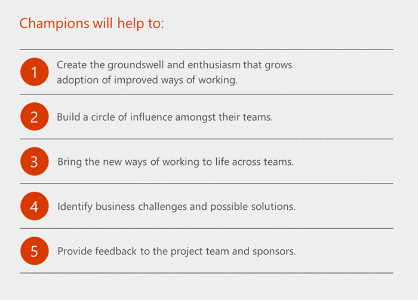

Microsoft Teams에 대한 변경 관리 전략 만들기Create a change management strategy for Microsoft Teams
=======================================================

최종 사용자 인식 및 새 기술 도입을 위한 변경 관리 전략은 조직의 모든 새 기술을 성공적으로 출시하는 데 중요합니다.A change management strategy for end-user awareness and adoption of new technologies is critical to the successful rollout of any new technology in an organization. 이러한 노력이 성공적으로 완료된 경우 사용자가 새로운 환경을 채택하고 만족할 수 있습니다.Successful completion of this effort will ensure user adoption and satisfaction of the new experience.  아래에서 식별된 단계는 조직의 크기에 따라 변경될 수 있지만 관계자, 챔피언, IT 관리자 및 사용자와의 지속적인 통신 수준을 보장하는 것이 성공적인 변경을 위한 핵심입니다.The steps identified below can be altered depending on the size of your organization but ensure a sustained level of communication with stakeholders, champions, IT adminstrators, and users is key to landing a successful change.  

Teams의 변경 관리 모범 사례:Best practices for change management for Teams:

1.  주요 관련자, 챔피언 및 사용자 프로필 식별Identify your key stakeholders, champions, and user profiles

2.  비즈니스 & 선택에 대한 식별Identify & select your business scenarios

3.  비즈니스 사용자, 챔피언 및 IT 전문가가 포함된 파일럿을 수행합니다.Conduct a pilot that includes business users, champions, and IT professionals.  

4.  채택 캠페인을 디자인, 시작 및 관리합니다.Design, launch and manage your adoption campaign. 고객 성공 [키트를](https://aka.ms/TeamsSuccessKit) 시작점으로 다운로드합니다.Download our [Customer Success Kit](https://aka.ms/TeamsSuccessKit) as a starting point. 좋은 채택 캠페인에는 다음이 포함됩니다.A good adoption campaign includes:

    a.a.  포스터, 디지털 서명, 이벤트와 같은 내부 인식 자료Internal awareness materials such as posters, digital signage, and events

    b.b.  단일 위치에서 자체 도움말 및 교육 정보Self-help and training information in a single location

    c.c.  정의된 피드백 메커니즘A defined feedback mechanism

    d.d.  미리 정의된 성공 측정값(솔루션 채택, 주요 자료 보기, 과정 참석)Pre-defined success measures (solution adoption, views of key materials, attendance at courses)

4.  서비스 배포와 함께 챔피언 프로그램 빌드Build a champion program alongside your service deployment

5.  표준 피드백 방법 제공Provide a standard feedback method

6.  공유 & 측정Measure & share success

7.  피드백에 따라 메시징 및 메서드를 조정하고 반복합니다.Adjust your messaging and methods based on feedback, repeat.

주요 관련자, 챔피언 및 사용자 프로필 식별Identify key stakeholders, champions, and user profiles
-----------------------------------------------

성공적인 채택의 첫 번째 규칙은 주요 이해 관계자와 다른 사람이 변경을 주도하고 효과를 내는 데 적합한 사람으로 구성된 동적 팀을 만드는 것입니다.The first rule of a successful adoption is to create a dynamic team comprised of key stakeholders and the right people that can drive and effect change in others. 성공적인 채택 전략은 조직의 교차 섹션을 나타내는 커밋된 개인 팀에서 시작됩니다.A successful adoption strategy starts with a team of committed individuals representing a cross-section of your organization. 주요 관련자 역할에는 임원 후원자, 서비스 소유자, IT 전문가 및 챔피언이 포함됩니다.Key stakeholder roles include an Executive Sponsor, Service Owners, IT professionals, and Champions.

|아이콘Icon  |설명Description  |
|---------|---------|
|     |**임원 후원사는** 조직 내 핵심 리더로, 직원 채택을 구동하는 데 반드시 참여해야 합니다.**Executive Sponsors** are key leaders within the organization and their participation is essential in driving employee adoption. 회사 문화에 가장 큰 영향을 미치고 새로운 기술과 방식의 가치와 이점을 적극적으로 전달할 수 있습니다.They have the greatest influence on company culture and can actively communicate the value and benefits of a new technology and way.         |
|     |**서비스 소유자는** 사용자가 서비스를 사용하여 가치를 얻을 수 있도록 보장할 책임이 있습니다.**Service Owners** are responsible for ensuring people use the service and get value from it. 조직 내에서 서비스 소유자를 설정하는 것은 Microsoft 365 또는 Office 365에 대해 설정된 비즈니스 목표를 실현하는 데 중요합니다.Setting Service Owners within your organization is important to ensure the business goals set for Microsoft 365 or Office 365 are realized.         |
|     |조직 전체의 모든 사용자로부터 구매를 얻는 것은 과제입니다.Gaining buy-in from every user across an organization is a challenge. **챔피언은** 이 문제를 해소하고 Microsoft 365 또는 Office 365를 채택하는 데 중요한 역할을 할 수 있습니다.**Champions** can help alleviate this challenge and play an important role in the adoption of Microsoft 365 or Office 365. 지식이 있으며 전문성을 강화하기 위해 전담하며 동료 코칭과 지원을 제공하겠다.They are knowledgeable, committed to furthering their expertise and are willing to provide peer coaching and assistance. Microsoft 365 또는 Office 365를 부서나 팀의 현실로 변환하는 데 도움이 됩니다.They help translate Microsoft 365 or Office 365 into the reality of their department or team.         |

이러한 이해 관계자의 정기 모임을 통해 프로그램 진행 상황을 최신으로 유지하는 것이 좋습니다.We recommend a regular meeting of these stakeholders to keep them up to date on the progress of your program. "공동 작업 위원회"를 시작하여 피드백과 토론을 허용하는 것은 회사 문화에 따라 유용한 도구가 될 수 있습니다.Initiating a "collaboration council" to allow for feedback and discussion can be a useful tool depending on your corporate culture.

> [!TIP]
> 변화에 가장 큰 장애물이 될 수 있는 사람들은 이러한 종류의 배포에서 최고의 아우라가 될 수 있습니다.Those people who may be the biggest obstacles to change can become your best allies in a deployment of this kind. 이러한 조직의 구성원과 조기 및 자주 의견을 들을 것을 권장합니다.We encourage you to engage with these members of your organization early and often to hear their concerns and issues. 캠페인을 더 성공적으로 진행할 수 있는 소중한 피드백이 있는 경우가 종종 있습니다.Often, they have valuable feedback that will make your campaign more successful.

사용자 프로필User profiles
-------------

사용자 환경의 사용자 유형을 이해하는 것이 동일하게 중요합니다.It is equally important to understand the types of users in your environment. 주로 모바일인 사용자가 있나요?Do you have users who are primarily mobile? 일정한 모임에 참석하거나 프레젠테이션을 진행하는 사람도 있나요?Some who are in constant meetings or giving presentations? 어떤 사용자가 기존 공동 작업 솔루션에 가장 어려움을 겪고 있는지 알고 있나요?Do you know which of your users have the most difficulty with your existing collaboration solutions? 사용자 커뮤니티를 분할하면 변경할 수 있는 그룹을 찾는 데 도움이 될 수 있습니다.Segmenting your user community can help you find groups that are most open to change. 초기 비즈니스 파일럿에게 가장 좋은 목표인 경우가 종종 있으며 피드백은 매우 소중합니다.They are often the best targets for your early business pilots and their feedback is extremely valuable.

사용자의 수명에서 하루를 이해하면 비즈니스 결과의 우선 순위를 지정하고, 배포에 적합한 채택 목표를 설계하고, 시간이 지날 때 사용량을 지속하는 데 도움이 됩니다.Understanding the day in the life of your users will help you to prioritize your business outcomes, design adoption goals appropriate for your deployment and sustain usage over time.

챔피언Champions
---------

공동 작업 챔피언이 될 수 있는 개인을 식별하면 구현을 위한 확장된 지원 팀을 제공합니다.Identifying the individuals who can become your collaboration champions provides you with an extended support team for your implementation. 계획에 대한 초기 인사이트와 피드백을 제공하여 커뮤니티를 만들 수 있습니다.Create a community by providing them early insight and feedback to your plans. 시간, 주의 또는 보상이든 이 커뮤니티에 투자하는 모든 투자는 지원 및 전도로 구현에 반환됩니다.Any investment you make in this community whether it be time, attention or rewards will be returned to your implementation through their support and evangelism.

챔피언 프로그램을 빌드하는 방법을 알아보고 챔피언 프로그램을 [빌드합니다.](https://go.microsoft.com/fwlink/?linkid=854665)To learn about building a champion program, get [Build a champion program](https://go.microsoft.com/fwlink/?linkid=854665).

비즈니스 시나리오 식별 및 선택Identify and select your business scenarios
---------------------------------------------------------------

주요 이해 관계자와 사용자 세그먼트를 식별하면 비즈니스 시나리오를 훨씬 쉽게 식별할 수 있습니다.Once you have identified your key stakeholders and user segments, identifying your business scenarios will be that much easier. 다음은 비즈니스 결과의 몇 가지 예입니다.Here are a few examples of business outcomes:

-   영업 프로세스 간소화Simplify the sales process

-   고객 문제에 대한 빠른 해결Speed resolution for customer issues

-   직원 참여도 높이기Increase employee engagement

-   제품 개발 주기 단축Shorten product development cycles

영업 팀원들이 좋은 환경을 제공하기 위해 조정하는 데 문제가 있나요?Are your sales people having trouble coordinating to provide a great experience? 제품 또는 서비스를 제공하는 데 더 나은 조정이 필요한가요?Do you need to have better coordination in delivering your product or service? 직원을 위한 HR(인적 자원) 관련 환경은 어떻게 될까요?What about human resources (HR) related experiences for your own employees? 각 조직은 자신의 우선 순위를 찾을 수 있습니다.Each organization will find their own priorities. 초기 파일럿에서 해결하고 해당 특정 조직의 사용자 및 비즈니스 전문가를 포함하여 3명 이상을 선택하는 것이 좋습니다.We recommend selecting no more than three to address in your initial pilots and including users and business professionals from those specific organizations. 

또한 이러한 시나리오에 포함된 사용자를 고려하는 것이 좋습니다.It's also wise to consider the users who are embedded in these scenarios. 변경이 열려 있나요?Are they open to change? 모바일 사용자인가요 아니면 시설 내에 있나요?Are they mobile users or within your facility? 이러한 변화를 전도하는 데 사용할 수 있는 기존 커뮤니티 및 커뮤니케이션 방법이 있는 경영진 후원 및 챔피언의 허브에 얼마나 가깝나요?How close are they to the hub of the executive sponsors and champions that will support them and do they have any existing community and communications methods you can use to evangelize this change?  

기술 프로젝트는 사람 변경 관리 요구 사항에 거의 또는 아무 주의도 기울이지 않는 경우 과제가 됩니다.Technology projects become challenged when little or no attention is paid to the human change management requirements. 이러한 권장 사항을 따라 성공할 가능성이 향상됩니다.By following these recommendations, you will enhance your chances for success!

채택 캠페인 디자인, 시작 및 관리Design, launch, and manage your adoption campaign
-------------------------------------------------

초기 파일럿과 최종 회사 전체 롤아웃 모두 내부 통신이 우선 순위가 됐습니다.For both your initial pilots and your eventual company-wide roll out, your internal communications should be a priority. 여기에는 다음이 포함됩니다.They include:

-   포스터, 디지털 서명 및 이벤트와 같은 내부 인식 자료입니다.Internal awareness materials such as posters, digital signage and events.

-   단일 위치에 자가 도움말 및 교육 정보를 통합합니다.Incorporate self-help and training information in a single location.

파일럿 단계의 경우 성공을 위한 최소 단계입니다.For your pilot phases these are the minimum steps for success:

-   업데이트에 대한 프로젝트 이해 관계자와 정기적으로 예약된 모임을 하세요.Have a regular scheduled meeting with your project stakeholders for updates.

-   파일럿에 참여하는 사용자로부터 정보를 수집하는 피드백 방법을 선택하세요.Pick a feedback method to gather information from people participating in the pilot. 소규모 조직에서는 Teams 내의 공개 채널을 사용하여 사용자가 참여하고 피드백을 제공할 수 있습니다.Smaller organizations can use a public channel within Teams to allow users to join and provide feedback. 대규모 조직에서는 제품 지원을 제공하기 위해 Yammer 커뮤니티를 시작해 보아야 합니다.In larger organizations, consider launching a Yammer community to provide product support.  

-   제품 비디오를 포함하여 자가 도움말 설명서를 사용할 수 있도록 합니다.Make self-help documentation available, including product videos.

-   파일럿 사용자와 킥오프 모임을 열고 참가자의 참여를 기대하게 합니다.Hold a kick-off meeting with the pilot users to get them excited about their participation. 열의로 커뮤니티를 만드는 데는 평가를 할 수 없습니다.Creating a sense of community with enthusiasm can't be underrated.

초기 파일럿 단계를 완료한 후 위의 단계를 확장하여 전체 조직에 도달할 수 있습니다.Once you have worked through the initial pilot phases, the steps above can be expanded to reach your entire organization. 크기에 따라 시간이 걸릴 수 있으며 지역, 사용자 프로필 또는 조직별로 단계별로 접근할 수 있습니다.Depending on your size this may take time and be approached in phases by region, user profile or organization. 이 대규모 롤아웃 내에서 조직의 의사 소통자 전문 인재를 활용하는 것은 매우 유용합니다.Within this larger scale roll out leveraging the professional talent of the communicators in your organization is extremely helpful. 이러한 개인은 사용 가능한 채택 자료를 활용하거나  직접 디자인할 때 조기 및 자주 참여하는 것이 좋습니다.We recommend these individuals be involved early and often as you utilize the [available adoption materials](https://go.microsoft.com/fwlink/?linkid=854598) or design your own.

회사에 뉴스, 정보 또는 지원에 대한 중앙 인트라넷 포털이 있는 경우 이 롤아웃에 대한 정보를 허브로 활용할 수 있습니다. 널리 사용 가능한 자가 도움말 정보, 교육 및 서면 지침을 제공하면 사용자가 제품에 빠르게 온보드할 수 있습니다.If your company has a central intranet portal for news, information or support you can utilize this as a hub for information on this roll out. Providing widely available self-help information, training and written guidance will enable users to quickly onboard to the product. 많은 사용자가 사용 가능해지고 나면 바로 바로 참여할 수 있습니다.Many users will simply jump in once it becomes available and we encourage this. 또한 각 개인이 다양한 방식으로 학습하는 것을 알고 있으므로 중앙 정보 포털이 있는 경우 조직 내에서 모든 스타일의 학습을 지원할 수 있습니다.We also know that each individual learns in different ways – so having a central information portal will support all styles of learning within your organization.

채택 캠페인과 & 앞에서 성공 측정값을 식별할 수 있습니다.As with any communications & adoption campaign you will want to identify your success measures up front. 다음과 같은 조치를 고려합니다.Consider measures like:

-   제품의 활성 사용자Active users in the product

-   정보 웹 페이지 보기Views of your information webpages

-   사용자 커뮤니티의 질문Questions in your user community

-   교육 비디오 보기Views of your training videos

-   학습 이벤트 참석Attendance at learning events

성공 측정 및 공유Measure and share success
-------------------------------------------------

프로젝트 팀은 조직의 IT 관리자입니다.On your project team should be IT administrators from your organization. 이러한 개인은 Microsoft 365 관리 센터 환경으로 기본 제공되는 Microsoft 365 또는 Office 365 Microsoft Teams 사용 보고서에 액세스할 수 있습니다.These individuals will have access to the Microsoft 365 or Office 365 Microsoft Teams usage reports that are built into the Microsoft 365 admin center experience. 이 정보는 회사의 Microsoft Teams 사용량을 보여 줍니다.This information can show the usage of Microsoft Teams in your company. 또한 Teams의 경험과 사용할 추가 아이디어에 대한 사용자로부터 직접 피드백을 보는 것이 좋습니다.We also recommend getting feedback directly from your users about their experience of Teams and additional ideas they have for use. 사용자 회사 내에서 이러한 실제 예제를 공유하는 것은 사용자 커뮤니티와 시간이 지날 때 지속적인 변화를 이행하는 데 매우 가치가 있습니다.Sharing these real world examples from within your own company is extremely valuable to landing sustained change over time with your user community.  

Microsoft 365 관리 센터에서 Microsoft Teams 사용 현황 보고서에 대해 자세히 [알아보십시오.](https://support.office.com/article/Office-365-Reports-in-the-Admin-Center-Microsoft-Teams-user-activity-07f67fc4-c0a4-4d3f-ad20-f40c7f6db524)Learn more about the Microsoft Teams usage reports in the Microsoft 365 admin center [here](https://support.office.com/article/Office-365-Reports-in-the-Admin-Center-Microsoft-Teams-user-activity-07f67fc4-c0a4-4d3f-ad20-f40c7f6db524)

> [!TIP]
> 공용 팀 또는 Yammer 커뮤니티를 사용하여 사용 현황 정보를 수집합니다.Use your public team or Yammer community to gather usage insights. 쉽게 검색할 수 있도록 #TeamsStories 태그를 사용하여 공유합니다.Share them using a #TeamsStories tag for easy retrieval.  인트라넷에서 #TeamsStory 월별 정보를 공유하여 환경에서 생산성과 공동 작업을 향상하기 위해 변경을 포용하는 직원을 강조합니다.Share a #TeamsStory per month on your intranet to highlight employees who are embracing the change to increase productivity and collaboration in your environment.  

## 지속적인 채택Ongoing adoption

조직에서 변경을 주도하는 것은 이벤트가 아닌 지속적인 활동입니다.Driving change in an organization is an ongoing activity, not an event. 킥오프 모임은 사람들이 보다 효과적으로 공동 작업할 수 있는 시작일 뿐입니다.Your kick-off meeting is only the beginning of empowering people to collaborate more effectively. IT 부서에서 개발할 전체 Microsoft 365 또는 Office 365 서비스 전략에 연결하여 성공을 강조하고, 새로운 기능을 도입하고, 연결되는 이 여정의 순간을 계획하는 것이 중요합니다.It's important to plan moments in this journey that highlight your successes, introduce new features, and connect with your overall Microsoft 365 or Office 365 service strategy - which your IT department will craft. 사용자가 과부하가 아닌 참여를 보장하면 변경의 피로를 줄이고 전자 메일 첨부 파일과 같은 이전 습관을 유지하여 클라우드에 문서를 저장하는 등 새로운 것을 받아들이는 데 도움이 됩니다.Ensuring that your users are engaged rather than overwhelmed will reduce their change fatigue and support them in letting go of old habits - such as emailing attachments - to embrace something new, such as storing documents in the cloud.

Microsoft 기술 커뮤니티 사이트의 클라우드 채택 커뮤니티에서 Teams 및 Microsoft 365 또는 Office 365의 서비스 도입에 대한 질문을 공유하세요. Share your questions about service adoption of Teams and Microsoft 365 or Office 365 in the [Driving Adoption community](https://techcommunity.microsoft.com/t5/Driving-Adoption/ct-p/DrivingAdoption) on the Microsoft Technical Community site. 항상 여러분의 의견을 듣고 채택하는 데 도움을 주시고자 합니다.We always want to hear from you and help you in your adoption journey.  

