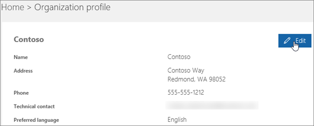

# 인사말 및 전자 메일의 기본 언어 변경Change the default language for greetings and emails

전역 [관리자인](https://support.office.com/article/da585eea-f576-4f55-a1e0-87090b6aaa9d)경우 기본 음성 비즈니스용 Skype 다른 언어로 재생할 수 있습니다.If you are a [global administrator](https://support.office.com/article/da585eea-f576-4f55-a1e0-87090b6aaa9d), you can set up Skype for Business to play its default voicemail greeting in another language. 기본 시스템 인사말은 "John Smith에 대한 메시지를 남겨 주세요.The default system greeting is something like, "Please leave a message for John Smith. 음색이 나면 메시지를 기록해 주세요.After the tone, please record your message. 녹화를 마쳤을 때 중단하거나 파운드 키를 눌러 더 많은 옵션을 선택합니다."When you finish recording, hang up, or press the pound key for more options."
  
 **먼저 다음 중요한 정보를 읽은 다음을 참조하세요.****First, read this important info:**
  
- 사용할 수 있는 언어는 조직의 위치에 **따라 결정됩니다.****The languages that are available to you are determined by the location of your organization**. 예를 들어 조직이 미국에 있는 경우 기본 언어를 영어 또는 스페인어로 설정할 수 있습니다.For example, if your organization is located in the United States, you can set the default language to English or Spanish. 조직이 캐나다에 있는 경우 영어와 프랑스어를 선택할 수 있습니다.If your organization is located in Canada, you can choose between English and French. 지원되는 언어 목록은 Teams 비즈니스용 Skype 다음을 참조하세요.For a list of supported languages in Teams and Skype for Business, see the following:
  - [Microsoft Teams 지원되는 언어Microsoft Teams supported languages](languages-for-voicemail-greetings-and-messages.md)
  - [비즈니스용 Skype 지원되는 언어Skype for Business supported languages](/skypeforbusiness/what-is-phone-system-in-office-365/phone-system-voicemail/languages-for-voicemail-greetings-and-messages)

- **개별 사용자의 음성 메일 인사말 및 음성 메일 메시지에 대한 언어를 변경합니다.****Changing languages for individual user's voicemail greeting and voicemail messages.** 사용자에 대한 기본 언어를 변경할 수 있습니다. 이 언어는 해당 음성 메일 인사말의 언어와 해당 사서함에 전송된 음성 메일 메시지의 언어를 Outlook 있습니다.You can change the preferred language for users, which will change the language of their voicemail greeting and voicemail messages sent to their Outlook mailbox. 자세한 내용은 에 대한 언어 및 지역 설정을 설정하는 [Microsoft 365 또는](/office365/troubleshoot/access-management/set-language-and-region)Office 365.For more information, see [How to set language and region settings for Microsoft 365 or Office 365](/office365/troubleshoot/access-management/set-language-and-region).

  > [!NOTE]
  > 사용자는 로그인한 후 설정을 통해 자신의 인사말 언어를 변경할 수 있습니다.Users can change their own greeting language through their settings after they sign in. 자세한 내용은 비즈니스용 Microsoft 365 표시 [언어 및 표준 시간대 변경을 참조하세요.](https://support.office.com/article/change-your-display-language-and-time-zone-in-microsoft-365-for-business-6f238bff-5252-441e-b32b-655d5d85d15b?ui=en-US&rs=en-US&ad=US)For more information, see [Change your display language and time zone in Microsoft 365 for Business](https://support.office.com/article/change-your-display-language-and-time-zone-in-microsoft-365-for-business-6f238bff-5252-441e-b32b-655d5d85d15b?ui=en-US&rs=en-US&ad=US)
  
- **보낸 음성 메일 메시지를 기록하고 싶나요?****Do you want to record your outgoing voicemail message?** 음성 [비즈니스용 Skype 및 옵션 확인을 참조하세요.](https://support.office.com/article/2deea7f8-831f-4e85-a0d4-b34da55945a8)See [Check Skype for Business voicemail and options](https://support.office.com/article/2deea7f8-831f-4e85-a0d4-b34da55945a8). Microsoft Teams - 사용자는 데스크톱 클라이언트 설정에서 음성 Teams [수 있습니다.](https://support.office.com/article/manage-your-call-settings-in-teams-456cb611-3477-496f-b31a-6ab752a7595f)For Microsoft Teams - Users can change their voicemail settings from the [Teams desktop client settings](https://support.office.com/article/manage-your-call-settings-in-teams-456cb611-3477-496f-b31a-6ab752a7595f)

- **음성 메시지 프롬프트 언어를 변경하고 싶나요?****Do you want to change the voicemail prompt language?** 비즈니스용 Skype - 프롬프트 언어 에서 새 [https://mysettings.lync.com/voicemail](https://mysettings.lync.com/voicemail) **언어를 선택합니다.**For Skype for Business -  [https://mysettings.lync.com/voicemail](https://mysettings.lync.com/voicemail) and choose a new language under **Prompt Language**. Microsoft Teams - 사용자는 데스크톱 클라이언트 설정에서 음성 Teams [변경할 수 있습니다.](https://support.office.com/article/manage-your-call-settings-in-teams-456cb611-3477-496f-b31a-6ab752a7595f)For Microsoft Teams - Users can change their voicemail greeting from the [Teams desktop client settings](https://support.office.com/article/manage-your-call-settings-in-teams-456cb611-3477-496f-b31a-6ab752a7595f)

## 조직의 모든 사용자에 대한 시스템 언어 변경Change the system language for everyone in your organization

1. 에서 [글로벌 관리자 계정으로](https://support.office.com/article/da585eea-f576-4f55-a1e0-87090b6aaa9d) [https://portal.office.com/adminportal/home](https://portal.office.com/adminportal/home) 로그인합니다.Sign in with your [global administrator](https://support.office.com/article/da585eea-f576-4f55-a1e0-87090b6aaa9d) account at [https://portal.office.com/adminportal/home](https://portal.office.com/adminportal/home).

2. Microsoft 365 관리 센터에서 **조직** 설정 설정  >    >  **를 선택하세요.**In the Microsoft 365 admin center, choose **Settings** > **Settings** > **Organization profile**.

     
  
3. 편집을 **선택 합니다.**Choose **Edit**.

    
  
4. 조직의 모든 사용자에 대한 **기본** 설정 언어 목록에서 언어를 선택합니다.Select a language from the **Preferred language** list for everyone in your organization.

5. 저장을 **선택 합니다.**Choose **Save**.

## 관리자에 대한 관련 문서Related articles for the admin

- [전화 시스템 및 통화 플랜Phone System and Calling Plans](calling-plan-landing-page.md)

- [통화 플랜 설정Set up Calling Plans](set-up-calling-plans.md)

- [전화 시스템 PSTN Microsoft 365 Office 365 PSTN 연결을 통해 비즈니스용 Skype 서버Plan Phone System in Microsoft 365 or Office 365 with on-premises PSTN connectivity in Skype for Business Server](/skypeforbusiness/skype-for-business-hybrid-solutions/plan-your-phone-system-cloud-pbx-solution/plan-phone-system-with-on-premises-pstn-connectivity)

## 관련 항목Related topics

- [비즈니스용 또는 비즈니스용 Microsoft 365 Office 365 표시 언어 및 표준 시간대 변경Change your display language and time zone in Microsoft 365 or Office 365 for Business](https://support.office.com/article/Change-your-display-language-and-time-zone-in-Office-365-for-Business-6f238bff-5252-441e-b32b-655d5d85d15b)

- [2010년](https://support.office.com/article/Add-a-language-or-set-language-preferences-in-Office-663d9d94-ca99-4a0d-973e-7c4a6b8a827d)이후의 언어 추가 또는 Office 설정 )[Add a language or set language preferences in Office 2010 and later](https://support.office.com/article/Add-a-language-or-set-language-preferences-in-Office-663d9d94-ca99-4a0d-973e-7c4a6b8a827d))

- [키보드 레이아웃 언어 사용 또는 변경Enable or change a keyboard layout language](https://support.office.com/article/Enable-or-change-a-keyboard-layout-language-1c2242c0-fe15-4bc3-99bc-535de6f4f258)
