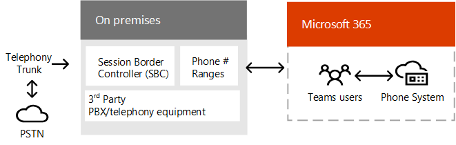

# 팀 음성 솔루션 계획Plan your Teams voice solution 

이 문서에서는 조직에 적합 한 Microsoft 음성 솔루션을 결정 하는 데 도움이 되는 정보를 안내 합니다.This article helps you decide which Microsoft voice solution is right for your organization. 이 문서에서는 선택한 솔루션을 구현 하는 데 사용할 수 있는 콘텐츠 로드맵을 제공 하기로 결정 했습니다.After you've decided, the article provides a roadmap to content that will enable you to implement your chosen solution. 

가장 간단한 솔루션 전화 시스템에는 통화 요금제를 사용 하는 것이 좋습니다 &mdash; .You might want the simplest solution&mdash;Phone System with Calling Plan. 다음 다이어그램과 같이 PBX (개인 브랜치 교환) 기능 및 PSTN (공개 교환 전화 네트워크)에 대 한 통화를 제공 하는 클라우드 솔루션입니다.This is Microsoft's all-in-the-cloud solution that provides Private Branch Exchange (PBX) functionality and calls to the Public Switched Telephone Network (PSTN), as shown in the following diagram. 이 솔루션을 사용 하는 경우 Microsoft는 PSTN 통신 회사입니다.With this solution, Microsoft is your PSTN carrier.

다음으로 질문에 대답 하는 경우에는 통화 요금제가 있는 전화 시스템을 적절 하 게 해결 하는 것이 좋습니다.If you answer yes to the following, then Phone System with Calling Plan is the right solution for you:

- 전화 요금제는 해당 지역에서 사용할 수 있습니다.Calling Plan is available in your region.
- 현재 PSTN 통신 회사를 유지할 필요는 없습니다.You do not need to retain your current PSTN carrier.
- PSTN에 대 한 Microsoft 관리 액세스를 사용 하려고 합니다.You want to use Microsoft-managed access to the PSTN.

그러나 상황이 복잡 해질 수 있습니다.However, your situation might be more complex. 예를 들어 전화 요금제를 사용할 수 없는 위치에 사무실이 있을 수 있습니다.For example, you might have offices in locations where Calling Plan isn't available. 또는 다양 한 지리적 위치에 대 한 요구 사항이 서로 다른 복잡 한 국내 배포를 지 원하는 조합 솔루션이 필요할 수 있습니다.Or you might need a combination solution that supports a complex, multi-national deployment, with different requirements for different geographic locations. Microsoft는 다음과 같은 솔루션의 조합을 지원 합니다.Microsoft supports a combination of solutions: 

- 통화 요금제가 포함 되어 있는 전화 시스템Phone System with Calling Plan
- 직접 라우팅이 있는 고유한 PSTN 캐리어가 있는 전화 시스템Phone System with your own PSTN carrier with Direct Routing
- 전화 시스템을 함께 사용 하 여 다이렉트 라우팅이 있는 통화 요금제와 전화 시스템을 사용한 조합 솔루션A combination solution that uses both Phone System with Calling Plan and Phone System with Direct Routing

## 읽어야 할 사항What do you need to read?

**모두에 필요 합니다.****Required for all.** 이 문서의 일부 섹션에서는 모든 조직과 관련 되어 있습니다.Some of the sections in this article pertain to all organizations. 예를 들어, 모든 사람이 전화 시스템에 대해 읽고 PSTN (공개 교환 전화 네트워크)에 연결 하는 옵션을 이해 해야 합니다.For example, everyone should read about Phone System and understand the options for connecting to the Public Switched Telephone Network (PSTN). 

| 모두에 필요 함Required for all | 설명Description |
| :------------|:-------|
| [**전화 시스템****Phone System**](#phone-system) | Microsoft 팀에서 microsoft 365 클라우드의 통화 제어 및 PBX (개인 브랜치 교환) 기능을 사용 하도록 설정 하기 위한 microsoft의 기술입니다.Microsoft's technology for enabling call control and Private Branch Exchange (PBX) capabilities in the Microsoft 365 cloud with Microsoft Teams. |
| [**PSTN (공개 통신 네트워크) 연결 옵션****Public Switched Telephone Network (PSTN) connectivity options**](#public-switched-telephone-network-connectivity-options) | 전화 통신 회사로 Microsoft를 사용 하거나 직접 라우팅을 사용 하 여 Microsoft 팀에 고유한 전화 통신 회사를 연결 하는 것 중에서 선택 합니다.A choice between using Microsoft as your telephony carrier or connecting your own telephony carrier to Microsoft Teams by using Direct Routing. 휴대폰 시스템과 결합 하 여 PSTN 연결 옵션을 통해 사용자는 전세계의 전화 통화를 할 수 있습니다.Combined with Phone System, PSTN connectivity options enable your users to make phone calls all over the world.|

**요구 사항에 따라****Depending on your requirements.** 이 문서의 일부 섹션은 기존 배포 및 요구 사항에 따라 관련이 있습니다.Some of the sections in this article are pertinent depending on your existing deployment and requirements. 예를 들어 Location-Based 라우팅은 수신자 부담을 허용 하지 않는 지리적 위치에서 직접 라우팅 고객에 게만 필요 합니다.For example, Location-Based Routing is only required for Direct Routing customers in geographic locations that do not allow toll bypass.

| 요구 사항에 따라Depending on your requirements | 설명Description |
| :------------|:-------|
| [**Microsoft의 전화 번호****Phone numbers from Microsoft**](#phone-numbers-from-microsoft) | Microsoft에서 전화 번호를 가져오고 관리 하는 방법과 기존 번호를 Microsoft로 전송 하는 방법을 설명 합니다.How to get and manage phone numbers from Microsoft, and how to transfer existing numbers to Microsoft. Microsoft 통화 요금제에 대 한 전화 번호를 얻고, 기존 번호를 전송 하 고, 서비스 번호를 얻어야 하는 등의 방법을 읽어 보세요.Read this if you need to obtain phone numbers for Microsoft Calling Plan, transfer existing numbers, obtain service numbers, and so on. |
| [**다이얼 플랜 및 통화 회람****Dial plans and call routing**](#dial-plans-and-call-routing) | 전화 접속 전화 번호를 대체 형식 (일반적으로 E. \ 164 형식)으로 변환 하는 다이얼 플랜을 구성 하 고 관리 하 여 통화 승인 및 통화 라우팅을 할 수 있습니다.How to configure and manage dial plans that translate dialed phone numbers into an alternate format (typically E.164 format) for call authorization and call routing. 다이얼 플랜을 파악 하 고 조직의 다이얼 플랜을 지정 해야 하는지 여부를 확인 하려면 다음을 읽어 보세요.Read this if you need to understand what dial plans are and  whether you need to specify dial plans for your organization.|
| [**비상 전화****Emergency calling**](#emergency-calling) | PSTN 연결 옵션에 따라 응급 통화를 관리 하 고 구성 하는 방법을 설명 &mdash; 합니다.How to manage and configure emergency calling&mdash;depending on your PSTN connectivity option. Microsoft 통화 계획 또는 직접 라우팅을 사용 중이 고 조직의 긴급 통화를 관리 하는 방법을 이해 해야 하는 경우이 섹션을 읽어 보세요.Read this section if you are using Microsoft Calling Plan or Direct Routing and need to understand how to manage emergency calling for your organization. |
| [**직접 라우팅에 대 한 위치 기반 라우팅****Location-Based Routing for Direct Routing**](#location-based-routing-for-direct-routing) |Location-Based 라우팅 (LBR)을 사용 하 여 Microsoft 팀 사용자가 자신의 지리적 위치를 기반으로 하는 유료 바이패스를 제한 하는 방법을 설명 합니다.How to use Location-Based Routing (LBR) to restrict toll bypass for Microsoft Teams users based on their geographic location. 조직에서 수신자 부담을 허용 하지 않는 위치에서 직접 라우팅을 사용 하는 경우이 섹션을 읽으십시오.Read this section if your organization is using Direct Routing at a location that does not allow toll bypass.
| [**클라우드 음성 기능에 대 한 네트워크 토폴로지****Network topology for cloud voice features**](#network-topology-for-voice-features) | 조직에서 직접 라우팅 또는 동적 비상 전화를 위해 LBR (Location-Based Routing)를 배포 하는 경우 Microsoft 팀에서 이러한 기능에 사용할 수 있도록 네트워크 설정을 구성 해야 합니다.If your organization is deploying Location-Based Routing (LBR) for Direct Routing or dynamic emergency calling, you must configure network settings for use with these features in Microsoft Teams. 직접 라우팅에 대 한 LBR을 구현 하는 경우 또는 호출 계획 또는 직접 라우팅과 함께 동적 비상 전화를 구현 하는 경우이 섹션을 참조 하세요.Read this section if you are implementing LBR for Direct Routing, or if you are implementing dynamic emergency calling with Calling Plan or Direct Routing. |
| [**기존 음성 솔루션 마이그레이션****Migrate your existing voice solution**](#migrate-your-existing-voice-solution-to-teams) | 음성 솔루션을 팀으로 마이그레이션할 때 고려해 야 할 사항What you need to think about when migrating your voice solution to Teams.  기존 음성 솔루션에서 팀으로 마이그레이션하는 경우이 섹션을 참조 하세요.Read this section if you are migrating from an existing voice solution to Teams. 

> [!Important]
> 이 문서에서는 Microsoft 팀과의 음성 솔루션에 대해 중점적으로 설명 합니다.This article focuses on voice solutions with Microsoft Teams. 비즈니스용 Skype Online을 사용 하는 솔루션도 계속 사용할 수 있지만 ( [Microsoft 전화 통신 솔루션](https://docs.microsoft.com/SkypeForBusiness/hybrid/msft-telephony-solutions)에서 설명한 대로) 비즈니스용 skype online은 2021 년 7 월 31 일에 만료 된다는 것을 이해 하는 것이 중요 합니다.While solutions with Skype for Business Online are still available (as described in [Microsoft telephony solutions](https://docs.microsoft.com/SkypeForBusiness/hybrid/msft-telephony-solutions)), it's important to understand that Skype for Business Online will be retired on July 31, 2021.  이 날짜 이후에는 비즈니스용 Skype Online 서비스에 더 이상 액세스할 수 없게 됩니다.After that date, the Skype for Business Online service will no longer be accessible. 또한 비즈니스용 &mdash; Skype Server 또는 클라우드 커넥터 버전 및 비즈니스용 Skype Online을 통해 온-프레미스 환경 간의 PSTN 연결이 &mdash; 더 이상 지원 되지 않습니다.In addition, PSTN connectivity between your on-premises environment&mdash;whether through Skype for Business Server or Cloud Connector Edition&mdash;and Skype for Business Online will no longer be supported. 이 문서에서는 팀 음성 솔루션을 소개 하 고, 필요한 경우 직접 라우팅을 사용 하 여 온-프레미스 전화 통신 네트워크를 팀에 연결 하는 방법에 대해 설명 합니다.This article introduces Teams voice solutions and how you can connect your on-premises telephony network, if necessary, to Teams by using Direct Routing.

## 전화 시스템Phone System

전화 시스템은 microsoft 팀에서 microsoft 365 또는 Office 365 클라우드의 통화 제어 및 개인 브랜치 교환 (PBX) 기능을 사용 하도록 설정 하기 위한 Microsoft의 기술입니다.Phone System is Microsoft's technology for enabling call control and Private Branch Exchange (PBX) capabilities in the Microsoft 365 or Office 365 cloud with Microsoft Teams.

전화 시스템은 팀 또는 비즈니스용 Skype 클라이언트와 인증 된 장치에서 작동 합니다.Phone System works with Teams or Skype for Business clients and certified devices. 전화 시스템을 사용 하면 기존 PBX 시스템을 Microsoft 365 또는 Office 365에서 직접 제공 되는 기능 집합으로 바꿀 수 있습니다.Phone System allows you to replace your existing PBX system with a set of features directly delivered from Microsoft 365 or Office 365. 

조직의 사용자 간 통화는 전화 시스템 내에서 내부적으로 처리 되며 PSTN (공개 전환 통신 네트워크)로 이동 하지 않습니다.Calls between users in your organization are handled internally within Phone System, and never go to the Public Switched Telephone Network (PSTN). 이는 조직의 사용자 간 여러 지리적 영역에 해당 하는 통화에 적용 되며, 이러한 내부 통화에 대 한 장거리 비용을 제거 합니다.This applies to calls between users in your organization located in different geographical areas, removing long-distance costs on these internal calls.

이 문서에서는 다음과 같은 휴대폰 시스템의 주요 기능과 기능을 소개 하 고, 고려해 야 할 배포 결정 사항에 대해 설명 합니다.This article introduces the following Phone System key features and functionality, and the deployment decisions you'll need to consider:

- [자동 전화 교환 및 통화 큐Auto attendants and call queues](#auto-attendants-and-call-queues)
- [클라우드 음성 메일Cloud Voicemail](#cloud-voicemail)
- [통화 idCalling identity](#calling-identity)

모든 전화 시스템 기능 및 전화 시스템을 설정 하는 방법에 대 한 자세한 내용은 다음 문서를 참조 하세요.For information about all Phone System features, and how to set up Phone System, see the following articles:

- [다음은 전화 시스템 기능입니다.Here's what you get with Phone System](here-s-what-you-get-with-phone-system.md)
- [조직에서 전화 시스템 설정Set up Phone System in your organization](setting-up-your-phone-system.md) 
  전화 시스템 라이선스를 구입 및 할당 하 고, 전화 번호를 관리 하 고, 무료 전화에 대 한 통신 크레딧을 설정 하는 방법을 설명 합니다.Describes how to buy and assign Phone System licenses, manage phone numbers, and set up communication credits for toll-free numbers. 

지원 되는 장치를 관리 하는 방법에 대 한 자세한 내용은 Microsoft 팀 및 [팀 마켓플레이스에서](https://www.microsoft.com/microsoft-365/microsoft-teams/across-devices?ms.url=officecomteamsdevices&rtc=1) [장치 관리](devices/device-management.md) 를 참조 하세요.For information about managing supported devices, see [Manage your devices in Microsoft Teams](devices/device-management.md) and [Teams Marketplace](https://www.microsoft.com/microsoft-365/microsoft-teams/across-devices?ms.url=officecomteamsdevices&rtc=1).

### 자동 전화 교환 및 통화 대기열Auto attendants and Call queues

자동 전화 교환을 통해 발신자 입력에 따라 통화를 라우팅하기 위한 메뉴 옵션을 설정할 수 있습니다.Auto attendants allow you to set up menu options to route calls based on caller input. 통화 큐는 호출자의 대기 영역입니다.Call queues are waiting areas for callers. 자동 전화 교환 및 통화 대기열을 함께 사용 하면 조직의 해당 사용자 또는 부서로 쉽게 호출자를 라우팅할 수 있습니다.Used together, auto attendants and call queues can easily route callers to the appropriate person or department in your organization.

자동 전화 교환 및 통화 대기열에 대 한 자세한 내용은 다음 문서를 참조 하세요.For information about auto attendants and call queues, see the following articles:

- [팀 자동 전화 교환 및 통화 대기열에 대 한 계획Plan for Teams auto attendants and call queues](plan-auto-attendant-call-queue.md)
- [자동 전화 교환 설정Set up an auto attendant](create-a-phone-system-auto-attendant.md)
- [통화 대기열 만들기Create a call queue](create-a-phone-system-call-queue.md) 
- [Contoso 사례 연구: 자동 전화 교환 및 통화 대기열Contoso case study: Auto attendants and call queues](voice-case-study-call-queues.md) 
  비즈니스용 기업, Contoso, 자동 전화 교환 및 음성 솔루션에 대 한 통화 대기열을 구현 하는 방법에 대해 설명 합니다.Describes how a fictional multi-national corporation, Contoso, implemented auto attendants and call queues for their voice solution.

### 클라우드 음성 메일Cloud Voicemail

Azure 보이스 메일 서비스에서 제공 하는 클라우드 보이스 메일은 Exchange 사서함에 대 한 보이스 메일 저축과 지원 합니다.Cloud Voicemail, powered by Azure Voicemail services, supports voicemail deposits to Exchange mailboxes only. 타사 전자 메일 시스템은 지원 되지 않습니다.It doesn't support third-party email systems. 

클라우드 보이스 메일에는 조직의 모든 사용자가 기본적으로 사용 하도록 설정 된 음성 메일의 내용이 포함 됩니다.Cloud Voicemail includes voicemail transcription, which is enabled for all users in your organization by default. 비즈니스 요구에 따라 특정 사용자 또는 조직 전체에 대 한 보이스 메일을 사용 하지 않도록 설정 해야 할 수 있습니다.Your business needs might require that you disable voicemail transcription for specific users or everyone throughout the organization.

온라인 전용 사용자의 경우 클라우드 보이스 메일은 사용자에 게 전화 시스템 라이선스가 할당 된 후 자동으로 설정 되 고 프로 비전 됩니다.For online only users, Cloud Voicemail is automatically set up and provisioned for users after they are assigned a Phone System license. Exchange 사서함이 있는 휴대폰 시스템 사용자는 추가 구성 단계를 수행 해야 합니다.For Phone System users with an Exchange mailbox, you will need to perform extra configuration steps. 

클라우드 보이스 메일 및 해당 구성에 대 한 자세한 내용은 다음 문서를 참조 하세요.For more information about Cloud Voicemail and its configuration, see the following articles:

- [클라우드 음성 메일 설정Set up Cloud Voicemail](set-up-phone-system-voicemail.md)
- [조직에서 보이스 메일 정책 설정Set voicemail policies in your organization](set-up-phone-system-voicemail.md#setting-voicemail-policies-in-your-organization)

### 통화 idCalling identity

기본적으로 모든 아웃 바운드 통화는 지정 된 전화 번호를 통화 id (발신자 ID)로 사용 합니다.By default, all outbound calls use the assigned phone number as calling identity (caller ID). 통화를 받는 사람은 발신자를 빠르게 확인 하 고 통화 수락 또는 거부 여부를 결정할 수 있습니다.The recipient of the call can quickly identify the caller and decide whether to accept or reject the call. 발신자 id를 구성 하거나 발신자 ID를 변경 하거나 차단 하는 방법에 대 한 자세한 내용은 [사용자의 발신자 Id 설정을](set-the-caller-id-for-a-user.md)참조 하세요.For information about configuring caller ID or to change or block the caller ID, see [Set the caller ID for a user](set-the-caller-id-for-a-user.md). 

## 공개 교환 전화 네트워크 연결 옵션Public Switched Telephone Network connectivity options

전화 시스템은 조직의 완전 한 PBX 기능을 제공 합니다.Phone System provides complete PBX capabilities for your organization. 그러나 사용자가 조직 외부에서 전화를 걸 수 있도록 하려면, PSTN (공개 교환 전화 네트워크)에 전화 시스템을 연결 해야 합니다.However, to enable users to make calls outside your organization, you need to connect Phone System to the Public Switched Telephone Network (PSTN). 전화 시스템을 PSTN에 연결 하기 위해 다음 옵션 중 하나를 선택할 수 있습니다.To connect Phone System to the PSTN, you can choose one of the following options:

- 통화 [**요금제를 사용 하는 전화 시스템**](#phone-system-with-calling-plan)[**Phone System with Calling Plan**](#phone-system-with-calling-plan). Microsoft를 PSTN 통신 회사로 사용 하는 클라우드 솔루션입니다.An all-in-the-cloud solution with Microsoft as your PSTN carrier.

- 직접 라우팅 기능을 사용 하 여 온-프레미스 환경을 팀에 연결 하 여 [**고유한 PSTN 통신 업체를 갖춘 전화 시스템**](#phone-system-with-own-pstn-carrier-with-direct-routing)[**Phone System with your own PSTN carrier**](#phone-system-with-own-pstn-carrier-with-direct-routing) by using Direct Routing to connect your on-premises environment to Teams.

복잡 한 환경의 솔루션을 디자인 하거나 여러 단계 마이그레이션 (나중에 마이그레이션에 대해 자세히 알아보세요)을 관리할 수 있는 옵션 조합을 선택할 수도 있습니다.You can also choose a combination of options, which enables you to design a solution for a complex environment, or manage a multi-step migration (more about migration later).

### 통화 요금제가 포함 되어 있는 전화 시스템Phone System with Calling Plan 

이 문서의 앞부분에서 설명한 대로, 통화 요금제가 포함 된 전화 시스템은 팀 사용자를 위한 Microsoft의 클라우드 간 음성 솔루션입니다.As described earlier in this article, Phone System with Calling Plan is Microsoft's all-in-the-cloud voice solution for Teams users. 이 옵션은 Microsoft 전화 시스템을 PSTN (공개 통신 네트워크)에 연결 하 여 전 세계의 유선전화 및 휴대 전화로 전화를 걸 수 있도록 하는 가장 간단한 방법입니다.This is the simplest option that connects Microsoft Phone System to the Public Switched Telephone Network (PSTN) to enable calls to landlines and mobile phones around the world. 이 옵션을 사용 하는 경우 Microsoft는 다음 다이어그램에 표시 된 대로 조직에 대 한 PBX (사설 Branch Exchange) 기능을 제공 하 고 PSTN 통신 회사 역할을 합니다.With this option, Microsoft provides Private Branch Exchange (PBX) functionality for your organization and acts as your PSTN carrier, as shown in the following diagram:

다음으로 질문에 대답 하는 경우에는 통화 요금제가 있는 전화 시스템을 적절 하 게 해결 하는 것이 좋습니다.If you answer yes to the following, then Phone System with Calling Plan is the right solution for you:

- 전화 요금제는 해당 지역에서 사용할 수 있습니다.Calling Plan is available in your region.
- 현재 PSTN 통신 회사를 유지할 필요는 없습니다.You do not need to retain your current PSTN carrier.
- PSTN에 대 한 Microsoft 관리 액세스를 사용 하려고 합니다.You want to use Microsoft-managed access to the PSTN.

이 옵션을 사용 합니다.With this option: 

- 사용이 허가 되는 서비스 수준에 따라 전세계의 전화로 전화를 걸 수 있도록 하는 국내 또는 국제 통화 계획이 추가 된 Microsoft 전화 시스템을 이용할 수 있습니다.You get Microsoft Phone System with added Domestic or International Calling Plans that enable calling to phones around the world (depending on the level of service being licensed).

- &mdash;통화 요금제가 Microsoft 365 또는 Office 365에서 작동 하기 때문에 온-프레미스 배포의 배포 또는 유지 관리를 요구 하지 않습니다.You do not require deployment or maintenance of an on-premises deployment&mdash;because Calling Plan operates out of Microsoft 365 or Office 365.

- 참고: 필요한 경우 타사 Pbx, 아날로그 장치 및 SBC에서 지원 되는 타사 전화 통신 장비와의 상호 운용성을 위해 직접 라우팅을 통해 SBC (지원 되는 세션 경계 컨트롤러)에 연결 하도록 선택할 수 있습니다.Note: If necessary, you can choose to connect a supported Session Border Controller (SBC) through Direct Routing for interoperability with third-party PBXs, analog devices, and other third-party telephony equipment supported by the SBC.

이 옵션을 사용 하려면 Microsoft 365 또는 Office 365에 대 한 중단 없는 연결이 필요 합니다.This option requires uninterrupted connection to Microsoft 365 or Office 365.

통화 요금제에 대 한 자세한 내용은 다음 문서를 참조 하세요.For more information about Calling Plan, see the following articles:

- [사용자에게 적합한 통화 플랜은 무엇인가요?Which Calling Plan is right for you?](calling-plan-landing-page.md)
- [통화 플랜을 구입하는 방법How to buy a Calling Plan](calling-plans-for-office-365.md)
- [통화 플랜의 국가 및 지역 가용성Country and region availability for Calling Plan](https://docs.microsoft.com/microsoftteams/country-and-region-availability-for-audio-conferencing-and-calling-plans/country-and-region-availability-for-audio-conferencing-and-calling-plans)
- [통화 요금제 설정Set up Calling Plan](set-up-calling-plans.md)

### 직접 라우팅이 있는 고유한 PSTN 캐리어가 있는 전화 시스템Phone System with own PSTN carrier with Direct Routing

이 옵션은 다음 다이어그램과 같이 직접 라우팅을 사용 하 여 Microsoft 전화 시스템을 전화 통신 네트워크에 연결 합니다.This option connects Microsoft Phone System to your telephony network by using Direct Routing, as shown in the following diagram: 

다음 질문에 대 한 답변을 사용 하는 경우 직접 라우팅이 필요한 전화 시스템은 적절 한 해결 방법입니다.If you answer yes to the following questions, then Phone System with Direct Routing is the right solution for you:

- 전화 시스템에서 팀을 사용 하려는 경우You want to use Teams with Phone System.
- 현재 PSTN 통신 회사를 유지 해야 합니다.You need to retain your current PSTN carrier.
- 통화 요금제를 통과 하는 일부 통화, 즉 통신 회사를 통해 라우팅을 혼합 하려고 합니다.You want to mix routing, with some calls going through Calling Plan, some through your carrier.
- 타사 Pbx 및/또는 장비 (예: 미국 오버 헤드 호출기, 아날로그 장치 등)와 상호 운용 해야 합니다.You need to interoperate with third-party PBXs and/or equipment such us overhead pagers, analog devices, and so on.

이 옵션을 사용 합니다.With this option:

- 추가 온-프레미스 소프트웨어를 사용 하지 않고 자체 지원 SBC를 Microsoft 전화 시스템에 연결할 수 있습니다.You connect your own supported SBC to Microsoft Phone System without the need for additional on-premises software.

- Microsoft 전화 시스템을 사용 하 여 거의 모든 통신 사업자를 사용할 수 있습니다.You can use virtually any telephony carrier with Microsoft Phone System.

- 이 옵션을 구성 하 고 관리 하도록 선택 하거나, 통신 회사 또는 파트너가이 옵션을 제공 하는지 여부를 확인 하 여 구성 하 고 관리할 수 있습니다.You can choose to configure and manage this option, or it can be configured and managed by your carrier or partner (ask if your carrier or partner provides this option).

- &mdash;타사 PBX, 아날로그 장치 &mdash; , Microsoft 전화 시스템 등의 전화 통신 장비 간 상호 운용을 구성할 수 있습니다.You can configure interoperability between your telephony equipment&mdash;such as a third-party PBX and analog devices&mdash;and Microsoft Phone System.

이 옵션을 사용 하려면 다음이 필요 합니다.This option requires the following:

- Microsoft 365 또는 Office 365에 대 한 중단 없는 연결.Uninterrupted connection to Microsoft 365 or Office 365.

- 지원 되는 SBC 배포 및 유지 관리Deploying and maintaining a supported SBC.

- 타사 통신 업체와의 계약.A contract with a third-party carrier.
  (전화 시스템을 사용 하는 사용자를 위해 타사 PBX, 아날로그 장치 또는 기타 전화 통신 장비에 대 한 연결을 제공 하기 위한 옵션으로 배포 되지 않은 경우)(Unless deployed as an option to provide connection to third-party PBX, analog devices, or other telephony equipment for users who are on Phone System with Calling Plan.)

직접 라우팅에 대 한 자세한 내용은 다음 문서를 참조 하세요.For more information about Direct Routing, see the following articles:

- [전화 시스템 직접 라우팅Phone System Direct Routing](direct-routing-landing-page.md)
- [직접 라우팅 계획Plan Direct Routing](direct-routing-plan.md)
- [직접 라우팅 구성Configure Direct Routing](direct-routing-configure.md)
- [직접 라우팅에 사용할 음성 라우팅 정책 관리Manage voice routing policies for use with Direct Routing](manage-voice-routing-policies.md)
- [직접 라우팅으로 전달되는 위치 기반 라우팅 계획Plan Location-Based Routing for Direct Routing](location-based-routing-plan.md)
- [직접 라우팅으로 인증된 SBC(Session Border Controller) 목록List of Session Border Controllers certified for Direct Routing](direct-routing-border-controllers.md)

## Microsoft의 전화 번호Phone numbers from Microsoft

Microsoft에는 두 가지 유형의 전화 번호, 즉 조직의 사용자에 게 할당할 수 있는 *구독자* (사용자) 번호와 유료 및 무료 서비스 번호로 제공 되는 *서비스* 번호가 있습니다.Microsoft has two types of telephone numbers available: *subscriber* (user) numbers, which can be assigned to users in your organization, and *service* numbers, available as toll and toll-free service numbers. 서비스 번호는 구독자 번호 보다 높은 동시 통화 용량을 가지 며 오디오 회의, 자동 전화 교환 또는 통화 대기열 등의 서비스에 할당할 수 있습니다.Service numbers have higher concurrent call capacity than subscriber numbers and can be assigned to services such as Audio Conferencing, Auto Attendants, or Call Queues.

다음 사항을 결정 해야 합니다.You will need to decide:

- Microsoft에서 새 전화 번호를 필요로 하는 사용자 위치는 무엇 인가요?Which user locations need new phone numbers from Microsoft?
- 어떤 종류의 전화 번호 (구독자 또는 서비스)가 필요 합니까?Which type of telephone number (subscriber or service) do I need? 
- 기존 전화 번호를 팀에 게 이식 하려면 어떻게 하나요?How do I port existing phone numbers to Teams?

새 번호 받기 또는 종료 번호 전송을 포함 하 여 조직의 전화 번호를 관리 하는 방법에 대 한 자세한 내용은 다음 문서를 참조 하세요.For more information about managing phone numbers in your organization, including getting new numbers or transferring exiting numbers, see the following articles:

- [조직의 전화 번호 관리Manage phone numbers for your organization](manage-phone-numbers-for-your-organization/manage-phone-numbers-for-your-organization.md) 
- [통화 요금제에 사용 되는 다른 종류의 전화 번호Different kinds of phone numbers used for Calling Plan](different-kinds-of-phone-numbers-used-for-calling-plans.md)
- [사용자의 전화 번호 가져오기Getting phone numbers for your users](getting-phone-numbers-for-your-users.md)
- [Microsoft 팀에 전화 번호 전송Transfer phone numbers to Microsoft Teams](phone-number-calling-plans/transfer-phone-numbers-to-teams.md)

## 다이얼 플랜 및 통화 회람Dial plans and call routing

다이얼 플랜은 전화 걸기 전화 번호를 대체 형식 (일반적으로 E. \ 164 형식)으로 변환 하는 표준화 규칙 집합으로, 통화 승인 및 통화 라우팅을 위해 사용할 수 있습니다.A dial plan is a set of normalization rules that translate dialed phone numbers into an alternate format (typically E.164 format) for call authorization and call routing.

다음 사항을 결정 해야 합니다.You will need to decide the following: 

- 조직에 사용자 지정 다이얼 플랜이 필요한가요?Does my organization need a customized dial plan?
- 사용자 지정 다이얼 플랜을 필요로 하는 사용자Which users require a customized dial plan?
- 각 사용자에 게 어떤 테 넌 트 다이얼 플랜을 할당 해야 하나요?Which tenant dial plan should be assigned to each user?

자세한 내용은 다음 문서를 참조 하세요.For more information, see the following articles: 

- [다이얼 플랜이 무엇인가요?What are dial plans?](what-are-dial-plans.md)
- [테 넌 트 다이얼 플랜 계획Plan for tenant dial plans](what-are-dial-plans.md#planning-for-tenant-dial-plans)
- [다이얼 플랜 만들기 및 관리Create and manage dial plans](create-and-manage-dial-plans.md)

## 비상 전화Emergency calling

응급 통화를 구성 하는 방법은 PSTN 연결 옵션 (Microsoft 호출 계획 또는 직접 라우팅)에 따라 다릅니다.How you configure emergency calling differs depending on your PSTN connectivity option: Microsoft Calling Plan or Direct Routing. Microsoft 통화 요금제 및 전화 시스템 다이렉트 라우팅을 위한 동적 긴급 통화는 팀 클라이언트의 현재 위치에 따라 긴급 전화를 구성 하 고 라우팅하고 보안 사용자에 게 알릴 수 있는 기능을 제공 합니다.Dynamic emergency calling for Microsoft Calling Plan and Phone System Direct Routing provides the capability to configure and route emergency calls and notify security personnel based on the current location of the Teams client. 긴급 통화 개념 및 용어에 대 한 자세한 내용과 동적 비상 전화를 구성 하는 방법에 대 한 자세한 내용은 다음 문서를 참조 하세요.For more information about emergency calling concepts and terminology, and how to configure dynamic emergency calling, see the following articles:

- [긴급 통화 관리Manage emergency calling](what-are-emergency-locations-addresses-and-call-routing.md)
- [동적인 긴급 전화 계획 및 구성Plan and configure dynamic emergency calling](configure-dynamic-emergency-calling.md)
- [Contoso 사례 연구: 비상 전화Contoso case study: Emergency calling](voice-case-study-emergency-calling.md) 
  가상의 여러 국립 기업, Contoso, 조직에 대 한 긴급 통화 구현 방법에 대해 설명 합니다.Describes how a fictional multi-national corporation, Contoso, implemented emergency calling for their organization.

## 직접 라우팅에 대 한 Location-Based 라우팅Location-Based Routing for Direct Routing

일부 국가 및 지역에서는 PSTN (공개 전환 전화 네트워크) 공급자를 우회 하 여 시외 통화 비용을 줄일 수 없습니다.In some countries and regions, it's illegal to bypass the Public Switched Telephone Network (PSTN) provider to decrease long-distance calling costs. 다이렉트 라우팅에 대 한 Location-Based 라우팅은 사용자의 지리적 위치를 기반으로 하는 Microsoft 팀원의 유료 바이패스를 제한할 수 있습니다.Location-Based Routing for Direct Routing enables you to restrict toll bypass for Microsoft Teams users based on their geographic location. LBR (Location-Based 라우팅)를 계획 하 고 구성 하는 방법에 대 한 자세한 내용은 다음 문서를 참조 하세요.For more information about how to plan and configure Location-Based Routing (LBR), see the following articles:

- [직접 라우팅으로 전달되는 위치 기반 라우팅 계획Plan Location-Based Routing for Direct Routing](location-based-routing-plan.md)
- [위치 기반 라우팅의 네트워크 설정 구성Configure network settings for Location-Based Routing](location-based-routing-configure-network-settings.md)
- [직접 라우팅에 위치 기반 라우팅 사용Enable Location-Based Routing for Direct Routing](location-based-routing-enable.md)
- [Contoso 사례 연구: Location-Based 라우팅Contoso case study: Location-Based Routing](voice-case-study-location-based-routing.md) 
  조직의 다양 한 국립 기업, Contoso, 구현 Location-Based를 조직에 대 한 라우팅 하는 방법에 대해 설명 합니다.Describes how a fictional multi-national corporation, Contoso, implemented Location-Based Routing for their organization.

## 음성 기능에 대 한 네트워크 토폴로지Network topology for voice features

직접 라우팅에 대 한 동적 긴급 통화 또는 Location-Based 라우팅을 배포 하는 경우 Microsoft 팀에서 이러한 기능을 사용할 수 있도록 네트워크 설정을 구성 해야 합니다.If you are deploying dynamic emergency calling or Location-Based Routing for Direct Routing, you must configure network settings for use with these features in Microsoft Teams. 네트워크 지역, 네트워크 사이트, 네트워크 서브넷 및 신뢰할 수 있는 IP 주소에 대 한 네트워크 설정을 구성 하는 방법을 알아보려면 다음 문서를 참조 하세요.To learn how to configure network settings for network regions, network sites, network subnets, and trusted IP addresses, see the following articles:

- [Microsoft 팀의 클라우드 음성 기능에 대 한 네트워크 설정-개념 및 용어Network settings for cloud voice features in Microsoft Teams - Concepts and terminology](cloud-voice-network-settings.md)
- [Microsoft 팀의 클라우드 음성 기능에 대 한 네트워크 토폴로지 관리Manage your network topology for cloud voice features in Microsoft Teams](manage-your-network-topology.md)

## 기존 음성 솔루션을 팀으로 마이그레이션Migrate your existing voice solution to Teams

팀으로 업그레이드 하는 조직의 경우 궁극적인 목표는 모든 사용자를 TeamsOnly 모드로 이동 하는 것입니다.For an organization that is upgrading to Teams, the ultimate goal is to move all users to TeamsOnly mode. 팀과 함께 전화 시스템을 사용 하는 것은 사용자가 TeamsOnly 모드에 있는 경우에만 지원 됩니다.Using Phone System with Teams is only supported when the user is in TeamsOnly mode. 팀으로 업그레이드 하는 방법에 대 한 기본 정보가 필요한 경우 다음을 실행 합니다.If you need basic information about upgrading to Teams, start here:

- [Microsoft Teams 업그레이드 시작하기Getting started with your Microsoft Teams upgrade](upgrade-start-here.md)
- [업그레이드 프레임워크 정보About the upgrade framework](upgrade-framework.md)
- [비즈니스용 Skype에서 팀으로 업그레이드 (IT 관리자 용)Upgrade from Skype for Business to Teams — for IT administrators](upgrade-to-teams-on-prem-overview.md)

음성 솔루션을 마이그레이션할 때 팀 전용 모드로 전환할 때 네 가지 호출 시나리오가 있을 수 있습니다.When migrating your voice solution, there are four possible calling scenarios when moving to TeamsOnly mode:

- [**Microsoft 전화 요금제를 사용 하 여 비즈니스용 Skype Online의 사용자**](upgrade-to-teams-on-prem-pstn-considerations.md#from-skype-for-business-online-with-microsoft-calling-plans)입니다.[**A user in Skype for Business Online, with a Microsoft Calling Plan**](upgrade-to-teams-on-prem-pstn-considerations.md#from-skype-for-business-online-with-microsoft-calling-plans). 업그레이드 되 면이 사용자는 계속 Microsoft 통화 요금제를 보유 하 게 됩니다.Upon upgrade, this user will continue to have a Microsoft Calling Plan.

- 비즈니스용 skype **Online의 skype For business for 온 [-프레미스 음성 기능을 사용 하는 사용자](upgrade-to-teams-on-prem-pstn-considerations.md#from-skype-for-business-online-with-on-premises-voice)****[A user in Skype for Business Online, with on-premises voice functionality](upgrade-to-teams-on-prem-pstn-considerations.md#from-skype-for-business-online-with-on-premises-voice) through Skype for Business on-premises or Cloud Connector Edition**. 팀으로의 사용자 업그레이드는 사용자가 자신에 게 PSTN 기능을가지고 있는지를 확인 하기 위해 자신을 마이그레이션하도록 조정 해야 합니다.The user’s upgrade to Teams needs to be coordinated with migration of the user to Direct Routing to ensure the TeamsOnly user has PSTN functionality.

- **[비즈니스용 Skype 온-프레미스에서 엔터프라이즈 음성을 사용 하 여](upgrade-to-teams-on-prem-pstn-considerations.md#from-skype-for-business-server-on-premises-with-enterprise-voice-to-direct-routing)온라인으로 전환 하 고 온-프레미스 PSTN 연결을 유지 하는 사용자** 입니다.**[A user in Skype for Business on-premises with Enterprise Voice](upgrade-to-teams-on-prem-pstn-considerations.md#from-skype-for-business-server-on-premises-with-enterprise-voice-to-direct-routing), who will be moving to online and keeping on-premises PSTN connectivity**. 이 사용자를 팀으로 마이그레이션하면 사용자의 온-프레미스 비즈니스용 Skype 계정을 클라우드로 이동 하 고 사용자의 직접 라우팅에 맞게 이동 하도록 조정 해야 합니다.Migrating this user to Teams requires moving the user’s on-premises Skype for Business account to the cloud, and coordinating that move with migration of the user to Direct Routing. 

- Enterprise Voice를 사용 하는 **[비즈니스용 Skype 온-프레미스 사용자](upgrade-to-teams-on-prem-pstn-considerations.md#from-skype-for-business-server-on-premises-with-enterprise-voice-to-microsoft-calling-plan)로 서, 온라인으로 이동 하 고 Microsoft의 통화 요금제를 사용 하 게 됩니다**.**[A user in Skype for Business on-premises with Enterprise Voice](upgrade-to-teams-on-prem-pstn-considerations.md#from-skype-for-business-server-on-premises-with-enterprise-voice-to-microsoft-calling-plan), who will be moving to online and using a Microsoft Calling plan**.  이 사용자를 팀으로 마이그레이션하면 사용자의 온-프레미스 비즈니스용 Skype 계정을 클라우드로 이동 하 고 해당 사용자의 전화 번호를 Microsoft 통화 요금제 또는 B로 이동 하 여 사용 가능한 지역에서 새 구독자 번호를 할당 해야 합니다.Migrating this user to Teams requires moving the user’s on-premises Skype for Business account to the cloud, and coordinating that move with either A) the port of that user’s phone number to a Microsoft Calling Plan or B) assigning a new subscriber number from available regions.

&mdash;하이브리드 연결 설정에 대 한 정보, 직접 라우팅에 대 한 온-프레미스 음성 기능을 사용 하 여 사용자를 마이그레이션하는 방법에 대 한 정보가 포함 된 각 시나리오에 대해 음성 마이그레이션을 구현 하는 방법에 대 한 자세한 내용은 &mdash; 다음 문서를 참조 하세요.For more information about how to implement your voice migration for each of these scenarios&mdash;including information about when you need to set up hybrid connectivity and how to migrate users with on-premises voice functionality to Direct Routing&mdash;see the following articles:

- [팀으로 업그레이드할 때의 PSTN 고려 사항-IT 관리자 용PSTN considerations when upgrading to Teams — for IT administrators](upgrade-to-teams-on-prem-pstn-considerations.md)

- [Contoso 음성 마이그레이션 사례 연구Contoso voice migration case study](voice-case-study-overview.md) 
  사례 연구는 가상의 여러 국립 기업 (Contoso)이 조직에 대 한 팀 음성 솔루션을 구현 하는 방법을 설명 합니다.The case study describes how a fictional multi-national corporation, Contoso, implemented a Teams voice solution for their organization. 여기에는 다음 문서가 포함 되어 있습니다.It contains the following articles:

  - [팀 업그레이드 계획Teams upgrade plan](voice-case-study-migration-plan.md)
  - [전화 시스템 및 PSTN 연결 옵션Phone System and PSTN connectivity options](voice-case-study-phone-system.md)
  - [위치 기반 라우팅 구현Location-Based Routing implementation](voice-case-study-location-based-routing.md)
  - [비상 전화Emergency calling](voice-case-study-emergency-calling.md)
  - [자동 전화 교환 및 통화 큐Auto attendants and call queues](voice-case-study-call-queues.md)
  - [오디오 회의Audio Conferencing](voice-case-study-audio-conferencing.md)

