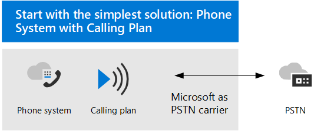

# 음성 Teams 계획 

이 문서에서는 조직에 적합한 Microsoft 음성 솔루션을 결정하는 데 도움이 됩니다. 결정한 후 이 문서에서는 선택한 솔루션을 구현할 수 있도록 콘텐츠에 대한 로드맵을 제공합니다.

호출 계획과 함께 가장 간단한 전화 시스템 &mdash; 수 있습니다. 다음 다이어그램에 표시된 Exchange PBX(Private Branch Exchange)를 제공하는 Microsoft의 올인 더 클라우드 솔루션입니다. 이 솔루션을 통해 Microsoft는 PSTN 통신업체입니다.

다음에 대한 예에 대답하면 전화 시스템 계획이 적합한 솔루션입니다.

- 통화 요금제는 지역에서 사용할 수 있습니다.
- 현재 PSTN 캐리어를 유지할 필요가 없습니다.
- PSTN에 대한 Microsoft 관리 액세스를 사용하려는 경우

그러나 상황은 더 복잡할 수 있습니다. 예를 들어 통화 계획을 사용할 수 없는 위치에 사무실이 있을 수 있습니다. 또는 여러 지리적 위치에 대한 다양한 요구 사항과 함께 복잡하고 다국적 배포를 지원하는 조합 솔루션이 필요할 수 있습니다. Microsoft는 솔루션의 조합을 지원합니다. 

- 전화 시스템 계획과 함께 사용할 수 있습니다.
- 전화 시스템 PSTN 통신사와 함께 커넥트(현재 공개 미리 보기에서만 사용 **가능)**
- 전화 시스템 사용자만의 PSTN 통신사와 함께 사용할 수 있습니다.
- 직접 라우팅을 사용하여 전화 시스템, 연산자 전화 시스템 커넥트 및/또는 전화 시스템 조합 솔루션

## 무엇을 읽어야 하나요?

**모두에 필요합니다.** 이 문서의 일부 섹션은 모든 조직과 관련이 있습니다. 예를 들어 모든 사람이 PSTN(공용 전화 시스템 네트워크)에 연결하기 위한 옵션에 대해 읽고 이해해야 합니다. 

| 모두에 필수 | 설명 |
| :------------|:-------|
| [**전화 시스템**](#phone-system) | Microsoft의 통화 제어 및 PBX(Private Branch Exchange) 기능을 Microsoft 365 클라우드에서 Microsoft Teams. |
| [**PSTN(공용 전환 전화 네트워크) 연결 옵션**](#public-switched-telephone-network-connectivity-options) | Microsoft를 전화 통신 사업자로 사용하거나 직접 라우팅 또는 운영자 Microsoft Teams 통신사에 연결하는 커넥트. PSTN 전화 시스템 옵션을 사용하면 사용자가 전 세계에 전화 통화를 걸 수 있습니다.|

**요구 사항에 따라 다릅니다.** 이 문서 및 관련 문서의 일부 섹션은 기존 배포 및 요구 사항에 따라 관련이 있습니다. 예를 들어 Location-Based 우회를 허용하지 않는 지리적 위치에 있는 직접 라우팅 고객에게만 이러한 라우팅이 필요합니다.

다음 추가 구성 중 어느 것이 필요할지 고려합니다.

| 요구 사항에 따라 | 설명 |
| :------------|:-------|
| [**전화 번호 관리**](pstn-connectivity.md#phone-number-management) | 전화 번호를 얻고 관리하는 방법은 PSTN 연결 옵션에 따라 다릅니다. 전화 번호를 획득하고, 기존 번호를 전송하고, 서비스 번호를 구해야 하는 경우 이 섹션을 참조하세요. |
| [**통화 라우팅 및 전화 걸기 계획**](pstn-connectivity.md#call-routing-and-dial-plans) | 통화 권한 부여 및 통화 라우팅을 위해 전화 걸기 전화 번호를 대체 형식으로 변환하는 전화 요금제(일반적으로 E.164 형식)를 구성하고 관리하는 방법. 전화 걸기 계획의 대상과 조직의 전화 걸기 계획을 지정해야 하는지 이해해야 하는 경우 이 섹션을 참조하세요.|
| [**긴급 통화**](pstn-connectivity.md#emergency-calling) | 긴급 호출을 관리하고 구성하는 방법은 PSTN 연결 옵션에 따라 다릅니다. 조직에 대한 긴급 호출을 관리하는 방법을 이해해야 하는 경우 이 섹션을 참조하세요. |
| [**직접 라우팅에 대한 위치 기반 라우팅**](pstn-connectivity.md#location-based-routing-for-direct-routing) |LBR(Location-Based 라우팅)을 사용하여 해당 지리적 위치에 따라 Microsoft Teams 사용자에 대한 Microsoft Teams 우회를 제한하는 방법 조직에서 우회를 허용하지 않는 위치에서 직접 라우팅을 사용하는 경우 이 섹션을 읽습니다.
| [**클라우드 음성 기능에 대한 네트워크 토폴로지**](pstn-connectivity.md#network-topology-for-voice-features) | 조직에서 직접 라우팅 또는 동적 긴급 호출에 대한 LBR(Location-Based 라우팅)을 배포하는 경우 해당 조직에서 이러한 기능과 함께 사용하도록 네트워크 설정을 Microsoft Teams. 직접 라우팅에 대한 LBR을 구현하는 경우 또는 통화 계획 또는 직접 라우팅을 통해 동적 긴급 호출을 구현하는 경우 이 섹션을 참조하세요. |
| [**기존 음성 솔루션 마이그레이션**](#migrate-your-existing-voice-solution-to-teams) | 음성 솔루션을 마이그레이션할 때 어떻게 생각해야 Teams.  기존 음성 솔루션에서 기존 음성 솔루션으로 마이그레이션하는 경우 이 Teams. 

> [!Important]
> 이 문서에서는 음성 솔루션과 음성 솔루션에 Microsoft Teams. 온라인 비즈니스용 Skype 솔루션을 계속 사용할 수 있는 반면, 비즈니스용 Skype 온라인이 2021년 7월 31일에 사용 중지될 것을 이해하는 것이 중요합니다.  이 날짜 이후에는 비즈니스용 Skype 온라인 서비스에 더 이상 액세스할 수 없습니다. 또한 프레미스 또는 클라우드 커넥터 비즈니스용 Skype 서버 및 비즈니스용 Skype 온라인 간에 PSTN 연결은 더 이상 지원되지 &mdash; &mdash; 않습니다. 이 문서에서는 Teams 라우팅 또는 연산자 Teams 사용하여 필요한 경우 프레미스 전화 통신 네트워크를 연결할 수 Teams 방법을 커넥트.

## 전화 시스템

전화 시스템 클라우드에서 통화 제어 및 PBX(Private Branch Exchange)를 사용하도록 설정하기 위한 microsoft의 Microsoft 365 기술 Microsoft Teams.

전화 시스템 클라이언트 및 Teams 비즈니스용 Skype 디바이스와 함께 작동합니다. 전화 시스템 PBX 시스템을 기존 PBX 시스템에서 직접 제공된 기능 집합으로 Microsoft 365. 

조직의 사용자 간 통화는 내부적으로 전화 시스템 PSTN(공용 전환 전화 네트워크)으로 이동하지 않습니다. 이는 다른 지리적 영역에 있는 조직의 사용자 간 통화에 적용되어 이러한 내부 호출에 대한 장거리 비용이 제거됩니다.

이 문서에서는 다음 주요 전화 시스템 기능과 고려해야 할 배포 결정을 소개합니다.

- [자동 전화 교환 및 통화 큐](#auto-attendants-and-call-queues)
- [클라우드 음성 메일](#cloud-voicemail)
- [ID 호출](#calling-identity)

모든 기능 및 전화 시스템 설정 방법에 대한 자세한 내용은 전화 시스템 문서를 참조하세요.

- [다음은 통화 시스템 기능입니다.](here-s-what-you-get-with-phone-system.md)
- [조직에서 전화 시스템 설정](setting-up-your-phone-system.md) 
  무료 번호에 대한 전화 시스템 라이선스를 구입하고 할당하고, 전화 번호를 관리하고, 통신 크레딧을 설정하는 방법을 설명합니다. 

지원되는 디바이스 관리에 대한  자세한 내용은 마켓플레이스 및 Microsoft Teams Teams [참조하세요.](https://www.microsoft.com/microsoft-365/microsoft-teams/across-devices?ms.url=officecomteamsdevices&rtc=1)

### 자동 참석자 및 통화 큐

자동 참석자는 발신자 입력에 따라 호출을 라우팅하도록 메뉴 옵션을 설정할 수 있습니다. 호출 큐는 발신자 대기 영역입니다. 함께 사용되는 자동 참석자 및 통화 큐는 조직의 적절한 사람 또는 부서로 발신자 라우팅을 쉽게 할 수 있습니다.

자동 참석자 및 호출 큐에 대한 자세한 내용은 다음 문서를 참조하세요.

- [자동 Teams 큐에 대한 계획](plan-auto-attendant-call-queue.md)
- [자동 참석자 설정](create-a-phone-system-auto-attendant.md)
- [통화 큐 만들기](create-a-phone-system-call-queue.md) 
- [Contoso 사례 연구: 자동 참석자 및 통화 큐](voice-case-study-call-queues.md) 
  소설적 다국적 기업 Contoso가 음성 솔루션에 대한 자동 참석자 및 호출 큐를 구현하는 방법을 설명합니다.

### 클라우드 음성 메일

클라우드 음성 사서함 Azure Voicemail 서비스를 통해 지원되는 Exchange 사서함에 대한 음성 메일 예금을 지원합니다. 타사 전자 메일 시스템을 지원하지 않습니다. 

클라우드 음성 사서함에는 기본적으로 조직의 모든 사용자가 사용할 수 있는 음성 메일 기록이 포함됩니다. 비즈니스 요구에 따라 조직 전체의 특정 사용자 또는 모든 사용자에 대한 음성사본 전사 기능을 사용하지 않도록 설정해야 할 수 있습니다.

온라인 전용 사용자의 경우 클라우드 음성 사서함 전화 시스템 라이선스가 할당된 후에 자동으로 설정되고 프로비전됩니다. 전화 시스템 사서함을 Exchange 사용자의 경우 추가 구성 단계를 수행해야 합니다. 

구성 및 클라우드 음성 사서함 대한 자세한 내용은 다음 문서를 참조하세요.

- [클라우드 음성 사서함 설정](set-up-phone-system-voicemail.md)
- [조직의 음성메일 정책 설정](manage-voicemail-policies.md)

### ID 호출

기본적으로 모든 아웃바운드 호출은 할당된 전화 번호를 호출 ID(발신자 ID)로 사용됩니다. 전화 수신자는 발신자를 빠르게 확인하고 통화를 수락할지 거부할지를 결정할 수 있습니다. 발신자 ID를 구성하거나 발신자 ID를 변경하거나 차단하는 데 대한 자세한 내용은 사용자에 대한 [발신자 ID 설정을 참조하세요.](set-the-caller-id-for-a-user.md) 

## 공용 전환된 전화 네트워크 연결 옵션

전화 시스템 전체 PBX 기능을 제공합니다. 그러나 사용자가 조직 외부에서 전화를 걸 수 있도록 설정하려면 PSTN(공용 전화 시스템 전화 네트워크)에 연결해야 합니다. PSTN에 전화 시스템 다음 옵션 중 하나를 선택할 수 있습니다.

- [**전화 시스템 를 사용할 수 있습니다.**](pstn-connectivity.md#phone-system-with-calling-plan) PSTN 통신사로 Microsoft를 사용할 수 있는 올인원 클라우드 솔루션입니다.

- 전화 시스템 라우팅을 사용하여 자체 [**PSTN**](pstn-connectivity.md#phone-system-with-direct-routing) 통신사와 함께 사용할 수 Teams.

- 전화 시스템 현재 공개 미리 보기에서만 사용할 수 커넥트 연산자를 사용하여 자체 [**PSTN**](operator-connect-plan.md)통신사와 함께 **사용할 수 있습니다.**  연산자 커넥트 경우 기존 연산자가 Microsoft Operator 커넥트 프로그램에 참여하는 경우 PSTN 호출을 사용자에 가져오기 위한 서비스를 관리할 수 Teams. 운영자의 혜택 및 요구 사항에 대한 커넥트 프로그램에 참여하는 운영자 목록에 대한 자세한 내용은 계획 [운영자](operator-connect-plan.md)커넥트.

복잡한 환경에 대한 솔루션을 디자인하거나 다단계 마이그레이션을 관리할 수 있는 옵션의 조합을 선택할 수도 있습니다(나중에 마이그레이션에 대한 자세한 내용은).

대부분의 전화 시스템 기능은 선택한 PSTN 연결 옵션에 관계없이 동일합니다. 그러나 기능의 몇 가지 차이점은 호출 라우팅 및 긴급 전화 시스템 특정 기능을 구성하는 방법에 영향을 미치게 합니다. PSTN 연결 옵션 및 이러한 구성 고려 사항에 대한 자세한 내용은 [PSTN 연결 옵션 을 참조하세요.](pstn-connectivity.md)

## 기존 음성 솔루션 마이그레이션을 Teams

> [!NOTE]
> 전체 계획의 일부로 Teams 음성 솔루션 계획에 대한 지침은 Teams 비즈니스용 Skype 서버 프레미스에서 Teams [PSTN 비즈니스용 Skype 참조하세요.](upgrade-to-teams-on-prem-pstn-considerations.md)

조직으로 업그레이드하는 조직의 경우 Teams 궁극적인 목표는 모든 사용자를 TeamsOnly 모드로 이동하는 것입니다. 전화 시스템 Teams 사용하는 것은 사용자가 TeamsOnly 모드일 때만 지원됩니다. 업그레이드에 대한 기본 정보가 필요한 Teams 다음을 시작하세요.

- [Microsoft Teams 업그레이드 시작하기](upgrade-start-here.md)
- [업그레이드 프레임워크 정보](upgrade-framework.md)
- [IT 관리자를 위한 업그레이드 전략](upgrade-to-teams-on-prem-implement.md)

음성 솔루션을 마이그레이션할 때 TeamsOnly 모드로 전환할 때 다음과 같은 4개의 가능한 호출 시나리오가 있습니다.

- Microsoft 호출 비즈니스용 Skype 있는 [**온라인 사용자입니다.**](upgrade-to-teams-on-prem-pstn-considerations.md#from-skype-for-business-online-with-microsoft-calling-plans) 업그레이드 시 이 사용자는 Microsoft 통화 계획을 계속 하게 됩니다.

- **[온라인 비즈니스용 Skype](upgrade-to-teams-on-prem-pstn-considerations.md#from-skype-for-business-online-with-on-premises-voice)** 프레미스 또는 Cloud Connector Edition을 통해 비즈니스용 Skype 음성 기능이 있는 사용자입니다. 사용자의 업그레이드를 Teams 직접 라우팅으로의 마이그레이션과 조정해야 TeamsOnly 사용자에게 PSTN 기능이 있습니다.

- **[온라인로 비즈니스용 Skype](upgrade-to-teams-on-prem-pstn-considerations.md#from-skype-for-business-server-on-premises-with-enterprise-voice-to-direct-routing)PSTN** 연결을 유지하는 Enterprise Voice 를 통해 프레미스에서 사용자 이 사용자를 Teams 사용자온-프레미스 비즈니스용 Skype 클라우드로 이동하고, 사용자 마이그레이션을 통해 직접 라우팅으로 이동하는 조정이 필요합니다. 

- **[온라인으로 비즈니스용 Skype](upgrade-to-teams-on-prem-pstn-considerations.md#from-skype-for-business-server-on-premises-with-enterprise-voice-to-microsoft-calling-plan)** 을 사용하여 Enterprise Voice 프레미스에 있는 사용자는 Microsoft 통화 요금제 를 사용할 것입니다.  이 사용자를 Teams 클라우드로 사용자의 비즈니스용 Skype 이동하고 A) 해당 사용자의 전화 번호 포트를 Microsoft 호출 계획 또는 B로 이동하도록 조정해야 합니다. 사용 가능한 지역에서 새 구독자 번호를 할당해야 합니다.

하이브리드 연결을 설정해야 하는 경우와 직접 라우팅으로 사용자를 마이그레이션하는 방법에 대한 정보를 포함하여 이러한 각 시나리오에 대한 음성 마이그레이션을 구현하는 방법에 대한 자세한 내용은 다음 문서를 &mdash; &mdash; 참조하세요.

- [IT 관리자를 위해 Teams PSTN 고려 사항](upgrade-to-teams-on-prem-pstn-considerations.md)

- [Contoso 음성 마이그레이션 사례 연구](voice-case-study-overview.md) 
  사례 연구에서는 소설적 다국적 기업인 Contoso가 조직에 대한 Teams 음성 솔루션을 구현하는 방법을 설명합니다. 이 문서에는 다음 문서가 포함되어 있습니다.

  - [Teams 계획](voice-case-study-migration-plan.md)
  - [전화 시스템 및 PSTN 연결 옵션](voice-case-study-phone-system.md)
  - [위치 기반 라우팅 구현](voice-case-study-location-based-routing.md)
  - [긴급 통화](voice-case-study-emergency-calling.md)
  - [자동 전화 교환 및 통화 큐](voice-case-study-call-queues.md)
  - [오디오 회의](voice-case-study-audio-conferencing.md)
