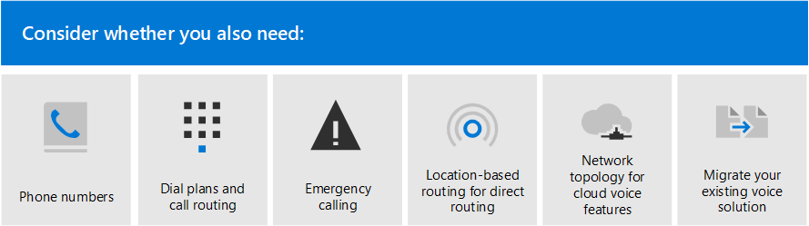

# Teams 음성 솔루션 계획Plan your Teams voice solution 

이 문서는 조직에 적합한 Microsoft 음성 솔루션을 결정하는 데 도움이 됩니다.This article helps you decide which Microsoft voice solution is right for your organization. 결정한 후 이 문서는 선택한 솔루션을 구현할 수 있는 콘텐츠에 대한 로드맵을 제공합니다.After you've decided, the article provides a roadmap to content that will enable you to implement your chosen solution.

> [!NOTE]
> 비즈니스용 Skype 서버에서 Teams로 업그레이드하기 위한 전체 계획의 일부로 Teams 음성 솔루션을 계획하는 방법에 대한 지침은 비즈니스용 Skype에서 Teams로의 업그레이드에 대한 [PSTN](upgrade-to-Teams-on-prem-pstn-considerations.md)고려 사항을 참조하세요.For guidance on planning a Teams voice solution as part as your overall plan to upgrade to Teams from Skype for Business Server, see [PSTN considerations for upgrading to Teams from Skype for Business on-premises](upgrade-to-Teams-on-prem-pstn-considerations.md).

통화 계획이 있는 가장 간단한 &mdash; 솔루션 전화 시스템을 원할 수 있습니다.You might want the simplest solution&mdash;Phone System with Calling Plan. 다음 다이어그램과 같이 PBX(Private Branch Exchange) 기능과 PSTN(Public Switched Telephone Network)에 대한 호출을 제공하는 Microsoft의 모든 클라우드 솔루션입니다.This is Microsoft's all-in-the-cloud solution that provides Private Branch Exchange (PBX) functionality and calls to the Public Switched Telephone Network (PSTN), as shown in the following diagram. 이 솔루션을 통해 Microsoft는 PSTN 통신 사업자입니다.With this solution, Microsoft is your PSTN carrier.

다음에 대해 "예"라고 대답하는 경우 통화 요금제가 있는 전화 시스템이 적합한 솔루션입니다.If you answer yes to the following, then Phone System with Calling Plan is the right solution for you:

- 통화 요금제는 지역에서 사용할 수 있습니다.Calling Plan is available in your region.
- 현재 PSTN 운송업체를 유지할 필요가 없습니다.You do not need to retain your current PSTN carrier.
- PSTN에 대한 Microsoft 관리 액세스를 사용하려는 경우You want to use Microsoft-managed access to the PSTN.

그러나 상황이 더 복잡할 수 있습니다.However, your situation might be more complex. 예를 들어 통화 플랜을 사용할 수 없는 위치에 사무실이 있을 수 있습니다.For example, you might have offices in locations where Calling Plan isn't available. 또는 지리적 위치에 대해 서로 다른 요구 사항이 있는 복잡한 다국적 배포를 지원하는 조합 솔루션이 필요할 수 있습니다.Or you might need a combination solution that supports a complex, multi-national deployment, with different requirements for different geographic locations. Microsoft는 솔루션의 조합을 지원합니다.Microsoft supports a combination of solutions: 

- 통화 요금제가 있는 전화 시스템Phone System with Calling Plan
- 직접 라우팅을 통해 PSTN 통신 사업자 소유의 전화 시스템Phone System with your own PSTN carrier with Direct Routing
- 전화 시스템과 통화 요금제, 직접 라우팅이 있는 전화 시스템을 모두 사용하는 조합 솔루션A combination solution that uses both Phone System with Calling Plan and Phone System with Direct Routing

## 무엇을 읽어야 하나요?What do you need to read?

**모두에 필요합니다.****Required for all.** 이 문서의 일부 섹션은 모든 조직과 관련이 있습니다.Some of the sections in this article pertain to all organizations. 예를 들어 모든 사람이 전화 시스템에 대해 읽고 PSTN(공용 전화망)에 연결하는 옵션을 이해해야 합니다.For example, everyone should read about Phone System and understand the options for connecting to the Public Switched Telephone Network (PSTN). 

| 모두에 필요Required for all | 설명Description |
| :------------|:-------|
| [**전화 시스템****Phone System**](#phone-system) | Microsoft Teams를 사용하여 Microsoft 365 클라우드에서 통화 제어 및 PBX(Private Branch Exchange) 기능을 사용하도록 설정하는 Microsoft의 기술입니다.Microsoft's technology for enabling call control and Private Branch Exchange (PBX) capabilities in the Microsoft 365 cloud with Microsoft Teams. |
| [**PSTN(Public Switched Telephone Network) 연결 옵션****Public Switched Telephone Network (PSTN) connectivity options**](#public-switched-telephone-network-connectivity-options) | 직접 라우팅을 사용하여 Microsoft를 통신사로 사용할지 또는 Microsoft Teams에 자신의 전화 통신업체를 연결하는지 선택할 수 있습니다.A choice between using Microsoft as your telephony carrier or connecting your own telephony carrier to Microsoft Teams by using Direct Routing. 전화 시스템과 결합된 PSTN 연결 옵션을 사용하면 사용자가 전 세계에 전화 통화를 걸 수 있습니다.Combined with Phone System, PSTN connectivity options enable your users to make phone calls all over the world.|

**요구 사항에 따라 다릅니다.****Depending on your requirements.** 이 문서의 일부 섹션은 기존 배포 및 요구 사항에 따라 관련이 있습니다.Some of the sections in this article are pertinent depending on your existing deployment and requirements. 예를 들어 Location-Based 라우팅은 에티하드 우회를 허용하지 않는 지리적 위치에 있는 직접 라우팅 고객에게만 필요합니다.For example, Location-Based Routing is only required for Direct Routing customers in geographic locations that do not allow toll bypass.

다음 추가 구성 중 필요한 구성을 고려합니다.Consider which of these additional configurations you might need:

| 요구 사항에 따라Depending on your requirements | 설명Description |
| :------------|:-------|
| [**Microsoft의 전화 번호****Phone numbers from Microsoft**](#phone-numbers-from-microsoft) | Microsoft에서 전화 번호를 다운로드하고 관리하는 방법 및 기존 번호를 Microsoft로 이전하는 방법.How to get and manage phone numbers from Microsoft, and how to transfer existing numbers to Microsoft. Microsoft 통화 요금제에 대한 전화 번호를 획득하고, 기존 번호를 이전하고, 서비스 번호를 얻는 등 필요한 경우 이 정보를 읽어 읽습니다.Read this if you need to obtain phone numbers for Microsoft Calling Plan, transfer existing numbers, obtain service numbers, and so on. |
| [**전화 걸기 계획 및 통화 라우팅****Dial plans and call routing**](#dial-plans-and-call-routing) | 통화 권한 부여 및 통화 라우팅을 위해 전화 걸기 번호를 대체 형식(일반적으로 E.164 형식)으로 변환하는 다이얼 플랜을 구성하고 관리하는 방법How to configure and manage dial plans that translate dialed phone numbers into an alternate format (typically E.164 format) for call authorization and call routing. 전화 요금제의 대상과 조직의 전화 걸기 계획을 지정해야 하는지 여부를 이해해야 하는 경우 이 내용을 읽어 읽습니다.Read this if you need to understand what dial plans are and  whether you need to specify dial plans for your organization.|
| [**긴급 통화****Emergency calling**](#emergency-calling) | PSTN 연결 옵션에 따라 긴급 통화를 관리하고 &mdash; 구성하는 방법.How to manage and configure emergency calling&mdash;depending on your PSTN connectivity option. Microsoft 통화 요금제 또는 직접 라우팅을 사용 중일 때 조직의 긴급 통화를 관리하는 방법을 이해해야 하는 경우 이 섹션을 참조하세요.Read this section if you are using Microsoft Calling Plan or Direct Routing and need to understand how to manage emergency calling for your organization. |
| [**직접 라우팅에 대한 위치 기반 라우팅****Location-Based Routing for Direct Routing**](#location-based-routing-for-direct-routing) |LBR(Location-Based 라우팅)을 사용하여 지리적 위치에 따라 Microsoft Teams 사용자에 대한 우회를 제한하는 방법How to use Location-Based Routing (LBR) to restrict toll bypass for Microsoft Teams users based on their geographic location. 조직에서 Toll 우회를 허용하지 않는 위치에서 직접 라우팅을 사용하는 경우 이 섹션을 참조하세요.Read this section if your organization is using Direct Routing at a location that does not allow toll bypass.
| [**클라우드 음성 기능에 대한 네트워크 토폴로지****Network topology for cloud voice features**](#network-topology-for-voice-features) | 조직에서 직접 라우팅 또는 동적 긴급 통화를 위해 LBR(Location-Based 라우팅)을 배포하는 경우 Microsoft Teams에서 이러한 기능과 함께 사용하도록 네트워크 설정을 구성해야 합니다.If your organization is deploying Location-Based Routing (LBR) for Direct Routing or dynamic emergency calling, you must configure network settings for use with these features in Microsoft Teams. 직접 라우팅을 위해 LBR을 구현하거나 통화 계획 또는 직접 라우팅을 통해 동적 긴급 통화를 구현하는 경우 이 섹션을 참조하세요.Read this section if you are implementing LBR for Direct Routing, or if you are implementing dynamic emergency calling with Calling Plan or Direct Routing. |
| [**기존 음성 솔루션 마이그레이션****Migrate your existing voice solution**](#migrate-your-existing-voice-solution-to-teams) | 음성 솔루션을 Teams로 마이그레이션할 때 생각해야 할 일입니다.What you need to think about when migrating your voice solution to Teams.  기존 음성 솔루션에서 Teams로 마이그레이션하는 경우 이 섹션을 참조하세요.Read this section if you are migrating from an existing voice solution to Teams. 

> [!Important]
> 이 문서에서는 Microsoft Teams를 통해 음성 솔루션을 중점적으로 다루고 있습니다.This article focuses on voice solutions with Microsoft Teams. 비즈니스용 Skype Online의 솔루션은 여전히 사용할 수 있는 [반면(Microsoft](https://docs.microsoft.com/SkypeForBusiness/hybrid/msft-telephony-solutions)전화 통신 솔루션에 설명된) 비즈니스용 Skype Online은 2021년 7월 31일 사용 중지될 예정임에 유의해야 합니다.While solutions with Skype for Business Online are still available (as described in [Microsoft telephony solutions](https://docs.microsoft.com/SkypeForBusiness/hybrid/msft-telephony-solutions)), it's important to understand that Skype for Business Online will be retired on July 31, 2021.  이 날짜 이후에는 비즈니스용 Skype Online 서비스에 더 이상 액세스할 수 없습니다.After that date, the Skype for Business Online service will no longer be accessible. 또한 비즈니스용 Skype Server 또는 Cloud Connector Edition과 비즈니스용 Skype Online을 통한 모든 온라인 환경 간의 PSTN 연결은 더 이상 &mdash; &mdash; 지원되지 않습니다.In addition, PSTN connectivity between your on-premises environment&mdash;whether through Skype for Business Server or Cloud Connector Edition&mdash;and Skype for Business Online will no longer be supported. 이 문서에서는 Teams 음성 솔루션과 필요한 경우 직접 라우팅을 사용하여 Teams에 On-프레미스 전화 통신 네트워크를 연결하는 방법을 소개합니다.This article introduces Teams voice solutions and how you can connect your on-premises telephony network, if necessary, to Teams by using Direct Routing.

## 전화 시스템Phone System

전화 시스템은 Microsoft Teams를 사용하여 Microsoft 365 또는 Office 365 클라우드에서 통화 제어 및 PBX(Private Branch Exchange) 기능을 사용하도록 설정하기 위한 Microsoft의 기술입니다.Phone System is Microsoft's technology for enabling call control and Private Branch Exchange (PBX) capabilities in the Microsoft 365 or Office 365 cloud with Microsoft Teams.

전화 시스템은 Teams 또는 비즈니스용 Skype 클라이언트 및 인증된 장치에서 작동합니다.Phone System works with Teams or Skype for Business clients and certified devices. 전화 시스템을 사용하면 기존 PBX 시스템을 Microsoft 365 또는 Office 365에서 직접 배달된 기능 집합으로 바꿀 수 있습니다.Phone System allows you to replace your existing PBX system with a set of features directly delivered from Microsoft 365 or Office 365. 

조직의 사용자 간 통화는 전화 시스템 내에서 내부적으로 처리하며 PSTN(공용 전화망)으로 이동하지 않습니다.Calls between users in your organization are handled internally within Phone System, and never go to the Public Switched Telephone Network (PSTN). 이는 서로 다른 지역에 있는 조직의 사용자 간 통화에 적용되어 이러한 내부 통화에서 장거리 비용이 제거됩니다.This applies to calls between users in your organization located in different geographical areas, removing long-distance costs on these internal calls.

이 문서에서는 다음과 같은 전화 시스템 주요 기능 및 고려해야 할 배포 결정을 소개합니다.This article introduces the following Phone System key features and functionality, and the deployment decisions you'll need to consider:

- [자동 전화 교환 및 통화 큐Auto attendants and call queues](#auto-attendants-and-call-queues)
- [클라우드 음성 메일Cloud Voicemail](#cloud-voicemail)
- [ID 호출Calling identity](#calling-identity)

모든 전화 시스템 기능 및 전화 시스템을 설정하는 방법에 대한 자세한 내용은 다음 문서를 참조하세요.For information about all Phone System features, and how to set up Phone System, see the following articles:

- [다음은 전화 시스템 기능입니다.Here's what you get with Phone System](here-s-what-you-get-with-phone-system.md)
- [조직에서 전화 시스템 설정Set up Phone System in your organization](setting-up-your-phone-system.md) 
  전화 시스템 라이선스를 구입 및 할당하고, 전화 번호를 관리하고, 무료 번호에 대한 통신 크레딧을 설정하는 방법을 설명하고 있습니다.Describes how to buy and assign Phone System licenses, manage phone numbers, and set up communication credits for toll-free numbers. 

지원되는 장치 관리에 대한 자세한 내용은 [Microsoft Teams](devices/device-management.md) 및 Teams Marketplace에서 장치 [관리를 참조하세요.](https://www.microsoft.com/microsoft-365/microsoft-teams/across-devices?ms.url=officecomteamsdevices&rtc=1)For information about managing supported devices, see [Manage your devices in Microsoft Teams](devices/device-management.md) and [Teams Marketplace](https://www.microsoft.com/microsoft-365/microsoft-teams/across-devices?ms.url=officecomteamsdevices&rtc=1).

### 자동 전화 회의 및 통화 큐Auto attendants and Call queues

자동 전화 회의를 사용하면 발신자 입력에 따라 통화를 라우팅하는 메뉴 옵션을 설정할 수 있습니다.Auto attendants allow you to set up menu options to route calls based on caller input. 호출 큐는 발신자에 대해 대기 중인 영역입니다.Call queues are waiting areas for callers. 자동 전화 걸기 및 통화 큐를 함께 사용하여 조직의 적절한 사람 또는 부서로 발신자 라우팅을 쉽게 라우팅할 수 있습니다.Used together, auto attendants and call queues can easily route callers to the appropriate person or department in your organization.

자동 전화 회의 및 통화 큐에 대한 자세한 내용은 다음 문서를 참조하세요.For information about auto attendants and call queues, see the following articles:

- [Teams 자동 전화 회의 및 통화 큐 계획Plan for Teams auto attendants and call queues](plan-auto-attendant-call-queue.md)
- [자동 참석자 설정Set up an auto attendant](create-a-phone-system-auto-attendant.md)
- [통화 큐 만들기Create a call queue](create-a-phone-system-call-queue.md) 
- [Contoso 사례 연구: 자동 전화 회의 및 통화 큐Contoso case study: Auto attendants and call queues](voice-case-study-call-queues.md) 
  Contoso는 다국적 기업인 Contoso가 음성 솔루션에 대한 자동 전화 회의 및 통화 큐를 구현하는 방법을 설명합니다.Describes how a fictional multi-national corporation, Contoso, implemented auto attendants and call queues for their voice solution.

### 클라우드 음성 메일Cloud Voicemail

Azure Voicemail 서비스에서 제공하는 클라우드 음성 메일은 Exchange 사서함에 대한 음성 메일 보관만 지원합니다.Cloud Voicemail, powered by Azure Voicemail services, supports voicemail deposits to Exchange mailboxes only. 타사 전자 메일 시스템은 지원하지 않습니다.It doesn't support third-party email systems. 

Cloud Voicemail에는 기본적으로 조직의 모든 사용자에 대해 사용하도록 설정되는 음성메일 전사가 포함되어 있습니다.Cloud Voicemail includes voicemail transcription, which is enabled for all users in your organization by default. 비즈니스 요구에 따라 특정 사용자 또는 조직 전체의 모든 사용자에 대해 음성메일 전사 기능을 사용하지 않도록 설정해야 할 수 있습니다.Your business needs might require that you disable voicemail transcription for specific users or everyone throughout the organization.

온라인 전용 사용자의 경우 전화 시스템 라이선스가 할당된 사용자에 대해 Cloud Voicemail이 자동으로 설정되고 프로비전됩니다.For online only users, Cloud Voicemail is automatically set up and provisioned for users after they are assigned a Phone System license. Exchange 사서함이 있는 전화 시스템 사용자의 경우 추가 구성 단계를 수행해야 합니다.For Phone System users with an Exchange mailbox, you will need to perform extra configuration steps. 

Cloud Voicemail 및 해당 구성에 대한 자세한 내용은 다음 문서를 참조하세요.For more information about Cloud Voicemail and its configuration, see the following articles:

- [클라우드 음성 메일 설정Set up Cloud Voicemail](set-up-phone-system-voicemail.md)
- [조직에서 음성메일 정책 설정Set voicemail policies in your organization](set-up-phone-system-voicemail.md#setting-voicemail-policies-in-your-organization)

### ID 호출Calling identity

기본적으로 모든 아웃바운드 호출은 발신자 ID(발신자 ID)로 할당된 전화 번호를 사용하게 됩니다.By default, all outbound calls use the assigned phone number as calling identity (caller ID). 통화를 받는 사람은 발신자를 신속하게 식별하고 통화를 수락하거나 거부할지 여부를 결정할 수 있습니다.The recipient of the call can quickly identify the caller and decide whether to accept or reject the call. 호출자 ID 구성 또는 호출자 ID 변경 또는 차단에 대한 자세한 내용은 사용자의 호출자 ID 설정을 [참조하세요.](set-the-caller-id-for-a-user.md)For information about configuring caller ID or to change or block the caller ID, see [Set the caller ID for a user](set-the-caller-id-for-a-user.md). 

## 공용 전환 전화 네트워크 연결 옵션Public Switched Telephone Network connectivity options

전화 시스템은 조직에 대한 완전한 PBX 기능을 제공합니다.Phone System provides complete PBX capabilities for your organization. 그러나 사용자가 조직 외부에서 전화를 걸 수 있도록 설정하려면 전화 시스템을 PSTN(공용 전환 전화 네트워크)에 연결해야 합니다.However, to enable users to make calls outside your organization, you need to connect Phone System to the Public Switched Telephone Network (PSTN). 전화 시스템을 PSTN에 연결하기 위해 다음 옵션 중 하나를 선택할 수 있습니다.To connect Phone System to the PSTN, you can choose one of the following options:

- [**통화 요금제가 있는 전화 시스템**](#phone-system-with-calling-plan)[**Phone System with Calling Plan**](#phone-system-with-calling-plan). PSTN 통신 사업자인 Microsoft와의 모든 클라우드 솔루션입니다.An all-in-the-cloud solution with Microsoft as your PSTN carrier.

- 직접 라우팅을 사용하여 자신의 [**PSTN**](#phone-system-with-own-pstn-carrier-with-direct-routing) 통신 사업자와 전화 시스템을 연결하여 프레미스 환경을 Teams에 연결합니다.[**Phone System with your own PSTN carrier**](#phone-system-with-own-pstn-carrier-with-direct-routing) by using Direct Routing to connect your on-premises environment to Teams.

복잡한 환경에 대한 솔루션을 디자인하거나 다단계 마이그레이션을 관리할 수 있는 옵션의 조합을 선택할 수도 있습니다(나중에 마이그레이션에 대한 자세한 설명).You can also choose a combination of options, which enables you to design a solution for a complex environment, or manage a multi-step migration (more about migration later).

### 통화 요금제가 있는 전화 시스템Phone System with Calling Plan 

이 문서의 앞부분에서 설명한 대로 통화 플랜이 있는 전화 시스템은 Teams 사용자를 위한 Microsoft의 모든 클라우드 음성 솔루션입니다.As described earlier in this article, Phone System with Calling Plan is Microsoft's all-in-the-cloud voice solution for Teams users. Microsoft Phone System을 PSTN(Public Switched Telephone Network)에 연결하여 전 세계 유선전화 및 휴대폰으로 전화를 걸 수 있는 가장 간단한 옵션입니다.This is the simplest option that connects Microsoft Phone System to the Public Switched Telephone Network (PSTN) to enable calls to landlines and mobile phones around the world. 이 옵션을 사용하면 Microsoft는 조직에 대해 PBX(Private Branch Exchange) 기능을 제공하며 다음 다이어그램과 같이 PSTN 통신 사업자 역할을 합니다.With this option, Microsoft provides Private Branch Exchange (PBX) functionality for your organization and acts as your PSTN carrier, as shown in the following diagram:

다음에 대해 "예"라고 대답하는 경우 통화 요금제가 있는 전화 시스템이 적합한 솔루션입니다.If you answer yes to the following, then Phone System with Calling Plan is the right solution for you:

- 통화 요금제는 지역에서 사용할 수 있습니다.Calling Plan is available in your region.
- 현재 PSTN 운송업체를 유지할 필요가 없습니다.You do not need to retain your current PSTN carrier.
- PSTN에 대한 Microsoft 관리 액세스를 사용하려는 경우You want to use Microsoft-managed access to the PSTN.

이 옵션을 사용하는 경우:With this option: 

- 사용이 허가된 서비스 수준에 따라 전 세계 전화로 통화할 수 있는 추가 국내 또는 국제 통화 요금제가 있는 Microsoft Phone System을 사용할 수 있습니다.You get Microsoft Phone System with added Domestic or International Calling Plans that enable calling to phones around the world (depending on the level of service being licensed).

- 호출 계획은 &mdash; Microsoft 365 또는 Office 365에서 작동하기 때문에 배포 또는 유지 관리가 필요하지 않습니다.You do not require deployment or maintenance of an on-premises deployment&mdash;because Calling Plan operates out of Microsoft 365 or Office 365.

- 참고: 필요한 경우 타사 PBX, 아날로그 디바이스 및 SBC에서 지원하는 기타 타사 전화 통신 장비와의 상호 연동성을 위해 직접 라우팅을 통해 지원되는 SBC(세션 테두리 컨트롤러)를 연결하기로 선택할 수 있습니다.Note: If necessary, you can choose to connect a supported Session Border Controller (SBC) through Direct Routing for interoperability with third-party PBXs, analog devices, and other third-party telephony equipment supported by the SBC.

이 옵션을 사용하려면 Microsoft 365 또는 Office 365에 대한 연결을 끊어야 합니다.This option requires uninterrupted connection to Microsoft 365 or Office 365.

통화 계획에 대한 자세한 내용은 다음 문서를 참조하세요.For more information about Calling Plan, see the following articles:

- [사용자에게 적합한 통화 플랜은 무엇인가요?Which Calling Plan is right for you?](calling-plan-landing-page.md)
- [통화 플랜을 구입하는 방법How to buy a Calling Plan](calling-plans-for-office-365.md)
- [통화 플랜의 국가 및 지역 가용성Country and region availability for Calling Plan](https://docs.microsoft.com/microsoftteams/country-and-region-availability-for-audio-conferencing-and-calling-plans/country-and-region-availability-for-audio-conferencing-and-calling-plans)
- [통화 계획 설정Set up Calling Plan](set-up-calling-plans.md)

### 직접 라우팅이 있는 자체 PSTN 통신업체가 있는 전화 시스템Phone System with own PSTN carrier with Direct Routing

이 옵션은 다음 다이어그램과 같이 직접 라우팅을 사용하여 Microsoft Phone System을 전화 통신 네트워크에 연결합니다.This option connects Microsoft Phone System to your telephony network by using Direct Routing, as shown in the following diagram: 

다음 질문에 대해 예에 대답하는 경우 직접 라우팅이 있는 전화 시스템이 적합한 솔루션입니다.If you answer yes to the following questions, then Phone System with Direct Routing is the right solution for you:

- 전화 시스템에서 Teams를 사용하려는 경우You want to use Teams with Phone System.
- 현재 PSTN 통신업체를 유지해야 합니다.You need to retain your current PSTN carrier.
- 일부 통화는 통신사를 통해 통화 요금제로 이동하는 라우팅을 혼합하려는 경우도 있습니다.You want to mix routing, with some calls going through Calling Plan, some through your carrier.
- 오버헤드 페이지, 아날로그 장치 등의 타사 PBX 및/또는 장비와 상호 협력해야 합니다.You need to interoperate with third-party PBXs and/or equipment such us overhead pagers, analog devices, and so on.

이 옵션을 사용하는 경우:With this option:

- 추가로 지원되는 SBC를 Microsoft Phone System에 연결하면 추가의 프레미스 소프트웨어가 필요하지 않습니다.You connect your own supported SBC to Microsoft Phone System without the need for additional on-premises software.

- Microsoft Phone System에서 거의 모든 전화 통신업체를 사용할 수 있습니다.You can use virtually any telephony carrier with Microsoft Phone System.

- 이 옵션을 구성하고 관리하도록 선택하거나 통신 사업자 또는 파트너가 구성하고 관리할 수 있습니다(통신 사업자 또는 파트너가 이 옵션을 제공하는지 묻기).You can choose to configure and manage this option, or it can be configured and managed by your carrier or partner (ask if your carrier or partner provides this option).

- 타사 PBX와 아날로그 디바이스와 Microsoft Phone System과 같은 전화 통신 장비 간에 상호 운영성을 &mdash; &mdash; 구성할 수 있습니다.You can configure interoperability between your telephony equipment&mdash;such as a third-party PBX and analog devices&mdash;and Microsoft Phone System.

이 옵션을 사용하려면 다음이 필요합니다.This option requires the following:

- Microsoft 365 또는 Office 365에 대한 연결을 끊지 않습니다.Uninterrupted connection to Microsoft 365 or Office 365.

- 지원되는 SBC 배포 및 유지 관리Deploying and maintaining a supported SBC.

- 타사 통신 사업자와 계약합니다.A contract with a third-party carrier.
  (통화 요금제가 있는 전화 시스템에 있는 사용자를 위해 타사 PBX, 아날로그 장치 또는 기타 전화 통신 장비에 대한 연결을 제공하는 옵션으로 배포되지 않는 한).(Unless deployed as an option to provide connection to third-party PBX, analog devices, or other telephony equipment for users who are on Phone System with Calling Plan.)

직접 라우팅에 대한 자세한 내용은 다음 문서를 참조하세요.For more information about Direct Routing, see the following articles:

- [전화 시스템 직접 라우팅Phone System Direct Routing](direct-routing-landing-page.md)
- [직접 라우팅 계획Plan Direct Routing](direct-routing-plan.md)
- [직접 라우팅 구성Configure Direct Routing](direct-routing-configure.md)
- [직접 라우팅에 사용할 음성 라우팅 정책 관리Manage voice routing policies for use with Direct Routing](manage-voice-routing-policies.md)
- [직접 라우팅으로 전달되는 위치 기반 라우팅 계획Plan Location-Based Routing for Direct Routing](location-based-routing-plan.md)
- [직접 라우팅으로 인증된 SBC(Session Border Controller) 목록List of Session Border Controllers certified for Direct Routing](direct-routing-border-controllers.md)

## Microsoft의 전화 번호Phone numbers from Microsoft

Microsoft에는 조직의 사용자에게 할당할  수 있는 구독자(사용자) 번호와 무료 서비스  번호로 사용할 수 있는 서비스 번호 등 두 가지 유형의 전화 번호를 사용할 수 있습니다.Microsoft has two types of telephone numbers available: *subscriber* (user) numbers, which can be assigned to users in your organization, and *service* numbers, available as toll and toll-free service numbers. 서비스 번호는 구독자 번호보다 동시 호출 용량이 높고 오디오 회의, 자동 전화 걸기 또는 통화 큐와 같은 서비스에 할당할 수 있습니다.Service numbers have higher concurrent call capacity than subscriber numbers and can be assigned to services such as Audio Conferencing, Auto Attendants, or Call Queues.

다음을 결정해야 합니다.You will need to decide:

- Microsoft의 새 전화 번호가 필요한 사용자 위치는 무엇입니까?Which user locations need new phone numbers from Microsoft?
- 어떤 유형의 전화 번호(구독자 또는 서비스)가 필요한가요?Which type of telephone number (subscriber or service) do I need? 
- 기존 전화 번호를 Teams로 포터를 이동하는 방법How do I port existing phone numbers to Teams?

새 번호 옮기기 또는 나가는 번호 이전 등 조직에서 전화 번호를 관리하는 데 대한 자세한 내용은 다음 문서를 참조하세요.For more information about managing phone numbers in your organization, including getting new numbers or transferring exiting numbers, see the following articles:

- [조직의 전화 번호 관리Manage phone numbers for your organization](manage-phone-numbers-for-your-organization/manage-phone-numbers-for-your-organization.md) 
- [통화 요금제에 사용되는 다양한 종류의 전화 번호Different kinds of phone numbers used for Calling Plan](different-kinds-of-phone-numbers-used-for-calling-plans.md)
- [사용자의 전화 번호 가져오기Getting phone numbers for your users](getting-phone-numbers-for-your-users.md)
- [Microsoft Teams로 전화 번호 이전Transfer phone numbers to Microsoft Teams](phone-number-calling-plans/transfer-phone-numbers-to-teams.md)

## 전화 걸기 계획 및 통화 라우팅Dial plans and call routing

다이얼 플랜은 전화 인증 및 통화 라우팅을 위해 전화 걸기 전화 번호를 대체 형식(일반적으로 E.164 형식)으로 변환하는 정규화 규칙 집합입니다.A dial plan is a set of normalization rules that translate dialed phone numbers into an alternate format (typically E.164 format) for call authorization and call routing.

다음을 결정해야 합니다.You will need to decide the following: 

- 조직에 사용자 지정 다이얼 플랜이 필요한가요?Does my organization need a customized dial plan?
- 어떤 사용자에게 사용자 지정 다이얼 플랜이 필요한가요?Which users require a customized dial plan?
- 각 사용자에게 어떤 테넌트 다이얼 플랜을 할당해야 하나요?Which tenant dial plan should be assigned to each user?

자세한 내용은 다음 문서를 참조하세요.For more information, see the following articles: 

- [다이얼 플랜이 무엇인가요?What are dial plans?](what-are-dial-plans.md)
- [테넌트 다이얼 플랜 계획Plan for tenant dial plans](what-are-dial-plans.md#planning-for-tenant-dial-plans)
- [다이얼 플랜 만들기 및 관리Create and manage dial plans](create-and-manage-dial-plans.md)

## 비상 전화Emergency calling

긴급 통화를 구성하는 방법은 PSTN 연결 옵션(Microsoft 통화 요금제 또는 직접 라우팅)에 따라 다릅니다.How you configure emergency calling differs depending on your PSTN connectivity option: Microsoft Calling Plan or Direct Routing. Microsoft 통화 요금제 및 전화 시스템 직접 라우팅에 대한 동적 긴급 통화는 Teams 클라이언트의 현재 위치를 기반으로 긴급 통화를 구성 및 라우팅하고 보안 담당자에게 알리는 기능을 제공합니다.Dynamic emergency calling for Microsoft Calling Plan and Phone System Direct Routing provides the capability to configure and route emergency calls and notify security personnel based on the current location of the Teams client. 긴급 통화 개념 및 용어 및 동적 긴급 통화를 구성하는 방법에 대한 자세한 내용은 다음 문서를 참조하세요.For more information about emergency calling concepts and terminology, and how to configure dynamic emergency calling, see the following articles:

- [긴급 통화 관리Manage emergency calling](what-are-emergency-locations-addresses-and-call-routing.md)
- [동적인 긴급 전화 계획 및 구성Plan and configure dynamic emergency calling](configure-dynamic-emergency-calling.md)
- [Contoso 사례 연구: 긴급 통화Contoso case study: Emergency calling](voice-case-study-emergency-calling.md) 
  Contoso는 소설적 다국적 기업인 Contoso가 조직에 대한 긴급 통화를 구현하는 방법을 설명하고 있습니다.Describes how a fictional multi-national corporation, Contoso, implemented emergency calling for their organization.

## Location-Based 라우팅에 대한 Location-Based 라우팅Location-Based Routing for Direct Routing

일부 국가 및 지역에서는 PSTN(Public Switched Telephone Network) 공급자를 우회하여 장거리 통화 비용을 절감하는 것이 불법입니다.In some countries and regions, it's illegal to bypass the Public Switched Telephone Network (PSTN) provider to decrease long-distance calling costs. Location-Based 라우팅을 사용하면 지리적 위치에 따라 Microsoft Teams 사용자에 대한 에일리즈 우회를 제한할 수 있습니다.Location-Based Routing for Direct Routing enables you to restrict toll bypass for Microsoft Teams users based on their geographic location. LBR(Location-Based 라우팅)을 계획하고 구성하는 방법에 대한 자세한 내용은 다음 문서를 참조하세요.For more information about how to plan and configure Location-Based Routing (LBR), see the following articles:

- [직접 라우팅으로 전달되는 위치 기반 라우팅 계획Plan Location-Based Routing for Direct Routing](location-based-routing-plan.md)
- [위치 기반 라우팅의 네트워크 설정 구성Configure network settings for Location-Based Routing](location-based-routing-configure-network-settings.md)
- [직접 라우팅에 위치 기반 라우팅 사용Enable Location-Based Routing for Direct Routing](location-based-routing-enable.md)
- [Contoso 사례 연구: Location-Based 라우팅Contoso case study: Location-Based Routing](voice-case-study-location-based-routing.md) 
  Contoso는 조직에 대해 Location-Based 다국적 기업인 Contoso가 어떻게 구현하는지 설명하고 있습니다.Describes how a fictional multi-national corporation, Contoso, implemented Location-Based Routing for their organization.

## 음성 기능에 대한 네트워크 토폴로지Network topology for voice features

동적 긴급 통화 또는 직접 Location-Based 라우팅을 배포하는 경우 Microsoft Teams에서 이러한 기능과 함께 사용할 네트워크 설정을 구성해야 합니다.If you are deploying dynamic emergency calling or Location-Based Routing for Direct Routing, you must configure network settings for use with these features in Microsoft Teams. 네트워크 지역, 네트워크 사이트, 네트워크 서브넷 및 신뢰할 수 있는 IP 주소에 대한 네트워크 설정을 구성하는 방법에 대한 자세한 내용은 다음 문서를 참조하세요.To learn how to configure network settings for network regions, network sites, network subnets, and trusted IP addresses, see the following articles:

- [Microsoft Teams의 클라우드 음성 기능에 대한 네트워크 설정 - 개념 및 용어Network settings for cloud voice features in Microsoft Teams - Concepts and terminology](cloud-voice-network-settings.md)
- [Microsoft Teams에서 클라우드 음성 기능에 대한 네트워크 토폴로지 관리Manage your network topology for cloud voice features in Microsoft Teams](manage-your-network-topology.md)

## 기존 음성 솔루션을 Teams로 마이그레이션Migrate your existing voice solution to Teams

Teams로 업그레이드하는 조직의 경우 궁극적인 목표는 모든 사용자를 TeamsOnly 모드로 이동하는 것입니다.For an organization that is upgrading to Teams, the ultimate goal is to move all users to TeamsOnly mode. Teams에서 전화 시스템 사용은 사용자가 TeamsOnly 모드일 때만 지원됩니다.Using Phone System with Teams is only supported when the user is in TeamsOnly mode. Teams로 업그레이드하는 데 대한 기본 정보가 필요한 경우 다음을 시작하세요.If you need basic information about upgrading to Teams, start here:

- [Microsoft Teams 업그레이드 시작하기Getting started with your Microsoft Teams upgrade](upgrade-start-here.md)
- [업그레이드 프레임워크 정보About the upgrade framework](upgrade-framework.md)
- [IT 관리자를 위해 비즈니스용 Skype에서 Teams로 업그레이드Upgrade from Skype for Business to Teams — for IT administrators](upgrade-to-teams-on-prem-overview.md)

음성 솔루션을 마이그레이션할 때 TeamsOnly 모드로 전환할 때 가능한 4개의 호출 시나리오가 있습니다.When migrating your voice solution, there are four possible calling scenarios when moving to TeamsOnly mode:

- Microsoft 통화 요금제가 있는 비즈니스용 [**Skype Online의 사용자.**](upgrade-to-teams-on-prem-pstn-considerations.md#from-skype-for-business-online-with-microsoft-calling-plans)[**A user in Skype for Business Online, with a Microsoft Calling Plan**](upgrade-to-teams-on-prem-pstn-considerations.md#from-skype-for-business-online-with-microsoft-calling-plans). 업그레이드 시 이 사용자는 계속해서 Microsoft 통화 요금제가 있습니다.Upon upgrade, this user will continue to have a Microsoft Calling Plan.

- **[비즈니스용 Skype Online의](upgrade-to-teams-on-prem-pstn-considerations.md#from-skype-for-business-online-with-on-premises-voice)** 사용자가 비즈니스용 Skype-프레미스 또는 Cloud Connector Edition을 통해 프레미스 음성 기능을 사용할 수 있습니다.**[A user in Skype for Business Online, with on-premises voice functionality](upgrade-to-teams-on-prem-pstn-considerations.md#from-skype-for-business-online-with-on-premises-voice) through Skype for Business on-premises or Cloud Connector Edition**. Teams로의 사용자의 업그레이드는 TeamsOnly 사용자에게 PSTN 기능이 있도록 사용자를 직접 라우팅으로 마이그레이션하는 데 조정해야 합니다.The user’s upgrade to Teams needs to be coordinated with migration of the user to Direct Routing to ensure the TeamsOnly user has PSTN functionality.

- **[온라인으로 이동하고](upgrade-to-teams-on-prem-pstn-considerations.md#from-skype-for-business-server-on-premises-with-enterprise-voice-to-direct-routing)Enterprise Voice PSTN** 연결을 유지할 수 있는 비즈니스용 Skype의 Enterprise Voice 사용자입니다.**[A user in Skype for Business on-premises with Enterprise Voice](upgrade-to-teams-on-prem-pstn-considerations.md#from-skype-for-business-server-on-premises-with-enterprise-voice-to-direct-routing), who will be moving to online and keeping on-premises PSTN connectivity**. 이 사용자를 Teams로 마이그레이션하려면 사용자의 비즈니스용 Skype 계정을 클라우드로 이동하고 사용자의 마이그레이션과 직접 라우팅을 조정해야 합니다.Migrating this user to Teams requires moving the user’s on-premises Skype for Business account to the cloud, and coordinating that move with migration of the user to Direct Routing. 

- **[온라인으로](upgrade-to-teams-on-prem-pstn-considerations.md#from-skype-for-business-server-on-premises-with-enterprise-voice-to-microsoft-calling-plan)** 이동하고 Microsoft 통화 요금제로 Enterprise Voice 비즈니스용 Skype의 사용자입니다.**[A user in Skype for Business on-premises with Enterprise Voice](upgrade-to-teams-on-prem-pstn-considerations.md#from-skype-for-business-server-on-premises-with-enterprise-voice-to-microsoft-calling-plan), who will be moving to online and using a Microsoft Calling plan**.  이 사용자를 Teams로 마이그레이션하려면 사용자의 비즈니스용 Skype 계정을 클라우드로 이동하고 A) 사용자의 전화 번호 포트를 Microsoft 통화 요금제로 이동하거나 B) 사용 가능한 지역에서 새 구독자 번호를 할당하도록 조정해야 합니다.Migrating this user to Teams requires moving the user’s on-premises Skype for Business account to the cloud, and coordinating that move with either A) the port of that user’s phone number to a Microsoft Calling Plan or B) assigning a new subscriber number from available regions.

하이브리드 연결을 설정해야 하는 경우 및 직접 라우팅으로 사용자를 마이그레이션하는 방법을 포함하여 이러한 각 시나리오에 대해 음성 마이그레이션을 구현하는 방법에 대한 자세한 내용은 다음 문서를 참조하세요. &mdash; &mdash;For more information about how to implement your voice migration for each of these scenarios&mdash;including information about when you need to set up hybrid connectivity and how to migrate users with on-premises voice functionality to Direct Routing&mdash;see the following articles:

- [Teams로 업그레이드할 때 IT 관리자를 위한 PSTN 고려 사항PSTN considerations when upgrading to Teams — for IT administrators](upgrade-to-teams-on-prem-pstn-considerations.md)

- [Contoso 음성 마이그레이션 사례 연구Contoso voice migration case study](voice-case-study-overview.md) 
  사례 연구에서는 Contoso(다국적 다국적 기업)가 조직에 대해 Teams 음성 솔루션을 구현하는 방법을 설명하고 있습니다.The case study describes how a fictional multi-national corporation, Contoso, implemented a Teams voice solution for their organization. 이 문서에는 다음 문서가 포함되어 있습니다.It contains the following articles:

  - [Teams 업그레이드 계획Teams upgrade plan](voice-case-study-migration-plan.md)
  - [전화 시스템 및 PSTN 연결 옵션Phone System and PSTN connectivity options](voice-case-study-phone-system.md)
  - [위치 기반 라우팅 구현Location-Based Routing implementation](voice-case-study-location-based-routing.md)
  - [긴급 통화Emergency calling](voice-case-study-emergency-calling.md)
  - [자동 전화 교환 및 통화 큐Auto attendants and call queues](voice-case-study-call-queues.md)
  - [오디오 회의Audio Conferencing](voice-case-study-audio-conferencing.md)

