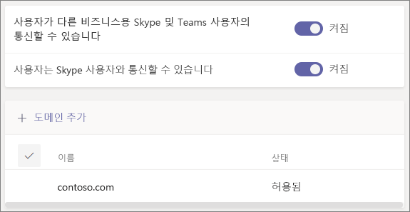

# Microsoft Teams에서 조직 외부의 사용자와 통화, 채팅 및 공동 작업Call, chat, and collaborate with people outside your organization in Microsoft Teams

조직 외부의 사용자와 의사 소통 및 공동 작업을 해야 하는 경우 Microsoft Teams에서는 다음 두 가지 옵션을 제공합니다.When you need to communicate and collaborate with people outside your organization, Microsoft Teams has two options:

- **외부 액세스** - 다른 조직의 사용자를 찾고, 통화하고, 채팅할 수 있는 페더레이션 유형입니다.**External access** - A type of federation that allows users to find, call, and chat with people in other organizations. 이러한 사용자는 게스트로 초대되지 않는 한 팀에 추가할 수 없습니다.These people cannot be added to teams unless they are invited as guests.
- **게스트 액세스** - 게스트 액세스를 통해 조직 외부의 사용자를 팀에 초대할 수 있습니다.**Guest access** - Guest access allows you to invite people from outside your organization to join a team. 초대된 사용자는 Azure Active Directory에서 게스트 계정을 갖게 됩니다.Invited people get a guest account in Azure Active Directory.

Teams를 사용하면 조직 외부의 사용자들을 모임에 초대할 수 있습니다.Note that Teams allows you to invite people outside your organization to meetings. 이 경우 외부 또는 게스트 액세스를 구성할 필요가 없습니다.This does not require external or guest access to be configured.

## 외부 액세스(페더레이션)External access (federation)

Teams, 비즈니스용 Skype(온라인 또는온-프레미스) 또는 Skype를 사용하는 조직 외부 사용자와의 모임을 검색, 통화, 채팅, 설정해야 하는 경우 외부 액세스를 설정하세요.Set up external access if you need to find, call, chat, and set up meetings with people outside your organization who use Teams, Skype for Business (online or on premises) or Skype. 

기본적으로 Outlook 액세스는 모든 도메인에서 사용됩니다.By default, external access is enabled for all domains. 특정 도메인을 허용 또는 차단하거나 해제하여 외부 액세스를 제한할 수 있습니다.You can restrict external access by allowing or blocking specific domains or by turning it off.

외부 액세스를 구성하는 경우 [외부 액세스 관리](manage-external-access.md)를 참조하세요.To configure external access, see [Manage external access](manage-external-access.md). 

## 게스트 액세스Guest access

게스트 액세스를 사용하여 조직 외부의 사람을 팀에 추가하여 채팅, 통화, 미팅, 파일 공동 작업을 할 수 있습니다.Use guest access to add a person from outside your organization to a team, where they can chat, call, meet, and collaborate on files. 게스트는 기본 팀 구성원과 거의 동일한 모든 Teams 기능을 제공받을 수 있습니다.A guest can be given nearly all the same Teams capabilities as a native team member.

게스트는 조직의 Azure Active Directory에 B2B 사용자로 추가되며 게스트 계정을 사용하여 Teams에 로그인해야 합니다.Guests are added to your organization's Azure Active Directory as B2B users and must sign in to Teams using their guest account. 즉, 조직에 로그인하기 위해 자신의 조직에서 로그아웃해야 할 수 있습니다.This means that they may have to sign out of their own organization to sign in to your organization.

Teams에서 게스트 액세스를 구성하려면 [팀에서 게스트와 공동 작업](https://docs.microsoft.com/microsoft-365/solutions/collaborate-as-team)을 참조하세요.To configure guest access for Teams, see [Collaborate with guests in a team](https://docs.microsoft.com/microsoft-365/solutions/collaborate-as-team).

## 외부 및 게스트 액세스 비교Compare external and guest access

다음 표에서는 외부 액세스(페더레이션) 사용과 게스트 사용 간의 차이점을 보여줍니다.The following tables show the differences between using external access (federation) and guests. 두 경우 모두 조직 외부 사용자는 외부에 있는 사용자로 식별됩니다.In both cases, people outside your organization are identified to your users as being external.

### 사용자가 할 수 있는 일Things your users can do

| 사용자가 할 수 있음Users can | 외부 액세스 사용자External access users | 게스트Guests |
|---------|-----------------------|--------------------|
| 다른 조직에서 다른 사용자와 채팅Chat with someone in another organization | 예Yes | 예Yes |
| 다른 조직에서 다른 사용자와 통화Call someone in another organization | 예Yes | 예Yes |
| 다른 조직의 다른 사용자가 전화 또는 채팅을 할 수 있는지 확인See if someone from another organization is available for call or chat | 예Yes | 예1Yes1 |
| 다른 조직의 사용자 검색Search for people in other organizations | 예2Yes2 | 아니요No |
| 파일 공유Share files | 아니요No | 예Yes |
| 부재중 메시지 확인See the out-of-office message of | 아니요No | 예Yes |
| 다른 조직의 다른 사용자 차단Block someone in another organization someone in another organization | 아니요No | 예Yes |
| @멘션 사용Use @mentions | 예3Yes3 | 예Yes |

### 조직 외부 사용자가 할 수 있는 일Things people outside your organization can do

| 조직 외부 사용자가 할 수 있음People outside your organization can | 외부 액세스 사용자External access users | 게스트Guests |
|---------|-----------------------|--------------------|
| Teams 리소스에 액세스Access Teams resources | 아니요No | 예Yes |
| 그룹 채팅에 추가하기Be added to a group chat | 아니요No | 예Yes |
| 모임에 초대하기Be invited to a meeting | 예Yes | 예Yes |
| 개인 전화 걸기Make private calls | 예Yes | 예5Yes5 |
| 전화 접속 모임 참가자의 전화 번호 보기View the phone number for dial-in meeting participants | 아니요4No4 | 예Yes |
| IP 비디오 사용Use IP video | 예Yes | 예5Yes5 |
| 화면 공유 사용Use screen sharing | 예3Yes3 | 예5Yes5 |
| 모임 시작 사용Use meet now | 아니요No | 예5Yes5 |
| 보낸 메시지 편집Edit sent messages | 예3Yes3 | 예5Yes5 |
| 보낸 메시지 삭제Delete sent messages | 예3Yes3 | 예5Yes5 |
| 대화에서 Giphy 사용Use Giphy in conversation | 예3Yes3 | 예5Yes5 |
| 대화에서 밈 사용Use memes in conversation | 예3Yes3 | 예5Yes5 |
| 대화에서 스티커 사용Use stickers in conversation | 예3Yes3 | 예5Yes5 |
| 현재 상태가 표시됩니다.Presence is displayed | 예Yes | 예Yes |
| @멘션 사용Use @mentions | 예3Yes3 | 예Yes |

 

1 사용자가 게스트로 추가되어 있고 게스트 계정으로 로그인되어 있는 경우 제공됩니다.1 Provided that the user has been added as a guest and is signed with the guest account. 
2 전자 메일 또는 SIP(Session Initiation Protocol) 주소만 해당됩니다.2 Only by email or Session Initiation Protocol (SIP) address. 
3 서로 다른 두 조직의 Teams 전용 사용자에게 Teams 전용 1:1 채팅이 지원됩니다.3 Supported for 1:1 chat for Teams Only to Teams Only users from two different organizations.  
4 기본적으로 외부 참가자는 전화 접속 참가자의 전화 번호를 볼 수 없습니다.4 By default, external participants can't see the phone numbers of dialed-in participants. 이러한 전화 번호의 프라이버시를 유지하려면 **입장/종료** **알림** 유형에 대해 톤을 선택하십시오(이로 인해 Teams가 번호를 읽을 수 없음).If you want to maintain the privacy of these phone numbers, select **Tones** for **Entry/exit announcement type** (this prevents the numbers from being read out by Teams). 자세한 내용은 [Microsoft Teams에서 모임에 대한 입장 및 퇴장 알림 켜기 혹은 끄기](turn-on-or-off-entry-and-exit-announcements-for-meetings-in-teams.md)를 읽어보세요.To learn more, read [Turn on or off entry and exit announcements for meetings in Microsoft Teams](turn-on-or-off-entry-and-exit-announcements-for-meetings-in-teams.md).  
5 기본적으로 허용되지만 Teams 관리자가 해제할 수 있습니다5 Allowed by default, but can be turned off by the Teams admin

## 관련 항목Related topics

[Teams의 외부 액세스External access in Teams](manage-external-access.md)

[Teams의 게스트 액세스Guest access in Teams](guest-access.md)

