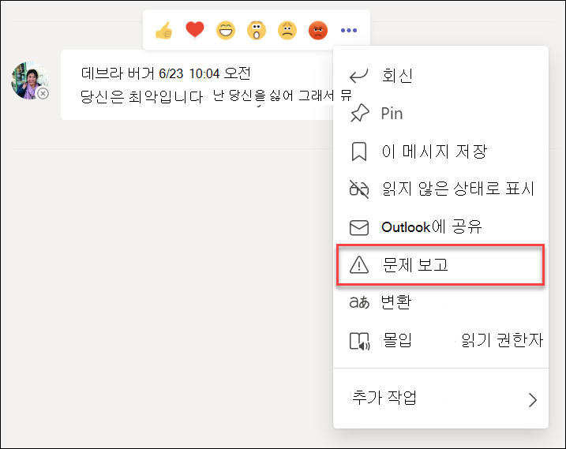
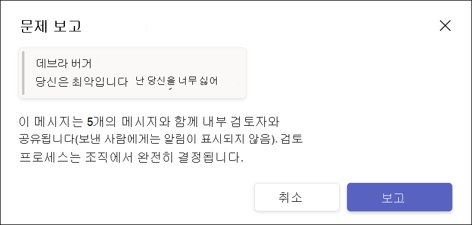

# 통신 규정 준수 Microsoft Teams

통신 준수는 조직의 부적절한 메시지를 감지, 캡처 및 Microsoft 365 통신 위험을 최소화하는 데 도움이 되는 내부자 위험 솔루션입니다.

Microsoft Teams 통신 규정 준수는 채널, 개인 Teams 채널 또는  1:Teams 1 및 그룹 채팅에서 다음과 같은 유형의 부적절한 콘텐츠를 식별하는 데 도움이 됩니다.

- 공격적, 언행 및 괴롭음
- 성인, 인종 및 고리 이미지
- 중요한 정보 공유

통신 준수 및 조직의 정책을 구성하는 방법에 대한 자세한 내용은 통신 규정 [준수를 Microsoft 365](/microsoft-365/compliance/communication-compliance). 통신 준수를 Microsoft 365 구독에 대한 자세한 내용은 [Insider 위험 솔루션을 참조하세요](/microsoft-365/compliance/insider-risk-solution-overview#communication-compliance).

## 통신 규정 준수를 사용하는 Microsoft Teams

통신 준수 및 Microsoft Teams 긴밀하게 통합되어 조직에서 통신 위험을 최소화하는 데 도움이 될 수 있습니다. 첫 번째 통신 준수 정책을 구성한 후 경고에 자동으로 플래그가 지정되는 Microsoft Teams 부적절한 메시지 및 콘텐츠를 적극적으로 관리할 수 있습니다.

### 시작

통신 규정 준수를 시작하는 Microsoft Teams 채널 또는 1:1 및 그룹에서 부  적절한 사용자 Teams 식별하기 위해 미리 정의된 또는 사용자 지정 정책을 계획하고 만드는 것부터 시작됩니다. 구성 프로세스의 일부로 일부 사용 권한 및  기본 구성 구성을 구성해야 합니다.

Teams 관리자는 다음 수준에서 통신 준수 정책을 구성할 수 있습니다.

- **사용자 수준**: 이 수준의 정책은 개별 사용자에 Teams 또는 조직의 모든 Teams 적용될 수 있습니다. 이러한 정책은 이러한 사용자가 1:1 또는 그룹 채팅으로 보낼 수 있는 메시지를 다를 수 있습니다. 사용자에 대한 채팅 통신은 사용자가 구성원인 모든 Microsoft Teams 자동으로 모니터링됩니다.
- **Teams 수준**: 이 수준의 정책은 개인 채널을 포함하여 Microsoft Teams 채널에 적용됩니다. 이러한 정책은 채널에서 보낸 메시지만 Teams 다를 수 있습니다.

### 문제 보고 Microsoft Teams

메시지 *의* Teams 보고서 옵션은 기본적으로 사용하도록 설정되어 있으며 Teams 관리 센터의 메시지 정책을 통해 Teams [수 있습니다](/microsoftteams/manage-teams-in-modern-portal). 이렇게 하면 조직의 사용자가 정책에 대한 통신 준수 검토자에 의해 검토하기 위해 부적절한 메시지를 제출할 수 있습니다. 통신 준수에서 사용자 보고 메시지에 대한 자세한 내용은 [통신 준수 정책을 참조하세요](/microsoft-365/compliance/communication-compliance-policies#user-reported-messages-policy).

검토를 위해 메시지를 제출한 후 사용자는 제출 확인을 Microsoft Teams. 채팅의 다른 참가자는 이 알림을 볼 수 없습니다.

조직의 사용자는 사용자 지정 정책을 만들고 할당하지 않는 한 전역 정책을 자동으로 얻습니다. 전역 정책의 설정을 편집하거나 하나 이상의 사용자 지정 정책을 만들어 할당하여 이 기능을 켜거나 해제합니다. 자세한 [내용은 메시지 정책](/microsoftteams/messaging-policies-in-teams) 관리를 Teams.

### 부적절한 메시지에 대해 Microsoft Teams

정책을 구성하고 메시지에 대한 통신 준수 경고를 Microsoft Teams 조직의 규정 준수 검토자는 이러한 메시지에 대해 행동할 때입니다. 조직에서 사용하도록 설정한 경우 사용자 보고 메시지도 포함됩니다. 검토자는 통신 준수 경고를 검토하고 플래그가 지정된 메시지를 보기에서 제거하여 조직을 보호할 수 Microsoft Teams.

제거된 메시지 및 콘텐츠는 메시지 또는 콘텐츠가 제거되고 제거에 적용할 수 있는 정책을 설명하는 시청자의 알림으로 대체됩니다. 제거된 메시지 또는 콘텐츠의 발신자도 제거 상태를 통보하고 해당 제거와 관련된 컨텍스트에 대한 원본 메시지 콘텐츠가 제공됩니다. 보낸 사람이 메시지 제거에 적용되는 특정 정책 조건을 볼 수도 있습니다.

보낸 사람이 볼 수 있는 정책 팁의 예:

보낸 사람이 볼 수 있는 정책 알림의 예:

받는 사람이 볼 수 있는 정책 팁의 예:

