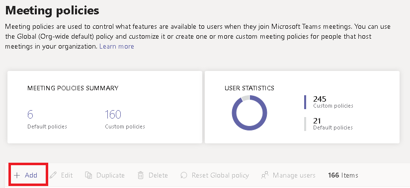

Microsoft Teams에서 데스크톱 공유 구성하기
============================================

데스크톱 공유를 통해 사용자는 모임이나 채팅 도중에 화면이나 앱을 표시할 수 있습니다. 관리자는 사용자가 전체 화면, 앱 또는 파일을 공유할 수 있도록 Microsoft Teams에서 화면 공유를 구성할 수 있습니다. 사용자가 제어권을 주거나 요청하고, PowerPoint 공유를 허용하고, 화이트보드를 추가하고, 공유 노트를 허용하도록 할 수 있습니다. 익명 사용자나 외부 사용자가 공유 화면의 제어권을 요청할 수 있는지 여부도 구성할 수 있습니다. Teams 모임의 외부 참가자는 다음과 같이 분류할 수 있습니다.

- 익명 사용자
- 게스트 사용자
- B2B 사용자
- 페더리된 사용자

화면 공유를 구성하려면 새 모임 정책을 만든 다음 관리하려는 사용자에게 할당합니다.

**[Microsoft Teams 관리 센터](https://admin.teams.microsoft.com/)에서**

1. **모임** > **모임 정책** 을 선택합니다.

    

2. 모임 정책 **페이지에서** 추가를 **선택합니다.**

    

3. 정책에 고유한 제목을 지정하고 간략한 설명을 입력합니다.

4. **콘텐츠 공유** 아래의 드롭다운 목록에서 **화면 공유 모드** 를 선택합니다.

   - **전체 화면** – 사용자가 전체 데스크톱을 공유할 수 있습니다.
   - **단일 응용 프로그램** – 사용자가 단일 활성 응용 프로그램으로 화면 공유를 제한하도록 합니다.
   - **사용 안 함** – 화면 공유를 끕니다.

    

  > [!Note]
  > 사용자가 채팅에서 화면 공유를 사용하기 위해 통화 정책을 사용하도록 설정할 수 없습니다. 그러나 오디오는 음소수 해제가 될 때까지 해제됩니다. 또한 화면을 공유하는 사용자는 오디오 추가를 클릭하여 **오디오를** 사용하도록 설정할 수 있습니다. 통화 정책을 사용하지 않도록 설정한 경우 사용자는 채팅 세션에서 화면 공유에 오디오를 추가할 수 없습니다.

5. 다음 설정을 켜거나 끕니다.

    - **참가자가 제어권 제공** 또는 요청 허용 - 팀 구성원이 발표자 데스크톱 또는 응용 프로그램의 제어를 제공하거나 요청할 수 있습니다.
    - **외부 참가자가 제어권** 제공 또는 요청 허용 - 사용자당 정책입니다. 조직에서 사용자에 대해 이 설정이 설정되어 있는지 여부는 모임 이끌이가 설정한 일과 관계 없이 외부 참가자가 할 수 있는 작업을 제어하지 않습니다. 이 매개 변수는 공유자가 조직의 모임 정책 내에서 설정한 값에 따라 외부 참가자에게 공유자 화면의 제어 또는 요청 제어를 부여할 수 있는지 여부를 제어합니다.
    - **PowerPoint 공유 허용** – 사용자가 PowerPoint 프레젠테이션을 업로드하고 공유하도록 허용하는 모임을 만들 수 있습니다.
    - **화이트보드 허용** – 사용자가 화이트보드를 공유할 수 있습니다.
    - **공유 노트 허용** – 사용자가 공유 노트를 작성할 수 있습니다.

6. **저장** 을 클릭합니다.

## PowerShell을 사용하여 공유 데스크톱 구성하기

[Set-CsTeamsMeetingPolicy](https://docs.microsoft.com/powershell/module/skype/set-csteamsmeetingpolicy?view=skype-ps) cmdlet을 사용하여 데스크톱 공유를 제어할 수도 있습니다. 다음 매개 변수를 지정합니다.

- Description
- ScreenSharingMode
- AllowPrivateCalling
- AllowParticipantGiveRequestControl
- AllowExternalParticipantGiveRequestControl
- AllowPowerPointSharing
- AllowWhiteboard
- AllowSharedNotes

[CsTeamsMeetingPolicy cmdlet을 사용하는 방법에 대해 자세히 알아보세요](https://docs.microsoft.com/powershell/module/skype/set-csteamsmeetingpolicy?view=skype-ps).
