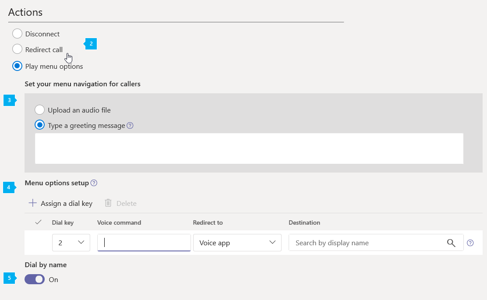
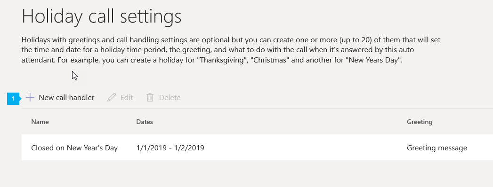
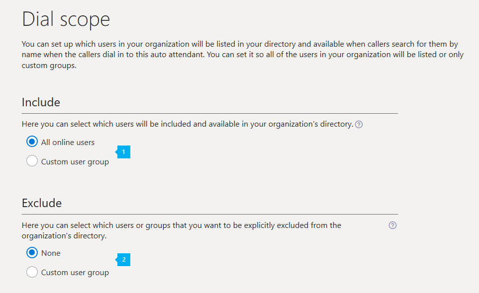

# 클라우드 자동 전화 교환 설정Set up a Cloud auto attendant

자동 전화 교환을 통해 사용자는 조직에 게 전화를 걸고 메뉴 시스템을 탐색 하 여 올바른 부서, 통화 대기열, 사람 또는 교환원에 게 말할 수 있습니다.Auto attendants let people call your organization and navigate a menu system to speak to the right department, call queue, person, or an operator. Microsoft 팀 관리 센터 또는 Powershell을 사용 하 여 조직에 대 한 자동 전화 교환을 만들 수 있습니다.You can create auto attendants for your organization with the Microsoft Teams admin center, or with Powershell. 자동 전화 교환을 만들려면 왼쪽 탐색 창에서 **음성** 으로 이동한 다음 **자동 전화 교환** > **새로 추가**를 선택 합니다.To create an auto attendant, go to **Voice** in the left navigation, and then select **Auto attendants** > **Add new**.

자동 전화 교환에 대해 자세히 알아보려면 [클라우드 자동 전화 교환 기능](/microsoftteams/what-are-phone-system-auto-attendants) 을 참조 하세요.If you want to learn more about auto attendants, see [What are Cloud auto attendants?](/microsoftteams/what-are-phone-system-auto-attendants)

> [!NOTE]
> 이 문서는 Microsoft 팀과 비즈니스용 Skype Online에 모두 적용 됩니다.This article applies to both Microsoft Teams and Skype for Business Online.

전화 번호는 자동 전화 교환에 직접 할당 되지 않고 자동 전화 교환에 연결 된 [리소스 계정](manage-resource-accounts.md) 으로 지정 되지 않습니다.Phone numbers are not directly assigned to the auto attendant, but rather to a [resource account](manage-resource-accounts.md) that is associated to the auto attendant.

자동 전화 교환 구현에는 종종 몇 가지 자동 전화 교환이 수반 됩니다.Auto attendant implementations often involve several auto attendants. 일반적으로 *첫 번째 수준* 자동 전화 교환에는 할당 된 전화 번호를 사용 하는 자원 계정이 있습니다.A *first-level* auto attendant usually has a resource account with an assigned phone number. 중첩 된 자동 전화 교환은 *첫 번째 수준* 자동 전화 교환이 호출로 연결 되는 두 번째 수준 메뉴로 사용 됩니다.A nested auto attendant is used as a second-level menu that the *first-level* auto attendant connects  as call to. *중첩* 된 자동 전화 교환은 해당 리소스 계정에 전화 번호를 할당 하지 않아도 됩니다.A *nested* auto attendant isn't required to  have a phone number assigned to its resource account.

## 1 단계-시작 하기Step 1 — Get started

- 자동 전화 교환은 연결 된 리소스 계정이 있어야 합니다.An auto attendant is required to have an associated resource account. 리소스 계정 및 필요한 모든 라이선스에 대 한 자세한 내용은 [팀에서 자원 계정 관리](manage-resource-accounts.md) 를 참조 하세요.See [Manage resource accounts in Teams](manage-resource-accounts.md) for details on resource accounts and all licenses required. 
 
<!-- When you create a new auto attendant in Teams after October 10th, 2019, the required auto attendant is automatically created and linked with the new auto attendant. -->
 
> [!TIP]
> 전화 시스템 라이선스가 있는 온라인 사용자 인 연산자나 메뉴 옵션으로 호출을 리디렉션하려면 엔터프라이즈 음성에 대해 사용 하도록 설정 해야 합니다.To redirect calls to an operator or a menu option that is an Online user with a Phone System license, you will need to enable them for Enterprise Voice. [비즈니스용 Skype 라이선스 할당](/skypeforbusiness/skype-for-business-and-microsoft-teams-add-on-licensing/assign-skype-for-business-and-microsoft-teams-licenses) 또는 [Microsoft 팀 라이선스 할당](assign-teams-licenses.md)을 참조 하세요.See [Assign Skype for Business licenses](/skypeforbusiness/skype-for-business-and-microsoft-teams-add-on-licensing/assign-skype-for-business-and-microsoft-teams-licenses) or [Assign Microsoft Teams licenses](assign-teams-licenses.md). Windows PowerShell을 사용할 수도 있습니다.You can also use Windows PowerShell. 예를 들어 다음을 실행 합니다.`Set-CsUser -identity "Amos Marble" -EnterpriseVoiceEnabled $true`For example, run: `Set-CsUser -identity "Amos Marble" -EnterpriseVoiceEnabled $true`

## 2 단계-자동 전화 교환 만들기Step 2 — Create auto attendants

> [!IMPORTANT]
> 모든 자동 전화 교환에는 연결 된 [리소스 계정이](manage-resource-accounts.md)있어야 합니다.Every auto attendant is required to have an associated [resource account](manage-resource-accounts.md). 먼저 리소스 계정을 만든 다음 자동 전화 교환에 연결할 수 있습니다.You must create the resource account first, then you can associate it to the auto attendant.

### Microsoft 팀 관리 센터With the Microsoft Teams admin center

**Microsoft 팀 관리 센터**에서 **음성** > **자동 전화 교환을**클릭 한 다음 **+ 추가**를 클릭 합니다.In the **Microsoft Teams admin center**, click   **Voice** > **Auto attendants**, then click **+ Add**:

#### 일반 정보 페이지General info page

* * *

**이름의** 설명선 번호 1의 아이콘은 자동 전화 교환의 표시 이름을 입력 합니다.
**Name** Enter a display name for your auto attendant. 이름은 필수 이며 공백을 포함 하 여 최대 64 자를 포함할 수 있습니다.The name is required and can contain up to 64 characters, including spaces. 여기에서 지정 하는 **이름은** **자동 전화 교환** 탭의 열에 나열 되어 있습니다.The **Name** you designate here is listed in a column on the **Auto attendants** tab.

* * *

  
 **연산자** 의 설명선 인 숫자 2의 아이콘입니다 (권장 사항).

**Operator** This is optional (but recommended). 호출자가 메뉴를 차단 하 고 지정 된 사람에 게 말할 수 있도록 **연산자** 옵션을 설정할 수 있습니다.You can set the **Operator** option to allow callers to break out of the menus and speak to a designated person.

0 키는 기본적으로 교환원에 게 할당 됩니다.The 0 key is assigned to Operator by default.

운영자를 설정 하는 경우 **통화 흐름** 페이지의 **편집 메뉴 옵션** 에서 옵션에 대해 전화를 거는 사람에 게 알려 주십시오.If you set an Operator, tell people who call about the option in **Edit menu options** on the **Call flow** page. 자동 전화 교환에 운영자를 설정 하는 경우 **호출자가 듣기** 상자에 해당 프롬프트 텍스트를 입력 하거나이 옵션을 포함 하도록 오디오 파일을 변경 합니다.If you set an operator on your auto attendant, you enter the corresponding prompt text in the **Callers will hear** box or change your audio file to include this option. 예를 들어 연산자의 경우 0을 누릅니다.For example, "For the Operator, press zero."

다음과 같은 여러 가지 방법으로 연산자를 설정할 수 있습니다.You have several ways to set the Operator:

- **연산자 없음** "연산자" 및 "0 키" 옵션을 사용 하지 않습니다.**No operator** disables the "Operator" and "Press 0" options. 현재 기본값입니다.This is the current default.
- **조직의 사용자** 가 Office 365에서 엔터프라이즈 음성 또는 할당 된 통화 계획을 사용 하도록 설정 된 전화 시스템 라이선스를 사용 하는 사용자를 할당 합니다.**Person in your organization** assigns a person with a Phone System license that is enabled for Enterprise Voice or assigned Calling Plans in Office 365. 발신자를 보이스 메일로 보내도록 설정할 수도 있습니다.You can also set it up so the caller is sent to voicemail. 전화를 음성 메일로 보내려면 **조직의 사용자** 를 선택 하 고 해당 계정의 설정을 설정 하 여 전화를 음성 메일로 바로 보냅니다.To send a caller to voicemail, select **Person in your organization** and set that account's settings to send calls directly to voicemail.

     > [!Note]
     > **조직의** 사용자는 비즈니스용 Skype 서버를 사용 하 여 온-프레미스 사용자 또는 온라인 사용자가 될 수 있습니다.**Person in your organization** can be an Online user or a user hosted on-premises using Skype for Business Server.

- **음성 앱**  이미 만들어진 자동 전화 교환 또는 통화 대기열에 연결 된 리소스 계정의 이름을 선택 합니다.**Voice app**  Select the name of the resource account linked to an auto attendant or call queue that has already been created. 연산자를 요청 하는 호출자가이 위치에서 리디렉션됩니다.Callers that request an operator are redirected there.  
<!--   

- **Auto attendant** Select the name of the resource account linked to an auto attendant that has already been created. Callers that request an operator are redirected there.
- **Call queue** Select the name of the resource account linked to a call queue that has already been created. Callers that request an operator are redirected there.

**Phone number (optional)** Enter the service phone number you want to assign to the new resource account this wizard creates and links to the new auto attendant. If you intend this auto attendant to be a nested auto attendant, it doesn't need a phone number. You can add one if for some reason you require several ways to connect to the auto attendant system.

> [!NOTE]
> Auto attendants created after October 10th, 2019 also create a new [resource account](manage-resource-accounts.md) that is associated with the auto attendant. If a phone number is applied to the auto attendant's resource account,  a Phone System - Virtual user license is applied to the resource account if one is available.
-->

* * *

 **표준 시간대** 의 설명선은 자동 전화 교환의 표준 시간대를 설정 하는 데 필요 합니다. **Time zone** You are required to set the time zone for your auto attendant. 설정이 조직에 대해 나열 된 주 주소의 표준 시간대 또는 다른 표준 시간대와 동일할 수 있습니다.The setting can be the same as the time zone of the main address listed for your organization, or a different time zone. 각 자동 전화 교환은 다른 표준 시간대를 가질 수 있습니다.Each auto attendant can have a different time zone. 자동 전화 교환에 설정 된 업무 시간에도이 표준 시간대가 사용 됩니다.The business hours set for the auto attendant also use this time zone. 일부 지역에서는 일광 절약을 사용 하는 것이 아니기 때문에 비즈니스 시간 불일치를 방지 하기 위해 올바른 표준 시간대를 설정 해야 합니다.Make sure to set the right timezone to avoid business-hours discrepancies since not all regions have Daylight Saving. 

* * *

  
 **언어** 의 설명선은 자동 전화 교환에 사용할 언어를 선택 합니다.

**Language** Select the language that you want to use for your auto attendant. 자동 전화 교환은이 언어를 호출자와 함께 사용 하 고 모든 시스템 메시지가이 언어로 재생 됩니다.The auto attendant uses that language with callers, and all system prompts are played in this language.

 * * *

의 설명선 음성 인식 기능을 사용 하는 경우이 옵션을 선택 하면 음성**입력** 을 사용할 수 있습니다.
**Enable voice inputs** Speech recognition is available if this option is selected. 발신자는 [설정한 언어로](set-auto-attendant-languages-for-audio-conferencing-in-teams.md)음성 입력을 사용할 수 있습니다.Callers can use voice input in the  [language you set](set-auto-attendant-languages-for-audio-conferencing-in-teams.md). 사용자가 휴대폰 키패드를 사용 하 여 선택 하 게 할 수만 있도록 하려면 음성 인식을 **Off**로 설정 합니다.If you want to only let people use their phone keypad to make selections, you can leave speech recognition set to **Off**.

* * *  

선택이 완료 되 면 **다음**을 클릭 합니다.When you finish with your selections, click **Next**.

#### 통화 흐름Call flow

> [!TIP]
> 업무 시간 중에 다른 통화 흐름 동작을 사용 하 여 사용자 지정 업무 시간 일정을 설정 하도록 선택할 수 있습니다.You can choose to set up a custom business hours schedule, with different call flow behaviors during and after business hours. 사용자 지정 일정을 설정 하려면 [이후 시간에 대 한 선택적 통화 흐름](#call-flow-for-after-hours)을 설정 합니다.To set a custom schedule, set the optional [Call flow for after hours](#call-flow-for-after-hours). 기본적으로 자동 전화 교환은 업무 시간 호출 흐름을 사용 합니다.By default, an auto attendant uses business hours call flows.

자동 전화 교환에 도달 하면 사용자가 듣는 인사말, 프롬프트 및 메뉴를 사용자 지정 하 여 설정할 수 있습니다.You can set up customized greetings, prompts, and menus that people hear when they reach your auto attendant.

* * *

**먼저 인사말 메시지 재생** 인사말은 선택 사항이 며 **인사말 없음으로**설정 하거나, **오디오 파일을 재생**하거나, **인사말 메시지를 입력할**수 있습니다.**First play a greeting message** A greeting is optional and can be set to **No greeting**, **Play an audio file**, or **Type a greeting message**.

> [!NOTE]
> 인사말은 첫 번째 수준 자동 전화 교환에 가장 유용 합니다.A greeting is most valuable for a first-level auto attendant. 중첩 된 자동 전화 교환에는 인사말이 필요 하지 않을 수도 있습니다.A nested auto attendant often doesn't need a greeting.

 표시 된 숫자 1, 설명선의 아이콘 **인사말**을 선택 하지 않으면 나중에 선택한 작업 중 하나에서 통화를 처리 하기 전에 호출자가 메시지 또는 인사말이 들리지 않습니다. If you select **No Greeting**, the caller doesn't hear a message or greeting before the call is handled by one of the actions you select later. 

<!-- You can also upload an audio file (in .wav, mp3 or .wma formats), or create a custom greeting using Text-to-Speech.-->

 의 숫자 2, 설명선에서 **오디오 파일 재생** 을 선택한 경우 **파일 업로드** 단추를 사용 하 여 오디오로 저장 된 녹음 된 인사말 메시지를 업로드할 수 있습니다. WAV,. MP3 또는. WMA 형식. If you select **Play an audio file** you can use the **Upload file** button to upload a recorded greeting message saved as audio in .WAV, .MP3, or .WMA format. 기록의 크기는 5mb를 초과할 수 없습니다.The recording can be no larger than 5 MB.

 의 설명선 **인사말 메시지 입력** 이 옵션을 선택 하는 경우 제공 된 필드에 시스템에서 읽을 텍스트 (최대 1000 자)를 입력 합니다. **Type a greeting message** If you choose this option, enter the text you want the system to read (up to 1000 characters) in the field provided. 예를 들어 "Contoso 시작 '을 입력 합니다.For example, enter "Welcome to Contoso. 귀하의 전화는 귀하에 게 중요 합니다. "Your call is important to us." 출력은 텍스트 음성 통화 소프트웨어로 만들어집니다.Output is created by text-to-voice software.

* * *

다음 작업에서 통화 **회람** 섹션의 다음 동작에서 전화를 걸 때 수행할 작업을 선택할 수 있습니다.You can select what happens next to calls from the following actions in the  **Then route the call** section. 설정은 **연결 끊기**, **통화 리디렉션**또는 **재생 메뉴 옵션**입니다.Settings are **Disconnect**, **Redirect call**, or **Play menu options**.

**연결 끊기를**선택 하는 경우에는 인사말이 재생 된 후 호출자의 연결이 끊어집니다.If you select **Disconnect**, the caller is disconnected after the greeting plays. 

 **리디렉션 호출** 의 설명선은 옵션에서 선택 하지 않고 선택한 대상에 호출자를 보냅니다. **Redirect call** sends the caller to the chosen destination without choosing from options. 다음과 같은 설정이 가능 합니다.The possible settings are:

  - **조직의 사용자** 선택 하는 계정에는 Enterprise Voice에 사용할 수 있는 전화 시스템 라이선스가 있거나 Office 365에서 통화 요금제를 할당 받아야 합니다.**Person in organization** The account you choose must have a Phone System license enabled for Enterprise Voice or have an assigned Calling Plan in Office 365. 발신자에 게 전화를 걸 수 있도록 설정할 수 있습니다: **조직에서 사용자** 를 선택 하 고 해당 계정이 음성 메일로 바로 착신 전환 되도록 설정 합니다.You can set it up so the caller can be sent to voicemail: select **Person in organization** and set that account to have calls forwarded directly to voicemail.

  > [!Note]
  > **조직의** 사용자는 비즈니스용 Skype 서버를 사용 하 여 온-프레미스 사용자 또는 온라인 사용자가 될 수 있습니다.**Person in organization** can be an Online user or a user hosted on-premises using Skype for Business Server.

  - **음성 앱** 이미 설정 된 자동 전화 교환 또는 통화 대기열을 선택 합니다.**Voice App** Select an auto attendant or call queue that has already been set up. 서비스와 연결 된 리소스 계정의 이름으로 자동 전화 교환 또는 통화 대기열을 검색 합니다.You search for the auto attendant or call queue by the name of the resource account associated with the service.
  - 보이스 **메일** 이 보이스 메일에 액세스 해야 하는 조직의 사용자를 나타내는 Office 365 그룹을 선택 합니다.**Voicemail** Select the Office 365 Group representing the users in your organization that need access to this voicemail. 여기서는 보이스 메일을 켤 수 있습니다.This is where you can turn on voicemail transcription too. Office 365 그룹이 필요 합니다.Requires an Office 365 Group.

  > [!NOTE]
> 이 자동 전화 교환 메일 계정에서 사용자에 게 전송 되는 음성 메시지는 팀에서 액세스할 수 없습니다.Voice messages sent to users from this auto attendant voicemail account can't be accessed in Teams. 전자 메일로 발송 됩니다.They'll come as an email.

<!-- - **Auto attendant** Select the name of an existing auto attendant.
- **Call queue** Select the name of an auto attendant that has already been created.
- **External phone number** routes the caller to a phone number outside your local system.
- **Operator** directs the call to a user you designate as an Operator. If you haven't previously set up an operator, an option to create one now shows up. The 0 key is assigned to Operator by default. Options for setting an Operator are:

  - **No operator** disables the "Operator" and "Press 0" options.
  - **Person in your organization** can be an Online user or a user hosted on-premises using Skype for Business Server. They must have a Phone System license that is enabled for Enterprise Voice or assigned Calling Plans in Office 365. Search for the operator in the **Destination for your operator** field.
  - **Auto attendant** lets you choose the name of an existing auto attendant.
  - **Call queue** lets you select an existing call queue.
  - **Group Voicemail** routes the call to a voicemail box that you select. -->

 * * *

 의 설명선 **메뉴 옵션** 을 선택 하면 오디오 파일을 사용할지 여부를 선택할 수 있습니다. 다이얼 패드 메뉴 옵션을 호출자에 게 제공 하기 위해 텍스트를 음성으로 렌더링 하도록 텍스트를 입력 합니다. When you select **Play menu options** You can select whether to use an audio file or enter text that will be rendered as text to speech to give dialpad menu options to callers. **호출 리디렉션** 또는 **연결 끊기** 옵션을 대신 하 여 선택 합니다.Select this instead of the **Redirect call to** or **Disconnect** options.

 의 설명선에서 **오디오 파일을 재생** 하면 호출자가 선택할 프롬프트 및 옵션을 설정할 수 있습니다. **Play an audio file** lets you set up a prompts and options for the caller to choose. 
- **오디오 파일 재생** 을 선택 하는 경우 **파일 업로드** 단추를 사용 하 여 오디오로 저장 된 녹음/녹화 된 인사말 메시지를 업로드할 수 있습니다. WAV,. MP3 또는. WMA 형식.If you select **Play an audio file** you can use the **Upload file** button to upload a recorded greeting message saved as audio in .WAV, .MP3, or .WMA format. 기록의 크기는 5mb를 초과할 수 없습니다.The recording can be no larger than 5 MB.

- **인사말 메시지 입력** 이 옵션을 선택 하는 경우 제공 된 필드에 시스템에서 읽을 텍스트 (최대 1000 자)를 입력 합니다.**Type a greeting message** If you choose this option, enter the text you want the system to read (up to 1000 characters) in the field provided. 예를 들어 "Contoso 시작 '을 입력 합니다.For example, enter "Welcome to Contoso. 귀하의 전화는 귀하에 게 중요 합니다. "Your call is important to us." 출력은 텍스트 음성 통화 소프트웨어로 만들어집니다.Output is created by text-to-voice software.

**메뉴 옵션 설정** 이 대화 상자에서 전화 키패드 또는 음성 명령을 추가 하거나 제거할 수 있습니다.**Set menu options** Telephone keypad or voice commands can be added or removed in this dialog. 메뉴 옵션을 삭제 하려면 음성 명령 항목을 제거 하 고 뒤로 **이동을** 다시 **선택**으로 설정 합니다.To delete a menu option, remove the voice command entry and set **Redirect to** back to **Select**.

> [!TIP]
> 옵션을 제거 하는 경우 메뉴 프롬프트 텍스트를 업데이트 하거나 오디오 메시지를 다시 녹음 합니다.Update menu prompt text or re-record the audio prompts when you remove options. 호출자에 대해 재생 되는 메뉴 메시지가 자동으로 업데이트 되지 않습니다.The menu prompt played for callers isn't automatically updated.  
>
> 모든 메뉴 옵션을 순서에 관계 없이 추가 하 고 제거할 수 있으며 키 매핑도 연속적으로 사용할 필요가 없습니다.Any menu option can be added and removed in any order, and the key mappings don't have to be continuous. 예를 들어 옵션에 매핑된 키가 0, 1, 3 인 메뉴를 만들 수 있지만 키 2는 사용 되지 않습니다.It is possible, for example, to create a menu with keys 0, 1, and 3 mapped to options, while the key 2 isn't used.

> [!NOTE]
> 키 \* (반복)와 \# (뒤로)는 시스템에 예약 되어 있으므로 다시 할당할 수 없습니다.The keys \* (Repeat) and \# (Back) are reserved by the system and can't be reassigned. 음성 인식 기능을 사용 하는 경우 \*를 누르면 "Repeat"와 #이 "뒤로" 음성 명령에 해당 합니다.If speech recognition is enabled, pressing \* will correspond with "Repeat" and # will correspond with the "Back" voice commands.

 표시 되는 숫자 3의 아이콘에는 **+ 다이얼 키 할당** 을 클릭 하 고 다음 옵션에 대 한 정보를 입력 합니다. To set up a menu option, click on the  **+Assign a dial key** and enter information for the following options:

  **음성 명령** 열의 설명선 번호 4는 최대 64 자까지 입력할 수 있으며 "고객 서비스" 또는 "작업 및 Grounds" 등의 여러 단어를 포함할 수 있습니다.  **Voice command** column for an option can be up to 64 characters long, and can contain multiple words like "Customer Service" or "Operations and Grounds." 음성 인식 기능을 사용 하도록 설정 하면 이름이 자동으로 인식 되 고, 발신자는 3을 눌러 "3" 이라고 말 하거나 "고객 서비스" 라고 말하여 키 3에 매핑된 옵션을 선택할 수 있습니다.If speech recognition is enabled, the name is automatically recognized, and the caller is able to press 3, say "three," or say "Customer Service" to select the option mapped to key 3. 이 텍스트는 "교환원에 게 착신 전환 중" 처럼 서비스 확인 프롬프트에 대 한 텍스트를 음성으로 렌더링 하기도 합니다.This text is also rendered by text to speech for the service confirmation prompt, which might be something like "Transferring your call to the Operator."

 에 있는 숫자 5의 아이콘으로 리디렉션 옵션은 해당 키를 누르거나 음성 인식을 사용 하 여 선택한 옵션 **을** 설정 합니다.  The **Redirect to** option sets where the call goes if the corresponding key is pressed, or the option is selected using speech recognition. 통화는 다음으로 전송 될 수 있습니다.The call can be sent to:

<!-- Is the Operator behavior changing here? Looks like operator is only an available option for dial key 0 -->

- **연산자** 연산자가 이미 설정 된 경우이 옵션은 키 0에 자동으로 매핑되지만, 삭제 하거나 다른 키에 다시 할당할 수도 있습니다.**Operator** If an operator is already set up, the option is automatically mapped to key 0, but can also be deleted or reassigned to a different key. 이 옵션을 선택 하는 호출자가 지정 된 운영자에 게 전송 됩니다.The caller who selects this option is sent to the designated Operator. If 연산자가 아무 키로도 설정 되어 있지 않으면 음성 명령 "연산자"를 사용할 수 없습니다.If Operator isn't set to any key, the voice command "Operator" is also disabled. 
- **조직의** 사용자는 비즈니스용 Skype 서버를 사용 하 여 온-프레미스 사용자 또는 온라인 사용자가 될 수 있습니다.**Person in organization** can be an Online user or a user hosted on-premises using Skype for Business Server. 사용자는 Office 365에서 엔터프라이즈 음성 또는 할당 된 통화 요금제를 사용 하도록 설정 된 전화 시스템 라이선스가 있어야 합니다.The user must have a Phone System license that is enabled for Enterprise Voice or assigned Calling Plans in Office 365. **이름으로 검색** 필드에서 해당 사용자를 검색 합니다.Search for the person in the **Search by name** field.

- **음성 앱** 이미 설정 된 자동 전화 교환 또는 통화 대기열을 선택 합니다.**Voice App** Select an auto attendant or call queue that has already been set up. 응용 프로그램과 연결 된 리소스 계정의 이름으로 자동 전화 교환 또는 통화 대기열을 검색 합니다.You search for the auto attendant or call queue by the name of the resource account associated with the application.

- 보이스 **메일** 이 보이스 메일에 액세스 해야 하는 조직의 사용자를 나타내는 Office 365 그룹을 선택 합니다.**Voicemail** Select the Office 365 Group representing the users in your organization that need access to this voicemail. 여기서는 보이스 메일을 켤 수 있습니다.This is where you can turn on voicemail transcription too. Office 365 그룹이 필요 합니다.Requires an Office 365 Group.

<!-- - **Auto attendant** Select the name of an existing auto attendant in the **Search by name** field. You will also have to select a resource account associated to the auto attendant. The caller who selects this option is sent to that auto attendant.
- **Call queue** Select the name of an existing call queue in the **Search by name** field. You will also have to select a resource account associated to the call queue. The caller who selects this option is sent to that call queue, where the call is answered by a call agent.
- **External phone number** routes the caller to a designated phone number outside your local system.<!-- does this have prerequisites like direct routing?
- **Group Voicemail** routes the call to a voicemail box that you select.  -->

  **디렉터리 검색** 에 있는 숫자 6의 아이콘을 사용 하 여 자동 전화 교환에 대 한 **전화 걸기** 및 **내선** 번호로 전화를 걸 수 있습니다.  **Directory search** In this section, you can enable **Dial by name** and **Dial by Extension** for the auto attendant. 전화 걸기 범위 (선택 사항) 페이지에서 이러한 서비스에 포함 되지 않는 사용자를 설정할 수 있습니다.You can set who is and is not included in these services in the optional Dial Scope page. 디렉터리 검색은 기본적으로 **없음** 으로 설정 됩니다.Directory search is set to **None** by default.

**이름으로 전화 걸기** 이 옵션을 사용 하도록 설정 하는 경우 발신자는 **이름으로 다이얼**을 사용 하 여 조직에서 사용자를 검색할 수 있습니다.**Dial by name** If you enable this option, callers can search for people in your organization using **Dial by name**. 사용자의 이름과 음성 인식이 사용자에 게 일치 하는 것으로 가정 합니다.They say the user's name and voice recognition matches them to a user. 전화 걸기 범위 (선택 사항) 페이지에서 이러한 서비스에 포함 되지 않는 사용자를 설정할 수 있습니다.You can set who is and is not included in these services in the optional Dial Scope page. 전화 시스템 라이선스가 있는 모든 온라인 사용자 또는 비즈니스용 Skype 서버를 사용 하 여 온-프레미스에 호스팅되는 사용자는 적격 사용자 이며 이름으로 전화를 걸 수 있습니다.Any online user with a Phone System license, or any user hosted on-premises using Skype for Business Server, is an eligible user and can be found with Dial by name.

**내선** 번호 이 옵션을 사용 하도록 설정 하는 경우 발신자는 휴대폰 내선 번호를 입력 하 여 조직의 사용자와 연결할 수 있습니다.**Dial by extension** If you enable this option, callers can connect with users in your organization by entering their phone extension. 전화 걸기 범위 (선택 사항) 페이지에서 **전화 접속을 통해** 사용할 수 있거나 사용할 수 없음으로 나열 되는 사용자를 선택할 수 있습니다.You can select which users are listed as available or not available for **Dial by extension** in the optional Dial Scope page. 휴대폰 시스템 라이선스가 있는 모든 온라인 사용자 또는 비즈니스용 Skype를 사용 하 여 온-프레미스에 호스팅되는 모든 사용자는 적격 사용자 이며, 내선 번호로 전화 접속을 통해 찾을 수 있습니다.Any online user with a Phone System license, or any user hosted on-premises using Skype for Business Server, is an eligible user and can be found with Dial by extension.

> [!IMPORTANT]
> 다음 사항을 준수 하세요.Please observe the following:
>- 내선 번호로 전화를 걸 수 있도록 하려는 사용자는 내선 번호가 [Microsoft 365 관리 센터](https://docs.microsoft.com/office365/admin/add-users/add-users?view=o365-worldwide#use-the-new-admin-center-to-add-users)에서 할당 된 전화번호 또는 휴대 전화 번호의 일부로 지정 되어 있어야 합니다.Users you wish to make available for Dial By Extension need to have an extension specified as part of their phone number or mobile phone number assigned in the [Microsoft 365 admin center](https://docs.microsoft.com/office365/admin/add-users/add-users?view=o365-worldwide#use-the-new-admin-center-to-add-users).  사용자 전화 번호 필드에 확장명을 입력 하는 데 필요한 형식은 `+<phonenumber>;ext=<extension>` 또는 `x<extension>`입니다.The required format to enter the extension in the user phone number field is is either `+<phonenumber>;ext=<extension>` or `x<extension>`.
>- 팀 관리 센터에서 확장을 할당 하는 것은 현재 지원 되지 않습니다.Assigning an extension in Teams Admin center is not currently supported. [Set-MsolUser](https://docs.microsoft.com/powershell/module/msonline/set-msoluser?view=azureadps-1.0) powershell 명령 또는 Microsoft 365 관리 센터를 사용 해야 합니다.You must either use the [Set-MsolUser](https://docs.microsoft.com/powershell/module/msonline/set-msoluser?view=azureadps-1.0) powershell command or the Microsoft 365 admin center.
>- AAD PhoneNumber를 변경 하기 전에 최대 12 시간까지 걸릴 수 있으며 MobilePhone 특성을 사용할 수 있습니다.It can take up to 12 hours before changes to the AAD PhoneNumber and MobilePhone attributes are available.
>- 사용자의 LineUri에 대 한 확장을 정의 하지 마세요.Please do NOT define an extension for the LineUri of a user. 이는 현재 지원 되지 않습니다.This is  not supported currently.
>- 자동 전화 교환은 이름으로 전화 걸기 또는 내선 번호를 통해 전화 접속으로 구성할 수 있습니다.An auto attendant can be configured for either dial by name or dial by extension, but not both.

> [!NOTE]
> **전화 걸기 이름** 및 **전화** 걸기 기능을 사용 하는 경우 호출자에 게 사용자의 내선 번호를 알고 있는 경우 메뉴 옵션을 선택 하는 기본 자동 전화 교환 ( **이름으로 전화 걸기**사용 가능)을 만들고이 옵션을 설정 하 여 전화를 다이얼에의 한 자동 전화 교환에 사용할 수 있도록 허용 합니다.If you want to use both the **Dial by name** and **Dial by extension** features, you can create  main auto attendant (enabled for **Dial by name**) that prompts callers to choose a menu option if they know the extension of the user, and set that option to transfer the call to an auto attendant enabled for Dial by extension.

* * *

<!--
**Instructions for callers** lets you choose **Use recorded call instructions** or **Write your call instructions**.  

If you choose **Use recorded call instructions**, you have the option to record and upload new or prerecorded sound files to play as menu instructions. The same app used in recording the auto attendant greeting is used here.

If you choose **Write your call instructions**, enter the script  you want the system to read (up to 1000 characters). For example, you might enter text that begins "Please choose from one of the following menu options ... " and provide a script written to reflect your configuration.
* * *  -->

선택이 완료 되 면 **다음** 을 클릭 하 여 고급 설정을 변경 하거나, 다음과 같은 경우에 대 한 기본 설정을 사용 하려면 **제출을** 클릭 합니다.When you are finished with your selections, you can click **Next** if you want to change advanced settings, or click **Submit** if you want to use default settings for things like:
- 이후 시간에 대 한 통화 흐름Call flow for after hours
- 휴일에 대 한 통화 흐름Call flow for holidays
- 전화 걸기 범위Dial Scope
- 자원 계정Resource accounts

자동 전화 교환은 리소스 계정이 있어야 하기 때문에 **리소스 계정** 페이지로 진행 하 고 이미 구성한 리소스 계정을 연결 하거나 리소스 계정을 만들고 [Microsoft 팀의 자원 계정 관리](manage-resource-accounts.md)에 설명 된 대로 자동 전화 교환에 연결 하도록 선택할 수 있습니다.Since your auto attendant is required to have a resource account, you have a choice of proceeding to the **Resource account** page and associating a resource account you've already configured, or creating a resource account and associating it to the auto attendant as described in [Manage resource accounts in Microsoft Teams](manage-resource-accounts.md). 이 자동 전화 교환은 리소스 계정에 연결 될 때까지 사용할 수 없게 됩니다.You won't be able to use this auto attendant until it has been associated to a resource account. 이렇게 하려면 화면 맨 아래에 있는 **다음** 단추를 클릭 한 다음 왼쪽 탐색 모음에서 **리소스 계정을** 클릭 하 여 리소스 계정 페이지로 바로 이동 하 고 자동 전화 교환을 리소스 계정에 연결 합니다.to do this, click the **Next** button at the bottom of the screen and then click on **Resource accounts** in the left navigation to go straight to the Resource accounts page and associate your auto attendant to a resource account.

#### 고급 설정 (선택 사항)Advanced settings (optional)

선택할 때 기본으로 구성 하거나 남겨둘 수 있는 4 개의 추가 화면이 있습니다.There are four additional screens that you can configure or leave at defaults as you choose.

##### 이후 시간에 대 한 통화 흐름Call flow for after hours

기본적으로 자동 전화 교환의 업무 시간은 9am-5pm로 설정 되며 월요일 ~ 금요일By default, an auto attendant's business hours are set to 9am-5pm, Monday to Friday  <!--24/7-->, 모든 시간이 *업무 시간*으로 간주 되기 때문에 *시간이 지난 후* 통화 흐름 옵션은 사용할 수 없습니다., and the call flow options for *after hours* calls are disabled because all hours are considered *business hours*. **사용자 지정 비즈니스 시간 설정** 옵션을 선택 하면 시간 이후 자동 전화 교환에 사용 되는 통화 처리 규칙이 **다음 시간 후 호출 흐름 페이지에** 구성 됩니다.When you select the **Setup custom business hours** option, the **Call flow for after hours** page configures the call handling rules used by the auto attendant after hours. 사용할 수 있는 옵션은 서로 다른 메뉴 및 동작에 대 한 일정을 설정할 수 있는 기능입니다.The options available are the same, the difference is the ability to set a schedule for different menus and behaviors.

자동 전화 교환 시스템은 첫 번째 수준 자동 전화 교환에 대 한 시간 통화 처리 동작 이후에 설정 해야 할 수 있습니다.A system of auto attendants may only need to set after hours call handling behavior for the first-level auto attendant. 중첩 된 자동 통화는 첫 번째 수준 자동 전화 교환에 의해 호출 되지 않을 수 있지만, 그 외에도 시스템은 사용 하는 각 자동 전화 교환에 대 한 이후 시간 동작을 정의할 수 있습니다.Nested auto attendants may not even be called by the first-level auto attendant, but alternately the system can define after-hours behavior for each auto attendant it uses.

처음에는 업무 시간이 12:00 오전부터 시작 하 여 12:00 pm, 일요일 ~ 토요일에 종료 되도록 정의 되어 있습니다.Initially, the business hours are defined to start at 12:00 am and end at 12:00 pm, Sunday through Saturday. 업무 시간 중에는 하지 않는 모든 시간은 *몇 시간 후*로 간주 됩니다.All hours that aren't during business hours are considered *after hours*.

 * * *

 의 설명선 **24/7 선택을** 클릭 하 여이 자동 전화 교환에 대 한 업무 시간을 모두 만들 수 있습니다. You can click **Select 24/7** to make all hours business hours for this auto attendant.

 의 설명선은 일정의 모든 변경 내용을 되돌린 다음 **기본으로 재설정** 옵션을 선택 하 여 오전 9:00에서 5:00 pm 월요일부터 금요일까지 기본 정의 시간으로 반환 합니다. Select the **Reset to default** option to revert all changes in the schedule and return to the default definition of business hours as 9:00 am to 5:00 pm Monday to Friday.

 의 설명선에서는 일정을 완전히 지우는 **모든 시간 지우기를** 선택 합니다. Select **Clear all hours** to completely clear the schedule. 이 옵션을 선택 하 고 설정 해제 한 시간을 유지 하는 것은 권장 되지 않으므로 업무 시간을 완전히 다시 실행 하려는 경우에만이 옵션을 사용 하세요.Selecting this and leaving the hours unset is not recommended, so use this option only if you want to completely redo your business hours.

 스크린샷의 설명선이 표시 되는 목록에서 **시작** 날짜 또는 **종료** 시간을 클릭 하 고 새 시간을 선택 합니다.     To customize start or end time for a day of the week, click on **Start at** or **End at** time you wish to reset and select the new time from the list that appears. 이 목록을 사용 하 여 15 분 간격으로 업무 시간을 선택 하 고 여기에서 선택한 업무 시간은 **일반 정보** 페이지에서 설정한 표준 시간대를 기준으로 합니다.The list allows you to select business hours in 15-minute intervals, and the business hours you select here are based on the time zone that you set on the **General info** page.

 <!-- The **Apply to all days** option can be used to reset all days of the week to match the settings for that day. This makes setting weekdays and weekends to different hours easier.-->

 하는 설명선 (예: 점심 작업)을 선택 하 고 해당 요일에 대해 새 테이블 행을 **추가** 하 여 새 시작 시간 및 종료 시간을 선택 합니다.  To set up a break (a lunch break, for example), select **Add new time** for that day of the week to create anew table row, and select new start and end times. 업무 시간 내에 여러 휴식을 설정할 수 있습니다.You can set multiple breaks within business hours.

시간이 지난 후 사용할 수 있는 [통화 흐름](#call-flow) 옵션은 업무 시간 동안 사용할 수 있는 옵션과 같습니다.The [Call flow](#call-flow) options available after hours are the same as the options available during business hours. 정보 입력 페이지를 아래로 스크롤하여 시간 호출 흐름 옵션을 설정 합니다.Scroll down on the information entry page to set after hours call flow options.

* * *

선택이 완료 되 면 **다음**을 클릭 합니다.When you are finished with your selections, click **Next**. 왼쪽 탐색 모음에서 **자원 계정을** 클릭 하 여 리소스 계정 페이지로 바로 이동 하 고 자동 전화 교환을 리소스 계정에 연결할 수도 있습니다.You can also click on **Resource accounts** in the left navigation to go straight to the Resource accounts page and associate your auto attendant to a resource account.

##### 휴일 중 통화 흐름Call flow during holidays

각 자동 전화 교환에 최대 20 개의 예정 휴일을 추가할 수 있습니다.You can add up to 20 scheduled holidays to each auto attendant. [Microsoft 팀의 휴일 설정](set-up-holidays-in-teams.md)에서 설명한 대로 조직에서 이미 휴일을 정의 했을 수 있습니다.Your organization may already have defined holidays as described in [Set up holidays in Microsoft Teams](set-up-holidays-in-teams.md). 그렇지 않으면 다음 화면이 표시 됩니다.If not you will see the following screen: 

 의 설명선 자동 전화 교환의 명절에 대 한 사용자 지정 통화 흐름을 설정 하는 아이콘을 클릭 하 고 **새 명절 통화 흐름** 보기 화면을 **추가** 합니다. To set a custom call flow for a holiday on the auto attendant, click **+ Add** the see the **New holiday call flow** screen.
> [!TIP]
> 휴일을 만들려면 **조직 전체에 걸친 설정** > **명절**의 화면으로 이동 하면 됩니다.To create Holidays you can  go to the screen at **Org-wide settings** > **Holidays**.  

* * *

 의 설명선 인 번호 1의 아이콘은 새 통화 흐름의 **이름을** 입력 합니다.  Enter a **Name** for your new call flow.

 의 설명선 인 번호 2의 아이콘 이미 공휴일을 만든 경우 **휴일** 풀 다운 메뉴에 표시 되 고 해당 항목을 선택할 수 있습니다. If you've already created holidays, you'll see them in the **Holiday** pull-down menu and can select them. 필요에 따라 편집할 수 있는 사용 되지 않는 옵션이 표시 될 수 있습니다.You might see an unused option that you can edit into what you need. 그렇지 않은 경우 풀 다운 목록의 아래쪽에 있는 **추가** 를 클릭 하 여 새 공휴일을 만듭니다.If not, click on **Add** at the bottom of the pull-down list to create a new Holiday.  휴일을 만드는 데 사용 되는 단계에 대해서는 [Microsoft 팀에서 휴일 설정을](set-up-holidays-in-teams.md) 참조 하세요.See [Set up holidays in Microsoft Teams](set-up-holidays-in-teams.md) for the steps used to create a holiday. 

명절 통화 흐름 이름은 최대 64 자까지 사용할 수 있으며, 조직에서 고유 해야 합니다.A holiday call flow name can be up to 64 characters long and must be unique for the organization. 예를 들어 같은 조직에서 "추수 감사절" 이라는 두 개의 휴일 통화 흐름을 사용할 수 없습니다.For example, you can't have two holiday call flows named "Thanksgiving" in the same organization. 자동 전화 교환에는 설정한 각 휴일에 대 한 통화 흐름이 있을 수 있지만, 사용자 지정 된 인사말이 아닌 일반적인 동작 집합을 사용 하는 것이 좋습니다.Your auto attendant can have a call flow for each Holiday you've set up, but you might want to have a common set of behaviors planned other than a customized greeting.

 의 설명선은 휴일 통화 흐름에 사용할 수 있는 [인사말](#call-flow) 옵션은 업무 시간 중에 사용할 수 있는 옵션과 같습니다. The [Greetings](#call-flow) options available for a holiday call flow are the same as the options available during business hours. 인사말이 재생 된 후 **에 수행할 수 있는 작업은** **연결 끊기** 또는 **리디렉션**만 가능 하 고 **리디렉션 옵션을** 선택 하면 해당 연산자가 사용 가능한 선택 항목 중 하나가 아님을 제외 하 고도 비슷합니다.The **Actions** performed after the greeting plays is also similar, except that the only available actions are to **Disconnect** or **Redirect to**, and when choosing the **Redirect to** option the Operator is not one of the available choices. 휴일 흐름과 관련 된 메뉴를 설정할 수 없습니다.You can't set up a menu specific to a Holiday flow.

> [!NOTE]
> 기본적으로 휴일 기간 중에 수신 되는 모든 통화는 인사말이 끝난 후 **연결을 끊도록** 설정 되므로 사용자 지정 동작을 원하는 경우에는 리디렉션을 지정 해야 합니다.By default, all calls received during a holiday period are set to **Disconnect** after the greeting (if any), so you must specify a redirect if you want a custom behavior.

저장을 클릭 하 여 명절 통화 흐름 만들기를 완료 합니다.Click on Save to finish creating the Holiday call flow. 명절 통화 흐름을 만든 후에는 **휴일 화면 중에 통화 흐름** 에 표시 됩니다.Once you have created a Holiday call flow, it will show up on the **Call Flows during holidays** screen.

**다음** 을 클릭 하 여 전화 걸기 범위 설정, **뒤로** 시간 통화 흐름을 변경 하 고 작업을 완료 한 경우에는 **제출** 합니다.Click on **Next** to set Dial scope, **Back** to make changes to after hour call flows, and **Submit** if you are finished. 왼쪽 탐색 모음에서 **자원 계정을** 클릭 하 여 리소스 계정 페이지로 바로 이동 하 고 자동 전화 교환을 리소스 계정에 연결할 수도 있습니다.You can also click on **Resource accounts** in the left navigation to go straight to the Resource accounts page and associate your auto attendant to a resource account.

#### 전화 걸기 범위Dial scope

이 페이지에서는 사용자가 조직에 전화를 걸 때 디렉터리에 나열 된 사용자 이름으로 전화를 걸 수 있도록 설정할 수 있습니다.On this page, you can set who is listed in your directory and available for Dial by Name when a person calls your organization. 이전 화면에서 기본적으로 전화 걸기 이름을 **Off** 로 설정 합니다.Dial by name is set to **Off** by default in an earlier screen. 내선 **번호로 전화 걸기를** 이전에 선택한 경우에는 확장명을 가진 모든 사용자를 사용할 수 있습니다.All users with an extension will be available if **Dial by extension** was selected earlier.

 의 설명선은 **모든 온라인 사용자** 또는 **사용자 지정 사용자 그룹인** 이 섹션의 옵션을 **포함** 합니다. **Include** The options in this section are either **All online users** or **Custom user groups**

**모든 온라인 사용자**를 선택 하면 디렉터리 검색에 모든 적격 사용자가 포함 됩니다.If you select **All online users**, all eligible users are included in directory search.

**사용자 지정 사용자 그룹** 이 옵션을 사용 하면 조직에서 이미 만든 Office 365 그룹, 메일 그룹 또는 보안 그룹을 검색 하 고 선택할 수 있습니다.**Custom user groups** This option lets you search for and select an Office 365 Group, distribution list, or security group already created in your organization. 사용자가 선택 된 Office 365 그룹, 메일 그룹 또는 보안 그룹과 온라인 사용자이 고, **전화 시스템 라이선스가** 있거나, 비즈니스용 Skype Server를 사용 하 여 온-프레미스에 호스팅되는 경우 해당 디렉터리가 디렉터리에 추가 됩니다.Users are added to the directory if they are in the chosen Office 365 Group, distribution list, or security group and they are **Online users with a Phone System license** or hosted on-premises using Skype for Business Server. 여러 개의 Office 365 그룹, 배포 목록, 보안 그룹을 디렉터리에 추가할 수 있습니다.You can add multiple Office 365 Groups, distribution lists, and security groups to the directory.

이 페이지에서 조직에 속한 사용자가 디렉터리에 나열 되 고 조직에 전화를 거는 사용자가 이름으로 다이얼을 사용할 수 있도록 설정할 수 있습니다.On this page, you can set up which users in your organization will be listed in your directory and available for Dial by Name when a person that calls in to your organization.

 의 설명선이 섹션의 옵션을 **제외** 하면 조직의 디렉터리에서 특정 사용자 또는 사용자 그룹을 제외할 수 있습니다. **Exclude** The options in this section let you exclude specific users or groups of users from the organization's directory.

**없음**을 선택 하면 모든 적합 한 사용자가 디렉터리 검색에 포함 됩니다.If you select **None**, all eligible users are included in directory search.

사용자 **지정 사용자 그룹** 조직에서 만든 Office 365 그룹, 메일 그룹 또는 보안 그룹을 검색할 수 있습니다.**Custom user group** You can search for an Office 365 Group, distribution list, or security group that has been created in your organization. 해당 그룹의 사용자는 디렉터리 검색에서 제외 됩니다.Users in that group are excluded from directory search. 여러 개의 Office 365 그룹, 배포 목록, 보안 그룹을 추가할 수 있습니다.You can add multiple Office 365 Groups, distribution lists, and security groups.

이름으로 전화 걸기를 사용할 때 설정을 기본값으로 두면 디렉터리 검색에 모든 적격 사용자가 포함 됩니다.If you leave settings at their default when Dial by Name is enabled, all eligible users are included in directory search.

> [!NOTE]
> 새 사용자가 디렉터리에 이름을 나열 하는 데 최대 36 시간이 걸릴 수 있습니다.It might take up to 36 hours for a new user to have their name listed in the directory. 다른 사용자가 음성 인식을 사용 하 여 이름으로 전화 걸기를 사용 하는 경우이 기능에 대해 새 계정을 사용 하지 못할 수 있습니다.When someone uses Dial by Name with speech recognition, new accounts may not be available for this feature.

필요한 모든 필드를 입력 하 고 통화 처리 메뉴 및 옵션을 설정한 후에 **다음** 을 클릭 하 여 자원 계정 연결을 진행 합니다.After you enter all the required fields and set up call handling menus and options, click **Next** to proceed to associating a resource account.

#### 자원 계정Resource accounts

모든 자동 전화 교환에는 연결 된 리소스 계정이 있어야 합니다.All auto attendants must have an associated resource account.  첫 번째 수준 자동 전화 교환에는 연결 된 서비스 번호가 있는 리소스 계정이 하나 이상 필요 합니다.First level auto attendants will definitely need at least one resource account that has an associated service number. 원하는 경우 자동 전화 교환에 여러 개의 리소스 계정을 할당할 수 있으며, 각각 별도의 서비스 번호를 갖습니다.If you wish, you can assign several resource accounts to an auto attendant, each with a separate service number.

자동 전화 교환에 리소스 계정을 아직 구성 하지 않은 경우 다음 화면이 표시 됩니다.If you haven't already configured a resource account to your auto attendant, you would see the following screen: 

 

 교환에 추가 하는 이전 스크린샷의 아이콘 번호 1, **계정 추가** 및 검색을 차례로 클릭 하 고 제공 된 대화 상자에서 선택 합니다. To add one or more existing and unassigned resource accounts to the auto attendant, click **Add accounts** and search and select them from the provided dialogs.

 표시 된 설명선의 아이콘을 선택 하 여 추가 리소스 계정을 추가 하려면 **+ 계정 추가**를 클릭 합니다. To add an additional resource account, click on **+ Add account**.

 이 자동 전화 교환에 할당 된 리소스 계정이 목록에 표시 됩니다.The resource account or accounts assigned to this auto attendant are shown in a list.

## 자동 전화 교환 편집Edit auto attendants

새 자동 전화 교환이 저장 되 면 **자동 전화** 교환 페이지에 나열 됩니다.After you save your new auto attendant, it is listed on the **Auto attendants** page. 해당 페이지를 사용 하면 이름, 연결 된 자원 계정, 언어 및 할당 된 연산자를 포함 하 여 설정한 일부 옵션을 빠르게 확인할 수 있습니다.That page allows you to quickly see some of the options that you have set up, including the name, associated resource account, language, and assigned Operator.

자동 전화 교환 설정을 변경 하려는 경우 자동 전화 교환을 선택 하 고 작업 창에서 **편집**을 클릭 합니다.If you want to change auto attendant settings, select the auto attendant, and then in the Action pane click **Edit**.

<!-- To quickly place a test call to your auto attendant, click the **Test** button in the Action pane. -->

<!-- ## Summary view

You can use the Summary page to review the settings you've created.

Press the **Create** button to finish setup of your new auto attendant. -->

### Powershell을 사용 하 여 자동 전화 교환 만들기Create an auto attendant with Powershell

PowerShell을 사용 하 여 자동 전화 교환을 만들고 설정할 수도 있습니다.You can also use PowerShell to create and set up auto attendants. 자동 전화 교환을 관리 하는 데 필요한 cmdlet은 다음과 같습니다.Here are the cmdlets that you need to manage an auto attendant:

- [신규-CsAutoAttendant 전화 교환New-CsAutoAttendant](https://docs.microsoft.com/powershell/module/skype/new-csautoattendant?view=skype-ps)  
- [Set-CsAutoAttendant 전화 교환Set-CsAutoAttendant](https://docs.microsoft.com/powershell/module/skype/set-csautoattendant?view=skype-ps)
- [Get-CsAutoAttendant 전화 교환Get-CsAutoAttendant](https://docs.microsoft.com/powershell/module/skype/new-csautoattendant?view=skype-ps)
- [Get-CsAutoAttendantHolidaysGet-CsAutoAttendantHolidays](https://docs.microsoft.com/powershell/module/skype/get-csautoattendantholidays?view=skype-ps)
- [-CsAutoAttendant 전화 교환 제거Remove-CsAutoAttendant](https://docs.microsoft.com/powershell/module/skype/remove-csautoattendant?view=skype-ps)
- [새로운 CsAutoAttendantMenuNew-CsAutoAttendantMenu](https://docs.microsoft.com/powershell/module/skype/new-csautoattendantmenu?view=skype-ps)
- [새로운 CsOnlineAudioFileNew-CsOnlineAudioFile](https://docs.microsoft.com/powershell/module/skype/new-CsOnlineAudioFile?view=skype-ps)
- [새로운 CsAutoAttendantCallFlowNew-CsAutoAttendantCallFlow](https://docs.microsoft.com/powershell/module/skype/New-CsAutoAttendantCallFlow?view=skype-ps)
- [Export-CsAutoAttendantHolidaysExport-CsAutoAttendantHolidays](https://docs.microsoft.com/powershell/module/skype/export-csorganizationalautoattendantholidays?view=skype-ps)
- [새로운 CsOnlineTimeRangeNew-CsOnlineTimeRange](https://docs.microsoft.com/powershell/module/skype/new-csonlinetimerange?view=skype-ps)
- [새로운 CsOnlineDateTimeRangeNew-CsOnlineDateTimeRange](https://docs.microsoft.com/powershell/module/skype/new-csonlinedatetimerange?view=skype-ps)
- [새로운 CsOnlineScheduleNew-CsOnlineSchedule](https://docs.microsoft.com/powershell/module/skype/New-CsOnlineSchedule?view=skype-ps)
- [Get-CsAutoAttendantSupportedTimeZoneGet-CsAutoAttendantSupportedTimeZone](https://docs.microsoft.com/powershell/module/skype/Get-CsAutoAttendantSupportedTimeZone?view=skype-ps)
- [새로운 CsAutoAttendantCallHandlingAssociationNew-CsAutoAttendantCallHandlingAssociation](https://docs.microsoft.com/powershell/module/skype/New-CsAutoAttendantCallHandlingAssociation?view=skype-ps)
- [Get-CsAutoAttendantSupportedLanguageGet-CsAutoAttendantSupportedLanguage](https://docs.microsoft.com/powershell/module/skype/Get-CsAutoAttendantSupportedLanguage?view=skype-ps)
- [가져오기-CsAutoAttendantHolidaysImport-CsAutoAttendantHolidays](https://docs.microsoft.com/powershell/module/skype/import-csautoattendantholidays?view=skype-ps)
- [새로운 CsAutoAttendantCallableEntityNew-CsAutoAttendantCallableEntity](https://docs.microsoft.com/powershell/module/skype/New-CsAutoAttendantCallableEntity?view=skype-ps)

### Windows PowerShell에 대 한 자세한 정보More about Windows PowerShell

- Windows PowerShell은 사용자 및 허용 되지 않거나 수행할 수 있는 사용자를 관리 하는 방법에 대해 설명 합니다.Windows PowerShell is all about managing users and what users are allowed or not allowed to do. Windows PowerShell을 사용 하 여 일상 업무를 단순화할 수 있는 단일 관리 지점에서 Office 365 및 Microsoft 팀을 관리할 수 있습니다.With Windows PowerShell, you can manage Office 365 and Microsoft Teams from a single point of administration that can simplify your daily work. Windows PowerShell을 시작 하려면 다음 항목을 참조 하세요.To get started with Windows PowerShell, see these topics:

  - [Windows PowerShell 및 Lync Online 소개An introduction to Windows PowerShell and Skype for Business Online](/SkypeForBusiness/set-up-your-computer-for-windows-powershell/set-up-your-computer-for-windows-powershell)

  - [Office 365 PowerShell을 사용 해야 하는 이유Why you need to use Office 365 PowerShell](https://docs.microsoft.com/office365/enterprise/powershell/why-you-need-to-use-office-365-powershell)

- Windows PowerShell에는 Microsoft 365 관리 센터를 사용 하는 경우 한 번에 여러 사용자의 설정을 변경 하는 것과 같은 속도, 단순성, 생산성 등 다양 한 이점이 있습니다.Windows PowerShell has many advantages in speed, simplicity, and productivity over only using the Microsoft 365 admin center, such as making setting changes for many users at once. 다음 항목에서 이러한 이점에 대해 알아보세요.Learn about these advantages in the following topics:

  - [Office 365 PowerShell을 사용 하 여 Office 365 관리Manage Office 365 with Office 365 PowerShell](https://docs.microsoft.com/office365/enterprise/powershell/manage-office-365-with-office-365-powershell)

  - [Windows PowerShell을 사용 하 여 비즈니스용 Skype Online 관리Using Windows PowerShell to manage Skype for Business Online](/SkypeForBusiness/set-up-your-computer-for-windows-powershell/set-up-your-computer-for-windows-powershell)

## 관련 항목Related topics

[Office 365에서 전화 시스템을 사용 하 여 얻을 수 있는 기능Here's what you get with Phone System in Office 365](/MicrosoftTeams/here-s-what-you-get-with-phone-system)

[서비스 전화 번호 가져오기Getting service phone numbers](/microsoftteams/getting-service-phone-numbers)

[오디오 회의 및 통화 요금제 국가 및 지역 가용성Country and region availability for Audio Conferencing and Calling Plans](/microsoftteams/country-and-region-availability-for-audio-conferencing-and-calling-plans/country-and-region-availability-for-audio-conferencing-and-calling-plans)

[새로운 CsOrganizationalAutoAttendantNew-CsOrganizationalAutoAttendant](https://docs.microsoft.com/powershell/module/skype/new-csorganizationalautoattendant?view=skype-ps)  

[클라우드 자동 전화 교환이란?What are Cloud auto attendants?](what-are-phone-system-auto-attendants.md)

[Small business 예 — 자동 전화 교환 설정Small business example — Set up an auto attendant](/microsoftteams/tutorial-org-aa)  
