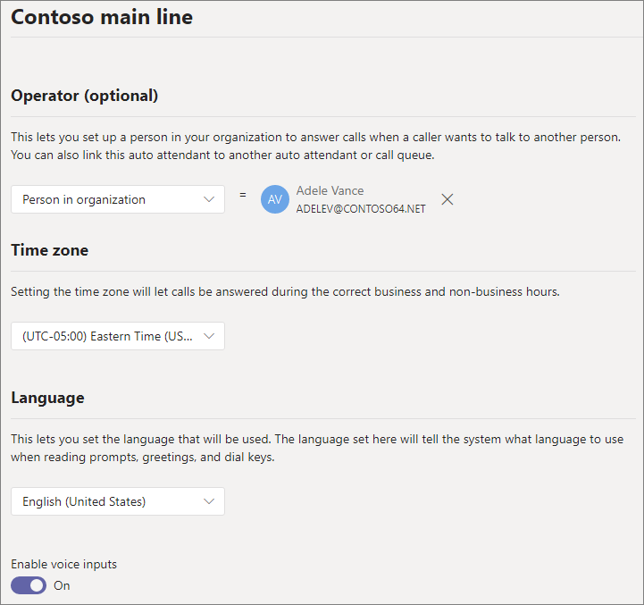
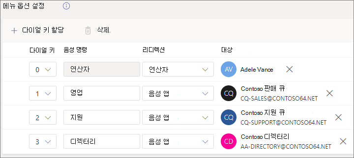
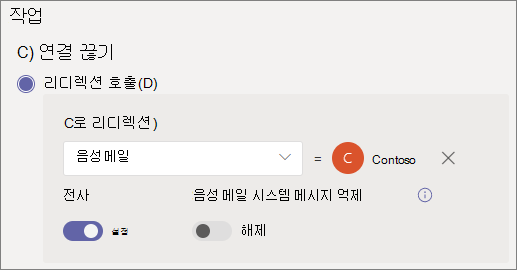

# 자동 전화 교환 설정

자동 전화 교환을 통해 사용자는 조직에 게 전화를 걸고 메뉴 시스템을 탐색 하 여 올바른 부서, 통화 대기열, 사람 또는 교환원에 게 말할 수 있습니다. Microsoft 팀 관리 센터 또는 PowerShell을 사용 하 여 조직에 대 한 자동 전화 교환을 만들 수 있습니다. 

이 문서의 절차를 따르기 전에 [팀 자동 전화 교환 및 통화 대기열에 대 한 요금제](plan-auto-attendant-call-queue.md) 를 확인 하 고 [시작 단계](plan-auto-attendant-call-queue.md#getting-started) 를 팔 로우 해야 합니다.

자동 전화 교환의 경우 발신자의 입력에 따라 다음 중 한 가지 대상에 게 전화를 걸 수 있습니다. 

- **조직 내 사람** -음성 통화를 받을 수 있는 조직의 사람입니다. 이는 비즈니스용 Skype 서버를 사용 하 여 온-프레미스 사용자 또는 온라인 사용자 일 수 있습니다.
- **음성 앱** -다른 자동 전화 교환 또는 통화 대기열. (이 대상을 선택할 때 자동 전화 교환 또는 통화 대기열과 연결 된 리소스 계정을 선택 합니다.)
- **외부 전화 번호** -전화 번호입니다. ( [외부 이전 기술 정보](create-a-phone-system-auto-attendant.md#external-phone-number-transfers---technical-details)를 참조 하세요.)
- 보이스 **메일** -사용자가 지정 하는 Microsoft 365 그룹과 연결 된 음성 사서함입니다.
- **Operator** -자동 전화 교환에 대해 정의 된 연산자입니다. 연산자 정의는 선택 사항입니다. 이 연산자는이 목록의 다른 대상 중 하에 정의 될 수 있습니다.

자동 전화 교환을 설정 하는 다양 한 단계에서 이러한 옵션 중 하나를 선택 하 라는 메시지가 표시 됩니다.

자동 전화 교환을 설정 하려면 팀 관리 센터에서 **음성을** 확장 하 고 **자동 전화 교환을** 클릭 한 다음 **추가** 를 클릭 합니다.

## 일반 정보

1. 맨 위의 상자에 자동 전화 교환 이름을 입력 합니다.

2. 연산자를 지정 하려는 경우 연산자에 대 한 호출 대상을 지정 합니다. 선택 사항입니다 (권장). 호출자가 메뉴를 차단 하 고 지정 된 사람에 게 말할 수 있도록 **연산자** 옵션을 설정할 수 있습니다.

3. 이 자동 전화 교환의 표준 시간대를 지정 합니다. 표준 시간대는 근무 시간 동안 [별도의 통화 흐름을 만든](#call-flow-for-after-hours)경우 업무 시간을 계산 하는 데 사용 됩니다.

4. 이 자동 전화 교환의 언어를 지정 합니다. 시스템 생성 음성 메시지에 사용 되는 언어입니다.

5. 음성 입력을 사용할 것인지 선택 합니다. 이 설정을 사용 하면 모든 메뉴 옵션의 이름이 음성 인식 키워드가 됩니다. 예를 들어 발신자는 "One" 이라고 말하여 키 1에 매핑된 메뉴 옵션을 선택 하거나 "Sales" 라고 말하여 "Sales" 라는 메뉴 옵션을 선택할 수 있습니다.

6. **다음** 을 클릭 합니다.

## 통화 흐름

자동 전화 교환에서 전화를 걸 때 인사말을 재생할 것인지 선택 합니다.

**오디오 파일 재생** 을 선택 하는 경우 **파일 업로드** 단추를 사용 하 여 오디오로 저장 된 녹음/녹화 된 인사말 메시지를 업로드할 수 있습니다. WAV,. MP3 또는. WMA 형식. 기록의 크기는 5mb를 초과할 수 없습니다.

**인사말 메시지 입력** 을 선택 하면 시스템에서 자동 전화 교환이 전화를 받을 때 입력 한 텍스트 (최대 1000 자) 텍스트를 읽습니다.

통화를 회람할 방법을 선택 합니다.

**연결 끊기를** 선택 하면 자동 전화 교환이 전화를 끊습니다.

**통화 리디렉션을** 선택한 경우에는 호출 라우팅 대상 중 하나를 선택할 수 있습니다.

**재생 메뉴 옵션** 을 선택한 경우 **오디오 파일 재생** 또는 **인사말 메시지 입력** 을 선택 하 고 메뉴 옵션 및 디렉터리 검색 중에서 선택할 수 있습니다.

### 메뉴 옵션

전화 걸기 옵션의 경우 전화 키패드의 0-9 키를 호출 라우팅 대상 중 하나에 할당할 수 있습니다. (키 \* (Repeat) \# 는 시스템에 의해 예약 되며 다시 할당할 수 없습니다.

키 매핑은 연속적으로 사용할 필요가 없습니다. 예를 들어 옵션에 매핑된 키가 0, 1, 3 인 메뉴를 만들 수 있지만, 2 개의 키는 사용 되지 않습니다.

1을 구성한 경우 연산자에 0 키를 매핑하는 것이 좋습니다. 연산자가 아무 키로도 설정 되지 않은 경우 음성 명령 "연산자"를 사용할 수 없습니다. 

각 메뉴 옵션에 대해 다음을 지정 합니다.

- **Dial 키** -이 옵션에 액세스 하려면 전화 키패드에서 키를 입력 합니다. 음성 입력을 사용할 수 있는 경우 발신자는이 번호를 발음 하 여 옵션에 액세스할 수도 있습니다.

- **음성 명령** -음성 입력이 활성화 된 경우이 옵션에 액세스 하기 위해 발신자가 지정할 수 있는 음성 명령을 정의 합니다. "고객 서비스" 또는 "작업 및 Grounds"과 같은 여러 단어를 포함할 수 있습니다. 예를 들어 발신자는 2를 누르거나 "2" 라고 말하고 "Sales" 라고 말하여 2 개의 키에 매핑된 옵션을 선택할 수 있습니다. 이 텍스트는 "영업에 대 한 통화 전환 중" 처럼 서비스 확인 프롬프트에 대해 텍스트를 음성으로 렌더링 하기도 합니다.

- **이동:** 발신자가이 옵션을 선택할 때 사용 되는 호출 라우팅 대상입니다. 자동 전화 교환 또는 통화 대기열로 리디렉션하는 경우에는 연결 된 리소스 계정을 선택 합니다.

### 디렉터리 검색

대상에 전화 걸기 키를 지정 하는 경우 **디렉터리 검색** 에 대해 **없음** 을 선택 하는 것이 좋습니다. 발신자가 특정 대상에 지정 된 키를 사용 하 여 이름 또는 내선 번호를 다이얼 하려고 하면 이름 또는 내선 번호 입력을 마치기 전에 예기치 않게 대상에 경로를 라우팅할 수 있습니다. 디렉터리 검색을 위해 별도의 자동 전화 교환을 만들고 전화 접속 키를 통해 해당 사용자에 게 기본 자동 전화 교환을 연결 하는 것이 좋습니다.

다이얼 키를 지정 하지 않은 경우에는 **디렉터리 검색** 옵션을 선택 합니다.

**이름으로 전화 걸기** -이 옵션을 사용 하도록 설정 하는 경우 발신자는 사용자의 이름을 말할 수 있고 전화 키패드에서 입력할 수도 있습니다. 전화 시스템 라이선스가 있는 모든 온라인 사용자 또는 비즈니스용 Skype 서버를 사용 하 여 온-프레미스에 호스팅되는 사용자는 적격 사용자 이며 이름으로 전화를 걸 수 있습니다. ( [전화 범위](#dial-scope) 페이지의 디렉터리에 포함 되지 않은 사용자를 설정할 수 있습니다.)

**내선 번호로 전화 걸기** -이 옵션을 사용 하도록 설정 하는 경우 발신자는 휴대폰 내선 번호로 전화를 걸어 조직의 사용자와 연결할 수 있습니다. 휴대폰 시스템 라이선스가 있는 모든 온라인 사용자 또는 비즈니스용 Skype를 사용 하 여 온-프레미스에 호스팅되는 모든 사용자는 적격 사용자 이며, **내선 번호로 전화 접속** 을 통해 찾을 수 있습니다. ( [전화 범위](#dial-scope) 페이지의 디렉터리에 포함 되지 않은 사용자를 설정할 수 있습니다.)

내선 번호로 전화 접속을 사용할 수 있도록 하려는 사용자는 Active Directory 또는 Azure Active Directory에 정의 된 다음 phone 특성 중 하나의 일부로 확장명을 지정 해야 합니다 (자세한 내용은 추가 정보를 보려면 [사용자를 개별적으로 추가 또는 대량 입력](https://docs.microsoft.com/microsoft-365/admin/add-users/add-users) 참조).

- OfficePhone
- HomePhone
- 모바일/MobilePhone
- TelephoneNumber/PhoneNumber
- 기타 전화

사용자 전화 번호 필드에 확장명을 입력 하는 데 필요한 형식은 *+ <phone number> ext = <extension>* 또는 *+ <phone number> x <extension>* 입니다.

[Microsoft 365 관리 센터](https://admin.microsoft.com/) 또는 [Azure Active Directory 관리 센터](https://aad.portal.azure.com)에서 확장을 설정할 수 있습니다. 자동 전화 교환 및 통화 대기열에서 변경 사항을 사용할 수 있으려면 최대 12 시간까지 걸릴 수 있습니다.

> [!NOTE]
> **이름으로 전화 걸기** 및 **내선** 번호를 사용 하 여 전화를 걸 때, 기본 자동 전화 교환에 다이얼 키를 할당 하 여 **전화를 걸** 수 있는 자동 전화 교환에 연결할 수 있습니다. 해당 자동 전화 교환 내에서 **전화를 걸 때 내선** 번호 자동 전화 교환에 도달 하는 1 개의 키 (이에는 연결 된 문자가 없음)를 할당할 수 있습니다.

**디렉터리 검색** 옵션을 선택한 후 **다음** 을 클릭 합니다.

## 이후 시간에 대 한 통화 흐름

각 자동 전화 교환에 대해 업무 시간을 설정할 수 있습니다. 비즈니스 시간이 설정 되어 있지 않으면 24/7 일정이 기본적으로 설정 되어 있으므로 일의 모든 일과 모든 시간이 시간으로 간주 됩니다. 업무 시간에는 하루에 휴식 시간을 설정할 수 있으며 업무 시간으로 설정 되지 않은 모든 시간은 근무 시간 이후로 간주 됩니다. 한 시간 내에 다른 수신 통화 처리 옵션과 인사말을 설정할 수 있습니다.

자동 전화 교환 및 통화 대기열을 구성한 방법에 따라 직접 전화 번호를 사용 하 여 자동 전화 교환에 대 한 다음 시간 후 통화 라우팅을 지정 하기만 하면 됩니다.

시간 단위 호출자에 대해 별도의 통화 라우팅이 필요한 경우 각 날짜별로 업무 시간을 지정 합니다. 지정 된 날짜에 여러 시간 집합을 지정 하려면 **새 시간 추가** 를 클릭 합니다 (예: 점심 약속 중단을 지정).

업무 시간을 지정한 후에는 시간이 지난 후 통화 회람 옵션을 선택 합니다. 위에서 지정한 업무 시간 통화 라우팅과 동일한 옵션을 사용할 수 있습니다.

완료 되 면 **다음** 을 클릭 합니다.

## 휴일 중 통화 흐름

자동 전화 교환에는 [설정한 각 휴일](set-up-holidays-in-teams.md)에 대 한 통화 흐름이 있을 수 있습니다. 각 자동 전화 교환에 최대 20 개의 예정 휴일을 추가할 수 있습니다.

1. 명절 통화 설정 페이지에서 **추가** 를 클릭 합니다.

2. 이 공휴일 설정의 이름을 입력 합니다.

3. **휴일** 드롭다운에서 사용 하려는 휴일을 선택 합니다.

4. 사용할 인사말 유형을 선택 합니다.

    

5. **연결을 끊거나** 통화를 **리디렉션할지** 여부를 선택 합니다.

6. 리디렉션을 선택한 경우 통화 회람 대상을 선택 합니다.

7. **저장** 을 클릭합니다.

각 휴일에 대해 필요에 따라이 절차를 반복 합니다.

모든 공휴일을 추가 했으면 **다음** 을 클릭 합니다.

## 전화 걸기 범위

*전화 걸기 범위* 는 발신자가 이름 또는 내선 번호를 사용 하 여 전화를 걸 때 디렉터리에서 사용할 수 있는 사용자를 정의 합니다. **모든 온라인 사용자** 의 기본값에는 비즈니스용 Skype 서버를 사용 하 여 온라인 사용자가 전화 시스템 라이선스 또는 온-프레미스에 호스팅되는 조직의 모든 사용자가 포함 됩니다.

**포함** 또는 **제외** 에서 **사용자 지정 사용자 그룹** 을 선택 하 고 하나 이상의 Microsoft 365 그룹, 배포 목록 또는 보안 그룹을 선택 하 여 특정 사용자를 포함 하거나 제외할 수 있습니다. 예를 들어, 전화 접속 디렉터리에서 조직의 임원을 제외 하는 것이 좋습니다. (사용자가 두 목록에 모두 있는 경우 해당 디렉터리에서 제외 됩니다.)

> [!NOTE]
> 새 사용자가 디렉터리에 이름을 나열 하는 데 최대 36 시간이 걸릴 수 있습니다.

전화 걸기 범위 설정을 마쳤으면 **다음** 을 클릭 합니다.

## 자원 계정

모든 자동 전화 교환에는 연결 된 리소스 계정이 있어야 합니다.  첫 번째 수준 자동 전화 교환에는 연결 된 서비스 번호가 있는 리소스 계정이 하나 이상 필요 합니다. 원하는 경우 자동 전화 교환에 여러 개의 리소스 계정을 할당할 수 있으며, 각각 별도의 서비스 번호를 갖습니다.

리소스 계정을 추가 하려면 **계정 추가** 를 클릭 하 고 추가 하려는 계정을 검색 합니다. **추가** 를 클릭 한 다음 **추가** 를 클릭 합니다.

서비스 계정 추가를 마쳤으면 **제출을** 클릭 합니다. 자동 전화 교환 구성이 완료 됩니다.

## 외부 전화 번호 전송-기술 세부 정보

외부 전화 번호로 통화를 전송할 때 자동 전화 교환 또는 통화 대기열과 연결 된 리소스 계정에는 전화 번호와 Microsoft 365 전화 시스템-가상 사용자 라이선스가 있어야 합니다. 업데이트로

- 통화 요금제 번호가 있는 자원 계정의 경우, [통화 요금제](calling-plans-for-office-365.md) 라이선스를 할당 합니다.
  - 외부 전송 전화 번호는 E-164 형식으로 입력 해야 합니다 (+ CC + phone_number).

- 직접 라우팅 번호가 있는 리소스 계정의 경우 [온라인 음성 라우팅 정책을](manage-voice-routing-policies.md)할당 합니다.
  - 외부 전송 전화 번호 형식은 [SBC (세션 경계 컨트롤러)](https://docs.microsoft.com/microsoftteams/direct-routing-connect-the-sbc) 설정에 따라 달라 집니다.

표시 되는 아웃 바운드 전화 번호는 다음과 같이 결정 됩니다.

  - 통화 요금제 번호의 경우 최초 발신자의 전화 번호가 표시 됩니다.
  - 직접 라우팅 번호의 경우 전송 되는 숫자는 다음과 같이 SBC에 대 한 P-어설션된-Identity (PAI) 설정을 기반으로 합니다.
    - 사용 안 함으로 설정 하면 최초 발신자의 전화 번호가 표시 됩니다. 이 설정이 기본값 이며 권장 되는 설정입니다.
    - 사용으로 설정 하면 리소스 계정 전화 번호가 표시 됩니다.

통화 요금제 trunks와 다이렉트 라우팅 trunks 간에 전송이 지원 되지 않습니다.

하이브리드 환경에서 비즈니스용 Skype PSTN 통합을 통해 PSTN으로 자동 전화 교환 통화를 전송 하려면 통화 전달을 PSTN 번호로 설정한 상태로 새 온-프레미스 사용자를 만듭니다. 사용자가 엔터프라이즈 음성을 사용할 수 있도록 설정 하 고 음성 정책을 할당 해야 합니다. 자세한 내용은 [PSTN으로 자동 전화 교환 통화 전송을](https://docs.microsoft.com/SkypeForBusiness/plan/exchange-unified-messaging-online-migration-support#auto-attendant-call-transfer-to-pstn)참조 하세요.

### PowerShell을 사용 하 여 자동 전화 교환 만들기

PowerShell을 사용 하 여 자동 전화 교환을 만들고 설정할 수도 있습니다. 자동 전화 교환을 관리 하는 데 필요한 cmdlet은 다음과 같습니다.

- [신규-CsAutoAttendant 전화 교환](https://docs.microsoft.com/powershell/module/skype/new-csautoattendant)  
- [Set-CsAutoAttendant 전화 교환](https://docs.microsoft.com/powershell/module/skype/set-csautoattendant)
- [Get-CsAutoAttendant 전화 교환](https://docs.microsoft.com/powershell/module/skype/get-csautoattendant)
- [Get-CsAutoAttendantHolidays](https://docs.microsoft.com/powershell/module/skype/get-csautoattendantholidays)
- [-CsAutoAttendant 전화 교환 제거](https://docs.microsoft.com/powershell/module/skype/remove-csautoattendant)
- [새로운 CsAutoAttendantMenu](https://docs.microsoft.com/powershell/module/skype/new-csautoattendantmenu)
- [새로운 CsOnlineAudioFile](https://docs.microsoft.com/powershell/module/skype/new-CsOnlineAudioFile)
- [새로운 CsAutoAttendantCallFlow](https://docs.microsoft.com/powershell/module/skype/New-CsAutoAttendantCallFlow)
- [Export-CsAutoAttendantHolidays](https://docs.microsoft.com/powershell/module/skype/export-csorganizationalautoattendantholidays)
- [새로운 CsOnlineTimeRange](https://docs.microsoft.com/powershell/module/skype/new-csonlinetimerange)
- [새로운 CsOnlineDateTimeRange](https://docs.microsoft.com/powershell/module/skype/new-csonlinedatetimerange)
- [새로운 CsOnlineSchedule](https://docs.microsoft.com/powershell/module/skype/New-CsOnlineSchedule)
- [Get-CsAutoAttendantSupportedTimeZone](https://docs.microsoft.com/powershell/module/skype/Get-CsAutoAttendantSupportedTimeZone)
- [새로운 CsAutoAttendantCallHandlingAssociation](https://docs.microsoft.com/powershell/module/skype/New-CsAutoAttendantCallHandlingAssociation)
- [Get-CsAutoAttendantSupportedLanguage](https://docs.microsoft.com/powershell/module/skype/Get-CsAutoAttendantSupportedLanguage)
- [가져오기-CsAutoAttendantHolidays](https://docs.microsoft.com/powershell/module/skype/import-csautoattendantholidays)
- [새로운 CsAutoAttendantCallableEntity](https://docs.microsoft.com/powershell/module/skype/New-CsAutoAttendantCallableEntity)

## 관련 항목

[다음은 전화 시스템 기능입니다.](/MicrosoftTeams/here-s-what-you-get-with-phone-system)

[서비스 전화 번호 가져오기](/microsoftteams/getting-service-phone-numbers)

[오디오 회의 및 통화 요금제 국가 및 지역 가용성](/microsoftteams/country-and-region-availability-for-audio-conferencing-and-calling-plans/country-and-region-availability-for-audio-conferencing-and-calling-plans)

[Small business 예 — 자동 전화 교환 설정](/microsoftteams/tutorial-org-aa) 

[Windows PowerShell 및 Lync Online 소개](/SkypeForBusiness/set-up-your-computer-for-windows-powershell/set-up-your-computer-for-windows-powershell)
