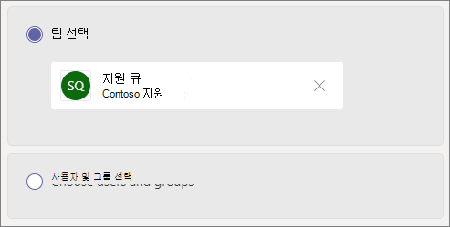

# 통화 대기열 만들기Create a call queue

통화 큐는 특정 문제 또는 질문에 대 한 도움을 얻을 수 있는 조직의 사용자에 게 발신자를 라우팅하는 방법을 제공 합니다.Call queues provide a method of routing callers to people in your organization who can help with with a particular issue or question. 통화는 큐에 있는 사람에 게 한 번에 하나씩 분배 됩니다 ( *상담원* 이라고 함).Calls are distributed one at a time to the people in the queue (who are known as *agents* ). 

통화 대기열은 다음을 제공 합니다.Call queues provide:

- 인사말 메시지입니다.A greeting message.

- 대기열에 대기 중인 동안에는 음악을 들을 수 있습니다.Music while people are waiting on hold in a queue.

- 전화 접속 *-선입 선출 (FIFO* ) 주문부터 상담원을 연결 합니다.Call routing - in *First In, First Out* (FIFO) order - to agents.

- 큐 오버플로 및 시간 초과에 대 한 처리 옵션입니다.Handling options for queue overflow and timeout.

이 문서의 절차를 따르기 전에 [팀 자동 전화 교환 및 통화 대기열에 대 한 요금제](plan-auto-attendant-call-queue.md) 를 확인 하 고 [시작 단계](plan-auto-attendant-call-queue.md#getting-started) 를 팔 로우 해야 합니다.Be sure you have read [Plan for Teams auto attendants and call queues](plan-auto-attendant-call-queue.md) and followed the [getting started steps](plan-auto-attendant-call-queue.md#getting-started) before you follow the procedures in this articles.

통화 대기열을 설정 하려면 팀 관리 센터에서 **음성을** 확장 하 고 **통화 대기열** 을 클릭 한 다음 **추가** 를 클릭 합니다.To set up a call queue, in the Teams admin center, expand **Voice** , click **Call queues** , and then click **Add** .

## 리소스 계정 및 언어Resource account and language

1. 통화 대기열의 이름을 입력 합니다.Type a name for the call queue. 상담원은 대기열에서 수신 전화를 받을 때이 이름을 볼 수 있습니다.Agents will see this name when they receive an incoming call from the queue.

2. **계정 추가** 를 클릭 하 고이 통화 큐와 함께 사용 하려는 리소스 계정을 검색 한 다음 **추가** 를 클릭 하 고 **추가** 를 클릭 합니다.Click **Add accounts** , search for the resource account that you want to use with this call queue, click **Add** , and then click **Add** .

3. 언어를 선택 합니다.Choose a language. 이 언어는 시스템에서 생성 하는 음성 메시지 및 음성 메일에 사용 됩니다 (사용 하도록 설정한 경우).This language will be used for system-generated voice prompts and voicemail transcription (if you enable them).

## 인사말 및 음악 보류Greetings and hold music

큐에 도착할 때 전화를 받을 때 인사말을 재생할지 여부를 지정 합니다.Specify if you want to play a greeting to callers when they arrive in the queue. 재생 하려는 인사말이 포함 된 MP3, WAV 또는 WMA 파일을 업로드 해야 합니다.You must upload an MP3, WAV, or WMA file containing the greeting that you want to play.

팀은 호출자에 게 기본 음악을 제공 하며, 큐에는 대기 상태가 유지 됩니다.Teams provides default music to callers while they are on hold in a queue. 특정 오디오 파일을 재생 하려면 **오디오 파일 재생** 을 선택 하 고 MP3, WAV 또는 WMA 파일을 업로드 합니다.If you want to play a specific audio file, choose **Play an audio file** and upload an MP3, WAV, or WMA file.

> [!NOTE]
> 업로드 된 기록은 5mb 보다 클 수 없습니다.The uploaded recording can be no larger than 5 MB.
> 팀 통화 대기열에 제공 되는 기본 음악은 귀하의 조직에의 한 모든 royalties 매입금입니다.The default music supplied in Teams call queues is free of any royalties payable by your organization. 

## 통화 에이전트Call agents

선택한 통화 에이전트는 다음 중 하나 여야 합니다.Call agents selected must be one of the following: 

- 전화 시스템 라이선스 및 Enterprise Voice가 설정 된 온라인 사용자Online users with a Phone System license and Enterprise Voice enabled
- 통화 요금제를 사용 하는 온라인 사용자Online users with a Calling Plan
- 온-프레미스 비즈니스용 Skype 서버 사용자On-premises Skype for Business Server users
- 상담원은 통화 대기열 통화를 위해 Microsoft 팀 앱을 사용 하 고 있는 경우에는 TeamsOnly 모드에 있어야 합니다.If your agents are using the Microsoft Teams app for call queue calls, they need to be in TeamsOnly mode.

최대 20 명의 에이전트를 개별적으로 추가 하거나 그룹을 통해 최대 200 에이전트를 추가할 수 있습니다.You can add up to 20 agents individually and up to 200 agents via groups.

큐에 사용자를 추가 하려면 사용자 **추가** , 사용자 검색을 차례로 클릭 하 고 **추가** 를 클릭 한 다음 **추가** 를 클릭 합니다.To add a user to the queue, click **Add users** , search for the user, click **Add** , and then click **Add** .

큐에 그룹을 추가 하려면 그룹 **추가** 를 클릭 하 고 그룹을 검색 한 다음 **추가** 를 클릭 하 고 **추가** 를 클릭 합니다.To add a group to the queue, click **Add groups** , search for the group, click **Add** , and then click **Add** . 배포 목록, 보안 그룹, Microsoft 365 그룹 또는 Microsoft 팀 팀을 사용할 수 있습니다.You can use distribution lists, security groups, and Microsoft 365 groups or Microsoft Teams teams.

> [!NOTE]
> 그룹에 추가 된 새 사용자는 첫 번째 통화가 도착 하는 데 8 시간까지 걸릴 수 있습니다.New users added to a group can take up to eight hours for their first call to arrive.

## 통화 라우팅Call routing

**회의 모드** 는 에이전트가 통화를 수락 한 후 호출자가 에이전트에 연결 하는 데 걸리는 시간을 크게 줄여줍니다.**Conference mode** significantly reduces the amount of time it takes for a caller to be connected to an agent, after the agent accepts the call. 회의 모드가 작동 하려면 통화 큐의 상담원은 다음 클라이언트 중 하나를 사용 해야 합니다.For conference mode to work, agents in the call queue must use one of the following clients:

  - 최신 버전의 Microsoft 팀 데스크톱 클라이언트, Android 앱 또는 iOS 앱The latest version of the Microsoft Teams desktop client, Android app, or iOS app
  - Microsoft 팀 전화 버전 1449/1.0.94.2020051601 이상Microsoft Teams phone version 1449/1.0.94.2020051601 or later
  
에이전트 팀 계정은 팀 전용 모드로 설정 해야 합니다.Agents' Teams accounts need to be set to Teams-only mode. 요구 사항에 맞지 않는 상담원은 통화 라우팅 목록에 포함 되어 있지 않습니다.Agents who don't meet the requirements aren't included in the call routing list. 에이전트가 호환 되는 클라이언트를 사용 하는 경우에는 통화 큐에 대해 회의 모드를 사용 하도록 설정 하는 것이 좋습니다.We recommend enabling conference mode for your call queues if your agents are all using compatible clients.

> [!NOTE]
> 다른 용무 중 통화 모드는 지원 되지 않습니다.Busy on Busy is not supported by conference mode. 현재 상태 기반 라우팅이 활성화 되어 있지 않은 경우 통화 대기열 호출이 계속 표시 될 수 있습니다.Agents on non-call queue calls may still be presented with a call queue call if presence-based routing is not enabled.

**라우팅 메서드** 는 에이전트가 대기열에서 전화를 받는 순서를 결정 합니다.**Routing method** determines the order in which agents receive calls from the queue. 다음 옵션 중에서 선택 합니다.Choose from these options:

- **수행자 라우팅은** 동시에 대기열의 모든 에이전트를 울릴 것입니다.**Attendant routing** rings all agents in the queue at the same time. 통화를 선택 하는 첫 번째 호출 에이전트에서 통화를 받습니다.The first call agent to pick up the call gets the call.

- **Serial 라우팅은** 모든 통화 에이전트를 **통화 에이전트** 목록에 지정 된 순서 대로 하나씩 연결 합니다.**Serial routing** rings all call agents one by one in the order specified in the **Call agents** list. 에이전트가 전화를 걸거나 받지 못하는 경우 통화는 다음 에이전트로 연결 되며, 모든 에이전트가 선택 되거나 시간 초과 될 때까지 시도 하 게 됩니다.If an agent dismisses or does not pick up a call, the call will ring the next agent and will try all agents until it is picked up or times out.

- **라운드 로빈** 에서는 각 호출 에이전트가 대기열에서 같은 수의 호출을 받을 수 있도록 들어오는 호출의 라우팅을 분산 시킵니다.**Round robin** balances the routing of incoming calls so that each call agent gets the same number of calls from the queue. 이는 모든 통화 에이전트 간에 동일한 기회를 보장 하기 위해 인바운드 영업 환경에서 바람직 할 수 있습니다.This may be desirable in an inbound sales environment to assure equal opportunity among all the call agents.

- **가장 긴 유휴** 시간은 오랫동안 유휴 상태에 있는 에이전트로 각 호출을 라우팅합니다.**Longest idle** routes each call to the agent who has been idle the longest time. 현재 상태를 사용할 수 있거나 해당 사용자의 현재 상태가 10 분 미만으로 떨어져 있는 경우 에이전트가 유휴 상태인 것으로 간주 됩니다.An agent is considered idle if their presence state is Available or if their presence state has been Away for less than 10 minutes. 현재 상태가 10 분 이상인 에이전트는 유휴 상태로 간주 되지 않으며 현재 상태를 사용할 수 있는 것으로 변경 될 때까지 통화를 받을 수 없게 됩니다.Agents whose presence state has been Away for more than 10 minutes are not considered idle and will not be eligible to receive calls until they change their presence to Available. 

**현재 상태 기반 라우팅은** 통화 에이전트의 가용성 상태를 사용 하 여 선택한 라우팅 메서드의 호출 라우팅 목록에 에이전트가 포함 되어야 하는지 여부를 결정 합니다.**Presence-based routing** uses the availability status of call agents to determine whether an agent should be included in the call routing list for the selected routing method. 가용성 상태가 **사용 가능** 으로 설정 된 통화 에이전트는 통화 라우팅 목록에 포함 되며 전화를 받을 수 있습니다.Call agents whose availability status is set to **Available** are included in the call routing list and can receive calls. 가용성 상태가 다른 상태로 설정 된 에이전트는 통화 라우팅 목록에서 제외 되며, 해당 사용 가능 상태가 다시 **사용 가능** 으로 변경 될 때까지 통화를 수신 하지 않습니다.Agents whose availability status is set to any other status are excluded from the call routing list and won't receive calls until their availability status changes back to **Available** . 

라우팅 메서드를 사용 하 여 현재 상태 기반 통화 라우팅을 사용 하도록 설정할 수 있습니다.You can enable presence-based call routing with any of the routing methods.

에이전트가 전화를 opts 경우 사용 가능한 상태에 관계 없이 통화 라우팅 목록에 포함 되지 않습니다.If an agent opts out of getting calls, they won't be included in the call routing list regardless of what their availability status is set to. 

> [!NOTE]
> 현재 상태 기반 라우팅이 사용 되는 경우 비즈니스용 Skype 클라이언트를 사용 하는 에이전트가 통화 라우팅 목록에 포함 되지 않습니다.Agents who use the Skype for Business client aren't included in the call routing list when presence-based routing is enabled. 비즈니스용 Skype를 사용 하는 에이전트가 있는 경우 현재 상태 기반 통화 회람을 사용 하지 마세요.If you have agents who use Skype for Business, don't enable presence-based call routing.

**에이전트 알림 시간** 대기열이 다음 에이전트로 호출을 리디렉션하는 동안 에이전트의 전화가 연결 되는 시간을 지정 합니다.**Agent alert time** specifies how long an agent's phone will ring before the queue redirects the call to the next agent.

대용량 큐의 경우 다음 설정을 권장 합니다.For high volume queues, we recommend the following settings:

- **자동** **전화 회의 모드****Conference mode** to **Auto**
- **전화 교환 라우팅** **메서드** 라우팅**Routing method** to **Attendant routing**
- **현재 상태 기반 라우팅** **On****Presence-based routing** to **On**
- **에이전트 알림 시간:** **20 초****Agent alert time:** to **20 seconds**

## 통화 오버플로 처리Call overflow handling

**큐의 최대 통화** 는 주어진 시간에 큐에서 대기할 수 있는 최대 호출 수를 지정 합니다.**Maximum calls in the queue** specifies the maximum number of calls that can wait in the queue at any given time. 기본값은 50 이지만, 0에서 200 까지의 범위에 있을 수 있습니다.The default is 50, but it can range from 0 to 200. 이 제한에 도달 하면 **최대 통화 수** 설정에 도달 하는 경우에 지정 된 대로 통화가 처리 됩니다.When this limit is reached, the call is handled as specified by the **When the maximum number of calls is reached** setting.

통화 연결을 끊거나 교환원을 제외한 모든 [통화 라우팅 대상](create-a-phone-system-auto-attendant.md#call-routing-options) 에 대 한 리디렉션을 선택할 수 있습니다.You can choose to disconnect the call or redirect it to any of the [call routing destinations](create-a-phone-system-auto-attendant.md#call-routing-options) except the operator. 예를 들어 호출자가 큐의 에이전트에 대 한 보이스 메일을 남길 수 있습니다.For example, you might have the caller leave a voicemail for the agents in the queue. (외부 번호로 전송 하는 경우 [이 세부 정보](https://docs.microsoft.com/microsoftteams/create-a-phone-system-auto-attendant#external-phone-number-transfers---technical-details) 를 참고 하세요.)(Note [these details](https://docs.microsoft.com/microsoftteams/create-a-phone-system-auto-attendant#external-phone-number-transfers---technical-details) if you're transferring to an external number.)

> [!NOTE]
> 최대 통화 수가 0으로 설정 되 면 인사말 메시지가 재생 되지 않습니다.If the maximum number of calls is set to 0 then the greeting message will not play.

## 통화 시간 제한 처리Call timeout handling

**통화 시간 제한: 최대 대기 시간은** 대기 또는 연결 해제 하기 전에 큐에서 통화 대기를 대기할 수 있는 최대 시간을 지정 합니다.**Call Timeout: maximum wait time** specifies the maximum time a call can be on hold in the queue before it is redirected or disconnected. 15 초에서 45 분 까지의 값을 지정할 수 있습니다.You can specify a value from 15 seconds to 45 minutes.

통화 연결을 끊거나 통화 라우팅 대상 중 하나로 리디렉션하도록 선택할 수 있습니다.You can choose to disconnect the call or redirect it to one of the call routing destinations. 예를 들어 호출자가 큐의 에이전트에 대 한 보이스 메일을 남길 수 있습니다.For example, you might have the caller leave a voicemail for the agents in the queue.

전화 걸기 제한 옵션을 선택한 후 **저장** 을 클릭 합니다.When you have selected your call timeout options, click **Save** .

## 발신 전화의 발신자 IDCaller ID for outbound calls

통화 대기열의 상담원은 고객 전화를 반환 하기 위해 전화를 걸 수 있으므로, 통화 대기열의 구성원에 대 한 발신자 ID를 적절 한 자동 전화 교환의 서비스 번호로 설정 하는 것이 좋습니다.Since agents in a call queue may dial out to return a customer call, consider setting the caller ID for members of a call queue to the service number of an appropriate auto attendant. 자세한 내용은 [Microsoft 팀의 발신자 ID 정책 관리](caller-id-policies.md) 를 참조 하세요.See [Manage caller ID policies in Microsoft Teams](caller-id-policies.md) for more information.

## 지원 되는 클라이언트Supported clients

- 통화 대기열의 통화 에이전트에 대해 다음 클라이언트가 지원 됩니다.The following clients are supported for call agents in a call queue:

  - 비즈니스용 Skype 데스크톱 클라이언트 2016 (32 비트 및 64 비트 버전)Skype for Business desktop client 2016 (32-bit and 64-bit versions)
  - Lync 데스크톱 클라이언트 2013 (32 비트 및 64 비트 버전)Lync desktop client 2013 (32-bit and 64-bit versions)
  - Microsoft 팀에서 지원 되는 모든 IP 전화 모델All IP phone models supported for Microsoft Teams. [비즈니스용 Skype Online 전화 받기를](/skypeforbusiness/what-is-phone-system-in-office-365/getting-phones-for-skype-for-business-online/getting-phones-for-skype-for-business-online)참조 하세요.See [Getting phones for Skype for Business Online](/skypeforbusiness/what-is-phone-system-in-office-365/getting-phones-for-skype-for-business-online/getting-phones-for-skype-for-business-online).
  - Mac 비즈니스용 Skype 클라이언트 (버전 16.8.196 이상)Mac Skype for Business Client (version 16.8.196 and later)
  - Android 비즈니스용 Skype 클라이언트 (버전 6.16.0.9 이상)Android Skype for Business Client (version 6.16.0.9 and later)
  - iPhone 비즈니스용 Skype 클라이언트 (버전 6.16.0 이상)iPhone Skype for Business Client (version 6.16.0 and later)
  - iPad 용 비즈니스용 Skype 클라이언트 (버전 6.16.0 이상)iPad Skype for Business Client (version 6.16.0 and later)
  - Microsoft 팀 Windows 클라이언트 (32 비트 및 64 비트 버전)Microsoft Teams Windows client (32-bit and 64-bit versions)
  - Microsoft 팀 Mac 클라이언트Microsoft Teams Mac client
  - Microsoft 팀 iPhone 앱Microsoft Teams iPhone app
  - Microsoft 팀 Android 앱Microsoft Teams Android app

    > [!NOTE]
    > 직접 라우팅 번호로 지정 된 통화 큐는 비즈니스용 Skype 클라이언트, Lync 클라이언트 또는 비즈니스용 Skype IP 전화를 에이전트로 지원 하지 않습니다.Call queues that are assigned a direct routing number don't support Skype for Business clients, Lync clients, or Skype for Business IP Phones as agents.

## 통화 대기열 cmdletCall queue cmdlets

또한 Windows PowerShell을 사용 하 여 통화 대기열을 만들고 설정할 수 있습니다.You can also use Windows PowerShell to create and set up call queues. 다음은 통화 대기열을 관리 하는 데 사용 하는 cmdlet입니다.Here are the cmdlets that you use to manage a call queue.

- [새로운 CsCallQueueNew-CsCallQueue](https://docs.microsoft.com/powershell/module/skype/new-CsCallQueue)

- [Set-CsCallQueueSet-CsCallQueue](https://docs.microsoft.com/powershell/module/skype/set-CsCallQueue)

- [Get-CsCallQueueGet-CsCallQueue](https://docs.microsoft.com/powershell/module/skype/get-CsCallQueue)

- [제거-CsCallQueueRemove-CsCallQueue](https://docs.microsoft.com/powershell/module/skype/remove-CsCallQueue)

## 관련 항목Related topics

[다음은 전화 시스템 기능입니다.Here's what you get with Phone System](here-s-what-you-get-with-phone-system.md)

[서비스 전화 번호 가져오기Getting service phone numbers](getting-service-phone-numbers.md)

[오디오 회의 및 통화 요금제 국가 및 지역 가용성Country and region availability for Audio Conferencing and Calling Plans](country-and-region-availability-for-audio-conferencing-and-calling-plans/country-and-region-availability-for-audio-conferencing-and-calling-plans.md)

[새로운 CsOnlineApplicationInstanceNew-CsOnlineApplicationInstance](https://docs.microsoft.com/powershell/module/skype/new-csonlineapplicationinstance)

[Windows PowerShell 및 Lync Online 소개An introduction to Windows PowerShell and Skype for Business Online](/SkypeForBusiness/set-up-your-computer-for-windows-powershell/set-up-your-computer-for-windows-powershell)
