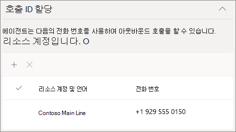
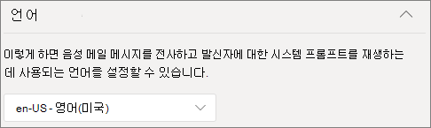
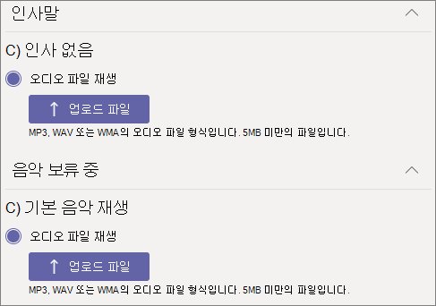

# 통화 큐 만들기Create a call queue

통화 큐는 특정 문제나 질문에 대한 도움을 줄 수 있는 조직의 사용자에게 통화를 걸 수 있는 방법을 제공합니다.Call queues provide a method of routing callers to people in your organization who can help with a particular issue or question. 호출은 큐의 사용자(*에이전트* 라고 함)에게 한 번에 하나씩 배포됩니다.Calls are distributed one at a time to the people in the queue (who are known as *agents*). 

> [!TIP]
> 이 문서는 대규모 조직을 위한 문서입니다.This article is for large organizations. 조직이 중소기업인 경우 대신 통화 큐 만들기 [- 중소기업 자습서를](/microsoftteams/business-voice/create-a-phone-system-call-queue-smb) 읽습니다.If your organization is a small business, read [Create a call queue - small business tutorial](/microsoftteams/business-voice/create-a-phone-system-call-queue-smb) instead.

통화 큐는 다음을 제공합니다.Call queues provide:

- 인사말 메시지A greeting message.

- 큐에서 대기 중인 음악Music while people are waiting on hold in a queue.

- 에이전트에 대한 *FIFO(선입선출)* 순서 통화 라우팅.Call routing - in *First In, First Out* (FIFO) order - to agents.

- 큐 오버플로 및 시간 제한에 대한 처리 옵션Handling options for queue overflow and timeout.

이 문서의 절차를 수행하기 [전에](plan-auto-attendant-call-queue.md) 자동 Teams 대기열에 대한  계획을 읽고 시작 단계를 따라야 합니다.Be sure you have read [Plan for Teams auto attendants and call queues](plan-auto-attendant-call-queue.md) and followed the [getting started steps](plan-auto-attendant-call-queue.md#getting-started) before you follow the procedures in this article.

## 비디오 데모Video demonstration

이 비디오에서는 호출 큐를 만드는 방법에 대한 기본 예제를 Teams.This video shows a basic example of how to create a call queue in Teams.

> [!VIDEO https://www.microsoft.com/videoplayer/embed/RWCF23?autoplay=false]

## 호출 큐 만들기Create the call queue

통화 큐를 설정하려면 Teams 관리 센터에서 **음성** 확장하고 **통화 큐** 클릭한 다음 **추가** 를 클릭합니다.To set up a call queue, in the Teams admin center, expand **Voice**, click **Call queues**, and then click **Add**.

통화 큐의 이름을 입력합니다.Type a name for the call queue.

## 리소스 계정Resource accounts

**계정 추가** 를 클릭하고 이 통화 큐에 사용할 리소스 계정을 검색하고 **추가** 를 클릭하고 **추가** 를 클릭합니다.Click **Add accounts**, search for the resource account that you want to use with this call queue, click **Add**, and then click **Add**. (에이전트가 들어오는 호출을 받을 때 리소스 계정 이름이 표시됩니다.)(Agents will see the resource account name when they receive an incoming call.)

### 호출 ID 할당Assign calling ID

통화 에이전트에 Teams 채널을 사용할 계획인 경우 전화 번호가 있는 하나 이상의 리소스 계정을 지정하여 에이전트에 대해 아웃바운드 호출자 ID 번호를 할당할 수 있습니다.If you plan to use a Teams channel for your call agents, you can assign an outbound caller ID number for the agents by specifying one or more resource accounts with a phone number.

아웃바운드 호출 시 에이전트가 ID를 호출할 수 있도록 허용할 리소스 계정을 검색하고 추가를 클릭한 다음 **추가를** **클릭합니다.** Click **Add**, search for the resource accounts that you want to allow agents to for calling ID purposes when making outbound calls, click **Add**, and then click **Add**.

에이전트 멤버 자격을 제어하기 위해 Teams 채널을 사용하지 않는 경우 호출 큐의 구성원에 대한 발신자 ID를 호출 큐의 서비스 번호 또는 적절한 자동 참석자 번호로 직접 설정하는 것이 고려됩니다.If you are not using a Teams channel to control agent membership, consider directly setting the caller ID for members of the call queue to the service number of the call queue or appropriate auto attendant. 자세한 내용은 [Microsoft Teams에서 발신자 ID 정책 관리](caller-id-policies.md)를 참조하세요.See [Manage caller ID policies in Microsoft Teams](caller-id-policies.md) for more information.

## 언어Language

지원되는 [언어를 선택 합니다.](create-a-phone-system-call-queue-languages.md)Choose a [supported language](create-a-phone-system-call-queue-languages.md). 이 언어는 시스템에서 생성된 음성 프롬프트 및 음성 메시지(사용하도록 설정한 경우)에 사용됩니다.This language will be used for system-generated voice prompts and voicemail transcription (if you enable them).

## 대기 중인 인사말 및 음악Greetings and music on hold in queue

발신자가 큐에 도착하면 발신자들에게 인사말을 재생할지 지정합니다.Specify if you want to play a greeting to callers when they arrive in the queue. 재생하려는 인사말이 포함된 MP3, WAV 또는 WMA 파일을 업로드해야 합니다.You must upload an MP3, WAV, or WMA file containing the greeting that you want to play. 업로드된 녹음/녹화의 크기는 5MB 이상일 수 없습니다.The uploaded recording can be no larger than 5 MB.

Teams에서 사용자가 큐에 있는 동안 발신자에게 기본 음악이 제공됩니다.Teams provides default music to callers while they are on hold in a queue. Teams 통화 큐에서 제공하는 기본 음악은 조직에서 지불해야 하는 로열티가 없습니다.The default music supplied in Teams call queues is free of any royalties payable by your organization. 특정 오디오 파일을 재생하려면 **오디오 파일 재생** 을 선택하고 MP3 WAV 또는 WMA 파일을 업로드합니다.If you want to play a specific audio file, choose **Play an audio file** and upload an MP3, WAV, or WMA file.

> [!NOTE]
> 귀하는 모든 음악의 지적 재산권 및 기타 권리를 포함할 수 있는 Microsoft Teams 모든 음악 또는 오디오 파일을 사용하기 위해 필요한 모든 권한 및 권한을 독립적으로 지우고 보호할 책임이 있습니다. 음향 효과, 오디오, 브랜드, 이름 및 기타 콘텐츠는 아티스트, 배우, 공연가, 음악가, 작곡가, 작곡가, 레코드 레이블, 음악 퍼블리셔, 노조, 길드, 권리 사회, 집단 관리 조직 및 음악 저작권, 음향 효과, 오디오 및 기타 지적 재산권을 소유, 제어 또는 라이선스를 보유한 다른 당사자를 포함할 수 있는 모든 관련 권리 소유자의 기타 콘텐츠입니다.You are responsible for independently clearing and securing all necessary rights and permissions to use any music or audio file with your Microsoft Teams service, which may include intellectual property and other rights in any music, sound effects, audio, brands, names, and other content in the audio file from all relevant rights holders, which may include artists, actors, performers, musicians, songwriters, composers, record labels, music publishers, unions, guilds, rights societies, collective management organizations and any other parties who own, control or license the music copyrights, sound effects, audio and other intellectual property rights.

## 통화 에이전트Call agents

호출 큐에 에이전트를 추가하는 데 대한 [전제적 을 검토합니다.](plan-auto-attendant-call-queue.md#prerequisites)Review the [prerequisites for adding agents to a call queue](plan-auto-attendant-call-queue.md#prerequisites).

##### Teams 채널Teams channel

채널을 통해 최대 200개 에이전트를 추가할 Teams 있습니다.You can add up to 200 agents via a Teams channel.

큐를 관리하기 위해 Teams 채널을 사용하려는 경우  [팀](https://support.microsoft.com/office/9f07dabe-91c6-4a9b-a545-8ffdddd2504e)선택 옵션을 선택하고 채널 **추가를 클릭합니다.**If you want to [use a Teams channel to manage the queue](https://support.microsoft.com/office/9f07dabe-91c6-4a9b-a545-8ffdddd2504e), select the **Choose a team** option and click **Add a channel**. 사용할 팀을 검색하고 선택한 다음 **추가를 클릭합니다.**Search for the team that you want to use, select it, and click **Add**. 사용할 채널을 선택하고 적용을 **클릭합니다.**Select the channel that you want to use and click **Apply**. 팀의 구성원 또는 채널의 작성자 또는 소유자가 되어야 합니다.You must be a member of the team or the creator of or an owner of the channel.

통화 큐에 대한 Teams 사용할 때 다음 클라이언트가 지원됩니다.The following clients are supported when using a Teams channel for call queues: 

  - Microsoft Teams Windows 클라이언트Microsoft Teams Windows client
  - Microsoft Teams Mac 클라이언트Microsoft Teams Mac client

> [!NOTE]
> 이 옵션을 사용하는 경우 통화 큐가 완전히 작동하는 데 최대 24시간이 걸릴 수 있습니다.If you use this option, it can take up to 24 hours for the call queue to be fully operational.

##### 사용자 및 그룹Users and groups

그룹을 통해 최대 20대의 에이전트를 개별적으로, 최대 200명까지 에이전트를 추가할 수 있습니다.You can add up to 20 agents individually and up to 200 agents via groups.

큐에 개별 사용자 또는 그룹을 추가하려면 사용자 및 그룹 선택 **옵션을** 선택합니다.If you want to add individual users or groups to the queue, select the **Choose users and groups** option. 

큐에 사용자를 추가하려면 **사용자 추가** 를 클릭하고 사용자를 검색한 다음 **추가** 를 클릭하고 **추가** 를 클릭합니다.To add a user to the queue, click **Add users**, search for the user, click **Add**, and then click **Add**.

큐에 그룹을 추가하려면 **그룹 추가** 를 클릭하고 그룹을 검색한 다음 **추가** 를 클릭하고 **추가** 를 클릭합니다.To add a group to the queue, click **Add groups**, search for the group, click **Add**, and then click **Add**. 메일 그룹, 보안 그룹, Microsoft 365 그룹 또는 Microsoft Teams 팀을 사용할 수 있습니다.You can use distribution lists, security groups, and Microsoft 365 groups or Microsoft Teams teams.

> [!NOTE]
> 그룹에 추가된 새 사용자는 첫 번째 통화가 도착하는 데 최대 8시간이 걸릴 수 있습니다.New users added to a group can take up to eight hours for their first call to arrive.

## 통화 라우팅Call routing

**회의 모드** 를 사용하면 에이전트가 호출을 수락한 후 호출자가 에이전트에 연결되는 데 걸리는 시간이 크게 줄어듭니다.**Conference mode** significantly reduces the amount of time it takes for a caller to be connected to an agent, after the agent accepts the call. 회의 모드가 작동하려면 통화 큐의 에이전트가 다음 클라이언트 중 하나를 사용해야 합니다.For conference mode to work, agents in the call queue must use one of the following clients:

  - 최신 버전의 Microsoft Teams 데스크톱 클라이언트, Android 앱 또는 iOS 앱The latest version of the Microsoft Teams desktop client, Android app, or iOS app
  - Microsoft Teams 통화 버전 1449/1.0.94.2020051601 이상Microsoft Teams phone version 1449/1.0.94.2020051601 or later
  
에이전트의 Teams 계정은 Teams 전용 모드로 설정해야 합니다.Agents' Teams accounts need to be set to Teams-only mode. 요구 사항을 충족하지 않는 에이전트는 통화 라우팅 목록에 포함되지 않습니다.Agents who don't meet the requirements aren't included in the call routing list. 에이전트가 모두 호환되는 클라이언트를 사용하고 있는 경우 통화 큐에 통화 회의 모드를 설정하는 것이 좋습니다.We recommend enabling conference mode for your call queues if your agents are all using compatible clients.

> [!NOTE]
> 전화 통화가 위치 기반 라우팅에 사용하도록 설정된 직접 라우팅 게이트웨이에서 큐로 라우팅되는 경우 회의 모드는 지원되지 않습니다.Conference mode is not supported if phone calls are routed to the queue from a Direct Routing gateway that is enabled for Location Based Routing.

> [!TIP]
> 회의 **모드를 자동으로** **설정하는** 것이 좋습니다.Setting **Conference mode** to **Auto** is the recommended setting.

**라우팅 방법** 은 에이전트가 큐에서 통화를 받는 순서를 결정합니다.**Routing method** determines the order in which agents receive calls from the queue. 다음 옵션 중에서 선택합니다.Choose from these options:

- **참석자 라우팅** 은 큐에 있는 모든 에이전트를 동시에 링합니다.**Attendant routing** rings all agents in the queue at the same time. 통화를 받은 첫 번째 통화 에이전트가 통화를 받습니다.The first call agent to pick up the call gets the call.

- **직렬 라우팅** 은 모든 **콜 에이전트** 를 콜 에이전트 목록에 지정된 순서대로 하나씩 울립니다.**Serial routing** rings all call agents one by one in the order specified in the **Call agents** list. 에이전트가 통화를 취소하거나 통화를 받지 않으면 다음 에이전트가 호출을 울리고 선택되거나 시간이 초과될 때까지 모든 에이전트를 시도합니다.If an agent dismisses or does not pick up a call, the call will ring the next agent and will try all agents until it is picked up or times out.

- **라운드 로빈** 은 각 호출 에이전트가 큐에서 동일한 수의 호출을 수신하도록 수신 호출 라우팅의 균형을 조정합니다.**Round robin** balances the routing of incoming calls so that each call agent gets the same number of calls from the queue. 이는 모든 상담원 간에 동등한 기회를 보장하기 위해 인바운드 영업 환경에서 바람직할 수 있습니다.This may be desirable in an inbound sales environment to assure equal opportunity among all the call agents.

- **가장 긴 유휴 상태** 는 각 통화를 가장 오랫동안 유휴 상태인 에이전트로 라우팅합니다.**Longest idle** routes each call to the agent who has been idle the longest time. 에이전트는 현재 상태 사용 가능 상태 또는 현재 상태가 10분 미만인 경우 유휴 상태로 간주됩니다.An agent is considered idle if their presence state is Available or if their presence state has been Away for less than 10 minutes. 부재중 상태가 10분 이상 부재중인 에이전트는 유휴 상태로 간주되지 않으며 부재중 상태를 사용 가능으로 변경할 때까지 호출을 받을 수 없습니다.Agents whose presence state has been Away for more than 10 minutes are not considered idle and will not be eligible to receive calls until they change their presence to Available. 

> [!TIP]
> 라우팅 **메서드를** **라운드 로빈** 또는 가장 긴 유휴으로 **설정하는** 것이 좋습니다.Setting **Routing Method** to **Round robin** or **Longest idle** is the recommended setting.

**현재 상태 기반 라우팅** 은 통화 에이전트의 가용성 상태를 사용하여 선택한 라우팅 방법에 대한 통화 라우팅 목록에 에이전트를 포함할지 여부를 결정합니다.**Presence-based routing** uses the availability status of call agents to determine whether an agent should be included in the call routing list for the selected routing method. 가용성 상태가 **사용 가능** 으로 설정된 통화 에이전트는 통화 라우팅 목록에 포함되며 호출을 수신할 수 있습니다.Call agents whose availability status is set to **Available** are included in the call routing list and can receive calls. 가용성 상태가 다른 상태로 설정된 에이전트는 통화 라우팅 목록에서 제외되며, 가용성 상태가 다시 **사용 가능** 으로 변경될 때까지 호출을 수신하지 않습니다.Agents whose availability status is set to any other status are excluded from the call routing list and won't receive calls until their availability status changes back to **Available**. 

라우팅 방법을 사용하여 현재 상태 기반 통화 라우팅을 사용하도록 설정할 수 있습니다.You can enable presence-based call routing with any of the routing methods.

에이전트가 통화를 옵트아웃하면 해당 에이전트가 수신 가능 여부가 설정된 상태와 관계없이 통화 라우팅 목록에 포함되지 않습니다.If an agent opts out of getting calls, they won't be included in the call routing list regardless of what their availability status is set to. 

> [!NOTE]
> 가장 **긴** 유휴이 라우팅 방법으로 선택되면 현재 상태 기반 라우팅이 필요하며 현재 상태 기반 라우팅 토글이  꺼지고 회색으로 표시되어도 자동으로 사용하도록 설정됩니다.When **Longest idle** is selected as the routing method, presence-based routing is required and automatically enabled even though the Presence-based routing toggle will be **Off** and grayed out.
>
> 현재 상태 기반 라우팅이 사용하도록 설정되어 있지 않은 경우 큐에 여러 통화가 있는 경우 시스템에서 현재 상태와 상관없이 이러한 통화를 에이전트에게 동시에 제공합니다.If presence-based routing is not enabled and there are multiple calls in the queue, the system will present these calls simultaneously to the agents regardless of their presence status. 이렇게 하면 에이전트에게 여러 통화 알림이 전송됩니다. 특히 일부 에이전트가 최초 통화에 응답하지 않는 경우가 있습니다.This will result in multiple call notifications to agents, particularly if some agents don’t answer the initial call presented to them.
> 
> 현재 상태 기반 라우팅이 사용하도록 설정된 경우 비즈니스용 Skype 클라이언트를 사용하는 에이전트가 통화 라우팅 목록에 포함되지 않습니다.Agents who use the Skype for Business client aren't included in the call routing list when presence-based routing is enabled. 비즈니스용 Skype를 사용하는 에이전트가 있는 경우 현재 상태 기반 통화 라우팅을 사용하지 않습니다.If you have agents who use Skype for Business, don't enable presence-based call routing.

> [!TIP]
> 현재 **상태 기반 라우팅을** **On으로** 설정하는 것이 좋습니다.Setting **Presence-based routing** to **On** is the recommended setting.

**에이전트 알림 시간** 은 큐가 다음 에이전트로 통화를 리디렉션하기 전에 에이전트의 통화가 울리는 시간을 지정합니다.**Agent alert time** specifies how long an agent's phone will ring before the queue redirects the call to the next agent.

> [!TIP]
> 에이전트 **경고 시간을** **20초로** 설정하는 것이 좋습니다.Setting **Agent alert time** to **20 seconds** is the recommended setting.

## 통화 오버플로 처리Call overflow handling

**큐 최대 호출 수** 는 지정된 시간에 큐에 대기할 수 있는 최대 통화 수를 지정합니다.**Maximum calls in the queue** specifies the maximum number of calls that can wait in the queue at any given time. 기본값은 50이지만 0에서 200까지의 범위일 수 있습니다.The default is 50, but it can range from 0 to 200. 이 제한에 도달하면 **최대 통화 수에 도달할 때** 설정에 지정된 대로 통화가 처리됩니다.When this limit is reached, the call is handled as specified by the **When the maximum number of calls is reached** setting.

통화 연결을 끊거나 통화 라우팅 대상로 리디렉션할 수 있습니다.You can choose to disconnect the call or redirect it to any of the call routing destinations. 예를 들어 발신자에 큐에 있는 에이전트에 대한 음성 메일이 남아 있을 수 있습니다.For example, you might have the caller leave a voicemail for the agents in the queue. 외부 전송의 경우 [필수 구성 요소](plan-auto-attendant-call-queue.md#prerequisites)와 번호 서식에 대한 [외부 전화 번호 전송 - 기술 세부 정보](create-a-phone-system-auto-attendant.md#external-phone-number-transfers---technical-details)를 참조하세요.For external transfers, please refer to [Prerequisites](plan-auto-attendant-call-queue.md#prerequisites) and the [external phone number transfers - technical details](create-a-phone-system-auto-attendant.md#external-phone-number-transfers---technical-details) for number formatting.

> [!NOTE]
> 최대 통화 수가 0으로 설정된 경우 인사말 메시지는 재생되지 않습니다.If the maximum number of calls is set to 0 then the greeting message will not play.

## 통화 시간 제한 처리Call timeout handling

**통화 시간 초과: 최대 대기 시간** 은 통화가 리디렉션되거나 연결이 끊어지기 전에 큐에 대기할 수 있는 최대 시간을 지정합니다.**Call Timeout: maximum wait time** specifies the maximum time a call can be on hold in the queue before it is redirected or disconnected. 0초에서 45분까지 지정할 수 있습니다.You can specify a value from 0 seconds to 45 minutes.

통화 연결을 끊거나 통화 라우팅 대상로 리디렉션할 수 있습니다.You can choose to disconnect the call or redirect it to one of the call routing destinations. 예를 들어 발신자에 큐에 있는 에이전트에 대한 음성 메일이 남아 있을 수 있습니다.For example, you might have the caller leave a voicemail for the agents in the queue. 외부 전송의 경우 [필수 구성 요소](plan-auto-attendant-call-queue.md#prerequisites)와 번호 서식에 대한 [외부 전화 번호 전송 - 기술 세부 정보](create-a-phone-system-auto-attendant.md#external-phone-number-transfers---technical-details)를 참조하세요.For external transfers, please refer to [Prerequisites](plan-auto-attendant-call-queue.md#prerequisites) and the [external phone number transfers - technical details](create-a-phone-system-auto-attendant.md#external-phone-number-transfers---technical-details) for number formatting.

통화 시간 제한 옵션을 선택한 경우 **저장** 을 클릭합니다.When you have selected your call timeout options, click **Save**.

## 권장 통화 큐 설정 요약Summary of recommended call queue settings

다음 설정은 권장되는 항목입니다.The following settings are recommended:

- **회의 모드** 는 **자동** 으로**Conference mode** to **Auto**
- **라우팅 방법** 은 **라운드 로빈** 또는 **최대 유휴 상태** 로**Routing method** to **Round robin** or **Longest idle**
- **현재 상태 기반 라우팅** 은 **켬** 으로**Presence-based routing** to **On**
- **에이전트 경고 시간** 은 **20초로****Agent alert time:** to **20 seconds**

## 지원되는 클라이언트Supported clients

다음 클라이언트는 통화 큐의 통화 에이전트에 대해 지원됩니다.The following clients are supported for call agents in a call queue:

  - 비즈니스용 Skype 데스크톱 클라이언트 2016(32비트 및 64비트 버전)Skype for Business desktop client 2016 (32-bit and 64-bit versions)
  - Lync 데스크톱 클라이언트 2013(32비트 및 64비트 버전)Lync desktop client 2013 (32-bit and 64-bit versions)
  - 모든 IP 통화 모델은 Microsoft Teams에서 지원됩니다.All IP phone models supported for Microsoft Teams. [비즈니스용 Skype Online 휴대폰 받기](/skypeforbusiness/what-is-phone-system-in-office-365/getting-phones-for-skype-for-business-online/getting-phones-for-skype-for-business-online)를 참조하세요.See [Getting phones for Skype for Business Online](/skypeforbusiness/what-is-phone-system-in-office-365/getting-phones-for-skype-for-business-online/getting-phones-for-skype-for-business-online).
  - Mac용 비즈니스용 Skype(버전 16.8.196 이상)Mac Skype for Business Client (version 16.8.196 and later)
  - Android 비즈니스용 Skype® 클라이언트(버전 6.16.0.9 이상)Android Skype for Business Client (version 6.16.0.9 and later)
  - iPhone용 비즈니스용 Skype® 클라이언트(버전 6.16.0 이상)iPhone Skype for Business Client (version 6.16.0 and later)
  - iPad용 비즈니스용 Skype® 클라이언트(버전 6.16.0 이상)iPad Skype for Business Client (version 6.16.0 and later)
  - Microsoft Teams Windows 클라이언트(32비트 및 64비트 버전)Microsoft Teams Windows client (32-bit and 64-bit versions)
  - Microsoft Teams Mac 클라이언트Microsoft Teams Mac client
  - Microsoft Teams [데스크톱](/microsoftteams/teams-for-vdi) 인프라에 대한 Windows(Virtual Desktop, Citrix 및 VMware)Microsoft Teams on [Virtualized Desktop Infrastructure](/microsoftteams/teams-for-vdi) (Windows Virtual Desktop, Citrix, and VMware)
  - Microsoft Teams iPhone 앱Microsoft Teams iPhone app
  - Microsoft Teams Android 앱Microsoft Teams Android app

    > [!NOTE]
    > 직접 라우팅 번호가 할당된 통화 큐는 비즈니스용 Skype 클라이언트, Lync 클라이언트 또는 비즈니스용 Skype IP 통화가 에이전트로 지원되지 않습니다.Call queues that are assigned a direct routing number don't support Skype for Business clients, Lync clients, or Skype for Business IP Phones as agents.

## 통화 큐 cmdletsCall queue cmdlets

Windows PowerShell을 사용하여 통화 큐를 만들고 설정할 수 있습니다.You can also use Windows PowerShell to create and set up call queues. 다음은 통화 큐를 관리하는 데 사용하는 cmdlet입니다.Here are the cmdlets that you use to manage a call queue.

- [New-CsCallQueueNew-CsCallQueue](/powershell/module/skype/new-CsCallQueue)

- [Set-CsCallQueueSet-CsCallQueue](/powershell/module/skype/set-CsCallQueue)

- [Get-CsCallQueueGet-CsCallQueue](/powershell/module/skype/get-CsCallQueue)

- [Remove-CsCallQueueRemove-CsCallQueue](/powershell/module/skype/remove-CsCallQueue)

## 관련 주제Related topics

[다음은 통화 시스템 기능입니다.Here's what you get with Phone System](here-s-what-you-get-with-phone-system.md)

[서비스 통화 번호 가져오기Getting service phone numbers](getting-service-phone-numbers.md)

[오디오 회의 및 통화 요금제 국가 및 지역 가용성Country and region availability for Audio Conferencing and Calling Plans](country-and-region-availability-for-audio-conferencing-and-calling-plans/country-and-region-availability-for-audio-conferencing-and-calling-plans.md)

[New-CsOnlineApplicationInstanceNew-CsOnlineApplicationInstance](/powershell/module/skype/new-csonlineapplicationinstance)

[Windows PowerShell 및 비즈니스용 Skype Online 소개An introduction to Windows PowerShell and Skype for Business Online](/SkypeForBusiness/set-up-your-computer-for-windows-powershell/set-up-your-computer-for-windows-powershell)
