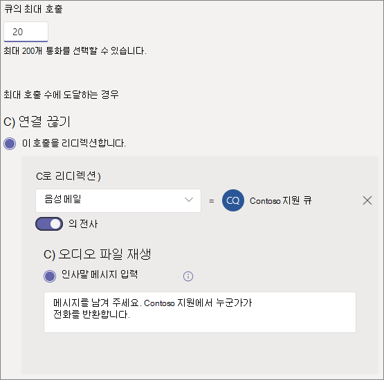

# 통화 큐 만들기Create a call queue

통화 큐는 특정 문제 또는 질문에 도움을 줄 수 있는 조직의 사용자에게 발신자 라우팅 방법을 제공합니다.Call queues provide a method of routing callers to people in your organization who can help with a particular issue or question. 호출은 큐에 있는 사람(에이전트라고도 하는)에게 한 번씩 *배포됩니다.*Calls are distributed one at a time to the people in the queue (who are known as *agents*). 

호출 큐는 다음을 제공합니다.Call queues provide:

- 인사말 메시지입니다.A greeting message.

- 음악 대기 중인 동안 대기합니다.Music while people are waiting on hold in a queue.

- 호출 라우팅(FIFO(First *In, First Out)* 순서로 에이전트에 라우팅합니다.Call routing - in *First In, First Out* (FIFO) order - to agents.

- 큐 오버플로 및 시간 제한에 대한 처리 옵션입니다.Handling options for queue overflow and timeout.

이 문서의 절차를 수행하기 전에 [Teams](plan-auto-attendant-call-queue.md) 자동 전화 회의  및 통화 큐에 대한 계획을 읽고 시작 단계를 수행해야 합니다.Be sure you have read [Plan for Teams auto attendants and call queues](plan-auto-attendant-call-queue.md) and followed the [getting started steps](plan-auto-attendant-call-queue.md#getting-started) before you follow the procedures in this articles.

통화 큐를 설정하려면 Teams 관리 센터에서 음성을 확장하고 **통화** 큐를 클릭한 다음 추가를 **클릭합니다.**To set up a call queue, in the Teams admin center, expand **Voice**, click **Call queues**, and then click **Add**.

## 리소스 계정 및 언어Resource account and language

1. 호출 큐의 이름을 입력합니다.Type a name for the call queue. 에이전트는 큐에서 들어오는 호출을 받으면 이 이름을 볼 수 있습니다.Agents will see this name when they receive an incoming call from the queue.

2. 계정 **추가를** 클릭하고 이 호출 큐에 사용할 리소스 계정을 검색한 다음 추가를 클릭한 다음 추가를 **클릭합니다.**Click **Add accounts**, search for the resource account that you want to use with this call queue, click **Add**, and then click **Add**.

3. 언어를 선택 합니다.Choose a language. 이 언어는 시스템 생성 음성 프롬프트 및 음성메일 전사(사용하도록 설정한 경우)에 사용됩니다.This language will be used for system-generated voice prompts and voicemail transcription (if you enable them).

## 대기 중인 큐에서 인사말 및 음악Greetings and music on hold in queue

발신자들에게 큐에 도착할 때 인사말을 재생할지 지정합니다.Specify if you want to play a greeting to callers when they arrive in the queue. 재생하려는 인사말이 포함된 MP3, WAV 또는 WMA 파일을 업로드해야 합니다.You must upload an MP3, WAV, or WMA file containing the greeting that you want to play.

Teams는 발신자에 큐에 대기 중인 동안 발신자에 기본 음악을 제공 합니다.Teams provides default music to callers while they are on hold in a queue. 특정 오디오 파일을 재생하려면 오디오 파일 재생을 **선택하고** MP3, WAV 또는 WMA 파일을 업로드합니다.If you want to play a specific audio file, choose **Play an audio file** and upload an MP3, WAV, or WMA file.

> [!NOTE]
> 업로드된 기록은 5MB를 넘지 않습니다.The uploaded recording can be no larger than 5 MB.
> Teams 통화 큐에 제공되는 기본 음악은 조직에서 지불하는 로열티가 없습니다.The default music supplied in Teams call queues is free of any royalties payable by your organization. 

## 에이전트 호출Call agents

호출 [큐에](plan-auto-attendant-call-queue.md#prerequisites) 에이전트를 추가할 수 있는 경우 전제적 준비를 참조합니다.Please refer to the [Prerequisites](plan-auto-attendant-call-queue.md#prerequisites) in order to be able to add agents to a call queue.

그룹을 통해 최대 20개 에이전트를 개별적으로 최대 200개까지 추가할 수 있습니다.You can add up to 20 agents individually and up to 200 agents via groups.

사용자를 큐에 추가하려면 **사용자** 추가를 클릭하고 사용자를 검색하고 추가를 클릭한 다음 추가를 **클릭합니다.**To add a user to the queue, click **Add users**, search for the user, click **Add**, and then click **Add**.

큐에 그룹을 추가하려면 그룹 추가를 클릭하고 **그룹을** 검색한 다음 추가를 클릭한 다음 추가를 **클릭합니다.**To add a group to the queue, click **Add groups**, search for the group, click **Add**, and then click **Add**. 메일 그룹, 보안 그룹 및 Microsoft 365 그룹 또는 Microsoft Teams 팀을 사용할 수 있습니다.You can use distribution lists, security groups, and Microsoft 365 groups or Microsoft Teams teams.

> [!NOTE]
> 그룹에 추가된 새 사용자는 첫 번째 호출이 도착하는 데 최대 8시간이 걸릴 수 있습니다.New users added to a group can take up to eight hours for their first call to arrive.

## 통화 라우팅Call routing

**전화 회의 모드는** 에이전트가 통화를 수락한 후 발신자에 연결되는 데 걸리는 시간을 크게 줄입니다.**Conference mode** significantly reduces the amount of time it takes for a caller to be connected to an agent, after the agent accepts the call. 전화 회의 모드가 작동하려면 통화 큐의 에이전트가 다음 클라이언트 중 하나를 사용해야 합니다.For conference mode to work, agents in the call queue must use one of the following clients:

  - 최신 버전의 Microsoft Teams 데스크톱 클라이언트, Android 앱 또는 iOS 앱The latest version of the Microsoft Teams desktop client, Android app, or iOS app
  - Microsoft Teams 휴대폰 버전 1449/1.0.94.2020051601 이상Microsoft Teams phone version 1449/1.0.94.2020051601 or later
  
에이전트의 Teams 계정을 Teams 전용 모드로 설정해야 합니다.Agents' Teams accounts need to be set to Teams-only mode. 요구 사항을 충족하지 않는 에이전트는 통화 라우팅 목록에 포함되지 않습니다.Agents who don't meet the requirements aren't included in the call routing list. 에이전트가 호환되는 클라이언트를 모두 사용하는 경우 통화 큐에 전화 회의 모드를 사용하는 것이 좋습니다.We recommend enabling conference mode for your call queues if your agents are all using compatible clients.

> [!NOTE]
> 사용 중이면 회의 모드에서는 지원되지 않습니다.Busy on Busy is not supported by conference mode. 현재 상태 기반 라우팅을 사용하도록 설정하지 않은 경우 비 호출 큐 호출의 에이전트는 호출 큐 호출과 함께 계속 표시됩니다.Agents on non-call queue calls may still be presented with a call queue call if presence-based routing is not enabled.

**라우팅 메서드는** 에이전트가 큐에서 호출을 수신하는 순서를 결정합니다.**Routing method** determines the order in which agents receive calls from the queue. 다음 옵션에서 선택합니다.Choose from these options:

- **참석자 라우팅은** 큐에 있는 모든 에이전트를 동시에 링합니다.**Attendant routing** rings all agents in the queue at the same time. 호출을 픽업하는 첫 번째 호출 에이전트가 호출을 얻습니다.The first call agent to pick up the call gets the call.

- **직렬 라우팅은** 호출 에이전트 목록에 지정된 순서대로 모든 호출 에이전트를 하나씩 **링합니다.****Serial routing** rings all call agents one by one in the order specified in the **Call agents** list. 에이전트가 통화를 기각하거나 선택하지 않는 경우 호출은 다음 에이전트에 벨을 울리며, 에이전트가 선택되거나 시간 외 시간 외로 호출될 때까지 모든 에이전트를 시도합니다.If an agent dismisses or does not pick up a call, the call will ring the next agent and will try all agents until it is picked up or times out.

- **라운드 로빈은** 들어오는 호출의 라우팅을 균형 조정하여 각 호출 에이전트가 큐에서 동일한 호출 수를 얻습니다.**Round robin** balances the routing of incoming calls so that each call agent gets the same number of calls from the queue. 인바운드 판매 환경에서는 모든 호출 에이전트가 동일한 기회를 보장하는 것이 바람직할 수 있습니다.This may be desirable in an inbound sales environment to assure equal opportunity among all the call agents.

- **가장 긴 유휴** 시간은 각 호출을 유휴 시간이 가장 긴 에이전트로 라우팅합니다.**Longest idle** routes each call to the agent who has been idle the longest time. 에이전트는 현재 상태를 사용할 수 있는 경우 또는 현재 상태가 10분 미만 동안 비어 있는 경우 유휴 상태로 간주됩니다.An agent is considered idle if their presence state is Available or if their presence state has been Away for less than 10 minutes. 현재 상태가 10분 넘게 부재 중 상태인 에이전트는 유휴 상태로 간주되지 않습니다. 현재 상태를 사용 가능으로 변경할 때까지 통화를 받을 자격이 없습니다.Agents whose presence state has been Away for more than 10 minutes are not considered idle and will not be eligible to receive calls until they change their presence to Available. 

**현재 상태 기반 라우팅은** 호출 에이전트의 가용성 상태를 사용하여 선택한 라우팅 방법에 대한 호출 라우팅 목록에 에이전트를 포함해야 하는지 여부를 판단합니다.**Presence-based routing** uses the availability status of call agents to determine whether an agent should be included in the call routing list for the selected routing method. 가용성 상태가 사용 가능으로  설정된 호출 에이전트는 통화 라우팅 목록에 포함되어 있으며 통화를 받을 수 있습니다.Call agents whose availability status is set to **Available** are included in the call routing list and can receive calls. 가용성 상태가 다른 상태로 설정된 에이전트는 통화 라우팅 목록에서 제외되어 가용성 상태가 사용 가능으로 다시 변경될 때까지 통화를 받지 **못합니다.**Agents whose availability status is set to any other status are excluded from the call routing list and won't receive calls until their availability status changes back to **Available**. 

라우팅 방법 중 원하는 방법으로 현재 상태 기반 호출 라우팅을 사용하도록 설정할 수 있습니다.You can enable presence-based call routing with any of the routing methods.

에이전트가 통화 수신을 옵트아웃하면 해당 가용성 상태가 설정되어 있는지와 관계없이 통화 라우팅 목록에 포함되지 않습니다.If an agent opts out of getting calls, they won't be included in the call routing list regardless of what their availability status is set to. 

> [!NOTE]
> 비즈니스용 Skype 클라이언트를 사용하는 에이전트는 현재 상태 기반 라우팅을 사용하도록 설정한 경우 통화 라우팅 목록에 포함되지 않습니다.Agents who use the Skype for Business client aren't included in the call routing list when presence-based routing is enabled. 비즈니스용 Skype를 사용하는 에이전트가 있는 경우 현재 상태 기반 통화 라우팅을 사용하지 않습니다.If you have agents who use Skype for Business, don't enable presence-based call routing.

**에이전트 경고 시간은** 큐가 다음 에이전트로 호출을 리디렉션하기 전에 에이전트의 전화가 울리는 기간을 지정합니다.**Agent alert time** specifies how long an agent's phone will ring before the queue redirects the call to the next agent.

볼륨이 큰 큐의 경우 다음 설정이 권장됩니다.For high volume queues, we recommend the following settings:

- **회의 모드에서** **자동으로****Conference mode** to **Auto**
- **Attendant 라우팅에** 라우팅 **방법****Routing method** to **Attendant routing**
- **에 대한** 현재 상태 기반 **라우팅****Presence-based routing** to **On**
- **에이전트 경고 시간:** **20초****Agent alert time:** to **20 seconds**

## 호출 오버플로 처리Call overflow handling

**큐의 최대 호출은** 주어진 시간 동안 큐에서 대기할 수 있는 최대 호출 수를 지정합니다.**Maximum calls in the queue** specifies the maximum number of calls that can wait in the queue at any given time. 기본값은 50이지만 0~200 범위일 수 있습니다.The default is 50, but it can range from 0 to 200. 이 제한에 도달하면 최대 호출 수에 도달한 경우 설정에 따라 호출이 **처리됩니다.**When this limit is reached, the call is handled as specified by the **When the maximum number of calls is reached** setting.

통화 연결을 끊거나 통화 라우팅 대상 중 하나에 리디렉션할 수 있습니다.You can choose to disconnect the call or redirect it to any of the call routing destinations. 예를 들어 발신자에 큐에 있는 에이전트에 대한 음성 메일이 남아 있을 수 있습니다.For example, you might have the caller leave a voicemail for the agents in the queue. 외부 전송의 경우 번호  서식에 대한 기술  세부 정보인 전제 사항 및 외부 전화 번호 전송을 참조합니다.For external transfers, please refer to [Prerequisites](plan-auto-attendant-call-queue.md#prerequisites) and the [external phone number transfers - technical details](create-a-phone-system-auto-attendant.md#external-phone-number-transfers---technical-details) for number formatting.

> [!NOTE]
> 최대 호출 수를 0으로 설정하면 인사말 메시지가 재생되지 않습니다.If the maximum number of calls is set to 0 then the greeting message will not play.

## 호출 시간 제한 처리Call timeout handling

**호출 시간 제한: 최대** 대기 시간은 리디렉션되거나 연결이 끊기기 전에 큐에 통화가 대기할 수 있는 최대 시간을 지정합니다.**Call Timeout: maximum wait time** specifies the maximum time a call can be on hold in the queue before it is redirected or disconnected. 0초에서 45분까지 값을 지정할 수 있습니다.You can specify a value from 0 seconds to 45 minutes.

통화 연결을 끊거나 통화 라우팅 대상 중 하나에 리디렉션할 수 있습니다.You can choose to disconnect the call or redirect it to one of the call routing destinations. 예를 들어 발신자에 큐에 있는 에이전트에 대한 음성 메일이 남아 있을 수 있습니다.For example, you might have the caller leave a voicemail for the agents in the queue. 외부 전송의 경우 번호  서식에 대한 기술  세부 정보인 전제 사항 및 외부 전화 번호 전송을 참조합니다.For external transfers, please refer to [Prerequisites](plan-auto-attendant-call-queue.md#prerequisites) and the [external phone number transfers - technical details](create-a-phone-system-auto-attendant.md#external-phone-number-transfers---technical-details) for number formatting.

통화 시간 제한 옵션을 선택한 경우 저장을 **클릭합니다.**When you have selected your call timeout options, click **Save**.

## 아웃바운드 호출에 대한 호출자 IDCaller ID for outbound calls

호출 큐의 에이전트가 고객 호출을 반환하기 위해 전화를 걸 수 있는 경우 통화 큐의 구성원에 대한 발신자 ID를 적절한 자동 전화 연결의 서비스 번호로 설정하는 것이 고려됩니다.Since agents in a call queue may dial out to return a customer call, consider setting the caller ID for members of a call queue to the service number of an appropriate auto attendant. 자세한 [내용은 Microsoft Teams에서 발신자 ID](caller-id-policies.md) 정책 관리를 참조하세요.See [Manage caller ID policies in Microsoft Teams](caller-id-policies.md) for more information.

## 지원되는 클라이언트Supported clients

다음 클라이언트는 호출 큐의 호출 에이전트에 대해 지원됩니다.The following clients are supported for call agents in a call queue:

  - 비즈니스용 Skype 데스크톱 클라이언트 2016(32비트 및 64비트 버전)Skype for Business desktop client 2016 (32-bit and 64-bit versions)
  - Lync 데스크톱 클라이언트 2013(32비트 및 64비트 버전)Lync desktop client 2013 (32-bit and 64-bit versions)
  - Microsoft Teams에서 지원되는 모든 IP 전화 모델입니다.All IP phone models supported for Microsoft Teams. 비즈니스용 [Skype Online용 전화기 보기를 참조하세요.](/skypeforbusiness/what-is-phone-system-in-office-365/getting-phones-for-skype-for-business-online/getting-phones-for-skype-for-business-online)See [Getting phones for Skype for Business Online](/skypeforbusiness/what-is-phone-system-in-office-365/getting-phones-for-skype-for-business-online/getting-phones-for-skype-for-business-online).
  - Mac 비즈니스용 Skype 클라이언트(버전 16.8.196 이상)Mac Skype for Business Client (version 16.8.196 and later)
  - Android 비즈니스용 Skype 클라이언트(버전 6.16.0.9 이상)Android Skype for Business Client (version 6.16.0.9 and later)
  - iPhone 비즈니스용 Skype 클라이언트(버전 6.16.0 이상)iPhone Skype for Business Client (version 6.16.0 and later)
  - iPad 비즈니스용 Skype 클라이언트(버전 6.16.0 이상)iPad Skype for Business Client (version 6.16.0 and later)
  - Microsoft Teams Windows 클라이언트(32비트 및 64비트 버전)Microsoft Teams Windows client (32-bit and 64-bit versions)
  - Microsoft Teams Mac 클라이언트Microsoft Teams Mac client
  - Microsoft Teams iPhone 앱Microsoft Teams iPhone app
  - Microsoft Teams Android 앱Microsoft Teams Android app

    > [!NOTE]
    > 직접 라우팅 번호가 할당된 통화 큐는 비즈니스용 Skype 클라이언트, Lync 클라이언트 또는 비즈니스용 Skype IP 전화기에서 에이전트로 지원되지 않습니다.Call queues that are assigned a direct routing number don't support Skype for Business clients, Lync clients, or Skype for Business IP Phones as agents.

## 큐 cmdlet 호출Call queue cmdlets

또한 이 기능을 사용하여 Windows PowerShell 큐를 만들고 설정할 수 있습니다.You can also use Windows PowerShell to create and set up call queues. 다음은 호출 큐를 관리하는 데 사용하는 cmdlet입니다.Here are the cmdlets that you use to manage a call queue.

- [New-CsCallQueueNew-CsCallQueue](https://docs.microsoft.com/powershell/module/skype/new-CsCallQueue)

- [Set-CsCallQueueSet-CsCallQueue](https://docs.microsoft.com/powershell/module/skype/set-CsCallQueue)

- [Get-CsCallQueueGet-CsCallQueue](https://docs.microsoft.com/powershell/module/skype/get-CsCallQueue)

- [Remove-CsCallQueueRemove-CsCallQueue](https://docs.microsoft.com/powershell/module/skype/remove-CsCallQueue)

## 관련 항목Related topics

[다음은 전화 시스템 기능입니다.Here's what you get with Phone System](here-s-what-you-get-with-phone-system.md)

[서비스 전화 번호 가져오기Getting service phone numbers](getting-service-phone-numbers.md)

[오디오 회의 및 통화 요금제 국가 및 지역 가용성Country and region availability for Audio Conferencing and Calling Plans](country-and-region-availability-for-audio-conferencing-and-calling-plans/country-and-region-availability-for-audio-conferencing-and-calling-plans.md)

[New-CsOnlineApplicationInstanceNew-CsOnlineApplicationInstance](https://docs.microsoft.com/powershell/module/skype/new-csonlineapplicationinstance)

[Windows PowerShell 및 Lync Online 소개An introduction to Windows PowerShell and Skype for Business Online](/SkypeForBusiness/set-up-your-computer-for-windows-powershell/set-up-your-computer-for-windows-powershell)
