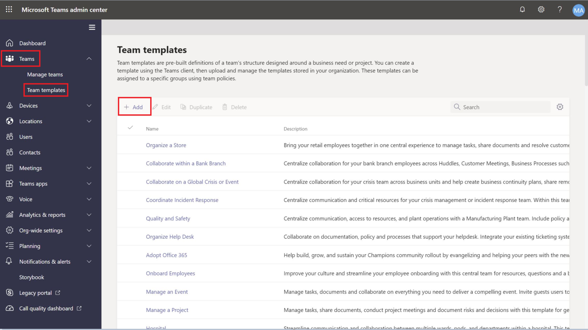

# Microsoft Teams에서 사용자 지정 팀 서식 파일 만들기

**사용자 지정 템플릿은 EDU 고객에게 아직 지원되지 않습니다.**

사용자 지정 팀 템플릿은 채널, 탭 및 앱 집합이 있는 미리 정의된 팀 구조입니다. 올바른 공동 작업 공간을 빠르게 만드는 데 도움이 되는 템플릿을 개발할 수 있습니다. 사용자 지정 팀 템플릿은 기본 설정을 사용합니다.  

시작:

1. Teams 관리 센터에 로그인합니다.

2. 왼쪽 탐색에서 **Teams 팀 서식** 파일을  >  **확장합니다.**

3. **추가** 를 클릭합니다.

4. 팀 서식 **파일 섹션에서** 새 서식 **파일 만들기를 선택합니다.**

5. 템플릿 설정 **섹션에서** 다음 필드를 완료하고 다음을 **클릭합니다.**
    - 템플릿 이름
    - 서식 파일 간략한 설명
    - 지역 표시 유형  

6. 채널, **탭 및 앱 섹션에서** 팀에 필요한 채널 및 앱을 추가합니다.

    1. 채널 **섹션에서** 추가를 **클릭합니다.**
    2. 추가 **대화 상자에서** 채널의 이름을 지정합니다.
    3. 설명을 추가합니다.
    4. 기본적으로 채널을 표시해야 하는지 여부를 결정 합니다.
    5. 채널에 추가할 앱 이름을 검색합니다.
    6. 완료되면 **적용을** 클릭합니다.

8. 완료되면 **제출을** 클릭합니다.

새 서식 파일은 팀 서식 파일 **목록에** 표시됩니다. 서식 파일을 사용하여 Teams에서 팀을 만들 수 있습니다.

> [!Note]
> 팀 사용자가 갤러리에서 사용자 지정 서식 파일을 보는 데 최대 24시간이 걸릴 수 있습니다.

## 알려진 문제 

**문제:** 추가 사용자 지정 탭이 포함된 사용자 지정 서식 파일에서 팀을 만든 경우 사용자 지정 탭 앱 대신 빈 탭이 표시될 수 있습니다. 기본 탭(예:  **게시물,** 파일 및 **Wiki)이** 예상대로 표시됩니다.

**해결** 방법: 이 문제를 해결하려면 사용자 지정 탭을 제거하고 동일한 앱으로 새 탭을 추가합니다. 현재 2021-02-08을 기점으로 향후 모든 사용자 지정 템플릿에 대한 수정 작업을 진행하고 있습니다.

## 관련 항목

- [관리 센터에서 팀 서식 파일 시작](get-started-with-teams-templates-in-the-admin-console.md)
- [기존 팀에서 서식 파일 만들기](create-template-from-existing-team.md)
- [기존 팀 서식 파일에서 팀 서식 파일 만들기](create-template-from-existing-template.md)
