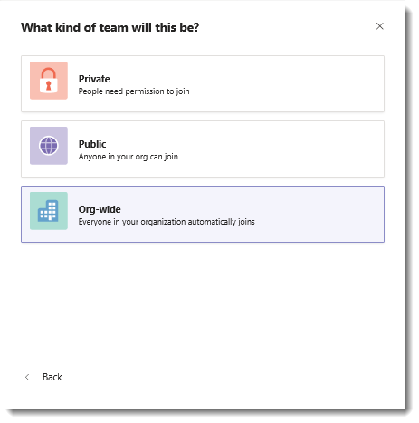

# Microsoft 팀에서 조직 전체 팀 만들기Create an org-wide team in Microsoft Teams

조직 전체 팀은 소규모에서 중간 규모 조직의 모든 사용자가 공동 작업을 위해 단일 팀의 일부로 자동으로 제공 됩니다.Org-wide teams provide an automatic way for everyone in a small to medium-sized organization to be a part of a single team for collaboration.

전역 관리자는 조직 전체의 모든 사용자를 가져오는 공용 팀을 쉽게 만들 수 있으며 사용자가 조직에 참가 하 고 나갈 때 Active Directory를 사용 하 여 구성원을 최신 상태로 유지 합니다.With org-wide teams, global admins can easily create a public team that pulls in every user in the organization and keeps the membership up to date with Active Directory as users join and leave the organization. 전역 관리자만 조직 전체 팀을 만들 수 있으며 현재 조직 차원의 팀은 5000 사용자가 아닌 조직으로 제한 됩니다.Only global admins can create org-wide teams and currently an org-wide team is limited to organizations with no more than 5,000 users. 테 넌 트 당 조직 차원의 팀 5 개에 대 한 제한도 있습니다.There's also a limit of five org-wide teams per tenant. 이러한 요구 사항을 충족 하는 경우 전역 관리자는 팀을 만들 때 **팀을 처음부터 새로** 만들기를 선택 하는 옵션으로 **Org wide** 를 표시 합니다.If these requirements are met, global admins will see **Org-wide** as an option when they select **Build a team from scratch** when creating a team. 

조직 차원의 팀이 만들어지면 모든 전역 관리자가 팀 소유자로 추가 되 고 모든 활성 사용자가 팀 구성원으로 추가 됩니다.When an org-wide team is created, all global admins are added as team owners and all active users are added as team members. 라이선스가 없는 사용자도 팀에 추가 됩니다.Unlicensed users are also added to the team. 라이선스가 없는 사용자가 처음으로 팀에 로그인 할 때 사용자에 게 Microsoft 팀 상업용 클라우드 평가판 라이선스가 할당 됩니다.The first time an unlicensed user signs in to Teams, the user is assigned a Microsoft Teams Commercial Cloud Trial license. 평가판 라이선스에 대 한 자세한 내용은 [팀 상업용 클라우드 평가판 제공 관리](iw-trial-teams.md)를 참조 하세요.To learn more about the trial license, check out [Manage the Teams Commercial Cloud Trial offer](iw-trial-teams.md). 

이러한 유형의 계정은 조직 전체 팀에 추가 되지 않습니다.These types of accounts won't be added to your org-wide team:

- 로그인이 차단 된 계정Accounts that are blocked from sign in
- 게스트 사용자Guest users
- 서비스 계정Service accounts
- 회의실 또는 장비 계정Room or equipment accounts
- 공유 사서함으로 지원 되는 계정Accounts backed by a shared mailbox

조직의 디렉터리가 새 활성 사용자를 포함 하도록 업데이트 되거나 사용자가 회사에서 더 이상 작동 하지 않고 해당 계정이 사용 되지 않도록 설정 되어 있으면 변경 내용이 자동으로 동기화 되 고 팀에서 사용자가 추가 되거나 제거 됩니다.As your organization's directory is updated to include new active users or if users no longer work at your company and their account is disabled, changes are automatically synced and the users are added or removed from the team. 팀 구성원은 조직 차원의 팀을 나갈 수 없습니다.Team members can't leave an org-wide team. 팀 소유자는 필요한 경우 수동으로 사용자를 추가 하거나 제거할 수 있습니다.As a team owner, you can manually add or remove users if needed.

> [!NOTE]
> - 팀을 만들 때 **조직 전체** 옵션이 표시 되지 않는 경우 전역 관리자 인 경우에는 해당 기능이 계속 배포 될 수 있으며, 다섯 개의 조직 전체 팀 제한에 도달 했거나 조직이 5000 구성원의 현재 크기 제한을 초과 했을 수 있습니다.If you don't see the **Org-wide** option when creating a team and you're a global admin, the feature might still be rolling out, you have reached the five org-wide teams limit, or your organization might have more than the current size limit of 5,000 members. 이번에는 향후에이 한도를 증가 하 고 있습니다.We're looking to increase this limit in the future.
> - 회의실 목록, 장비, 리소스 계정에 속하지 않는 채팅방은 조직 전체 팀에 추가 되거나 동기화 될 수 있습니다.Rooms that aren't a part of a room list, equipment, and resource accounts might be added or synced to the org-wide team. 팀 소유자는 팀에서 이러한 계정을 쉽게 제거할 수 있습니다.Team owners can easily remove these accounts from the team.
> - 구성원을 추가 하거나 제거 하는 시스템의 모든 작업이 일반 채널에 게시 됩니다.All actions by the system to add or remove members are posted in the General channel. 또한 채널은 팀 클라이언트에 새 활동을 갖는 것으로 표시 됩니다.The channel will also be marked as having new activity in the Teams client.

## 모범 사례Best practices

조직 전체 팀을 최대한 활용 하려면 팀 소유자가 다음을 수행 하는 것이 좋습니다.To get the most out of your org-wide team, we recommend team owners do the following.

### 팀 소유자만 일반 채널에 게시할 수 있도록 허용Allow only team owners to post to the General channel

팀 소유자만 일반 채널에 게시 하 여 채널 소음을 줄일 수 있습니다.Reduce channel noise by having only team owners post to the General channel. 팀으로 이동 하 고 **̇ ̇ ̇ 추가 옵션** > 을 클릭 하 여**팀 관리**를 선택 합니다.Go to the team and click **˙˙˙ More options** > **Manage Team**. **설정** 탭에서 **구성원 권한을** 클릭 > **소유자만 메시지를 게시할 수 있음**을 선택 합니다.On the **Settings** tab, click **Member permissions** > select **Only owners can post messages**.

### @Team 및 @ [팀 이름] 멘 션 끄기Turn off @team and @[team name] mentions

 전체 조직에 과부하가 되는 것을 방지 하기 위해 @mentions를 줄입니다.Reduce @mentions to keep them from overloading the entire organization. 팀으로 이동 하 고 **̇ ̇ ̇ 추가 옵션** > 을 클릭 하 여**팀 관리**를 선택 합니다.Go to the team and click **˙˙˙ More options** > **Manage Team**. **설정** 탭에서 <strong>@mentions</strong> > 클릭 **하 여 구성원 표시 옵션을 @team 또는 @ [팀 이름]으로**설정 해제 합니다.On the **Settings** tab, click <strong>@mentions</strong> > turn off **Show members the option to @team or @[team name]**. 

### 중요 한 채널을 자동으로 표시Automatically show important channels

조직의 모든 사용자가 특정 대화에서 관여 하도록 중요 한 채널을 표시 합니다.Show important channels to ensure everyone in your organization engages in specific conversations. 자세한 내용은 [팀 전체에 대 한 자동 즐겨찾기 채널](https://support.office.com/article/auto-favorite-channels-for-the-whole-team-a948272c-5aa5-429c-863c-4e1e1cd6b0f6)을 참조 하세요.To learn more, see [Auto-favorite channels for the whole team](https://support.office.com/article/auto-favorite-channels-for-the-whole-team-a948272c-5aa5-429c-863c-4e1e1cd6b0f6). 

### 채널 중재 설정Set up channel moderation

채널 중재를 설정 하 고 특정 팀 구성원에 게 중재자 기능을 제공 하는 것이 좋습니다.Consider setting up channel moderation and giving moderator capabilities to certain team members. (중재가 설정 되 면 팀 소유자는 자동으로 중재자 기능을 제공 합니다.) 중재자는 채널에서 새 게시물을 시작할 수 있는 사용자를 제어 하 고, 중재자를 추가 및 제거 하 고, 팀 구성원이 기존 채널 메시지에 회신할 수 있는지 여부를 제어 하 고, 인공 지능 및 커넥터의 채널 메시지 제출 가능 여부를 제어할 수(When moderation is set up, team owners are given moderator capabilities automatically.) Moderators can control who can start a new post in a channel, add and remove moderators, control whether team members can reply to existing channel messages, and control whether bots and connectors can submit channel messages. 자세한 내용은 [Microsoft 팀에서 채널 중재 설정 및 관리](manage-channel-moderation-in-teams.md)를 참조 하세요.For more information, see [Set up and manage channel moderation in Microsoft Teams](manage-channel-moderation-in-teams.md).

### 속해 있지 않을 수 있는 계정 제거Remove accounts that might not belong

구성원이 조직 차원의 팀을 팀 소유자로 남겨둘 수는 없지만 자신이 속해 있지 않은 계정을 제거 하 여 팀 명단을 관리할 수 있습니다.Even though members can’t leave an org-wide team, as a team owner, you can manage the team roster by removing accounts that don’t belong. **팀을 사용 하 여 조직 전체 팀에서 사용자를 제거**해야 합니다.**Make sure you use Teams to remove users from your org-wide team**. Microsoft 365 관리 센터 또는 Outlook의 그룹에서 사용자를 제거 하는 다른 방법을 사용 하는 경우 사용자가 조직 전체 팀에 다시 추가 될 수 있습니다.If you use another way to remove a user, such as the Microsoft 365 admin center or from a group in Outlook, the user might be added back to the org-wide team.

## FAQFAQ

### 팀 클라이언트를 사용 하는 것 외에도 조직 전체 팀을 만들 수 있는 방법이 있나요?Is there a way to create an org-wide team other than using the Teams client?

전역 관리자는 팀 클라이언트를 사용 하 여 조직 차원의 팀만 만들 수 있습니다.Global admins can only create an org-wide team by using the Teams client. 조직에서 PowerShell을 사용 하 여 팀을 만드는 것이 제한 되는 경우, 팀을 만들 수 있는 사용자의 보안 그룹에 전역 관리자를 추가 하는 것이 좋습니다.If your organization limits creating teams to using PowerShell, the recommended workaround is to add your global admins to the security group of users who can create a team. 자세한 내용은 [Office 365 그룹을 만들 수 있는 사용자 관리](https://docs.microsoft.com/office365/admin/create-groups/manage-creation-of-groups)를 참조하세요.For more information, see [Manage who can create Office 365 Groups](https://docs.microsoft.com/office365/admin/create-groups/manage-creation-of-groups).

이 옵션이 선택 되어 있지 않은 경우 PowerShell을 사용 하 여 공용 팀을 만들고 전역 관리자를 팀 소유자로 추가할 수 있습니다.If this isn't an option, you can use PowerShell to create a public team and add a global admin as the team owner. 그런 다음 전역 관리자가 팀 이름 옆에 있는 **추가 옵션** 을 클릭 하 고 **팀 편집**을 클릭 한 다음 조직 전체에 대 한 개인 정보를 변경 하 고 **조직의 모든 사용자가 자동으로 추가**됩니다.Then, have the global admin click **More options** next to the team name, click **Edit team**, and then change the privacy to **Org-wide - Everyone in your organization will be automatically added**. 팀 소유자만 **팀 편집** 옵션에 액세스할 수 있고 전역 관리자만 **조직 전체** 옵션을 볼 수 있습니다.Note that only team owners can access the **Edit team** option and only global admins can see the **Org-wide** option.

### 기존 팀을 조직 전체 팀으로 변환 하는 방법이 있나요?Is there a way to convert an existing team to an org-wide team?

전역 관리자는 팀 클라이언트에서 기존 팀을 편집 하 여 조직 전체 팀으로 변환할 수 있습니다.Global admins can convert an existing team to an org-wide team by editing it in Teams client. 팀 이름으로 이동 하 고 **추가 옵션** > 을 클릭 하 여**팀을 편집**합니다.Go to the team name, click **More options** > **Edit team**.

## 참고 항목See also

[Microsoft 팀에서 회사 차원의 팀 만들기](https://support.office.com/article/037bb27a-bcc9-48fe-8d72-44d9482420a3)에 대 한 비디오를 시청 하세요.Watch a video about about [creating a company-wide team in Microsoft Teams](https://support.office.com/article/037bb27a-bcc9-48fe-8d72-44d9482420a3).
