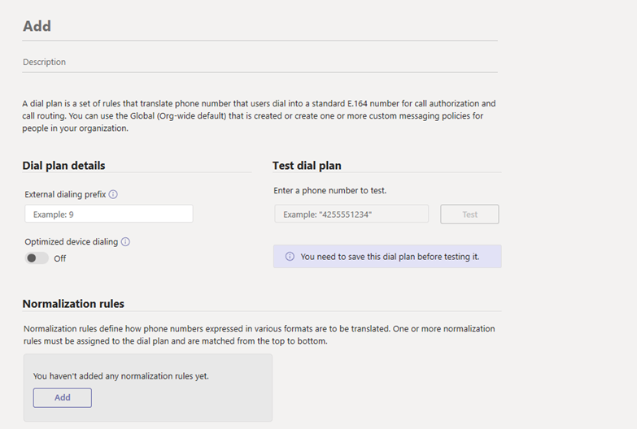

# <a name="create-and-manage-dial-plans"></a>다이얼 플랜 만들기 및 관리

조직의 전화 걸기 계획을 계획하고 음성 라우팅을 위해 만들어야 하는 모든 정규화 규칙을 확인한 후 다이얼 계획을 만들 준비가 된 것입니다. 유효한 라이선스가 있는 관리자 계정으로 Teams 관리 센터 또는 Microsoft Teams Windows PowerShell 수 있습니다.  

## <a name="using-the-microsoft-teams-admin-center"></a>Microsoft Teams 관리 센터 사용

### <a name="create-a-dial-plan"></a>다이얼 요금제 만들기

1. 관리 센터의 왼쪽 Microsoft Teams 음성 전화 걸기 계획으로  >  **이동하세요.**
2. 추가 **를** 클릭한 다음 다이얼 요금제에 대한 이름과 설명을 입력합니다.
    
3. 전화 **걸기 계획 세부** 정보에서 사용자가 외부 줄을 얻기 위해 하나 이상의 앞자리(예: 9)에 전화를 걸 필요가 있는 경우 외부 전화 걸기 전단을 지정합니다. 이 작업을 위해:
    1. 외부 전화 **걸기** 연사 상자에 외부 전화 접속 도두사에 입력합니다. 이 연결선은 최대 4자(#,*, 0-9)일 수 있습니다.
    2. 최적화된 **디바이스 전화 걸기를 켜기** 외부 전화 걸기 전신을 지정하는 경우 조직 외부에서 호출할 수 있도록 이 설정을 켜서 도우미를 적용해야 합니다.
4. 정규화 **규칙에서** 다이얼 계획에 대해 하나 이상의 정규화 [규칙을](what-are-dial-plans.md#normalization-rules) 구성하고 연결합니다. 각 다이얼 계획에는 하나 이상의 정규화 규칙이 연결되어 있어야 합니다.  이렇게 하여 다음 중 하나 이상을 합니다.
    - 새 정규화 규칙을 만들고 다이얼 계획과 연결하려면 **추가를** 클릭한 다음 규칙을 정의합니다.
    - 다이얼 계획과 이미 연결된 정규화 규칙을 편집하려면 규칙 이름의 왼쪽을 클릭하여 규칙을 선택한 다음 **편집을 클릭합니다.** 원하는 내용을 변경한 다음 저장을 **클릭합니다.**
    - 다이얼 계획에서 정규화 규칙을 제거하려면 규칙 이름의 왼쪽을 클릭하여 규칙을 선택한 다음 **제거를 클릭합니다.**
5. 정규화 규칙을 원하는 순서대로 정렬합니다. 이동 **또는** **아래로 이동을** 클릭하여 목록의 규칙 위치를 변경합니다.

    > [!NOTE]
    > Teams 위쪽에서 정규화 규칙 목록을 트래버스하고 전화 걸기 번호와 일치하는 첫 번째 규칙을 사용하세요. 전화 걸기 번호가 두 개 이상의 정규화 규칙과 일치하도록 전화 걸기 계획을 설정한 경우 더 제한적인 규칙이 덜 제한적인 규칙보다 정렬되어 있는지 확인합니다. "+"없이 전화 걸기 번호를 정규화하는 다이얼 플랜을 설정한 경우 호출 서비스는 테넌트 및 지역 전화 요금제 규칙을 사용하여 번호를 다시 정규화하려고 합니다. 두 번 정규화를 방지하기 위해 모든 정규화 규칙에서 숫자가 "+"로 시작하는 것이 좋습니다. 직접 라우팅 고객은 [트렁크](direct-routing-translate-numbers.md) 번역 규칙을 사용하여 필요한 경우 "+"를 제거할 수 있습니다. 

6. **저장** 을 클릭합니다.
7. 전화 걸기 계획을 테스트하려면 전화 걸기 계획에서 **전화** 번호를 입력한 다음 테스트 를 **클릭합니다.**

### <a name="edit-a-dial-plan"></a>다이얼 플랜 편집

1. 관리 센터의 왼쪽 Microsoft Teams 음성 전화 걸기 계획으로  >  **이동하세요.**
2. 다이얼 플랜 이름의 왼쪽을 클릭하여 다이얼 계획을 선택한 다음 **편집을 클릭합니다.**
3. 원하는 내용을 변경한 다음 저장을 **클릭합니다.**

### <a name="assign-a-dial-plan-to-users"></a>사용자에게 전화 걸기 요금제 할당

정책을 할당하는 방식과 동일한 방식으로 다이얼 플랜을 할당합니다. [!INCLUDE [assign-policy](includes/assign-policy.md)]

## <a name="using-powershell"></a>PowerShell 사용
  
### <a name="start-powershell"></a>PowerShell 시작
- 명령 Windows PowerShell 프롬프트를 열고 다음 명령을 실행합니다.

```powershell
  # When using Teams PowerShell Module

   Import-Module MicrosoftTeams
   $credential = Get-Credential
   Connect-MicrosoftTeams -Credential $credential
```
  
### <a name="create-and-manage-your-dial-plans"></a>다이얼 요금제 만들기 및 관리

단일 cmdlet 또는 PowerShell 스크립트를 사용하여 테넌트 다이얼 계획을 만들고 관리할 수 있습니다.
  
#### <a name="using-single-cmdlets"></a>단일 cmdlet 사용

- 새 다이얼 계획을 만들 경우 다음을 실행합니다.
    
  ```PowerShell
  New-CsTenantDialPlan -Identity RedmondDialPlan -Description "Dial Plan for Redmond" -NormalizationRules <pslistmodifier> -ExternalAccessPrefix 9 -SimpleName "Dial-Plan-for-Redmond"
  ```

    다른 예제 및 매개 변수는 [New-CsTenantDialPlan 을 참조합니다.](/powershell/module/skype/new-cstenantdialplan)
    
- 기존 다이얼 플랜의 설정을 편집하려면 다음을 실행합니다.
    
  ```PowerShell
  Set-CsTenantDialPlan -Identity RedmondDialPlan  -NormalizationRules <pslistmodifier> -ExternalAccessPrefix 9
    -SimpleName "Dial-Plan-for-Redmond"
  ```

    다른 예제 및 매개 변수는 [Set-CsTenantDialPlan 을 참조합니다.](/powershell/module/skype/set-cstenantdialplan)
    
- 다이얼 플랜에 사용자를 추가하기 위해 다음을 실행합니다.
    
  ```PowerShell
  Grant-CsTenantDialPlan -Identity amos.marble@contoso.com -PolicyName RedmondDialPlan
  ```

    다른 예제 및 매개 변수는 [Grant-CsTenantDialPlan 을 참조합니다.](/powershell/module/skype/grant-cstenantdialplan)
    
- 다이얼 플랜에서 설정을 보시고 다음을 실행합니다.
    
  ```PowerShell
  Get-CsTenantDialPlan -Identity RedmondDialPlan
  ```

    다른 예제 및 매개 변수는 [Get-CsTenantDialPlan 을 참조합니다.](/powershell/module/skype/get-cstenantdialplan?view=skype-ps)
    
- 다이얼 플랜을 삭제하려면 다음을 실행합니다.
    
  ```PowerShell
  Remove-CsTenantDialPlan -Identity RedmondDialPlan -force
  ```

    다른 예제 및 매개 변수는 [Remove-CsTenantDialPlan 을 참조합니다.](/powershell/module/skype/remove-cstenantdialplan?view=skype-ps)
    
- 효과적인 다이얼 플랜의 설정을 표시하려면 다음을 실행합니다.
    
  ```PowerShell
  Get-CsEffectiveTenantDialPlan -Identity amos.marble@contoso.com
  ```

    다른 예제 및 매개 변수는 [Get-CsEffectiveTenantDialPlan 을 참조합니다.](/powershell/module/skype/get-cseffectivetenantdialplan)
    
- 다이얼 플랜의 효과적인 설정을 테스트하려면 다음을 실행합니다.
    
  ```PowerShell
  Test-CsEffectiveTenantDialPlan -DialedNumber 14255550199 -Identity amos.marble@contoso.com
  ```

    다른 예제 및 매개 변수는 [Test-CsEffectiveTenantDialPlan 을 참조합니다.](/powershell/module/skype/test-cseffectivetenantdialplan?view=skype-ps)
    
#### <a name="using-a-powershell-script"></a>PowerShell 스크립트 사용

테넌트 다이얼 플랜을 먼저 삭제하지 않고 테넌트 다이얼 플랜과 연결된 정규화 규칙을 삭제하려면 이 규칙을 실행합니다.
```PowerShell
$b1=New-CsVoiceNormalizationRule -Identity Global/NR4 -InMemory
Set-CsTenantDialPlan -Identity RedmondDialPlan -NormalizationRules @{add=$b1}
(Get-CsTenantDialPlan -Identity RedmondDialPlan).NormalizationRules
$b2=New-CsVoiceNormalizationRule -Identity Global/NR4 -InMemory
Set-CsTenantDialPlan -Identity RedmondDialPlan -NormalizationRules @{remove=$b2}
```
이 규칙을 실행하여 RedmondDialPlan이라는 기존 테넌트 다이얼 계획에 다음 정규화 규칙을 추가합니다.
```PowerShell
$nr1=New-CsVoiceNormalizationRule -Parent Global -Description 'Organization extension dialing' -Pattern '^(\\d{3})$' -Translation '+14255551$1' -Name NR1 -IsInternalExtension $false -InMemory
Set-CsTenantDialPlan -Identity RedmondDialPlan -NormalizationRules @{add=$nr1}
```
이 규칙을 실행하여 RedmondDialPlan이라는 기존 테넌트 다이얼 계획에서 다음 정규화 규칙을 제거합니다.
```PowerShell
$nr1=New-CsVoiceNormalizationRule -Parent Global/NR1 -InMemory
Set-CsTenantDialPlan -Identity RedmondDialPlan -NormalizationRules @{remove=$nr1}
```

기존 정규화 규칙을 검사하고 삭제할 규칙을 결정한 다음 해당 인덱스를 사용하여 제거하려는 경우 다음을 실행합니다. 정규화 규칙의 배열은 인덱스 0으로 시작합니다. 인덱스 1인 3자리 정규화 규칙을 제거합니다.
  
```PowerShell
Get-CsTenantDialPlan RedmondDialPlan).NormalizationRules
Description         : 4-digit
Pattern             : ^(\\d{4})$
Translation         : +1426666$1
Name                : NR2
IsInternalExtension : False

Description         : 3-digit
Pattern             : ^(\\d{3})$
Translation         : +14255551$1
Name                : NR12
IsInternalExtension : False

$nr1=(Get-CsTenantDialPlan RedmondDialPlan).NormalizationRules[1]
Set-CsTenantDialPlan -Identity RedmondDialPlan -NormalizationRules @{remove=$nr1}
```

이 실행을 실행하여 RedmondDialPlan 테넌트 다이얼 플랜에 부여된 모든 사용자를 찾습니다.
  
```PowerShell
Get-CsOnlineUser | Where-Object {$_.TenantDialPlan -eq "RedmondDialPlan"}
```

이 작업을 실행하여 HostingProvider가 있는 모든 사용자에서 할당된 TenantDialPlan을 sipfed.online.lync.com.
```PowerShell
Get-CsOnlineUser -Filter {HostingProvider -eq "sipfed.online.lync.com"} | Grant-CsTenantDialPlan -policyname $null
```

조직에 대한 테넌트 다이얼 플랜으로 OPDP1이라는 기존 On-프레미스 다이얼 플랜을 추가합니다. 먼저 프레미스 전화 걸기 계획을 .xml 파일로 저장한 다음 새 테넌트 다이얼 계획을 만드는 데 사용해야 합니다.
  
이 실행을 실행하여 프레미스 전화 걸기 계획을 .xml 저장합니다.
  
```PowerShell
$DPName = "OPDP1"
$DPFileName = "dialplan.xml"
Get-CsDialplan $DPName | Export-Clixml $DPFileName
```

이 실행을 실행하여 새 테넌트 다이얼 계획을 만들 수 있습니다.
  
```PowerShell
$DPFileName = "dialplan.xml"
$dp = Import-Clixml $DPFileName
$NormRules = @()
ForEach($nr in $dp.NormalizationRules)
{
 $id1 = "Global/" + $nr.Name
 $nr2 = New-CsVoiceNormalizationRule -Identity $id1 -Description $nr.Description -Pattern $nr.Pattern -Translation $nr.Translation -IsInternalExtension $nr.IsInternalExtension -InMemory
 $NormRules += $nr2
}
New-CsTenantDialPlan -Identity $dp.SimpleName -ExternalAccessPrefix $dp.ExternalAccessPrefix -Description $dp.Description -OptimizeDeviceDialing $dp.OptimizeDeviceDialing -SimpleName $dp.SimpleName -NormalizationRules $NormRules
```
    
## <a name="related-topics"></a>관련 항목

- [다이얼 플랜이 무엇인가요?](what-are-dial-plans.md)
- [전화 번호 전송 자주 묻는 질문](./phone-number-calling-plans/port-order-overview.md)
- [통화 계획에 사용되는 다양한 종류의 전화 번호](different-kinds-of-phone-numbers-used-for-calling-plans.md)
- [조직의 전화 번호 관리](manage-phone-numbers-for-your-organization/manage-phone-numbers-for-your-organization.md)
- [긴급 통화 사용 약관](emergency-calling-terms-and-conditions.md)
- [긴급 호출 고지 레이블](https://github.com/MicrosoftDocs/OfficeDocs-SkypeForBusiness/blob/live/Teams/downloads/emergency-calling/emergency-calling-label-(en-us)-(v.1.0).zip?raw=true)
- [Teams PowerShell 개요](teams-powershell-overview.md)
